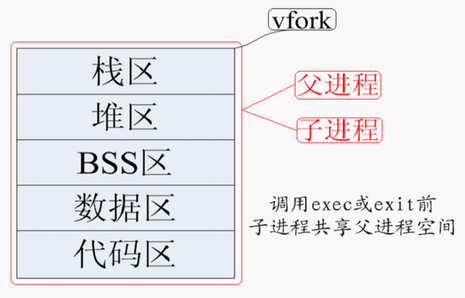
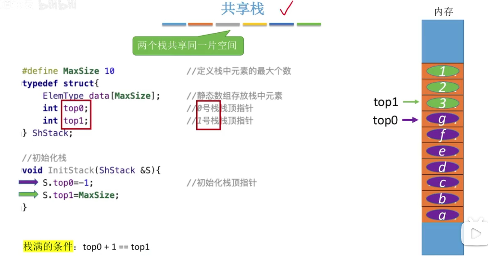
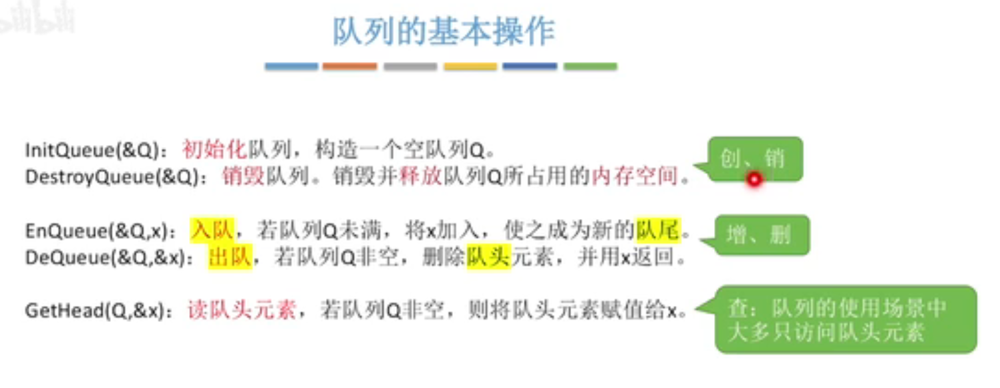
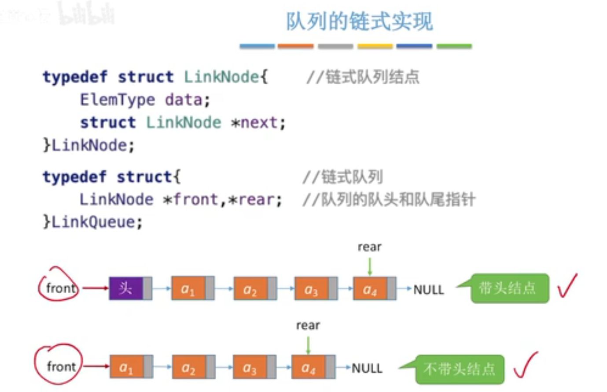
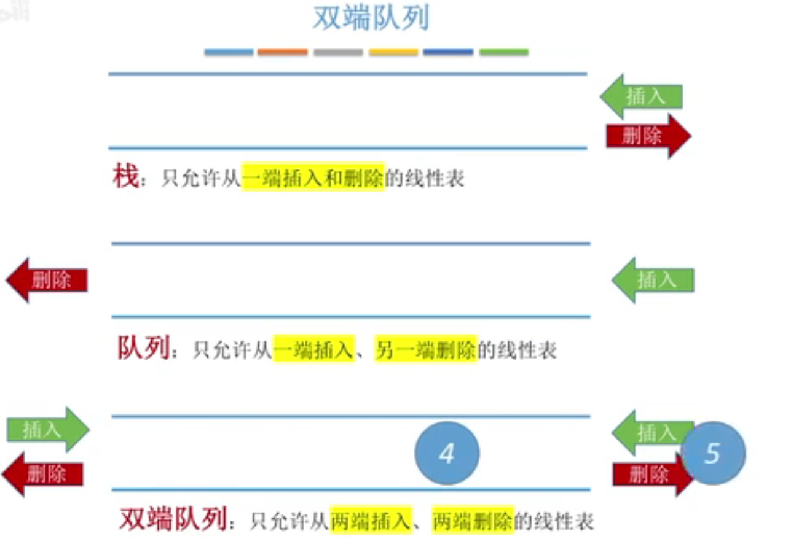

## 1、define、ifdef、ifndef

```c++
#define            定义一个预处理宏
#undef            取消宏的定义

#if                   编译预处理中的条件命令，相当于C语法中的if语句
#ifdef              判断某个宏是否被定义，若已定义，执行随后的语句
#ifndef            与#ifdef相反，判断某个宏是否未被定义
#elif                若#if, #ifdef, #ifndef或前面的#elif条件不满足，则执行#elif之后的语句，相当于C语法中的else-if
#else              与#if, #ifdef, #ifndef对应, 若这些条件不满足，则执行#else之后的语句，相当于C语法中的else
#endif             #if, #ifdef, #ifndef这些条件命令的结束标志.
defined         　与#if, #elif配合使用，判断某个宏是否被定义
```


## 2、pragma使用方法

```
 1、#pragma用于指示编译器完成一些特定的动作
```

       2、#pragma所定义的很多指示字是编译器特有的(每种编译可能都不一样)
    
              （1）#pragma message 用于自定义编译信息
    
              （2）#pragma once 用于保证头文件只被编译一次
    
              （3）#pragama pack用于指定内存对齐(一般用在结构体)
    
                        struct占用内存大小
    
                            1）第一个成员起始于0偏移处
    
                            2）每个成员按其类型大小和pack参数中较小的一个进行对齐
    
                                  ——偏移地址必须能被对齐参数整除
                                  ——结构体成员的对齐参数(注意是对齐参数，而不是结构体长度)取其内部长度最大的数据成员作为其大小
    
                            3）结构体总长度必须为所有对齐参数的整数倍
                            编译器在默认情况下按照4字节对齐
    
       3、#pragma在不同的编译器间是不可移植的
    
              （1）预处理器将忽略它不认识#pragma指令
    
              （2）不同的编译器可能以不同的方式解释同一条#pragma指令
详细参考：[C语言#pragma使用方法_c pragma-CSDN博客](https://blog.csdn.net/liuchunjie11/article/details/80502529)


## 3、new、new()和new[]区别

```
new A 来创建一个不确定值的对象或实例,new() 创建一个值为零的对象或实例.而new(X),用于创建一个被初始化为X的对象或实例.
只有当A是POD类型的时候,new A和new A()才会有上面的区别
何为POD?POD是plain old data的缩写,它是一个struct或者类,且不包含析构函数以及虚函数
当不是POD时,有构造函数时,两个都被初始化为零,属于默认构造.
没有构造函数是,两个都初始化为一个随机值,且两个值相同.
```

new和new[]区别

```
A * ptr = new A[10];//分配10个A对象

使用new[]分配的内存必须使用delete[]进行释放：

delete [] ptr;  //释放

new对数组的支持体现在它会分别调用构造函数函数初始化每一个数组元素，释放对象时为每个对象调用析构函数。注意delete[]要与new[]配套使用，不然会找出数组对象部分释放的现象，造成内存泄漏。

至于malloc，它并知道你在这块内存上要放的数组还是啥别的东西，反正它就给你一块原始的内存，在给你个内存的地址就完事。所以如果要动态分配一个数组的内存，还需要我们手动自定数组的大小：
int * ptr = (int *) malloc( sizeof(int)* 10 );//分配一个10个int元素的数组
```


## 4、C++类实例化的两种方式：new和不new的区别

```
A a;  // a存在栈上
A* a = new a();  // a存在堆中
```

1 前者在栈中分配内存，后者在堆中分配内存

2 动态内存分配会使对象的可控性增强

3 大程序用new，小程序不加new，直接申请

4 **new必须delete删除，不用new系统会自动回收内存**

- ```
  new创建类对象特点：
  
  - new创建类对象需要指针接收，一处初始化，多处使用
  - new创建类对象使用完需delete销毁
  - new创建对象直接使用堆空间，而局部不用new定义类对象则使用栈空间
  - new对象指针用途广泛，比如作为函数返回值、函数参数等
  - 频繁调用场合并不适合new，就像new申请和释放内存一样
  ```

  

## 5、new 动态数组

| int* pi = new int(1);     | 表示动态分配一个int ，初始化为 1  |
| ------------------------- | --------------------------------- |
| char* pc = new char('c'); | 和上方同理，初始化为字符c         |
| int* pa = new int[1];     | 表示动态分配一个数组，数组大小为1 |

### 删除方法（尤其注意）

```
char *str1=new char[5];
delete [] str1;//创建用new []，释放用delete []
char *str2=new char;
delete str2;//创建用new,释放用delete
```

疑问： Box* myBoxArray = new Box[4]; 在菜鸟教程里面有这么一段代码，对一个对象开辟4个数组，这到底是干嘛的，要怎么用？

### 一维数组

```
// 动态分配,数组长度为 m
int *array=new int [m];
 
//释放内存
delete [] array;
```


### 二维数组

```c++
int **array;
// 假定数组第一维长度为 m， 第二维长度为 n
// 动态分配空间
array = new int *[m];
for( int i=0; i<m; i++ )
{
    array[i] = new int [n];
}
//释放
for( int i=0; i<m; i++ )
{
    delete [] array[i];
}
delete [] array;
```

### 三维数组

```c++
int ***array;
// 假定数组第一维为 m， 第二维为 n， 第三维为h
// 动态分配空间
array = new int **[m];
for( int i=0; i<m; i++ )
{
    array[i] = new int *[n];
    for( int j=0; j<n; j++ )
    {
        array[i][j] = new int [h];
    }
}
//释放
for( int i=0; i<m; i++ )
{
    for( int j=0; j<n; j++ )
    {
        delete[] array[i][j];
    }
    delete[] array[i];
}
delete[] array;
```

### vector动态数组

首先介绍一下容器的方法：a.resize()方法使用：
a.resize(n):如果n>a.size()，则在a.end()之前插入n-a.size()个元素；否则，删除第n个元素之后的所有元素。
a.resize(n,t): 如果n>a.size(), 则在a.end()之前插入 t 的n-a.size()个拷贝；否则，删除第n个元素之后的所有元素。

```c++
方法一：
vector<vector<int> > a;
a.resize(row, vector<int>(column));

方法二：
vector<vector<int> > a(row, vector<int>(column)); //默认用0初始化
//vector<vector<int> > a(row, vector<int>(column,-1));//用-1初始化二维数组
注：如果row > a.size()，则在a.end()之前插入vector<int>(column)的row次拷贝，相当于row行column列

方法三：
vector<vector<int> > a;
a.resize(row);
for (int i = 0; i < row; ++i)
	a[i].resize(column);

```


## 6、new类的用法

**类(class)的基本概念和用法**

①对象：通过类，我们可以自定义变量(与结构体相似)。由类定义出来的变量又称为类的实例，也就是我们所说的对象。

②**内存分配**：对象所占用的内存空间的大小，等于所有成员变量的大小之和。

③对象间的运算：和结构变量一样，对象之间可以用”=”进行赋值(**复制构造函数**),但在未经重载的情况下不可以用”==”,”>”,”<”等运算符进行比较。(重载就是重新定义这些运算符,利用operaor操作)

④使用类的成员变量和成员函数:

```c++
#include <iostream>
using namespace std;
 
class Box
{
   public:
      double length;   // 长度
      double breadth;  // 宽度
      double height;   // 高度
      // 成员函数声明
      double get(void);
      void set( double len, double bre, double hei );
};
// 成员函数定义
double Box::get(void)
{
    return length * breadth * height;
}
 
void Box::set( double len, double bre, double hei)
{
    length = len;
    breadth = bre;
    height = hei;
}
int main( )
{
   Box Box1;        // 声明 Box1，类型为 Box
   Box Box2;        // 声明 Box2，类型为 Box
   Box Box3;        // 声明 Box3，类型为 Box
   double volume = 0.0;     // 用于存储体积
 
   // box 1 详述
   Box1.height = 5.0; 
   Box1.length = 6.0; 
   Box1.breadth = 7.0;
 
   // box 2 详述
   Box2.height = 10.0;
   Box2.length = 12.0;
   Box2.breadth = 13.0;
 
   // box 1 的体积
   volume = Box1.height * Box1.length * Box1.breadth;
   cout << "Box1 的体积：" << volume <<endl;
 
   // box 2 的体积
   volume = Box2.height * Box2.length * Box2.breadth;
   cout << "Box2 的体积：" << volume <<endl;
 
 
   // box 3 详述
   Box3.set(16.0, 8.0, 12.0); 
   volume = Box3.get(); 
   cout << "Box3 的体积：" << volume <<endl;
   return 0;
}
```

### 调用方式

方式一：**对象名.成员名**

```c++
#int main()
{
	Box b1,b2;
	b1.w=5;
	b2.w=3;
}
```

方式二：**指针->成员名**

```c++
#int main()
{
	Box b1,b2;
	Box *p1 = &b1;
	Box *p2 = &b2;
	p1->w=5;
	p2->w=3;
}
```

方式三：**引用名.成员名**

```c++
#int main()
{
	Box b1;
	Box & p = b1;
	p.w=5;
}
```

方式四：重载+构造函数

```c++
class a
{
	private:
	int b;
	int c;
public:
	a(int d,int e)
	{
		b=d;
		c=e;
	}
	a(int d)
	{
		b=d;
	}
}
#int main()
{
	a aa={1,2};
	a aa(1,2);
}
```

方式五：

### 派生类

一个派生类继承了所有的基类方法，但下列情况除外：

- 基类的构造函数、析构函数和拷贝构造函数。
- 基类的重载运算符。
- 基类的友元函数。

```c
#include <iostream>
using namespace std;
// 基类
class Shape 
{
   public:
      void setWidth(int w)
      {
         width = w;
      }
      void setHeight(int h)
      {
         height = h;
      }
   protected:
      int width;
      int height;
};
 
// 派生类
class Rectangle: public Shape
{
   public:
      int getArea()
      { 
         return (width * height); 
      }
};
 
int main(void)
{
   Rectangle Rect;
 
   Rect.setWidth(5);
   Rect.setHeight(7);
 
   // 输出对象的面积
   cout << "Total area: " << Rect.getArea() << endl;
 
   return 0;
}
```

### 多继承


```c++
#include <iostream>
using namespace std;
// 基类 Shape
class Shape 
{
   public:
      void setWidth(int w)
      {
         width = w;
      }
      void setHeight(int h)
      {
         height = h;
      }
   protected:
      int width;
      int height;
};
 
// 基类 PaintCost
class PaintCost 
{
   public:
      int getCost(int area)
      {
         return area * 70;
      }
};
 
// 派生类
class Rectangle: public Shape, public PaintCost
{
   public:
      int getArea()
      { 
         return (width * height); 
      }
};
 
int main(void)
{
   Rectangle Rect;
   int area;
 
   Rect.setWidth(5);
   Rect.setHeight(7);
 
   area = Rect.getArea();
   
   // 输出对象的面积
   cout << "Total area: " << Rect.getArea() << endl;
 
   // 输出总花费
   cout << "Total paint cost: $" << Rect.getCost(area) << endl;
 
   return 0;
}
//结果
//Total area: 35
//Total paint cost: $2450
```


## 8、关键字operator

```
Box operator+(const Box&);
```

```
#include <iostream>
using namespace std;
class Box
{
   public:
 
      double getVolume(void)
      {
         return length * breadth * height;
      }
      void setLength( double len )
      {
          length = len;
      }
 
      void setBreadth( double bre )
      {
          breadth = bre;
      }
 
      void setHeight( double hei )
      {
          height = hei;
      }
      // 重载 + 运算符，用于把两个 Box 对象相加
      Box operator+(const Box& b)
      {
         Box box;
         box.length = this->length + b.length;
         box.breadth = this->breadth + b.breadth;
         box.height = this->height + b.height;
         return box;
      }
   private:
      double length;      // 长度
      double breadth;     // 宽度
      double height;      // 高度
};
// 程序的主函数
int main( )
{
   Box Box1;                // 声明 Box1，类型为 Box
   Box Box2;                // 声明 Box2，类型为 Box
   Box Box3;                // 声明 Box3，类型为 Box
   double volume = 0.0;     // 把体积存储在该变量中
 
   // Box1 详述
   Box1.setLength(6.0); 
   Box1.setBreadth(7.0); 
   Box1.setHeight(5.0);
 
   // Box2 详述
   Box2.setLength(12.0); 
   Box2.setBreadth(13.0); 
   Box2.setHeight(10.0);
 
   // Box1 的体积
   volume = Box1.getVolume();
   cout << "Volume of Box1 : " << volume <<endl;
 
   // Box2 的体积
   volume = Box2.getVolume();
   cout << "Volume of Box2 : " << volume <<endl;
 
   // 把两个对象相加，得到 Box3
   Box3 = Box1 + Box2;
 
   // Box3 的体积
   volume = Box3.getVolume();
   cout << "Volume of Box3 : " << volume <<endl;
 
   return 0;
}
结果如下
Volume of Box1 : 210
Volume of Box2 : 1560
Volume of Box3 : 5400
```


## 多态

**多态**按字面的意思就是多种形态。当类之间存在层次结构，并且类之间是通过继承关联时，就会用到多态。

C++ 多态意味着调用成员函数时，会根据调用函数的对象的类型来执行不同的函数。

```
#include <iostream> 
using namespace std;
 
class Shape {
   protected:
      int width, height;
   public:
      Shape( int a=0, int b=0)
      {
         width = a;
         height = b;
      }
      virtual int area()  //需要设置为虚函数
      {
         cout << "Parent class area :" <<endl;
         return 0;
      }
};
class Rectangle: public Shape{
   public:
      Rectangle( int a=0, int b=0):Shape(a, b) { }
      int area ()
      { 
         cout << "Rectangle class area :" <<endl;
         return (width * height); 
      }
};
class Triangle: public Shape{
   public:
      Triangle( int a=0, int b=0):Shape(a, b) { }
      int area ()
      { 
         cout << "Triangle class area :" <<endl;
         return (width * height / 2); 
      }
};
// 程序的主函数
int main( )
{
   Shape *shape;
   Rectangle rec(10,7);
   Triangle  tri(10,5);
 
   // 存储矩形的地址
   shape = &rec;
   // 调用矩形的求面积函数 area
   shape->area();
 
   // 存储三角形的地址
   shape = &tri;
   // 调用三角形的求面积函数 area
   shape->area();
   
   return 0;
}
```

结果：

```
Rectangle class area :
Triangle class area :
```

### 虚函数

**虚函数** 是在基类中使用关键字 **virtual** 声明的函数。在派生类中重新定义基类中定义的虚函数时，会告诉编译器不要静态链接到该函数。

我们想要的是在程序中任意点可以根据所调用的对象类型来选择调用的函数，这种操作被称为**动态链接**，或**后期绑定**。

### 纯虚函数

## 纯虚函数

您可能想要在基类中定义虚函数，以便在派生类中重新定义该函数更好地适用于对象，但是您在基类中又不能对虚函数给出有意义的实现，这个时候就会用到纯虚函数。

我们可以把基类中的虚函数 area() 改写如下：

```
class Shape {
   protected:
      int width, height;
   public:
      Shape( int a=0, int b=0)
      {
         width = a;
         height = b;
      }
      // pure virtual function
      virtual int area() = 0;
};
```

= 0 告诉编译器，函数没有主体，上面的虚函数是**纯虚函数**。

## 虚拟地址空间

- **bss段（bss segment）：**bss是Block Started by Symbol的简称，用来存放程序中未初始化的全局变量的内存区域，属于静态内存分配。
- **data段（data segment）**：用来存放程序中已初始化的全局变量的内存区域，属于静态内存分配。
- **text段（text segment）（代码段）：**用来存放程序执行代码的内存区域。这部分区域的大小在程序运行前就已经确定，并且内存区域通常属于只读（某些架构也允许代码段为可写，即允许修改程序）。也有可能包含一些只读的常数变量，例如字符串常量等。
- **堆（heap）：**用于存放进程运行中被动态分配的内存段，它的大小并不固定，可动态扩张或缩减。
- **栈（stack）：**用户存放程序临时创建的局部变量，也就是说我们函数括弧“{}”中定义的变量（但不包括static声明的变量，static意味着在data段中存放变量）。除此以外，在函数被调用时，其参数也会被压入发起调用的进程栈中，并且待到调用结束后，函数的返回值也会被存放回栈中。


### bss段与data段的区别

在初始化时 bss 段部分将会清零。bss 段属于静态内存分配，即程序一开始就将其清零了。
比如，在C语言之类的程序编译完成之后，已初始化的全局变量保存在.data 段中，未初始化的全局变量保存在.bss 段中。

- text 和 data 段都在**可执行文件中**，由系统从可执行文件中加载；
- 而 bss 段**不在可执行文件中**，由系统初始化。


## 内存隔离

使用了 **虚拟地址空间**

用户态进程每次访问内存，都要通过页表，**操作系统只要控制页表**，把不同进程的虚拟地址映射到不同的物理地址上，**就可以实现进程间的内存隔离了**。同时，用户代码不能访问页表，所以用户进程也就不能修改内存映射了。


## 静态库与动态库

**静态库（.a、.lib）**

这类库在编译的时候会直接整合到目标程序中，所以利用静态函数库编译成的文件会比较大。

**优点：**

①静态库被打包到应用程序中加载速度快
②发布程序无需提供静态库，移植方便

**缺点：**

①相同的库文件数据可能在内存中被加载多份，消耗系统资源，浪费内存
②库文件更新需要重新编译项目文件，生成新的可执行程序，浪费时间。


**动态库（.so、.dll）**

与静态函数库被整个捕捉到程序中不同，动态函数库在编译的时候，在程序里只有一个“指向”的位置而已，也就是说当可执行文件需要使用到函数库的机制时，程序才会去读取函数库来使用

①可实现不同进程间的资源共享
②动态库升级简单，只需要替换库文件，无需重新编译应用程序
③可以控制何时加载动态库，不调用库函数动态库不会被加载                                                       

缺点：

①加载速度比静态库慢
②发布程序需要提供依赖的动态库


## **C++** **中内存分配情况**

**栈**：由编译器管理分配和回收，存放局部变量和函数参数。

**堆**：由程序员管理，需要⼿动 new malloc delete free 进⾏分配和回收，空间较⼤，但可能会出现内存泄漏和空闲碎⽚的情况。

**全局/静态存储区**：分为初始化和未初始化两个相邻区域，存储初始化和未初始化的全局变量和静态变量。

**常量存储区**：存储常量，⼀般不允许修改。

**代码区**：存放程序的⼆进制代码。


## 内联函数

在C语言中，如果一些函数被频繁调用，不断地有函数入栈，即函数栈，会造成栈空间或栈内存的大量消耗。为了解决这个问题，特别的引入了inline修饰符，表示为内联函数。

（1）内联是以代码膨胀（复制）为代价，仅仅省去了函数调用的开销，从而提高函数的执行效率。


## strcpy , memset函数实现

```
char* strcpy(char *dest,const char *src) {
     char *ret = dest;
     assert(dest!=NULL);//优化点1：检查输⼊参数
     assert(src!=NULL);
     while(*src!='\0')
     	*(dest++)=*(src++);
     *dest='\0';//优化点2：⼿动地将最后的'\0'补上
     return ret;
}
//考
```

```

void *my_memset(void *dest, int set, unsigned len)
{
	if (dest == NULL || len < 0)
	{
		return NULL;
	}
	char *pdest = (char *)dest;
	while (len-->0)
	{
		*pdest++ = set;
	}
	return dest;
```


```
//把 str1 所指向的字符串和 str2 所指向的字符串进⾏⽐较。
//该函数返回值如下：
//如果返回值 < 0，则表示 str1 ⼩于 str2。
//如果返回值 > 0，则表示 str1 ⼤于 str2。
//如果返回值 = 0，则表示 str1 等于 str2。
int strcmp(const char *s1,const char *s2) {
     assert(s1!=NULL);
     assert(s2!=NULL);
     while(*s1!='\0' && *s2!='\0') {
         if(*s1>*s2)
         	return 1;
         else if(*s1<*s2)
         	return -1;
         else {
         	s1++,s2++;
     }
     }
     //当有⼀个字符串已经⾛到结尾
     if(*s1>*s2)
     	return 1;
     else if(*s1<*s2)
     	return -1;
     else
     	return 0;
}
```


```
//把 src 所指向的字符串追加到 dest 所指向的字符串的结尾。
char* strcat(char *dest,const char *src) {
     //1. 将⽬的字符串的起始位置先保存，最后要返回它的头指针
     //2. 先找到dest的结束位置,再把src拷⻉到dest中，记得在最后要加上'\0'
     char *ret = dest;
     assert(dest!=NULL);
     assert(src!=NULL);
     while(*dest!='\0')
     	dest++;
     while(*src!='\0')
      	*(dest++)=*(src++);
     *dest='\0';
     return ret;
}
```


assert函数

用于在运行时检查一个条件是否为真，如果条件不满足，则运行时将终止程序的执行并输出一条错误信息。


## 位域

C 语言的位域（bit-field）是一种特殊的结构体成员，允许我们按位对成员进行定义，指定其占用的位数。


## signed和unsigned

**signed**关键字只能用于修饰整数类型，不能用于修饰浮点类型或其他类型。

- **signed**关键字不能和**const**，**volatile**或**static**等其他修饰符混用，这会造成语义错误。如果想要表示一个常量，易变量或静态变量，只需要在**signed**关键字之前或之后使用相应的修饰符即可。
- 

**有符号整数**和**无符号整数**

C语言中的有符号整数类型有四种：signed char，signed short，signed int和signed long。它们的取值范围和精度取决于编译器和平台的实现，但一般来说，它们遵循以下规则：

signed char的取值范围是-128到127，占用1个字节（8位）的存储空间。
signed short的取值范围是-32768到32767，占用2个字节（16位）的存储空间。
signed int的取值范围是-2147483648到2147483647，占用4个字节（32位）的存储空间。
signed long的取值范围是-9223372036854775808到9223372036854775807，占用8个字节（64位）的存储空间。
————————————————————————————————————————————————————————————

有符号整数的表示方法是采用二进制补码，也就是说，最高位（最左边的一位）是符号位，用于表示正负，0表示正，1表示负。其余的位是数值位，用于表示数值的大小。例如，以下是一些有符号整数的二进制补码表示：

42的二进制补码是00000000 00000000 00000000 00101010，符号位是0，表示正数，数值位是101010，表示42。
-42的二进制补码是11111111 11111111 11111111 11010110，符号位是1，表示负数，数值位是101010的按位取反加一，也就是010101的取反是101010，再加一是101011，表示-42。
0的二进制补码是00000000 00000000 00000000 00000000，符号位是0，表示正数，数值位是全0，表示0。
-128的二进制补码是10000000，符号位是1，表示负数，数值位是全0，表示-128。
————————————————


## typedef

### 1、传统的用法

C 语言提供了 **typedef** 关键字，您可以使用它来为类型取一个新的名字。下面的实例为单字节数字定义了一个术语 **BYTE**：

```
typedef unsigned char BYTE;
```

在这个类型定义之后，标识符 BYTE 可作为类型 **unsigned char** 的缩写，例如：

```
BYTE  b1, b2;
```

### 2、结构体中的使用

在旧的版本中，形式为：<font color='blue'> struct 结构名 对象名 </font>

```
struct Student
{
	int a;
};
struct Student Stu1;   
```

在新的用法中，形式为：<font color='blue'>结构名 对象名 </font>

```
typedef struct Student
{
	int a;
}Stu;
Stu stu1;  //这里的Stu就相当于struct student的别名
```

#### 需要注意的地方

在C++当中使用，要注意区别

```
struct Student
{
	int a;
}stu1;//stu1是一个变量
stu1.a;  //调用方法
```

```
struct 结构名
{
类型 变量名;
类型 变量名;
...
} 结构变量;

```

<font color='red'>结构名是结构的标识符不是变量名。</font>

```
typedef struct 结构名
{
类型 变量名;
类型 变量名;
...
} 结构别名;
```

<font color='red'>在C中，struct不能包含函数。在C++中，对struct进行了扩展，可以包含函数。</font>

```
typedef struct Student2
{
	int a;
}stu2;//stu2是一个结构体类型
stu2 s2;
s2.a=10;  //调用方法
```

使用时可以直接访问<font color='red'>stu1.a </font>
但是stu2则必须先 stu2 s2;
然后 s2.a=10;


### 3、typedef和define的区别

- **typedef** 仅限于为类型定义符号名称，**#define** 不仅可以为类型定义别名，也能为数值定义别名，比如您可以定义 1 为 ONE。
- **typedef** 是由编译器执行解释的，**#define** 语句是由预编译器进行处理的。


## using的使用方法

命名空间

1、导入命名空间

```
// 导入整个命名空间到当前作用域
using namespace std;
// 只导入某个变量到当前作用域 
using std::cout; 
```

2、指定别名

C++ 11 通过 using 指定别名，作用等同于 typedef，但相比 typedef，逻辑更直观，可读性更好。

```
typedef int T; // 用 T 代替 int
using T = int; // 用 T 代替 int
```

3、在派生类中引用基类成员


## template 函数模板

1. **为什么有函数模板**
   当某几个函数算法相同但是参数的类型不同时，使用函数模板能够简化代码量，使程序更简洁

2. **函数模板是什么**
   函数模板就是将具体函数中的数据类型参数化—即用通用的参数取代函数中具体的数据类型，从而形成一个通用模板来代表数据类型不同的一组函数。

3. 函数模板怎么用
   定义函数模板的语法如下：

```
template <class T1,class T2,…,class Tn>
返回值类型 函数名(用模板参数取代具体类型的形参列表)
{
    用模板参数取代具体数据类型的函数体；
}
```

实例用法：

```
#include<stdio.h>
template<class T>
T max(T num1, T num2)  //函数模板
{
    T themax;
    themax = (num1 >= num2) ? num1 : num2;
    return themax;
}
int main() {
    int x1;
    double x2;
    x1 = max(1, 2);
    x2 = max(1.2, 2.2);
    printf("%d %.3f", x1, x2);
    return 0;
}
```


## char/unsigned char  char*/unsigned char *区别

vc编译器、x86上的 gcc 都把 char 定义为 signed char；而 arm-linux-gcc 却把 char 定义为 unsigned char 

（1）char和unsigned char

相同点：在内存中都是一个字节，8位（2^8=256），都能表示256个数字
不同点：char的最高位为符号位，因此char能表示的数据范围是-128~127，unsigned char没有符号位，因此能表示的数据范围是0~255

```
char a = -1;					//结果 -1
signed char b = -1;				//结果 -1
unsigned char c = -1;			//结果 255
```

（2）char*和unsigned char *

char*是有符号的，如果大于127即0x7F的数就是负数了，使用%x格式化输出，系统自动进行了符号扩展，就会产生变化。

在C语言中，unsigned char* 和 char*之间可以进行隐式转换：

	char buffer[2048] = {"hello world!"};
	unsigned char* p;
	p = buffer;		//编译器不报错
但在C++中，unsigned char* 和 char*之间不可以进行隐式转换：

```
char buffer[2048] = {"hello world!"};
unsigned char* address_mac = nullptr;
address_mac = buffer;	//不能将 "char *" 类型的值分配到 "unsigned char *" 类型的实体*
```

```
unsigned char buffer[2048] = { "hello world!" };
char* address_mac = nullptr;
address_mac = buffer;    //不能将 "unsigned char *" 类型的值分配到 "char *" 类型的实体
```


## printf格式

1. %d 有符号10进制整数

2. %i 有符号10进制整数
3. %o 无符号8进制整数
4. %u 无符号10进制整数
5. %x 无符号的16进制数字，并以小写abcdef表示
6. %X 无符号的16进制数字，并以大写ABCDEF表示
7. %F/f 浮点数
8. %E/e 用科学表示格式的浮点数
9. %g 使用%f和%e表示中的总的位数表示最短的来表示浮点数 G 同g格式，但表示为指数
10. %c 单个字符
11. %s 字符串
12. %p 将所给存储单元以十六进制输出指针变量对应的地址值。

**（1）整型数**

%d，十进制整型；------->有符号的十进制整型

%ld, 十进制长整型；

%3d, 位数为3，不足在左边补空格；

%-3d, 位数为3，不足在右边补空格；（-可以理解为非，默认是在左边加0和空格的，-表示不是在左边，那就是在右边了？）

%05d, 位数为5，不足的在左边补0 //不可能在右边补0
<font color=purple>%u, 无符号十进制整型；</font> 

%lu, 无符号十进制长整型； 变量类型为 unsigned long

%o, 无符号八进制整型；//形如012

%lo, 无符号八进制长整型；

%x, 无符号十六进制整型；//形如0x12

%X, 无符号十六进制整型大写；//形如0xAA

<font color=purple>%04x, 位数为4，不足的在左边补0-------------------->经常使用</font>  

%lx,无符号十六进制长整型；

**（2）实型**

%f   float

%lf  double实型；

m.n：<font color=purple>m指域宽</font>，即实型数所占的总的位数，包含小数点(并不是整数部分的位数！！）。<font color=purple>n指精度</font>,即实型数的小数位数。

未指定n时，隐含的精度为n=6位。即%f的话，输出的是6位小数。

%f：不指定宽度，整数部分全部输出并输出6位小数。
%m.nf：输出共占m列，其中有n位小数，如数值宽度小于m左端补空格。 
%-m.nf：输出共占n列，其中有n位小数，如数值宽度小于m右端补空格。

m的存在，与整型变量的位数类似，主要是为了保持数据的整齐。
**（3）字符**

%c,字符

**（4）字符串**

%s，字符串

%7s，字符串,不足7位的在左边补空格//形式跟int一样

<font color=purple>%07s，字符串，不足7位的在左边补0//形式跟int一样</font>

**（5）指针**

%p,指针


## 大小端

**所谓的大端模式**，就是高位字节排放在内存的低地址端，低位字节排放在内存的高地址端。

**所谓的小端模式**，就是低位字节排放在内存的低地址端，高位字节排放在内存的高地址端。

```
union{
        short i;
        char a[2];
    }u;
    u.a[0] = 0x11;
    u.a[1] = 0x02;
    printf("0x%02x\n",u.i);
```

## strcpy和memcpy区别

strcpy和memcpy是C语言中用于复制内存内容的函数，但它们有一些区别：

参数类型不同：

- strcpy的参数是两个字符数组（字符串），通常用于将一个字符串复制到另一个字符串中。例如：strcpy(dest, src)。
- memcpy的参数是两个void指针和一个size_t类型的整数，可以用于任意类型的内存块复制。例如：memcpy(dest, src, size)。

复制方式不同：

- strcpy会自动在源字符串末尾添加'\0'作为字符串结束标志，并将整个源字符串复制到目标字符串中（包括'\0'）。
- memcpy仅按字节进行逐一复制，没有对数据进行解释或处理。

安全性考虑：

- strcpy没有提供边界检查，如果目标缓冲区不足以容纳源字符串，可能导致缓冲区溢出问题。
- memcpy需要显式指定要复制的字节数，因此更加灵活且可以控制边界。

​	

## 怎么防止头文件重复调用导致的编译问题

在C/C++中，可以通过使用头文件保护（header guards）或者#pragma once指令来防止头文件重复调用导致的编译问题。

1. 头文件保护（Header Guards）：在头文件的开头和结尾添加预处理器指令，如下所示：
   \#ifndef HEADER_NAME_H #define HEADER_NAME_H *// 头文件内容* #endif *// HEADER_NAME_H*
   这样，在第一次包含该头文件时，`HEADER_NAME_H`宏会被定义，并且头文件内容会被包含。当再次遇到相同的头文件时，由于`HEADER_NAME_H`已经被定义，条件判断为假，则不会再次包含该头文件。
2. \#pragma once指令：直接在头文件开头添加`#pragma once`指令即可。这是一种更简洁的方式，告诉编译器只包含该头文件一次。


## 常见关键字

### Volatile

volatile的本意是“易变的” 因为访问寄存器要比访问内存单元快的多,所以编译器一般都会作减少存取内存的优化，但有可能会读脏数据。当要求使用volatile声明变量值的时候，系统总是重新从它所在的内存读取数据，即使它前面的指令刚刚从该处读取过数据。精确地说就是，遇到这个关键字声明的变量，编译器对访问该变量的代码就不再进行优化，从而可以提供对特殊地址的稳定访问；如果不使用valatile，则编译器将对所声明的语句进行优化。（简洁的说就是：volatile关键词影响编译器编译的结果，用volatile声明的变量表示该变量随时可能发生变化，与该变量有关的运算，不要进行编译优化，以免出错）。


volatile应该解释为“直接存取原始内存地址”比较合适，“易变的”这种解释简直有点误导人。

```
在本次线程内, 当读取一个变量时，为提高存取速度，编译器优化时有时会先把变量读取到一个寄存器中；以后，再取变量值时，就直接从寄存器中取值；当变量值在本线程里改变时，会同时把变量的新值copy到该寄存器中，以便保持一致。

当变量在因别的线程等而改变了值，该寄存器的值不会相应改变，从而造成应用程序读取的值和实际的变量值不一致。

当该寄存器在因别的线程等而改变了值，原变量的值不会改变，从而造成应用程序读取的值和实际的变量值不一致。
```

#### 一般用处

**（1）并行设备的硬件寄存器（如：状态寄存器）**

**存储器映射的硬件寄存器通常也要加 voliate，因为每次对它的读写都可能有不同意义。**

**2）中断服务程序中修改的供其它程序检测的变量，需要加volatile；**

当变量在触发某中断程序中修改，而编译器判断主函数里面没有修改该变量，因此可能只执行一次从内存到某寄存器的读操作，而后每次只会从该寄存器中读取变量副本，使得中断程序的操作被短路。

**3）多任务环境下各任务间共享的标志，应该加volatile；**

在本次线程内, 当读取一个变量时，编译器优化时有时会先把变量读取到一个寄存器中；以后，再取变量值时，就直接从寄存器中取值；当内存变量或寄存器变量在因别的线程等而改变了值，该寄存器的值不会相应改变，从而造成应用程序读取的值和实际的变量值不一致 。

**4）存储器映射的硬件寄存器通常也要加volatile说明，因为每次对它的读写都可能由不同意义；**

　　假设要对一个设备进行初始化，此设备的某一个寄存器为0xff800000。for(i=0;i< 10;i++) *output = i;前面循环半天都是废话，对最后的结果毫无影响，因为最终只是将output这个指针赋值为9，省略了对该硬件IO端口反复读的操作。

这是区分C程序员和嵌入式系统程序员的最基本的问题：嵌入式系统程序员经常同硬件、中断、RTOS等等打交道，所有这些都要求使用volatile变量。不懂得volatile内容将会带来灾难。

#### Volatile常见面试题

**1)一个参数既可以是const还可以是volatile吗？**
可以的，例如只读的状态寄存器。它是volatile因为它可能被意想不到地改变。它是const因为程序不应该试图去修改它。

**2）一个指针可以是volatile 吗？**
可以，当一个中服务子程序修改一个指向buffer的指针时。

### define

宏定义，在.c .cpp和.h文件中定义作用域不同。

（1）在.cpp文件中定义：

当你在某个源文件（.c文件）中使用#define定义宏时，==这个宏只在该源文件中可见==。这意味着它的作用域被限定在了该文件内。这种方式通常用于定义只在当前文件中使用的局部常量或者宏函数，有助于避免污染全局[命名空间](https://edu.csdn.net/cloud/houjie?utm_source=highword&spm=1001.2101.3001.7020)，减少命名冲突的可能性。

（2）在.h文件中定义：

当你在头文件（`.h`文件）中定义宏时，==任何包含了这个头文件的源文件都可以使用这些宏==。这使得宏在多个文件间共享变得可能，非常适用于定义全局常量、工具宏（如计算数组大小的宏）或者在不同源文件间需要共享的配置选项。

（3）宏定义注意问题：

是宏定义仅仅是简单宏替换，它不负责 任何计算顺序。

```
#define  A   12+12
#define  B	 10+10
如果执行A*B = 12+12*10+10，而不是（12+12）*（10+10）
```

（4）带参数的宏定义

宏替换只做替换，不做计算和表达式求解；

函数调用在编译后程序运行时进行，并且分配内存；宏替换在编译前进行，不分配内存；


### register

寄存器是位于CPU内部的一小块高速缓存，用于临时存储CPU需要快速访问的数据。在C语言中，可以使用关键字`register`来声明变量为寄存器变量，以提示编译器将其存储到寄存器中。

然而，在现代编译器中，通常会自动进行寄存器分配优化，所以显式地声明变量为寄存器变量并不一定能够产生实际效果。编译器会根据算法和性能考虑决定是否将某个变量分配到寄存器中。

```c
int main() {
    register int a = 10;  // 声明一个寄存器变量a
    // 使用a进行运算等操作
    a += 5;
    printf("%d\n", a);
    return 0;
}
```

当你使用`register`关键字声明一个变量时，并不能保证该变量一定会被分配到寄存器中。编译器会根据实际情况进行优化，可能会将其分配到内存中或者其他位置。

### 宏定义有两个#的作用

宏定义中的两个`##`符号是连接运算符，在预处理阶段用于将两个标识符（identifier）连接在一起形成一个新的标识符。这种操作称为标识符的拼接（token concatenation）。

```c
#include <stdio.h>
#define CONCAT(a, b) a ## b
int main() {
    int ab = 10;
    printf("%d\n", CONCAT(a, b)); // 将a和b拼接成ab
    return 0;
}
```

### pragma

\#pragma  para  

其中，para为参数。下面对一些常见的参数进行讲解。

#### pragma message

```c
#include<stdio.h>      
#define STR   
void main(int argc,char*argv)    
{    
    printf(" 学习#pragma命令中message参数的使用!\n");
    #ifdef STR   
    	#pragma message("STR 已经定义过了")   
    #endif  
    return ;    
}

打印结果：
在Linux环境下使用gcc编译运行的结果：
root@ubuntu:/home# gcc message.c -o msg
 message.c: In function 'main':
 message.c:10:11: note: #pragma message: STR 已经定义过了
root@ubuntu:/home# ./msg
学习#pragma命令中message参数的使用!
```

选择message参数来实现信息的打 印输出。


## 定义和声明的区别

声明是用来告诉[编译器](https://marketing.csdn.net/p/3127db09a98e0723b83b2914d9256174?pId=2782?utm_source=glcblog&spm=1001.2101.3001.7020)变量的名称和类型，而不分配内存。

```c
extern int var; // 声明
extern int ble =10; // 定义
typedef int INT; // 声明
struct Node; // 声明
```

定义是为了给变量分配内存，可以为变量赋初值。

**注意：**全局变量或静态变量初始值为0，局部变量初始化为随机值。


## 全局变量

<font color=blue>extern声明的全局变量的作用范围是整个工程</font>，我们通常在“.h”文件中声明extern变量之后，在其他的“.c”或者“.cpp”中都可以使用。extern扩大了全局变量的作用域范围，拓展到整个工程文件中。
我们注意的问题是如何使用extern修饰全局变量，可能在使用过程中出现了这样那样的问题，尤其是链接问题。
推荐的用法：

1.h文件中

```
extern int e_i;//全局变量的声明
```

1.cpp或者1.c文件中

```
#include "1.h"
int e_i = 0;//全局变量的定义
```


其他.cpp或者.c文件中可以直接使用e_i变量。

```
#include "1.h"
int i = e_i;
```

## enum枚举


```
#include <stdio.h>
 
enum DAY
{
      MON=1, TUE, WED, THU, FRI, SAT, SUN
};
 
int main()
{
    enum DAY day;
    day = WED;
    printf("%d",day);
    return 0;
}
```


## union共用体


几个不同的变量共同占用一段内存的结构，被称为**共用体类型结构**，简称**共用体**。一般定义形式为：

```
union 共用体名 
{ 
    数据类型 成员名 1; 
    数据类型 成员名 2; 
    ...... 
    数据类型 成员名 n; 
}变量名表列;
```


共用体类型数据具有以下**特点**：
（1）同一个内存段可以用来存放几种不同类型的成员，但是在每一瞬间只能存放其中的一种，而不是同时存放几种。换句话说，**每一瞬间只有一个成员起作用，其他的成员不起作用，即不是同时都存在和起作用的**。
（2）**共用体变量中起作用的成员是最后一次存放的成员**，在存入一个新成员后，原有成员就失去作用。**共用体变量的地址和它的各成员的地址都是同一地址**。

不能对共用体变量名赋值，也不能企图引用变量名来得到一个值，并且，不能在定义共用体变量时对它进行初始化。
不能把共用体变量作为函数参数，也不能是函数返回共用体变量，但可以使用指向共用体变量的指针。共用体类型可以出现在结构体类型的定义中，也可以定义**共用体数组**。反之，结构体也可以出现在共用体类型的定义中，数组也可以作为共用体的成员。

例子：

```
#include<stdio.h>
union INFO
{
    int a;
    int b;
    int c;
};
int main()
{
    union INFO A;
    A.a=1;
    A.b=2;
    A.c=3;
    printf("a:%d\n",A.a);
    printf("b:%d\n",A.b);
    printf("c:%d\n",A.c);
    return 0;
}
运行结果如下：
a:3
b:3
c:3
```

## 位域


## 字符串转换

### char[] 转 char*

```c
char ch[]="abcdef";
char *s = ch;
```

### char* 转 char[]

strcpy()

```c
char *s="abcdef";
char ch[100];
strcpy(ch,s);
```

循环赋值

```c
char arr[20];
char* tmp = "helloworld";
int i = 0;
while (*tmp != '\0')
	arr[i++] = *tmp++;
arr[i] = '\0';  
```

### string 转 char[]

```c
string str= "abcdef";
char ch[20];
int i;
for( i=0;i<str.length();i++){
    ch[i] = str[i];
}
p[i] = '\0';     
```

### char[] 转 string

```c
string str;
char ch[20] = "abcdef";
str = ch;
```

### string 转 char*

data()
data()仅返回字符串内容，而不含有结束符’\0’

```c
string str = "abcdef";
const char* p = str.data();
//使用char * p=(char*)str.data()效果相同
```

c_str()
c_str()函数返回一个以’\0’结尾的字符数组

```c
string str=“abcdef”;
const char *p = str.c_str();
//使用char * p=(char*)str.c_str()效果相同
```

copy()
要想指针指向内容及地址不改变，使用该方式

```c
string str=“abcdef”+ '\0';
char *p= new char[str.length()+1];
str.copy(p,str.length(),0);
```

### char* 转 string

直接赋值

```c
string str;
char *p = "abcdef";
str = p;
```

assign()

要想指针指向内容及地址不改变，使用该方式

```c
char *p = "abcdef";
string str;
str.assign(p,strlen(p));
```


## 常见函数

### IO函数

#### getchar

**getchar**函数的功能是接收用户从键盘上输入的一个字符

**getchar**会以返回值的形式返回接收到的字符。即该字符的**ASC码**，通常的用法如下：

```
char c;  /*定义字符变量c*/
c=getchar();  /*将读取的字符赋值给字符变量c*/
```

#### putchar

**putchar函数**是**字符输出函数**，其功能是在终端（显示器）输出单个字符

函数原型为：

```
int putchar(int ch);
```

ch表示要输出的字符内容，返回值作用为：如果输出成功返回一个字符的ASC码，失败则返回EOF即-1，如代码：

```
putchar(‘A’); /*输出大写字母A */
putchar(x); /*输出字符变量x的值*/
putchar(‘\n’); /*换行*/
```

#### gets

格式：

```
char *gets(char *str);
```

此过程与scanf函数类似，最主要的不同在于，scanf接收时的结束标志有空格和回车，而gets不包括空格。也就意味着<font color=blue>**gets可以接收空格**</font>本身作为内容的一部分。

```c
# include <stdio.h>
int main(void)
{
    char str[100] = "\0";  
    printf("请输入字符串：\n");
    gets(str);
    printf("刚才输入的字符串是：\n");
    printf("%s\n", str);
    return 0;
}
```

需要注意的是gets不会检查输入的字符串长度，即可能超出字符串数组的长度造成内存溢出，这其实也是gets函数不安全的原因。

#### fgets

从指定的流 stream 读取一行，并把它存储在 **str** 所指向的字符串内。当读取 **(n-1)** 个字符时，或者读取到换行符时，或者到达文件末尾时，它会停止，具体视情况而定。

```C
#include<stdio.h>
char *fgets(char *str, int n, FILE *stream)

参数：
str -- 这是指向一个字符数组的指针，该数组存储了要读取的字符串。
n -- 这是要读取的最大字符数（包括最后的空字符）。通常是使用以 str 传递的数组长度。
stream -- 这是指向 FILE 对象的指针，该 FILE 对象标识了要从中读取字符的流。

返回值：
如果成功，该函数返回相同的 str 参数。如果到达文件末尾或者没有读取到任何字符，str 的内容保持不变，并返回一个空指针。
如果发生错误，返回一个空指针。
```


#### puts

格式：

```
int puts(const char *s);
```

```
#include <stdio.h>
int main(void)
{
    char str[100] = "www.dotcpp.com";
    printf("%s\n", str);  
    puts(str);  
    return 0;
}
```

可以看到puts比printf函数方便得多，不需要指定字符串类型，而且末尾不用加换行符会自动换行，对于单独字符串的使用，确实方便很多。

### 字符串操作函数

#### strsub()

#### strcmp

#### strcpy

strcpy() 函数用于将源字符串（包括 null 终止符）复制到目标字符串数组中。它的原型如下：

```c
char *strcpy(char *dest, const char *src);

- dest：指向用于存储复制内容的目标数组。
- src：指向要复制的源字符串。

返回值：返回指向目标字符串的指针。
```

> **注意**：`strcpy()` 不会检查目标数组 `dest` 的大小是否足以容纳源字符串 `src`。如果目标数组太小，将会导致缓冲区溢出，这是一个常见的安全漏洞。

#### strncpy

`strncpy()` 函数类似于 `strcpy()`，但它允许指定最大复制的字符数（包括 null 终止符，如果源字符串足够短的话）。它的原型如下：

```c
char *strncpy(char *dest, const char *src, size_t n);

- dest：指向用于存储复制内容的目标数组。
- src：指向要复制的源字符串。
- n：指定要复制的最大字符数。

返回值：返回指向目标字符串的指针。
```


> **注意**：
>
> 如果源字符串的长度小于 n，则 strncpy() 会在目标字符串的末尾添加一个 null 终止符。
> 如果源字符串的长度大于或等于 n，则目标字符串不会被 null 终止，除非源字符串的前 n-1 个字符中恰好包含了一个 null 字符。
> 由于 strncpy() 可能不会为目标字符串添加 null 终止符，因此在使用 strncpy() 后，通常需要手动检查并添加 null 终止符（如果尚未添加的话）。


#### strcat

strcat函数是在一个字符串后面追加一个字符串，也就是将两个字符串拼接起来。

```c
#include<stdio.h>

char* strcat(char* destination,const char* source)
    
返回值类型为char*，是目标空间的起始地址
函数的参数，第一个是目标空间的起始地址，第二个是源字符串的起始地址。
```

①strcat会从目标空间字符串的第一个'\0'处开始追加字符串，且追加字符串时会将第一个'0'给覆盖掉。

②目标空间必须足够大，且可以进行修改。

③目标空间必须得有'\0'

④源字符串中必须也得有'\0'，追加时'\0'也被追加过去。

案例：

```C
#include <stdio.h>
#include <string.h>
 
int main ()
{
   char src[50], dest[50];
 
   strcpy(src,  "This is source");
   strcpy(dest, "This is destination");
 
   strcat(dest, src);
 
   printf("最终的目标字符串： |%s|", dest);
   
   return(0);
}
//结果：最终的目标字符串： |This is destinationThis is source|
```


#### strlen

其中strlen(str)和str.length()和str.size()都可以用来求字符串的长度
str.length()和str.size()是用于求[string类](https://so.csdn.net/so/search?q=string类&spm=1001.2101.3001.7020)对象的成员函数
strlen(str) 是用于求字符串数组的长度，其参数是char*

```c
char str[20]="0123456789"; 
int   a=strlen(str); /*a=10;strlen 计算字符串的长度，以\0'为字符串结束标记。 
int   b=sizeof(str); /*b=20;sizeof 计算的则是分配的数组str[20] 所占的内存空间的大小，不受里面存储的内容影响
```


#### sprintf

sprintf函数打印到字符串中（要注意字符串的长度要足够容纳打印的内容，否则会出现内存溢出）

```c
int sprintf( char *buffer, const char *format [, argument,…] );
```


#### length

```c
string s = "hello world";
int len = s.lenght();
cout<<len<<endl;   //长度为11
```

由于string变量的末尾没有“\0”字符，所以length()返回的是字符串的真实长度，而不是长度+1

#### sizeof

```c
char *str1="absde";
char str2[]="absde";
char str3[8]={'a',};
char ss[] = "0123456789";

输出：

sizeof(str1)=4;
sizeof(str2)=6;
sizeof(str3)=8;
sizeof(ss)=11
```

#### strstr

**strstr**  在一个字符串中是否存在一个子字符串

**判断字符串needle是否是haystack的子串。**

```c
char *strstr(const char *haystack, const char *needle)
    
返回值
函数返回str2在str1中首次出现的地址；否则，返回NULL。
```

#### strchr


功能：寻找字符串中某字符第一次出现的位置

```c
char *strchr( const char *str, int ch );

参数
str - 要查找的字符串或字符串指针
ch - 要查找的字符

返回值
成功返回一个指向在字符串str中第一个出现ch的地址。
失败返回NULL；
```


#### strrchr


功能：寻找字符串中某字符最后一次出现的位置

```c
char *strrchr( const char *str, int ch );

参数
str - 要查找的字符串或字符串指针
ch - 要查找的字符

返回值
成功返回一个指向在字符串str中最后一个出现ch的地址。
失败返回NULL；
```


#### strchrnul


功能：寻找字符串中某字符第一次出现的位置

```c
char *strchrnul(const char *s, int c);

参数
str - 要查找的字符串或字符串指针
ch - 要查找的字符

返回值
函数同strchr相像，不同的是如果ch没有在str中找到，则返回值指向的是在str的结尾的“the null byte”，而不是NULL。
```


#### strrstr

功能: 在字符串中查找指定字符串最后一次出现的位置。

```c
char *strrstr(char *str1, char *str2);

参数
str1 - 要查找的字符串或字符串指针
str2 - 要查找的子串

返回值
函数返回str2在str1中最后一次出现的地址；否则，返回NULL。
```


#### memcpy

**memcpy()**  函数用于：复制内存块（将 *num* 字节值从源指向的位置直接复制到目标内存块）

```c
void * memcpy ( void * destination, const void * source, size_t num );
```

#### memcmp

**memcmp()**  把存储区 str1 和存储区 str2 的前 n 个字节进行比较，主要用来比较字符串的。

```C
int memcmp(const void *str1, const void *str2, size_t n));
```

#### atoi

**atoi**   将字符串里的数字字符转化为整形数。返回整形值。

```c
int atoi(const char *nptr);
```

#### atol

**atol**  把参数 **str** 所指向的字符串转换为一个长整数（类型为 long int 型）

```c
long int atol(const char *str)
```


### 文件操作函数

#### c语言标准库

##### fopen


```c
FILE *fopen(const char *filename, const char *mode) 

参数：    
filename -- 字符串，表示要打开的文件名称。
mode -- 字符串，表示文件的访问模式，可以是以下表格中的值：
    "r"	打开一个用于读取的文件。该文件必须存在。
    "w"	创建一个用于写入的空文件。如果文件名称与已存在的文件相同，则会删除已有文件的内容，文件被视为一个新的空文件。
    "a"	追加到一个文件。写操作向文件末尾追加数据。如果文件不存在，则创建文件。
    "r+"	打开一个用于更新的文件，可读取也可写入。该文件必须存在。
    "w+"	创建一个用于读写的空文件。
    "a+"	打开一个用于读取和追加的文件。

返回值
    该函数返回一个 FILE 指针。否则返回 NULL，且设置全局变量 errno 来标识错误。
```


##### fwrite

##### fclose

#####  fread

##### fgec

##### fputc

##### fgets

##### fscanf

##### fprintf

```c
   #include <stdio.h>
   int fprintf( FILE *stream, const char *format, ... );
   

```


##### fseek

##### ftell

#####

#####

#####

#### linux库

##### open

##### write

##### read


##### close

##### rewind

rewind()函数用于将文件指针重新指向文件的开头，同时清除和文件流相关的错误和eof标记，相当于调用fseek(stream, 0, SEEK_SET)，其原型如下：

```

void rewind(FILE * stream);

【参数】stream为以打开文件的指针。
typedef struct

{
    int _fd; // 文件号
    int _cleft; // 缓冲区中剩下的字节数
    int _mode; // 文件操作模式
    char * _nextc; // 下一个字节的位置
    char * _buff; // 文件缓冲区位置
}FILE;
```


##### lseek

#####

#####

#####

#### open

#### write


#### mkdir

```c
#include <sys/stat.h>
#include <sys/types.h>
int mkdir(const char* pathname,mode_t mode);
参数1：创建的目录路径
参数2：定义新目录的权限(可以省略)
```

mode方式：可多个权限相或，如0755表示S_IRWXU | S_IRGRP | S_IXGRP | S_IROTH | S_IXOTH


示例代码：

```c
#include <stdio.h>
#include <sys/stat.h>
#include <sys/types.h>
int main() {
    const char *path = "/home/user/new_directory";
    if (mkdir(path, 0777) == 0) {
        printf("Directory created successfullyn");
    } else {
        perror("Error creating directory");
    }
    return 0;
}
```

跨平台代码

```c
#include <stdio.h>

#if defined(_WIN32)     	//window系统
    #include <direct.h>
    #define MKDIR(path) _mkdir(path)
#else								//linux系统
    #include <sys/stat.h>
    #include <sys/types.h>
    #define MKDIR(path) mkdir(path, 0777)
#endif

int main() {
    const char *path = "new_directory";
    if (MKDIR(path) == 0) {
        printf("Directory created successfullyn");
    } else {
        perror("Error creating directory");
    }
    return 0;
}
```


#### rmdir

```c
#include <unistd.h>  //头文件
int rmdir(const char* pathname);
```

需要删除目录的对应路径名，并且该目录必须是一个空目录，也就是该目录下只有.和..这两个目录。

返回值：**成功返回0**；**失败返回-1**；并会设置errno

#### system

`system`函数可以调用系统命令，如`mkdir`。其典型用法如下：

```
#include <stdlib.h>
int system(const char *command);
```


示例代码：

```c
#include <stdlib.h>
#include <stdio.h>
int main() {
    const char *command = "mkdir -p /home/user/new_directory";
    int ret = system(command);
    if (ret == 0) {
        printf("Directory created successfullyn");
    } else {
        printf("Error creating directoryn");
    }
    return 0;
}
```

在这个例子中，`system`函数调用了系统的`mkdir`命令，尝试创建一个新目录。**这种方法的好处是简单易用，但依赖于系统命令，不够跨平台**。

#### stat

判断该文件或目录是否否存在；得到st_mode，然后判断是不是目录文件。 
  stat()系统调用看是否成功，不成功就不存在，成功判断返回的st_mode是否是一个文件夹。


#### access

在linux下，access函数的声明在<unistd.h>文件中

access()函数用来判断用户是否具有访问某个文件的权限(或判断某个文件是否存在).

```c
#include<unistd.h>
int access(const char *pathname,int mode)
 参数:
#define F_OK 0			只判断是否存在
#define R_OK 2			判断写入权限
#define W_OK 4			判断读取权限
#define X_OK 6			判断执行权限
         pathname:表示要测试的文件的路径
         mode:表示测试的模式可能的值有:
         R_OK:是否具有读权限
         W_OK:是否具有可写权限
         X_OK:是否具有可执行权限
         F_OK:文件是否存在
返回值:若测试成功则返回0,否则返回-1
```

在Windows下没有access函数，但在<io.h>文件中有_access函数，声明如下：

```c
int _access(const char* _Filename, int _AccessMode);
windows下的函数_access与linux下的access函数功能类似，用来判断指定的文件或目录是否仅存在(00)，已存在的文件或目录是否有仅读(04)、仅写(02)、既可读又可写(06)权限。这四种方式通过_access函数中的第二个参数mode指定，如果mode传入的值不是0或2或4或6，调用此函数则会crash。如果指定的方式有效，则此函数返回0，否则返回-1。
```

#### sync

写文件函数(将缓冲区数据写回磁盘)


#### lseek


#### close


### 线程、进程操作

#### 进程

##### fork

创建一个新进程，得到一个新的可用进程ID。并将父进程的数据段和堆栈段复制到子进程的进程空间，并且和父进程共享代码段（代码段是只读的，不存在修改的问题）

```c
#include <unistd.h>

pid_t fork(void);

返回值:
父进程中，返回新创建的子进程的进程ID
子进程中，返回值为0
出现错误，返回负值

fork()出错的原因：
当前的进程数已经达到了系统规定的上限，这时errno的值被设置为EAGAIN
系统内存不足，这时errno的值被设置为ENOMEM
```

**注意：**创建新进程成功后，系统中出现两个基本完全相同的进程，这两个进程执行没有固定的先后顺序，哪个进程先执行要看系统的进程调度策略。

案例：

```c
#include <stdio.h>
#include <unistd.h>

int main() {
    pid_t fpid;
    fpid = fork();
    if (fpid == -1) {
        printf("error: 创建进程失败");
    } else if (fpid == 0) {
        printf("[ %d ] 子进程\n", getpid());
    } else {
        printf("[ %d ] 父进程\n", getpid());
    }

    return 0;
}

```

使用 fork() 函数得到的子进程是父进程的一个复制品，它从父进程处继承了整个进程的地址空间：包括进程上下文（进程执行活动全过程的静态描述）、进程堆栈、打开的文件描述符、信号控制设定、进程优先级、进程组号等。子进程所独有的只有它的进程号，计时器等（只有小量信息）。因此，使用 fork() 函数的代价是很大的。


简单来说， 一个进程调用 fork() 函数后，系统先给新的进程分配资源，例如存储数据和代码的空间。然后把原来的进程的所有值都复制到新的新进程中，只有少数值与原来的进程的值不同。相当于克隆了一个自己。


##### vfork

通过 vfork() 创建的子进程会执行完后，才到父进程执行

<font color=red>用 vfork() 创建进程，子进程里一定要调用 exec（进程替换） 或 exit（退出进程），否则，程序会出问题，没有意义。</font>

```c
#include <sys/types.h>
#include <unistd.h>

pid_t vfork(void);

返回值：
    成功：子进程中返回 0，父进程中返回子进程 ID。pid_t，为无符号整型。
    失败：返回 -1。
```

验证：子进程共享父进程的地址空间

```c
#include <stdio.h>
#include <stdlib.h>
#include <unistd.h>
int a = 10;
int main(int argc, char *argv[])
{
	pid_t pid;
	int b = 20;
	
	pid = vfork();	// 创建进程
	if(pid < 0){ // 出错
		perror("vfork");
	}
	
	if(0 == pid){ // 子进程
	
		a = 100, b = 200;
		printf("son: a = %d, b = %d\n", a, b);
		
		_exit(0); // 退出子进程，必须
	}else if(pid > 0){ // 父进程	
		printf("father: a = %d, b = %d\n", a, b);	
	}
	
	return 0;
}
```

通常运行结果得知，子进程修改 a, b 的值，会影响到父进程的 a, b, 效果图如下：


vfork() 保证子进程先运行，在它调用 exec（进程替换） 或 exit（退出进程）之后父进程才可能被调度运行。<font color=red>如果子进程没有调用 exec, exit, 程序则会导致死锁，程序是有问题的程序，没有意义</font>，测试代码如下：

```c
#include <stdio.h>
#include <stdlib.h>
#include <unistd.h>
 
int main(int argc, char *argv[])
{
	pid_t pid;
	
	pid = vfork();	// 创建进程
	if(pid < 0){ // 出错
		perror("vfork");
	}
	
	if(0 == pid){ // 子进程
	
		printf("i am son\n");
		sleep(1);
		
		// 子进程没有调用 exec 或 exit
	}else if(pid > 0){ // 父进程
		
		printf("i am father\n");
		sleep(1);
	}
	
	return 0;
}
```


所以，用 vfork() 创建进程，子进程里一定要调用 exec（进程替换） 或 exit（退出进程），否则，程序会出问题，没有意义。

##### fork与vfork函数的区别

1）fork()： 父子进程的执行次序不确定。

   vfork()：保证子进程先运行,在它调用 exec（进程替换） 或 exit（退出进程）之后父进程才可能被调度运行。

2）fork()： 子进程拷贝父进程的地址空间，子进程是父进程的一个复制品。

   vfork()：子进程共享父进程的地址空间（准确来说，在调用 exec（进程替换） 或 exit（退出进程） 之前与父进程数据是共享的）




##### exec


#####  wait()

​       使进程进入阻塞状态，直到任意子进程结束或者该进程接受到信号为止；如果该进程没有子进程，或子进程已经结束，`wait()`会立即返回；

​		wait()会暂时停止目前进程的执行, 直到有信号来到或子进程结束. 如果在调用wait()时子进程已经结束, 则wait()会立即返回子进程结束状态值. 子进程的结束状态值会由参数[status](https://so.csdn.net/so/search?q=status&spm=1001.2101.3001.7020) 返回, 而子进程的进程识别码也会一快返回. 如果不在意结束状态值, 则参数 status 可以设成NULL. 子进程的结束状态值请参考waitpid().

```c
#include <sys/types.h>  
#include <sys/wait.h>

pid_t wait (int * status);

返回值：如果执行成功则返回子进程识别码(PID)
      如果有错误发生则返回-1. 失败原因存于errno 中.
```

对 wait() 的调用会阻止调用进程，直到它的一个子进程退出或收到信号为止。子进程终止后，父进程在wait系统调用指令后继续执行。
    子进程可能由于以下原因而终止：

- 调用exit()；
- 接收到main进程的return值；
- 接收一个信号（来自操作系统或另一个进程），该信号的默认操作是终止。


- 如果任何进程有多个子进程，则在调用 wait() 之后，如果没有子进程终止，则父进程必须处于wait状态。

-  如果只有一个子进程被终止，那么 wait() 返回被终止的子进程的进程ID。

-  如果多个子进程被终止，那么 wait() 将获取任意子进程并返回该子进程的进程ID。

-  wait的目的之一是==通知父进程子进程结束运行了，它的第二个目的是告诉父进程子进程是如何结束的== 。wait返回结束的子进程的PID给父进程。父进程如何知道子进程是以何种方式退出的呢？

     答案在传给wait的参数之中。父进程调用wait时传一个整型变量地址给函数。内核将子进程的退出状态保存在这个变量中。如果子进程调用exit退出，那么内核把exit的返回值存放到这个整数变量中；如果进程是被杀死的，那么内核将信号序号存放在这个变量中。这个整数由3部分组成，8个bit记录子进程exit值，7个bit记录信号序号，另一个bit用来指明发生错误并产生了内核映像（core dump）。

-  如果进程没有子进程，那么 wait() 返回“-1”。


##### waitpid()

​	==我们知道如果有多个子进程被终止，那么 wait() 将收获任意子进程，但是如果我们想收获任何特定的子进程，我们将使用 waitpid() 函数。==

waitpid()会暂时停止目前进程的执行, 直到有信号来到或子进程结束. 如果在调用wait()时子进程已经结束, 则wait()会立即返回子进程结束状态值. 子进程的结束状态值会由参数status 返回, 而子进程的进程识别码也会一快返回. 如果不在意结束状态值, 则参数status 可以设成NULL.

```c
#include <sys/types.h>  
#include <sys/wait.h>

pid_t waitpid(pid_t pid, int * status, int options);

参数
1、pid<-1 等待进程组识别码为pid 绝对值的任何子进程.
2、pid=-1 等待任何子进程, 相当于wait().
3、pid=0 等待进程组识别码与目前进程相同的任何子进程.
4、pid>0 等待任何子进程识别码为pid 的子进程.

status:
	传入等于-1时，等待任意子进程（作用与wait()相同）
	传入等于0时，等待其组ID等于调用进程的组ID的任意子进程
	传入小于-1时，等待其组ID等于PID的绝对值的任意子进程
情形二：使用WIF函数来确定，子进程的结束状态返回后存于status, 底下有几个宏可判别结束情况
WIFEXITED(status)：如果子进程正常结束则为非0 值.
WEXITSTATUS(status)：取得子进程exit()返回的结束代码, 一般会先用WIFEXITED 来判断是否正常结束才能使用此宏.
WIFSIGNALED(status)：如果子进程是因为信号而结束则此宏值为真
WTERMSIG(status)：取得子进程因信号而中止的信号代码, 一般会先用WIFSIGNALED 来判断后才使用此宏.
WIFSTOPPED(status)：如果子进程处于暂停执行情况则此宏值为真. 一般只有使用WUNTRACED时才会有此情况.
WSTOPSIG(status)：取得引发子进程暂停的信号代码, 一般会先用WIFSTOPPED 来判断后才使用此宏.
    
参数option 
	传入等于0时，同wait()阻塞父进程
	传入为WNOHANG，若由PID指定的子进程并不立即可用，则waitpid不会被阻塞，此时返回值为0，子进程结束时返回子进程PID
	传入为WUNTRACED,涉及跟踪调试，使用极少，不多赘述
```

**从本质上讲，系统调用waitpid和wait的作用是完全相同的，但waitpid多出了两个可由用户控制的参数pid和options，从而为我们编程提供了另一种更灵活的方式。**


##### exit

使进程终止，并清除缓冲区；参数status是该程序的退出状态，如果正常退出参数为0；异常退出为非0

```c
#include <stdlib.h>

void exit(int status);

status：退出状态码。
```

例程：

```c
#include <stdio.h>
#include <stdlib.h>
int main() {
    printf("程序开始n");
    // 进行一些操作
    if (/* 某些条件 */) {
        printf("发生错误，退出程序n");
        exit(EXIT_FAILURE); // 退出程序，返回失败状态码
    }
    printf("程序结束n");
    return 0;
}
```


##### _exit

使进程终止，不清除缓冲区

```c
#include <unistd.h>

void _exit(int status)
```


##### getpid

`pid_t getpid(void)`：获取进程ID

```c
#include <unistd.h>

pid_t getpid(void)
```


##### getppid

获取父进程ID

```c
#include <unistd.h>

pid_t getppid(void)
```


##### getuid

获取用户ID

```c
#include <unistd.h>

pid_t getuid(void)
```


##### geteuid

获取有效用户ID

```c
#include <unistd.h>

pid_t geteuid(void)
```


##### getgid

获取组ID

```c
#include <unistd.h>

pid_t getgid(void)
```


##### getegid

获取有效组ID

```c
#include <unistd.h>

pid_t getegid(void)
```


##### 设置进程ID

##### setuid

##### seteuid

##### setgid

##### setegid

#### 线程

##### pthread_create()

参考：[C语言多线程编程 - 可乐klelee - 博客园](https://www.cnblogs.com/klelee/p/c_thread.html)

```c
/* Create a new thread, starting with execution of START-ROUTINE
   getting passed ARG.  Creation attributed come from ATTR.  The new
   handle is stored in *NEWTHREAD.  */
extern int pthread_create (pthread_t *__restrict __newthread,
			   const pthread_attr_t *__restrict __attr,
			   void *(*__start_routine) (void *),
			   void *__restrict __arg) __THROWNL __nonnull ((1, 3));
参数：
pthread_t *__restrict __newthread ： 该线程的名字，类型为pthread_t *，此处需要注意是名字的指针变量，因此传递的时候需要对名字做取地址操作。名字可以根据实际需求命名，遵守变量的命名规则即可。
const pthread_attr_t *__restrict __attr ： 该线程的属性，没有特殊情况时使用NULL即可。线程的属性可以定义线程的栈大小，调度优先级等，此部分在后面详细讲解。
void *(*__start_routine) (void *) ： 该线程的函数，类型为void * ，因为函数名本身就是该函数的地址，所以可以直接传入一个具体的函数名，供该线程执行。需要注意的是，该函数必须为void *类型返回值的函数。
void *__restrict __arg ： 要传入该线程的参数，必须为void *类型，如果没有需要传递的参数，则传入NULL.

返回值
0 ： 表示线程创建成功。
!0： 表示线程创建失败，返回的非0值都对应不同的宏，表明失败的原因：
EAGAIN：系统资源不足，无法提供创建线程所需的资源。
EINVAL：传递给 pthread_create() 函数的 attr 参数无效。
EPERM：传递给 pthread_create() 函数的 attr 参数中，某些属性的设置为非法操作，程序没有相关的设置权限。
```


##### pthread_join 

获取线程的返回值。

```c
/* Make calling thread wait for termination of the thread TH.  The
   exit status of the thread is stored in *THREAD_RETURN, if THREAD_RETURN
   is not NULL.
 
   This function is a cancellation point and therefore not marked with
   __THROW.  */
extern int pthread_join (pthread_t __th, void **__thread_return);

参数
该函数接收两个参数，分别是 线程名 和 用于接收返回值的二级指针 。

pthread_t __th ： 需要注意的是这里传入的直接是线程名，不是其指针变量。
void **__thread_return ： 用于存储线程返回值指针的二级指针，在创建线程部分说明了，线程函数的返回值必须是void *类型。和 void类型不同，void *的本身是一个指针，实实在在存在的一个地址。
返回值
该函数的返回值和pthread_create()函数类似，等待线程返回成功返回0，失败返回非0值。
```

例程：

```c
#include <stdio.h>
#include <unistd.h>
#include <malloc.h>
#include <pthread.h>
 
pthread_t audio_play_thread;
 
void * audio_play(void * arg)
{
    char * audio = (char *)arg;
    sleep(3);
    int ret = printf("播放音频 %s \n", audio);
    if (ret > 0) {
        printf("语音播报成功！\n");
        return (void *)"OK";
    } else {
        printf("语音播报失败！\n");
        return (void *)"ERROR";
    }
}
 
int main(int argc, char ** argv)
{
    char * audio = "/video/audio_test.wav";
    int ret = pthread_create(&audio_play_thread, NULL, audio_play, (void *)audio);
    if (ret) {
        printf("创建audio_play_thread失败，返回值=%d\n", ret);
    } else {
        printf("创建audio_play_thread成功！\n");
    }
 
    printf("程序继续执行中......\n");
 
    char * result = (char *)malloc(20);
    if (result == NULL) {
        printf("内存不足！\n");
        return -1;
    }
    pthread_join(audio_play_thread, (void *)(&result));
    printf("语音播报结果 %s \n", result);
 
    return 0;
}
```

编译运行:

```c
klelee@ubuntu18:~/code/demo$ gcc c_thread_audio.c -lpthread
klelee@ubuntu18:~/code/demo$ ./a.out 
创建audio_play_thread成功！
程序继续执行中......
播放音频 /video/audio_test.wav 
语音播报成功！
语音播报结果 OK 
```

##### 多线程编译

在上面的两个实例的编译过程中，始终增加了一个`-lpthread`的参数，在Linux系统中，多线程程序需要链接pthread库是因为pthread库不是Linux系统默认的库。pthread是Linux下的线程库，当使用多线程时，必须手动链接这个库。


#### 线程同步

线程同步机制也称为线程之间的锁机制，其目的是限制对公共资源的访问。C语言常用的线程间同步机制有四种：

- 互斥锁
- 信号量
- 条件变量
- 读写锁

##### 互斥锁

互斥锁是C语言多线程编程中使用最多的一种锁机制。其核心思想也很简单，当A线程要访问公共资源时，就对公共资源加锁，此时其他任何线程要访问此公共资源都要阻塞等待。

从本质上来讲，“互斥锁”本身就是一个全局变量，有`lock`和`unlock`两个值。因此，在使用互斥锁的时候需要首先声明一个互斥锁：

```c
pthread_mutex_t audio_mutex;
```

###### 互斥锁的初始化

互斥锁在使用的时候需要首先进行初始化，初始化有两种方式，分别是静态初始化和动态初始化：

静态初始化，使用特定的宏进行初始化：

```c
pthread_mutex_t audio_mutex = PTHREAD_MUTEX_INITIALIZER;
```

静态初始化的互斥锁在静态存储区，初始化之后可以直接使用，不使用了也不需要进行删除和释放。

动态初始化，使用互斥锁的初始化函数进行初始化：

```c
pthread_mutex_t audio_mutex;
pthread_mutex_init(&audio_mutx, NULL);
```

动态初始化在堆内存区，互斥锁使用完毕之后需要进行销毁释放。`pthread_mutex_init()`函数的原型是：

```c
/* Initialize a mutex.  */
extern int pthread_mutex_init (pthread_mutex_t *__mutex, const pthread_mutexattr_t *__mutexattr)
     __THROW __nonnull ((1));
```

参数

- `pthread_mutex_t *__mutex` 互斥锁对象

- `const pthread_mutexattr_t *__mutexattr` 互斥锁属性，一般情况下初始化使用NULL，即默认属性即可。

  - `PTHREAD_MUTEX_TIMED_NP` 就是普通锁。当一个线程加锁以后，其余请求锁的线程将形成一个等待队列，并在解锁后按优先级获得锁。这种锁策略保证了资源分配的公平性。
  - `PTHREAD_MUTEX_RECURSIVE_NP` 允许同一个线程对同一个锁成功获得多次，并通过多次unlock解锁。如果是不同线程请求，则在加锁线程解锁时重新竞争。
  - `PTHREAD_MUTEX_ERRORCHECK_NP` 如果同一个线程请求同一个锁，则返回EDEADLK，否则与PTHREAD_MUTEX_TIMED_NP类型动作相同。这样就保证当不允许多次加锁时不会出现最简单情况下的死锁。
  - `PTHREAD_MUTEX_ADAPTIVE_NP` 动作最简单的锁类型，仅等待解锁后重新竞争

  与线程的属性类似，初始化互斥锁的属性也需要使用相应的属性修改函数进行操作，相关函数声明在`<pthread.h>`头文件中：


返回值

- 初始化成功返回 0
- 初始化失败返回 !0

###### 互斥锁的销毁

使用`pthread_mutex_init()`函数初始化互斥锁之后需要特别的使用`pthread_mutex_destroy();`来销毁互斥锁，销毁互斥锁的动作就是在free这个互斥锁所占用的内存空间。需要特别注意的是，销毁互斥锁之后不可以再对此互斥锁进行加锁操作。

`pthread_mutex_destroy()`函数的原型是：

```c
/* Destroy a mutex.  */
extern int pthread_mutex_destroy (pthread_mutex_t *__mutex)
     __THROW __nonnull ((1));
```

该函数仅需要传入一个参数，即需要销毁的互斥锁，互斥锁销毁成功返回0，失败返回非0值。

###### 互斥锁的加锁

互斥锁加锁提供了两种选择，分别是“阻塞加锁”和“非阻塞加锁”：

- 阻塞加锁： 如果该锁已经被别的线程持有，则阻塞等待锁被释放
- 非阻塞加锁：如果该锁已经被别的线程持有，则返回 `EBUSY`

阻塞加锁`pthread_mutex_lock()` 可能是我们更常用的加锁类型，其函数原型是：

```c
/* Lock a mutex.  */
extern int pthread_mutex_lock (pthread_mutex_t *__mutex)
     __THROWNL __nonnull ((1));
```

调用时只需要传入该公共资源对应的互斥锁即可，加锁成功返回0，加锁失败返回非0值。

非阻塞加锁`pthread_mutex_trylock()` 函数原型是：

```c
/* Try locking a mutex.  */
extern int pthread_mutex_trylock (pthread_mutex_t *__mutex)
     __THROWNL __nonnull ((1));
```

加锁成功返回0，加锁失败返回`EBUSY`

###### 互斥锁的解锁

互斥锁解锁`pthread_mutex_unlock()` 函数原型是：

```c
/* Unlock a mutex.  */
extern int pthread_mutex_unlock (pthread_mutex_t *__mutex)
     __THROWNL __nonnull ((1));
```

传入需要解锁的互斥锁，返回0表示解锁成功，否则解锁失败。

##### 信号量

信号量本质上也是一个全局变量，不同与互斥锁的是，信号量的取值可以大于一，并且运行对信号量的值进行加和减。根据信号量初始值的不同，将其分为两类：

- 二进制信号量： 初始值为1 的信号量，因此该类信号量取值就只有1和0.此时信号量在功能上和互斥锁相同。
- 计数信号量： 初始值大于1的信号量，当当前进程中存在多个线程要访问某些公共资源，但资源数量小于线程数量，就可以用计数信号量来限制同时使用公共资源的线程数量。

根据使用场景的不同，信号量还可以分为：

- 无名信号量：只可以在共享内存的情况下，比如实现进程中各个线程之间的互斥和同步，因此无名信号量也被称作基于内存的信号量；

- 有名信号量：通常用于不共享内存的情况下，比如进程间通信。

  由于本文主要写线程间的同步机制，所以进程间通信问题不多赘述，有名信号量相关操作函数简单列出：

  ```c
  /* Open a named semaphore NAME with open flags OFLAG.  */
  extern sem_t *sem_open (const char *__name, int __oflag, ...)
    __THROW __nonnull ((1));
   
  /* Close descriptor for named semaphore SEM.  */
  extern int sem_close (sem_t *__sem) __THROW __nonnull ((1));
   
  /* Remove named semaphore NAME.  */
  extern int sem_unlink (const char *__name) __THROW __nonnull ((1));
  ```

信号量使用`sem_t`类型表示，该类型被定义在`<semaphore.h>` 头文件中。

以下是信号量的一些典型应用场景：

1. 系统中只有一台打印机，就可以设置初值为1的信号量，以实现对打印机的并发控制。
2. 环形队列和生产消费问题，这种情况下互斥锁适用于一整块临界资源，而信号量更适用于看似一块临界资源，但实际可以分成多个小部分的资源控制。
3. 线程同步，例如使用信号量控制两个线程间的同步，信号量的值初始化为0，表示没有信号量资源实例；尝试获取该信号量的线程会被阻塞，直到其他线程通过V操作释放信号量。
4. 控制线程开启的数量，如某一个界面需要同时发多个请求，全部请求都成功后再一起刷新界面的场景。

总的来说，信号量提供了一种高效而强大的并发控制手段，能够在多任务环境下保证对共享资源的合理分配和使用。

###### 信号量的初始化

初始化信号量需要使用`sem_init()`函数进行，函数原型是：

```c
/* Initialize semaphore object SEM to VALUE.  If PSHARED then share it
   with other processes.  */
extern int sem_init (sem_t *__sem, int __pshared, unsigned int __value)
  __THROW __nonnull ((1));
```

参数

- `sem_t *__sem` 需要初始化的信号量
- `int __pshared` 是否和其他进程共享该信号量，0 表示不共享， 1 表示共享
- `unsigned int __value` 初始值

返回值

初始化成功返回0，失败返回非0值

###### 信号量的销毁

函数`sem_destroy()`原型：

```c
/* Free resources associated with semaphore object SEM.  */
extern int sem_destroy (sem_t *__sem) __THROW __nonnull ((1));
```

传入需要销毁的信号量， 销毁成功返回0，销毁失败返回非0值

###### 等待信号量

其实这里将等待动作理解为占坑就可以，假设有三个坑，但是5个人。前三个人来之前查看坑的数量都是有坑的，那就自己占了。第四个人调用阻塞等待方式来查看还有没有坑，发现没了，但是他实在着急，于是就一直等着，工作也不干了。但是摸鱼的第五个人调用非阻塞等待方式来查看还有没有坑，发现没了，但是他不着急，他就回去了。

也就是其中一个线程去访问公共资源，由于该线程是被信号量限制的，所以该线程需要先等待信号量值大于1时才可以访问资源。等待信号量有两种方式：

- 阻塞等待 ： 线程查看信号量值是否大于1， 如果是，则将信号量减1并返回，程序继续运行；如果不是，则等待信号量的值变为1，等待过程中阻塞程序运行。

  `sem_wait()` 函数的原型是：

  ```c
  /* This function is a cancellation point and therefore not marked with
     __THROW.  */
  extern int sem_wait (sem_t *__sem) __nonnull ((1));
  ```

  该函数接收要等待的信号量，等待成功返回0，失败返回非0值。

- 非阻塞等待 ： 不管信号量的值是否大于1，非阻塞等待模式均直接返回。信号量大于1时，减 1 ，返回0；信号量小于1 时，直接返回非0.

  `sem_trywait()` 函数的原型是：

  ```c
  /* Test whether SEM is posted.  */
  extern int sem_trywait (sem_t *__sem) __THROWNL __nonnull ((1));
  ```

  该函数接收要等待的信号量，等待成功返回0，失败返回非0值。

###### 释放信号量

前三个人占的坑逐渐使用完了，他们离开的动作就是对坑的释放。

`sem_post()` 函数的原型是：

```c
/* Post SEM.  */
extern int sem_post (sem_t *__sem) __THROWNL __nonnull ((1));
```

该函数接收待释放的信号量作为参数，释放成功返回0，释放失败返回非0值。

##### 条件变量

以下是一些典型的应用场景：

1. 生产者消费者问题：条件变量可以用于解决生产者和消费者之间的同步问题。生产者生产数据并将其放入缓冲区中，而消费者从缓冲区中取出数据进行处理。当缓冲区为空时，消费者将等待；当缓冲区满时，生产者将等待。
2. 有限资源池：条件变量可以用于管理有限数量的资源池。当资源池中的资源被占用时，请求资源的线程将被阻塞，直到有可用资源为止。
3. 线程池任务队列：条件变量可以用于实现线程池中的任务队列。当任务队列为空时，工作线程将被阻塞，直到有新任务到达为止。
4. 倒计时器：条件变量可以用于实现倒计时器。当倒计时结束时，等待的线程将被唤醒。
5. 信号量：条件变量可以用作信号量的替代品。与信号量不同，条件变量允许多个线程同时等待某个条件成立。

条件变量的作用主要在阻塞线程的进行，待某条件成立之后再继续执行该线程。常用于消息队列处理函数中。POSIX 标准中使用`pthread_cond_t`类型来表示条件变量。定义一个条件变量如下：

```c
#include <pthread.h>
pthread_conf_t testCond;
```

###### 条件变量的初始化

条件变量的初始化与互斥锁的初始化类似，分为静态初始化和动态初始化：

- 静态初始化： 使用特定的宏对条件变量进行初始化：

  ```c
  pthread_cond_t myCond = PTHREAD_COND_INITIALIZER;
  ```

- 动态初始化： 调用`pthread_cond_init()`函数进行条件变量的初始化。

静态初始化很简单，初始化之后就可以直接使用了，用完也不需要进行销毁。重点说说动态初始化，`pthread_cond_init()`函数的原型是：

```c
/* Initialize condition variable COND using attributes ATTR, or use
   the default values if later is NULL.  */
extern int pthread_cond_init (pthread_cond_t *__restrict __cond,
			      const pthread_condattr_t *__restrict __cond_attr)
     __THROW __nonnull ((1));
```

参数

- `pthread_cond_t *__restrict __cond` 要初始化的条件变量
- `const pthread_condattr_t *__restrict __cond_attr` 条件变量属性，该属性一般不需要进行修改，可以直接传入NULL

返回值

初始化成功返回0, 初始化失败返回非0值

###### 条件变量的销毁

通过`pthread_cond_init()`函数初始化的函数需要手动进行销毁，`pthread_cond_destroy()`函数的原型是：

```c
/* Destroy condition variable COND.  */
extern int pthread_cond_destroy (pthread_cond_t *__cond)
     __THROW __nonnull ((1));
```

使用方法很简单，只需要传入需要销毁的条件变量即可，销毁成功返回0, 销毁失败返回-1

###### 等待条件变量条件成立

条件变量的作用就是阻塞需要访问公共资源的线程，这个时候就存在一个问题：如果同时阻塞很多线程，这个时候一旦条件成立，就会有很多线程争夺这个公共资源，就出现了线程不安全的问题。因此，在使用条件变量的时候一般都会和一个互斥锁搭配使用。当然这个互斥锁也是需要初始化的，具体的方法参考上面互斥锁部分。

 **阻塞等待**

下面主要看看条件变量的等待函数：`pthread_cond_wait()`函数原型是：

```c
/* Wait for condition variable COND to be signaled or broadcast.
   MUTEX is assumed to be locked before.
 
   This function is a cancellation point and therefore not marked with
   __THROW.  */
extern int pthread_cond_wait (pthread_cond_t *__restrict __cond,
			      pthread_mutex_t *__restrict __mutex)
     __nonnull ((1, 2));
```

这个函数会将调用该函数的线程持续阻塞，直到条件成立，至于条件什么时候成立，成立之后怎么告诉该线程。下面马上就会说到。

参数

- `pthread_cond_t *__restrict __cond` 条件变量
- `pthread_mutex_t *__restrict __mutex` 互斥锁

返回值

阻塞成功返回0, 阻塞失败返回非0

**定时阻塞等待**

除了上述的长时间阻塞线程的函数之外，还有一个不长时间阻塞线程的函数：`pthread_cond_timedwait()` ，该函数的原型是：

```c
int pthread_cond_timedwait(pthread_cond_t *restrict cond, pthread_mutex_t *restrict mutex, const struct timespec *restrict abstime);
```

参数

- `cond`：指向条件变量的指针。
- `mutex`：指向互斥锁的指针，用于保护条件变量。
- `abstime`：指向一个`timespec`结构体的指针，表示等待的最长时间。如果设置为NULL，则表示无限等待。

返回值

- 成功时返回0。
- 失败时返回错误码。

###### 解除线程阻塞状态

**pthread_cond_signal()**

上面的例子中已经使用了一个接触线程阻塞状态的函数：`pthread_cond_signal()`函数，该函数用于解除一个线程的阻塞状态，也就是说此时如果有多个线程在等待该条件变量，只解除其中一个的等待状态，具体解除哪一个由操作系统决定。该函数原型是：

```c
/* Wake up one thread waiting for condition variable COND.  */
extern int pthread_cond_signal (pthread_cond_t *__cond)__THROWNL __nonnull ((1));
```

这个函数的使用比较简单，只需要传入需要接触阻塞的条件变量即可，如果解除阻塞成功则，返回0,否则返回非0值。

**pthread_cond_broadcast()**

该函数与上面的signal函数相对应，broadcast函数用于一次性接触所有等待该条件变量的线程。

```c
/* Wake up all threads waiting for condition variables COND.  */
extern int pthread_cond_broadcast (pthread_cond_t *__cond)__THROWNL __nonnull ((1));
```

在实际应用中，选择使用哪种函数取决于具体的情境：

- 当生产者一次产生一个产品，并且最好只有一个消费者时，适合使用`pthread_cond_signal`。
- 若有多个生产者或消费者，或者生产者能一次产生多个产品的情况，如一个生产者多消费者的场景或读写锁实现（写入后通知所有读者），则应使用`pthread_cond_broadcast`。


##### 读写锁

参考：[linux线程同步方式5——读写锁（rwlock）_pthread rwlock tryrdlock-CSDN博客](https://blog.csdn.net/JMW1407/article/details/106815005)

读写锁是一种特殊的自旋锁，它把对共享资源对访问者划分成了读者和写者，读者只对共享资源进行访问，写者则是对共享资源进行写操作。读写锁一个读写锁同时只能存在一个写锁但是可以存在多个读锁，但不能同时存在写锁和读锁。

**读写锁三种状态**

如果读写锁当前没有读者，也没有写者，那么写者可以立刻获的读写锁，否则必须自旋，直到没有任何的写锁或者读锁存在。如果读写锁没有写锁，那么读锁可以立马获取，否则必须等待写锁释放。

所以读写锁具备三种状态：
1. 读模式下加锁状态 (读锁)
2. 写模式下加锁状态 (写锁)
3. 不加锁状态


**读写锁特性**

- 读写锁是"写模式加锁"时， 解锁前，所有对该锁加锁的线程都会被阻塞；
- 读写锁是"读模式加锁"时， 如果线程以读模式对其加锁会成功；如果线程以写模式加锁会阻塞；
- 读写锁是"读模式加锁"时， 既有试图以写模式加锁的线程，也有试图以读模式加锁的线程。那么读写锁会阻塞随后的读模式锁请求。优先满足写模式锁。读锁、写锁并行阻塞，写锁优先级高。

**写独占，读共享；写锁优先级高**

###### 初始化

```c
int pthread_rwlock_init(pthread_rwlock_t *restrict rwlock,const pthread_rwlockattr_t *restrict attr);

pthread_rwlock_t：定义读写锁的结构体
    PTHREAD_RWLOCK_INITIALIZER静态初始化读写锁
    pthread_rwlock_init 函数动态初始化锁
attr：通常使用默认属性，NULL

返回值
成功返回0， 失败直接返回错误号
```


###### 请求读锁(阻塞)

```
int pthread_rwlock_rdlock(pthread_rwlock_t *rwlock);


成功，返回 0。否则，将返回用于指明错误的错误号
```

- 如果写入器未持有读锁，并且没有任何写入器基于该锁阻塞，则调用线程会获取读锁。

- 如果写入器未持有读锁，但有多个写入器正在等待该锁时，调用线程是否能获取该锁是不确定的。
- 如果一个线程写锁定了 读写锁后，又调用了pthread_rwlock_rdlock来读锁定同一个读写锁，结果无法预测。
- 如果某个写入器持有读锁，则调用线程无法获取该锁。
- 调用线程必须获取该锁之后，才能从 pthread_rwlock_rdlock() 返回。
- 为避免写入器资源匮乏，允许在多个实现中使写入器的优先级高于读取器。
- pthread_rwlock_rdlock() n 次。该线程必须调用pthread_rwlock_unlock() n 次才能执行匹配的解除锁定操作。
- 线程信号处理程序可以处理传送给等待读写锁的线程的信号。从信号处理程序返回后，线程将继续等待读写锁以执行读取，就好像线程未中断一样。


###### 请求读锁(非阻塞)

读取非阻塞读写锁中的锁

```c
int pthread_rwlock_tryrdlock(pthread_rwlock_t *rwlock);//尝试加读锁,没锁上就立即返回

返回值：
    无论加锁是否成功，上面的函数都会立即返回，成功返回 0，失败返回 EBUSY。
```

- 如果任何线程持有 rwlock 中的写锁或者写入器基于 rwlock 阻塞，则 pthread_rwlock_tryrdlock()
  函数会失败。


###### 请求写锁（阻塞）

```c
int pthread_rwlock_wrlock(pthread_rwlock_t *rwlock);

返回值：
成功返回0， 失败直接返回错误号
```

- 如果没有其他读取器线程或写入器线程持有读写锁 rwlock，则调用线程将获取写锁，否则，调用线程将阻塞。

- 调用线程必须获取该锁之后，才能从 pthread_rwlock_wrlock() 调用返回。
- 如果在进行调用时，调用线程持有读写锁（读锁或写锁），则结果是不确定的。
- 为避免写入器资源匮乏，写入器的优先级高于读取器。 如果针对未初始化的读写锁调用 pthread_rwlock_wrlock()，则结果是不确定的。
- 线程信号处理程序可以处理传送给等待读写锁以执行写入的线程的信号。从信号处理程序返回后，线程将继续等待读写锁以执行写入，就好像线程未中断一样。


###### 请求写锁（非阻塞）

```c
int pthread_rwlock_trywrlock(pthread_rwlock_t  *rwlock);//尝试（没锁上就立即返回）加锁

成功返回0， 失败直接返回错误号
```

- 如果任何线程当前持有用于读取和写入的 rwlock，则pthread_rwlock_trywrlock() 函数会失败。
- 如果针对未初始化的读写锁调用 pthread_rwlock_trywrlock()，则结果是不确定的

###### 解锁

释放在 rwlock 引用的读写锁对象中持有的锁。

```c
int pthread_rwlock_unlock (pthread_rwlock_t  *rwlock);

成功返回 0，否则返回用于指明错误的错误号
```

- 如果调用线程未持有读写锁 rwlock，则结果是不确定的。

- 如果通过调用 pthread_rwlock_unlock()来释放读写锁对象中的读锁，并且其他读锁当前由该锁对象持有，则该对象会保持读取锁定状态。
- 如果 pthread_rwlock_unlock()释放了调用线程在该读写锁对象中的最后一个读锁，则调用线程不再是该对象的属主。
- 如果 pthread_rwlock_unlock()释放了该读写锁对象的最后一个读锁，则该读写锁对象将处于无属主、解除锁定状态。
- 如果通过调用 pthread_rwlock_unlock() 释放了该读写锁对象的最后一个写锁，则该读写锁对象将处于无属主、解除锁定状态。
- 如果 pthread_rwlock_unlock()解除锁定该读写锁对象，并且多个线程正在等待获取该对象以执行写入，则通过调度策略可确定获取该对象以执行写入的线程。
- 如果多个线程正在等待获取读写锁对象以执行读取，则通过调度策略可确定等待线程获取该对象以执行写入的顺序。
- 如果多个线程基于rwlock 中的读锁和写锁阻塞，则无法确定读取器和写入器谁先获得该锁。
- 如果针对未初始化的读写锁调用 pthread_rwlock_unlock()，则结果是不确定的。


###### 销毁

销毁 rwlock 引用的读写锁对象并释放该锁使用的任何资源

```c
int pthread_rwlock_destroy(pthread_rwlock_t *rwlock);

成功，返回 0。否则，返回用于指明错误的错误号
```

- 尝试销毁未初始化的读写锁会产生不确定的行为。
- 已销毁的读写锁对象可以使用 pthread_rwlock_init() 来重新初始化。
- 销毁读写锁对象之后，如果以其他方式引用该对象，则结果是不确定的。


######

######

#### execl()


#### execlp()


#### execv()


#### execve()

#### execvp()

#### getpgid()

#### getpgrp()

#### getpriority()

#### nice()

#### on_exit()

#### setpgid()

#### setpgrp()

#### setpriority()

#### system()


####

####

####

####

### 共享内存


#### shmget

```c
#include <sys/types.h>
#include <sys/ipc.h>
#include <sys/shm.h>

// 创建共享内存
int shmget(key_t key, size_t size, int shmflg); 

// 参数
key ：长整型（唯一非零），系统建立IPC通讯 （ 消息队列、 信号量和 共享内存） 时必须指定一个ID值。
通常情况下，该id值通过ftok函数得到，由内核变成标识符，要想让两个进程看到同一个信号集，只需设置key值不变就可以。
 
size：指定共享内存的大小，它的值一般为一页大小的整数倍（未到一页，操作系统向上对齐到一页，但是用户实际能使用只有自己所申请的大小）。一般指定为4k的倍数（内存4k为一页）

shmflg：是一组标志，创建一个新的共享内存，将shmflg 设置了IPC_CREAT标志后，共享内存存在就打开。
共享内存的权限，它与文件的访问权限一样
	IPC_CREAT:创建新的共享内存。
	IPC_EXCL:与IPC_CREAT一同使用，表示如果要创建的共享内存已经存在，则返回错误。 IPC_NOWAIT:读写共享内存要求无法满足时，不阻塞
	0：如果是打开文件，即文件已存在，写0
而IPC_CREAT | IPC_EXCL则可以创建一个新的，唯一的共享内存，如果共享内存已存在，返回一个错误。
一般我们会还或上一个文件权限

//返回值：
成功返回共享内存的ID, 出错返回-1      

```


#### shmctl

控制共享内存

```c
// 操作共享内存
int shmctl(int shm_id, int cmd, struct shmid_ds *buf);

// 参数
shm_id ：是shmget函数返回的共享内存标识符。
 
cmd ：要采取的操作，它可以取下面的三个值 ：    
 
	 IPC_STAT：把shmid_ds结构中的数据设置为共享内存的当前关联值，即用共享内存的当前关联值覆盖shmid_ds的值。
 
	 IPC_SET：如果进程有足够的权限，就把共享内存的当前关联值设置为shmid_ds结构中给出的值。
 
	 IPC_RMID：删除共享内存段。

buf ：一个结构指针，它指向共享内存模式和访问权限的结构。 
	 shmid_ds结构至少包括以下成员 
	 struct shmid_ds 
	 { 
	     uid_t shm_perm.uid; 
	     uid_t shm_perm.gid; 
	     mode_t shm_perm.mode; 
	 };

//返回值：
 成功返回0，出错返回-1
```


#### shmat

将共享内存链接到进程地址空间。

```c
#include <sys/types.h>
#include <sys/shm.h>
// 挂接操作 —— 创建共享存储段之后，将进程连接到它的地址空间
void *shmat(int shm_id, const void *shm_addr, int shmflg); 

//参数:
shm_id ：是由shmget函数返回的共享内存标识。
shm_addr ：指定共享内存连接到当前进程中的地址位置，通常为空，表示让系统来选择共享内存的地址。
shm_flg ：是一组标志位，通常为 0。


//返回值：
成功返回指向共享存储段的指针，出错返回-1
```


#### shmdt

```c
//分离操作 
//该操作不从系统中删除标识符和其数据结构，要显示调用shmctl(带命令IPC_RMID)才能删除它
int shmdt(const void *shmaddr); 

//参数：
addr ：参数是以前调用shmat时的返回值

//返回值 ：
成功返回0，出错返回-1
```

### 内存映射

#### map

参考：[C语言 mmap函数_c mmap-CSDN博客](https://blog.csdn.net/weixin_37926485/article/details/122809239)

<font color=red>mmap是一种内存映射文件的方法，即将一个文件或者其它对象映射到进程的地址空间，实现文件磁盘地址和进程虚拟地址空间中一段虚拟地址的一一对映关系</font>。实现这样的映射关系后，进程就可以采用指针的方式读写操作这一段内存，而系统会自动回写脏页面到对应的文件磁盘上，即完成了对文件的操作而不必再调用read,write等系统调用函数。相反，内核空间对这段区域的修改也直接反映用户空间，从而可以实现不同进程间的文件共享。
			mmap()必须以PAGE_SIZE(页) 为单位进行映射，而内存也只能以页为单位进行映射，若要映射非PAGE_SIZE整数倍的地址范围，要先进行内存对齐，强行以PAGE_SIZE的倍数大小进行映射。
mmap操作提供了一种机制，让用户程序直接访问设备内存，这种机制，相比较在用户空间和内核空间互相拷贝数据，效率更高。在要求高性能的应用中比较常用。
			面向流的设备不能进行mmap，mmap的实现和硬件有关。

```c
 #include <sys/mman.h>

void *mmap(void *start, size_t length, int prot, int flags, int fd, off_t offset);

参数:
start：映射区的开始地址，设置为0时表示由系统决定映射区的起始地址。
length：映射区的长度。
prot：期望的内存保护标志，不能与文件的打开模式冲突。是以下的某个值，可以通过or运算（“|”）合理地组合在一起。
	   PROT_EXEC //页内容可以被执行
   PROT_READ //页内容可以被读取
   PROT_WRITE //页可以被写入
   PROT_NONE //页不可访问
flags：指定映射对象的类型，映射选项和映射页是否可以共享。它的值可以是一个或者多个以下位的组合体。
   MAP_FIXED //使用指定的映射起始地址，如果由start和len参数指定的内存区重叠于现存的映射空间，重叠部分将会被丢弃。如果指定的起始地址不可用，操作将会失败。
   //并且起始地址必须落在页的边界上。
   MAP_SHARED //与其它所有映射这个对象的进程共享映射空间。对共享区的写入，相当于输出到文件。直到msync()或者munmap()被调用，文件实际上不会被更新。
   MAP_PRIVATE //建立一个写入时拷贝的私有映射。内存区域的写入不会影响到原文件。这个标志和以上标志是互斥的，只能使用其中一个。
   MAP_DENYWRITE //这个标志被忽略。
   MAP_EXECUTABLE //同上
   MAP_NORESERVE //不要为这个映射保留交换空间。当交换空间被保留，对映射区修改的可能会得到保证。当交换空间不被保留，同时内存不足，对映射区的修改会引起段违例信号。
   MAP_LOCKED //锁定映射区的页面，从而防止页面被交换出内存。
   MAP_GROWSDOWN //用于堆栈，告诉内核VM系统，映射区可以向下扩展。
   MAP_ANONYMOUS //匿名映射，映射区不与任何文件关联。
   MAP_ANON //MAP_ANONYMOUS的别称，不再被使用。
   MAP_FILE //兼容标志，被忽略。
   MAP_32BIT //将映射区放在进程地址空间的低2GB，MAP_FIXED指定时会被忽略。当前这个标志只在x86-64平台上得到支持。
   MAP_POPULATE //为文件映射通过预读的方式准备好页表。随后对映射区的访问不会被页违例阻塞。
   MAP_NONBLOCK //仅和MAP_POPULATE一起使用时才有意义。不执行预读，只为已存在于内存中的页面建立页表入口。

fd: 有效的文件描述词。一般是由open()函数返回，其值也可以设置为-1，此时需要指定flags参数中的MAP_ANON,表明进行的是匿名映射。
offset：被映射对象内容的起点。
 
返回值:
	成功执行时，mmap()返回被映射区的指针
	失败时，mmap()返回MAP_FAILED[其值为(void *)-1]
```


系统调用：

（1）mmap()系统调用使得进程之间通过映射同一个普通文件实现共享内存。
普通文件被映射到进程地址空间后，进程可以向访问普通内存一样对文件进行访问，不必再调用read()，write()等操作。
注：实际上，mmap()系统调用并不是完全为了用于共享内存而设计的。它本身提供了不同于一般对普通文件的访问方式，进程可以像读写内存一样对普通文件的操作。
而Posix或SystemV的共享内存IPC则纯粹用于共享目的，当然mmap()实现共享内存也是其主要应用之一。
系统调用mmap()用于共享内存的两种方式：

- **使用普通文件提供的内存映射**

适用于任何进程之间，此时，需要打开或创建一个文件，然后再调用mmap()；典型调用代码如下：

```c
   fd=open(name, flag, mode); 
   if(fd<0) 
   ... 
   ptr=mmap(NULL, len, PROT_READ|PROT_WRITE, MAP_SHARED, fd, 0);
```


- **使用特殊文件提供匿名内存映射**

适用于具有亲缘关系的进程之间；由于父子进程特殊的亲缘关系，在父进程中先调用mmap()，然后调用fork()。
那么在调用fork()之后，子进程继承父进程匿名映射后的地址空间，同样也继承mmap()返回的地址，这样，父子进程就可以通过映射区域进行通信了。
注意，这里不是一般的继承关系。一般来说，子进程单独维护从父进程继承下来的一些变量。而mmap()返回的地址，却由父子进程共同维护。
对于具有亲缘关系的进程实现共享内存最好的方式应该是采用匿名内存映射的方式。此时，不必指定具体的文件，只要设置相应的标志即可。

**总结：**

由上文讨论可知，mmap优点共有一下几点：

1、对文件的读取操作跨过了页缓存，减少了数据的拷贝次数，用内存读写取代I/O读写，提高了文件读取效率。

2、实现了用户空间和内核空间的高效交互方式。两空间的各自修改操作可以直接反映在映射的区域内，从而被对方空间及时捕捉。

3、提供进程间共享内存及相互通信的方式。不管是父子进程还是无亲缘关系的进程，都可以将自身用户空间映射到同一个文件或匿名映射到同一片区域。从而通过各自对映射区域的改动，达到进程间通信和进程间共享的目的。同时，如果进程A和进程B都映射了区域C，当A第一次读取C时通过缺页从磁盘复制文件页到内存中；但当B再读C的相同页面时，虽然也会产生缺页异常，但是不再需要从磁盘中复制文件过来，而可直接使用已经保存在内存中的文件数据。

4、可用于实现高效的大规模数据传输。内存空间不足，是制约大数据操作的一个方面，解决方案往往是借助硬盘空间协助操作，补充内存的不足。但是进一步会造成大量的文件I/O操作，极大影响效率。这个问题可以通过mmap映射很好的解决。换句话说，但凡是需要用磁盘空间代替内存的时候，mmap都可以发挥其功效。


#### munmap

该调用在进程地址空间中解除一个映射关系，addr是调用mmap()时返回的地址，len是映射区的大小。当映射关系解除后，对原来映射地址的访问将导致段错误发生。

```c
 #include <sys/mman.h>
 
int munmap(void *start, size_t length);

参数：
start：映射区的开始地址，设置为0时表示由系统决定映射区的起始地址。
length：映射区的长度。

返回值：
成功执行时，munmap()返回0。
失败时，munmap返回-1。
```


#### msync

一般说来，进程在映射空间的对共享内容的改变并不直接写回到磁盘文件中，往往在调用munmap（）后才执行该操作。可以通过调用msync()实现磁盘上文件内容与共享内存区的内容一致。


### 异步

#### 异步线程


### 信号

#### signal


### 消息队列

#### mq_send

#### mq_open

#### mq_recvive

#### mq_getattr

#### msgget

得到消息队列标识符或创建一个消息队列对象

得到消息队列标识符或创建一个消息队列对象并返回消息队列标识符

```c
#include <sys/types.h>
#include <sys/ipc.h>
#include <sys/msg.h>

int msgget(key_t key, int msgflg)

key:
	0(IPC_PRIVATE)：会建立新的消息队列
	大于0的32位整数：视参数msgflg来确定操作。通常要求此值来源于ftok返回的IPC键值
msgflg:
	0：取消息队列标识符，若不存在则函数会报错
	IPC_CREAT：当msgflg&IPC_CREAT为真时，如果内核中不存在键值与key相等的消息队列，则新建一个消息队列；如果存在这样的消息队列，返回此消息队列的标识符
	IPC_CREAT|IPC_EXCL：如果内核中不存在键值与key相等的消息队列，则新建一个消息队列；如果存在这样的消息队列则报错
	权限控制标志: 如0666,表示创建的消息队列具有读写权限
        
返回值：
	成功：返回消息队列的标识符
	出错：-1，错误原因存于error中
```

上述msgflg参数为模式标志参数，使用时需要与IPC对象存取权限（如0600）进行|运算来确定消息队列的存取权限。


#### msgctl

msgctl (获取和设置消息队列的属性)

获取和设置消息队列的属性

```c
#include <sys/types.h>
#include <sys/ipc.h>
#include <sys/msg.h>

int msgctl(int msqid, int cmd, struct msqid_ds *buf)

msqid：消息队列标识符
cmd：
	IPC_STAT:获得msgid的消息队列头数据到buf中
	IPC_SET：设置消息队列的属性，要设置的属性需先存储在buf中，可设置的属性包括：msg_perm.uid、msg_perm.gid、msg_perm.mode以及msg_qbytes
    IPC_RMID: 删除消息队列 //使用这个命令时,第三个参数为NULL//只有消息队列的创建者和所有者以及root用户可以删除消息队列
buf：消息队列管理结构体，请参见消息队列内核结构说明部分
	
返回值：
	成功：0
	出错：-1，错误原因存于error中
```


#### msgsnd

(将消息写入到消息队列)

将msgp消息写入到标识符为msqid的消息队列

```c
#include <sys/types.h>
#include <sys/ipc.h>
#include <sys/msg.h>

int msgsnd(int msqid, const void *msgp, size_t msgsz, int msgflg)

msqid：消息队列标识符id
msgp：发送给队列的消息。msgp可以是任何类型的结构体，但第一个字段必须为long类型，即表明此发送消息的类型，msgrcv根据此接收消息。		msgp定义的参照格式如下：
            struct s_msg{ /*msgp定义的参照格式*/
             long type; /* 必须大于0,消息类型 */
                   char mtext[256]; /*消息正文，可以是其他任何类型*/
            } msgp;
msgsz：要发送消息的大小，不含消息类型占用的4个字节,即mtext的长度
msgflg：
	0：当消息队列满时，msgsnd将会阻塞，直到消息能写进消息队列
	IPC_NOWAIT：当消息队列已满的时候，msgsnd函数不等待立即返回,返回-1,并设置errno为EAGAIN
	IPC_NOERROR：若发送的消息大于size字节，则把该消息截断，截断部分将被丢弃，且不通知发送进程。
	
返回值：
	成功：0； 
	出错：-1，错误原因存于error中
```

msgsnd()为阻塞函数，当消息队列容量满或消息个数满会阻塞。消息队列已被删除，则返回EIDRM错误；被信号中断返回E_INTR错误。

如果设置IPC_NOWAIT消息队列满或个数满时会返回-1，并且置EAGAIN错误。

msgsnd()解除阻塞的条件有以下三个条件：

①    不满足消息队列满或个数满两个条件，即消息队列中有容纳该消息的空间。

②    msqid代表的消息队列被删除。

③    调用msgsnd函数的进程被信号中断。

#### msgrcv

从消息队列读取消息

从标识符为msqid的消息队列读取消息并存于msgp中，读取后把此消息从消息队列中删除

```c
#include <sys/types.h>
#include <sys/ipc.h>
#include <sys/msg.h>

ssize_t msgrcv(int msqid, void *msgp, size_t msgsz, long msgtyp,

                      int msgflg);

msqid: 消息队列标识符
msgp : 存放消息的结构体，结构体类型要与msgsnd函数发送的类型相同
msgsz : 要接收消息的大小，不含消息类型占用的4个字节
msgtyp:
		0：接收第一个消息
        >0：接收类型等于msgtyp的第一个消息
        <0：接收类型等于或者小于msgtyp绝对值的第一个消息
msgflg:
	0: 阻塞式接收消息，没有该类型的消息msgrcv函数一直阻塞等待
    IPC_NOWAIT：如果没有返回条件的消息调用立即返回，此时错误码为ENOMSG
    IPC_EXCEPT：与msgtype配合使用返回队列中第一个类型不为msgtype的消息
    IPC_NOERROR：如果队列中满足条件的消息内容大于所请求的size字节，则把该消息截断，截断部分将被丢弃
        
返回值：
        成功：实际读取到的消息数据长度
        出错：-1，错误原因存于error中
```

msgrcv()解除阻塞的条件有以下三个：

①  消息队列中有了满足条件的消息。

②  msqid代表的消息队列被删除。

③  调用msgrcv()的进程被信号中断。


### linux中open类型

**open是linux下的底层系统调用函数，fopen与freopen c/c++下的标准I/O库函数，带输入/输出缓冲。**

open和fopen的区别：

- fread是带缓冲的,read不带缓冲.
- fopen是标准c里定义的,open是POSIX中定义的.
- fread可以读一个结构.read在linux/unix中读二进制与普通文件没有区别.
- fopen不能指定要创建文件的权限.open可以指定权限.
- fopen返回文件指针,open返回文件描述符(整数).
- linux/unix中任何设备都是文件,都可以用open,read.


### 内存操作

\#include <sys/mman.h>

>  int mlock(const void *addr, size_t len);
>
> int munlock(const void *addr, size_t len);
>
> int mlockall(int flags);
>
> int munlockall(void);

系统调用 mlock 家族允许程序在物理内存上锁住它的部分或全部地址空间。这将阻止Linux 将这个内存页调度到交换空间（swap space），即使该程序已有一段时间没有访问这段空间。

#### mmap

mmap()用来将某个文件内容映射到内存中，对该内存区域的存取即是直接对该文件内容的读写。

```c
#include <unistd.h>    
#include <sys/mman.h>

void *mmap(void *start, size_t length, int prot, int flags, int fd, off_t offsize);

start: 指向欲对应的内存起始地址，通常设为NULL，代表让系统自动选定地址，对应成功后该地址会返回。
port:
代表映射区域的保护方式，有下列组合：
    PROT_EXEC  映射区域可被执行；
    PROT_READ  映射区域可被读取；
    PROT_WRITE  映射区域可被写入；
    PROT_NONE  映射区域不能存取。
flags:
	会影响映射区域的各种特性：
	MAP_FIXED  如果参数 start 所指的地址无法成功建立映射时，则放弃映射，不对地址做修正。通常不鼓励用此旗标。
    MAP_SHARED  对应射区域的写入数据会复制回文件内，而且允许其他映射该文件的进程共享。
    MAP_PRIVATE  对应射区域的写入操作会产生一个映射文件的复制，即私人的"写入时复制" (copy on write)对此区域作的任何修改都不会写回原来的文件内容。
    MAP_ANONYMOUS  建立匿名映射，此时会忽略参数fd，不涉及文件，而且映射区域无法和其他进程共享。
    MAP_DENYWRITE  只允许对应射区域的写入操作，其他对文件直接写入的操作将会被拒绝。
    MAP_LOCKED  将映射区域锁定住，这表示该区域不会被置换(swap)。
fd: open()返回的文件描述词，代表欲映射到内存的文件。
offset :文件映射的偏移量，通常设置为0，代表从文件最前方开始对应，offset必须是分页大小的整数倍。

返回值：若映射成功则返回映射区的内存起始地址，否则返回MAP_FAILED(-1)，错误原因存于errno 中。
```

#### munmap

#### memccpy

#### memchr

#### memcmp


### 网络函数

#### sendto

函数说明：sendto() 用来将数据由指定的socket 传给对方主机. 参数s 为已建好连线的socket, 如果利用UDP协议则不需经过连线操作. 参数msg 指向欲连线的数据内容, 参数flags 一般设0, 详细描述请参考send(). 参数to 用来指定欲传送的网络地址, 结构sockaddr 请参考bind(). 参数tolen 为sockaddr 的结果长度.

```c
#include <sys/types.h>   
#include <sys/socket.h>


int sendto(int s, const void * msg, int len, unsigned int flags, const struct sockaddr * to, int tolen);

返回值：成功则返回实际传送出去的字符数, 失败返回－1, 错误原因存于errno 中.
```

#### send

```
int send( SOCKET s , const char FAR *buf , int len , int flags );  
```

不论是客户还是服务器应用程序都用send函数来向TCP连接的另一端发送数据。客户程序一般用send函数向服务器发送请求，而服务器则通常用send函数来向客户程序发送应答。
第一个参数指定发送端套接字描述符；
第二个参数指明一个存放应用程序要发送数据的缓冲区；
第三个参数指明实际要发送的数据的字节数；
第四个参数一般设置为0。

#### sendmsg


#### recv

```c
int recv( SOCKET s , char FAR * buf , int len , int flags );   

第一个参数指定接收端套接字描述符；
第二个参数指明一个缓冲区，该缓冲区用来存放recv函数接收到的数据；
第三个参数**指明buf的长度**；
第四个参数一般置0。
```

不论是客户还是服务器应用程序都用recv函数从TCP连接的另一端接收数据。

这里只描述同步socket的recv函数的执行流程。当应用程序调用recv函数时，==recv先等待s的发送缓冲中的数据被协议传送完毕==，如果协议在传送s的发送缓冲中的数据时出现网络错误，那么recv函数返回SOCKET_ERROR，如果s的发送缓冲中没有数据或者数据被协议成功发送完毕后，==recv先检查套接字s的接收缓冲区，如果s接收缓冲区中没有数据或者协议正在接收数据，那么recv就一直等待，只到协议把数据接收完毕==。当协议把数据接收完毕，recv函数就把s的接收缓冲中的数据copy到buf中（注意协议接收到的数据可能大于buf的长度，所以在这种情况下要调用几次recv函数才能把s的接收缓冲中的数据copy完。recv函数仅仅是copy数据，真正的接收数据是协议来完成的），recv函数返回其实际copy的字节数。如果recv在copy时出错，那么它返回SOCKET_ERROR；如果recv函数在等待协议接收数据时网络中断了，那么它返回0。


#### recvmsg

`recvmsg`函数通常用于接收UDP或多播数据，也常用于接收带外数据（out-of-band data）或者文件描述符。使用`recvmsg`可以接收多段数据到不同的缓冲区，并且可以处理辅助数据，这使得它在处理复杂的网络协议时非常有用。

```c
#include <sys/socket.h>
ssize_t recvmsg(int sockfd, struct msghdr *msg, int flags);

sockfd：表示需要接收消息的套接字文件描述符。
msg：指向一个msghdr结构体的指针，用于存放接收到的消息以及相关的信息。
flags：调用选项，用于指定函数的行为。

struct msghdr {
    void         *msg_name;       // 指向目标地址结构体
    socklen_t     msg_namelen;    // 目标地址结构体的长度
    struct iovec *msg_iov;        // 数据缓冲区数组
    int           msg_iovlen;     // 数据缓冲区数组的长度
    void         *msg_control;    // 控制信息
    socklen_t     msg_controllen; // 控制信息的长度
    int           msg_flags;      // 接收消息的标志
};

返回值：
recvmsg函数的返回值类型为ssize_t，表示实际接收到的消息的字节数。
失败：返回值为-1，则表示接收失败，可以通过查看errno的值来判断具体的错误原因。
```


#### recvfrom

```c
// 接收数据, 如果没有数据,该函数阻塞
ssize_t recvfrom(int sockfd, void *buf, size_t len, int flags,
                 struct sockaddr *src_addr, socklen_t *addrlen);

sockfd: 基于 udp 的通信的文件描述符
buf: 这个指针指向的内存中存储了要发送的数据
len: 要发送的数据的实际长度
flags: 设置套接字属性，一般使用默认属性，指定为 0 即可
dest_addr: 接收数据的一端对应的地址信息，大端的 IP 和端口
addrlen: 参数 dest_addr 指向的内存大小
```

 from是一个struct sockaddr类型的变量，该变量保存源机的IP地址及端口号。fromlen常置为sizeof （struct sockaddr）。当recvfrom() 返回时，fromlen 包含实际存入from中的数据字节数。recvfrom() 函数返回接收到的字节数或当出现错误时返回－1，并置相应的errno。 

#### recv recvfrom recvmsg区别

recvfrom和recvmsg()用来从一个套接口接收消息，也可以用来在一个面向连接或非连接的套接口上接收数据。

recv调用通常只用于已建立连接(参见connect(2))的套接口，等效于参数src_addr为NULL的recvfrom调用。

#### send  sendto  sendmsg区别

send只可用于基于连接connect的套接字，send 和 write唯一的不同点是标志的存在，当标志为0时，send等同于write。

sendto 和 sendmsg既可用于无连接的套接字，也可用于基于连接的套接字。除了套接字设置为非阻塞模式，调用将会阻塞直到数据被发送完。


#### socket

socket()用来建立一个新的socket, 也就是向系统注册, 通知系统建立一通信端口。

基于 UDP 进行套接字通信，创建套接字的函数还是 socket() 但是第二个参数的值需要指定为 SOCK_DGRAM，通过该参数指定要创建一个基于报式传输协议的套接字，最后一个参数指定为 0 表示使用报式协议中的 UDP 协议。

```c
#include <sys/types.h>
#include <sys/socket.h>

int socket(int domain, int type, int protocol);

domain：即协议域，又称为协议族。协议族决定了socket的地址类型，在通信中必须采用对应的地址，如AF_INET(IPV4)、AF_INET6(IPV6)、AF_LOCAL（或称AF_UNIX，Unix域socket）、AF_ROUTE等等。通常情况下我们使用AF_INET。
    AF_INET的定义是：#define AF_INET 2，所以这里的参数都是int型的
type：是套接口类型,主要SOCK_STREAM(建立TCP连接)、SOCK_DGRAM（建立UDP）、SOCK_RAW(该接口允许对较低层次协议，如IP，ICMP直接访问);
protocol：指定协议。常用的协议有，IPPROTO_TCP、IPPTOTO_UDP、IPPROTO_SCTP、IPPROTO_TIPC等，它们分别对应TCP传输协议、UDP传输协议、STCP传输协议、TIPC传输协议。通常情况系设为0。

注意：并不是上面的type和protocol可以随意组合的，如SOCK_STREAM不可以跟IPPROTO_UDP组合。当protocol为0时，会自动选择type类型对应的默认协议。    
    
返回值：函数调用成功返回一个可用的文件描述符（大于 0）,套接字描述符（套接字的索引），调用失败返回 - 1
```

返回一个套接字描述符，一个套接字描述符相当于一个套接字的索引号，在后续操作中是通过该索引号找到套接字进行操作。类似于文件描述符。


#### bind

 将套接字与网络信息结构体绑定;

当一个套接字用socket()创建后，**存在一个名字空间(地址族)，但它没有被命名**。bind()将套接字地址（包括本地主机地址和本地端口地址）与所创建的套接字号联系起来，即将名字赋予套接字，以指定本地半相关。

`bind` API能够将套接字文件描述符、端口号和`ip`绑定到一起

注意：
绑定的一定是自己的 ip和和端口，不是对方的；比如对于TCP服务器来说绑定的就是服务器自己的ip和端口

```c
 #include <sys/types.h>          /* See NOTES */
 #include <sys/socket.h>

int bind(int sockfd, const struct sockaddr *addr, socklen_t addrlen);

sockfd 表示socket函数创建的通信文件描述符,它是通过socket()函数创建了
addr 表示struct sockaddr的地址，用于设定要绑定的ip和端口
addrlen 表示所指定的结构体变量的大小
    
struct sockaddr {
   sa_family_t sa_family;
   char        sa_data[14];
}
sa_family 用于指定AF_***表示使用什么协议族的ip
sa_data 存放ip和端口
```

这里有一个问题，直接向sa_data中写入ip和端口号有点麻烦，内核提供`struct sockaddr_in`结构体进行写入,通过`/usr/include/linux/in.h`可以看到结构体原型

使用该结构体时需要包含`<netinet/in.h>`头文件，且`sockaddr_in`结构体是专门为tcp/ip协议族使用，其他协议族需要使用其对应的转换结构体,比如“域通信协议族” 使用的是`sockaddr_un`结构体

```C
struct sockaddr_in {
	  __kernel_sa_family_t  sin_family;     /* Address family               */
	  __be16                sin_port;       /* Port number                  */
	  struct in_addr        sin_addr;       /* Internet address             */
	
	  /* Pad to size of `struct sockaddr'. 设置IP端口号这个成员暂时用不到 */
	  unsigned char         __pad[__SOCK_SIZE__ - sizeof(short int) -
	                        sizeof(unsigned short int) - sizeof(struct in_addr)];
};

/* Internet address.填补相比于struct sockaddr所缺的字节数，保障强制转换不要出错 */
struct in_addr {
        __be32  s_addr; // __be32是32位的unsigned int ，因为ipv4是无符号32位整型 
};

```

可以看到以上`sockaddr_in`结构体中存放的端口和ip是分开的，所以设置起来非常方便，使用`struct sockaddr_in`设置后，让后将其强制转换为`struct sockaddr`类型，然后传递给bind函数即可


#### connect

connect函数的功能可以用一句话来概括，就是完成面向连接的协议的连接过程，它是主要连接的。

```c
#include<sys/socket.h>
#include<sys/types.h>

int connect(int sockfd, const struct sockaddr* server_addr, socklen_t addrlen)
    
返回值：0──成功， -1──失败。
```


#### accept

阻塞等待客户端的连接请求。

```c
#include <sys/types.h> /* See NOTES */
#include <sys/socket.h>
int accept(int sockfd, struct sockaddr *addr, socklen_t *addrlen);


参数：
    sockfd：文件描述符，socket函数的返回值
    addr：接收到的客户端的信息结构体（自动填充，定义变量即可）
    addrlen：addr的长度
返回值：
    成功：新的文件描述符（只要有客户端连接，就会产生新的文件描述符，这个新的文件描述符专门与指定的客户端进行通信的）
    失败：-1
```


#### listen

将套接字设置为被动监听状态，这样做之后就可以接收到连接请求

```c
#include <sys/types.h> /* See NOTES */
#include <sys/socket.h>

int listen(int sockfd, int backlog);

参数：
    sockfd：文件描述符，socket函数返回值
    backlog：允许通信连接的主机个数，一般设置为5、10
返回值：
    成功：0
    失败：-1
```


#### shutdown

终止socket通信

```c
#include <sys/socket.h>

int shutdown(int s, int how);

shutdown()用来终止参数s 所指定的socket 连线. 参数s 是连线中的socket 处理代码, 参数how有下列几种情况:
how=0 终止读取操作.
how=1 终止传送操作
how=2 终止读取及传送操作

返回值：成功则返回0, 失败返回-1, 错误原因存于errno.
```

#### setservent


```c
#include <netdb.h>
void setservent (int stayopen);
setservent() 用来打开/etc/services, 如果参数stayopen 值为1, 则接下来的getservbyname()或getservbyport()将补回自动关闭文件.
```


#### setsockopt

#### getsockopt()


#### inet_aton

将一个字符串表示的点分十进制IP地址IP转换为网络字节序存储在addr中，并且返回该网络字节序表示的无符号整数。

```c
#include <arpa/inet.h>
int inet_aton(const char *IP, struct in_addr *addr);

const char *IP:  我们输入的点分十进制的IP地址；
struct in_addr* addr: 将IP转换为网络字节序（大端存储）后并保存在addr中；
    
函数返回值:
	失败：返回0；
    成功：返回点分十进制的IP地址对应的网络字节序表示的无符号整数。
```


例程：

```C
#include<arpa/inet.h>
#include<stdlib.h>
#include<iostream>
int main()
{
	char IP[] = "159.12.8.109";
	in_addr address;
	int number = inet_aton(IP, &address);//将点分十进制的IP地址转化为二进制的网络字节序
	if(number == 0)
	{
		std::cerr<<"error IP!";
		exit(1);
	}
	std::cout << number << std::endl;			//结果为1
	std::cout << inet_ntoa(address) << std::endl;//将网络字节序地址转化为点分十进制表示形式 159.12.8.109
	return 0;
}
```

#### inet_ntoa

将一个网络字节序的IP地址（也就是结构体in_addr类型变量）转化为点分十进制的IP地址（字符串）。

```C
#include <arpa/inet.h>
char *inet_ntoa(struct in_addr in);

struct  
 in_addr 
 {   
 	in_addr_t s_addr; 
 }; 
 in_addr是一个按网络顺序存储的IP地址。 
 
 返回值：
 该函数的返回值是一个字符串，这个字符串是点分十进制的IP地址。
```


#### htons

htons的功能：将一个无符号短整型数值转换为网络字节序，即**大端模式**(big-endian)

```c
#include <arpa/inet.h> 

uint16_t htons(uint16_t hostshort);
参数u_short hostshort: 16位无符号整数
返回值:TCP / IP网络字节顺序     
```

为什么会有这个大端模式和小端模式呢?
这是因为在计算机系统中，我们是以字节为单位的，每个地址单元都对应着一个字节，一个字节为 8bit。但是在C语言中除了8bit的char之外，还有16bit的short型，32bit的long型（要看具体的编译器），另外，对于位数大于 8位的处理器，例如16位或者32位的处理器，由于寄存器宽度大于一个字节，那么必然存在着一个如何将多个字节安排的问题。因此就导致了大端存储模式和小端存储模式。 ==例如一个16bit的short型x，在内存中的地址为0x0010，x的值为0x1122，那么0x11为高字节，0x22为低字节。对于 大端模式，就将0x11放在低地址中，即0x0010中，0x22放在高地址中，即0x0011中==。小端模式，刚好相反。我们常用的X86结构是小端模式，而KEIL C51则为大端模式。很多的ARM，DSP都为小端模式。有些ARM处理器还可以随时在程序中(在ARM Cortex 系列使用REV、REV16、REVSH指令[1] )进行大小端的切换。

#### htonl

函数的作用是将一个32位数从**主机字节顺序**转换成**网络字节顺序**。

```c
#include <arpa/inet.h> 

uint32_t htonl(uint32_t hostlong)
hostlong是主机字节顺序表达的32位数，htonl中的h–host主机地址，to–to,n–net网络，l–unsigned long无符号的长整型(32位的系统是4字节)；
函数返回值是一个32位的网络字节顺序；
```

#### ntohs

函数的作用是将一个16位数由**网络字节顺序**转换为**主机字节顺序**，***简单的说就是把一个16位数高低位互换\***。

```c
#include <arpa/inet.h> 

uint16_t ntohs(uint16_t hostlong)
hostlong是网络字节顺序表达的16位数，ntohs中的,n–net网络，to–toh–host主机地址，s–signed long有符号的短整型(32位的系统是2字节)；

```

#### ntohl

函数的作用是将一个32位数由**网络字节顺序**转换为**主机字节顺序**。

```c
#include <arpa/inet.h> 

uint32_t ntohs(uint32_t hostlong)
```


### _ _函数 _ _

```c
C语言中的__FILE__、__LINE__和__DATE__等都在头文件#include<stdio.h>中

__LINE__  ：当前程序行的行号，表示为十进制整型常量
__FILE__  ：当前源文件名，表示字符串型常量
__func__ : 当前函数
__FUNCTION__ ：当前函数
__DATE__ ：转换的日历日期，表示为Mmm dd yyyy 形式的字符串常量，Mmm是由asctime产生的。
__TIME__  ：转换的时间，表示"hh:mm:ss"形式的字符串型常量，是有asctime产生的。（asctime貌似是指的一个函数）
__STDC__ ：编辑器为ISO兼容实现时位十进制整型常量
__STDC_VERSION__  ：如何实现复合C89整部1，则这个宏的值为19940SL；如果实现符合C99，则这个宏的值为199901L；否则数值是未定义
__STDC_EOBTED__ ：(C99)实现为宿主实现时为1,实现为独立实现为0
__STDC_IEC_559__ ：(C99)浮点数实现复合IBC 60559标准时定义为1，否者数值是未定义
__STDC_IEC_559_COMPLEX__： (C99)复数运算实现复合IBC 60559标准时定义为1，否者数值是未定义
__STDC_ISO_10646__ ：(C99)定义为长整型常量，yyyymmL表示wchar_t值复合ISO 10646标准及其指定年月的修订补充，否则数值未定义
```


## 内存对齐与强制不对齐

结构体内存对齐规则

1.结构体的第⼀个成员对⻬到和结构体变量起始位置偏移量为0的地址处。

2.其他成员变量要对⻬到某个数字（对⻬数）的整数倍（0，1，2...）的地址处。

**对⻬数=编译器默认的⼀个对⻬数与该成员变量⼤⼩的较⼩值。**

**- VS 中默认的值为 8**

**- Linux中 gcc 没有默认对⻬数，对⻬数就是成员⾃⾝的⼤⼩**

3.**结构体总⼤⼩为最⼤对⻬数（结构体中每个成员变量都有⼀个对⻬数，所有对⻬数中最⼤的）的整数倍。**

**4. 如果嵌套了结构体的情况，嵌套的结构体成员对⻬到⾃⼰的成员中最⼤对⻬数的整数倍处，结构体的整体⼤⼩就是所有最⼤对⻬数（含嵌套结构体中成员的对⻬数）的整数倍。** 


### 内存对齐

（1）普通内存对齐

```
struct S{
    double a;
    char b;
    int c;
    char d;
}S1;  //大小为24字节
```

不要理解为这里是16字节，实际为24字节；首先按照规则一，double a存储在第0-7字节，char b存储在第8字节，int c存储在第12-15字节，char d存储在第16字节；再按照规则二，此时总的存储大小是17个字节，不是最大对齐数8的整数倍，所以进行补齐，最后总的存储大小为24个字节。


（2）含有数组结构体

```
struct S5 {
    char a;
    int b[2];
    char c;
    char d;
} s5;//占16字节
```


含指针情况下，不论什么类型的指针在64位操作系统下面都为8字节，以此来计算。

（3）嵌套结构体

```
struct S1 {
    char a;
    int b;
    double c;
};  //占16个字节
 
struct S2 {
    char a;
    S1 b;
}; //占24字节
```

S2中char a存储在第0字节，然后因为结构体变量S1 b的最大对齐数是8，因此从第8个字节开始存储，存储在第8-23字节，然后按照规则二检查存储大小是否是最大对齐数的整数倍，满足，则结束（最大对齐数是8（double类型变量的对齐数），总的存储大小是24）。


案例二：

```
typedef struct ss4
{
    char a;
    int b[2];
    char c;
    char d;
}s4; //占16字节
typedef struct ss5
{
    char a;
    s3 ss;
}s5;  //占20字节
```

### 内存不对齐

#### 修改内存对齐规则

（1）修改内存对齐大小一：

**修改内存对齐**：大小为16

```
// 修改内存对齐方法一
typedef struct S2
{
    int a2;
    char a;
    int b;
    char c;
}__attribute__((aligned(8)))s2;
```


**修改内存对齐**：大小为12

```
// 修改内存对齐方法二
#pragma pack(4)  //设置以4个字节为对齐长度
typedef struct S3
{
	char a;
	double b;
}s3;   //占12字节，原本为16字节
#pragma pack() //设置默认值为对齐长度
```


#### 取消内存对齐

**取消内存对齐方法**：结构体大小为10

```
// 取消内存对齐方法一
typedef struct S4
{
    int a2;
    char a;
    int b;
    char c;
}__attribute__((packed)) s4;  //占10字节
```


```
#pragma pack(1)  //设置以4个字节为对齐长度
typedef struct S6
{
    char c;
    double d;
}s6;   //占9字节
```

\#pragma pack(n)
n的取值可以为1、2、4、8、16，在编译过程中按照n个字结对齐
\#pragma pack()
取消对齐，按照编译器的优化对齐方式对齐
__attribute__ ((packed));
是说取消结构在编译过程中的优化对齐。
__attribute__ ((aligned (n)));
让所作用的成员对齐在n字节自然边界上,如果结构中有成员的长度大于n，则按照最大成员的长度来对齐

visual studio中编译器默认的数字是8（windows），gcc默认是4（Linux）。

#### _ _attribute__

可以设置**函数属性**（Function Attribute）、**变量属性**（Variable Attribute）和**类型属性**（Type Attribute）。

__attribute__与结构体

```
__attribute__((aligned(n)))   //采用n字节对齐
__attribute__((packed))       //采用1字节对齐
```

- `__attribute__((aligned(n)))`中，n的有效参数为2的幂值，32位最大为`2 ^ 32`,64位为`2 ^ 64`，这个时候编译器会将**让n与默认的对齐字节数进行比较，取较大值为对齐字节数**，**与#pragma pack(n)恰好相反。**
- `__attribute__((packed))`则为**取消结构在编译过程中的优化对齐,按照实际占用字节数进行对齐，也就是采用1字节对齐。**

注意：

在64位操作系统64位编译器的环境下，当n ≥ 8时，内存对齐的字节数是n，不然为8
在32位操作系统32位编译器的环境下，当n ≥ 4时，内存对齐的字节数是n，不然为4

#### _ _ cleanup__

cleanup作为__attribute__属性中的一个可选属性值其作用是当其声明的变量离开了其[生命周期](https://so.csdn.net/so/search?q=生命周期&spm=1001.2101.3001.7020)，那么会自动调用你所指定的销毁函数。


## 链表


### 双向链表


## 栈


## 结构体

### 1、结构体定义和使用

结构体创建变量的三种方式

1、struct 结构体名  变量名

2、struct 结构体名  变量名={成员1值, 成员2值}


```
#include <iostream>
#include<string>
using namespace std;
 
struct Student{
	string name;
	int age;
	int score;
}; 
int main()
{
	
	//创建方式1
	struct Student s1; //这里的struct可以省略
	//给S1属性赋值
	s1.name="张三";
	s1.age=18;
	s1.score=30;
	cout<<"姓名: "<<s1.name<<"  年龄: "<<s1.age<<" 分数： "<<s1. score<<endl;
	
	//创建方式2
	 struct Student s2={"李四",12,90};
	 cout<<"姓名: "<<s2.name<<"  年龄: "<<s2.age<<" 分数： "<<s2. score<<endl;
	return 0; 
}
```

3、定义结构体时顺便创建变量

```
#include <iostream>
#include<string>
using namespace std;
 
struct Student{
	string name;
	int age;
	int score;
}s3; 
int main()
{
	//创建方式3
	s3.name="王麻子";
	s3.age=20;
	s3.score=22;
	cout<<"姓名: "<<s3.name<<"  年龄: "<<s3.age<<" 分数： "<<s3. score<<endl;
	return 0; 
}
```

### 2、结构体数组

```
#include <iostream>
#include<string>
using namespace std;
 
struct Student{
	string name;
	int age;
	int score;
}; 
int main()
{
	
	struct Student stuArray[8]=
	{
		{"张三",18,20},
		{"李四",10,30},
		{"王麻子",28,20}
	};
	for(int i=0;i<3;i++)
	{
		cout<<"姓名: "<<stuArray[i].name<<"  年龄: "<<stuArray[i].age<<" 分数： "<<stuArray[i]. score<<endl;
	 } 
	return 0; 
}
```

### 3、结构体指针

使用->访问

```
#include <iostream>
#include<string>
using namespace std;
 
struct Student{
	string name;
	int age;
	int score;
}; 
int main()
{
	struct Student s={"张三",19,20};
	//2、通过指针指向结构体变量
	Student *p = &s;
	cout<<"姓名: "<<p->name<<"  年龄: "<<p->age<<" 分数： "<<p->score<<endl;
	return 0; 
}
```

### 4、结构体嵌套结构体

```
#include <iostream>
#include<string>
using namespace std;
 
struct Student{
	string name;
	int age;
	int score;
}; 
struct Teacher{
	string name;
	int age;
	struct Student stu;  //嵌套的结构体 
}; 
int main()
{
	//创建老师
	Teacher t;
	t.name="老王";
	t.age=90;
	t.stu.name="小王";
	t.stu.age=18;
	t.stu.score=60;
	 
	cout<<"姓名: "<<t.name<<"  年龄: "<<t.age<<" 学生："<<t.stu.name<<" 学生年龄："<<t.stu.age<<
	" 学生的成绩："<<t.stu.score<<endl;
	return 0; 
}
```

### 5、结构体做函数参数

值传递和地址传递的区别：在函数中值传递，不改变整个变量的值，只改变函数内部的值；但是函数中地址传递，函数中改变参数的值，整个值就会发生改变，

```
#include <iostream>
#include<string>
using namespace std;
 
struct Student{
	string name;
	int age;
	int score;
}; 
//第一种传参方式，值传递 
void printStudenInfo1(struct Student s)
{
	s.name="李四";
	cout<<"方式1 姓名: "<<s.name<<"  年龄: "<<s.age<<" 分数： "<<s. score<<endl;
}
//第2种传参方式，地址传递 
void printStudenInfo2(struct Student *s)
{
	s->name="王麻子";
	cout<<"方式2 姓名: "<<s->name<<"  年龄: "<<s->age<<" 分数： "<<s->score<<endl;
}
int main()
{
	
	struct Student s={"张三",18,20};
	
	//第一种传参方式，值传递 
	printStudenInfo1(s);
	cout<<"主函数中显示 姓名: "<<s.name<<"  年龄: "<<s.age<<" 分数： "<<s. score<<endl;
	//第2种传参方式，地址传递 
	printStudenInfo2(&s);
	cout<<"主函数中显示 姓名: "<<s.name<<"  年龄: "<<s.age<<" 分数： "<<s. score<<endl;
	return 0; 
}
```


# 指针

```
%d 将所给存储单元以十进制有符号型形式输出。
%p 将所给存储单元以十六进制输出指针变量对应的地址值。
%x 将所给存储单元以十六进制形式输出。
```

 

1、指针是可存储地址的变量，存储在指针中的地址可以是变量或其他数据的地址。

## 简单指针使用

```
	int var_runoob = 10;
    int *p;              // 定义指针变量
    p = &var_runoob;
    cout<<"指针p指向的值： "<<*p<<endl;              //指针p指向的值： 10
    cout<<"var_runoob 变量的地址： "<<p<<endl;      //var_runoob 变量的地址： 0x7ffc77b6285c
    cout<<"C语法输出\n"<<endl;
    printf("指针p指向的值：%d\n",*p);               //指针p指向的值：10
    printf("var_runoob 变量的地址：%p\n",p);        //var_runoob 变量的地址：0x7ffd84d510ac
    printf("var_runoob 变量的地址：%d\n",p);        //var_runoob 变量的地址：-2066411348
```

（1）空指针

```
   int  *ptr = NULL;
   printf("ptr 的地址是 %p\n", ptr  );   //ptr 的地址是 0x0
```


## 指针和数组的区别

​	　int array[10] = {0};

　　int *p = array;

　　<font color=red>array是数组名，数组第一个元素的地址，是一个常量，不能用于算数运算，array++, array+=1这些运算都是不允许的</font>。指针和它的区别是，<font color=red>指针是一个变量</font>，也就是说，指针的那块内存中你想存啥就存啥

​		void func(int a[]);

　　void func(int *a);

　　<font color=red>以上两种声明方式编译器都会把a理解为一个指针，所以这两个声明是一样的</font>。C语言传参方式是按值传递，当把数组名作为参数传进去的时候，因为把数组名直接作为右值会得到第一个元素的地址，所以相当于把数组第一个元素的地址存储到了a对应的内存中。这也是常说的数组名转换为指针的本质。其实和上面的代码： int *p = array 本质上是一样的，都是把数组名代表的地址赋值给了指针。


## 指针的算数符运算

（1）假设 **ptr** *是一个指向地址 1000 的整型指针，是一个 32 位的整数，执行了`ptr++`之后，**ptr** 将指向位置 1004，因为 ptr 每增加一次，它都将指向下一个整数位置，即当前位置往后移 4 字节。

> - 指针的每一次递增，它其实会指向下一个元素的存储单元。
> - 指针的每一次递减，它都会指向前一个元素的存储单元。
> - 指针在递增和递减时跳跃的字节数取决于指针所指向变量数据类型长度，比如 int 就是 4 个字节。

（2）指针 p++

```c
int var[] = {10, 100, 200};
int *p=var;
for(int i=0;i<(sizeof(var)/sizeof(var[0]));i++)
{
    cout<<*p<<endl;
    p++;
}
//结果为数组内容依次输出
```

（3）结构体递增

```c
#include <stdio.h>
struct Point {
    int x;
    int y;
};
int main() {
    struct Point points[] = {{1, 2}, {3, 4}, {5, 6}};
    struct Point *ptr = points;  // 指针指向结构体数组的第一个元素

    printf("初始点: (%d, %d)\n", ptr->x, ptr->y);  // 输出 (1, 2)
    ptr++;  // 递增指针，使其指向下一个结构体
    printf("递增后点: (%d, %d)\n", ptr->x, ptr->y);  // 输出 (3, 4)
}
//输出结果
//初始点: (1, 2)
//递增后点: (3, 4)
```

（4）指针位置比较

```c
    int a = 5;
    int b = 10;
    int *ptr1 = &a;
    int *ptr2 = &a;
    int *ptr3 = &b;
 
    if (ptr1 == ptr2) {
        printf("ptr1 和 ptr2 指向相同的内存地址\n");  // 这行会被输出
    } else {
        printf("ptr1 和 ptr2 指向不同的内存地址\n");
    }
    //ptr1 和 ptr2 指向相同的内存地址
```


```c
	int arr[] = {10, 20, 30, 40, 50};
    int *ptr1 = &arr[1];  // 指向 arr[1]，值为 20
    int *ptr2 = &arr[3];  // 指向 arr[3]，值为 40

    if (ptr1 < ptr2) {
        printf("ptr1 在 ptr2 之前\n");  // 这行会被输出
    } else {
        printf("ptr1 在 ptr2 之后或相同位置\n");
   //ptr1 在 ptr2 之前
   //ptr1 在 ptr2 之前或相同位置
```

（5）遍历数组并比较指针

```c
#include <stdio.h>
int main() {
    int arr[] = {10, 20, 30, 40, 50};
    int *start = arr;           // 指向数组的第一个元素
    int *end = &arr[4];         // 指向数组的最后一个元素
    int *ptr;
    for (ptr = start; ptr <= end; ptr++) {
        printf("当前指针指向的值: %d\n", *ptr);
    }
    return 0;
}
//此时依次打印数组的值
```


## 指针数组

指针数组是一个数组，其中的每个元素都是指向某种数据类型的指针。

指针数组存储了一组指针，每个指针可以指向不同的数据对象。

C++编译器将 <font color=red>数组名[下标] </font> 解释为 <font color=red>*(数组首地址+下标)  </font>

数组第n个元素的地址是： <font color=red>数组首地址+n</font>

```c
   int  var[] = {10, 100, 200};
   int i, *ptr[3];
 
   for ( i = 0; i < 3; i++)
   {
      ptr[i] = &var[i]; /* 赋值为整数的地址 */
   }
   for ( i = 0; i < 3; i++)
   {
      printf("Value of var[%d] = %d\n", i, *ptr[i] );  //打印结果值
      printf("Value of var[%d] = %d\n", i, ptr[i] );	//打印地址
   }
   //第二种方法
   for ( i = 0; i < 3; i++)
   {
      printf("Value of var[%d] = %d\n", i, *(ptr+i) );  //打印结果值
      printf("Value of var[%d] = %d\n", i, ptr+i );	//打印地址
   }
 //依次打印指针的值
```

对于参数传递

```c++

//传参方式正确
//*arr[20]是指针数组，传过去的是数组名
void test2(int *arr[20])
{}

//传参方式正确
//传过去是指针数组的数组名，代表首元素地址，首元素是个指针向数组的指针，再取地址，就表示二级指针，用二级指针接收
void test2(int **arr)
{}
int main()
{
	int *arr2[20] = {0};
	test2(arr2);
}
```

参考例子

```c
void test(int **nums)  //定义方式二
{
    for(int i=0;i<3;i++)
    {
        for(int j=0;j<3;j++)
        {
            cout<<nums[i][j]<<" ";
        }
        cout<<endl;
    }
        
}
void test1(int* nums[])  //定义方式一
{
    for(int i=0;i<3;i++)
    {
        for(int j=0;j<3;j++)
        {
            cout<<nums[i][j]<<" ";
        }
        cout<<endl;
    }
}
int main()
{
    int num1[] = {1,2,3};
    int num2[] = {2,3,4};
    int num3[] = {2,4,5};
    
    //定义方式一
    int *p1 = num1;
    int *p2 = num2;
    int *p3 = num3;
    int* nums[]={p1,p2,p3};
    test(nums);
    test1(nums);
    
    //定义方式二
    int* nums1[3];
    nums1[0] = p1;
    nums1[1] = p3;
    nums1[2] = p2;
    test(nums1);
}
```

对于字符串的操作

注意：<font color=red>这里char指针没有加const关键字，会有警告。</font>

```c
	const char *names[] = {
                   "Zara Ali",
                   "Hina Ali",
                   "Nuha Ali",
                   "Sara Ali",
   };
   int i = 0;
 
   for ( i = 0; i < 4; i++)
   {
      printf("Value of names[%d] = %s\n", i, names[i] );
      //printf("Value of names[%d] = %s\n", i, *names[i] );  //这种写法是错误的
   }
```

<font color=red>注意，int指针数组打印数据时需要加星号，char类型打印时不需要加星号。</font>

### 指向指针数组的指针

> char *a[3]={0};
>
> char **p=a;
>
> 解析：p是指向指针型数据的指针变量，初始时为指针数组a的首元素a[0]，a[0]为指针型数据，指向一个char型数组的首元素，而p初值为该元素的地址


## 数组指针（行指针）

语法：<font color=red>数据类型 (*行指针名)[行的大小] </font> ；  行的大小即数组长度。

int (*p1)[3] ;      p1是行指针，用于指向数组长度为3的int型数组。

主要用来存放多维数组，例如

```c
int nums[2][3] = {{1,2,3},{2,3,4}};
int (*p)[3] = nums;   //这样是正确的
int* p = nums;    //这样是错误的 
```

（2）把二维数组传递给函数

 void fun(int (*p)[3], int len); 

void fun(int p[] [3], int len);

### 指向数组指针的指针


## 指针数组和数组指针区别

**指针数组**：它实际上是一个数组，数组的每个元素存放的是一个指针类型的元素。


> int* arr[8];
> //优先级问题：[]的优先级比* 高
> //说明arr是一个数组，而int* 是数组里面的内容
> //这句话的意思就是：arr是一个含有8个int*的数组


**数组指针**：它实际上是一个指针，该指针指向一个数组。

> int (* arr)[8];
> //由于[]的优先级比* 高，因此在写数组指针的时候必须将* arr用括号括起来
> //arr先和*结合，说明p是一个指针变量
> //这句话的意思就是：指针arr指向一个大小为8个整型的数组。


## 二维指针


```
int a = 5;  
int *p = &a;  // p 是一个指向 int 的指针  
int **pp = &p; // pp 是一个指向 p（也就是指向 int* 的指针）的指针  

printf("原始值: %d\n", *p); // 通过 p 访问 a 的值  
p = &a + 1; // 假设这样做只是为了演示（实际上这样做是危险的，因为可能越界）  
printf("修改 p 后的值（但尚未通过 pp 修改）: %d\n", *p); // 此时 p 指向未知的内存  

*pp = &a; // 通过 pp 修改 p 的值，使其重新指向 a 
//pp存放的是p的地址。*pp即对pp值=p的地址解引用，得到p的值=a的地址
printf("通过 pp 修改 p 后，p 指向的值: %d\n", *p);  
```


当我们定义一个指向指针的指针时，第一个指针包含了第二个指针的地址，第二个指针指向包含实际值的位置。

```
   int  V;
   int  *Pt1;
   int  **Pt2;
   V = 100;
   /* 获取 V 的地址 */
   Pt1 = &V;
   /* 使用运算符 & 获取 Pt1 的地址 */
   Pt2 = &Pt1;
 
   /* 使用 pptr 获取值 */
   printf("var = %d\n", V );
   printf("Pt1 = %p\n", Pt1 );
   printf("*Pt1 = %d\n", *Pt1 );
   printf("Pt2 = %p\n", Pt2 );
   printf("**Pt2 = %d\n", **Pt2);
//var = 100
//Pt1 = 0x7ffee2d5e8d8
//*Pt1 = 100
//Pt2 = 0x7ffee2d5e8d0
//**Pt2 = 100
```

### 指针和数组的区别

1. **存储方式：**

数组在内存中是连续存放的，开辟一块连续的内存空间。数组是根据数组的下进行访问的，<font color=red>多维数组在内存中是按照一维数组存储的，只是在逻辑上是多维的。</font>

> **数组的存储空间，不是在静态区就是在栈上。**


> **指针：由于指针本身就是一个变量，再加上它所存放的也是变量，所以指针的存储空间不能确定。**

2. **初始化**

```
（1）char a[]={"Hello"};//按字符串初始化，大小为6.
（2）char b[]={'H','e','l','l'};//按字符初始化（错误，输出时将会乱码，没有结束符）
（3）char c[]={'H','e','l','l','o','\0'};//按字符初始化
```

3. 

​	　int array[10] = {0};

　　int *p = array;

　　<font color=red>array是数组名，数组第一个元素的地址，是一个常量，不能用于算数运算，array++, array+=1这些运算都是不允许的</font>。指针和它的区别是，<font color=red>指针是一个变量</font>，也就是说，指针的那块内存中你想存啥就存啥

​		void func(int a[]);

　　void func(int *a);

　　<font color=red>以上两种声明方式编译器都会把a理解为一个指针，所以这两个声明是一样的</font>。C语言传参方式是按值传递，当把数组名作为参数传进去的时候，因为把数组名直接作为右值会得到第一个元素的地址，所以相当于把数组第一个元素的地址存储到了a对应的内存中。这也是常说的数组名转换为指针的本质。其实和上面的代码： int *p = array 本质上是一样的，都是把数组名代表的地址赋值给了指针。


### 二维指针和指针数组的区别

本质上是没有区别的。


## 函数返回指针

C 语言不支持在调用函数时返回局部变量的地址，除非定义局部变量为 **static** 变量。

```c
#include <stdio.h>
#include <time.h>
#include <stdlib.h> 
/* 要生成和返回随机数的函数 */
int * getRandom( )
{
   static int  r[10];
   int i;
   /* 设置种子 */
   srand( (unsigned)time( NULL ) );
   for ( i = 0; i < 10; ++i)
   {
      r[i] = rand();
      printf("%d\n", r[i] );
   }
   return r;
}
/* 要调用上面定义函数的主函数 */
int main ()
{
   /* 一个指向整数的指针 */
   int *p;
   int i;
   p = getRandom();
   for ( i = 0; i < 10; i++ )
   {
       printf("*(p + [%d]) : %d\n", i, *(p + i) );
   }
   return 0;
}
```

```c
//输出结果
1523198053
1187214107
1108300978
430494959
1421301276
930971084
123250484
106932140
1604461820
149169022
*(p + [0]) : 1523198053
*(p + [1]) : 1187214107
*(p + [2]) : 1108300978
*(p + [3]) : 430494959
*(p + [4]) : 1421301276
*(p + [5]) : 930971084
*(p + [6]) : 123250484
*(p + [7]) : 106932140
*(p + [8]) : 1604461820
*(p + [9]) : 149169022

```


## 函数指针

声明格式：类型说明符 （*函数名）（参数）

```
int (*fun)(int x,int y);
```

本质是一个指针，指向函数的指针变量，其包含了函数的地址，通过它来调用函数。

对函数的调用可以使用：方法一：<font color= Lime>fun()</font>；方法二：<font color= Lime>(*fun)()</font>

```c
int add(int x,int y){
    return x+y;
}
int sub(int x,int y){
    return x-y;
}
//函数指针
int (*fun)(int x,int y);

int main(int argc, char *argv[])
{
    //第一种写法
    fun = add;
    cout<< "(*fun)(1,2) = " << (*fun)(1,2) <<endl;
	//第二种写法
    fun = &sub;
    cout << "(*fun)(5,3) = " << (*fun)(5,3)  <<endl<<"fun(5,3)= "<< fun(5,3) <<endl;
    
    //第三种写法
    fun = add;
    cout<< "fun(1,2) = " << fun(1,2) <<endl;
    return 0;
}
```

## 回调函数


**函数指针作为某个函数的参数**

函数指针变量可以作为某个函数的参数来使用的，回调函数就是一个通过函数指针调用的函数。

```c
#include <stdlib.h>  
#include <stdio.h>
 
void populate_array(int *array, size_t arraySize, int (*getNextValue)(int* , int*))
{
    for (size_t i=0; i<arraySize; i++)
        array[i] = getNextValue();
}
 
// 获取随机值
int getNextRandomValue(int *in1, int *in2)
{
    return rand();
}
 
int main(void)
{
    int myarray[10];
    /* getNextRandomValue 不能加括号，否则无法编译，因为加上括号之后相当于传入此参数时传入了 int , 而不是函数指针*/
    populate_array(myarray, 10, getNextRandomValue);
    for(int i = 0; i < 10; i++) {
        printf("%d ", myarray[i]);
    }
    printf("\n");
    return 0;
}
```


## 指针函数

有时候会遇到这样一种情况，当上层人员将一个功能交给下层程序员完成时，上层程序员和下层程序员同步工作，这个时候该功能函数并未完成，这个时候上层程序员可以定义一个API来交给下层程序员。

而上层程序员只要关心该API就可以了而无需关心具体实现，具体实现交给下层程序员完成即可（这里的上层和下层程序员不指等级关系，而是项目的分工关系）。

声明格式：*类型标识符  函数名（参数表）

```
int *fun(int x,int y);
```

本质是一个函数，此函数返回某一类型的指针。

```c
typedef struct _Data{
    int a;
    int b;
}Data;
//指针函数
Data* f(int a,int b){
    Data * data = new Data;
    data->a = a;
    data->b = b;
    return data;
}

int main(int argc, char *argv[])
{
    //调用指针函数
    Data * myData = f(4,5);
    cout<< "f(4,5) = " << myData->a << myData->b<<endl;
    return 0;
}
```

情况2：当结构体当中为指针时：

注意必须得给结构体当中的指针都开辟空间，否则会报错：

```c
typedef struct tagStu
{
	int* a;
	char* c;
	int* d;
}stu;
stu* stu_test()
{
	//stu* ss = (stu*)malloc(sizeof(stu));
	stu* ss=new stu;
	ss->a = new int;
	ss->c = new char;
	ss->d = new int;

	*ss->a	= 10;
	strcpy(ss->c, "asd");

	*(ss->d) = 12;
	return ss;
}
int main()
{
    stu* s1;
    s1 = stu_test();
    printf("\n\n *ss->a %d\n", *s1->a);  //注意：这里都是解引用
    printf("*ss->c %s\n", s1->c);        //但是这里不需要解引用
    printf("*ss->d %d\n", *s1->d);
}
```

如果不给结构体当中的指针开辟空间，会报如下错误：


## 指针作为函数参数

如果把函数的形参声明为指针，调用的时候把实参的地址传进去，形参中存放的是实参的地址，在函数中通过解引用的方法直接操作内存中的数据，可以修改实数的值，这种方法被通俗的称为**地址传递**或**传地址**。

**值传递**：函数的形参是普通变量。

传地址的意义：

（1）可以在函数中修改实参的值。

（2）减少内存拷贝，提升性能。


## const修饰指针

（1）常量指针

语法   <font color=blue>const 数据类型  *变量名</font>

<font color=red>不能通过解引用的方法修改内存地址中的值（用原始的变量名是可以修改的）</font>。

注意：

- 指向的变量（对象）可以改变（之前是指向变量a的，后来可以改为指向变量b）。
- 一般用于修饰函数的形参，表示不希望在函数里修改内存地址中的值。
- 如果用于形参，虽然指向的对象可以改变，但这样做没有任何意义。
- 如果形参的值不需要改变，建议加上const修饰，程序可读性更好。

```
int a=3;
const int *p = &a;
cout<<"*p= "<<*p<<endl;

但是下方的操作就是错误的
*p=10;  //这句就会报错
a=10;   //这句是正确的
cout<<"*p= "<<*p<<endl;
```

在函数中作为形参的表示。

```
fun(const int *f1,const string *str)
{
	以下两句就会报错
	// *f1 = 10;
	// *str = "这句话会报错";
	cout<<"f1："<<*f1<<", str="<<*str<<endl;
}
```

（2）指针常量

语法：<font color=blue>数据类型 * const 变量名</font>；

指向的变量（对象）不可改变。

注意：

- 在定义的同时必须初始化，否则没有意义。
- 可以通过解引用的方式修改内存中的值。
- C++编译器把指针常量做了一些特别的处理，改头换面之后，有一个新名字，叫引用。

```
int a=1, b=2;
//int *const p;  //如果不赋初值，就会报错。
int *const p = &a;
*p=10;  //可以修改指针的值
p = &b; //此时是不可以的，会报错。
```

（3）常指针常量

语法： <font color=blue>const 数据类型 * const 变量名 </font>;

指向的变量（对象）不可改变，不能通过解引用的方法修改内存地址中的值。


**总结：**

常量指针：指针指向可以修改，指针指向的值不可以修改。

指针常量：指针指向不可以改，指针指向的值可以更改。

常指针常量：指针指向不可以改，指针指向的值不可以更改。

理解这些声明的技巧在于，查看关键字const右边来确定什么被声明为常量 ，如果该关键字的右边是类型，则值是

常量；如果关键字的右边是指针变量，则指针本身是常量。

## 函数形参 void*

<font color=red>函数形参用void*，表示接受任意数据类型的指针。</font>

注意：

- 不能用void声明变量，它不能代表一个真实的变量。
- 不能对void*指针直接解引用（需要转换成其他类型的指针）。
- 把其他类型的指针赋值给void*指针不需要转换。
- 把void* 指针赋值给其它类型的指针需要转换。

## 动态内存分配new

（1）声明一个指针；

（2）用new运算符向系统申请一块内存，让指针指向这块内存。

（3）通过对指针解引用的方法，像使用变量一样使用这块内存；

（4）如果这块内存不用了，使用delete运算符释放它。

```
int *p = new int(5);  //类似于int *p = 5
```


## 二级指针


## 空指针

在C或C++中，用0或NULL都可以表示空指针。声明指针后，在赋值之前，让它指向空，表示没有指向任何地址。

<font color=red>C++11建议使用nullptr表示空指针，也就是 (void*)0 </font>；

（1）使用空指针的后果

1. 如果对空指针解引用，程序会崩溃。
2. 如果对空指针使用delete运算符，系统将忽略该操作，不会出现异常。所以，内存被释放后，也应该把指针指向空。


## 野指针

野指针就是指针指向的不是一个有效（合法）的地址。在程序中，如果访问野指针，可能会造成程序的崩溃。

（1）出现野指针的情况主要有三种：

1. 指针在定义的时候，如果没有初始化，它的值是不确定的。
2. 如果用指针指向了动态分配的内存，内存被释放后，指针不会置空，但是指向的地址已失效。【可理解为：在释放了指针后没有将其指向NULL】
3. 指针指向的变量已超越变量作用域（变量的内存空间已被系统回收），让指针指向了函数的局部变量，或者把函数的局部变量的地址作为返回值赋给了指针。

**危害**
  当一个指针称为了野指针，它的指向就是随机的，当你使用了随机地址的指针时，危害程度也是随机的，一般会造成内存泄露。

### 空指针和野指针的区别

没有存储任何的内存地址的指针就称为空指针（NULL指针）。

空指针就是被赋值为0的指针，在没有初始化之前，它的值为0。


## 悬空指针

空悬指针是指向已经被释放（如删除、回收）的内存的指针。

这种指针仍然具有以前分配的内存地址，但是这块内存可能已经被其他对象或数据占用。

访问空悬指针同样会导致未定义行为。


## 引用传递

注意函数中，function(int a);function(int *a);function(int &a);三者的区别 

```
#include <iostream>
#include<string>
using namespace std;

void Swap1(int a,int b)
{
	int temp=a;
	a=b;
	b=temp;
	cout<<"Swap1中 a:"<<a<<" b: "<<b<<endl;
}
void Swap2(int *a,int *b)
{
	int temp= *a;
	*a=*b;
	*b=temp;
 } 
 void Swap3(int &a,int &b)
 {
 	int temp=a;
 	a=b;
 	b=temp;
 }
 int main()
 {
 	int a=10;
 	int b=20;
 	Swap1(10,20);  //值传递，形参不会修饰实参 
 	
 	Swap2(&a,&b);	//地址传递，形参会修饰实参的 
 	
 	Swap3(a,b);		//引用传递，形参会修饰实参的
	 cout<<"Swap3中 a:"<<a<<" b: "<<b<<endl;
	 return 0; 
 }
```


## 额外补充

指针在数组中的表示：

```
 int nums[] = {1,2,3,4,5};
    int *p = nums;

    for(int i=0;i<5;i++)
    {
        cout<<"*p="<<*(p+i)<<endl;  //表示方法1
        cout<<"p[]="<<p[i]<<endl;  //表示方法2

    }
    cout<<(&nums[1])[1] <<endl;   //解释为 *(第二个元素的地址 + 1)  ，结果为4
```

2、

int *p;          整型指针

int *p[3] ;       一维整型指针数组，元素是3个整型指针（p[0]、p[1]、p[2]）

int* p()；       函数p的返回值类型是整型的地址。

int (*p)(int , int)            p是函数指针，函数的返回值是整型。


# 数据结构

## 线性表

​	

## 链表


头插法的重要应用：链表的逆置

### 双链表


### 循环链表


### 静态链表


## 栈

栈是只允许在一端进行插入或删除操作的线性表。

特点：后进先出（LIFO）

Last in First Out


#### 栈的顺序存储实现

顺序栈的缺点：栈的大小不可改变


#### 共享栈

不常用




#### 栈的链式存储实现


#### 栈在括号匹配中的应用


#### 栈在表达式求值中的应用


## 串

其实就是字符串的操作

### 朴素模式匹配算法


### KMP算法


待学习。。。


## 二叉树


满二叉树


### 二叉树遍历


层次遍历


### 线索二叉树


## 队列（Queue）

特点：先进先出（FIFO）【First In First Out】

队列是只允许在一端进行插入，在另一端删除的线性表

队列：只允许在一端进行插入数据操作，在另一端进行删除数据操作的**特殊线性表**，队列具有**先进先出**的规则[FIFO](https://so.csdn.net/so/search?q=FIFO&spm=1001.2101.3001.7020)(First In First Out)
**入队列**：进行插入操作的一端称为队尾
**出队列**：进行删除操作的一端称为队头




#### 队列的顺序实现


​	


#### 队列的链式实现





#### 双端队列




#### 栈在括号匹配中的应用


## 图


# 进程通信

## 消息队列


实现一个简单的生产者-消费者模型，使用消息队列进行通信。

**生产者进程代码**

```c
#include <stdio.h>
#include <stdlib.h>
#include <string.h>
#include <sys/ipc.h>
#include <sys/msg.h>
#include <unistd.h>

struct msgbuf {
    long mtype;       // 消息类型
    char mtext[100];  // 消息内容
};

int main() {
    key_t key = ftok("progfile", 65); // 生成唯一键值
    int msgid = msgget(key, 0666 | IPC_CREAT); // 创建消息队列

    struct msgbuf message;
    for (int i = 0; i < 5; i++) {
        message.mtype = 1; // 设置消息类型
        sprintf(message.mtext, "Message %d", i + 1); // 设置消息内容

        msgsnd(msgid, &message, sizeof(message.mtext), 0); // 发送消息
        printf("Producer sent: %s\n", message.mtext);
        sleep(1); // 模拟生产过程
    }

    return 0;
}

```

**消费者进程代码**

```c
#include <stdio.h>
#include <stdlib.h>
#include <sys/ipc.h>
#include <sys/msg.h>
#include <unistd.h>

struct msgbuf {
    long mtype;       // 消息类型
    char mtext[100];  // 消息内容
};

int main() {
    key_t key = ftok("progfile", 65); // 生成唯一键值
    int msgid = msgget(key, 0666 | IPC_CREAT); // 获取消息队列

    struct msgbuf message;

    for (int i = 0; i < 5; i++) {
        // 接收消息
        msgrcv(msgid, &message, sizeof(message.mtext), 1, 0);
        printf("Consumer received: %s\n", message.mtext);
        sleep(2); // 模拟消费过程
    }

    // 删除消息队列
    msgctl(msgid, IPC_RMID, NULL);

    return 0;
}

```


## 管道

4294967295

34359738368
