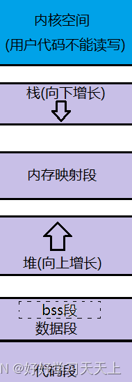

##  1、类的对象存储空间？

- 非静态成员的数据类型大小之和。
- 编译器加入的额外成员变量（如指向虚函数表的指针）。
- 为了边缘对齐优化加入的padding。

空类(无非静态数据成员)的对象的size为1, 当作为基类时, size为0.


## [#](https://interviewguide.cn/notes/03-hunting_job/02-interview/01-02-01-memory.html#_2、简要说明c-的内存分区)2、简要说明C++的内存分区

C++中的内存分区，分别是堆、栈、自由存储区、全局/静态存储区、常量存储区和代码区。如下图所示


**栈**：由编译器管理分配和回收，存放局部变量和函数参数。

**堆**：就是那些由 `new`分配的内存块，他们的释放编译器不去管，由我们的应用程序去控制，一般一个`new`就要对应一个 `delete`。如果程序员没有释放掉，那么在程序结束后，操作系统会自动回收

**自由存储区**：如果说堆是操作系统维护的一块内存，那么自由存储区就是C++中通过new和delete动态分配和释放对象的抽象概念。需要注意的是，自由存储区和堆比较像，但不等价。

**全局/静态存储区**：全局变量和静态变量被分配到同一块内存中，在以前的C语言中，全局变量和静态变量又分为初始化的和未初始化的；在C++里面没有这个区分了，它们共同占用同一块内存区，在该区定义的变量若没有初始化，则会被自动初始化，例如int型变量自动初始为0。

**常量存储区**：这是一块比较特殊的存储区，这里面存放的是常量，不允许修改

**代码区**：存放函数体的二进制代码


## [#](https://interviewguide.cn/notes/03-hunting_job/02-interview/01-02-01-memory.html#_3、什么是内存池-如何实现)3、什么是内存池，如何实现

内存池（Memory Pool） 是一种**内存分配**方式。通常我们习惯直接使用new、malloc 等申请内存，这样做的缺点在于：由于所申请内存块的大小不定，当频繁使用时会造成大量的内存碎片并进而降低性能。内存池则是在真正使用内存之前，先申请分配一定数量的、大小相等(一般情况下)的内存块留作备用。当有新的内存需求时，就从内存池中分出一部分内存块， 若内存块不够再继续申请新的内存。这样做的一个显著优点是尽量避免了内存碎片，使得内存分配效率得到提升。

这里**简单描述一下《STL源码剖析》中的内存池实现机制**：

**allocate 包装 malloc，deallocate包装free**

一般是一次20*2个的申请，先用一半，留着一半，为什么也没个说法，侯捷在STL那边书里说好像是C++委员会成员认为20是个比较好的数字，既不大也不小。

1. 首先客户端会调用malloc()配置一定数量的区块（固定大小的内存块，通常为8的倍数），假设40个32bytes的区块，其中20个区块（一半）给程序实际使用，1个区块交出，另外19个处于维护状态。剩余20个（一半）留给内存池，此时一共有（20*32byte）
2. 客户端之后有有内存需求，想申请（20*64bytes）的空间，这时内存池只有（20*32bytes），就先将（10*64bytes)个区块返回，1个区块交出，另外9个处于维护状态，此时内存池空空如也.
3. 接下来如果客户端还有内存需求，就必须再调用malloc()配置空间，此时新申请的区块数量会增加一个随着配置次数越来越大的附加量，同样一半提供程序使用，另一半留给内存池。申请内存的时候用永远是先看内存池有无剩余，有的话就用上，然后挂在0-15号某一条链表上，要不然就重新申请。
4. 如果整个堆的空间都不够了，就会在原先已经分配区块中寻找能满足当前需求的区块数量，能满足就返回，不能满足就向客户端报bad_alloc异常

allocator就是用来分配内存的，最重要的两个函数是allocate和deallocate，就是用来申请内存和回收内存的，外部（一般指容器）调用的时候只需要知道这些就够了。

内部实现，目前的所有编译器都是直接调用的::operator new()和::operator delete()，说白了就是和直接使用new运算符的效果是一样的，所以老师说它们都没做任何特殊处理。

**其实最开始GC2.9之前**

new和 operator new 的区别：new 是个运算符，编辑器会调用 operator new(0)

operator new()里面有调用malloc的操作，那同样的 operator delete()里面有调用的free的操作

GC2.9下的alloc函数的一个比较好的分配器的实现规则如下：

维护一条0-15号的一共16条链表，其中 0 号表示8 bytes ，1 号表示 16 bytes，2 号表示 24 bytes。。。。而15 号表示 16* 8 = 128 bytes。

如果在申请内存时，申请内存的大小并不是8的倍数（比如2、4、7、9、18这样不是8的倍数），那就找刚好能满足内存大小的链表。比如想申请 12 个大小，那就按照 16 来处理，也就是找 1 号链表了；想申请 20 ，距离它最近的就是 24 了，那就找 2 号链表。

只许比所要申请的内容大，不许小！

**但是现在GC4.9及其之后** 也还有 alloc 函数，只不过已经变成_pool_alloc这个名字了，名字已经改了，也不再是默认的了。

你需要自己手动去指定它可以自己指定，比如

```cpp
vector<string,__gnu_cxx::pool_alloc<string>> vec;
    
```


这样来使用它，等于兜兜转转又回到以前那种对malloc和free的包装形式了。


## [#](https://interviewguide.cn/notes/03-hunting_job/02-interview/01-02-01-memory.html#_4、可以说一下你了解的c-得内存管理吗)4、可以说一下你了解的C++得内存管理吗？

在C++中，内存分成5个区，他们分别是堆、栈、全局/静态存储区和常量存储区和代码区。

- 栈，在执行函数时，函数内局部变量的存储单元都可以在栈上创建，函数执行结束时这些存储单元自动被释放。栈内存分配运算内置于处理器的指令集中，效率很高，但是分配的内存容量有限。
- 堆，就是那些由new分配的内存块，他们的释放编译器不去管，由我们的应用程序去控制，一般一个new就要对应一个delete。如果程序员没有释放掉，那么在程序结束后，操作系统会自动回收。
- 全局/静态存储区，内存在程序编译的时候就已经分配好，这块内存在程序的整个运行期间都存在。它主要存放静态数据（局部static变量，全局static变量）、全局变量和常量。
- 常量存储区，这是一块比较特殊的存储区，他们里面存放的是常量字符串，不允许修改。
- 代码区，存放程序的二进制代码


## [#](https://interviewguide.cn/notes/03-hunting_job/02-interview/01-02-01-memory.html#_5、c-中类的数据成员和成员函数内存分布情况)5、C++中类的数据成员和成员函数内存分布情况

C++类是由结构体发展得来的，所以他们的成员变量（C语言的结构体只有成员变量）的内存分配机制是一样的。下面我们以类来说明问题，如果类的问题通了，结构体也也就没问题啦。 类分为成员变量和成员函数，我们先来讨论成员变量。

一个类对象的地址就是类所包含的这一片内存空间的首地址，这个首地址也就对应具体某一个成员变量的地址。（在定义类对象的同时这些成员变量也就被定义了），举个例子：

```cpp
#include <iostream>
using namespace std;

class Person
{
public:
    Person()
    {
        this->age = 23;
    }
    void printAge()
    {
        cout << this->age <<endl;
    }
    ~Person(){}
public:
    int age;
};

int main()
{
    Person p;
    cout << "对象地址："<< &p <<endl;
    cout << "age地址："<< &(p.age) <<endl;
    cout << "对象大小："<< sizeof(p) <<endl;
    cout << "age大小："<< sizeof(p.age) <<endl;
    return 0;
}
//输出结果
//对象地址：0x7fffec0f15a8
//age地址：0x7fffec0f15a8
//对象大小：4
//age大小：4
    
```


从代码运行结果来看，对象的大小和对象中数据成员的大小是一致的，也就是说，**成员函数不占用对象的内存**。**这是因为所有的函数都是存放在代码区的，不管是全局函数，还是成员函数**。

要是成员函数占用类的对象空间，那么将是多么可怕的事情：定义一次类对象就有成员函数占用一段空间。

我们再来补充一下静态成员函数的存放问题：**静态成员函数与一般成员函数的唯一区别就是没有this指针**，因此不能访问非静态数据成员。

就像我前面提到的，**所有函数都存放在代码区，静态函数也不例外。所有有人一看到 static 这个单词就主观的认为是存放在全局数据区，那是不对的。**


## [#](https://interviewguide.cn/notes/03-hunting_job/02-interview/01-02-01-memory.html#_6、关于this指针你知道什么-全说出来)6、关于this指针你知道什么？全说出来

- this指针是类的指针，指向对象的首地址。
- this指针只能在成员函数中使用，在全局函数、静态成员函数中都不能用this。
- this指针只有在成员函数中才有定义，且存储位置会因编译器不同有不同存储位置。

**this指针的用处**

一个对象的this指针并不是对象本身的一部分，不会影响 sizeof(对象) 的结果。this作用域是在类内部，当在类的**非静态成员函数**中访问类的**非静态成员**的时候（全局函数，静态函数中不能使用this指针），编译器会自动将对象本身的地址作为一个隐含参数传递给函数。也就是说，即使你没有写上this指针，编译器在编译的时候也是加上this的，它作为非静态成员函数的隐含形参，对各成员的访问均通过this进行

**this指针的使用**

一种情况就是，在类的非静态成员函数中返回类对象本身的时候，直接使用 return *this；

另外一种情况是当形参数与成员变量名相同时用于区分，如this->n = n （不能写成n = n）

**类的this指针有以下特点**

(1）**this**只能在成员函数中使用，全局函数、静态函数都不能使用this。实际上，**传入参数为当前对象地址，成员函数第一个参数为**为**T \* const this**

如：

```text
class A{public:	int func(int p){}};
```


其中，**func**的原型在编译器看来应该是：

**int func(A \* const this,int p);**

（2）由此可见，**this**在成员函数的开始前构造，在成员函数的结束后清除。这个生命周期同任何一个函数的参数是一样的，没有任何区别。当调用一个类的成员函数时，编译器将类的指针作为函数的this参数传递进去。如：

```text
A a;a.func(10);//此处，编译器将会编译成：A::func(&a,10);
    
```


看起来和静态函数没差别，对吗？不过，区别还是有的。编译器通常会对this指针做一些优化，因此，this指针的传递效率比较高，例如VC通常是通过ecx（计数寄存器）传递this参数的。


## [#](https://interviewguide.cn/notes/03-hunting_job/02-interview/01-02-01-memory.html#_7、几个this指针的易混问题)7、几个this指针的易混问题

### [#](https://interviewguide.cn/notes/03-hunting_job/02-interview/01-02-01-memory.html#a-this指针是什么时候创建的)A. this指针是什么时候创建的？

this在成员函数的开始执行前构造，在成员的执行结束后清除。

但是如果class或者struct里面没有方法的话，它们是没有构造函数的，只能当做C的struct使用。采用TYPE xx的方式定义的话，在栈里分配内存，这时候this指针的值就是这块内存的地址。采用new的方式创建对象的话，在堆里分配内存，new操作符通过eax（累加寄存器）返回分配的地址，然后设置给指针变量。之后去调用构造函数（如果有构造函数的话），这时将这个内存块的地址传给ecx，之后构造函数里面怎么处理请看上面的回答

### [#](https://interviewguide.cn/notes/03-hunting_job/02-interview/01-02-01-memory.html#b-this指针存放在何处-堆、栈、全局变量-还是其他)B. this指针存放在何处？堆、栈、全局变量，还是其他？

this指针会因编译器不同而有不同的放置位置。可能是栈，也可能是寄存器，甚至全局变量。在汇编级别里面，一个值只会以3种形式出现：立即数、寄存器值和内存变量值。不是存放在寄存器就是存放在内存中，它们并不是和高级语言变量对应的。

### [#](https://interviewguide.cn/notes/03-hunting_job/02-interview/01-02-01-memory.html#c-this指针是如何传递类中的函数的-绑定-还是在函数参数的首参数就是this指针-那么-this指针又是如何找到-类实例后函数的)C. this指针是如何传递类中的函数的？绑定？还是在函数参数的首参数就是this指针？那么，this指针又是如何找到“类实例后函数的”？

大多数编译器通过ecx（寄数寄存器）寄存器传递this指针。事实上，这也是一个潜规则。一般来说，不同编译器都会遵从一致的传参规则，否则不同编译器产生的obj就无法匹配了。

在call之前，编译器会把对应的对象地址放到eax中。this是通过函数参数的首参来传递的。this指针在调用之前生成，至于“类实例后函数”，没有这个说法。类在实例化时，只分配类中的变量空间，并没有为函数分配空间。自从类的函数定义完成后，它就在那儿，不会跑的

### [#](https://interviewguide.cn/notes/03-hunting_job/02-interview/01-02-01-memory.html#d-this指针是如何访问类中的变量的)D. this指针是如何访问类中的变量的？

如果不是类，而是结构体的话，那么，如何通过结构指针来访问结构中的变量呢？如果你明白这一点的话，就很容易理解这个问题了。

在C++中，类和结构是只有一个区别的：类的成员默认是private，而结构是public。

this是类的指针，如果换成结构体，那this就是结构的指针了。

### [#](https://interviewguide.cn/notes/03-hunting_job/02-interview/01-02-01-memory.html#e-我们只有获得一个对象后-才能通过对象使用this指针。如果我们知道一个对象this指针的位置-可以直接使用吗)E.我们只有获得一个对象后，才能通过对象使用this指针。如果我们知道一个对象this指针的位置，可以直接使用吗？

**this指针只有在成员函数中才有定义。**因此，你获得一个对象后，也不能通过对象使用this指针。所以，我们无法知道一个对象的this指针的位置（只有在成员函数里才有this指针的位置）。当然，在成员函数里，你是可以知道this指针的位置的（可以通过&this获得），也可以直接使用它。

> 感谢网友勘误：https://github.com/forthespada/InterviewGuide/issues/10 ，标准情况下this为右值，无法通过&符号获取地址-2021.09.03

### [#](https://interviewguide.cn/notes/03-hunting_job/02-interview/01-02-01-memory.html#f-每个类编译后-是否创建一个类中函数表保存函数指针-以便用来调用函数)F.每个类编译后，是否创建一个类中函数表保存函数指针，以便用来调用函数？

普通的类函数（不论是成员函数，还是静态函数）都不会创建一个函数表来保存函数指针。只有虚函数才会被放到函数表中。但是，即使是虚函数，如果编译期就能明确知道调用的是哪个函数，编译器就不会通过函数表中的指针来间接调用，而是会直接调用该函数。正是由于this指针的存在，用来指向不同的对象，从而确保不同对象之间调用相同的函数可以互不干扰。

> 感谢微信好友“铁锤哥哥”勘误：““成员函数默认第一个参数为”->建议写为：传入参数为当前对象地址，成员函数第一个参数为T * const this-2021.06.28


## [#](https://interviewguide.cn/notes/03-hunting_job/02-interview/01-02-01-memory.html#_8、-内存泄漏的后果-如何监测-解决方法)8、 内存泄漏的后果？如何监测？解决方法？

**1) 内存泄漏**

内存泄漏是指由于疏忽或错误造成了程序未能释放掉不再使用的内存的情况。内存泄漏并非指内存在物理上消失，而是应用程序分配某段内存后，由于设计错误，失去了对该段内存的控制；

**2) 后果**

只发生一次小的内存泄漏可能不被注意，但泄漏大量内存的程序将会出现各种证照：性能下降到内存逐渐用完，导致另一个程序失败；

**3) 如何排除**

使用工具软件BoundsChecker，BoundsChecker是一个运行时错误检测工具，它主要定位程序运行时期发生的各种错误；

调试运行DEBUG版程序，运用以下技术：CRT(C run-time libraries)、运行时函数调用堆栈、内存泄漏时提示的内存分配序号(集成开发环境OUTPUT窗口)，综合分析内存泄漏的原因，排除内存泄漏。

**4) 解决方法**

智能指针。

**5) 检查、定位内存泄漏**

检查方法：在main函数最后面一行，加上一句_CrtDumpMemoryLeaks()。调试程序，自然关闭程序让其退出，查看输出：

输出这样的格式{453}normal block at 0x02432CA8,868 bytes long

被{}包围的453就是我们需要的内存泄漏定位值，868 bytes long就是说这个地方有868比特内存没有释放。

定位代码位置

在main函数第一行加上_CrtSetBreakAlloc(453);意思就是在申请453这块内存的位置中断。然后调试程序，程序中断了，查看调用堆栈。加上头文件#include <crtdbg.h>


## [#](https://interviewguide.cn/notes/03-hunting_job/02-interview/01-02-01-memory.html#_9、在成员函数中调用delete-this会出现什么问题-对象还可以使用吗)9、在成员函数中调用delete this会出现什么问题？对象还可以使用吗？

1、在类对象的内存空间中，只有数据成员和虚函数表指针，并不包含代码内容，类的成员函数单独放在代码段中。在调用成员函数时，隐含传递一个this指针，让成员函数知道当前是哪个对象在调用它。当调用delete this时，类对象的内存空间被释放。在delete this之后进行的其他任何函数调用，只要不涉及到this指针的内容，都能够正常运行。一旦涉及到this指针，如操作数据成员，调用虚函数等，就会出现不可预期的问题。


## [#](https://interviewguide.cn/notes/03-hunting_job/02-interview/01-02-01-memory.html#_10、为什么是不可预期的问题)10、为什么是不可预期的问题？

delete this之后不是释放了类对象的内存空间了么，那么这段内存应该已经还给系统，不再属于这个进程。照这个逻辑来看，应该发生指针错误，无访问权限之类的令系统崩溃的问题才对啊？这个问题牵涉到操作系统的内存管理策略。delete this释放了类对象的内存空间，但是内存空间却并不是马上被回收到系统中，可能是缓冲或者其他什么原因，导致这段内存空间暂时并没有被系统收回。此时这段内存是可以访问的，你可以加上100，加上200，但是其中的值却是不确定的。当你获取数据成员，可能得到的是一串很长的未初始化的随机数；访问虚函数表，指针无效的可能性非常高，造成系统崩溃。


## [#](https://interviewguide.cn/notes/03-hunting_job/02-interview/01-02-01-memory.html#_11、-如果在类的析构函数中调用delete-this-会发生什么)11、 如果在类的析构函数中调用delete this，会发生什么？

会导致堆栈溢出。原因很简单，delete的本质是“为将被释放的内存调用一个或多个析构函数，然后，释放内存”。显然，delete this会去调用本对象的析构函数，而析构函数中又调用delete this，形成无限递归，造成堆栈溢出，系统崩溃。


## [#](https://interviewguide.cn/notes/03-hunting_job/02-interview/01-02-01-memory.html#_12、你知道空类的大小是多少吗)12、你知道空类的大小是多少吗？

1. C++空类的大小不为0，不同编译器设置不一样，vs设置为1；
2. C++标准指出，不允许一个对象（当然包括类对象）的大小为0，不同的对象不能具有相同的地址；
3. 带有虚函数的C++类大小不为1，因为每一个对象会有一个vptr指向虚函数表，具体大小根据指针大小确定；
4. C++中要求对于类的每个实例都必须有独一无二的地址,那么编译器自动为空类分配一个字节大小，这样便保证了每个实例均有独一无二的内存地址。


## [#](https://interviewguide.cn/notes/03-hunting_job/02-interview/01-02-01-memory.html#_13、请说一下以下几种情况下-下面几个类的大小各是多少)13、请说一下以下几种情况下，下面几个类的大小各是多少？

```cpp
class A {};
int main(){
  cout<<sizeof(A)<<endl;// 输出 1;
  A a; 
  cout<<sizeof(a)<<endl;// 输出 1;
  return 0;
}
    
```


空类的大小是1， 在C++中空类会占一个字节，这是为了让对象的实例能够相互区别。具体来说，空类同样可以被实例化，并且每个实例在内存中都有独一无二的地址，因此，编译器会给空类隐含加上一个字节，这样空类实例化之后就会拥有独一无二的内存地址。当该空白类作为基类时，该类的大小就优化为0了，子类的大小就是子类本身的大小。这就是所谓的空白基类最优化。

空类的实例大小就是类的大小，所以sizeof(a)=1字节,如果a是指针，则sizeof(a)就是指针的大小，即4字节。

```cpp
class A { virtual void Fun(){} };
int main(){
  cout<<sizeof(A)<<endl;// 输出 4(32位机器)/8(64位机器);
  A a; 
  cout<<sizeof(a)<<endl;// 输出 4(32位机器)/8(64位机器);
  return 0;
}
    
```


因为有虚函数的类对象中都有一个虚函数表指针 __vptr，其大小是4字节

```cpp
class A { static int a; };
int main(){
  cout<<sizeof(A)<<endl;// 输出 1;
  A a; 
  cout<<sizeof(a)<<endl;// 输出 1;
  return 0;
}
    
```


静态成员存放在静态存储区，不占用类的大小, 普通函数也不占用类大小

```cpp
class A { int a; };
int main(){
  cout<<sizeof(A)<<endl;// 输出 4;
  A a; 
  cout<<sizeof(a)<<endl;// 输出 4;
  return 0;
}
    
```


```cpp
class A { static int a; int b; };;
int main(){
  cout<<sizeof(A)<<endl;// 输出 4;
  A a; 
  cout<<sizeof(a)<<endl;// 输出 4;
  return 0;
}
    
```

静态成员a不占用类的大小，所以类的大小就是b变量的大小 即4个字节


## [#](https://interviewguide.cn/notes/03-hunting_job/02-interview/01-02-01-memory.html#_14、this指针调用成员变量时-堆栈会发生什么变化)14、this指针调用成员变量时，堆栈会发生什么变化？

当在类的非静态成员函数访问类的非静态成员时，编译器会自动将对象的地址传给作为隐含参数传递给函数，这个隐含参数就是this指针。

即使你并没有写this指针，编译器在链接时也会加上this的，对各成员的访问都是通过this的。

例如你建立了类的多个对象时，在调用类的成员函数时，你并不知道具体是哪个对象在调用，此时你可以通过查看this指针来查看具体是哪个对象在调用。This指针首先入栈，然后成员函数的参数从右向左进行入栈，最后函数返回地址入栈。


## [#](https://interviewguide.cn/notes/03-hunting_job/02-interview/01-02-01-memory.html#_15、类对象的大小受哪些因素影响)15、类对象的大小受哪些因素影响？

1. 类的非静态成员变量大小，静态成员不占据类的空间，成员函数也不占据类的空间大小；
2. 内存对齐另外分配的空间大小，类内的数据也是需要进行内存对齐操作的；
3. 虚函数的话，会在类对象插入vptr指针，加上指针大小；
4. 当该类是某类的派生类，那么派生类继承的基类部分的数据成员也会存在在派生类中的空间中，也会对派生类进行扩展。


## 16、避免内存泄漏的方法

1. 分配的内存以链表管理，使用完毕后从链表删除，程序结束的时候检查链表
2. 良好的编程习惯，在设计内存的程序段，检验出内存泄漏，使用了内存分配的函数，使用完毕后将使用的相应函数释放掉。
3. smart pointer


## 1、类的对象存储空间？

- 非静态成员的数据类型大小之和。
- 编译器加入的额外成员变量（如指向虚函数表的指针）。
- 为了边缘对齐优化加入的padding。

空类(无非静态数据成员)的对象的size为1, 当作为基类时, size为0.


## 2、简要说明C++的内存分区

**栈**：由编译器管理分配和回收，存放局部变量和函数参数。

**堆**：就是那些由 `new`分配的内存块，他们的释放编译器不去管，由我们的应用程序去控制，一般一个`new`就要对应一个 `delete`。如果程序员没有释放掉，那么在程序结束后，操作系统会自动回收

**自由存储区**：如果说堆是操作系统维护的一块内存，那么自由存储区就是C++中通过new和delete动态分配和释放对象的抽象概念。需要注意的是，自由存储区和堆比较像，但不等价。

**全局/静态存储区**：全局变量和静态变量被分配到同一块内存中，在以前的C语言中，全局变量和静态变量又分为初始化的和未初始化的；在C++里面没有这个区分了，它们共同占用同一块内存区，在该区定义的变量若没有初始化，则会被自动初始化，例如int型变量自动初始为0。

**常量存储区**：这是一块比较特殊的存储区，这里面存放的是常量，不允许修改

**代码区**：存放函数体的二进制代码


## 3、C++中类的数据成员和成员函数内存分布情况

C++类是由结构体发展得来的，所以他们的成员变量（C语言的结构体只有成员变量）的内存分配机制是一样的。下面我们以类来说明问题，如果类的问题通了，结构体也也就没问题啦。 类分为成员变量和成员函数，我们先来讨论成员变量。

一个类对象的地址就是类所包含的这一片内存空间的首地址，这个首地址也就对应具体某一个成员变量的地址。（在定义类对象的同时这些成员变量也就被定义了），举个例子：

```cpp
#include <iostream>
using namespace std;

class Person
{
public:
    Person()
    {
        this->age = 23;
    }
    void printAge()
    {
        cout << this->age <<endl;
    }
    ~Person(){}
public:
    int age;
};

int main()
{
    Person p;
    cout << "对象地址："<< &p <<endl;
    cout << "age地址："<< &(p.age) <<endl;
    cout << "对象大小："<< sizeof(p) <<endl;
    cout << "age大小："<< sizeof(p.age) <<endl;
    return 0;
}
//输出结果
//对象地址：0x7fffec0f15a8
//age地址：0x7fffec0f15a8
//对象大小：4
//age大小：4
    
```


从代码运行结果来看，对象的大小和对象中数据成员的大小是一致的，也就是说，**成员函数不占用对象的内存**。**这是因为所有的函数都是存放在代码区的，不管是全局函数，还是成员函数**。

要是成员函数占用类的对象空间，那么将是多么可怕的事情：定义一次类对象就有成员函数占用一段空间。

我们再来补充一下静态成员函数的存放问题：**静态成员函数与一般成员函数的唯一区别就是没有this指针**，因此不能访问非静态数据成员。

就像我前面提到的，**所有函数都存放在代码区，静态函数也不例外。所有有人一看到 static 这个单词就主观的认为是存放在全局数据区，那是不对的。**


## 4、内存泄漏、内存溢出的定义，如何检测与避免？

```
内存泄漏简单的说就是申请了⼀块内存空间，使⽤完毕后没有释放掉。 它的⼀般表现⽅式是程序运⾏时间越⻓，占⽤内存越多，最终⽤尽全部内存，整个系统崩溃。由程序申请的⼀块内存，且没有任何⼀个指针指向它，那么这块内存就泄漏了。
```

**如何检测内存泄漏**

⾸先可以通过观察猜测是否可能发⽣内存泄漏，Linux 中使⽤ swap 命令观察还有多少可⽤的交换空间，在⼀两分钟内键⼊该命令三到四次，看看可⽤的交换区是否在减少。还可以使⽤ 其他⼀些 /usr/bin/stat ⼯具如 netstat、vmstat 等。如发现波段有内存被分配且从不释放，⼀个可能的解释就是有个进程出现了内存泄漏。当然也有⽤于内存调试，内存泄漏检测以及性能分析的软件开发⼯具 valgrind 这样的⼯具来进⾏内存泄漏的检测。

```
内存溢出：（out of memory）是指程序在申请内存时，没有足够的内存空间供其使用，出现out of memory；比如申请了一个int,但给它存了long才能存下的数，那就是内存溢出。
```

二者的关系：

```
内存溢出会抛出异常，内存泄露不会抛出异常，大多数时候程序看起来是正常运行的。
```

## 5、内存泄漏的检测与避免

内存泄露检测工具**valgrind**，这是一个linux下的内存泄露检测工具。

### 5.0 内存泄漏的几种情况

1、在堆里创建了对象占用了内存，但是没有显示地释放对象占用的内存。

2、在类的构造函数中动态的分配了内存，但是在析构函数中没有释放内存或者没有正确的释放内存；

3、**没有将基类的析构函数定义为虚函数**

```
当基类指针指向派生类对象时，如果基类的析构函数不是virtual，那么子类的析构函数就不会被调用，子类的资源就没有被正确释放，因此造成内存泄漏。
```

4、**在释放对象数组时没有使用delete[]而是使用delete**

当一个数组中的多个元素均为对象时，在使用delete释放该数组时必须为delete []，否则只会调用一次析构函数释放数组中的第一个元素，而剩下的数组没有被析构掉，造成了内存泄漏。

5、**指针重新赋值**

```
char * p = (char *)malloc(10);
char * np = (char *)malloc(10);
```

其中，指针变量 p 和 np 分别被分配了 10 个字节的内存。如果程序执行以下语句：

```
p=np;
```

这时候，指针变量 p 被 np 指针重新赋值，其结果是 p 以前所指向的内存位置变成了孤立的内存。它无法释放，因为没有指向该位置的引用，从而导致 10 字节的内存泄漏。


### 5.1 避免内存泄漏

**1、指针重新赋值**
**2、错误的内存释放**
**3、返回值的不正确处理**

### 5.2 如何避免内存泄漏

- 确保没有在访问空指针。

- 每个内存分配函数都应该有一个 free 函数与之对应，alloca 函数除外。
- 每次分配内存之后都应该及时进行初始化，可以结合 memset 函数进行初始化，calloc 函数除外。
- 每当向指针写入值时，都要确保对可用字节数和所写入的字节数进行交叉核对。
- 在对指针赋值前，一定要确保没有内存位置会变为孤立的。
- 每当释放结构化的元素（而该元素又包含指向动态分配的内存位置的指针）时，都应先遍历子内存位置并从那里开始释放，然后再遍历回父节点。
- 始终正确处理返回动态分配的内存引用的函数返回值。


## 6、内存布局



1、栈区（stack）：由编译器自动分配释放，存放函数的参数值，局部变量值等，其操作方法类似数据结构中的栈。

2、堆区（heap）：一般由程序员分配释放，与数据结构中的堆毫无关系，分配方式类似于链表。

3、内存映射段：存放 静态库/动态库。

4、数据段：存放全局变量，静态变量
bss段：存放未经过初始化的全局变量，静态数据

5、程序代码区（代码段）：存放可执行代码

1、申请方式

stack：系统自动分配，如声明int a;系统自动在栈空间中为a开辟空间

heap：程序员申请，并指明大小，c中的malloc，如charp=(char)malloc(10);

C++中的new运算符：如int*p2=new int(10);

注意：p和p2本身是在栈中的，但他们指向的地址是堆空间

2、系统响应

栈：**只要系统剩余空间大于申请空间就能申请**，否则报错：栈溢出

堆：首先应该知道操作系统有一个记录空闲内存地址的链表，当系统收到程序的申请时，会遍历该链表，寻找第一个空间大于所申请空间的堆结点，然后将该结点从空闲结点链表中删除，并将该结点的空间分配给程序。另外，对于大多数系统，首地址处会记录这块内存空间中本次分配的大小，这样，代码中的delete语句才能正确的释放本内存空间。另外，由于找到的堆结点的大小不一定正好等于申请的大小，系统会自动的将多余的那部分重新放入空闲链表中。

3、申请大小的限制

栈：在Windows下,栈是向低地址扩展的数据结构，是一块连续的内存的区域。这句话的意思是栈顶的地址和栈的最大容量是系统预先规定好的，在WINDOWS下，栈的大小是2M（也有的说是1M，总之是一个编译时就确定的常数），如果申请的空间超过栈的剩余空间时，将提示overflow。因此，能从栈获得的空间较小。

堆：堆是向高地址扩展的数据结构，是不连续的内存区域。这是由于系统是用链表来存储的空闲内存地址的，自然是不连续的，而链表的遍历方向是由低地址向高地址。由此可见，堆获得的空间受限于计算机系统中有效的虚拟内存，比较灵活，也比较大。

4、申请效率

栈由系统自动分配速度较快，堆由new分配速度较慢，且容易产生内存碎片，但使用方便

