## linux目录


## 环境配置

https://www.linaro.org/downloads/

详细地址：https://releases.linaro.org/components/toolchain/binaries/4.9-2017.01/arm-linux-gnueabihf/


需要下载linaro当中的编译器，为了交叉编译


首先在Linux当中创建文件夹

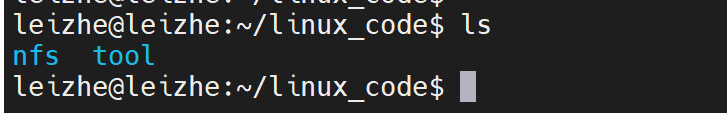

创建一个linux_code文件夹，然后在文件夹中创建**nfs**和**tool**文件夹；再将下载好的编译器放到tool文件夹下面。

然后再创建一个文件夹，

在 **usr/local**当中创建一个**arm**的文件夹。

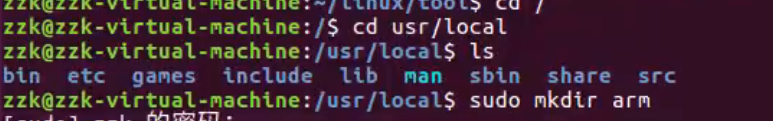


## 在vscode中配置Remote-SSH

首先安装remote-ssh插件，

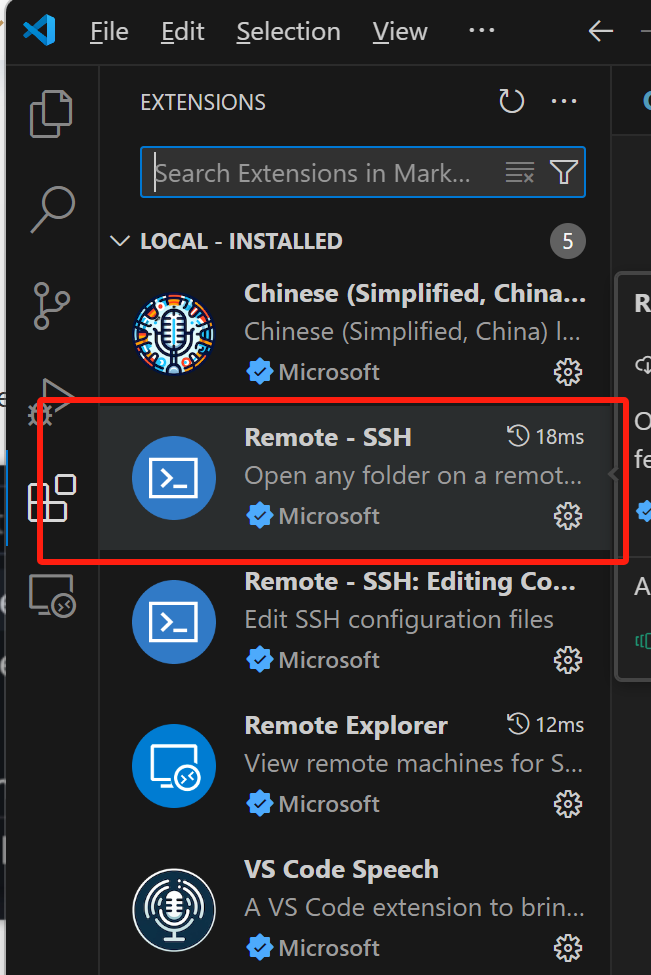

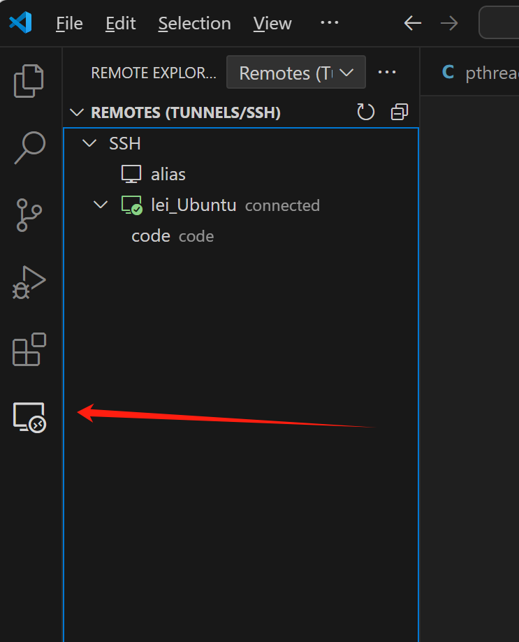

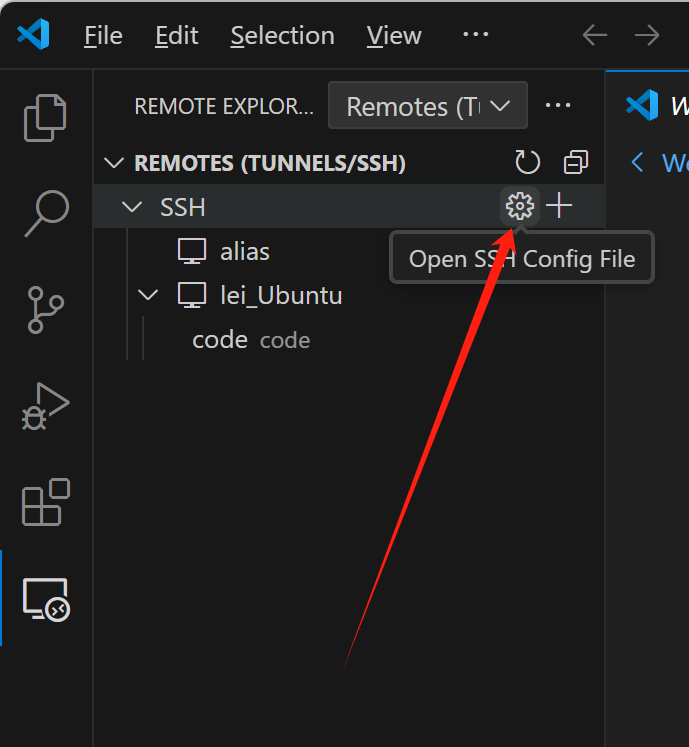

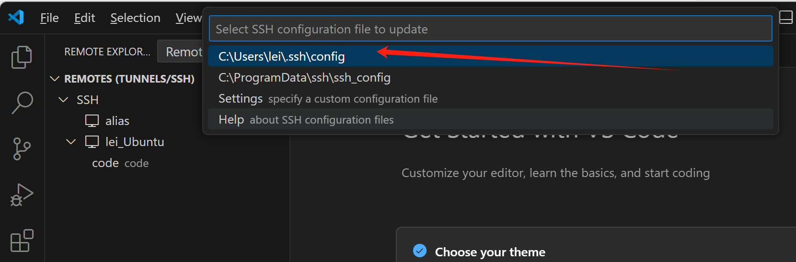

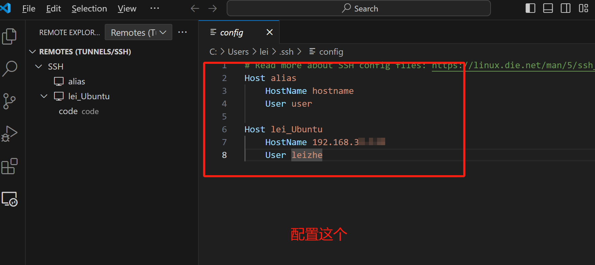

然后重启vscode就能打开了。但是每次打开都需要登录密码。

## gcc/g++

c语言使用gcc命令；c++程序使用g++命令。

（1）预处理

展开头文件，删除注释、空行等无用内容，替换宏定义。

```
gcc -E main.c -o main.i
```

（2）编译

检查语法错误，如有错误则报错，没错则生成汇编文件。

```
gcc -S main.i -o main.s           //注意：这里-S为大写
```

（3）汇编

将编译文件生成二进制目标文件。

```
gcc -c main.s -o main.o
```

（4）链接

将目标文件连接库文件，最终生成机器能够运行的二进制可执行程序。

```
gcc main.o -o main
```


.out是可执行文件，相当于win上的exe；

.o是编译中间目标文件，相当于win上的.obj；

.a是静态库，多个.o练链接得到，用于静态链接；

.so是共享库，用于动态链接，相当于win上.dll；


## makefile

参考：[Makefile(超详细一文读懂)-CSDN博客](https://blog.csdn.net/qq_51753728/article/details/142262405)

**注意：要了解make指令，需要先了解gcc命令**


Makefile 里面是由一系列的规则组成的，这些规则格式如下：

```
目标…... :  依赖文件集合…… 
 命令 1 
 命令 2 
 …… 
```


```
  main: main.o input.o calcu.o 
      gcc -o main  main.o input.o calcu.o 
  main.o: main.c 
      gcc -c main.c 
  input.o: input.c 
      gcc -c input.c 
  calcu.o: calcu.c 
      gcc -c calcu.c 
   
 clean: 
     rm *.o 
     rm main 
```

**上述代码中所有行首需要空出来的地方一定要使用“TAB”键！不要使用空格键！**

简洁版：

```
  objects = main.o input.o calcu.o
  main: $(objects)  
      gcc -o main $(objects) 
  
  .PHONY : clean 
  
  %.o : %.c 
      gcc -c $<  
   
  clean: 
	rm *.o 
    rm main 
```

```
  .PHONY : clean 
```

这句是**伪目标**。声明 clean 为伪目标以后不管当前目录下是否存在名为“clean”的文件，输入“make clean”的话规则后面的 rm 命令都会执行。

### 条件判断

其中条件关键字有 4 个：ifeq、ifneq、ifdef 和 ifndef，这四个关键字其实分为两对、ifeq 与ifneq、ifdef 与 ifndef，先来看一下 ifeq 和 ifneq，ifeq 用来判断是否相等，ifneq 就是判断是否不相等。

### Makefile函数使用

```
$(函数名 参数集合)
```

或

```
${函数名 参数集合}
```

参数集合是函数的多个参数，参数之间以逗号“,”隔开，函数名和参数之间以“空格”分隔开，函数的调用以“$”开头。


### 赋值符 =

```
1 name = zzk
2 curname = $(name)
3 name = zuozhongkai
4
5 print:
6 @echo curname: $(curname)
```


### 赋值符 :=

```
1 name = zzk
2 curname := $(name)
3 name = zuozhongkai
4
5 print:
6 @echo curname: $(curname)
```

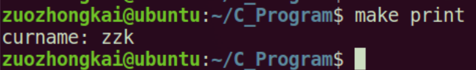

### 赋值符 ?=

“?=”是一个很有用的赋值符，比如下面这行代码：

```
curname ?= zuozhongkai
```

上述代码的意思就是，如果变量 curname 前面没有被赋值，那么此变量就是“zuozhongkai”，如果前面已经赋过值了，那么就使用前面赋的值。

### 变量追加 +=

Makefile 中的变量是字符串，有时候我们需要给前面已经定义好的变量添加一些字符串进去，此时就要使用到符号“+=”，比如如下所示代码：

```
objects = main.o inpiut.o

objects += calcu.o
```

一开始变量 objects 的值为“main.o input.o”，后面我们给他追加了一个“calcu.o”，因此变量 objects 变成了“main.o input.o calcu.o”，这个就是变量的追加。

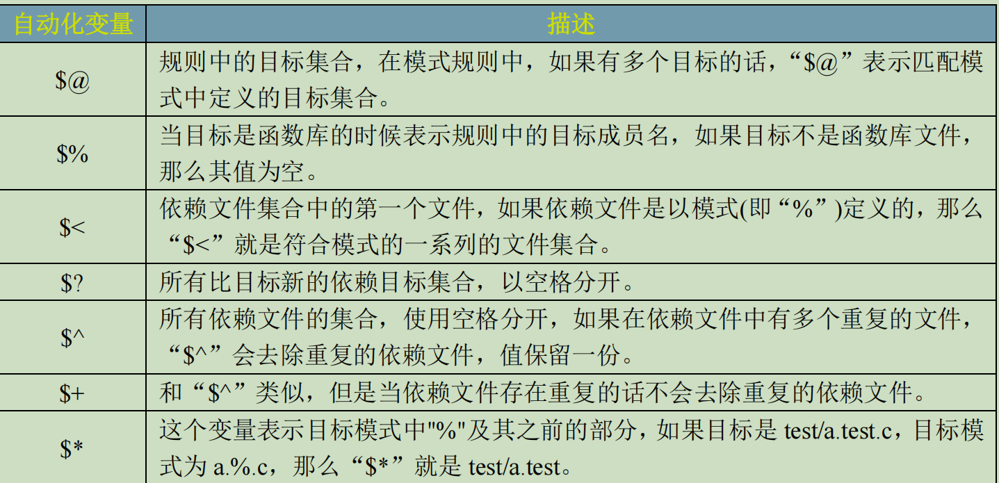


### 预定义变量

- 自定义变量：`变量名=变量值`，如`var=hello`

- 预定义变量

  - `AR` : 归档维护程序的名称，默认值为 ar
  - `CC `: C 编译器的名称，默认值为 cc
  - `CXX` : C++ 编译器的名称，默认值为 g++
  - `$@` : 目标的完整名称
  - `$<` : 第一个依赖文件的名称
  - `$^`: 所有的依赖文件

  

CC：c编译器的名称，默认值为cc。cpp c预编译器的名称默认值为$(CC) -E

```text
CC = gcc
```

### include

当 make 读取到 include 关键字的时候，会暂停读取当前的 Makefile，而是去读 include 包含的文件，读取结束后再继读取当前的 Makefile 文件。

```
include <filenames>
```

注意：include 关键字所在的行首可以包含一个或者是多个的空格（读取的时候空格会被自动的忽略），但是不能使用 Tab 开始，否则会把 include 当作式命令来处理。
包含的多个文件之间要使用空格分隔开。使用 include 包含进来的 Makefile 文件中，如果存在函数或者是变量的引用，它们会在包含的 Makefile 中展开。


### 打印信息

（1）echo

<font color=red>注:echo只能在target：后面的语句中使用，且前面是个TAB。</font>

```
all: 
	@echo "Hello Makefile"
	
输出为：
Hello Makefile
```

```
all: 
	echo "Hello Makefile"

输出为：
echo "Hello Makefile"
Hello Makefile
```

可以看到，Makefile的命令也打印在了终端，要想不输出命令的内容，可以**在命令前面加上@**

（2）info

```
$(info “here add the debug info”)
```

注,info信息,不打印信息所在行号

（3）warning

```
$(warning “here add the debug info”)
```

（4）error

```
$(error “error: this will stop the compile”)
```

这个可以停止当前[makefile](https://so.csdn.net/so/search?q=makefile&spm=1001.2101.3001.7020)的编译


### .d文件

在[Makefile](https://so.csdn.net/so/search?q=Makefile&spm=1001.2101.3001.7020)中，我们的依赖关系可能会需要包含一系列的头文件，比如，如果我们的main.c中有一句“#include "defs.h"”，那么我们的依赖关系应该是： 

```c
main.o : main.c defs.h
```

如果main.c 中包含了很多头文件，那main.o后面要跟N多的.h。你在加入或删除头文件时，也需要小心地修改Makefile。

2. 类似于如下的依赖关系只是建立了.o和.cc之间的依赖关系，那么.cc 改变时.o 会被重新编译。但.cc 中包含的.h改变时并不会影响到.o的重编。

```css
%.o: %.cc
 @echo "=======> Compiling $@"
 $(CPP) $(CPPFLAGS) -c -o $@ $<
```

所以需要建立* .o 和* .h的依赖。但往往*.h非常多，修改起来麻烦。

3. 大多数的C/C++编译器都支持一个“-M”的选项，即自动找寻源文件中包含的头文件，并生成一个依赖关系。例如，如果我们执行下面的命令： 
   
    ```c
    cc -M main.c 
    ```
    
     其输出是： 
    
    ```c
    main.o : main.c defs.h
    ```
    
    于是由编译器自动生成的依赖关系，这样一来，你就不必再手动书写若干文件的依赖关系，而由编译器自动生成了。需要提醒一句的是，如果你使用GNU的C/C++编译器，你得用“-MM”参数，不然，“-M”参数会把一些标准库的头文件也包含进来。 
    
    ```css
     cc -MM UartDev.cc 
    ```
    
    会在UartDev.d中生成如下内容。

UartDev.o UartDev.d: UartDev.cc ../../common/log.h UartDev.h ../../common/thread.h

从而，当某个.h 文件改变时会引起.o .d的重新编译。

当然还要在Makefile中包含.d文件：

```c
DEPS+= $(SRCS:.cc=.d)
include $(DEPS)
```

## 公司make脚本

执行顺序：

step1：

在输入./build_cssp命令之后，执行到

```
make all ARCH_TYPE=ARMv8 OS_TYPE=linux APP_TYPE=rts64  SHEND=1
```

此时all在makefile脚本中，为：

```
all: $(RTS_CSSP).elf secondary-outputs release
```

首先执行$(RTS_CSSP).elf，在makefile脚本中，为：

```
$(RTS_CSSP).elf: $(VOS_LIB) $(RTP_LIB) $(CST_LIB)
	@echo Building target: $@
	@echo Invoking: Linux gcc linker
	........
```

而，(RTS_CSSP).elf依赖于VOS_LIB、RTP_LIB和CST_LIB，首先到VOS_LIB中，在cssp_vos.mk脚本中，为：

```
VOS_LIB = $(VOS_DIR)/libvos.a
$(VOS_LIB): $(VOS_OBJS)
	$(AR) $(ARFLAGS) $(VOS_LIB) $(VOS_OBJS)
```

VOS_LIB依赖于VOS_OBJS，VOS_OBJS为vos目录下所有的xxx.o文件，xxx.o文件依赖于对应xxx.c文件，如下：

```makefile
$(VOS_DIR)/os/linux/%.o: $(VOS_DIR)/os/linux/%.c
	@echo ++++++++osal++++++++
	@echo Building file: $<
	@echo Invoking: Linux gcc compiler
	$(CC) $(CCFLAGS) $(VOS_INCLUDE_DIR) -MF"$(@:%.o=%.d)" -MT"$(@:%.o=%.d)" -o"$@" "$<"
	.......
```

执行完之后，执行下面程序的最后一句，将所有vos目录下的xxx.o文件静态链接为libvos.a文件【.a是静态库，多个.o练链接得到，用于静态链接】

```makefile
VOS_LIB = $(VOS_DIR)/libvos.a
$(VOS_LIB): $(VOS_OBJS)
	$(AR) $(ARFLAGS) $(VOS_LIB) $(VOS_OBJS)
```

此后以此将rtp和cst目录下c程序链接为对应静态库文件。

再返回执行后续命令，生成cssp_rts64.elf和cssp_rts64.dump文件。

```makefile
$(RTS_CSSP).elf: $(VOS_LIB) $(RTP_LIB) $(CST_LIB)
	@echo Building target: $@
	@echo Invoking: Linux gcc linker
	$(CC) -o $(CURRENT_DIR)/"$(RTS_CSSP).elf" $(LIBS) \
		$(OBJS) $(USER_OBJS) \
		$(VOS_OBJS) $(RTP_OBJS) $(CST_OBJS) $(LDFLAGS) 
	$(OBJDUMP) $(OBJDUMP_FLAGS) $(CURRENT_DIR)/$(RTS_CSSP).elf > $(CURRENT_DIR)/$(RTS_CSSP).dump
	$(OBJDUMP) -x $(CURRENT_DIR)/$(RTS_CSSP).elf |grep bss> $(CURRENT_DIR)/$(RTS_CSSP).bss
	@echo Finished building target: $@
	@echo ' '
$(RTS_CSSP).elf.size: $(RTS_CSSP).elf
	@echo Invoking: $(ARCH_TYPE) Linux Print Size
	$(MYSIZE) $(CURRENT_DIR)/$(RTS_CSSP).elf  |$(TEE) $(CURRENT_DIR)/"$(RTS_CSSP).elf.size"
	@echo Finished building: $@
	@echo ' '
```

最后执行，开始语句：

```makefile
all: $(RTS_CSSP).elf secondary-outputs release
release:
	-$(MKDIR) $(RELEASEDIR)
	-$(CP) $(RTS_CSSP).elf $(RELEASEDIR)/$(RTS_CSSP).elf
	-$(CP) $(RTS_CSSP).dump $(RELEASEDIR)/$(RTS_CSSP).dump
	-@echo ' '

```

将对应.elf和.dump文件移动到release目录下。


### armv8tools.mk脚本

```shell
CROSS_COMPILE = aarch64-linux-gnu-

AS  = $(CROSS_COMPILE)as	GNU 汇编器。实际上它是一族汇编器，因为它可以被编译或能够在各种不同平台上工作。
LD	= $(CROSS_COMPILE)ld		是连接器，它把一些目标和归档文件结合在一起，重定位数据，并连接符号引用。通常，建立一个新编译程序的最后一步就是调用ld。
CC	= $(CROSS_COMPILE)gcc
CPP	= $(CROSS_COMPILE)gcc -E	展开头文件，删除注释、空行等无用内容，替换宏定义。
AR	= $(CROSS_COMPILE)ar 建立、修改、提取归档文件。归档文件是包含多个文件内容的一个大文件，其结构保证了可以恢复原始文件内容。
NM	= $(CROSS_COMPILE)nm				列出目标文件中的符号。
STRIP   = $(CROSS_COMPILE)strip			丢弃目标文件中的全部或者特定符号。
OBJCOPY = $(CROSS_COMPILE)objcopy		把一种目标文件中的内容复制到另一种类型的目标文件中。
OBJDUMP = $(CROSS_COMPILE)objdump        反汇编
RANLIB	= $(CROSS_COMPILE)ranlib    产生归档文件索引，并将其保存到这个归档文件中。在索引中列出了归档文件各成员所定义的可重分配目标文件。
SIZE    = $(CROSS_COMPILE)size   列出目标文件每一段的大小以及总体的大小。默认情况下，对于每个目标文件或者一个归档文件中的每个模块只产生一行输出。

CCFLAGS += -march=armv8-a 
CCFLAGS += -D_ARCH_TYPE_ARMV8

OBJDUMP_FLAGS = -Dst
```


### common.mk脚本

```shell

# bin
RM := rm -rf
TEE := tee
CP := cp -fR
MKDIR := mkdir -p
MYSIZE := size

################################################################################
# makefile: common configuration
# created first vern. bais@2021.01
# add PRD_MD ...&&CST_XXX macros for products bais@2024.09
################################################################################

#SH_VENDOR_ID=$(VENDOR_ID)
#SH_PRODUCT_TYPE=$(PRODUCT_TYPE)
#SH_ARCH_TYPE=$(ARCH_TYPE)
#SH_OS_TYPE=$(OS_TYPE)
SH_APP_TYPE=$(APP_TYPE)     在build_cssp文件中定义：rts64
SH_BUILD_TYPE=$(BUILD_TYPE)	在build_cssp文件中定义：cross

#CCFLAGS += -DVENDOR_ID=$(SH_VENDOR_ID)
#CCFLAGS += -DPRODUCT_TYPE=$(SH_PRODUCT_TYPE)
#CCFLAGS += -DARCH_TYPE=$(SH_ARCH_TYPE)
#CCFLAGS += -DOS_TYPE=$(SH_OS_TYPE)
CCFLAGS += -DAPP_TYPE=$(SH_APP_TYPE)
CCFLAGS += -DBUILD_TYPE=$(SH_BUILD_TYPE)


# product
include $(CURRENT_DIR)/product_info.mk


# arch       ARCH_TYPE在build_css文件中定义，这里为if判断，判断为那种架构，如果ARCH_TYPE为ARMv8，则选择armv8tools.mk
ifeq ($(ARCH_TYPE),x86)
include $(CURRENT_DIR)/x86tools.mk
endif
ifeq ($(ARCH_TYPE),ARMv7)
include $(CURRENT_DIR)/armv7tools.mk
endif
ifeq ($(ARCH_TYPE),ARMv8)
include $(CURRENT_DIR)/armv8tools.mk
endif


# os
ifeq ($(OS_TYPE),linux)
include $(CURRENT_DIR)/linux.mk
CCFLAGS += -DVOS_LINUX
CCFLAGS += -DCST_OSTHRED_USER_BASE=1
endif
ifeq ($(OS_TYPE),seL4)
include $(CURRENT_DIR)/seL4.mk
CCFLAGS += -DVOS_SEL4
#Note:lx-seL4支持的app任务优先级是从4开始
CCFLAGS += -DCST_OSTHRED_USER_BASE=3
endif


# out 
APPOUT := cssp_rts                          
ifeq ($(APP_TYPE),rts64)       APP_TYPE在build_cssp文件中，一般定义为：rts64
APPOUT := cssp_rts64
endif
ifeq ($(APP_TYPE),rts32)
APPOUT := cssp_rts32
endif
```


### cssp_cst、cssp_rtp和cssp_vos

等三个文件，三个文件格式相同，下面为删减版：

```shell
# dir 
CST_DIR = $(PRDTDIR)/cst

# lib
CST_LIB = $(CST_DIR)/libcst.a
CST_LIB_FLAG = -lcst
CST_RED_DIR = -I $(CST_DIR)/red

CST_INCLUDE_DIR = \
-I $(ROOTDIR) \
-I $(CST_DIR) \
-I $(CST_DIR)/product \
-I $(CST_DIR)/cstbus \
-I $(CST_DIR)/cstlib \
-I $(CST_DIR)/diag \
-I $(CST_DIR)/com \
-I $(CST_DIR)/com/adapt \


ifeq ($(PRD_RED),1)
CST_INCLUDE_DIR += $(CST_RED_DIR)
endif

CST_INCLUDE_DIR += $(RTP_INCLUDE_DIR)
CST_INCLUDE_DIR += $(VOS_INCLUDE_DIR)


# obj
CST_OBJS = \
$(CST_DIR)/product/Cst.o \
$(CST_DIR)/product/vern.o \
$(CST_DIR)/cstbus/BHB_Interface.o \
$(CST_DIR)/cstbus/MasterCardMana.o \
$(CST_DIR)/cstbus/ProtoLinkAdapt.o \


ifeq ($(PRD_RED),1)
CST_OBJS += \
$(CST_DIR)/red/red_app_diag.o \
$(CST_DIR)/red/red_app_file.o \
$(CST_DIR)/red/red_app_sync.o \
$(CST_DIR)/red/red_link_config.o
endif

# dep
CST_C_DEPS = \
$(CST_DIR)/product/Cst.d \
$(CST_DIR)/product/vern.d \
$(CST_DIR)/cstbus/BHB_Interface.d \
$(CST_DIR)/cstbus/MasterCardMana.d \


ifeq ($(PRD_RED),1)
CST_C_DEPS += \
$(CST_DIR)/red/red_app_diag.d \
$(CST_DIR)/red/red_app_file.d \
$(CST_DIR)/red/red_app_sync.d \
$(CST_DIR)/red/red_link_config.d
endif

# all output file
CST_OUTPUT = $(CST_LIB) $(CST_OBJS) $(CST_C_DEPS)   包含.o .d文件


$(CST_DIR)/product/%.o: $(CST_DIR)/product/%.c    product目录下xx.o文件依赖该目录下.c文件
	@echo ++++++++cst++++++++
	@echo Building file: $<      本句中$< 表示文件目录及文件名
	@echo Invoking: Linux gcc compiler
	$(CC) $(CCFLAGS) $(CST_INCLUDE_DIR) -MF"$(@:%.o=%.d)" -MT"$(@:%.o=%.d)" -o"$@" "$<"
	解释：
	$(CC) : aarch64-linux-gnu-gcc   在armv8tool.mk文件中定义
	$(CCFLAGS) : -DAPP_TYPE=rts64 -DBUILD_TYPE= -march=armv8-a -D_ARCH_TYPE_ARMV8 -DPLC_CODE_SHM_MEM  。。。 在common.mk和armv8tool.mk以及linux.mk文件中定义，此句非常长
	-MF"$(@:%.o=%.d)"  ： -MF"文件目录/Cst.d"
	-MT"$(@:%.o=%.d)"  : -MT"文件目录/Cst.d"
	-o"$@" "$<"        : -o"文件目录/Cst.o" "文件目录/Cst.c"
	
	@echo Finished building: $<
	@echo ' '

$(CST_DIR)/cstbus/%.o: $(CST_DIR)/cstbus/%.c
	@echo Building file: $<
	@echo Invoking: Linux gcc compiler
	$(CC) $(CCFLAGS) $(CST_INCLUDE_DIR) -MF"$(@:%.o=%.d)" -MT"$(@:%.o=%.d)" -o"$@" "$<"
	@echo Finished building: $<
	@echo ' '


$(CST_MIN_LIB): $(CST_MIN_OBJS)
	$(AR) $(ARFLAGS) $(CST_MIN_LIB) $(CST_MIN_OBJS)

$(CST_LIB): $(CST_OBJS)
	$(AR) $(ARFLAGS) $(CST_LIB) $(CST_OBJS)

```

```shell
$(CST_MIN_LIB): $(CST_MIN_OBJS)
	$(AR) $(ARFLAGS) $(CST_MIN_LIB) $(CST_MIN_OBJS)

$(CST_LIB): $(CST_OBJS)
	$(AR) $(ARFLAGS) $(CST_LIB) $(CST_OBJS)
	
	
解释：
$(CST_MIN_LIB) ：  暂不清楚
$(CST_MIN_OBJS) ：  暂不清楚
$(AR) 			:  aarch64-linux-gnu-ar   在armv8tools.mk文件中定义
$(ARFLAGS)      :  crv                    在linux.mk文件中定义


最后一句解释：
$(CST_LIB)   ： 在本文件开始为 当前目录/libcst.a
$(CST_OBJS) :  为cst目录下所有xx.o文件


```


### makefile脚本

```makefile
################################################################################
# makefile: link libs.a
# bais@2021.01
################################################################################

# current dir
CURRENT_DIR = $(shell pwd)       		build目录
#CURRENT_DIR = .
# root dir
ROOTDIR = $(CURRENT_DIR)/../..   		
PRDTDIR = $(CURRENT_DIR)/..
# release dir
RELEASEDIR = $(ROOTDIR)/release
# lib_so dir
LIBSODIR = $(PRDTDIR)/build/lib_so

#CCFLAGS :=

# All of the sources participating in the build are defined here
include $(CURRENT_DIR)/common.mk

include $(CURRENT_DIR)/cssp_vos.mk
include $(CURRENT_DIR)/cssp_rtp.mk
include $(CURRENT_DIR)/cssp_cst.mk

RTS_CSSP = $(APPOUT)     这里APPOUT来自common.mk脚本，定义为cssp_rts或cssp_rts32 或 cssp_rts64

# Add inputs and outputs from these tool invocations to the build variables
ELFSIZE += \
$(RTS_CSSP).elf.size \    

# All Target
all: $(RTS_CSSP).elf secondary-outputs release

$(RTS_CSSP).elf: $(VOS_LIB) $(RTP_LIB) $(CST_LIB)
	@echo Building target: $@
	@echo Invoking: Linux gcc linker
	$(CC) -o $(CURRENT_DIR)/"$(RTS_CSSP).elf" $(LIBS) \
		$(OBJS) $(USER_OBJS) \
		$(VOS_OBJS) $(RTP_OBJS) $(CST_OBJS) $(LDFLAGS) 
	$(OBJDUMP) $(OBJDUMP_FLAGS) $(CURRENT_DIR)/$(RTS_CSSP).elf > $(CURRENT_DIR)/$(RTS_CSSP).dump
	$(OBJDUMP) -x $(CURRENT_DIR)/$(RTS_CSSP).elf |grep bss> $(CURRENT_DIR)/$(RTS_CSSP).bss
	@echo Finished building target: $@
	@echo ' '
$(RTS_CSSP).elf.size: $(RTS_CSSP).elf
	@echo Invoking: $(ARCH_TYPE) Linux Print Size
	$(MYSIZE) $(CURRENT_DIR)/$(RTS_CSSP).elf  |$(TEE) $(CURRENT_DIR)/"$(RTS_CSSP).elf.size"
	@echo Finished building: $@
	@echo ' '
# Other Targets

clean:
	-$(RM) $(OBJS) $(C_DEPS) $(EXECUTABLES) $(S_UPPER_DEPS)
	-$(RM) $(CURRENT_DIR)/*.elf  $(CURRENT_DIR)/*.elf.size  $(CURRENT_DIR)/*.bss  $(CURRENT_DIR)/*.dump
	@echo remove voslib rtplib cstlib output files
	-$(RM) $(CST_OUTPUT) $(RTP_OUTPUT) $(VOS_OUTPUT)
	-$(RM) $(RELEASEDIR)/$(RTS_CSSP).elf
	-$(RM) $(RELEASEDIR)/$(RTS_CSSP).bss
	-$(RM) $(RELEASEDIR)/$(RTS_CSSP).dump
	-@echo ' '

release:
	-$(MKDIR) $(RELEASEDIR)
	-$(CP) $(RTS_CSSP).elf $(RELEASEDIR)/$(RTS_CSSP).elf
	-$(CP) $(RTS_CSSP).bss $(RELEASEDIR)/$(RTS_CSSP).bss
	-$(CP) $(RTS_CSSP).dump $(RELEASEDIR)/$(RTS_CSSP).dump
	-@echo ' '

secondary-outputs: $(ELFSIZE)

.PHONY: all clean dependents
.SECONDARY:

```

```makefile
$(RTS_CSSP).elf: $(VOS_LIB) $(RTP_LIB) $(CST_LIB)
	@echo Building target: $@
	@echo Invoking: Linux gcc linker
	$(CC) -o $(CURRENT_DIR)/"$(RTS_CSSP).elf" $(LIBS) \
		$(OBJS) $(USER_OBJS) \
		$(VOS_OBJS) $(RTP_OBJS) $(CST_OBJS) $(LDFLAGS) 
	$(OBJDUMP) $(OBJDUMP_FLAGS) $(CURRENT_DIR)/$(RTS_CSSP).elf > $(CURRENT_DIR)/$(RTS_CSSP).dump
	$(OBJDUMP) -x $(CURRENT_DIR)/$(RTS_CSSP).elf |grep bss> $(CURRENT_DIR)/$(RTS_CSSP).bss
	@echo Finished building target: $@
	@echo ' '
解释：
$(RTS_CSSP).elf   ： 为cssp_rts64.elf，来自common.mk脚本
$(VOS_LIB) $(RTP_LIB) $(CST_LIB)  : 分别为libvos.a librtp.a 和 libcst.a，各自来自cssp_xxx.mk文件
$@   ： cssp_rts64.elf
$(CC)  ： aarch64-linux-gnu-gcc
$(CURRENT_DIR) :  当前build目录
$(LIBS)   ： -lm，在linux.mk脚本中定义
$(OBJS)  ： \，在linux.mk脚本中定义
$(USER_OBJS)  ： 为空，在linux.mk脚本中定义
$(VOS_OBJS) $(RTP_OBJS) $(CST_OBJS) ： 各自对应目录下xx.o文件，在各自cssp_xx.mk脚本中定义
$(LDFLAGS)     ： -lrt -lm -lpthread，在linux.mk脚本中定义
$(OBJDUMP)   ： aarch64-linux-gnu-objdump，在armv8tools.mk脚本中
$(OBJDUMP_FLAGS)  ： -Dst，在armv8tools.mk脚本中
$(CURRENT_DIR)/$(RTS_CSSP).elf  ：当前目录下/cssp_rts64.elf
> $(CURRENT_DIR)/$(RTS_CSSP).dump  : 将信息写入当前目录下/cssp_rts64.dump

```

```makefile
$(RTS_CSSP).elf.size: $(RTS_CSSP).elf
	@echo Invoking: $(ARCH_TYPE) Linux Print Size
	$(MYSIZE) $(CURRENT_DIR)/$(RTS_CSSP).elf  |$(TEE) $(CURRENT_DIR)/"$(RTS_CSSP).elf.size"
	@echo Finished building: $@
	@echo ' '
	
解释：
$(MYSIZE)  ： 为size，在common.mk脚本中
$(TEE)     ： tee，在common.mk脚本中

```

```makefile
release:
	-$(MKDIR) $(RELEASEDIR)
	-$(CP) $(RTS_CSSP).elf $(RELEASEDIR)/$(RTS_CSSP).elf
	-$(CP) $(RTS_CSSP).bss $(RELEASEDIR)/$(RTS_CSSP).bss
	-$(CP) $(RTS_CSSP).dump $(RELEASEDIR)/$(RTS_CSSP).dump
	-@echo ' '

解释：
-$(MKDIR)  ： mkdir -p ,在common.mk脚本中定义
$(RELEASEDIR)  ： 为release目录，在本文件开始时定义
-$(CP)   ：cp -fR，在common.mk脚本中定义
		-f 或 --force：强制复制，即使目标文件已存在也会覆盖，而且不给出提示。
		-r 或 --recursive：用于复制目录及其所有的子目录和文件，如果要复制目录，需要使用该选项。
```


## 交叉编译链

### objdump命令

显示程序信息，函数汇编等，常用于调试。

- -D, --disassemble-all Display assembler contents of all sections
- -S, --source Intermix source code with disassembly

把反汇编内容输出到main.txt中：

```shell
[root@localhost toolchains]# arm-none-linux-gnueabihf-objdump -D main > main.txt
[root@localhost toolchains]# ll
总用量 82
-rwxrwxrwx 1 root root 13152 7月   2 23:42 main
-rwxrwxrwx 1 root root   255 7月   2 23:30 main.c
-rwxrwxrwx 1 root root 69373 7月   2 23:53 main.txt
```

### size命令

显示可执行程序中各个段占用的大小。

```shell
[root@localhost toolchains]# arm-none-linux-gnueabihf-size main
   text	   data	    bss	    dec	    hex	filename
   1143	    304	     16	   1463	    5b7	main
```


我们在main.c中增加全局变量int aaa = 2;，重新编译后可以看到data段增加了4个字节：

```shell
[root@localhost toolchains]# arm-none-linux-gnueabihf-gcc -g main.c -o main
[root@localhost toolchains]# arm-none-linux-gnueabihf-size main
   text	   data	    bss	    dec	    hex	filename
   1143	    308	     16	   1467	    5bb	main
```

### nm命令

该命令主要用于显示可执行程序的符号。

```shell
[root@localhost toolchains]# arm-none-linux-gnueabihf-nm main
00010170 r __abi_tag
         U abort@GLIBC_2.4
00010488 r all_implied_fbits
00010534 r all_implied_fbits
00021048 B __bss_end__
00021048 B _bss_end__
00021038 B __bss_start
00021038 B __bss_start__
000103c0 t call_weak_fn
00021038 b completed.0
00021028 D __data_start
00021028 W data_start
000103e4 t deregister_tm_clones
00010434 t __do_global_dtors_aux
00020f0c d __do_global_dtors_aux_fini_array_entry
0002102c D __dso_handle
00020f10 d _DYNAMIC
00021038 D _edata
00021048 B __end__
00021048 B _end
0001047c T _fini
0001044c t frame_dummy
00020f08 d __frame_dummy_init_array_entry
000105cc r __FRAME_END__
         U free@GLIBC_2.4
00021000 d _GLOBAL_OFFSET_TABLE_
         w __gmon_start__
0002103c B g_uninit
00021030 D g_val
00010334 T _init
00010484 R _IO_stdin_used
         U __libc_start_main@GLIBC_2.34
00010450 T main
         U malloc@GLIBC_2.4
         U puts@GLIBC_2.4
00010408 t register_tm_clones
0001039c T _start
00021044 b s_tmp.0
00021034 D str
00021040 b s_uninit
00021038 D __TMC_END__
```


符号说明：

> 对于每一个符号来说，其类型如果是小写的，则表明该符号是local的。大写则表明该符号是global(external)的
>
> A：该符号的值是绝对的，在以后的链接过程中，不允许改变。这样的符号，常常出现在中断向量表中，例如用符号来表示各个中断向量函数在中断向量表中的位置。
> B：该符号的值出现在非初始化数据段BSS中。例如，一个文件中定义全局 static int s_int。则符号s_int 类型为b，位于bss section中。其值表示该符号在bss段的偏移。一般而言，bss段分配于RAM中。
> C：该符号为common。common symbol是未初始化数据段。该符号没有包含于一个普通section中。只有在链接过程中才进行分配。符号的值表示要分配的字节数。例如，在一个c文件中，定义int g_no_init，并且该符号在别的地方会被引用，则该符号类型就是C，否则为B。
> D：该符号位于初始化数据段中。一般来说，分配到data section中。比如，全局变量 int g_init = 2;
> G：该符号也位于初始化数据段。主要用于small object，提高访问small data object的一种方式。
> I：该符号是对另一个符号的间接引用。
> N：该符号是一个debugging符号
> R：该符号位于只读数据区。比如，全局变量 const int const_int = 0; 如果在一个函数中定义 const char* test = “abc”; const int a = 2;使用nm都不会得到符号信息。但是字符串"abc"分配于只读存储器中，test 在rodata section中，大小为4
> S：符号位于非初始化数据区，用于 small object
> T：符号位于代码区 text section
> U：符号在当前文件中是未定义的，即该符号的定义在别的文件中。比如，当前文件中调用另一个文件中的函数，在这个本目标文件中，函数就是未定义的。但是在定义它的文件中，类型为T。但是对于全局变量来说，在定义它的文件中，符号类型是C，在使用它的文件中，类型是U。
> V：该符号是一个weak object
> ？：该符号类型没有定义

### addr2line命令

将函数在可执行程序文件中的地址转换成源代码文件名和行数。
命令：
arm-none-linux-gnueabihf-addr2line -e main -psfC addr地址

```shell
[root@localhost toolchains]# arm-none-linux-gnueabihf-gcc -g main.c -o main
[root@localhost toolchains]# arm-none-linux-gnueabihf-readelf -s main|grep main
    69: 00000000     0 FILE    LOCAL  DEFAULT  ABS main.c
   107: 00010451    44 FUNC    GLOBAL DEFAULT   13 main
[root@localhost toolchains]# arm-none-linux-gnueabihf-addr2line -e main -psfC 0x10451
main at main.c:11
[root@localhost toolchains]# cat -n  main.c 
     1	#include <stdlib.h>
     2	#include <stdio.h>
     3	
     4	int g_val = 12;
     5	int g_uninit;
     6	int aaa = 2;
     7	const char * str = "who am I?";
     8	static char s_uninit;
     9	
    10	int main()
    11	{
    12		printf("hello world!\n");
    13		int* p = malloc(sizeof(int));
    14		static int s_tmp = 0;
    15		free(p);
    16		return 0;
    17	}

```

### objcopy命令

将目标文件的一部分或者全部内容拷贝到另外一个目标文件中，或者实现目标文件的格式转换。通过指定输入目标为二进制文件(例如-O binary)，objcopy可以生成原始格式的二进制文件。当objcopy生成一个原始格式的二进制文件的时候，它会生成输入的目标文件的基本内存拷贝，然后所有的标号和可重定位信息都会被去掉。内存拷贝开始于最低段的加载地址，拷贝到输出文件。
常用的选项有：

```shell
[root@localhost test]# objcopy -O srec main main.srec #将文件转换成S-record格式
[root@localhost test]# objcopy -O binary main main.bin #将文件转换成rawbinary 格式
[root@localhost test]# objcopy -S main main.stripall #生成一个不含重定位以及标号目标文件
[root@localhost test]# objcopy -R .comment main main.remove #去掉指定名称的节
[root@localhost test]# objcopy --add-section mysection=hello_text main main.add #添加一个自定义的节到可执行文件并将一个文件内容添加到其中
[root@localhost test]# objcopy -j mysection main.add section_hello #将指定的段拷贝出来
[root@localhost test]# objcopy --only-keep-debug main.debug main.debuginfo # 生成调试信息文件
[root@localhost test]# objcopy --strip-debug main.debug main.stripdebug #生成 不含调试信息的可执行文件
[root@localhost test]# objcopy --add-gnu-debuglink=main.debuginfo main.stripdebug #为不含调试信息的可执行文件添加调试信息
```

### stings命令

显示可执行程序中能打印出来的字符串。可以看到代码里面写的常量字符串“who am I?”、“hello world!”等等。

```shell
[root@localhost toolchains]# arm-none-linux-gnueabihf-strings main
/lib/ld-linux-armhf.so.3
malloc
__libc_start_main
puts
free
abort
libc.so.6
GLIBC_2.4
GLIBC_2.34
__gmon_start__
F{`xh
who am I?
hello world!
GCC: (GNU Toolchain for the Arm Architecture 11.2-2022.02 (arm-11.14)) 11.2.1 20220111
aeabi
.shstrtab
.interp
.note.ABI-tag
.gnu.hash
.dynsym
.dynstr
.gnu.version
.gnu.version_r
.rel.dyn
.rel.plt
.init
.text
.fini
.rodata
.ARM.exidx
.eh_frame
.init_array
.fini_array
.dynamic
.got
.data
.bss
.comment
.ARM.attributes

```

### strip命令

该命令主要用于剥离可执行程序中的符号表。可以看到，执行strip后可执行程序变小很多。嵌入式开发往往会用到strip命令节省flash空间。

```shell
[root@localhost toolchains]# ll
总用量 14
-rwxrwxrwx 1 root root 13116 7月   2 23:00 main
-rwxrwxrwx 1 root root   242 7月   2 22:59 main.c
[root@localhost toolchains]# arm-none-linux-gnueabihf-strip main
[root@localhost toolchains]# ll
总用量 6
-rwxrwxrwx 1 root root 5600 7月   2 23:01 main
-rwxrwxrwx 1 root root  242 7月   2 22:59 main.c

```

### 指令集合

```css
arm-xxxx-linux-gcc			# GNU的C语言编译器
arm-xxxx-linux-g++			# GNU的C++语言编译器
arm-xxxx-linux-cpp			# GNU的C的预编译器
arm-xxxx-linux-gcov			# gcc 的辅助测试工具，用来分析和优化程序
arm-xxxx-linux-addr2line	# 将你要找的地址转成文件和行号，它要使用 debug 信息
arm-xxxx-linux-ar			# 产生、修改和解开一个存档文件
arm-xxxx-linux-as			#（汇编器）： 将汇编语言代码转换为目标文件。它将 GNU C 编译器 gcc 输出汇编语言源文件转换为目标文件的工具。\
							#   它将汇编代码翻译成机器码，生成目标文件，供后续链接器 ld 链接使用。
arm-xxxx-linux-asv			# GNU的汇编器
arm-xxxx-linux-c++filt		# C++ 和 Java 中有一种重载函数，所用的重载函数最后会被编译转化成汇编的标，c++filt 就是实现这种反向的转化，根据标号得到函数名
arm-xxxx-linux-gprof		# GNU汇编器预编译器
arm-xxxx-linux-gfortran		# Fortran 编译器
arm-xxxx-linux-ld			# GNU的连接器
arm-xxxx-linux-nm			# 列出目标文件的符号和对应的地址
arm-xxxx-linux-objcopy		# 将某种格式的目标文件转化成另外格式的目标文件
arm-xxxx-linux-objdump		# 显示目标文件的信息
arm-xxxx-linux-ranlib		# 为一个存档文件产生一个索引，并将这个索引存入存档文件中
arm-xxxx-linux-readelf		# 显示 elf 格式的目标文件的信息
arm-xxxx-linux-size			# 显示目标文件各个节的大小和目标文件的大小
arm-xxxx-linux-strings		# 打印出目标文件中可以打印的字符串，有个默认的长度，为4
arm-xxxx-linux-strip		# 剥掉目标文件的所有的符号信息
```


## shell指令

### 查看进程

可以通过 `ps` 命令查看进程相关属性和状态，这些信息包括进程所属用户，进程对应的程序，进程对 `cpu` 和内存的使用情况等信息。


## gdb安装


检测是否安装

```
rpm -qa | grep gdb
```


```
安装指令
sudo apt-get update
sudo apt-get install  gdb
```

```
检查是否安装成功
gdb -v
```


### 入门操作指令

```
命令               简写形式         说明
backtrace          bt、where       显示backtrace
break              b               设置断点
continue           c、cont         继续执行
delete             d               删除断点
finish                             运行到函数结束
info breakpoints                   显示断点信息
next               n               执行下一行
print              p               显示表达式
run                r               运行程序
step               s               一次执行一行，包括函数内部
x                                  显示内存内容
until              u               执行到指定行
其他命令
directory          dir             插入目录
disable            dis             禁用断点
down               do              在当前调用的栈帧中选择要显示的栈帧
edit               e               编辑文件或者函数
frame              f               选择要显示的栈帧
forward-search     fo              向前搜索
generate-core-file gcore           生成内核转存储
help                h              显示帮助一览
info                i              显示信息
list                l              显示函数或行
nexti               ni             执行下一行(以汇编代码为单位)
print-object        po             显示目标信息
sharelibrary        share          加载共享的符号
stepi               si             执行下一行
```

### (1）创建测试代码

```
gcc -g -o test.exe test.c
```

###  (2) 启动gdb

  在 Linux 操作系统中，当程序执行发生异常崩溃时，系统可以将发生崩溃时的内存数据、调用堆栈情况等信息自动记录下载，并存储到一个文件中，该文件通常称为 core 文件，Linux 系统所具备的这种功能又称为核心转储（core dump）。幸运的是，GDB 对 core 文件的分析和调试提供有非常强大的功能支持，当程序发生异常崩溃时，通过 GDB 调试产生的 core 文件，往往可以更快速的解决问题。

- 查看是否开启 core dump 这一功能

```
ulimit -a
```

如果 core file size（core 文件大小）对应的值为 0，表示当前系统未开启 core dump 功能

- 开启 core dump

```
ulimit -c unlimited
```

- 启动gdb

```
gdb test.exe
```


### (3) 设置断点

（1）根据行号设置断点

```
方法一：(gdb) b 28
方法二：(gdb) b main1.cpp : 29
```

（2）根据函数设置断点

```
(gdb) b main
```

（3）根据条件设置断点

```
(gdb) b test.c:10 if a == 1
```

（4）根据偏移量设置断点

```
(gdb) b +12
```

（5）根据地址设置断点

```
(gdb) b *0x40059b
```

（6）临时断点只生效一次

```
(gdb) tbreak test.c:12
```

（7）显示断点信息

```
(gdb) info break
```

（8）清除断点

```
清除某个断点 (gdb) delete 4
清除所有断点 (gdb) delete 
清除当前行断点  (gdb) clear
```

（9）追踪变量

```
display 变量
undisplay + 变量名编号  —— 取消对先前设置的那些变量的跟踪
```


### (4) 运行

```
运行run 				  			 				 r
继续单步调试next，不进入函数体（相当于F10） 		       n
继续执行到下一个断点(continue) 						 c
逐语句step（相当于F11）				 				  s
```

- 查看源码和行号(list)

```
l
```

###  (5) 打印变量的值

（1）打印变量

```
p a
```

（2）打印指针

```
p p
```

（3）打印main函数中的变量a

```
p 'main'::a
```

（4）打印指针指向的内容，@后面跟的是打印的长度

```
p *p@3
```

（5）设置变量打印

```
(gdb) set $index = 0
(gdb) p p[$index]
$6 = 1
```

（6）设置打印格式

```
x 按十六进制格式显示变量
d 按十进制格式显示变量
u 按十六进制格式显示无符号整型
o 按八进制格式显示变量
t 按二进制格式显示变量
a 按十六进制格式显示变量
c 按字符格式显示变量
f 按浮点数格式显示变量
(gdb) p/x a（按十六进制格式显示变量）
```

```
(gdb) p/x a
$7 = 0x1
```


### (6) 退出

```
q
```

### (7)额外补充

（1）结构体显示

（2）设置变量的值

```
set var —— 修改变量的值
```

（3）查看函数调用

```
bt —— 看到底层函数调用的过程【函数压栈】
```

（4）指定行号跳转

```
until + 行号 —— 进行指定位置跳转，执行完区间代码
```

（5）强制执行函数

```
finish —— 在一个函数内部，执行到当前函数返回，然后停下来等待命令
```

（6）显示所有warnings -Wall

```
gcc -g -Wall program.c -o program
g++ -g -Wall program1.c program2.c -o program 
```


### 公司补充

```css
set print thread off   不显示线程启动和退出信息

info thread   显示线程信息

netstat -anl | grep 1200 查看控制器RTS是否正常

handle SIG32 nostop    //当多线程编程时，在线程退出时会产生SIG32信号。这个命令是用来关闭


```

### handle命令

信号是一种软中断，是一种处理异步事件的方法。一般来说，操作系统都支持许多信号。尤其是UNIX，比较重要应用程序一般都会处理信号。UNIX定义了许 多信号，比如SIGINT表示中断字符信号，也就是Ctrl+C的信号，SIGBUS表示硬件故障的信号；SIGCHLD表示子进程状态改变信号； SIGKILL表示终止程序运行的信号，等等。信号量编程是UNIX下非常重要的一种技术。

GDB有能力在你调试程序的时候处理任何一种信号，你可以告诉GDB需要处理哪一种信号。你可以要求GDB收到你所指定的信号时，马上停住正在运行的程序，以供你进行调试。你可以用GDB的handle命令来完成这一功能。

handle
在GDB中定义一个信号处理。信号可以以SIG开头或不以 SIG开头，可以用定义一个要处理信号的范围（如：SIGIO-SIGKILL，表示处理从SIGIO信号到SIGKILL的信号，其中包括SIGIO， SIGIOT，SIGKILL三个信号），也可以使用关键字all来标明要处理所有的信号。一旦被调试的程序接收到信号，运行程序马上会被GDB停住，以 供调试。其可以是以下几种关键字的一个或多个。


参考资料：[【Linux】GDB调试教程（新手小白）_match: gdbm-devel-CSDN博客](https://blog.csdn.net/lovely_dzh/article/details/109160337)

[【Linux】GDB保姆级调试指南（什么是GDB？GDB如何使用？）_gdb教程-CSDN博客](https://blog.csdn.net/weixin_45031801/article/details/134399664)


## cmake

安装指令

```
sudo apt-get install cmake
```

安装成功检测

```
cmake --version
```

### 单个文件

（1）新建一个main.cpp文件，程序为cout<<"hello world"；

（2）新建一个CMakeLists.txt文件，内部内容为：

```
project(HELLO)
add_executable(hello ./main.cpp)
```

（3）执行cmake指令

```
cmake ./
```

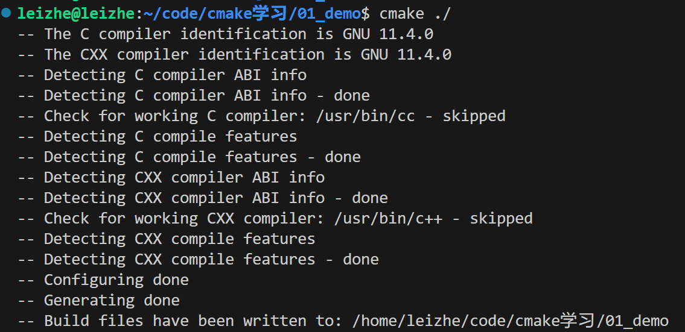

执行完毕成功，生成以下文件

CMakeCache.txt  CMakeFiles  cmake_install.cmake  CMakeLists.txt  main.cpp  Makefile

（4）使用make指令

使用make工具编译我们的工程，生成可执行文件hello

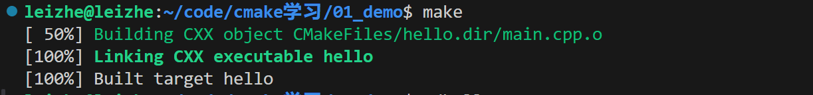

对于指令的解释：

⚫**第一行 project(HELLO)**
project 是一个命令，命令的使用方式有点类似于 C 语言中的函数，因为命令后面需要提供一对括号，
并且通常需要我们提供参数，多个参数使用空格分隔而不是逗号“,”。
project 命令用于设置工程的名称，括号中的参数 HELLO 便是我们要设置的工程名称；设置工程名称并
不是强制性的，但是最好加上。
⚫ **第二行 add_executable(hello ./main.c)**
add_executable 同样也是一个命令，用于生成一个可执行文件，在本例中传入了两个参数，第一个参数
表示生成的可执行文件对应的文件名，第二个参数表示对应的源文件；所以 add_executable(hello ./main.c)表
示需要生成一个名为 hello 的可执行文件，所需源文件为当前目录下的 main.c。

### Out_of_Source方式创建

cmake 生成的文件以及最终的可执行文件 hello 与工程的源码文件 main.c 混在了一起，这使得工程看起来非常乱，当我们需要清理 cmake 产生的文件时将变得非常麻烦，这不是我们想看到的；我们需要将构建过程生成的文件与源文件分离开来，不让它们混杂在一起，也就是使用 out-of-source 方式构建。

将 cmake 编译生成的文件清理下，然后在工程目录下创建一个 build 目录，如下所示：

然后进入到 build 目录下执行 cmake：

```
cd build/
cmake ../
make
```

这样 cmake 生成的中间文件以及 make 编译生成的可执行文件就全部在 build 目录下了，如果要清理工程，直接删除 build 目录即可，这样就方便多了。

### 多个文件


指令查找链接：

[cmake-commands(7) — CMake 3.5.2 Documentation](https://cmake.org/cmake/help/v3.5/manual/cmake-commands.7.html)


## 静态库和动态库

在Windows下静态库的后缀为：.lib、动态库后缀为：.dll；

而在Linux下静态库的后缀为：.a或 .la、动态库的后缀为：.so。

###  （1）静态库

**<font color='red'>静态库生成</font>**

1. 写源文件，通过 `gcc -c xxx.c` 生成目标文件。
2. 用 `ar` 归档目标文件，生成静态库。
3. 配合静态库，写一个使用静态库中函数的头文件。
4. 使用静态库时，在源码中包含对应的头文件，链接时记得链接自己的库。


使用gcc，为这两个源文件生成目标文件：

```
g++ -c test.cpp test2.cpp
```

我们就得到了 test.o 和 test2.o。

**<font color='blue'>归档目标文件，得到静态库</font>**

我们使用 ar 将目标文件归档：

```undefined
ar crv libmylib.a test.o test2.o
```

我们就得到了libmylib.a，这就是我们需要的静态库。

上述命令中 crv 是 ar的命令选项：

- c 如果需要生成新的库文件，不要警告
- r 代替库中现有的文件或者插入新的文件
- v 输出详细信息

通过 `ar t libmylib.a` 可以查看 `libmylib.a` 中包含的目标文件。

可以通过 `ar --help` 查看更多帮助。

注意：我们要生成的库的文件名必须形如 `libxxx.a` ，这样我们在链接这个库时，就可以用 `-lxxx`。
反过来讲，当我们告诉编译器 `-lxxx`时，编译器就会在指定的目录中搜索 `libxxx.a` 或是 `libxxx.so`。

**<font color='blue'>生成对应的头文件</font>**

头文件定义了 libmylib.a 的接口，也就是告诉用户怎么使用 libmylib.a。

新建my_lib.h， 写入内容如下：


**<font color='red'>静态库使用</font>**


参考：[Linux静态库生成指南 - JollyWing - 博客园 (cnblogs.com)](https://www.cnblogs.com/jiqingwu/p/4325382.html)

[详解Linux下静态库/动态库的生成和使用（含代码示例和操作流程）&&动态库和静态库的区别_生成静态库的过程及作用-CSDN博客](https://blog.csdn.net/weixin_47826078/article/details/120474883)

###  （2）动态库

动态库生成


动态库使用


## 文件格式介绍

### elf文件

来源：[ELF文件格式的详解_.elf-CSDN博客](https://blog.csdn.net/pingxiaozhao/article/details/109239221)

#### 1.说明

ELF的英文全称是The Executable and Linking Format，最初是由UNIX系统实验室开发、发布的ABI(Application Binary Interface)接口的一部分，也是Linux的主要可执行文件格式。

从使用上来说，主要的ELF文件的种类主要有三类：

- 可执行文件（.out）：Executable File，包含代码和数据，是可以直接运行的程序。其代码和数据都有固定的地址 （或相对于基地址的偏移 ），系统可根据这些地址信息把程序加载到内存执行。
- 可重定位文件（.o文件）：Relocatable File，包含基础代码和数据，但它的代码及数据都没有指定绝对地址，因此它适合于与其他目标文件链接来创建可执行文件或者共享目标文件。
- 共享目标文件（.so）：Shared Object File，也称动态库文件，包含了代码和数据，这些数据是在链接时被链接器（ld）和运行时动态链接器（ld.so.l、libc.so.l、ld-linux.so.l）使用的。

本文主要从elf文件的组成构造的角度来进行分析，将elf文件的解析通过一步一步的分析得到里面的信息，同时通过python脚本解析，可以直观的看到文件的信息，通过本文的阅读，将对elf文件格式有着更加深刻的理解。

#### 2.elf文件的基本格式

elf文件是有一定的格式的，从文件的格式上来说，分为汇编器的链接视角与程序的执行视角两种去分析ELF文件。

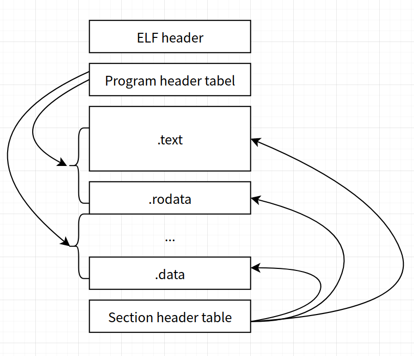

从程序执行视角来说，这就是Linux加载器加载的各种Segment的集合。比如只读代码段、数据的读写段、符号段等等。而从链接的视角上来看，elf又分为各种的sections。

注意Section Header Table和Program Header Table并不是一定要位于文件开头和结尾的，其位置由ELF Header指出，上图这么画只是为了清晰。

为了彻底的弄清楚elf文件的内容，可以先从ELF文件的头部开始分析。

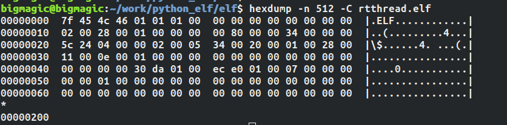

根据readelf可以得到该文件的头部信息的情况。

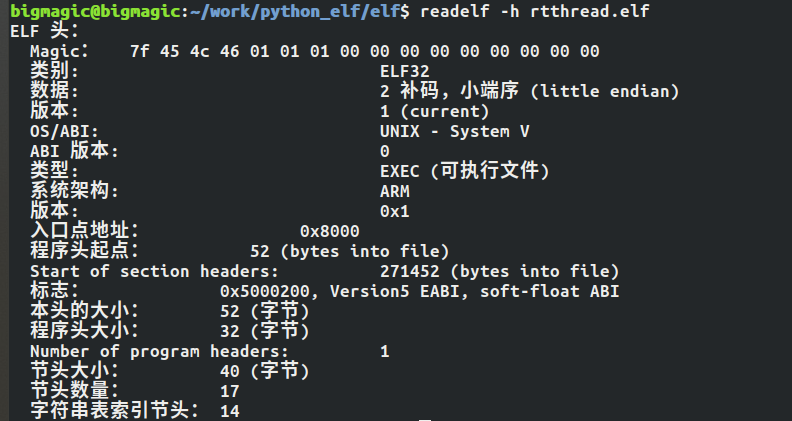

根据定义，elf32的结构体定义，在Linux上可以在`/usr/include/elf.h`中找到

```
#define EI_NIDENT (16)
 
typedef struct
{
  unsigned char e_ident[EI_NIDENT];     /* Magic number and other info */
  Elf32_Half    e_type;                 /* Object file type */
  Elf32_Half    e_machine;              /* Architecture */
  Elf32_Word    e_version;              /* Object file version */
  Elf32_Addr    e_entry;                /* Entry point virtual address */
  Elf32_Off     e_phoff;                /* Program header table file offset */
  Elf32_Off     e_shoff;                /* Section header table file offset */
  Elf32_Word    e_flags;                /* Processor-specific flags */
  Elf32_Half    e_ehsize;               /* ELF header size in bytes */
  Elf32_Half    e_phentsize;            /* Program header table entry size */
  Elf32_Half    e_phnum;                /* Program header table entry count */
  Elf32_Half    e_shentsize;            /* Section header table entry size */
  Elf32_Half    e_shnum;                /* Section header table entry count */
  Elf32_Half    e_shstrndx;             /* Section header string table index */
} Elf32_Ehdr;
```

上述的`Elf32_Half`定义

```cobol
/* Type for a 16-bit quantity.  */


typedef uint16_t Elf32_Half;
```

其中`Elf32_Word`的定义

```cobol
/* Types for signed and unsigned 32-bit quantities.  */


typedef uint32_t Elf32_Word;
```

然后`Elf32_Addr`与`Elf32_Off`定义

```cobol
/* Type of addresses.  */


typedef uint32_t Elf32_Addr;


 


/* Type of file offsets.  */


typedef uint32_t Elf32_Off;
```

有了这些数据结构的信息，然后对应具体的数据细节如下：

- **e_ident[EI_NIDENT]**

文件的标识以及标识描述了elf如何编码等信息。

```cobol
Magic：   7f 45 4c 46 01 01 01 00 00 00 00 00 00 00 00 00
```

关于该结构体的索引可以看下面的表格：

| 名称       | 取值 | 目的           |
| :--------- | :--- | :------------- |
| EI_MAG0    | 0    | 文件标识(0x7f) |
| EI_MAG1    | 1    | 文件标识(E)    |
| EI_MAG2    | 2    | 文件标识(L)    |
| EI_MAG3    | 3    | 文件标识(F)    |
| EI_CLASS   | 4    | 文件类         |
| EI_DATA    | 5    | 数据编码       |
| EI_VERSION | 6    | 文件版本       |
| EI_PAD     | 7    | 补齐字节开始处 |
| EI_NIDENT  | 16   | e_ident[]大小  |

EI_CLASS的内容，当取值为0时，是非法类别，1是32位的目标，2是64位的目标。这里是1所以程序是32位的目标。

EI_DATA表示数据的编码，当为0时，表示非法数据编码，1表示高位在前，2表示低位在前。

EL_VERSION表示了elf的头部版本号码。

前面四个基本上确定的，内容第一个字符为7f，后面用ELF字符串表示该文件为ELF格式。

- **e_type**

该数据类型是uint16_t数据类型的，占两个字节。通过字段查看，可以看到这个值为`00 02`。表格定义如下：

| 名称      | 取值   | 含义               |
| :-------- | :----- | :----------------- |
| ET_NONE   | 0x0000 | 未知目标文件格式   |
| ET_ERL    | 0x0001 | 可重定位文件       |
| ET_EXEC   | 0x0002 | 可执行文件         |
| ET_DYN    | 0x0003 | 共享目标文件       |
| ET_CORE   | 0x0004 | Core文件(转储格式) |
| ET_LOPROC | 0xff00 | 特定处理器文件     |
| ET_HIPROC | 0xffff | 特定处理器文件     |

对应表格内容，可以看到类型为`EXEC`即可执行文件类型。

- **e_machine**

由字段可以看到为`00 28`，关于这个字段的解析，基本上就是表示该elf文件是针对哪个处理器架构的。

下面只列出几个常见的架构的序号

| 名称     | 取值 | 含义                       |
| :------- | :--- | :------------------------- |
| EM_NONE  | 0    | No machine                 |
| EM_SPARC | 2    | SPARC                      |
| EM_386   | 3    | Intel 80386                |
| EM_MIPS  | 8    | MIPS I Architecture        |
| EM_PPC   | 0x14 | PowerPC                    |
| EM_ARM   | 0x28 | Advanced RISC Machines ARM |

通过上述的表格，可以看到该架构是ARM处理器上运行的程序。

- **e_version**

该字段占四个字节，表示当前文件版本的信息。现在取值为`00 00 00 01`。从取值上来看

| 名称       | 取值 | 含义     |
| :--------- | :--- | :------- |
| EV_NONE    | 0    | 非法版本 |
| EV_CURRENT | 1    | 当前版本 |

- **e_entry**

这里表示程序的入口地址，目前为四字节，所以通过字段解析到的内容为`00 00 80 00`。得到可执行程序的入口地址为`0x8000`。

- **e_phoff**

该字段表示程序表头偏移。占四个字节，根据字段解析，可以查看当前的偏移量为`00 00 00 34`。也就是实际的偏移量为52个字节。这52个字节其实就是头部的信息数据结构体的大小。

- **e_shoff**

该区域比较重要，记录了section的偏移地址。为四字节，解析出来的字段为`0x00 04 24 5c`。所以得到地址为0x4245c。

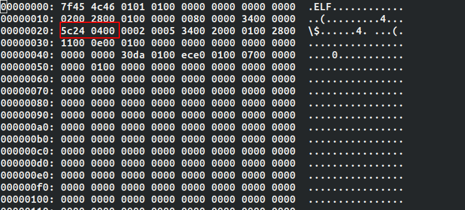

根据这个偏移得到section的内容：

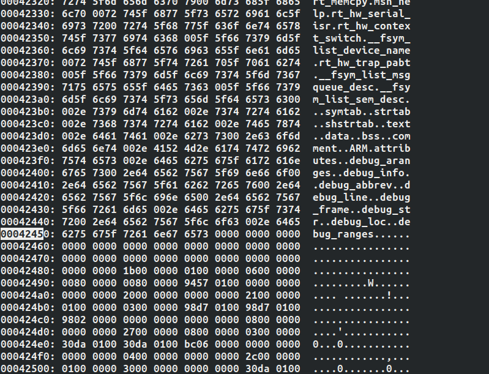

通过`readelf -t`也可以得到类似的结果。


关于节区如何解析。后面再进行描述。

- **e_flags**

特定处理器格式的标志，这里的字段解析为`05 00 02 00`。与特定的处理器相关。

- **e_ehsize**

elf文件的头部大小。该取值与头文件结构体的大小相关，目前为52字节，即`00 34`。

- **e_phentsize**

程序头部表项大小，当前取值为`00 20`，为32个字节，这里表示

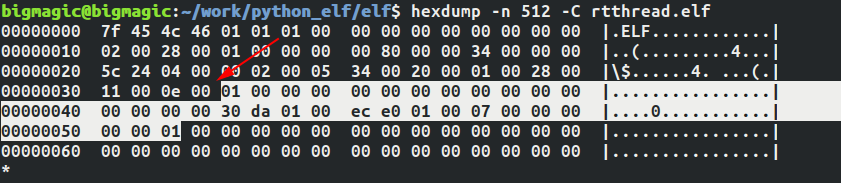

关于程序表项的解析，后面再进行具体分析。

- **e_phnum**

目前取值为`00 01`，这里表示程序头的个数当前只有一个程序头，如果有多个程序头表，那么会在elf头文件之后，也就是52个字节之后，依次向下排列。因为这里是1，所以只有1个程序头。

- **e_shentsize**

表示节区头部表格大小，解析字段为`00 28`,也就是第一个节区的大小为40个字节的偏移处。根据`e_shoff`可以知道。

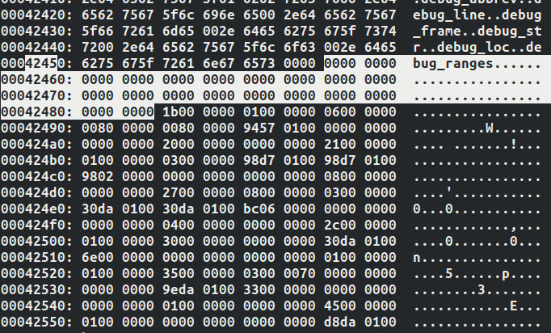

将从`e_shoff`的区域向后面偏移40个字节，得到第一个节区的内容。

- **e_shnum**

节区的数量，由字段解析得到数据为`00 11`。此时得到节区的数量为17个。通过`readelf -t`也可以解析到节区的数量为17个。

```ruby
bigmagic@bigmagic:~/work/python_elf/elf$ readelf -t rtthread.elf 


There are 17 section headers, starting at offset 0x4245c:
```

- **e_shstrndx**

标记字符串节区的索引。当前的解析为`00 0e`。也就是14个节区为字符节区。


到这里，头部信息的相关字段就解析完成了。

#### 4.elf文件的节区（Section）

elf文件中的节是从编译器链接角度来看文件的组成的。从链接器的角度上来看，包括指令、数据、符号以及重定位表等等。

**4.1 节区的作用**

在可从定位的可执行文件中，节区描述了文件的组成，节的位置等信息。通过`readelf -s`可以查看信息。

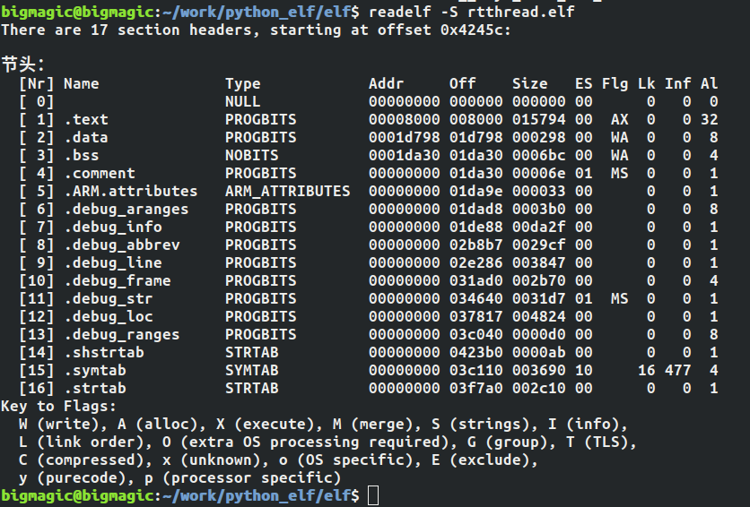

这些节信息通过特定的地址偏移组成了一个elf文件的整体。

**4.2 节区的组成**

关于理解ELF中的Section。首先需要知道程序的链接视图，在编译器将一个一个.o文件链接成一个可以执行的elf文件的过程中，同时也生成了一个表。这个表记录了各个Section所处的区域。在程序中，程序的`section header`有多个，但是大小是一样。拿elf32文件来说

```cobol
typedef struct


{


  Elf32_Word sh_name;  /* Section name (string tbl index) */


  Elf32_Word sh_type;  /* Section type */


  Elf32_Word sh_flags;  /* Section flags */


  Elf32_Addr sh_addr;  /* Section virtual addr at execution */


  Elf32_Off sh_offset;  /* Section file offset */


  Elf32_Word sh_size;  /* Section size in bytes */


  Elf32_Word sh_link;  /* Link to another section */


  Elf32_Word sh_info;  /* Additional section information */


  Elf32_Word sh_addralign;  /* Section alignment */


  Elf32_Word sh_entsize;  /* Entry size if section holds table */


} Elf32_Shdr;
```

根据**e_shoff**可以找到section的地址，根据`e_shentsize`可以找到具体的第一个section的内容。


如果要找到每个段的具体细节，首先可以根据e_shstrndx找到节的字段。由于e_shstrndx=14。而且每个为40字节。那么一共是560字节的偏移。从`e_shoff`的地址`0x4245c`开始，首先偏移了`e_shentsize`也就是40个字节。然后向下得到40x14个Section表项。最后可以得到e_shstrndx对应的节区。

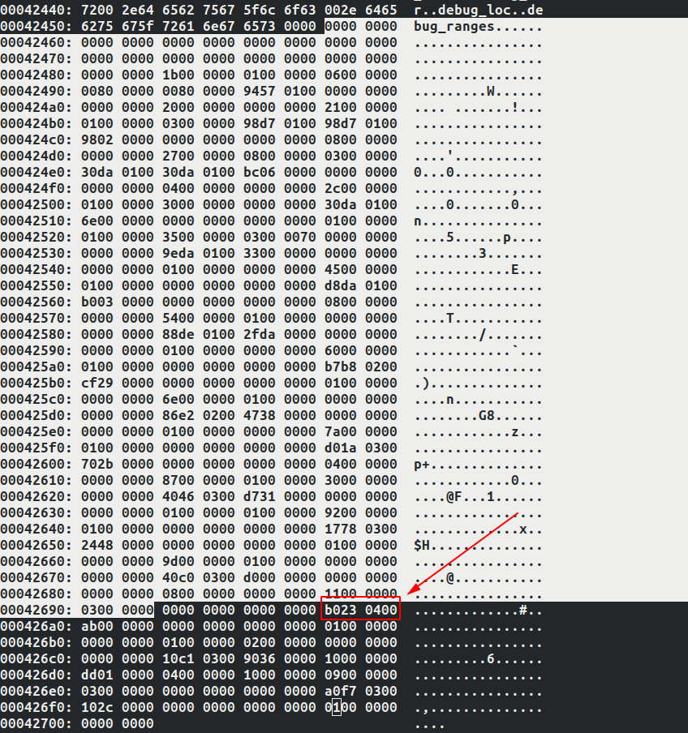

为什么首先需要得到这个字符串节区，通过这个就可以得到节区的名字了。然后通过计算，节区字符串存在的区域：

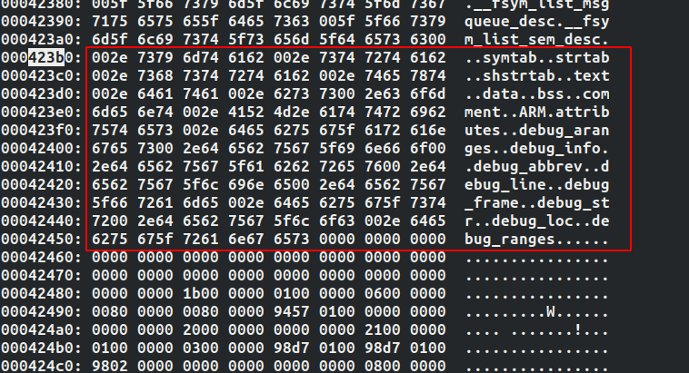

每个字符串以`\0`结尾。大小为`0000ab`也就是171个字节。接下来我们来举个具体的例子来解析Section。比如要读取.text的段。那么首先看一下细节。


首先从字段结构体上进行分析：

- sh_name

表示从e_shstrndx的偏移地址开始，得到的字符字符串信息为该段的名字。目前解析到的为0x1b。最后算出得到实际的名称为.text。


- sh_type

字段的类型为01，关于sh_type的类型，解析如下：

```cobol
/* Legal values for sh_type (section type).  */


 


#define SHT_NULL            0        /* Section header table entry unused */


#define SHT_PROGBITS        1        /* Program data */


#define SHT_SYMTAB          2        /* Symbol table */


#define SHT_STRTAB          3        /* String table */


#define SHT_RELA            4        /* Relocation entries with addends */


#define SHT_HASH            5        /* Symbol hash table */


#define SHT_DYNAMIC         6        /* Dynamic linking information */


#define SHT_NOTE            7        /* Notes */


#define SHT_NOBITS          8        /* Program space with no data (bss) */


#define SHT_REL             9        /* Relocation entries, no addends */


#define SHT_SHLIB          10        /* Reserved */


#define SHT_DYNSYM         11        /* Dynamic linker symbol table */


#define SHT_INIT_ARRAY     14        /* Array of constructors */


#define SHT_FINI_ARRAY     15        /* Array of destructors */


#define SHT_PREINIT_ARRAY  16        /* Array of pre-constructors */


#define SHT_GROUP          17        /* Section group */


#define SHT_SYMTAB_SHNDX   18        /* Extended section indeces */


#define    SHT_NUM         19        /* Number of defined types.  */


#define SHT_LOOS           0x60000000    /* Start OS-specific.  */


#define SHT_GNU_ATTRIBUTES 0x6ffffff5    /* Object attributes.  */


#define SHT_GNU_HASH       0x6ffffff6    /* GNU-style hash table.  */


#define SHT_GNU_LIBLIST    0x6ffffff7    /* Prelink library list */


#define SHT_CHECKSUM       0x6ffffff8    /* Checksum for DSO content.  */


#define SHT_LOSUNW         0x6ffffffa    /* Sun-specific low bound.  */


#define SHT_SUNW_move      0x6ffffffa


#define SHT_SUNW_COMDAT    0x6ffffffb


#define SHT_SUNW_syminfo   0x6ffffffc


#define SHT_GNU_verdef     0x6ffffffd    /* Version definition section.  */


#define SHT_GNU_verneed    0x6ffffffe    /* Version needs section.  */


#define SHT_GNU_versym     0x6fffffff    /* Version symbol table.  */


#define SHT_HISUNW         0x6fffffff    /* Sun-specific high bound.  */


#define SHT_HIOS           0x6fffffff    /* End OS-specific type */


#define SHT_LOPROC         0x70000000    /* Start of processor-specific */


#define SHT_HIPROC         0x7fffffff    /* End of processor-specific */


#define SHT_LOUSER         0x80000000    /* Start of application-specific */


#define SHT_HIUSER         0x8fffffff    /* End of application-specific */
```

当前为1，所以得到数据为程序数据。比如`.text .data .rodata`等等。

- sh_flags

表示段的标志，`A`表示分配的内存、AX表示分配可执行、WA表示分配内存并且可以修改。

- sh_addr

加载后程序段的虚拟地址

- **sh_offset**

表示段在文件中的偏移。

- sh_size

段的长度

- sh_addralign

段对齐

- sh_entsize

每项固定的大小

#### 5.elf文件的段(Segment)

关于`Linking View`与`Execution View`的具体含义，可以查看

```cobol
http://www.skyfree.org/linux/references/ELF_Format.pdf
```

这里有一张图值得研究一下：

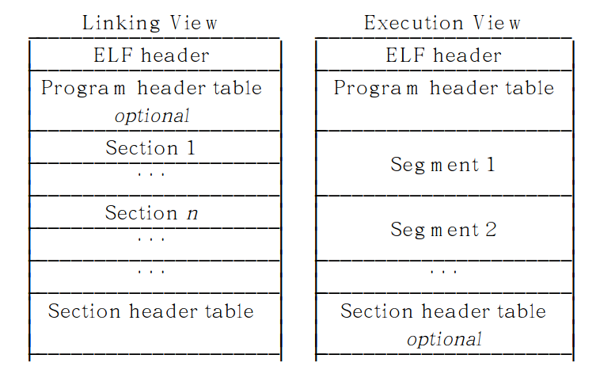

对于链接视图，也就是我们前面分析的Section，可以理解目标代码文件的内容布局。而右边的ELF的执行视图，则可以理解为可执行的文件内容布局。链接视图由sections组成，而可执行的文件的内容由segment组成。

两者是有一些区别的，我们平时在进行程序构建的时候理解的.text、.bss、.data段，这些都是section,也就节区的概念。这些段通过`section header table`进行组织与重定位。

但是对于segment来说，程序代码段、数据段是Segment。代码段又可以分为.text，数据段又分为.data、.bss等。

通过`readelf -l`可以查看具体的可执行文件的细节。


这里的信息和程序的加载直接相关。具体的elf文件加载过程这篇文章不会多说，后面会写文章专门叙述。本文的目的是elf文件格式的解析过程。

## 进程、线程

**线程是进程内部的一条执行序列或执行路径，一个进程可以包含多条线程。**

- 从资源分配的角度来看，进程是操作系统进行资源分配的基本单位。
- 从资源调度的角度来看，线程是资源调度的最小单位，是程序执行的最小单位

### 进程


### 线程


线程的实现方式

1. **内核级线程**（由内核直接创建和管理线程，虽然创建开销较大，但是可以利用多处理器的资源）
2. **用户级线程**（由线程库创建和管理多个线程，线程的实现都是在用户态，内核无法感知，创建开销较小，无法使用多处理器的资源）
3. **混合级线程**（结合以上两种方式实现，可以利用多处理器的资源，从而在用户空间中创建更多的线程，从而映射到内核空间的线程中，多对多，N：M（N>>M））

#### 线程库的使用

1、线程的创建

```
#include<phread.h>

int pthread_create(pthread_t *id , pthread_attr_t *attr, void(*fun)(void*), void *arg);

```

- id ：传递一个pthread_t类型的变量的地址，创建成功后，用来获取新创建的线程的TID
- attr：指定线程的属性 默认使用NULL
- fun：线程函数的地址
- arg：传递给线程函数的参数
- 返回值，成功返回0，失败返回错误码


1、查看进程号

```
ps -ef | grep rts
```

1.1 查看该进程下线程号

```
ps -T -p 进程号
```

PIDWie进程号，SPID为线程号，CMD为线程名称。

1.2  实时显示PID进程内的各个线程情况

```
top -H -p PID 
```

1.3 杀进程方法

传递signal给指定PID

```
kill -9 pid
```


# linux驱动八股文

1、驱动程序分为几类？
2、请解释一下Linux驱动程序的基本概念和原理
3、字符设备驱动需要实现的接口通常有哪些？
4、什么是设备树（Device Tree）？它在Linux驱动中的作用是什么？
5、如何编写一个字符设备驱动程序？
6、如何编写一个块设备驱动程序？
7、如何编写一个网络设备驱动程序？
8、主设备号与次设备号的作用
9、交叉编译器的作用
10、硬链接和软链接的区别
11、Linux内核的组成部分？
12、Linux内核有哪些同步方式？
13、如何在Linux系统中加载和卸载内核模块？
14、USB设备在Linux系统中如何进行驱动开发？
15、中断处理和中断控制器编程相关的知识有哪些？
16、用户空间和内核空间的通信方式有哪些？
17、BootLoader、Linux内核、根文件系统的关系？
18、linux内核中EXPORT_SYMBOL宏和EXPORT_SYMBOL_GPL宏的作用
19、DMA（Direct Memory Access）的工作原理是什么？在驱动开发中有哪些应用场景？
20、并行端口和GPIO编程在Linux驱动开发中的应用有哪些？
21、讲解一下时钟、定时器以及延时函数在驱动开发中的使用方法。
22、文件操作函数和IO操作函数在Linux驱动开发中的区别和使用方法是什么？
23、进程上下文和中断上下文有什么区别？在驱动开发过程中如何正确地使用它们？
24、请解释一下Linux字符设备文件系统的注册与管理机制。
25、container_of(ptr, type, member)的作用
26、kmalloc与vmalloc区别
27、内存管理单元MMU的作用？
28、简述MMU将VA转为PA的过程
29、操作系统的内存分配一般有哪几种方式，各有什么优缺点？
30、proc文件系统和sysfs文件系统分别用于什么目的？在驱动开发中如何使用它们？
31、Platform设备和ACPI（Advanced Configuration and Power Interface）之间有什么关系？在驱动开发中如何处理它们？
32、如何进行Linux驱动程序的性能调优和优化？请列举一些常用的技巧。
33、在虚拟化环境下，如何进行设备模拟和虚拟设备驱动开发？
34、设备电源管理及电源状态转换（Power Management）在Linux驱动中的应用方法是什么？
35、如何处理驱动程序中的错误，并进行调试？列举一些常用的内核调试器和跟踪工具。
36、在编写Linux驱动程序时，有哪些安全性与稳定性方面需要考虑的因素？
37、多线程编程和同步机制在Linux驱动开发中的应用有哪些？请举例说明。
38、Linux驱动程序应该考虑哪些可扩展性和可移植性问题？
39、如何解决不同内核版本兼容性问题，在不同版本的Linux系统上运行相同的驱动程序？
40、在嵌入式系统中，如何进行Linux驱动开发？有哪些特殊考虑点？
41、请讲解一下设备模型（Device Model）和总线（Bus）机制在Linux驱动开发中的应用。
42、如何编写文件系统相关的驱动程序，例如FAT、EXT4等？
43、在Linux驱动开发中，如何处理键盘、鼠标和触摸屏等输入设备？
44、视频显示设备驱动开发需要考虑哪些因素？请列举一些相关问题。
45、你了解哪些与Linux驱动开发相关的工具和调试技术？


# RTOS

## 邮箱

邮箱在操作系统中是一种常用的IPC通信方式，邮箱相比于信号量与消息队列来说，其开销更低，效率更高，所以常用来做==线程与线程==、==中断与线程间== 的通信。

通过邮箱，线程或中断服务函数可以将一个或多个邮件放入邮箱中。同样，一个或多个线程可以从邮箱中获得 邮件消息。当有多个邮件发送到邮箱时，通常应将先进入邮箱的邮件先传给线程，也就是说，线程先得到的是 最先进入邮箱的消息，即先进先出原则(FIFO)，同时RT-Thread中的邮箱支持优先级，也就是说在所有等待邮 件的线程中优先级最高的会先获得邮件。

- 邮件支持先进先出方式排队与优先级排队方式，支持异步读写工作方式。
- 发送与接收邮件均支持超时机制。
- 一个线程能够从任意一个消息队列接收和发送邮件。
- 多个线程能够向同一个邮箱发送邮件和从中接收邮件。
- **邮箱中的每一封邮件只能容纳固定的4字节内容**（可以存放地址）。
- 当队列使用结束后，需要通过删除邮箱以释放内存。

邮箱与消息队列很相似，消息队列中消息的长度是可以由用户配置的，但邮箱中邮件的大小却只能是固定容纳4 字节的内容，所以，使用邮箱的开销是很小的，因为传递的只能是4字节以内的内容，那么其效率会更高。

