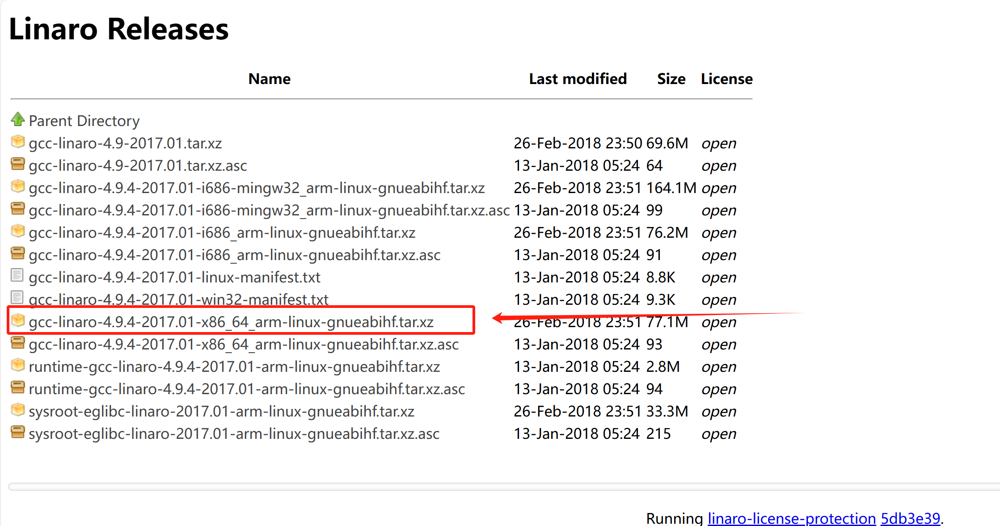

## 环境配置

https://www.linaro.org/downloads/

详细地址：https://releases.linaro.org/components/toolchain/binaries/4.9-2017.01/arm-linux-gnueabihf/

需要下载linaro当中的编译器，为了交叉编译

首先在Linux当中创建文件夹

创建一个linux_code文件夹，然后在文件夹中创建**nfs**和**tool**文件夹；再将下载好的编译器放到tool文件夹下面。

然后再创建一个文件夹，

在 **usr/local**当中创建一个**arm**的文件夹。

## 在vscode中配置Remote-SSH

首先安装remote-ssh插件，

然后重启vscode就能打开了。但是每次打开都需要登录密码。

# linux驱动八股文

1、驱动程序分为几类？
2、请解释一下Linux驱动程序的基本概念和原理
3、字符设备驱动需要实现的接口通常有哪些？
4、什么是设备树（Device Tree）？它在Linux驱动中的作用是什么？
5、如何编写一个字符设备驱动程序？
6、如何编写一个块设备驱动程序？
7、如何编写一个网络设备驱动程序？
8、主设备号与次设备号的作用
9、交叉编译器的作用
10、硬链接和软链接的区别
11、Linux内核的组成部分？
12、Linux内核有哪些同步方式？
13、如何在Linux系统中加载和卸载内核模块？
14、USB设备在Linux系统中如何进行驱动开发？
15、中断处理和中断控制器编程相关的知识有哪些？
16、用户空间和内核空间的通信方式有哪些？
17、BootLoader、Linux内核、根文件系统的关系？
18、linux内核中EXPORT_SYMBOL宏和EXPORT_SYMBOL_GPL宏的作用
19、DMA（Direct Memory Access）的工作原理是什么？在驱动开发中有哪些应用场景？
20、并行端口和GPIO编程在Linux驱动开发中的应用有哪些？
21、讲解一下时钟、定时器以及延时函数在驱动开发中的使用方法。
22、文件操作函数和IO操作函数在Linux驱动开发中的区别和使用方法是什么？
23、进程上下文和中断上下文有什么区别？在驱动开发过程中如何正确地使用它们？
24、请解释一下Linux字符设备文件系统的注册与管理机制。
25、container_of(ptr, type, member)的作用
26、kmalloc与vmalloc区别
27、内存管理单元MMU的作用？
28、简述MMU将VA转为PA的过程
29、操作系统的内存分配一般有哪几种方式，各有什么优缺点？
30、proc文件系统和sysfs文件系统分别用于什么目的？在驱动开发中如何使用它们？
31、Platform设备和ACPI（Advanced Configuration and Power Interface）之间有什么关系？在驱动开发中如何处理它们？
32、如何进行Linux驱动程序的性能调优和优化？请列举一些常用的技巧。
33、在虚拟化环境下，如何进行设备模拟和虚拟设备驱动开发？
34、设备电源管理及电源状态转换（Power Management）在Linux驱动中的应用方法是什么？
35、如何处理驱动程序中的错误，并进行调试？列举一些常用的内核调试器和跟踪工具。
36、在编写Linux驱动程序时，有哪些安全性与稳定性方面需要考虑的因素？
37、多线程编程和同步机制在Linux驱动开发中的应用有哪些？请举例说明。
38、Linux驱动程序应该考虑哪些可扩展性和可移植性问题？
39、如何解决不同内核版本兼容性问题，在不同版本的Linux系统上运行相同的驱动程序？
40、在嵌入式系统中，如何进行Linux驱动开发？有哪些特殊考虑点？
41、请讲解一下设备模型（Device Model）和总线（Bus）机制在Linux驱动开发中的应用。
42、如何编写文件系统相关的驱动程序，例如FAT、EXT4等？
43、在Linux驱动开发中，如何处理键盘、鼠标和触摸屏等输入设备？
44、视频显示设备驱动开发需要考虑哪些因素？请列举一些相关问题。
45、你了解哪些与Linux驱动开发相关的工具和调试技术？

