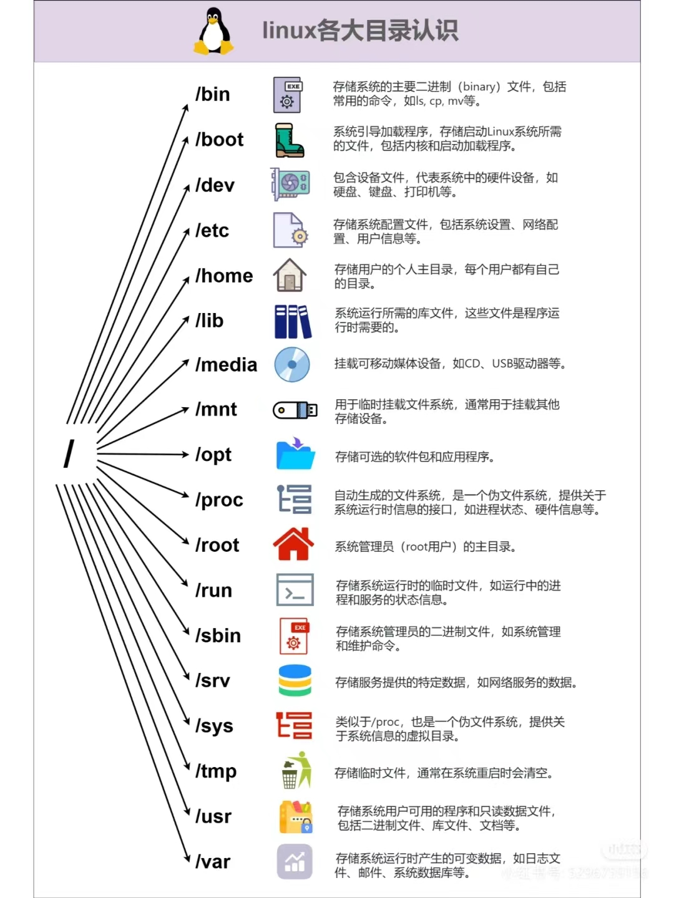
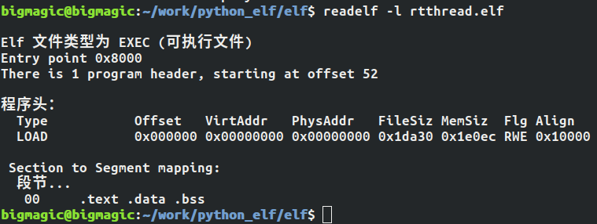
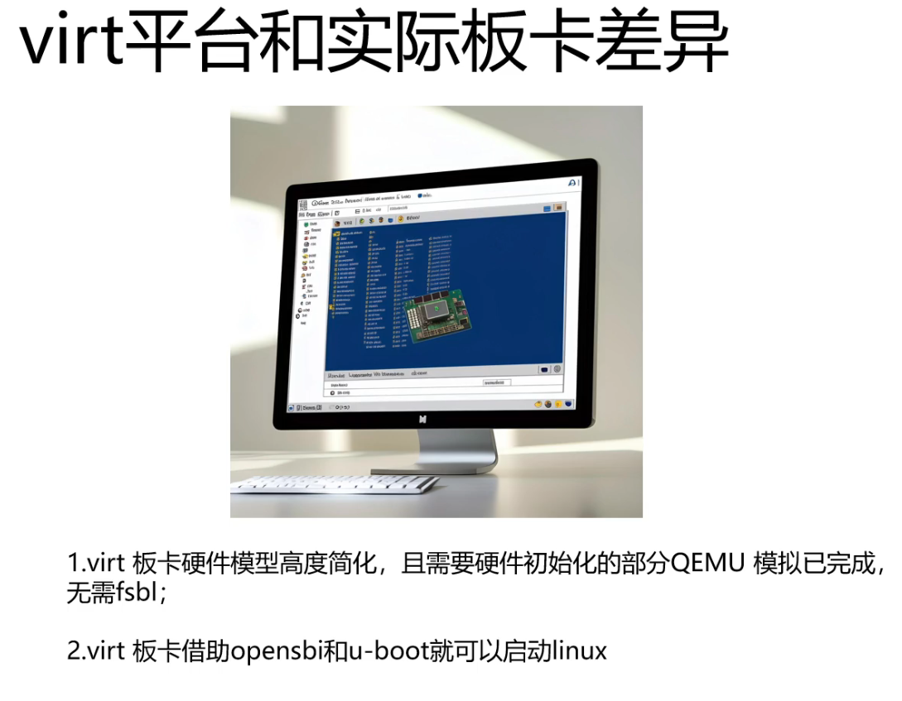
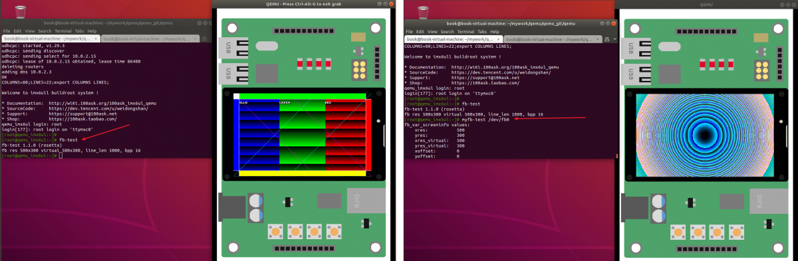
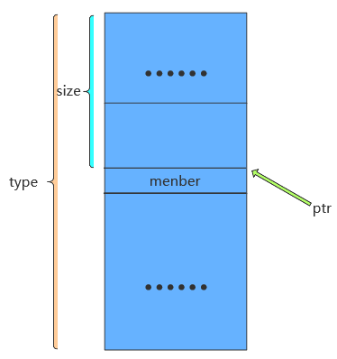

## linux目录



**/bin目录**

该目录下的命令可以被root与一般账号所使用，由于这些命令在挂接其它文件系统之前就可以使用，所以/bin目录必须和根文件系统在同一个分区中。 /bin目录下常用的命令有：cat、chgrp、chmod、cp、ls、sh、kill、mount、umount、mkdir等。我们之后在利用Busybox制作根文件系统时，在生成的bin目录下，可以看到一些可执行的文件，也就是可用的一些命令。

**/sbin 目录**

该目录下存放系统命令，即只有系统管理员（俗称最高权限的root）能够使用的命令，系统命令还可以存放在/usr/sbin,/usr/local/sbin目录下，/sbin目录中存放的是基本的系统命令，它们用于启动系统和修复系统等，与/bin目录相似，在挂接其他文件系统之前就可以使用/sbin，所以/sbin目录必须和根文件系统在同一个分区中。 /sbin目录下常用的命令有：shutdown、reboot、fdisk、fsck、init等，本地用户自己安装的系统命令放在/usr/local/sbin目录下。

**/dev目录**

该目录下存放的是设备与设备接口的文件，设备文件是Linux中特有的文件类型，在Linux系统下，以文件的方式访问各种设备，即通过读写某个设备文件操作某个具体硬件。比如通过”dev/ttySAC0”文件可以操作串口0，通过”/dev/mtdblock1”可以访问MTD设备的第2个分区。比较重要的文件有/dev/null, /dev/zero, /dev/tty, /dev/lp*等。

**/etc目录**

该目录下存放着系统主要的配置文件，例如人员的账号密码文件、各种服务的其实文件等。一般来说，此目录的各文件属性是可以让一般用户查阅的，但是只有root有权限修改。对于PC上的Linux系统，/etc目录下的文件和目录非常多，这些目录文件是可选的，它们依赖于系统中所拥有的应用程序，依赖于这些程序是否需要配置文件。在嵌入式系统中，这些内容可以大为精减。

**/lib目录**

该目录下存放共享库和可加载（驱动程序），共享库用于启动系统。运行根文件系统中的可执行程序，比如：/bin /sbin 目录下的程序。

**/home目录**

系统默认的用户文件夹，它是可选的，对于每个普通用户，在/home目录下都有一个以用户名命名的子目录，里面存放用户相关的配置文件。

**/root目录**

系统管理员（root）的主文件夹，即是根用户的目录，与此对应，普通用户的目录是/home下的某个子目录。

**/usr目录**

/usr目录的内容可以存在另一个分区中，在系统启动后再挂接到根文件系统中的/usr目录下。里面存放的是共享、只读的程序和数据，这表明/usr目录下的内容可以在多个主机间共享，这些主要也符合FHS标准的。/usr中的文件应该是只读的，其他主机相关的，可变的文件应该保存在其他目录下，比如/var。/usr目录在嵌入式中可以精减。

**/var目录**

与/usr目录相反，/var目录中存放可变的数据，比如spool目录（mail,news），log文件，临时文件。

**/proc目录**

procfs是“process filesystem”的缩写，所以它 也被称为进程文件系统。

这是一个空目录，常作为proc文件系统的挂接点，proc文件系统是个虚拟的文件系统，它没有实际的存储设备，里面的目录，文件都是由内核 临时生成的，用来表示系统的运行状态，也可以操作其中的文件控制系统。

**/mnt目录**

用于临时挂载某个文件系统的挂接点，通常是空目录，也可以在里面创建一引起空的子目录，比如/mnt/cdram /mnt/hda1 。用来临时挂载光盘、移动存储设备等。

**/tmp目录**

用于存放临时文件，通常是空目录，一些需要生成临时文件的程序用到的/tmp目录下，所以/tmp目录必须存在并可以访问。


## 环境配置

https://www.linaro.org/downloads/

详细地址：https://releases.linaro.org/components/toolchain/binaries/4.9-2017.01/arm-linux-gnueabihf/


需要下载linaro当中的编译器，为了交叉编译


首先在Linux当中创建文件夹


创建一个linux_code文件夹，然后在文件夹中创建**nfs**和**tool**文件夹；再将下载好的编译器放到tool文件夹下面。

然后再创建一个文件夹，

在 **usr/local**当中创建一个**arm**的文件夹。


## 在vscode中配置Remote-SSH

首先安装remote-ssh插件，


然后重启vscode就能打开了。但是每次打开都需要登录密码。

## gcc/g++

c语言使用gcc命令；c++程序使用g++命令。

（1）预处理

展开头文件，删除注释、空行等无用内容，替换宏定义。

```
gcc -E main.c -o main.i
```

（2）编译

检查语法错误，如有错误则报错，没错则生成汇编文件。

```
gcc -S main.i -o main.s           //注意：这里-S为大写
```

（3）汇编

将编译文件生成二进制目标文件。

```
gcc -c main.s -o main.o
```

（4）链接

将目标文件连接库文件，最终生成机器能够运行的二进制可执行程序。

```
gcc main.o -o main
```


.out是可执行文件，相当于win上的exe；

.o是编译中间目标文件，相当于win上的.obj；

.a是静态库，多个.o练链接得到，用于静态链接；

.so是共享库，用于动态链接，相当于win上.dll；


## makefile

参考：[Makefile(超详细一文读懂)-CSDN博客](https://blog.csdn.net/qq_51753728/article/details/142262405)

**注意：要了解make指令，需要先了解gcc命令**


Makefile 里面是由一系列的规则组成的，这些规则格式如下：

```
目标…... :  依赖文件集合…… 
 命令 1 
 命令 2 
 …… 
```


```
  main: main.o input.o calcu.o 
      gcc -o main  main.o input.o calcu.o 
  main.o: main.c 
      gcc -c main.c 
  input.o: input.c 
      gcc -c input.c 
  calcu.o: calcu.c 
      gcc -c calcu.c 
   
 clean: 
     rm *.o 
     rm main 
```

**上述代码中所有行首需要空出来的地方一定要使用“TAB”键！不要使用空格键！**

简洁版：

```
  objects = main.o input.o calcu.o
  main: $(objects)  
      gcc -o main $(objects) 
  
  .PHONY : clean 
  
  %.o : %.c 
      gcc -c $<  
   
  clean: 
	rm *.o 
    rm main 
```

```
  .PHONY : clean 
```

这句是**伪目标**。声明 clean 为伪目标以后不管当前目录下是否存在名为“clean”的文件，输入“make clean”的话规则后面的 rm 命令都会执行。

### 条件判断

其中条件关键字有 4 个：ifeq、ifneq、ifdef 和 ifndef，这四个关键字其实分为两对、ifeq 与ifneq、ifdef 与 ifndef，先来看一下 ifeq 和 ifneq，ifeq 用来判断是否相等，ifneq 就是判断是否不相等。

### Makefile函数使用

```
$(函数名 参数集合)
```

或

```
${函数名 参数集合}
```

参数集合是函数的多个参数，参数之间以逗号“,”隔开，函数名和参数之间以“空格”分隔开，函数的调用以“$”开头。


### 赋值符 =

```
1 name = zzk
2 curname = $(name)
3 name = zuozhongkai
4
5 print:
6 @echo curname: $(curname)
```


### 赋值符 :=

```
1 name = zzk
2 curname := $(name)
3 name = zuozhongkai
4
5 print:
6 @echo curname: $(curname)
```


### 赋值符 ?=

“?=”是一个很有用的赋值符，比如下面这行代码：

```
curname ?= zuozhongkai
```

上述代码的意思就是，如果变量 curname 前面没有被赋值，那么此变量就是“zuozhongkai”，如果前面已经赋过值了，那么就使用前面赋的值。

### 变量追加 +=

Makefile 中的变量是字符串，有时候我们需要给前面已经定义好的变量添加一些字符串进去，此时就要使用到符号“+=”，比如如下所示代码：

```
objects = main.o inpiut.o

objects += calcu.o
```

一开始变量 objects 的值为“main.o input.o”，后面我们给他追加了一个“calcu.o”，因此变量 objects 变成了“main.o input.o calcu.o”，这个就是变量的追加。


### 预定义变量

- 自定义变量：`变量名=变量值`，如`var=hello`

- 预定义变量

  - `AR` : 归档维护程序的名称，默认值为 ar
  - `CC `: C 编译器的名称，默认值为 cc
  - `CXX` : C++ 编译器的名称，默认值为 g++
  - `$@` : 目标的完整名称
  - `$<` : 第一个依赖文件的名称
  - `$^`: 所有的依赖文件

  

CC：c编译器的名称，默认值为cc。cpp c预编译器的名称默认值为$(CC) -E

```text
CC = gcc
```

### include

当 make 读取到 include 关键字的时候，会暂停读取当前的 Makefile，而是去读 include 包含的文件，读取结束后再继读取当前的 Makefile 文件。

```
include <filenames>
```

注意：include 关键字所在的行首可以包含一个或者是多个的空格（读取的时候空格会被自动的忽略），但是不能使用 Tab 开始，否则会把 include 当作式命令来处理。
包含的多个文件之间要使用空格分隔开。使用 include 包含进来的 Makefile 文件中，如果存在函数或者是变量的引用，它们会在包含的 Makefile 中展开。


### 打印信息

（1）echo

<font color=red>注:echo只能在target：后面的语句中使用，且前面是个TAB。</font>

```
all: 
	@echo "Hello Makefile"
	
输出为：
Hello Makefile
```

```
all: 
	echo "Hello Makefile"

输出为：
echo "Hello Makefile"
Hello Makefile
```

可以看到，Makefile的命令也打印在了终端，要想不输出命令的内容，可以**在命令前面加上@**

（2）info

```
$(info “here add the debug info”)
```

注,info信息,不打印信息所在行号

（3）warning

```
$(warning “here add the debug info”)
```

（4）error

```
$(error “error: this will stop the compile”)
```

这个可以停止当前[makefile](https://so.csdn.net/so/search?q=makefile&spm=1001.2101.3001.7020)的编译


### .d文件

在[Makefile](https://so.csdn.net/so/search?q=Makefile&spm=1001.2101.3001.7020)中，我们的依赖关系可能会需要包含一系列的头文件，比如，如果我们的main.c中有一句“#include "defs.h"”，那么我们的依赖关系应该是： 

```c
main.o : main.c defs.h
```

如果main.c 中包含了很多头文件，那main.o后面要跟N多的.h。你在加入或删除头文件时，也需要小心地修改Makefile。

2. 类似于如下的依赖关系只是建立了.o和.cc之间的依赖关系，那么.cc 改变时.o 会被重新编译。但.cc 中包含的.h改变时并不会影响到.o的重编。

```css
%.o: %.cc
 @echo "=======> Compiling $@"
 $(CPP) $(CPPFLAGS) -c -o $@ $<
```

所以需要建立* .o 和* .h的依赖。但往往*.h非常多，修改起来麻烦。

3. 大多数的C/C++编译器都支持一个“-M”的选项，即自动找寻源文件中包含的头文件，并生成一个依赖关系。例如，如果我们执行下面的命令： 
   
    ```c
    cc -M main.c 
    ```
    
     其输出是： 
    
    ```c
    main.o : main.c defs.h
    ```
    
    于是由编译器自动生成的依赖关系，这样一来，你就不必再手动书写若干文件的依赖关系，而由编译器自动生成了。需要提醒一句的是，如果你使用GNU的C/C++编译器，你得用“-MM”参数，不然，“-M”参数会把一些标准库的头文件也包含进来。 
    
    ```css
     cc -MM UartDev.cc 
    ```
    
    会在UartDev.d中生成如下内容。

UartDev.o UartDev.d: UartDev.cc ../../common/log.h UartDev.h ../../common/thread.h

从而，当某个.h 文件改变时会引起.o .d的重新编译。

当然还要在Makefile中包含.d文件：

```c
DEPS+= $(SRCS:.cc=.d)
include $(DEPS)
```

## 公司make脚本

执行顺序：

step1：

在输入./build_cssp命令之后，执行到

```
make all ARCH_TYPE=ARMv8 OS_TYPE=linux APP_TYPE=rts64  SHEND=1
```

此时all在makefile脚本中，为：

```
all: $(RTS_CSSP).elf secondary-outputs release
```

首先执行$(RTS_CSSP).elf，在makefile脚本中，为：

```
$(RTS_CSSP).elf: $(VOS_LIB) $(RTP_LIB) $(CST_LIB)
	@echo Building target: $@
	@echo Invoking: Linux gcc linker
	........
```

而，(RTS_CSSP).elf依赖于VOS_LIB、RTP_LIB和CST_LIB，首先到VOS_LIB中，在cssp_vos.mk脚本中，为：

```
VOS_LIB = $(VOS_DIR)/libvos.a
$(VOS_LIB): $(VOS_OBJS)
	$(AR) $(ARFLAGS) $(VOS_LIB) $(VOS_OBJS)
```

VOS_LIB依赖于VOS_OBJS，VOS_OBJS为vos目录下所有的xxx.o文件，xxx.o文件依赖于对应xxx.c文件，如下：

```makefile
$(VOS_DIR)/os/linux/%.o: $(VOS_DIR)/os/linux/%.c
	@echo ++++++++osal++++++++
	@echo Building file: $<
	@echo Invoking: Linux gcc compiler
	$(CC) $(CCFLAGS) $(VOS_INCLUDE_DIR) -MF"$(@:%.o=%.d)" -MT"$(@:%.o=%.d)" -o"$@" "$<"
	.......
```

执行完之后，执行下面程序的最后一句，将所有vos目录下的xxx.o文件静态链接为libvos.a文件【.a是静态库，多个.o练链接得到，用于静态链接】

```makefile
VOS_LIB = $(VOS_DIR)/libvos.a
$(VOS_LIB): $(VOS_OBJS)
	$(AR) $(ARFLAGS) $(VOS_LIB) $(VOS_OBJS)
```

此后以此将rtp和cst目录下c程序链接为对应静态库文件。

再返回执行后续命令，生成cssp_rts64.elf和cssp_rts64.dump文件。

```makefile
$(RTS_CSSP).elf: $(VOS_LIB) $(RTP_LIB) $(CST_LIB)
	@echo Building target: $@
	@echo Invoking: Linux gcc linker
	$(CC) -o $(CURRENT_DIR)/"$(RTS_CSSP).elf" $(LIBS) \
		$(OBJS) $(USER_OBJS) \
		$(VOS_OBJS) $(RTP_OBJS) $(CST_OBJS) $(LDFLAGS) 
	$(OBJDUMP) $(OBJDUMP_FLAGS) $(CURRENT_DIR)/$(RTS_CSSP).elf > $(CURRENT_DIR)/$(RTS_CSSP).dump
	$(OBJDUMP) -x $(CURRENT_DIR)/$(RTS_CSSP).elf |grep bss> $(CURRENT_DIR)/$(RTS_CSSP).bss
	@echo Finished building target: $@
	@echo ' '
$(RTS_CSSP).elf.size: $(RTS_CSSP).elf
	@echo Invoking: $(ARCH_TYPE) Linux Print Size
	$(MYSIZE) $(CURRENT_DIR)/$(RTS_CSSP).elf  |$(TEE) $(CURRENT_DIR)/"$(RTS_CSSP).elf.size"
	@echo Finished building: $@
	@echo ' '
```

最后执行，开始语句：

```makefile
all: $(RTS_CSSP).elf secondary-outputs release
release:
	-$(MKDIR) $(RELEASEDIR)
	-$(CP) $(RTS_CSSP).elf $(RELEASEDIR)/$(RTS_CSSP).elf
	-$(CP) $(RTS_CSSP).dump $(RELEASEDIR)/$(RTS_CSSP).dump
	-@echo ' '

```

将对应.elf和.dump文件移动到release目录下。


### armv8tools.mk脚本

```shell
CROSS_COMPILE = aarch64-linux-gnu-

AS  = $(CROSS_COMPILE)as	GNU 汇编器。实际上它是一族汇编器，因为它可以被编译或能够在各种不同平台上工作。
LD	= $(CROSS_COMPILE)ld		是连接器，它把一些目标和归档文件结合在一起，重定位数据，并连接符号引用。通常，建立一个新编译程序的最后一步就是调用ld。
CC	= $(CROSS_COMPILE)gcc
CPP	= $(CROSS_COMPILE)gcc -E	展开头文件，删除注释、空行等无用内容，替换宏定义。
AR	= $(CROSS_COMPILE)ar 建立、修改、提取归档文件。归档文件是包含多个文件内容的一个大文件，其结构保证了可以恢复原始文件内容。
NM	= $(CROSS_COMPILE)nm				列出目标文件中的符号。
STRIP   = $(CROSS_COMPILE)strip			丢弃目标文件中的全部或者特定符号。
OBJCOPY = $(CROSS_COMPILE)objcopy		把一种目标文件中的内容复制到另一种类型的目标文件中。
OBJDUMP = $(CROSS_COMPILE)objdump        反汇编
RANLIB	= $(CROSS_COMPILE)ranlib    产生归档文件索引，并将其保存到这个归档文件中。在索引中列出了归档文件各成员所定义的可重分配目标文件。
SIZE    = $(CROSS_COMPILE)size   列出目标文件每一段的大小以及总体的大小。默认情况下，对于每个目标文件或者一个归档文件中的每个模块只产生一行输出。

CCFLAGS += -march=armv8-a 
CCFLAGS += -D_ARCH_TYPE_ARMV8

OBJDUMP_FLAGS = -Dst
```


### common.mk脚本

```shell

# bin
RM := rm -rf
TEE := tee
CP := cp -fR
MKDIR := mkdir -p
MYSIZE := size

################################################################################
# makefile: common configuration
# created first vern. bais@2021.01
# add PRD_MD ...&&CST_XXX macros for products bais@2024.09
################################################################################

#SH_VENDOR_ID=$(VENDOR_ID)
#SH_PRODUCT_TYPE=$(PRODUCT_TYPE)
#SH_ARCH_TYPE=$(ARCH_TYPE)
#SH_OS_TYPE=$(OS_TYPE)
SH_APP_TYPE=$(APP_TYPE)     在build_cssp文件中定义：rts64
SH_BUILD_TYPE=$(BUILD_TYPE)	在build_cssp文件中定义：cross

#CCFLAGS += -DVENDOR_ID=$(SH_VENDOR_ID)
#CCFLAGS += -DPRODUCT_TYPE=$(SH_PRODUCT_TYPE)
#CCFLAGS += -DARCH_TYPE=$(SH_ARCH_TYPE)
#CCFLAGS += -DOS_TYPE=$(SH_OS_TYPE)
CCFLAGS += -DAPP_TYPE=$(SH_APP_TYPE)
CCFLAGS += -DBUILD_TYPE=$(SH_BUILD_TYPE)


# product
include $(CURRENT_DIR)/product_info.mk


# arch       ARCH_TYPE在build_css文件中定义，这里为if判断，判断为那种架构，如果ARCH_TYPE为ARMv8，则选择armv8tools.mk
ifeq ($(ARCH_TYPE),x86)
include $(CURRENT_DIR)/x86tools.mk
endif
ifeq ($(ARCH_TYPE),ARMv7)
include $(CURRENT_DIR)/armv7tools.mk
endif
ifeq ($(ARCH_TYPE),ARMv8)
include $(CURRENT_DIR)/armv8tools.mk
endif


# os
ifeq ($(OS_TYPE),linux)
include $(CURRENT_DIR)/linux.mk
CCFLAGS += -DVOS_LINUX
CCFLAGS += -DCST_OSTHRED_USER_BASE=1
endif
ifeq ($(OS_TYPE),seL4)
include $(CURRENT_DIR)/seL4.mk
CCFLAGS += -DVOS_SEL4
#Note:lx-seL4支持的app任务优先级是从4开始
CCFLAGS += -DCST_OSTHRED_USER_BASE=3
endif


# out 
APPOUT := cssp_rts                          
ifeq ($(APP_TYPE),rts64)       APP_TYPE在build_cssp文件中，一般定义为：rts64
APPOUT := cssp_rts64
endif
ifeq ($(APP_TYPE),rts32)
APPOUT := cssp_rts32
endif
```


### cssp_cst、cssp_rtp和cssp_vos

等三个文件，三个文件格式相同，下面为删减版：

```shell
# dir 
CST_DIR = $(PRDTDIR)/cst

# lib
CST_LIB = $(CST_DIR)/libcst.a
CST_LIB_FLAG = -lcst
CST_RED_DIR = -I $(CST_DIR)/red

CST_INCLUDE_DIR = \
-I $(ROOTDIR) \
-I $(CST_DIR) \
-I $(CST_DIR)/product \
-I $(CST_DIR)/cstbus \
-I $(CST_DIR)/cstlib \
-I $(CST_DIR)/diag \
-I $(CST_DIR)/com \
-I $(CST_DIR)/com/adapt \


ifeq ($(PRD_RED),1)
CST_INCLUDE_DIR += $(CST_RED_DIR)
endif

CST_INCLUDE_DIR += $(RTP_INCLUDE_DIR)
CST_INCLUDE_DIR += $(VOS_INCLUDE_DIR)


# obj
CST_OBJS = \
$(CST_DIR)/product/Cst.o \
$(CST_DIR)/product/vern.o \
$(CST_DIR)/cstbus/BHB_Interface.o \
$(CST_DIR)/cstbus/MasterCardMana.o \
$(CST_DIR)/cstbus/ProtoLinkAdapt.o \


ifeq ($(PRD_RED),1)
CST_OBJS += \
$(CST_DIR)/red/red_app_diag.o \
$(CST_DIR)/red/red_app_file.o \
$(CST_DIR)/red/red_app_sync.o \
$(CST_DIR)/red/red_link_config.o
endif

# dep
CST_C_DEPS = \
$(CST_DIR)/product/Cst.d \
$(CST_DIR)/product/vern.d \
$(CST_DIR)/cstbus/BHB_Interface.d \
$(CST_DIR)/cstbus/MasterCardMana.d \


ifeq ($(PRD_RED),1)
CST_C_DEPS += \
$(CST_DIR)/red/red_app_diag.d \
$(CST_DIR)/red/red_app_file.d \
$(CST_DIR)/red/red_app_sync.d \
$(CST_DIR)/red/red_link_config.d
endif

# all output file
CST_OUTPUT = $(CST_LIB) $(CST_OBJS) $(CST_C_DEPS)   包含.o .d文件


$(CST_DIR)/product/%.o: $(CST_DIR)/product/%.c    product目录下xx.o文件依赖该目录下.c文件
	@echo ++++++++cst++++++++
	@echo Building file: $<      本句中$< 表示文件目录及文件名
	@echo Invoking: Linux gcc compiler
	$(CC) $(CCFLAGS) $(CST_INCLUDE_DIR) -MF"$(@:%.o=%.d)" -MT"$(@:%.o=%.d)" -o"$@" "$<"
	解释：
	$(CC) : aarch64-linux-gnu-gcc   在armv8tool.mk文件中定义
	$(CCFLAGS) : -DAPP_TYPE=rts64 -DBUILD_TYPE= -march=armv8-a -D_ARCH_TYPE_ARMV8 -DPLC_CODE_SHM_MEM  。。。 在common.mk和armv8tool.mk以及linux.mk文件中定义，此句非常长
	-MF"$(@:%.o=%.d)"  ： -MF"文件目录/Cst.d"
	-MT"$(@:%.o=%.d)"  : -MT"文件目录/Cst.d"
	-o"$@" "$<"        : -o"文件目录/Cst.o" "文件目录/Cst.c"
	
	@echo Finished building: $<
	@echo ' '

$(CST_DIR)/cstbus/%.o: $(CST_DIR)/cstbus/%.c
	@echo Building file: $<
	@echo Invoking: Linux gcc compiler
	$(CC) $(CCFLAGS) $(CST_INCLUDE_DIR) -MF"$(@:%.o=%.d)" -MT"$(@:%.o=%.d)" -o"$@" "$<"
	@echo Finished building: $<
	@echo ' '


$(CST_MIN_LIB): $(CST_MIN_OBJS)
	$(AR) $(ARFLAGS) $(CST_MIN_LIB) $(CST_MIN_OBJS)

$(CST_LIB): $(CST_OBJS)
	$(AR) $(ARFLAGS) $(CST_LIB) $(CST_OBJS)

```

```shell
$(CST_MIN_LIB): $(CST_MIN_OBJS)
	$(AR) $(ARFLAGS) $(CST_MIN_LIB) $(CST_MIN_OBJS)

$(CST_LIB): $(CST_OBJS)
	$(AR) $(ARFLAGS) $(CST_LIB) $(CST_OBJS)
	
	
解释：
$(CST_MIN_LIB) ：  暂不清楚
$(CST_MIN_OBJS) ：  暂不清楚
$(AR) 			:  aarch64-linux-gnu-ar   在armv8tools.mk文件中定义
$(ARFLAGS)      :  crv                    在linux.mk文件中定义


最后一句解释：
$(CST_LIB)   ： 在本文件开始为 当前目录/libcst.a
$(CST_OBJS) :  为cst目录下所有xx.o文件


```


### makefile脚本

```makefile
################################################################################
# makefile: link libs.a
# bais@2021.01
################################################################################

# current dir
CURRENT_DIR = $(shell pwd)       		build目录
#CURRENT_DIR = .
# root dir
ROOTDIR = $(CURRENT_DIR)/../..   		
PRDTDIR = $(CURRENT_DIR)/..
# release dir
RELEASEDIR = $(ROOTDIR)/release
# lib_so dir
LIBSODIR = $(PRDTDIR)/build/lib_so

#CCFLAGS :=

# All of the sources participating in the build are defined here
include $(CURRENT_DIR)/common.mk

include $(CURRENT_DIR)/cssp_vos.mk
include $(CURRENT_DIR)/cssp_rtp.mk
include $(CURRENT_DIR)/cssp_cst.mk

RTS_CSSP = $(APPOUT)     这里APPOUT来自common.mk脚本，定义为cssp_rts或cssp_rts32 或 cssp_rts64

# Add inputs and outputs from these tool invocations to the build variables
ELFSIZE += \
$(RTS_CSSP).elf.size \    

# All Target
all: $(RTS_CSSP).elf secondary-outputs release

$(RTS_CSSP).elf: $(VOS_LIB) $(RTP_LIB) $(CST_LIB)
	@echo Building target: $@
	@echo Invoking: Linux gcc linker
	$(CC) -o $(CURRENT_DIR)/"$(RTS_CSSP).elf" $(LIBS) \
		$(OBJS) $(USER_OBJS) \
		$(VOS_OBJS) $(RTP_OBJS) $(CST_OBJS) $(LDFLAGS) 
	$(OBJDUMP) $(OBJDUMP_FLAGS) $(CURRENT_DIR)/$(RTS_CSSP).elf > $(CURRENT_DIR)/$(RTS_CSSP).dump
	$(OBJDUMP) -x $(CURRENT_DIR)/$(RTS_CSSP).elf |grep bss> $(CURRENT_DIR)/$(RTS_CSSP).bss
	@echo Finished building target: $@
	@echo ' '
$(RTS_CSSP).elf.size: $(RTS_CSSP).elf
	@echo Invoking: $(ARCH_TYPE) Linux Print Size
	$(MYSIZE) $(CURRENT_DIR)/$(RTS_CSSP).elf  |$(TEE) $(CURRENT_DIR)/"$(RTS_CSSP).elf.size"
	@echo Finished building: $@
	@echo ' '
# Other Targets

clean:
	-$(RM) $(OBJS) $(C_DEPS) $(EXECUTABLES) $(S_UPPER_DEPS)
	-$(RM) $(CURRENT_DIR)/*.elf  $(CURRENT_DIR)/*.elf.size  $(CURRENT_DIR)/*.bss  $(CURRENT_DIR)/*.dump
	@echo remove voslib rtplib cstlib output files
	-$(RM) $(CST_OUTPUT) $(RTP_OUTPUT) $(VOS_OUTPUT)
	-$(RM) $(RELEASEDIR)/$(RTS_CSSP).elf
	-$(RM) $(RELEASEDIR)/$(RTS_CSSP).bss
	-$(RM) $(RELEASEDIR)/$(RTS_CSSP).dump
	-@echo ' '

release:
	-$(MKDIR) $(RELEASEDIR)
	-$(CP) $(RTS_CSSP).elf $(RELEASEDIR)/$(RTS_CSSP).elf
	-$(CP) $(RTS_CSSP).bss $(RELEASEDIR)/$(RTS_CSSP).bss
	-$(CP) $(RTS_CSSP).dump $(RELEASEDIR)/$(RTS_CSSP).dump
	-@echo ' '

secondary-outputs: $(ELFSIZE)

.PHONY: all clean dependents
.SECONDARY:

```

```makefile
$(RTS_CSSP).elf: $(VOS_LIB) $(RTP_LIB) $(CST_LIB)
	@echo Building target: $@
	@echo Invoking: Linux gcc linker
	$(CC) -o $(CURRENT_DIR)/"$(RTS_CSSP).elf" $(LIBS) \
		$(OBJS) $(USER_OBJS) \
		$(VOS_OBJS) $(RTP_OBJS) $(CST_OBJS) $(LDFLAGS) 
	$(OBJDUMP) $(OBJDUMP_FLAGS) $(CURRENT_DIR)/$(RTS_CSSP).elf > $(CURRENT_DIR)/$(RTS_CSSP).dump
	$(OBJDUMP) -x $(CURRENT_DIR)/$(RTS_CSSP).elf |grep bss> $(CURRENT_DIR)/$(RTS_CSSP).bss
	@echo Finished building target: $@
	@echo ' '
解释：
$(RTS_CSSP).elf   ： 为cssp_rts64.elf，来自common.mk脚本
$(VOS_LIB) $(RTP_LIB) $(CST_LIB)  : 分别为libvos.a librtp.a 和 libcst.a，各自来自cssp_xxx.mk文件
$@   ： cssp_rts64.elf
$(CC)  ： aarch64-linux-gnu-gcc
$(CURRENT_DIR) :  当前build目录
$(LIBS)   ： -lm，在linux.mk脚本中定义
$(OBJS)  ： \，在linux.mk脚本中定义
$(USER_OBJS)  ： 为空，在linux.mk脚本中定义
$(VOS_OBJS) $(RTP_OBJS) $(CST_OBJS) ： 各自对应目录下xx.o文件，在各自cssp_xx.mk脚本中定义
$(LDFLAGS)     ： -lrt -lm -lpthread，在linux.mk脚本中定义
$(OBJDUMP)   ： aarch64-linux-gnu-objdump，在armv8tools.mk脚本中
$(OBJDUMP_FLAGS)  ： -Dst，在armv8tools.mk脚本中
$(CURRENT_DIR)/$(RTS_CSSP).elf  ：当前目录下/cssp_rts64.elf
> $(CURRENT_DIR)/$(RTS_CSSP).dump  : 将信息写入当前目录下/cssp_rts64.dump

```

```makefile
$(RTS_CSSP).elf.size: $(RTS_CSSP).elf
	@echo Invoking: $(ARCH_TYPE) Linux Print Size
	$(MYSIZE) $(CURRENT_DIR)/$(RTS_CSSP).elf  |$(TEE) $(CURRENT_DIR)/"$(RTS_CSSP).elf.size"
	@echo Finished building: $@
	@echo ' '
	
解释：
$(MYSIZE)  ： 为size，在common.mk脚本中
$(TEE)     ： tee，在common.mk脚本中

```

```makefile
release:
	-$(MKDIR) $(RELEASEDIR)
	-$(CP) $(RTS_CSSP).elf $(RELEASEDIR)/$(RTS_CSSP).elf
	-$(CP) $(RTS_CSSP).bss $(RELEASEDIR)/$(RTS_CSSP).bss
	-$(CP) $(RTS_CSSP).dump $(RELEASEDIR)/$(RTS_CSSP).dump
	-@echo ' '

解释：
-$(MKDIR)  ： mkdir -p ,在common.mk脚本中定义
$(RELEASEDIR)  ： 为release目录，在本文件开始时定义
-$(CP)   ：cp -fR，在common.mk脚本中定义
		-f 或 --force：强制复制，即使目标文件已存在也会覆盖，而且不给出提示。
		-r 或 --recursive：用于复制目录及其所有的子目录和文件，如果要复制目录，需要使用该选项。
```


## 交叉编译链

### objdump命令

显示程序信息，函数汇编等，常用于调试。

- -D, --disassemble-all Display assembler contents of all sections
- -S, --source Intermix source code with disassembly

把反汇编内容输出到main.txt中：

```shell
[root@localhost toolchains]# arm-none-linux-gnueabihf-objdump -D main > main.txt
[root@localhost toolchains]# ll
总用量 82
-rwxrwxrwx 1 root root 13152 7月   2 23:42 main
-rwxrwxrwx 1 root root   255 7月   2 23:30 main.c
-rwxrwxrwx 1 root root 69373 7月   2 23:53 main.txt
```

### size命令

显示可执行程序中各个段占用的大小。

```shell
[root@localhost toolchains]# arm-none-linux-gnueabihf-size main
   text	   data	    bss	    dec	    hex	filename
   1143	    304	     16	   1463	    5b7	main
```


我们在main.c中增加全局变量int aaa = 2;，重新编译后可以看到data段增加了4个字节：

```shell
[root@localhost toolchains]# arm-none-linux-gnueabihf-gcc -g main.c -o main
[root@localhost toolchains]# arm-none-linux-gnueabihf-size main
   text	   data	    bss	    dec	    hex	filename
   1143	    308	     16	   1467	    5bb	main
```

### nm命令

该命令主要用于显示可执行程序的符号。

```shell
[root@localhost toolchains]# arm-none-linux-gnueabihf-nm main
00010170 r __abi_tag
         U abort@GLIBC_2.4
00010488 r all_implied_fbits
00010534 r all_implied_fbits
00021048 B __bss_end__
00021048 B _bss_end__
00021038 B __bss_start
00021038 B __bss_start__
000103c0 t call_weak_fn
00021038 b completed.0
00021028 D __data_start
00021028 W data_start
000103e4 t deregister_tm_clones
00010434 t __do_global_dtors_aux
00020f0c d __do_global_dtors_aux_fini_array_entry
0002102c D __dso_handle
00020f10 d _DYNAMIC
00021038 D _edata
00021048 B __end__
00021048 B _end
0001047c T _fini
0001044c t frame_dummy
00020f08 d __frame_dummy_init_array_entry
000105cc r __FRAME_END__
         U free@GLIBC_2.4
00021000 d _GLOBAL_OFFSET_TABLE_
         w __gmon_start__
0002103c B g_uninit
00021030 D g_val
00010334 T _init
00010484 R _IO_stdin_used
         U __libc_start_main@GLIBC_2.34
00010450 T main
         U malloc@GLIBC_2.4
         U puts@GLIBC_2.4
00010408 t register_tm_clones
0001039c T _start
00021044 b s_tmp.0
00021034 D str
00021040 b s_uninit
00021038 D __TMC_END__
```


符号说明：

> 对于每一个符号来说，其类型如果是小写的，则表明该符号是local的。大写则表明该符号是global(external)的
>
> A：该符号的值是绝对的，在以后的链接过程中，不允许改变。这样的符号，常常出现在中断向量表中，例如用符号来表示各个中断向量函数在中断向量表中的位置。
> B：该符号的值出现在非初始化数据段BSS中。例如，一个文件中定义全局 static int s_int。则符号s_int 类型为b，位于bss section中。其值表示该符号在bss段的偏移。一般而言，bss段分配于RAM中。
> C：该符号为common。common symbol是未初始化数据段。该符号没有包含于一个普通section中。只有在链接过程中才进行分配。符号的值表示要分配的字节数。例如，在一个c文件中，定义int g_no_init，并且该符号在别的地方会被引用，则该符号类型就是C，否则为B。
> D：该符号位于初始化数据段中。一般来说，分配到data section中。比如，全局变量 int g_init = 2;
> G：该符号也位于初始化数据段。主要用于small object，提高访问small data object的一种方式。
> I：该符号是对另一个符号的间接引用。
> N：该符号是一个debugging符号
> R：该符号位于只读数据区。比如，全局变量 const int const_int = 0; 如果在一个函数中定义 const char* test = “abc”; const int a = 2;使用nm都不会得到符号信息。但是字符串"abc"分配于只读存储器中，test 在rodata section中，大小为4
> S：符号位于非初始化数据区，用于 small object
> T：符号位于代码区 text section
> U：符号在当前文件中是未定义的，即该符号的定义在别的文件中。比如，当前文件中调用另一个文件中的函数，在这个本目标文件中，函数就是未定义的。但是在定义它的文件中，类型为T。但是对于全局变量来说，在定义它的文件中，符号类型是C，在使用它的文件中，类型是U。
> V：该符号是一个weak object
> ？：该符号类型没有定义

### addr2line命令

将函数在可执行程序文件中的地址转换成源代码文件名和行数。
命令：
arm-none-linux-gnueabihf-addr2line -e main -psfC addr地址

```shell
[root@localhost toolchains]# arm-none-linux-gnueabihf-gcc -g main.c -o main
[root@localhost toolchains]# arm-none-linux-gnueabihf-readelf -s main|grep main
    69: 00000000     0 FILE    LOCAL  DEFAULT  ABS main.c
   107: 00010451    44 FUNC    GLOBAL DEFAULT   13 main
[root@localhost toolchains]# arm-none-linux-gnueabihf-addr2line -e main -psfC 0x10451
main at main.c:11
[root@localhost toolchains]# cat -n  main.c 
     1	#include <stdlib.h>
     2	#include <stdio.h>
     3	
     4	int g_val = 12;
     5	int g_uninit;
     6	int aaa = 2;
     7	const char * str = "who am I?";
     8	static char s_uninit;
     9	
    10	int main()
    11	{
    12		printf("hello world!\n");
    13		int* p = malloc(sizeof(int));
    14		static int s_tmp = 0;
    15		free(p);
    16		return 0;
    17	}

```

### objcopy命令

将目标文件的一部分或者全部内容拷贝到另外一个目标文件中，或者实现目标文件的格式转换。通过指定输入目标为二进制文件(例如-O binary)，objcopy可以生成原始格式的二进制文件。当objcopy生成一个原始格式的二进制文件的时候，它会生成输入的目标文件的基本内存拷贝，然后所有的标号和可重定位信息都会被去掉。内存拷贝开始于最低段的加载地址，拷贝到输出文件。
常用的选项有：

```shell
[root@localhost test]# objcopy -O srec main main.srec #将文件转换成S-record格式
[root@localhost test]# objcopy -O binary main main.bin #将文件转换成rawbinary 格式
[root@localhost test]# objcopy -S main main.stripall #生成一个不含重定位以及标号目标文件
[root@localhost test]# objcopy -R .comment main main.remove #去掉指定名称的节
[root@localhost test]# objcopy --add-section mysection=hello_text main main.add #添加一个自定义的节到可执行文件并将一个文件内容添加到其中
[root@localhost test]# objcopy -j mysection main.add section_hello #将指定的段拷贝出来
[root@localhost test]# objcopy --only-keep-debug main.debug main.debuginfo # 生成调试信息文件
[root@localhost test]# objcopy --strip-debug main.debug main.stripdebug #生成 不含调试信息的可执行文件
[root@localhost test]# objcopy --add-gnu-debuglink=main.debuginfo main.stripdebug #为不含调试信息的可执行文件添加调试信息
```

### stings命令

显示可执行程序中能打印出来的字符串。可以看到代码里面写的常量字符串“who am I?”、“hello world!”等等。

```shell
[root@localhost toolchains]# arm-none-linux-gnueabihf-strings main
/lib/ld-linux-armhf.so.3
malloc
__libc_start_main
puts
free
abort
libc.so.6
GLIBC_2.4
GLIBC_2.34
__gmon_start__
F{`xh
who am I?
hello world!
GCC: (GNU Toolchain for the Arm Architecture 11.2-2022.02 (arm-11.14)) 11.2.1 20220111
aeabi
.shstrtab
.interp
.note.ABI-tag
.gnu.hash
.dynsym
.dynstr
.gnu.version
.gnu.version_r
.rel.dyn
.rel.plt
.init
.text
.fini
.rodata
.ARM.exidx
.eh_frame
.init_array
.fini_array
.dynamic
.got
.data
.bss
.comment
.ARM.attributes

```

### strip命令

该命令主要用于剥离可执行程序中的符号表。可以看到，执行strip后可执行程序变小很多。嵌入式开发往往会用到strip命令节省flash空间。

```shell
[root@localhost toolchains]# ll
总用量 14
-rwxrwxrwx 1 root root 13116 7月   2 23:00 main
-rwxrwxrwx 1 root root   242 7月   2 22:59 main.c
[root@localhost toolchains]# arm-none-linux-gnueabihf-strip main
[root@localhost toolchains]# ll
总用量 6
-rwxrwxrwx 1 root root 5600 7月   2 23:01 main
-rwxrwxrwx 1 root root  242 7月   2 22:59 main.c

```

### 指令集合

```css
arm-xxxx-linux-gcc			# GNU的C语言编译器
arm-xxxx-linux-g++			# GNU的C++语言编译器
arm-xxxx-linux-cpp			# GNU的C的预编译器
arm-xxxx-linux-gcov			# gcc 的辅助测试工具，用来分析和优化程序
arm-xxxx-linux-addr2line	# 将你要找的地址转成文件和行号，它要使用 debug 信息
arm-xxxx-linux-ar			# 产生、修改和解开一个存档文件
arm-xxxx-linux-as			#（汇编器）： 将汇编语言代码转换为目标文件。它将 GNU C 编译器 gcc 输出汇编语言源文件转换为目标文件的工具。\
							#   它将汇编代码翻译成机器码，生成目标文件，供后续链接器 ld 链接使用。
arm-xxxx-linux-asv			# GNU的汇编器
arm-xxxx-linux-c++filt		# C++ 和 Java 中有一种重载函数，所用的重载函数最后会被编译转化成汇编的标，c++filt 就是实现这种反向的转化，根据标号得到函数名
arm-xxxx-linux-gprof		# GNU汇编器预编译器
arm-xxxx-linux-gfortran		# Fortran 编译器
arm-xxxx-linux-ld			# GNU的连接器
arm-xxxx-linux-nm			# 列出目标文件的符号和对应的地址
arm-xxxx-linux-objcopy		# 将某种格式的目标文件转化成另外格式的目标文件
arm-xxxx-linux-objdump		# 显示目标文件的信息
arm-xxxx-linux-ranlib		# 为一个存档文件产生一个索引，并将这个索引存入存档文件中
arm-xxxx-linux-readelf		# 显示 elf 格式的目标文件的信息
arm-xxxx-linux-size			# 显示目标文件各个节的大小和目标文件的大小
arm-xxxx-linux-strings		# 打印出目标文件中可以打印的字符串，有个默认的长度，为4
arm-xxxx-linux-strip		# 剥掉目标文件的所有的符号信息
```

## 交叉编译链-介绍

### arm-linux-gnueabi

arm-linux-gnueabi是针对**基于ARM架构的Linux操作系统**的一个特定版本的编译工具链。这个工具链采用了GNU工具链（GNU EABI）来支持交叉编译，意味着它可以在一个平台上编译出适用于另一个平台（这里是基于ARM架构的Linux系统）的二进制代码。

- arm：表示目标架构是ARM。
- linux：表示目标操作系统是Linux。
- gnu：表示该工具链遵循GNU标准。
- eabi：表示嵌入式应用二进制接口（Embedded Application Binary Interface），它指定了文件格式、数据类型、寄存器使用、堆栈组织优化和在一个嵌入式软件中的参数的标准约定。

使用arm-linux-gnueabi工具链，开发者可以在非ARM架构的机器上（如x86架构的PC）编译出适用于ARM架构Linux系统的应用程序或内核模块。这对于嵌入式系统开发和交叉编译场景非常有用，因为它允许开发者在不具备目标硬件的情况下进行开发和测试。


### aarch64-linux-gnu

`aarch64-linux-gnu`是针对**基于ARMv8架构的64位Linux操作系统**的编译工具链。这个工具链同样采用了GNU工具链，并遵循GNU标准，用于在一种架构的系统上（如x86架构的PC）交叉编译出适用于另一种架构（这里是基于ARMv8的64位Linux系统）的二进制代码。

具体来说，`aarch64-linux-gnu`中的各个部分含义如下：

- aarch64：表示目标架构是ARMv8的64位版本。
- linux：表示目标操作系统是Linux。
- gnu：表示该工具链遵循GNU标准，并可能针对GNU系统的Linux内核环境进行了优化。

使用`aarch64-linux-gnu`工具链，开发者可以在非ARM架构的机器上进行开发和测试，然后编译出适用于ARMv8架构64位Linux系统的应用程序、库文件或内核模块。这对于嵌入式系统开发和交叉编译场景非常有用。

与`arm-linux-gnueabi`相比，`aarch64-linux-gnu`主要区别在于它支持的是ARMv8架构的64位版本，而`arm-linux-gnueabi`通常用于支持ARM架构的32位版本。因此，在选择和使用编译工具链时，开发者需要根据具体的目标硬件和操作系统版本进行匹配和选择。


## shell指令

### 查看进程

可以通过 `ps` 命令查看进程相关属性和状态，这些信息包括进程所属用户，进程对应的程序，进程对 `cpu` 和内存的使用情况等信息。


## gdb安装


检测是否安装

```
rpm -qa | grep gdb
```


```
安装指令
sudo apt-get update
sudo apt-get install  gdb
```

```
检查是否安装成功
gdb -v
```


### 入门操作指令

```
命令               简写形式         说明
backtrace          bt、where       显示backtrace
break              b               设置断点
continue           c、cont         继续执行
delete             d               删除断点
finish                             运行到函数结束
info breakpoints                   显示断点信息
next               n               执行下一行
print              p               显示表达式
run                r               运行程序
step               s               一次执行一行，包括函数内部
x                                  显示内存内容
until              u               执行到指定行
其他命令
directory          dir             插入目录
disable            dis             禁用断点
down               do              在当前调用的栈帧中选择要显示的栈帧
edit               e               编辑文件或者函数
frame              f               选择要显示的栈帧
forward-search     fo              向前搜索
generate-core-file gcore           生成内核转存储
help                h              显示帮助一览
info                i              显示信息
list                l              显示函数或行
nexti               ni             执行下一行(以汇编代码为单位)
print-object        po             显示目标信息
sharelibrary        share          加载共享的符号
stepi               si             执行下一行
```

### (1）创建测试代码

```
gcc -g -o test.exe test.c
```

###  (2) 启动gdb

  在 Linux 操作系统中，当程序执行发生异常崩溃时，系统可以将发生崩溃时的内存数据、调用堆栈情况等信息自动记录下载，并存储到一个文件中，该文件通常称为 core 文件，Linux 系统所具备的这种功能又称为核心转储（core dump）。幸运的是，GDB 对 core 文件的分析和调试提供有非常强大的功能支持，当程序发生异常崩溃时，通过 GDB 调试产生的 core 文件，往往可以更快速的解决问题。

- 查看是否开启 core dump 这一功能

```
ulimit -a
```

如果 core file size（core 文件大小）对应的值为 0，表示当前系统未开启 core dump 功能

- 开启 core dump

```
ulimit -c unlimited
```

- 启动gdb

```
gdb test.exe
```


### (3) 设置断点

（1）根据行号设置断点

```
方法一：(gdb) b 28
方法二：(gdb) b main1.cpp : 29
```

（2）根据函数设置断点

```
(gdb) b main
```

（3）根据条件设置断点

```
(gdb) b test.c:10 if a == 1
```

（4）根据偏移量设置断点

```
(gdb) b +12
```

（5）根据地址设置断点

```
(gdb) b *0x40059b
```

（6）临时断点只生效一次

```
(gdb) tbreak test.c:12
```

（7）显示断点信息

```
(gdb) info break
```

（8）清除断点

```
清除某个断点 (gdb) delete 4
清除所有断点 (gdb) delete 
清除当前行断点  (gdb) clear
```

（9）追踪变量

```
display 变量
undisplay + 变量名编号  —— 取消对先前设置的那些变量的跟踪
```


### (4) 运行

```
运行run 				  			 				 r
继续单步调试next，不进入函数体（相当于F10） 		       n
继续执行到下一个断点(continue) 						 c
逐语句step（相当于F11）				 				  s
```

- 查看源码和行号(list)

```
l
```

###  (5) 打印变量的值

（1）打印变量

```
p a
```

（2）打印指针

```
p p
```

（3）打印main函数中的变量a

```
p 'main'::a
```

（4）打印指针指向的内容，@后面跟的是打印的长度

```
p *p@3
```

（5）设置变量打印

```
(gdb) set $index = 0
(gdb) p p[$index]
$6 = 1
```

（6）设置打印格式

```
x 按十六进制格式显示变量
d 按十进制格式显示变量
u 按十六进制格式显示无符号整型
o 按八进制格式显示变量
t 按二进制格式显示变量
a 按十六进制格式显示变量
c 按字符格式显示变量
f 按浮点数格式显示变量
(gdb) p/x a（按十六进制格式显示变量）
```

```
(gdb) p/x a
$7 = 0x1
```


### (6) 退出

```
q
```

### (7)额外补充

（1）结构体显示

（2）设置变量的值

```
set var —— 修改变量的值
```

（3）查看函数调用

```
bt —— 看到底层函数调用的过程【函数压栈】
```

（4）指定行号跳转

```
until + 行号 —— 进行指定位置跳转，执行完区间代码
```

（5）强制执行函数

```
finish —— 在一个函数内部，执行到当前函数返回，然后停下来等待命令
```

（6）显示所有warnings -Wall

```
gcc -g -Wall program.c -o program
g++ -g -Wall program1.c program2.c -o program 
```


### 公司补充

```css
set print thread off   不显示线程启动和退出信息

info thread   显示线程信息

netstat -anl | grep 1200 查看控制器RTS是否正常

handle SIG32 nostop    //当多线程编程时，在线程退出时会产生SIG32信号。这个命令是用来关闭


```

### handle命令

信号是一种软中断，是一种处理异步事件的方法。一般来说，操作系统都支持许多信号。尤其是UNIX，比较重要应用程序一般都会处理信号。UNIX定义了许 多信号，比如SIGINT表示中断字符信号，也就是Ctrl+C的信号，SIGBUS表示硬件故障的信号；SIGCHLD表示子进程状态改变信号； SIGKILL表示终止程序运行的信号，等等。信号量编程是UNIX下非常重要的一种技术。

GDB有能力在你调试程序的时候处理任何一种信号，你可以告诉GDB需要处理哪一种信号。你可以要求GDB收到你所指定的信号时，马上停住正在运行的程序，以供你进行调试。你可以用GDB的handle命令来完成这一功能。

handle
在GDB中定义一个信号处理。信号可以以SIG开头或不以 SIG开头，可以用定义一个要处理信号的范围（如：SIGIO-SIGKILL，表示处理从SIGIO信号到SIGKILL的信号，其中包括SIGIO， SIGIOT，SIGKILL三个信号），也可以使用关键字all来标明要处理所有的信号。一旦被调试的程序接收到信号，运行程序马上会被GDB停住，以 供调试。其可以是以下几种关键字的一个或多个。


参考资料：[【Linux】GDB调试教程（新手小白）_match: gdbm-devel-CSDN博客](https://blog.csdn.net/lovely_dzh/article/details/109160337)

[【Linux】GDB保姆级调试指南（什么是GDB？GDB如何使用？）_gdb教程-CSDN博客](https://blog.csdn.net/weixin_45031801/article/details/134399664)


## cmake

安装指令

```
sudo apt-get install cmake
```

安装成功检测

```
cmake --version
```

### 单个文件

（1）新建一个main.cpp文件，程序为cout<<"hello world"；

（2）新建一个CMakeLists.txt文件，内部内容为：

```
project(HELLO)
add_executable(hello ./main.cpp)
```

（3）执行cmake指令

```
cmake ./
```


执行完毕成功，生成以下文件

CMakeCache.txt  CMakeFiles  cmake_install.cmake  CMakeLists.txt  main.cpp  Makefile

（4）使用make指令

使用make工具编译我们的工程，生成可执行文件hello


对于指令的解释：

⚫**第一行 project(HELLO)**
project 是一个命令，命令的使用方式有点类似于 C 语言中的函数，因为命令后面需要提供一对括号，
并且通常需要我们提供参数，多个参数使用空格分隔而不是逗号“,”。
project 命令用于设置工程的名称，括号中的参数 HELLO 便是我们要设置的工程名称；设置工程名称并
不是强制性的，但是最好加上。
⚫ **第二行 add_executable(hello ./main.c)**
add_executable 同样也是一个命令，用于生成一个可执行文件，在本例中传入了两个参数，第一个参数
表示生成的可执行文件对应的文件名，第二个参数表示对应的源文件；所以 add_executable(hello ./main.c)表
示需要生成一个名为 hello 的可执行文件，所需源文件为当前目录下的 main.c。

### Out_of_Source方式创建

cmake 生成的文件以及最终的可执行文件 hello 与工程的源码文件 main.c 混在了一起，这使得工程看起来非常乱，当我们需要清理 cmake 产生的文件时将变得非常麻烦，这不是我们想看到的；我们需要将构建过程生成的文件与源文件分离开来，不让它们混杂在一起，也就是使用 out-of-source 方式构建。

将 cmake 编译生成的文件清理下，然后在工程目录下创建一个 build 目录，如下所示：

然后进入到 build 目录下执行 cmake：

```
cd build/
cmake ../
make
```

这样 cmake 生成的中间文件以及 make 编译生成的可执行文件就全部在 build 目录下了，如果要清理工程，直接删除 build 目录即可，这样就方便多了。

### 多个文件


指令查找链接：

[cmake-commands(7) — CMake 3.5.2 Documentation](https://cmake.org/cmake/help/v3.5/manual/cmake-commands.7.html)


## 静态库和动态库

在Windows下静态库的后缀为：.lib、动态库后缀为：.dll；

而在Linux下静态库的后缀为：.a或 .la、动态库的后缀为：.so。

###  （1）静态库

**<font color='red'>静态库生成</font>**

1. 写源文件，通过 `gcc -c xxx.c` 生成目标文件。
2. 用 `ar` 归档目标文件，生成静态库。
3. 配合静态库，写一个使用静态库中函数的头文件。
4. 使用静态库时，在源码中包含对应的头文件，链接时记得链接自己的库。


使用gcc，为这两个源文件生成目标文件：

```
g++ -c test.cpp test2.cpp
```

我们就得到了 test.o 和 test2.o。

**<font color='blue'>归档目标文件，得到静态库</font>**

我们使用 ar 将目标文件归档：

```undefined
ar crv libmylib.a test.o test2.o
```

我们就得到了libmylib.a，这就是我们需要的静态库。

上述命令中 crv 是 ar的命令选项：

- c 如果需要生成新的库文件，不要警告
- r 代替库中现有的文件或者插入新的文件
- v 输出详细信息

通过 `ar t libmylib.a` 可以查看 `libmylib.a` 中包含的目标文件。

可以通过 `ar --help` 查看更多帮助。

注意：我们要生成的库的文件名必须形如 `libxxx.a` ，这样我们在链接这个库时，就可以用 `-lxxx`。
反过来讲，当我们告诉编译器 `-lxxx`时，编译器就会在指定的目录中搜索 `libxxx.a` 或是 `libxxx.so`。

**<font color='blue'>生成对应的头文件</font>**

头文件定义了 libmylib.a 的接口，也就是告诉用户怎么使用 libmylib.a。

新建my_lib.h， 写入内容如下：


**<font color='red'>静态库使用</font>**


参考：[Linux静态库生成指南 - JollyWing - 博客园 (cnblogs.com)](https://www.cnblogs.com/jiqingwu/p/4325382.html)

[详解Linux下静态库/动态库的生成和使用（含代码示例和操作流程）&&动态库和静态库的区别_生成静态库的过程及作用-CSDN博客](https://blog.csdn.net/weixin_47826078/article/details/120474883)

###  （2）动态库

动态库生成


动态库使用


## 文件格式介绍

### 不同标准文件系统的特性

- **FAT32格式**：兼容性好， STM32等MCU也可以通过Fatfs支持FAT32文件系统，大部分SD卡或U盘出厂 默认使用的就是FAT32文件系统。它的主要缺点是技术老旧，单个文件不能超过4GB，非日志型文件系统。
- **NTFS格式**：单个文件最大支持256TB、支持长文件名、服务器文件管理权限等，而且NTFS是日志型 文件系统。但由于是日志型文件系统，会记录详细的读写操作，相对来说会加快FLASH存储器的损 耗。文件系统的日志功能是指，它会把文件系统的操作记录在磁盘的某个分区，当系统发生故障时，能够 尽最大的努力保证数据的完整性。
- **exFAT格式**：基于FAT32改进而来，专为FLASH介质的存储器 设计（如SD卡、U盘），空间浪费少。单个文件最大支持16EB，非日志文件系统。
- **ext2格式**：简单，文件少时性能较好，单个文件不能超过2TB。非日志文件系统。
- **ext3格式**：相对于ext2主要增加了支持日志功能。
- **ext4格式**：从ext3改进而来，ext3实际是ext4的子集。它支持1EB的分区，单个文件最大支 持16TB，支持无限的子目录数量，使用延迟分配策略优化了文件的数据块分配，允许自主控制是否使用日志的功能。
- **jffs2和yaffs2格式**： jffs2和yaffs2是专为FLASH类型存储器设计的文件 系统，它们针对FLASH存储器的特性加入了擦写平衡和掉电保护等特性。由于Nor、NAND FLASH类 型存储器的存储块的擦写次数是有限的（通常为10万次），使用这些类型的文件系统可以减少对存储器的损耗。


### elf文件

来源：[ELF文件格式的详解_.elf-CSDN博客](https://blog.csdn.net/pingxiaozhao/article/details/109239221)

#### 1.说明

ELF的英文全称是The Executable and Linking Format，最初是由UNIX系统实验室开发、发布的ABI(Application Binary Interface)接口的一部分，也是Linux的主要可执行文件格式。

从使用上来说，主要的ELF文件的种类主要有三类：

- 可执行文件（.out）：Executable File，包含代码和数据，是可以直接运行的程序。其代码和数据都有固定的地址 （或相对于基地址的偏移 ），系统可根据这些地址信息把程序加载到内存执行。
- 可重定位文件（.o文件）：Relocatable File，包含基础代码和数据，但它的代码及数据都没有指定绝对地址，因此它适合于与其他目标文件链接来创建可执行文件或者共享目标文件。
- 共享目标文件（.so）：Shared Object File，也称动态库文件，包含了代码和数据，这些数据是在链接时被链接器（ld）和运行时动态链接器（ld.so.l、libc.so.l、ld-linux.so.l）使用的。

本文主要从elf文件的组成构造的角度来进行分析，将elf文件的解析通过一步一步的分析得到里面的信息，同时通过python脚本解析，可以直观的看到文件的信息，通过本文的阅读，将对elf文件格式有着更加深刻的理解。

#### 2.elf文件的基本格式

elf文件是有一定的格式的，从文件的格式上来说，分为汇编器的链接视角与程序的执行视角两种去分析ELF文件。


从程序执行视角来说，这就是Linux加载器加载的各种Segment的集合。比如只读代码段、数据的读写段、符号段等等。而从链接的视角上来看，elf又分为各种的sections。

注意Section Header Table和Program Header Table并不是一定要位于文件开头和结尾的，其位置由ELF Header指出，上图这么画只是为了清晰。

为了彻底的弄清楚elf文件的内容，可以先从ELF文件的头部开始分析。


根据readelf可以得到该文件的头部信息的情况。


根据定义，elf32的结构体定义，在Linux上可以在`/usr/include/elf.h`中找到

```
#define EI_NIDENT (16)
 
typedef struct
{
  unsigned char e_ident[EI_NIDENT];     /* Magic number and other info */
  Elf32_Half    e_type;                 /* Object file type */
  Elf32_Half    e_machine;              /* Architecture */
  Elf32_Word    e_version;              /* Object file version */
  Elf32_Addr    e_entry;                /* Entry point virtual address */
  Elf32_Off     e_phoff;                /* Program header table file offset */
  Elf32_Off     e_shoff;                /* Section header table file offset */
  Elf32_Word    e_flags;                /* Processor-specific flags */
  Elf32_Half    e_ehsize;               /* ELF header size in bytes */
  Elf32_Half    e_phentsize;            /* Program header table entry size */
  Elf32_Half    e_phnum;                /* Program header table entry count */
  Elf32_Half    e_shentsize;            /* Section header table entry size */
  Elf32_Half    e_shnum;                /* Section header table entry count */
  Elf32_Half    e_shstrndx;             /* Section header string table index */
} Elf32_Ehdr;
```

上述的`Elf32_Half`定义

```cobol
/* Type for a 16-bit quantity.  */


typedef uint16_t Elf32_Half;
```

其中`Elf32_Word`的定义

```cobol
/* Types for signed and unsigned 32-bit quantities.  */


typedef uint32_t Elf32_Word;
```

然后`Elf32_Addr`与`Elf32_Off`定义

```cobol
/* Type of addresses.  */


typedef uint32_t Elf32_Addr;


 


/* Type of file offsets.  */


typedef uint32_t Elf32_Off;
```

有了这些数据结构的信息，然后对应具体的数据细节如下：

- **e_ident[EI_NIDENT]**

文件的标识以及标识描述了elf如何编码等信息。

```cobol
Magic：   7f 45 4c 46 01 01 01 00 00 00 00 00 00 00 00 00
```

关于该结构体的索引可以看下面的表格：

| 名称       | 取值 | 目的           |
| :--------- | :--- | :------------- |
| EI_MAG0    | 0    | 文件标识(0x7f) |
| EI_MAG1    | 1    | 文件标识(E)    |
| EI_MAG2    | 2    | 文件标识(L)    |
| EI_MAG3    | 3    | 文件标识(F)    |
| EI_CLASS   | 4    | 文件类         |
| EI_DATA    | 5    | 数据编码       |
| EI_VERSION | 6    | 文件版本       |
| EI_PAD     | 7    | 补齐字节开始处 |
| EI_NIDENT  | 16   | e_ident[]大小  |

EI_CLASS的内容，当取值为0时，是非法类别，1是32位的目标，2是64位的目标。这里是1所以程序是32位的目标。

EI_DATA表示数据的编码，当为0时，表示非法数据编码，1表示高位在前，2表示低位在前。

EL_VERSION表示了elf的头部版本号码。

前面四个基本上确定的，内容第一个字符为7f，后面用ELF字符串表示该文件为ELF格式。

- **e_type**

该数据类型是uint16_t数据类型的，占两个字节。通过字段查看，可以看到这个值为`00 02`。表格定义如下：

| 名称      | 取值   | 含义               |
| :-------- | :----- | :----------------- |
| ET_NONE   | 0x0000 | 未知目标文件格式   |
| ET_ERL    | 0x0001 | 可重定位文件       |
| ET_EXEC   | 0x0002 | 可执行文件         |
| ET_DYN    | 0x0003 | 共享目标文件       |
| ET_CORE   | 0x0004 | Core文件(转储格式) |
| ET_LOPROC | 0xff00 | 特定处理器文件     |
| ET_HIPROC | 0xffff | 特定处理器文件     |

对应表格内容，可以看到类型为`EXEC`即可执行文件类型。

- **e_machine**

由字段可以看到为`00 28`，关于这个字段的解析，基本上就是表示该elf文件是针对哪个处理器架构的。

下面只列出几个常见的架构的序号

| 名称     | 取值 | 含义                       |
| :------- | :--- | :------------------------- |
| EM_NONE  | 0    | No machine                 |
| EM_SPARC | 2    | SPARC                      |
| EM_386   | 3    | Intel 80386                |
| EM_MIPS  | 8    | MIPS I Architecture        |
| EM_PPC   | 0x14 | PowerPC                    |
| EM_ARM   | 0x28 | Advanced RISC Machines ARM |

通过上述的表格，可以看到该架构是ARM处理器上运行的程序。

- **e_version**

该字段占四个字节，表示当前文件版本的信息。现在取值为`00 00 00 01`。从取值上来看

| 名称       | 取值 | 含义     |
| :--------- | :--- | :------- |
| EV_NONE    | 0    | 非法版本 |
| EV_CURRENT | 1    | 当前版本 |

- **e_entry**

这里表示程序的入口地址，目前为四字节，所以通过字段解析到的内容为`00 00 80 00`。得到可执行程序的入口地址为`0x8000`。

- **e_phoff**

该字段表示程序表头偏移。占四个字节，根据字段解析，可以查看当前的偏移量为`00 00 00 34`。也就是实际的偏移量为52个字节。这52个字节其实就是头部的信息数据结构体的大小。

- **e_shoff**

该区域比较重要，记录了section的偏移地址。为四字节，解析出来的字段为`0x00 04 24 5c`。所以得到地址为0x4245c。


根据这个偏移得到section的内容：


通过`readelf -t`也可以得到类似的结果。


关于节区如何解析。后面再进行描述。

- **e_flags**

特定处理器格式的标志，这里的字段解析为`05 00 02 00`。与特定的处理器相关。

- **e_ehsize**

elf文件的头部大小。该取值与头文件结构体的大小相关，目前为52字节，即`00 34`。

- **e_phentsize**

程序头部表项大小，当前取值为`00 20`，为32个字节，这里表示


关于程序表项的解析，后面再进行具体分析。

- **e_phnum**

目前取值为`00 01`，这里表示程序头的个数当前只有一个程序头，如果有多个程序头表，那么会在elf头文件之后，也就是52个字节之后，依次向下排列。因为这里是1，所以只有1个程序头。

- **e_shentsize**

表示节区头部表格大小，解析字段为`00 28`,也就是第一个节区的大小为40个字节的偏移处。根据`e_shoff`可以知道。


将从`e_shoff`的区域向后面偏移40个字节，得到第一个节区的内容。

- **e_shnum**

节区的数量，由字段解析得到数据为`00 11`。此时得到节区的数量为17个。通过`readelf -t`也可以解析到节区的数量为17个。

```ruby
bigmagic@bigmagic:~/work/python_elf/elf$ readelf -t rtthread.elf 


There are 17 section headers, starting at offset 0x4245c:
```

- **e_shstrndx**

标记字符串节区的索引。当前的解析为`00 0e`。也就是14个节区为字符节区。


到这里，头部信息的相关字段就解析完成了。

#### 4.elf文件的节区（Section）

elf文件中的节是从编译器链接角度来看文件的组成的。从链接器的角度上来看，包括指令、数据、符号以及重定位表等等。

**4.1 节区的作用**

在可从定位的可执行文件中，节区描述了文件的组成，节的位置等信息。通过`readelf -s`可以查看信息。


这些节信息通过特定的地址偏移组成了一个elf文件的整体。

**4.2 节区的组成**

关于理解ELF中的Section。首先需要知道程序的链接视图，在编译器将一个一个.o文件链接成一个可以执行的elf文件的过程中，同时也生成了一个表。这个表记录了各个Section所处的区域。在程序中，程序的`section header`有多个，但是大小是一样。拿elf32文件来说

```cobol
typedef struct


{


  Elf32_Word sh_name;  /* Section name (string tbl index) */


  Elf32_Word sh_type;  /* Section type */


  Elf32_Word sh_flags;  /* Section flags */


  Elf32_Addr sh_addr;  /* Section virtual addr at execution */


  Elf32_Off sh_offset;  /* Section file offset */


  Elf32_Word sh_size;  /* Section size in bytes */


  Elf32_Word sh_link;  /* Link to another section */


  Elf32_Word sh_info;  /* Additional section information */


  Elf32_Word sh_addralign;  /* Section alignment */


  Elf32_Word sh_entsize;  /* Entry size if section holds table */


} Elf32_Shdr;
```

根据**e_shoff**可以找到section的地址，根据`e_shentsize`可以找到具体的第一个section的内容。


如果要找到每个段的具体细节，首先可以根据e_shstrndx找到节的字段。由于e_shstrndx=14。而且每个为40字节。那么一共是560字节的偏移。从`e_shoff`的地址`0x4245c`开始，首先偏移了`e_shentsize`也就是40个字节。然后向下得到40x14个Section表项。最后可以得到e_shstrndx对应的节区。


为什么首先需要得到这个字符串节区，通过这个就可以得到节区的名字了。然后通过计算，节区字符串存在的区域：


每个字符串以`\0`结尾。大小为`0000ab`也就是171个字节。接下来我们来举个具体的例子来解析Section。比如要读取.text的段。那么首先看一下细节。


首先从字段结构体上进行分析：

- sh_name

表示从e_shstrndx的偏移地址开始，得到的字符字符串信息为该段的名字。目前解析到的为0x1b。最后算出得到实际的名称为.text。


- sh_type

字段的类型为01，关于sh_type的类型，解析如下：

```cobol
/* Legal values for sh_type (section type).  */


 


#define SHT_NULL            0        /* Section header table entry unused */


#define SHT_PROGBITS        1        /* Program data */


#define SHT_SYMTAB          2        /* Symbol table */


#define SHT_STRTAB          3        /* String table */


#define SHT_RELA            4        /* Relocation entries with addends */


#define SHT_HASH            5        /* Symbol hash table */


#define SHT_DYNAMIC         6        /* Dynamic linking information */


#define SHT_NOTE            7        /* Notes */


#define SHT_NOBITS          8        /* Program space with no data (bss) */


#define SHT_REL             9        /* Relocation entries, no addends */


#define SHT_SHLIB          10        /* Reserved */


#define SHT_DYNSYM         11        /* Dynamic linker symbol table */


#define SHT_INIT_ARRAY     14        /* Array of constructors */


#define SHT_FINI_ARRAY     15        /* Array of destructors */


#define SHT_PREINIT_ARRAY  16        /* Array of pre-constructors */


#define SHT_GROUP          17        /* Section group */


#define SHT_SYMTAB_SHNDX   18        /* Extended section indeces */


#define    SHT_NUM         19        /* Number of defined types.  */


#define SHT_LOOS           0x60000000    /* Start OS-specific.  */


#define SHT_GNU_ATTRIBUTES 0x6ffffff5    /* Object attributes.  */


#define SHT_GNU_HASH       0x6ffffff6    /* GNU-style hash table.  */


#define SHT_GNU_LIBLIST    0x6ffffff7    /* Prelink library list */


#define SHT_CHECKSUM       0x6ffffff8    /* Checksum for DSO content.  */


#define SHT_LOSUNW         0x6ffffffa    /* Sun-specific low bound.  */


#define SHT_SUNW_move      0x6ffffffa


#define SHT_SUNW_COMDAT    0x6ffffffb


#define SHT_SUNW_syminfo   0x6ffffffc


#define SHT_GNU_verdef     0x6ffffffd    /* Version definition section.  */


#define SHT_GNU_verneed    0x6ffffffe    /* Version needs section.  */


#define SHT_GNU_versym     0x6fffffff    /* Version symbol table.  */


#define SHT_HISUNW         0x6fffffff    /* Sun-specific high bound.  */


#define SHT_HIOS           0x6fffffff    /* End OS-specific type */


#define SHT_LOPROC         0x70000000    /* Start of processor-specific */


#define SHT_HIPROC         0x7fffffff    /* End of processor-specific */


#define SHT_LOUSER         0x80000000    /* Start of application-specific */


#define SHT_HIUSER         0x8fffffff    /* End of application-specific */
```

当前为1，所以得到数据为程序数据。比如`.text .data .rodata`等等。

- sh_flags

表示段的标志，`A`表示分配的内存、AX表示分配可执行、WA表示分配内存并且可以修改。

- sh_addr

加载后程序段的虚拟地址

- **sh_offset**

表示段在文件中的偏移。

- sh_size

段的长度

- sh_addralign

段对齐

- sh_entsize

每项固定的大小

#### 5.elf文件的段(Segment)

关于`Linking View`与`Execution View`的具体含义，可以查看

```cobol
http://www.skyfree.org/linux/references/ELF_Format.pdf
```

这里有一张图值得研究一下：


对于链接视图，也就是我们前面分析的Section，可以理解目标代码文件的内容布局。而右边的ELF的执行视图，则可以理解为可执行的文件内容布局。链接视图由sections组成，而可执行的文件的内容由segment组成。

两者是有一些区别的，我们平时在进行程序构建的时候理解的.text、.bss、.data段，这些都是section,也就节区的概念。这些段通过`section header table`进行组织与重定位。

但是对于segment来说，程序代码段、数据段是Segment。代码段又可以分为.text，数据段又分为.data、.bss等。

通过`readelf -l`可以查看具体的可执行文件的细节。



这里的信息和程序的加载直接相关。具体的elf文件加载过程这篇文章不会多说，后面会写文章专门叙述。本文的目的是elf文件格式的解析过程。


## 进程、线程

**线程是进程内部的一条执行序列或执行路径，一个进程可以包含多条线程。**

- 从资源分配的角度来看，进程是操作系统进行资源分配的基本单位。
- 从资源调度的角度来看，线程是资源调度的最小单位，是程序执行的最小单位

### 进程


### 线程


线程的实现方式

1. **内核级线程**（由内核直接创建和管理线程，虽然创建开销较大，但是可以利用多处理器的资源）
2. **用户级线程**（由线程库创建和管理多个线程，线程的实现都是在用户态，内核无法感知，创建开销较小，无法使用多处理器的资源）
3. **混合级线程**（结合以上两种方式实现，可以利用多处理器的资源，从而在用户空间中创建更多的线程，从而映射到内核空间的线程中，多对多，N：M（N>>M））

#### 线程库的使用

1、线程的创建

```
#include<phread.h>

int pthread_create(pthread_t *id , pthread_attr_t *attr, void(*fun)(void*), void *arg);

```

- id ：传递一个pthread_t类型的变量的地址，创建成功后，用来获取新创建的线程的TID
- attr：指定线程的属性 默认使用NULL
- fun：线程函数的地址
- arg：传递给线程函数的参数
- 返回值，成功返回0，失败返回错误码


1、查看进程号

```
ps -ef | grep rts
```

1.1 查看该进程下线程号

```
ps -T -p 进程号
```

PIDWie进程号，SPID为线程号，CMD为线程名称。

1.2  实时显示PID进程内的各个线程情况

```
top -H -p PID 
```

1.3 杀进程方法

传递signal给指定PID

```
kill -9 pid
```


# linux驱动八股文

1、驱动程序分为几类？

2、请解释一下Linux驱动程序的基本概念和原理
3、字符设备驱动需要实现的接口通常有哪些？
4、什么是设备树（Device Tree）？它在Linux驱动中的作用是什么？
5、如何编写一个字符设备驱动程序？
6、如何编写一个块设备驱动程序？
7、如何编写一个网络设备驱动程序？
8、主设备号与次设备号的作用
9、交叉编译器的作用
10、硬链接和软链接的区别
11、Linux内核的组成部分？
12、Linux内核有哪些同步方式？
13、如何在Linux系统中加载和卸载内核模块？
14、USB设备在Linux系统中如何进行驱动开发？
15、中断处理和中断控制器编程相关的知识有哪些？
16、用户空间和内核空间的通信方式有哪些？
17、BootLoader、Linux内核、根文件系统的关系？
18、linux内核中EXPORT_SYMBOL宏和EXPORT_SYMBOL_GPL宏的作用
19、DMA（Direct Memory Access）的工作原理是什么？在驱动开发中有哪些应用场景？
20、并行端口和GPIO编程在Linux驱动开发中的应用有哪些？
21、讲解一下时钟、定时器以及延时函数在驱动开发中的使用方法。
22、文件操作函数和IO操作函数在Linux驱动开发中的区别和使用方法是什么？
23、进程上下文和中断上下文有什么区别？在驱动开发过程中如何正确地使用它们？
24、请解释一下Linux字符设备文件系统的注册与管理机制。
25、container_of(ptr, type, member)的作用
26、kmalloc与vmalloc区别
27、内存管理单元MMU的作用？
28、简述MMU将VA转为PA的过程
29、操作系统的内存分配一般有哪几种方式，各有什么优缺点？
30、proc文件系统和sysfs文件系统分别用于什么目的？在驱动开发中如何使用它们？
31、Platform设备和ACPI（Advanced Configuration and Power Interface）之间有什么关系？在驱动开发中如何处理它们？
32、如何进行Linux驱动程序的性能调优和优化？请列举一些常用的技巧。
33、在虚拟化环境下，如何进行设备模拟和虚拟设备驱动开发？
34、设备电源管理及电源状态转换（Power Management）在Linux驱动中的应用方法是什么？
35、如何处理驱动程序中的错误，并进行调试？列举一些常用的内核调试器和跟踪工具。
36、在编写Linux驱动程序时，有哪些安全性与稳定性方面需要考虑的因素？
37、多线程编程和同步机制在Linux驱动开发中的应用有哪些？请举例说明。
38、Linux驱动程序应该考虑哪些可扩展性和可移植性问题？
39、如何解决不同内核版本兼容性问题，在不同版本的Linux系统上运行相同的驱动程序？
40、在嵌入式系统中，如何进行Linux驱动开发？有哪些特殊考虑点？
41、请讲解一下设备模型（Device Model）和总线（Bus）机制在Linux驱动开发中的应用。
42、如何编写文件系统相关的驱动程序，例如FAT、EXT4等？
43、在Linux驱动开发中，如何处理键盘、鼠标和触摸屏等输入设备？
44、视频显示设备驱动开发需要考虑哪些因素？请列举一些相关问题。
45、你了解哪些与Linux驱动开发相关的工具和调试技术？


## 回答

**1、驱动程序分为几类？**

字符设备驱动、块设备驱动、网络设备驱动、音频设备驱动等。

==字符设备驱动==：常用于键盘、鼠标等；它们以字节为单位进行数据传输，不涉及数据块的概念。

==块设备驱动==：  常用于硬盘、SSD等存储设备；块设备通常需要一个文件系统来管理数据；

==网络设备==：处理网络通信的设备，如以太网卡、无线网卡，它们提供了一种通过网络发送和接收数据的机制；


**2、请解释一下Linux驱动程序的基本概念和原理**

它允许操作系统与硬件设备进行通信和控制。驱动程序是内核的一部分，管理着系统的设备控制器和相应的设备。

**功能：**

- 对硬件设备进行初始化和释放。
- 传送数据到硬件或从硬件读取数据。
- 检测和处理设备出现的错误。

**设备驱动框架：**

- 设备注册：设备驱动程序在加载时需要向系统注册，创建设备文件并与相应的设备号（包括主设备号和次设备号）关联。主设备号用于识别驱动程序，次设备号用于驱动程序识别管理的具体设备。

- 设备文件：对于字符设备和块设备，设备驱动通常会在 /dev 目录下创建设备文件，用户可以通过这些设备文件与硬件进行交互。
- 中断处理：设备驱动还需要处理硬件中断，确保硬件事件能够被及时响应并传递给内核。


**3、字符设备驱动需要实现的接口通常有哪些？**

（1）驱动与硬件设备的接口

（2）驱动与用户应用程序的接口

（3）驱动与内核的接口

（4）硬件抽象层接口


**4、什么是设备树（Device Tree）？它在Linux驱动中的作用是什么？**

**什么是设备树？**

Linux设备树（Device Tree）是一种描述硬件平台和其上的设备信息的数据结构，用于在Linux内核中动态加载和解析硬件的描述信息。它以一种平台无关的方式描述硬件和设备的层次结构，包括处理器、总线、设备和中断控制器等。

**设备树的作用和优势？**

设备树的主要作用是将硬件描述和配置从内核代码中抽离出来，以树状结构的方式统一管理硬件资源，并在运行时传递给内核，使得内核能够自动识别和配置硬件设备。设备树的优势在于可以实现硬件与软件的解耦，允许内核在不重新编译的情况下适配不同的硬件平台。


5、如何编写一个字符设备驱动程序？
6、如何编写一个块设备驱动程序？
7、如何编写一个网络设备驱动程序？


**8、主设备号与次设备号的作用**

Linux中，所有的设备都有自己的【名字(字符串)】和【代表该设备的一个数字序号】，计算机是通过该数字序号来识别是哪个设备，这个数字序号叫做：设备号。

Linux 中每个设备都有一个设备号，设备号由主设备号和次设备号两部分组成，==主设备号表示某一个具体的驱动==，==次设备号表示使用这个驱动的各个设备==。


**9、交叉编译器的作用** 

在一个系统架构上编译另一种架构的代码，相当于两种架构“交叉”起来了；

**10、硬链接和软链接的区别**

在Linux系统中，软连接（Symbolic Link，也称为符号链接）和硬链接（Hard Link）都是用来实现文件链接的技术，但两者之间存在显著的不同点：


**原理与本质**

- **硬链接**：硬链接实际上是同一文件系统中同一个文件的多个“入口”。每个硬链接指向的是同一个文件的inode（索引节点），所有硬链接共享相同的inode和数据块。这意味着，无论你通过哪个硬链接访问文件，实际上看到的都是同一份数据。当你修改其中一个硬链接对应的文件内容时，其他所有硬链接所指的文件内容也会随之改变。删除任意一个硬链接并不会影响其他硬链接或者文件本身，只有当所有硬链接都被删除（以及没有其他引用）时，文件内容才会真正被删除。
- **软链接**：软链接则是一个独立的特殊类型的文件，它存储的是目标文件或目录的路径。当你访问软链接时，系统会跟踪这个路径并解析到真正的目标文件。因此，软链接更像是一个指向目标文件的指针或快捷方式。如果原文件被删除或移动，软链接将失效，因为系统找不到其所指向的目标。


**11、Linux内核的组成部分？**

主要为五个部分：进程调度，内存管理，虚拟文件系统，网络接口，进程间通信；


**12、Linux内核有哪些同步方式？**

（1）禁用中断（单处理器不可抢占系统）

（2）自旋锁

​		（2.1）普通自旋锁

​		（2.2）读写自旋锁

​		（2.3）顺序自旋锁

（3）信号量机制

​		（3.1）普通信号量

​		（3.2）读写信号量

​		（3.3）互斥信号量

（4）互斥锁mutex

（5）RCU

（6）完成接口completion


**13、如何在Linux系统中加载和卸载内核模块？**

1. **加载**：驱动程序可以以静态或动态的方式加载到内核中。静态加载是将驱动程序编译进内核映像中，系统启动时直接加载。动态加载则是编译成.ko文件，通过insmod或modprobe命令动态加载驱动模块。
2. **卸载**：通过rmmod命令可以卸载已加载的驱动模块。在卸载过程中，驱动程序会执行相应的清理工作，如释放资源、关闭设备等。

14、USB设备在Linux系统中如何进行驱动开发？


15、中断处理和中断控制器编程相关的知识有哪些？
16、用户空间和内核空间的通信方式有哪些？

（1）系统调用

Linux系统下，设备即文件，也因此大部分设备驱动程序都实现了标准的系统接口，如：

-  open()，read()，write()， ioctl()， mmap()；
- get_user(x，ptr)：在内核中被调用，获取用户空间指定地址的数值并保存到内核变量x中。
- put_user(x，ptr)：在内核中被调用，将内核空间变量x的数值保存到到用户空间指定地址处；
- Copy_from_user() / copy_to_user()：主要应用于设备驱动读写函数中，通过系统调用触发

（2）虚拟文件系统

很多内核程序细节，如中断等，都在proc/目录下有所体现，虚拟文件系统提供了一种便捷的用户空间和内核空间的交互方式；

- proc文件系统 ；
- sysfs文件系统 ；
- debugfs文件系统；

（3）netlink

netlink 是 Linux 用户态与内核态通信最常用的一种方式。Linux kernel 2.6.14 版本才开始支持。它本质上是一种 socket，常规 socket 使用的标准 API，在它身上同样适用。

（4）内存映像


**虚拟文件系统**

- procfs(/proc)
- sysctl(/proc/sys)
- sysfs(/sys)
- netlink 套接口

**procfs(/proc)** 

`procfs` 是 **进程****文件系统** 的缩写，它本质上是一个伪文件系统，为什么说是 **伪** 文件系统呢？因为它不占用外部存储空间，只是占用少量的内存，通常是挂载在 `/proc` 目录下。

我们在该目录下看到的一个文件，实际上是一个内核变量。内核就是通过这个目录，以文件的形式展现自己的内部信息，相当于 `/proc` 目录为用户态和内核态之间的交互搭建了一个桥梁，用户态读写 `/proc` 下的文件，就是读写内核相关的配置参数。

比如常见的 `/proc/cpuinfo`、`/proc/meminfo` 和 `/proc/net` 就分别提供了 CPU、内存、网络的相关参数。除此之外，还有很多的参数，如下所示：

```javascript
root@ubuntu:~# ls /proc/
1     1143  1345  1447  2     2292  29   331   393  44    63    70    76   acpi       diskstats    irq          locks         sched_debug    sysvipc            zoneinfo
10    1145  1357  148   20    23    290  332   396  442   64    7019  77   asound     dma          kallsyms     mdstat        schedstat      thread-self
1042  1149  1361  149   2084  2425  291  34    398  45    65    7029  8    buddyinfo  driver       kcore        meminfo       scsi           timer_list
1044  1150  1363  15    2087  25    3    3455  413  46    66    7079  83   bus        execdomains  keys         misc          self           timer_stats
1046  1151  1371  16    2090  256   30   35    418  47    6600  7080  884  cgroups    fb           key-users    modules       slabinfo       tty
1048  1153  1372  17    21    26    302  36    419  5     67    71    9    cmdline    filesystems  kmsg         mounts        softirqs       uptime
11    1190  1390  18    22    27    31   37    420  518   6749  72    96   consoles   fs           kpagecgroup  mtrr          stat           version
1126  12    143   182   2214  28    32   373   421  524   68    73    97   cpuinfo    interrupts   kpagecount   net           swaps          version_signature
1137  1252  1434  184   2215  280   327  38    422  525   69    74    98   crypto     iomem        kpageflags   pagetypeinfo  sys            vmallocinfo
1141  13    144   190   2262  281   33   39    425  5940  7     75    985  devices    ioports      loadavg      partitions    sysrq-trigger  vmstat
```

可以看到，这里面有很多的数字表示的文件，这些其实是当前系统运行的进程文件，数字表示进程号（PID），每个文件包含该进程所有的配置信息，包括进程状态、文件描述符、内存映射等等，我们可以看下：

```javascript
root@ubuntu:~# ls /proc/1/
attr/            cmdline          environ          io               mem              ns/              pagemap          schedstat        stat             timers
autogroup        comm             exe              limits           mountinfo        numa_maps        personality      sessionid        statm            uid_map
auxv             coredump_filter  fd/              loginuid         mounts           oom_adj          projid_map       setgroups        status           wchan
cgroup           cpuset           fdinfo/          map_files/       mountstats       oom_score        root/            smaps            syscall          
clear_refs       cwd/             gid_map          maps             net/             oom_score_adj    sched            stack            task/
```

综上，内核通过一个个的文件来暴露自己的系统配置信息，这些文件，有些是只读的，有些是可写的，有些是动态变化的，比如进程文件，当应用程序读取某个 `/proc/` 文件时，内核才会去注册这个文件，然后再调用一组内核函数来处理，将相应的内核参数拷贝到用户态空间，这样用户读这个文件就可以获取到内核的信息。一个大概的图示如下所示：


**sysctl**

我们熟悉的 sysctl 是一个 Linux 命令，`man sysctl` 可以看到它的功能和用法。它主要是被用来修改内核的运行时参数，换句话说，它可以在内核运行过程中，动态修改内核参数。

它本质上还是用到了文件的读写操作，来完成用户态和内核态的通信。它使用的是 `/proc` 的一个子目录 `/proc/sys`。和 procfs 的区别在于：

procfs 主要是输出只读数据，而 sysctl 输出的大部分信息是可写的。

例如，我们比较常见的是通过 `cat /proc/sys/net/ipv4/ip_forward` 来获取内核网络层是否允许转发 IP 数据包，通过 `echo 1 > /proc/sys/net/ipv4/ip_forward` 或者 `sysctl -w net.ipv4.ip_forward=1` 来设置内核网络层允许转发 IP 数据包。

同样的操作，Linux 也提供了文件 `/etc/sysctl.conf` 来让你进行批量修改。


**sysfs**

sysfs 是 Linux 2.6 才引入的一种虚拟文件系统，它的做法也是通过文件 `/sys` 来完成用户态和内核的通信。和 procfs 不同的是，sysfs 是将一些原本在 procfs 中的，关于设备和驱动的部分，独立出来，以 “设备树” 的形式呈现给用户。

sysfs 不仅可以从内核空间读取设备和驱动程序的信息，也可以对设备和驱动进行配置。

**netlink**

netlink 是 Linux 用户态与内核态通信最常用的一种方式。Linux kernel 2.6.14 版本才开始支持。它本质上是一种 socket，常规 socket 使用的标准 API，在它身上同样适用。比如创建一个 netlink socket，

netlink 这种灵活的方式，使得它可以用于内核与多种用户进程之间的消息传递系统，比如路由子系统，防火墙（Netfilter），ipsec 安全策略等等。


**17、BootLoader、Linux内核、根文件系统的关系？**

bootloader（启动装载）；kernel（内核）；rootfs（根文件系统）；

1、bootloader
对于bootloader，我们一般用u-boot来制作。
当开发板烧写了u-boot并启动后，你可以使用命令行来控制开发板进行一些简单硬件操作和配置（内存、网络、文件系统和启动等等），并且命令风格和linux很相似，所以也可以把u-boot看作一个封装了各种硬件外设驱动（裸机）的Shell程序。
由于u-boot集成了网络功能（如tftp工具），因此开发板在烧写好u-boot后，我们可以通过网络上传linux内核，将kernel镜像文件直接加载开发板内存中去，达到动态加载的目的，这样就不用非得先把kernel烧写到mmc和sd卡中再去加载和执行。使用u-boot可以直接将内存中的镜像文件写入mmc和sd卡，也可以从mmc和sd卡将镜像读到内存中。

2、kernel
kernel的启动依赖于bootLoader，因此需要用u-boot来引导和加载我们的内核镜像。使用u-boot的boot相关命令能够启动linux kernel。当kernel启动完毕的时候，u-boot就完成了它的任务，把命令行让给linux内核。

3、rootfs
kernel的正常运行要求有一个根文件系统rootfs，这个根文件系统存放了linux系统的一些重要文件、库、命令等，内核启动后需要对其进行挂载。

18、linux内核中EXPORT_SYMBOL宏和EXPORT_SYMBOL_GPL宏的作用


**19、DMA（Direct Memory Access）的工作原理是什么？在驱动开发中有哪些应用场景？**

**DMA（Direct Memory Access）的工作原理**

DMA（Direct Memory Access）即直接内存访问，是一项允许外围设备在主内存（RAM）之间传输数据的功能，而无需每次传输都涉及CPU。DMA的工作原理主要包括以下几个步骤：

1. **初始化**：CPU使用源地址和目标地址、要传输的数据量以及其他控制信息设置DMA控制器。这些参数定义了数据传输的起始位置、目的位置、数据大小以及传输模式等。
2. **数据传输**：DMA控制器接管总线控制，并管理外设设备和存储器之间的数据传输。根据配置的不同，传输可以在内存和外围设备之间（例如，从磁盘读取到内存中）或两个内存区域之间进行。在传输过程中，DMA控制器会直接访问存储器或对应硬件模块，并在总线权限上进行仲裁以确保数据完整可靠。
3. **完成**：传输完成后，DMA控制器通过中断向CPU发出信号，通知CPU传输已经结束，可以进行后续操作。如果传输过程中出现故障或异常，DMA也会通知CPU进行处理。

**DMA在驱动开发中的应用场景**

在驱动开发中，DMA的应用场景非常广泛，特别是在需要高速、大量数据传输的场合。以下是一些典型的应用场景：

1. **视频和音频处理**：在视频播放或音频录制等场景中，需要持续地将大块数据从存储器搬到解码器/编码器，或从采集设备传输到存储器。DMA的高效数据搬运能力可以减少播放卡顿或录制延迟，提高音视频处理的实时性和流畅度。
2. **网络接口**：当网络接口接收大量数据包时，DMA可以将数据包直接写入内存或硬件缓冲区，避免CPU进行大量的中间搬运操作。这可以显著提高网络吞吐量，降低CPU的负载。
3. **数据采集**：在数据采集场景中，如使用ADC（模数转换器）进行数据采集时，DMA可以按照设定好的采样率及地址，连续不断地把采集数据存放到内存中。CPU只需在合适时机读取或处理这些数据，从而提高了数据采集的效率和实时性。
4. **存储设备**：在硬盘、SSD等存储设备的读写操作中，DMA可以实现数据的高速传输。通过将数据直接从存储设备搬运到内存或从内存搬运到存储设备，DMA可以显著提高存储设备的访问速度和系统性能。
5. **嵌入式系统**：在嵌入式系统中，DMA的应用同样广泛。由于嵌入式系统通常资源有限，CPU需要处理的任务繁多且复杂。通过引入DMA技术，可以将数据搬运等简单任务交给硬件完成，从而释放CPU的资源，提高整机的并行效率和实时性能。

综上所述，DMA技术在驱动开发中具有重要的应用价值。通过合理利用DMA的特性，可以显著提高系统的性能和可靠性，满足各种应用场景的需求。

20、并行端口和GPIO编程在Linux驱动开发中的应用有哪些？
21、讲解一下时钟、定时器以及延时函数在驱动开发中的使用方法。
22、文件操作函数和IO操作函数在Linux驱动开发中的区别和使用方法是什么？
23、进程上下文和中断上下文有什么区别？在驱动开发过程中如何正确地使用它们？
24、请解释一下Linux字符设备文件系统的注册与管理机制。
25、container_of(ptr, type, member)的作用
26、kmalloc与vmalloc区别
27、内存管理单元MMU的作用？
28、简述MMU将VA转为PA的过程
29、操作系统的内存分配一般有哪几种方式，各有什么优缺点？
30、proc文件系统和sysfs文件系统分别用于什么目的？在驱动开发中如何使用它们？
31、Platform设备和ACPI（Advanced Configuration and Power Interface）之间有什么关系？在驱动开发中如何处理它们？
32、如何进行Linux驱动程序的性能调优和优化？请列举一些常用的技巧。
33、在虚拟化环境下，如何进行设备模拟和虚拟设备驱动开发？
34、设备电源管理及电源状态转换（Power Management）在Linux驱动中的应用方法是什么？
35、如何处理驱动程序中的错误，并进行调试？列举一些常用的内核调试器和跟踪工具。
36、在编写Linux驱动程序时，有哪些安全性与稳定性方面需要考虑的因素？
37、多线程编程和同步机制在Linux驱动开发中的应用有哪些？请举例说明。
38、Linux驱动程序应该考虑哪些可扩展性和可移植性问题？
39、如何解决不同内核版本兼容性问题，在不同版本的Linux系统上运行相同的驱动程序？
40、在嵌入式系统中，如何进行Linux驱动开发？有哪些特殊考虑点？
41、请讲解一下设备模型（Device Model）和总线（Bus）机制在Linux驱动开发中的应用。
42、如何编写文件系统相关的驱动程序，例如FAT、EXT4等？
43、在Linux驱动开发中，如何处理键盘、鼠标和触摸屏等输入设备？
44、视频显示设备驱动开发需要考虑哪些因素？请列举一些相关问题。
45、你了解哪些与Linux驱动开发相关的工具和调试技术？

# 嵌入式八股文

栈的大小，堆的大小，malloc可申请的最大内存，受到什么限制?

栈的大小，堆的大小，malloc可申请的最大内存，受到什么限制?

栈和堆的大小都受到一定限制，具体取决于操作系统和编译器的设置。

1. 栈的大小：栈空间通常较小，一般在几兆字节到几十兆字节之间，具体大小可以由操作系统或编译器进行设置。当函数调用层级很深或者局部变量占用空间过大时，可能会发生栈溢出错误。
2. 堆的大小：堆空间相对较大，它的大小理论上是有限制的。在32位操作系统中，由于虚拟地址空间限制为4GB（或更小），实际可用的堆空间会受到这个限制。而在64位操作系统中，理论上可以提供更大范围的堆空间。
3. malloc可申请的最大内存：malloc函数通过动态分配堆内存来满足程序需要。其返回值是void指针，所以能够申请的最大内存也受到指针长度的限制。在32位系统中，默认情况下malloc函数能够申请的最大内存约为2GB左右；而在64位系统中，理论上malloc函数可以申请非常大范围的内存。


# RTOS

## 邮箱

邮箱在操作系统中是一种常用的IPC通信方式，邮箱相比于信号量与消息队列来说，其开销更低，效率更高，所以常用来做==线程与线程==、==中断与线程间== 的通信。

通过邮箱，线程或中断服务函数可以将一个或多个邮件放入邮箱中。同样，一个或多个线程可以从邮箱中获得 邮件消息。当有多个邮件发送到邮箱时，通常应将先进入邮箱的邮件先传给线程，也就是说，线程先得到的是 最先进入邮箱的消息，即先进先出原则(FIFO)，同时RT-Thread中的邮箱支持优先级，也就是说在所有等待邮 件的线程中优先级最高的会先获得邮件。

- 邮件支持先进先出方式排队与优先级排队方式，支持异步读写工作方式。
- 发送与接收邮件均支持超时机制。
- 一个线程能够从任意一个消息队列接收和发送邮件。
- 多个线程能够向同一个邮箱发送邮件和从中接收邮件。
- **邮箱中的每一封邮件只能容纳固定的4字节内容**（可以存放地址）。
- 当队列使用结束后，需要通过删除邮箱以释放内存。

邮箱与消息队列很相似，消息队列中消息的长度是可以由用户配置的，但邮箱中邮件的大小却只能是固定容纳4 字节的内容，所以，使用邮箱的开销是很小的，因为传递的只能是4字节以内的内容，那么其效率会更高。


## 延时

阻塞延时的阻塞是指线程调用该延时函数后，线程会被剥离CPU使用权，然后进入阻塞状态，直到延时结束，线程重新获取CPU使用权 才可以继续运行。在线程阻塞的这段时间，CPU可以去执行其它的线程，如果其它的线程也在延时状态，那么CPU就将运行空闲线程。


# zynq

Zynq芯片是Xilinx（赛灵思）公司推出的全可编程片上系统（All Programmable SoC），它结合了处理器的软件可编程性与FPGA的硬件可编程性，提供了无与伦比的系统性能、灵活性与可扩展性。Zynq芯片主要有以下几个系列：

### 1. Zynq-7000系列

- **核心处理器**：该系列集成了单核或双核ARM Cortex-A9处理器，这是芯片的核心部分，负责执行主要的计算任务。
- **可编程逻辑**：除了处理器系统，Zynq-7000系列还集成了28nm工艺的Xilinx可编程逻辑，可用于定制硬件加速、接口适配等。
- **存储器与接口**：芯片内部集成了片上存储器，并提供了外部存储器接口以连接额外的存储资源。同时，它还提供了一系列丰富的外围连接接口，用于与其他设备或传感器进行通信。
- **应用领域**：由于其高性能和灵活性，Zynq-7000系列被广泛应用于汽车、通信、航空航天、机器人、仪器仪表、图像处理、视频处理以及高性能计算（HPC）等领域。

### 2. Zynq UltraScale+ MPSoC系列

- **性能提升**：相较于Zynq-7000系列，Zynq UltraScale+ MPSoC系列在性能上有了显著提升，它集成了更强大的处理器和可编程逻辑资源。
- **多核处理器**：该系列支持多核ARM处理器，提供了更高的计算能力和并行处理能力。
- **高级功能**：Zynq UltraScale+ MPSoC系列还支持一系列高级功能，如高速接口、硬件加速等，满足了更复杂和高性能的应用需求。
- **应用领域**：该系列适用于对性能要求更高的应用场景，如人工智能、工业控制、嵌入式视觉、高级驾驶辅助系统（ADAS）、算法加速、云计算以及5G和无线通信等领域。

### 3. Zynq UltraScale+ RFSoC系列

- **射频功能**：Zynq UltraScale+ RFSoC系列在Zynq UltraScale+ MPSoC系列的基础上增加了射频功能，使其能够支持射频信号处理和应用。
- **高度集成**：该系列将射频前端、模数转换器（ADC）、数模转换器（DAC）以及可编程逻辑和处理器系统高度集成在一起，提供了完整的射频信号处理解决方案。
- **应用领域**：Zynq UltraScale+ RFSoC系列适用于无线通信、雷达系统、卫星通信以及测试与测量等射频相关领域。

## 型号

Zynq-7系列

```
Virtex®-7系列相关型号：
XC7VX980T-1FF1930C
XC7VX690T-2FF1158I
XC7VX690T-2FFG1761I
XC7VX690T-2FFG1927I
XC7VX690T-3FFG1157I
XC7VH580T-1FLG1931C
XC7VX550T-3FF1158E
XC7VX415T-1FF1927I
XC7VX330T-L2FF1761E
XC7VX330T-L2FF1761E
XC7VX330T-3FFG1761C
```

```
Artix®-7系列相关型号：
XC7A200T-2SBG484I
XC7A200T-1FF1156I
XC7A200T-L2FBG484E
XC7A200T-1SB484I
XC7A200T-L2FBG676E
XC7A100T-2FBG676I
XC7A100T-2FBG484I
XC7A100T-1CS324I
XC7A100T-3FGG484I
XC7A100T-L2FGG484E
XC7A15T-2FTG256C
```

## XCZU4EG-SFVC784AAZ（和利时-风电）

**XCZU4EG-SFVC784AAZ是Zynq系列下的一款芯片**，以下是对其的详细介绍：

### 一、基本信息

- **制造商**：Xilinx（赛灵思）
- **系列**：Zynq UltraScale+ MPSoC
- **型号**：XCZU4EG-SFVC784AAZ

### 二、核心特性

- **架构**：MCU, FPGA
- **核心处理器**：
  - 带CoreSight™的双核ARM® Cortex®-A53 MPCore™
  - 带CoreSight™的双核ARM® Cortex™-R5
- **RAM容量**：通常，Zynq系列芯片的RAM容量会根据具体型号和设计有所不同，XCZU4EG-SFVC784AAZ的具体RAM容量可能需查阅详细数据手册。
- **外设与连接性**：可能包括DMA、WDT、CAN、EBI/EMI、以太网、I²C、MMC/SD/SDIO、SPI、UART/USART、USB OTG等。
- **速度**：Zynq系列芯片的速度可能因型号和配置而异，XCZU4EG-SFVC784AAZ的具体速度信息需参考数据手册。
- **主要属性**：Zynq®UltraScale+™ FPGA，具有大量的逻辑单元（具体数量需查阅数据手册）。

### 三、封装与工作温度

- **封装/外壳**：784-FCBGA（23x23）
- **工作温度**：0°C至100°C（TJ）

### 四、应用与优势

- **应用领域**：XCZU4EG-SFVC784AAZ作为Zynq UltraScale+ MPSoC系列的一员，适用于各种高端嵌入式应用，如视频监视、汽车驾驶员辅助、工厂自动化等。
- **优势**：结合了处理器的软件可编程性和FPGA的硬件可编程性，提供了高性能、低功耗和强大的配置功能。通过软硬件协同设计，可以进一步优化系统性能，满足特定应用的需求。

### 五、数据手册与资料下载

关于XCZU4EG-SFVC784AAZ的详细数据手册和资料，可以访问Xilinx的官方网站或相关电子元件商城进行下载。这些资料将提供芯片的完整规格、引脚配置、电气特性等详细信息，有助于设计者和工程师更好地理解和使用该芯片。

综上所述，XCZU4EG-SFVC784AAZ是Zynq系列下的一款高性能、低功耗的MPSoC芯片，适用于各种高端嵌入式应用。通过结合处理器的软件可编程性和FPGA的硬件可编程性，它提供了强大的配置功能和优化系统性能的能力。


# zynq和fpag的区别

Zynq与FPGA的主要区别体现在以下几个方面：

### 一、架构与集成度

1. **Zynq**：
   - Zynq是Xilinx公司推出的一系列SoC（System-on-Chip，系统级芯片）产品。
   - 它将传统的FPGA（可编程逻辑器件）与嵌入式处理器相结合，形成了集成了硬件和软件处理能力的单一芯片解决方案。
   - Zynq的架构主要由处理系统（Processing System，PS）和可编程逻辑（Programmable Logic，PL）两部分组成。PS部分以双核ARM Cortex-A9为核心，提供了强大的处理能力，能够运行像Linux这样的操作系统。PL部分则提供了极高的灵活性和可扩展性，设计者可以根据自己的需求通过编程来配置PL部分的逻辑功能。
2. **FPGA**：
   - FPGA（现场可编程门阵列，Field Programmable Gate Array）是逻辑芯片的一种。
   - 它是在PAL（可编程逻辑阵列）、GAL（通用阵列逻辑）、CPLD（复杂可编程逻辑器件）等传统逻辑电路和门阵列的基础上进一步发展的产物。
   - FPGA由可编程逻辑块（CLB）、输入/输出模块（IOB）、可编程互连资源（PIR）等可编程电路和用于存放编程数据的静态存储器SRAM组成。用户可以通过EDA软件对逻辑单元和开关阵列编程，进行功能配置，从而实现特定功能的集成电路芯片。

### 二、性能与灵活性

1. **Zynq**：
   - Zynq结合了处理器的软件可编程性和FPGA的硬件可编程性，提供了更高的性能和灵活性。
   - 它能够在单个芯片上实现存储、处理、逻辑和接口等各个功能模块，从而降低了系统的功耗、复杂性和成本。
   - Zynq的PS和PL之间通过多种AXI接口进行连接和通信，可以实现软硬件协同设计，进一步提高系统的性能和灵活性。
2. **FPGA**：
   - FPGA具有极高的自由度和定制性，可以根据不同的需求和设计来配置电路功能。
   - 它也可以通过添加软核或硬核来实现处理器功能，但相比Zynq的集成处理器，其处理器性能可能较低。
   - FPGA的并行计算效率高，适用于需要高速并行处理的应用场景。

### 三、开发流程与应用领域

1. **Zynq**：
   - Zynq的开发流程通常包括新建工程目录、完成文档设计、编写RTL代码、仿真验证、建立VIVADO工程以及分析、综合、实现和下载等步骤。
   - Zynq广泛应用于嵌入式系统设计、通信、图像处理、工业控制、汽车电子等领域。在这些领域中，Zynq提供了更好的性能和灵活性，同时减小了系统的体积和功耗。
2. **FPGA**：
   - FPGA的开发周期相对较短，通常只需要6-12个月，比其他芯片开发周期减少55%的时间。
   - FPGA的应用场景特别广泛，包括网络通信、消费电子、数据中心、汽车电子、人工智能等领域。在国内，FPGA主要应用于通讯领域和工业领域。

综上所述，Zynq与FPGA在架构与集成度、性能与灵活性以及开发流程与应用领域等方面都存在显著差异。Zynq通过集成处理器和FPGA，提供了更高的性能和灵活性，同时降低了系统的功耗和复杂性；而FPGA则具有极高的自由度和定制性，适用于各种需要高速并行处理和高度定制化的应用场景。


# zynq与linux开发

Zynq器件将arm和FPGA结合，利用了两者各自的优势，<font color=blue>arm可以实现灵活的控制，而FPGA部分可以实现算法加速</font>，这大大扩展了zynq的应用。比如深度学习加速，图像处理等等。PL侧表示FPGA的逻辑部分，PS侧为arm端以及一些AXI接口控制部分，二者实际上通过AXI接口实现通信和互联。PS可以通过AXI来对PL逻辑部分进行配置和控制，PL侧通过AXI和PS进行数据交互。

## zynq下同时运行linux与rtos

在嵌入式系统设计中，Zynq是一个非常流行的芯片平台，它结合了Xilinx FPGA以及ARM Cortex-A9处理器的优势，为开发人员提供了强大的处理能力和灵活性。在嵌入式系统中，通常需要运行各种不同的软件任务，包括实时操作系统（RTOS）和Linux操作系统。这两种操作系统的结合，可以充分发挥Zynq平台的优势，提高系统性能和稳定性。

在嵌入式系统设计中，实时性是至关重要的，特别是在一些需要及时响应外部事件的应用中。当一个系统上运行多个软件任务时，为了保证一些关键任务及时得到执行，开发人员通常会选择使用RTOS。RTOS是一种专门用于实时应用的操作系统，它具有低延迟、高可靠性和预测性强的特点。

同时，在一些复杂的嵌入式系统中，除了实时性要求之外，还需要运行一些较为复杂的应用程序，比如网络服务、图形界面等。在这种情况下，Linux操作系统就派上了用场。Linux操作系统有着丰富的软件资源和强大的社区支持，可以完成多种复杂的任务。

Zynq平台的强大之处在于其可以同时运行RTOS和Linux操作系统，实现实时性和功能丰富性的兼顾。通过实时RTOS来管理一些关键任务，保证其及时执行；通过Linux操作系统来运行一些复杂的应用程序，提供更为全面的功能。这种“双系统”架构，可以较好地满足不同嵌入式应用的需求。


## 文件介绍

**rootfs.cpio.gz.u-boot** 

**rootfs.cpio.gz 的含义**

- `rootfs`：代表根文件系统（Root Filesystem），它是操作系统运行所需的基本文件和目录结构的集合。在 Linux 系统中，内核启动时会挂载第一个文件系统作为 rootfs。
- `.cpio.gz`：表示该文件是一个使用 cpio 工具打包，并使用 gzip 压缩的文件。这种格式常用于创建初始化内存文件系统（如 initramfs）。

**rootfs.cpio.gz.u-boot 的用途** :

1. **初始化内存文件系统**：`rootfs.cpio.gz.u-boot` 通常被用作初始化内存文件系统（initramfs）的一部分。在系统启动时，U-Boot 会加载这个文件到内存中，并将其挂载为临时的根文件系统。这个临时的根文件系统包含了启动 Linux 所需的所有必要文件和程序，例如驱动程序、文件系统、网络配置等。
2. **支持系统启动**：在挂载真实的根文件系统之前，initramfs 会在内存中完成一些初始化工作和根文件系统切换前的准备工作。例如，配置网络、加载驱动程序、检查文件系统等。这些工作对于系统的顺利启动至关重要。
3. **提供灵活性**：使用 initramfs 增加了系统启动的灵活性。由于 initramfs 是内存中的文件系统，因此可以在启动时动态地修改其内容，以适应不同的启动需求。

xxxx.cpio.gz.u-boot 为 Ramdisk 文件。

是使用u-boot源码下 tools/mkimage 工具生成的。 

.u-boot = 64字节的头部信息 + Filesystem 包

**解包方法：**

```css
通过：dd if=xxxx.cpio.gz.u-boot of=xxxx.cpio.gz skip=64 bs=1
得到 xxxx.cpio.gz
通过： gunzip xxxx.cpio.gz
得到 xxxx.cpio
通过：cpio -idmv < ../xxxx.cpio 
得到文件系统。
```

打包方法：

```css
1. sudo apt-get install u-boot-tools
./为包含文件系统的路径
2.find . | cpio -o -H newc > ../xxxxxxxxxxxxxxx.cpio
3. gzip name-swupdate.cpio
4. mkimage -A arm64 -O linux -T ramdisk -C none -n name-swupdate -d name-swupdate.cpio.gz name-swupdate.cpio.gz.u-boot

查看ramdisk 头部信息:
mkimage -l  name-swupdate.cpio.gz.u-boot
```

### boot.bin（引导文件）

BOOT.BIN头其实就是BOOT.BIN文件前面的一段头部数据，并且这个头部数据是按照一定格式组织在一起的，并且该头部数据能够并BootROM代码所解析。

**主要用途：**

1. **初始化硬件**：在系统启动时，`boot.bin` 文件中的引导代码会执行一系列硬件初始化操作，如设置内存控制器、时钟、I/O 接口等。这些初始化操作是系统正常启动和运行的基础。
2. **加载操作系统内核**：引导代码负责从存储介质（如硬盘、SD 卡、Flash 存储等）中加载操作系统内核到内存中。在加载过程中，引导代码会解析内核映像的格式，并将其放置在适当的内存位置。
3. **启动操作系统**：在加载完操作系统内核后，引导代码会将控制权移交给内核。内核继续执行启动过程，初始化内核子系统、挂载根文件系统，并启动用户空间的进程和服务。

**在特定系统中的应用：**

1. **嵌入式系统**：在嵌入式系统中，`boot.bin` 文件通常用于引导微处理器或微控制器启动。这些系统通常具有有限的硬件资源和特定的启动需求，因此 `boot.bin` 文件需要根据具体硬件和系统需求进行定制。
2. **网络设备**：在网络设备（如交换机、路由器等）中，`boot.bin` 文件通常用于引导设备启动并进入操作系统环境。这些设备通常需要稳定的启动过程和快速的网络连接，因此 `boot.bin` 文件在这些系统中具有关键作用。
3. **ZYNQ 平台**：在 ZYNQ 平台中，`boot.bin` 文件通常包含 First Stage Boot Loader（FSBL）、U-Boot 镜像以及 bitstream 文件等。这些组件共同协作，完成系统启动过程。具体来说，BootROM 代码通过解析 `boot.bin` 文件的头部信息来找到 FSBL，然后启动 FSBL。FSBL 负责加载 U-Boot 镜像和 bitstream 文件，并将 bitstream 文件加载到 ZYNQ PL 端，最后启动 U-Boot。


### cssp_rts64.elf

xxxx.elf文件

 ELF（Executable and Linkable Format）可执行可链接格式，是UNIX实验室作为应用程序二进制接口而发布的，扩展名为elf.可以简单的认为，在elf格式的文件中，除二进制代 码外，还包括该可执行文件的某些信息，比如符号表等。

### image（内核文件）

**Image**是经过objcopy处理的**只包含二进制数据**的内核代码，它**已经不是elf格式**了，但这种格式的内核镜像**还没有经过压缩.**

**Image文件的基本组成：**

- **头部**：包含基本的内核信息，如内核版本、加载地址等。这些信息用于引导加载程序（如U-Boot、GRUB等）识别内核镜像。
- **内核代码**：实际的Linux内核代码和数据段，这是内核执行时所需的主要部分。
- **内核数据**：包括初始化和常驻的数据段，如全局变量、静态变量等。


**Image文件的特点**

- **未压缩**：Image文件是未经过任何压缩或额外封装处理的原始二进制文件。因此，相对于经过压缩的内核镜像文件（如zImage、uImage等），Image文件通常较大。
- **加载速度快**：由于Image文件未经过压缩，因此在加载到内存时不需要进行解压操作，这使得其加载速度相对较快。


**Image文件的使用场景**

- **引导加载**：引导加载程序（如U-Boot、GRUB等）会从存储介质（如NAND Flash、SD卡、硬盘等）中读取Image文件，并将其加载到内存中的指定位置（通常是RAM）。然后，内核开始执行初始化过程，设置硬件和系统环境，最终启动用户空间的操作系统。
- **备份与恢复**：在某些情况下，管理员可能会将Linux系统的Image文件作为备份存储起来。在系统出现故障或需要恢复时，可以使用这个备份的Image文件来快速恢复系统。


**与其他内核镜像文件的区别**

- **zImage**：zImage是一种经过gzip压缩的Linux内核镜像格式。它通过压缩内核代码和数据来减小文件大小。在加载时，zImage会自解压缩到内存中然后执行。
- **uImage**：uImage是U-Boot专用的映像文件。它是在zImage之前加上一个长度为0x40的“头”，用于说明映像文件的类型、加载位置、生成时间、大小等信息。uImage通常用于嵌入式系统中，与U-Boot引导加载器配合使用。


### system.dtb

设备树 dtb 文件，由 设备树 源文件 (`dts`) 与 设备树头文件（`dtsi`，其实还有 dt-bindings 中的类似于 C 语言的设备树头文件 `.h`）通过 dtc 工具 生成的。

Device Tree文件的格式为dts，包含的头文件格式为dtsi，dts文件是一种人可以看懂的编码格式。但是uboot和linux不能直接识别，他们只能识别二进制文件，所以需要把dts文件编译成dtb文件。dtb文件是一种可以被kernel和uboot识别的二进制文件。把dts编译成dtb文件的工具是dtc。

### zimage

**zImage**是ARM linux常用的一种**压缩镜像文件**，它是由vmlinux经过objcopy ， objcopy实现**由vmlinux的elf文件拷贝成纯二进制数据**文件**加上解压代码经gzip压缩而成**，命令格式是#make zImage.这种格式的Linux镜像文件多存放在NAND上. 适用于小内核的情况，它的存在是为了向后的兼容性。


### uimage

 **uImage是uboot专用的镜像文件**，它是在 **zImage 之前加上**一个**长度为0x40的头信息(tag)（也就是说uImage 是一个二进制文件）**，在头信息内说明了该镜像文件的类型、加载 位置、生成时间、大小等信息.换句话说，若直接从uImage的0x40位置开始执行，则zImage和uImage没有任何区别.命令格式是#make uImage.这种格式的Linux镜像文件多存放在NAND上. 


## linux上如何挂载 rootfs


# qemu模拟器

## 安装uboot-tools

编译的内核镜像需要通过工具生成uboot可引导的格式
用来生成适应U-boot引导的镜像文件格式

```
apt-get install u-boot-tools
```

## 安装交叉编译链

```
sudo apt-get install gcc-arm-linux-gnueabi 
```

查看版本信息

```
arm-linux-gnueabi-gcc -v
```


## 在linux系统中安装qemu

```
sudo apt-get update
sudo apt-get install qemu qemu-kvm libvirt-bin bridge-utils virt-manager  //如果这条指令失败了，换一个安装

//上面的指令失败后，安装下面这条指令
sudo apt-get install zlib1g-dev libglib2.0-0 libglib2.0-dev libsdl1.2-dev libpixman-1-dev libfdt-dev

```

安装QEMU编译依赖的包

```
sudo apt-get install zlib1g-dev libglib2.0-0 libglib2.0-dev libsdl1.2-dev libpixman-1-dev libfdt-dev
```

下载QEMU源码

```
git clone git://git.qemu-project.org/qemu.git

如果是第一次在linux中使用git需要配置
sudo apt-get install git
git config --global user.name "leizhe"
git config --global user.email "745998860@qq.com"
```

这步是git clone失败解决方法，这个方法也没有解决，失败

```
20.205.243.166 github.com
108.160.162.109 github.global.ssl.fastly.net

或者使用这个方法下载源码
wget https://download.qemu.org/qemu-5.2.0.tar.xz  #下载源码
tar xvJf qemu-5.2.0.tar.xz  # 解压
mkdir build && cd build  # 在下载目录新建文件夹build（这是必须的，因为configure命令必须在build文件夹下执行）
# 以下均在/build目录下
../qemu-5.2.0/configure
make  # 编译源码
make install  # 安装

方法三：
下载这个代码，然后手动安装
https://gitlab.com/qemu-project/qemu.git
在该地址上下载源码，比如为qemu-master.tar.gz，然后将其放到linux自己建的文件夹下
执行：
tar -zxvf qemu-master.tar.gz

```

切换到一个稳定版本

```
git checkout v2.7.0
```

编译配置

```
./configure --target-list=arm-softmmu --audio-drv-list=
```

编译安装

```
make
make install
```

QEMU支持的开发板

```
qemu-system-arm -M help //列出支持的开发板
```


### 补充

更高版本的安装

qemu 6.2.0依赖安装

```
sudo apt install build-essential zlib1g-dev pkg-config libglib2.0-dev binutils-dev libboost-all-dev autoconf libtool libssl-dev libpixman-1-dev virtualenv flex bison
```

qemu软件下载

```
wget https://download.qemu.org/qemu-6.2.0.tar.xz
```

配置与优化编译

```
tar -xf qemu-6.2.0.tar.xz
cd qemu-6.2.0
mkdir build && cd build
sudo apt-get install ninja-build

sudo ../configure --prefix=/usr/local
#或
sudo ../configure --prefix=qemu_installation_path 
# qemu的安装路径，默认/usr/local

sudo make -j4
#等待编译结束，执行安装命令：
sudo make install

#将安装路径添加到环境变量
vim ~/.bashrc
export PATH=$PATH:/usr/local/bin
#或
export PATH=$PATH:qemu_installation_path

sudo source ~/.bashrc

qemu-system-riscv64
```

查看qemu支持的方法

```
qemu-
```

查看支持的板卡

以riscv64为例

```
qemu-system-riscv64 -M help
```

查看arm支持的板卡

```
qemu-system-arm -M help
```

查看aarch64支持的板卡

```
qemu-system-aarch64 -M help
```


### 启动virt虚拟板卡





```
git clone https://e.coding.net/weidongshan/ubuntu-20.04_imx6ul_qemu_system.git
```


### 查看qeum支持的开发板种类

1. **使用`qemu-system-xxx -M help`命令**：
   - `qemu-system-xxx`中的`xxx`代表特定的架构，例如`arm`、`ppc`、`ppc64`、`x86_64`或`mips`等。你需要根据你关心的架构来选择相应的命令。
   - `-M help`选项用于列出该架构下所有支持的开发板（SOC）类型。

```
qemu-system-arm -M help 
```

### 启用开发板

```
qemu-system-arm -M help 
```

### 创建虚拟机

```
virt-manager
```


## 在linux中安装imx6ul控制器


如果git clone下载失败，可能是代理有问题，但是具体问题具体分析，这里提供一个方法

（1）查看代理

```
git config --global http.proxy
```

显示已有的http代理信息：

http://127.0.0.1:8888

（2）取消代理：

```
git config --global --unset http.proxy
```

再次下载，应该就可以了。

### 运行qemu

（1）进入qemu安装路径

```
cd ~/ubuntu-16.04_imx6ul_qemu_system
```

（2）首次运行需要安装SDL环境，运行下面的脚本自动解压安装

```
./install_sdl.sh     //提示输入用户密码，等待安装完成
```


## ubuntu18.04运行i.mx6ull

文章来源：[Qemu - 百问网嵌入式Linux wiki](http://wiki.100ask.org/Qemu)

[【嵌入式Linux驱动入门】一、基于QEMU的IMX6ULL虚拟开发环境搭建-CSDN博客](https://blog.csdn.net/recclay/article/details/104971182)

### 退出界面

Ctrl + A 然后 X

### 安装KVM

可选的(注意，如果想要有更快的效果，在ubuntu下可以安装KVM)：
安装kvm加速qemu运行，在终端下执行如下命令：

```
    $ sudo apt-get update
    $ sudo apt-get install qemu qemu-kvm libvirt-bin bridge-utils virt-manager
```

### 获取镜像

首先创建一个文件，然后在文件夹中执行以下命令

```
git  clone  https://e.coding.net/weidongshan/ubuntu-18.04_imx6ul_qemu_system.git
```

下载完成后可以得到ubuntu-16.04_imx6ul_qemu_system、ubuntu-18.04_imx6ul_qemu_system这样的目录


### 运行quem系统

假设你已经按照上文下载、解压好了QEMU镜像文件，你需要进入QEMU的目录，执行下列命令。

#### 首次运行需要安装SDL环境


```
    $./install_sdl.sh // 提示输入用户密码，等待安装完成
```

如果出现报错 *Package xxxx is not installed.*，可使用apt命令修复：

```
    $sudo apt --fix-broken install
```

#### 运行带GUI的imx6ul模拟器


```
    $./qemu-imx6ull-gui.sh // 启动后，登录名是root，无需密码
```


```
    $./qemu-imx6ull-gui.sh fire // 启动后，登录名是root，无需密码
```


```
    $./qemu-imx6ull-gui.sh atk // 启动后，登录名是root，无需密码
```

#### 运行不带GUI的imx6ul模拟器

```
    $./qemu-imx6ull-nogui.sh // 启动后，登录名是root，无需密码
```

*如果在ssh字符终端下要退出QEMU，可以输入ctrl+a 抬起后，再输入'x'。*

#### 参数讲解


```
    -M mcimx6ul-evk 指定需要模拟的单板型号。
    -m 512M 指定板子的内存大小。
    -kernel zImage 指定使用的内核镜像文件。
    -dtb 100ask_imx6ull_qemu.dtb 指定使用的设备树文件。
    -display sdl 指定使用那种图形显示输出。
    -serial mon:stdio 指定串口信息输出。
    -drive file=rootfs.img,format=raw,id=mysdcard名为mysdcard的drive,源为rootfs.img
    -device sd-card,drive=mysdcard 添加一个sd-card设备,内容来自名为mysdcard的drive
    -append “console=ttymxc0,115200 rootfstype=ext4 root=/dev/mmcblk1 rw rootwaitinit=/sbin/init loglevel=8” 指定内核的命令行参数
    -nic user 指定网卡为user mode
```

### QEMU操作示例

```
    $./qemu-imx6ull-gui.sh // 启动后，登录名是root，无需密码
```


注意：当你的鼠标点击QEMU的GUI界面时，鼠标将无法移出这个GUI界面。这时可以通过快捷键“Ctrl+Alt+g”把鼠标从GUI界面中退出来。

#### 操作设备管理器

我们的计划是模拟更多的外设，为形象地操作这些外设，每个外设都会有一个GUI界面。可能会有多达几十、上百个外设，如果一下子显示那么多GUI界面，会很乱。
所以我们实现了一个“设备管理”，如下所示。可以点击它上面的某个按钮，显示或隐藏某个外设的GUI界面。


#### 操作LCD

我们模拟的IMX6ULL板子，它的Linux系统中已经带有LCD的测试命令，可以执行以下命令测试：

```
    [root\@qemu_imx6ul:\~]\# fb-test
```

或

```
    [root\@qemu_imx6ul:\~]\# myfb-test /dev/fb0
```

效果如下：



#### 操作LED

我们模拟的IMX6ULL板子，它的Linux系统中已经带有LED驱动和测试命令，可以执行以下命令测试：

```
    [root\@qemu_imx6ul:\~]\# cd led_driver_qemu/
    [root\@qemu_imx6ul:\~/led_driver_qemu]\# insmod 100ask_led.ko
    [root\@qemu_imx6ul:\~/led_driver_qemu]\# ./ledtest /dev/100ask_led0 off
    [root\@qemu_imx6ul:\~/led_driver_qemu]\# ./ledtest /dev/100ask_led0 on
```

效果如下：


#### 使用按键来控制LED

我们模拟的IMX6ULL板子，它的Linux系统中已经带有LED驱动、按键驱动和测试命令。
首先在“QEMU 设备管理器”中打开按键的界面，然后执行以下命令测试：

```
    [root\@qemu_imx6ul:\~]\# cd led_driver_qemu/
    [root\@qemu_imx6ul:\~/led_driver_qemu]\# insmod 100ask_led.ko
    [root\@qemu_imx6ul:\~/led_driver_qemu]\# cd ../button_driver_qemu/
    [root\@qemu_imx6ul:\~/button_driver_qemu]\# insmod button_drv.ko
    [root\@qemu_imx6ul:\~/button_driver_qemu]\# insmod board_100ask_qemu_imx6ull.ko
    [root\@qemu_imx6ul:\~/button_driver_qemu]\# ./button_led_test
```

效果如下图(只实现了左边的2个按键，右边的2个按键留待以后实现其他目的)：


#### 读写I2C EEPROM AT24C02

我们模拟的IMX6ULL板子，它已经实现了对I2C设备AT24C02的模拟。
首先在“QEMU 设备管理器”中打开at24c02的界面，然后执行以下命令测试：

```
    // 0x50是AT24C02的I2C设备地址
    [root\@qemu_imx6ul:\~]\# i2c_usr_test /dev/i2c-0 0x50 r 0      // 读地址0 data: , 0, 0x00
    [root\@qemu_imx6ul:\~]\# i2c_usr_test /dev/i2c-0 0x50 w 1 0x58 // 写地址1，写入0x58
```

效果如下图：


### 2. 下载、编译内核

参考：`http://wiki.100ask.org/Qemu`

#### 2.1 下载源码

在Ubuntu中执行如下命令：

```
book@100ask:~$ git clone https://e.coding.net/codebug8/repo.git
book@100ask:~$ mkdir -p 100ask_imx6ull-qemu && cd 100ask_imx6ull-qemu
book@100ask:~/100ask_imx6ull-qemu$ ../repo/repo init -u https://e.coding.net/weidongshan/manifests.git -b linux-sdk -m  imx6ull/100ask-imx6ull_qemu_release_v1.0.xml --no-repo-verify
book@100ask:~/100ask_imx6ull-qemu$ ../repo/repo sync -j4
```


下载成功后，可以得到如下内容：

```
book@100ask:~$ cd 100ask_imx6ull-qemu/
book@100ask:~/100ask_imx6ull-qemu$ ls
buildroot2019.02  linux-4.9.88  qemu  ToolChain
```


#### 2.2 设置工具链

执行如下命令：

```
export ARCH=arm
export CROSS_COMPILE=arm-linux-gnueabihf-
下面具体的地址需要根据自己电脑设置：
export PATH=$PATH:/home/leizhe/code/quem_imx6ull/qemu_linux_kernel/100ask_imx6ull-qemu/ToolChain/gcc-linaro-6.2.1-2016.11-x86_64_arm-linux-gnueabihf/bin
```


我们并不是经常使用QEMU，所以就手工执行这些命令吧。 在一个终端里要编译内核的话，都需要手工执行上述命令。

#### 2.3 配置、编译内核

执行如下命令：

```
book@100ask:~/100ask_imx6ull-qemu$ cd linux-4.9.88
book@100ask:~/100ask_imx6ull-qemu/linux-4.9.88$ make mrproper
book@100ask:~/100ask_imx6ull-qemu/linux-4.9.88$ make 100ask_imx6ull_qemu_defconfig
book@100ask:~/100ask_imx6ull-qemu/linux-4.9.88$ make zImage
```


#### 2.4 在QEMU中使用新的zImage

把编译出来的zImage复制到QEMU目录`ubuntu-18.04_imx6ul_qemu_system/imx6ull-system-image`即可：

```
book@100ask:~$ cd ~/ubuntu-18.04_imx6ul_qemu_system/
book@100ask:~/ubuntu-18.04_imx6ul_qemu_system$ cp ~/100ask_imx6ull-qemu/linux-4.9.88/arch/arm/boot/zImage  imx6ull-system-image/
```


然后重新启动QEMU。

### 3. 替换LCD驱动程序

QEMU所用的内核里已经带有LCD驱动程序了，要测试我们编写的驱动程序，需要做2件事：

- 把 lcd_drv.c 放到内核目录`linux-4.9.88/drivers/video/fbdev`

- 修改`linux-4.9.88/drivers/video/fbdev/Makefile`，如下：

  ```
  #obj-y += 100ask_qemu_fb.o
  obj-y += lcd_drv.o
  ```

  

  最后，即可重新执行`make zImage`编译内核，内核里就含有新的驱动程序了。

### 4. 测试

使用新内核启动QEMU后，执行fb-test及可测试。


### 5、在quem中的虚拟控制器和虚拟机进行文件传输

这里需要将文件挂载到开发板上，需要将物理机和虚拟开发板都进行设置，设置方法如下：

#### 5.1 在ubuntu上设置

##### 首先需要更新根文件系统：

**`imx6ull-system-image`** 目录下名为 **`rootfs.img`** 的文件，就是根文件系统。

（1）进入根文件系统所在目录

```
cd ~/imx6ull-system-image
```

（2）挂载根文件系统

```
sudo mount -o loop rootfs.img /mnt
```

（3）更新根文件系统

挂载成功后可以通过 /mnt 目录访问根文件系统，进而也可以对其中的内容进行修改。

（4）修改完毕后，取消挂载

```
sudo umount /mnt
```


##### 5.2 配置NFS

（1）配置NFS服务

```
sudo apt-get install nfs-kernel-server
```

（2）打开配置文件

```
sudo vim /etc/exports
```

在打开文件中添加如下内容：

```
/home/leizhe *(rw,nohide,insecure,no_subtree_check,async,no_root_squash)
这句是允许开发板通过NFS访问Ubuntu的 /home/leizhe目录，当然这里目录可以自己修改
```

（3）重启NFS服务

```
sudo /etc/init.d/nfs-kernel-server restart
```

（4）测试

在Ubuntu上通过NFS挂载自己，测试NFS是否可用

```
sudo mount -t nfs -o nolock,vers=3 127.0.0.1:/home/leizhe /mnt
```

输入如下指令，看是否和/home/leizhe/ 目录下一致，一致则说明挂载成功。

```
ls /mnt
```

测试完成后记得卸载：

```
sudo umount /mnt
```


#### 在虚拟开发板上设置

开发板获取IP地址：

- QEMU运行时，Ubuntu是Host即宿主机，QEMU给它分配的IP是 10.0.2.2
- QEMU模拟的imx6ull板子是Guest即客户机，它会自动获取IP，也可以自己设置。
- Guest可以通过10.0.2.2访问Host，Host不能访问Guest。

（1）查看开发板ip

Guest中可以使用ifconfig命令查看ip，如果没有ip，可以进行如下设置：

```
ifconfig eth0 10.0.2.15
```

（2）挂载主机NFS目录

QEMU模拟的imx6ull开发板，可以NFS挂载访问10.0.2.2（Ubuntu主机）

```
mount -t nfs -o nolock,vers=3 10.0.2.2:/home/leizhe /mnt
```

如果一切正常，在开发板上就可以通过 /mnt 目录访问Ubuntu上的/home/leizhe目录了。

### 自制系统


# buildroot

启动一个Arm Linux系统，一般需要三件套：系统引导程序Bootloader、内核Linux Kernel、rootfs（根文件系统）

使用buildroot会方便开发，不用自己去一步一步配置。

常见的根文件系统制作工具有buildroot、ubuntu、Debian、yocto、busybox等，这些工具的优缺点如下：


# 在zynq上移植linux系统

参考文章：[ZYNQ嵌入式Linux——main 01 手把手移植系统，从裸板到Linux命令行_zynq linux-CSDN博客](https://blog.csdn.net/weixin_44081296/article/details/141652957)


# linux系统调用

从上图可了解到，系统调用（System Call）是操作系统提供给用 户程序调用的一组“特殊”函数接口API，文件操作就是其中一种类型。实际 上，Linux提供的系统调用包含以下内容：

- 进程控制：如fork、clone、exit 、setpriority等创建、中止、设置进程优先级的操作。
- 文件系统控制：如open、read、write等对文件的打开、读取、写入操作。
- 系统控制：如reboot、stime、init_module等重启、调整系统时间、初始化模块的系统操作。
- 内存管理：如mlock、mremap等内存页上锁重、映射虚拟内存操作。
- 网络管理：如sethostname、gethostname设置或获取本主机名操作。
- socket控制：如socket、bind、send等进行TCP、UDP的网络通讯操作。
- 用户管理：如setuid、getuid等设置或获取用户ID的操作。
- 进程间通信：包含信号量、管道、共享内存等操作。

# linux安装包

### dpkg和apt

在Debian、Ubuntu等Linux发行版中，通常使用deb（debian）形式的软件包。

若下载了deb软件包，可使用如下命令进行安装，其中xxxx.deb为要安装的软件包的名字：

```css
# 使用dpkg手动安装deb包的命令
sudo dpkg -i xxxx.deb
```

命令中的dpkg（Debian Packager）是Debian专门开发的包管理工具，它可以用来安装、更新和移除软件， 安装时它需要使用deb类型的软件包。

dpkg是一个底层的包管理工具，主要用于对已下载到本地和已经安装的软件包进行管理。 在它之上的apt（Advanced Package Tool）包管理工具，其功能则更加丰富和方便使用， 使用apt能够自动从互联网的软件仓库中搜索、安装、升级、卸载软件，它会咨询软件仓库， 并能安装软件时的模块及依赖问题。

如果是使用apt工具安装某个软件，直接使用如下命令即可，它会自动下载并安装软件：

```
sudo apt-get install 软件名
```

概括起来可以这么理解，deb是软件包，dpkg是手动安装工具，apt是自动安装工具。

### rpm包、rpm及yum

类似地，在RedHat，Fedora，Centos等派系的Linux发行版中， 通常使用rpm（RedHat Package Manager)形式的软件包，下图是Vim软件的rpm安装包。

若下载了rpm软件包，可使用如下命令进行安装，其中xxxx.rpm为要安装的软件包的名字：

```css
rpm -ivh xxxx.rpm
```

命令中的rpm与dpkg的功能类似，同样是主要用于对已下载到本地和已经安装的软件包进行管理。 在它之上的yum（Yellow dog Updater, Modified）包管理工具，功能与apt工具类似， 它会咨询软件仓库，并能安装软件时的模块及依赖问题。

使用yum安装软件的命令如下，同样地，它会自动下载并完成安装：

```
yum install 软件名
```

关于这些软件包和工具，总结如下表：

表 软件包和工具：

|                | Debian派系发行版 | Redhat派系发行版 |
| -------------- | ---------------- | ---------------- |
| 软件包         | deb              | rpm              |
| 基础包管理工具 | dpkg             | rpm              |
| 上层包管理工具 | apt              | yum              |

### apt工具的使用

**（1）安装**

 apt-get install

```
sudo apt-get install 软件包名
```

apt-get install会扫描本地存放的软件包更新列表/var/lib/apt/lists/，找到最新版本的软件包， 然后检查软件包依赖关系，找到支持该软件正常运行的所有软件包，并从镜像源地址中下载所需的软件包， 最后解压软件包，自动完成应用程序的安装和配置。

**（2）卸载**

apt-get remove

```
sudo apt-get remove 软件包名
```

**（3）查询软件包信息**

| 命令                       | 作用                                         |
| -------------------------- | -------------------------------------------- |
| apt-cache showsrc 软件包名 | 显示软件包的相关信息，如版本信息，依赖关系等 |
| apt-cache search 软件包名  | 按关键字查找软件包                           |
| apt-cache depends软件包名  | 显示该软件包的依赖关系信息                   |
| apt-cache rdepends软件包名 | 显示所有依赖于该软件包的软件包名字           |
| apt-cache show 软件包名    | 显示指定软件包的信息，如版本号，依赖关系等.  |
| apt-cache pkgnames         | 显示所有软件包的名字                         |
| apt-cache policy 软件包名  | 显示软件包的安装状态                         |

**表 apt命令：**

| 命令                 | 作用                       |
| -------------------- | -------------------------- |
| apt install 软件包名 | 安装指定的软件包           |
| apt remove 软件包名  | 卸载指定的软件包           |
| apt update           | 更新软件源列表             |
| apt search 软件包名  | 根据关键字搜索对应的软件包 |
| apt show 软件包名    | 显示软件包的相关信息       |
| apt list             | 根据名称列出所有的软件包   |

# linux开发板信息查看

所有运行信息都记录在/proc目录下的文件夹中。

（1）在开发板的终端下执行如下命令查看/proc目录的内容：

```
#在开发板的终端执行以下命令
ls /proc
```

表 /proc文件结构

| 文件名      | 作用                                                         |
| ----------- | ------------------------------------------------------------ |
| pid*        | “pid*”通常就是一个数字，该数字表示的是进程的 PID 号，系统中当前运行的每一个进程都有对应的一个目录，用于记录进程所有相关信息。对于操作系统来说，一个应用程序就是一个进程 |
| self        | 该文件是一个软链接，指向了当前进程的目录，通过访问/proc/self/目录来获取当前进程的信息，就不用每次都获取pid |
| thread-self | 该文件也是一个软链接，指向了当前线程，访问该文件，等价于访问“当前进程pid/task/当前线程tid”的内容。一个进程，可以包含多个线程，但至少需要一个进程，这些线程共同支撑进程的运行。 |
| version     | 记录了当前运行的内核版本，通常可以使用“uname –r”命令查看     |
| cpuinfo     | 记录系统中CPU的提供商和相关配置信息                          |
| modules     | 记录了目前系统加载的模块信息                                 |
| meminfo     | 记录系统中内存的使用情况，free命令会访问该文件，来获取系统内存的空闲和已使用的数量 |
| filesystems | 记录内核支持的文件系统类型，通常mount一个设备时，如果没有指定文件系统并且它无法确定文件系统类型时，mount会尝试包含在该文件中的文件系统，除了那些标有“nodev”的文件系统。 |

**（2）查看cpu信息**

```
cat /proc/cpuinfo
```


从上图可以看到，我们使用的硬件平台是飞思卡尔i.MX6 Ultralite， 是一款ARMv7架构的处理器（Cortex-A7内核是ARMv7架构的）。

**（3）查看内核版本**

```
cat /proc/version
```

**（4）查看内存信息**

```
cat /proc/meminfo
```

在实际应用中，我们一般都不会直接去读取该文件的内容，而是使用下面的命令来获取内存的相关信息。

通过free命令查看系统的内存大小：

```
free
```

如下图所示，输出信息共有三行，六列。其中第一行记录了我们的内存使用情况， 可以看到我们内存容量为491M（503508/1024），当前已使用了99M，还剩下380M可用。 shared表示表示的是多个进程共享的内存总量，这里只占有了27668个字节； Buffers/cached表示当前磁盘缓存的大小为31476个字节。


**（5）查看FLASH存储器容量**

```
cat /proc/partitions
```

**5.1 Nand-Flash存储器版本**

下图是使用512MB Nand-FLASH开发板的命令输出信息。


其中的mtdblock开头的都是属于Nand-FLASH存储器的数据块， 把它们所有的blocks加起来就可以算出容量(每个block大小为1024Byte)：

516096+8192 （Block）

= 524288*1024（Byte）

=524288*1024/1024/1024 （MByte）

=512 MByte


**5.2 eMMC存储器版本**

下图是使用8GB eMMC开发板的命令输出信息。


其中的mmcblk开头的都是属于eMMC存储器的数据块，把它们所有的Blocks加起来就可以算出容量（每个Block大小为512Byte）：

7634944+512000+7020544+512+4096+4096 （Block）

= 15176192*512（Byte）

=15176192*512/1024/1024/1024 （GByte）

=7.2 GByte

算出的最终结果比8GB小一点，这跟SD卡标称值比实际值小的原因一样，不要纠结。


**（6）查看任务进程**

在/proc文件夹下，有很多以数字命名的文件夹，这些文件夹是用来记录当前正在运行的进程状态， 文件名则是他们的pid号，每一个进程都对应一个pid号，用于辨识。这些进程文件夹中包含的内容， 基本上是大同小异的。使用ls命令，来查看pid为1的文件夹内容，如下图所示。其中，fd记录里当前进程使用的文件描述， mountinfo记录了挂载信息，mem则记录了该进程的内存使用情况等。


**（7）查看支持的文件系统**

/proc/filesystems可以用来查看内核支持的文件系统类型，如上图所示。图中有部分文件系统前带有“nodev”标志， 表示这些文件系统不需要挂载块设备，如网络文件系统nfs/nfs4，伪文件系统sysfs等。

```
cat /proc/filesystems
```


**（8）查看CPU当前主频**

除了/proc目录外，在/sys目录也可以查看一些系统相关的信息， 如文件/sys/devices/system/cpu/cpu0/cpufreq/cpuinfo_cur_freq包含了CPU当前的主频信息， 若系统存在该文件，可以把它的内容输出来查看：

```
cat /sys/devices/system/cpu/cpu0/cpufreq/cpuinfo_cur_freq
```


如上图中的输出，表示当前CPU主频为792MHz。


# uboot

## 系统固件

系统固件由四方面组成：

`bootloader、设备树、Linux内核、根文件系统` 四部分固件构成的。


## 镜像文件

安装Ubuntu系统时，我们使用到了Ubuntu提供的“iso”后缀的系统镜像文件，这是在PC上常用的系统镜像文件格式。

所谓镜像文件其实与压缩包类似，它将一系列文件按照特定的格式制作成单个文件，方便用户下载和使用。 iso文件的一个重要特性是它能被某些软件识别直接刻录到光盘上，而虚拟机虚拟的光驱则可以直接把iso文件像光盘一样加载读取， 从而通过iso系统镜像安装操作系统。

为了扩展适用范围，人们又制定了img文件格式，主要用于创建磁盘的镜像文件（disk image）， 它可以用来打包整个磁盘或光盘的内容。<font color=blue>**img是iso文件格式的超集，它向后兼容iso文件格式。**</font>

**嵌入式单板机一般没有光驱，而它们通常支持运行SD卡里的操作系统，所以嵌入式的系统镜像通常使用img文件的形式发布**。 人们通常在PC上使用软件通过读卡器把img镜像文件烧录至SD卡，然后把SD接入到嵌入式单板机上运行。


## 生成bootloader工具

1. **U-Boot**
   支持ARM、MIPS、PowerPC等多种架构，适用于嵌入式系统，提供命令行界面和网络引导功能
2. **QBoot**
   基于RT-Thread的快速Bootloader生成组件，专为STM32等单片机设计，简化配置流程（如野火STM32F407开发板）

## 镜像烧录工具


## 挂载NFS网络文件系统

是开发主机和开发板共享目录，方便开发板加载。

网络文件系统，常被称为NFS（Network File System），**是一种非常便 捷的在服务器与客户端通过网络共享文件的方式**。

具体搭建过程参考：[2. 挂载NFS网络文件系统 — [野火\]嵌入式Linux基础与应用开发实战指南——基于i.MX6ULL开发板 文档](https://doc.embedfire.com/linux/imx6/linux_base/zh/latest/linux_app/mount_nfs/mount_nfs.html)


## debian、yocto(buildroot)镜像的差异

其中 **debian镜像** 是基于debian社区提供的构建工具制作的debian 10 buster稳定发行版， 而 **yocto镜像** 则是基于nxp提供的yocto工具配置构建的。

还有很多系统工程师使用buildroot来构建镜像，buildroot工具构建出来的镜像与yocto镜像类似， 不过buildroot工具使用起来相对简单一点。我们把buildroot与yocto镜像都归类为 **自定义镜像**。

使用yocto（buildroot）镜像的主要优势是：如果有需要，它可以把镜像做得非常小，我们制作的debian镜像最小的约为340MB，如果再裁剪的话，可能很多debian系统的功能都会没用了，没有意义。 而使用yocto（buildroot）工具可以制作出50MB以内的镜像。当然了，如果想要用yocto（buildroot）工具做出debian系统的效果，它并不会比debian镜像小。 所以通常在产品功能固定、应用程序本身依赖小、flash容量要求苛刻且有非常熟悉系统的工程师时，才会采用这种方案定制自己的镜像。 简单来说，debian镜像是整个开源社区的力量制作出来的，而且无论是在x86、arm等各种平台上使用它都非常多，基于debian还衍生出各种各样的Linux发行版。

在功能上，可以把debian镜像比如为链锁店麦当劳制作的食品，它能适应大众的口味，而且标准化、质量稳定、遇到问题也容易解决。 而使用yocto（buildroot）工具构建的镜像，就是某个厨师专门根据你的要求来做菜，私人定制，但它的质量完全取决于该厨师的水平。


## 单内核和微内核的区别

**单内核**：所有内核从整体上作为一个单独大过程实现，运行于内核地址空间，内核通信简单。内核通常以单个静态二进制文件存放于磁盘上。简单性能高，大多数Unix都是单内核。

**微内核**：微内核功能划分为多个过程，各个过程运行在单独地址空间，需要通过进程间通信IPC处理微内核通信，只有请求强烈的过程才运行在内核态，其他过程在用户态。IPC开销大，且涉及用户态和内核态上下文切换。所以多数的微内核实现（Windows NT、OS X）将所有微内核过程都运行于内核态。


## SD卡/EMMC/NAND

SD、eMMC、NAND在存储技术领域中各自扮演着重要的角色，它们之间既存在相似之处，也有各自独特的特点和应用场景。以下是对这三者的详细分析：

### 一、SD卡

1. **全称与定义**：SD卡，全称Secure Digital Memory Card，是一种基于半导体快闪记忆器的新一代存储设备。
2. **发展历史**：由日本松下、东芝及美国SanDisk公司于1999年8月共同开发研制。
3. **特点**：
   - **大容量**：提供多种容量选择，满足不同用户需求。
   - **高性能**：采用先进的存储技术，具有高速读写能力。
   - **安全性**：内置版权保护管理功能，支持数字版权管理（DRM）技术。
   - **兼容性**：遵循统一的规格标准，具有良好的兼容性。
4. **应用**：广泛应用于便携式设备中，如数码相机、多媒体播放器、智能手机等，成为这些设备中不可或缺的存储组件。

### 二、eMMC

1. **全称与定义**：eMMC，全称嵌入式多媒体卡（Embedded MultiMediaCard），是一种内置存储设备。
2. **特点**：
   - **高度集成**：内部集成了存储芯片、控制器和闪存管理器等部件，提供高度集成的存储解决方案。
   - **高速数据传输**：使用闪存存储技术，提供高速数据传输和高容量存储。
   - **体积小、功耗低**：封装小巧，功耗低，适合嵌入式设备。
   - **可靠性高**：内置闪存管理器和控制器，可自动完成数据备份、错误纠正和垃圾回收等任务。
3. **应用**：常用于手机、平板电脑、数字相机等嵌入式设备中。在军工行业，eMMC也因其高度可靠性、稳定性和安全性而被广泛应用于军用通讯设备、侦察设备、导航设备、无人机等嵌入式系统中。

### 三、NAND Flash

1. **定义与分类**：NAND Flash是一种针对数据存储市场进行优化的闪存类型。根据存储原理，NAND Flash颗粒可分为SLC（Single-Level Cell）、MLC（Multi-Level Cell）、TLC（Trinary-Level Cell）和QLC（Quad-Level Cell）等类型。从结构上又可分为2D和3D两大类。
2. **特点**：
   - **高密度**：能够在较小的物理空间中提供更高的容量。
   - **成本低**：随着技术的进步，NAND Flash的成本逐渐降低。
   - **耐久性**：不同类型的NAND Flash颗粒具有不同的编程/擦写循环次数，如SLC可经受10万次编程/擦写循环，而QLC则只能经受1000次左右。
3. **应用**：NAND Flash广泛应用于固态硬盘（SSD）、嵌入式系统、存储卡等多种存储设备中。

### 四、对比分析

1. **容量与性能**：SD卡提供多种容量选择，而eMMC通常具有较大的存储容量。在性能方面，eMMC通常提供更高的数据传输速度，而SD卡则根据具体型号和规格有所不同。NAND Flash的容量和性能则取决于其颗粒类型和结构。
2. **封装与连接**：SD卡通过插槽与设备连接，而eMMC则采用BGA封装形式，需要通过焊接与主板连接。NAND Flash则通常以芯片形式存在，需要根据具体应用场景进行封装和连接。
3. **应用场景**：SD卡适用于需要便携性和可扩展存储容量的设备，如数码相机、智能手机等。eMMC则更适合于需要高度集成和稳定性的嵌入式设备，如手机、平板电脑等。NAND Flash则广泛应用于固态硬盘、存储卡等多种存储设备中。

综上所述，SD、eMMC、NAND在存储技术领域中各具特色，应根据具体需求和设备类型来选择合适的存储介质。


## amd64、arm64、armhf、i386、s390x、ppc64

amd64、arm64、armhf、i386、s390x、ppc64是不同的处理器架构，以下是对它们的详细介绍：

### 1. amd64（也称为x64或x86_64）

- **全称**：AMD64位处理器架构。
- **描述**：这是由AMD公司开发的64位处理器架构，它基于现有的32位x86架构，并进行了扩展以支持64位运算。AMD64架构在IA-32上新增了64位暂存器，并兼容早期的16位和32位软件。
- **用途**：广泛用于桌面计算机、笔记本电脑、服务器和高性能计算设备。
- **示例设备**：大多数现代PC、服务器和高性能计算设备，如Intel和AMD的处理器。

### 2. arm64（也称为aarch64）

- **全称**：ARM 64位架构。
- **描述**：这是ARM的64位版本，也称为ARMv8-A。它提供了更大的寻址空间和更多的寄存器，从而提高了性能和能效。
- **用途**：用于高性能服务器、桌面计算机和移动设备。
- **示例设备**：Raspberry Pi 4（运行64位OS）、Apple M1/M2芯片、许多Android设备。

### 3. armhf（也称为arm hard float）

- **全称**：ARM硬浮点架构。
- **描述**：这是ARM的32位版本，它支持硬件浮点运算，这意味着浮点操作由硬件FPU直接执行，而不是由软件模拟。
- **用途**：主要用于较现代的ARM设备，提供更好的性能，因为它利用了硬件浮点运算。也常用于嵌入式系统和移动设备。
- **示例设备**：Raspberry Pi 2/3、许多现代的32位ARM设备。

### 4. i386

- **全称**：Intel 386架构。
- **描述**：这是一种32位的微处理器架构，使用Intel 80386微处理器。它是Intel x86系列架构的一部分。
- **特点**：基于CISC（复杂指令集计算机）架构，指令集丰富，包含了大量的操作码和寻址模式。支持多任务操作系统、虚拟内存技术，并能运行早期的x86代码。
- **用途**：被广泛应用于个人计算机、服务器和嵌入式系统等领域。

### 5. s390x

- **全称**：IBM S390的64位扩展架构。
- **描述**：这是由IBM开发的64位架构，专门用于IBM Z系列大型机。它支持更大的内存和更强的计算能力。
- **用途**：用于企业级的大型机系统，适用于需要高可用性和高性能的业务环境。
- **示例设备**：IBM z15系列大型机。

### 6. ppc64（也称为ppc64le）

- **全称**：PowerPC 64位小端序架构。
- **描述**：这是IBM的PowerPC处理器的64位版本，采用小端序模式。PowerPC是一种RISC架构。
- **用途**：主要用于现代服务器和高性能计算。
- **示例设备**：IBM Power Systems、Summit和Sierra超级计算机。

综上所述，这些架构各有其特点和适用领域。在选择架构时，需要根据具体的应用场景和需求进行权衡。


# linux驱动基本知识

# 1. Linux内核模块

从本章开始，我们就要真真正正地步入Linux设备驱动的殿堂了。 在Linux系统中，设备驱动会以内核模块的形式出现，学习Linux内核模块编程是驱动开发的先决条件。 第一次接触Linux内核模块，我们将围绕着“Linux内核模块是什么”，“Linux内核模块的工作原理”以及 “我们该怎么使用Linux内核模块”这样的思路一起走进Linux内核世界。

本章大致分为四个部分：

1. 内核模块的概念：内核模块是什么东西？为什么引入内核模块这一机制？
2. 内核模块的原理：内核模块在内核中的加载、卸载过程，深入剖析内核模块如何导出符号。
3. hellomodule实验： 理解内核模块的代码框架和原理，写一个属于自己的模块，以及模块的使用方法等。
4. 内核模块传参与符号共享实验： 理解内核模块的参数模式、符号共享，验证内核模块的运行机制。

这里我们先为大家介绍前两部分，在后两部分讲解之前，我们需要掌握一定的编译内核和加载内核模块的能力， 所以会有一节环境准备及介绍的小节作为前导，前三章内容关联性很强，建议仔细按顺序阅读。

## 1.1. 内核模块的概念

### 1.1.1. 内核

内核，是一个操作系统的核心。是基于硬件的第一层软件扩充，提供操作系统的最基本的功能， 是操作系统工作的基础，决定着整个操作系统的性能和稳定性。

内核按照体系结构分为两类：**微内核（Micro Kernel）** 和 **宏内核（Monolithic Kernel）**。 在微内核架构中，内核只提供操作系统核心功能，如实现进程管理、存储器管理、进程间通信、I/O设备管理等， 而其它的应用层IPC、文件系统功能、设备驱动模块 则不被包含到内核功能中，属于微内核之外的模块，所以针对这些模块的修改不会影响到微内核的核心功能。 微内核具有动态扩展性强的优点。Windows操作系统、华为的鸿蒙操作系统就属于这类微内核架构。

而宏内核架构是将上述包括微内核以及微内核之外的应用层IPC、文件系统功能、设备驱动模块都编译成一个整体。 其优点是执行效率非常高，但缺点也是十分明显的，一旦我们想要修改、增加内核某个功能时（如增加设备驱动程序）都需要重新编译一遍内核。 Linux操作系统正是采用了宏内核结构。为了解决这一缺点，linux中引入了内核模块这一机制。


### 1.1.2. 内核模块机制引入

#### 1.1.2.1. 内核模块引入原因

Linux是一个跨平台的操作系统，支持众多的设备，在Linux内核源码中有超过50%的代码都与设备驱动相关。 Linux为宏内核架构，如果开启所有的功能，内核就会变得十分臃肿。 内核模块就是实现了某个功能的一段内核代码，在内核运行过程，可以加载这部分代码到内核中， 从而动态地增加了内核的功能。基于这种特性，我们进行设备驱动开发时，以内核模块的形式编写设备驱动， 只需要编译相关的驱动代码即可，无需对整个内核进行编译。

#### 1.1.2.2. 内核模块引入好处

内核模块的引入不仅提高了系统的灵活性，对于开发人员来说更是提供了极大的方便。 在设备驱动的开发过程中，我们可以随意将正在测试的驱动程序添加到内核中或者从内核中移除， 每次修改内核模块的代码不需要重新启动内核。 在开发板上，我们也不需要将内核模块程序，或者说设备驱动程序的ELF文件存放在开发板中， 免去占用不必要的存储空间。当需要加载内核模块的时候，可以通过挂载NFS服务器， 将存放在其他设备中的内核模块，加载到开发板上。 在某些特定的场合，我们可以按照需要加载/卸载系统的内核模块，从而更好的为当前环境提供服务。

### 1.1.3. 内核模块的定义和特点

了解了内核模块引入以及带来的诸多好处，我们可以在头脑中建立起对内核模块的初步认识， 下面让我们给出内核模块的具体的定义：内核模块全称Loadable Kernel Module(LKM), 是一种在内核运行时加载一组目标代码来实现某个特定功能的机制。

模块是具有独立功能的程序，它可以被单独编译，但不能独立运行， 在运行时它被链接到内核作为内核的一部分在内核空间运行，这与运行在用户空间的进程是不一样的。 模块由一组函数和数据结构组成，用来实现一种文件系统、一个驱动程序和其他内核上层功能。 因此内核模块具备如下特点：

- **模块本身不被编译入内核映像，这控制了内核的大小**。
- **模块一旦被加载，它就和内核中的其它部分完全一样**。

有了内核模块的概念，下面我们一起深入了解内核模块的工作机制吧。

## 1.2. 内核模块的工作机制

我们编写的内核模块，经过编译，最终形成.ko为后缀的ELF文件。我们可以使用file命令来查看它。


那么这样的文件是如何被内核一步一步拿到并且很好的工作的呢？ 为了便于我们更好的理解内核模块的加载/卸载过程，可以先跟我一起学习ELF文件格式，了解ko究竟是怎么一回事儿。 再一同去看看内核源码，探究内核模块加载/卸载，以及符号导出的经过。

### 1.2.1. 内核模块详细加载/卸载过程

#### 1.2.1.1. ko文件的文件格式

ko文件在数据组织形式上是ELF(Excutable And Linking Format)格式，是一种普通的可重定位目标文件。 这类文件包含了代码和数据，可以被用来链接成可执行文件或共享目标文件，静态链接库也可以归为这一类。

ELF 文件格式的可能布局如下图。


文件开始处是一个ELF头部(ELF Header)，用来描述整个文件的组织，这些信息独立于处理器， 也独立于文件中的其余内容

我们可以使用readelf工具查看elf文件的头部详细信息。


程序头部表(Program Header Table)是个数组结构，它的每一个元素的数据结构如下每个数组元素表示:

- 一个”段”：包含一个或者多个”节区”，程序头部仅对于可执行文件和共享目标文件有意义
- 其他信息：系统准备程序执行所必需的其它信息”

节区头部表/段表(Section Heade Table) ELF文件中有很多各种各样的段，这个段表(Section Header Table)就是保存这些段的基本属性的结构， ELF文件的段结构就是由段表决定的，编译器、链接器、装载器都是依靠段表来定位和访问各个段的属性的 包含了描述文件节区的信息。

ELF头部中：

- **e_shoff**：给出从文件头到节区头部表格的偏移字节数，
- **e_shnum**：给出表格中条目数目，
- **e_shentsize**： 给出每个项目的字节数。

从这些信息中可以确切地定位节区的具体位置、长度和程序头部表一样， 每一项节区在节区头部表格中都存在着一项元素与它对应，因此可知，这个节区头部表格为一连续的空间， 每一项元素为一结构体(思考这节开头的那张节区和节区头部的示意图)。

我们可以加上-S参数读取elf文件的节区头部表的详细信息。


节区头部表中又包含了很多子表的信息，我们简单的来看两个。

- 重定位表

重定位表(“.rel.text”)位于段表之后，它的类型为(sh_type)为”SHT_REL”，即重定位表(Relocation Table) 链接器在处理目标文件时，必须要对目标文件中某些部位进行重定位，即代码段和数据段中那些对绝对地址的引用的位置， 这些重定位信息都记录在ELF文件的重定位表里面，对于每个须要重定位的代码段或者数据段，都会有一个相应的重定位表 一个重定位表同时也是ELF的一个段，这个段的类型(sh_type)就是”SHT_REL”

读取重定位表。


- 字符串表

ELF文件中用到了很多字符串，比如段名、变量名等。因为字符串的长度往往是不定的， 所以用固定的结构来表示比较困难，一种常见的做法是把字符串集中起来存放到一个表，然后使用字符串在表中的偏移来引用字符串。 一般字符串表在ELF文件中也以段的形式保存，常见的段名为”.strtab”(String Table 字符串表)或者”.shstrtab”(Section Header String Table 段字符串表)

读取节区字符串表。


ELF文件格式相关的知识比较晦涩，我们只需要大概了解，有个初步印象即可，主要是为了理解内核模块的加载卸载以及符号导出，在后面提到相关名词不至于太陌生。

#### 1.2.1.2. 内核模块加载过程

在前面我们了解了ko内核模块文件的一些格式内容之后， 我们可以知道内核模块其实也是一段经过特殊加工的代码， 那么既然是加工过的代码，内核就可以利用到加工时留在内核模块里的信息， 对内核模块进行利用。

所以我们就可以接着了解内核模块的加载过程了。

首先 `insmod` 会通过文件系统将 `.ko模块` 读到用户空间的一块内存中， 然后执行系统调用 `sys_init_module()` 解析模组,这时，内核在vmalloc区分配与ko文件大小相同的内存来暂存ko文件， 暂存好之后解析ko文件，将文件中的各个section分配到init 段和core 段，在modules区为init段和core段分配内存， 并把对应的section copy到modules区最终的运行地址，经过relocate函数地址等操作后，就可以执行ko的init操作了， 这样一个ko的加载流程就结束了。 同时，init段会被释放掉，仅留下core段来运行。

sys_init_module() （内核源码/kernel/module.c）

| ` 1 2 3 4 5 6 7 8 9 10 11 12 13 14 15 16 17 18 19` | `SYSCALL_DEFINE3(init_module, void __user *, umod,      unsigned long, len, const char __user *, uargs) {   int err;   struct load_info info = { };    err = may_init_module();   if (err)      return err;    pr_debug("init_module: umod=%p, len=%lu, uargs=%p\n",         umod, len, uargs);    err = copy_module_from_user(umod, len, &info);   if (err)      return err;    return load_module(&info, uargs, 0); } ` |
| -------------------------------------------------- | ------------------------------------------------------------ |
|                                                    |                                                              |

- 第14行：通过vmalloc在vmalloc区分配内存空间，将内核模块copy到此空间，info->hdr 直接指向此空间首地址，也就是ko的elf header 。
- 第18行：然后通过load_module()进行模块加载的核心处理，在这里完成了模块的搬移，重定向等艰苦的过程。

下面是load_module()的详细过程，代码已经被我简化，主要包含setup_load_info()和layout_and_allocate()。

load_module()函数 （内核源码/kernel/module.c）

| ` 1 2 3 4 5 6 7 8 9 10 11 12 13` | `/* 分配并加载模块 */ static int load_module(struct load_info *info, const char __user *uargs,            int flags) {   struct module *mod;   long err = 0;   char *after_dashes;   ...   err = setup_load_info(info, flags);   ...   mod = layout_and_allocate(info, flags);   ... } ` |
| -------------------------------- | ------------------------------------------------------------ |
|                                  |                                                              |

- 第9行：setup_load_info()加载struct load_info 和 struct module, rewrite_section_headers，将每个section的sh_addr修改为当前镜像所在的内存地址， section 名称字符串表地址的获取方式是从ELF头中的e_shstrndx获取到节区头部字符串表的标号，找到对应section在ELF文件中的偏移，再加上ELF文件起始地址就得到了字符串表在内存中的地址。
- 第11行：在layout_and_allocate()中，layout_sections() 负责将section 归类为core和init这两大类,为ko的第二次搬移做准备。move_module()把ko搬移到最终的运行地址。内核模块加载代码搬运过程到此就结束了。

内核模块要工作起来还得进行符号导出，后面内核模块导出符号小节有较为详细的讲解。

#### 1.2.1.3. 内核模块卸载过程

卸载过程相对加载比较简单，我们输入指令rmmod，最终在系统内核中需要调用sys_delete_module进行实现。

具体过程如下：先从用户空间传入需要卸载的模块名称，根据名称找到要卸载的模块指针， 确保我们要卸载的模块没有被其他模块依赖，然后找到模块本身的exit函数实现卸载。 代码如下。

内核模块卸载（内核源码/kernel/module.c）

| ` 1 2 3 4 5 6 7 8 9 10 11 12 13 14 15 16 17 18 19 20 21 22 23 24 25 26 27 28 29 30 31 32 33 34 35 36 37 38 39 40 41 42 43 44 45 46 47 48 49 50 51 52 53 54 55 56 57 58 59 60 61 62 63 64 65 66 67 68 69 70` | `SYSCALL_DEFINE2(delete_module, const char __user *, name_user,      unsigned int, flags) {   struct module *mod;   char name[MODULE_NAME_LEN];   int ret, forced = 0;    if (!capable(CAP_SYS_MODULE) || modules_disabled)      return -EPERM;    if (strncpy_from_user(name, name_user, MODULE_NAME_LEN-1) < 0)      return -EFAULT;   name[MODULE_NAME_LEN-1] = '\0';    audit_log_kern_module(name);    if (mutex_lock_interruptible(&module_mutex) != 0)      return -EINTR;    mod = find_module(name);   if (!mod) {      ret = -ENOENT;      goto out;   }    if (!list_empty(&mod->source_list)) {      ret = -EWOULDBLOCK;      goto out;   }    /* Doing init or already dying? */   if (mod->state != MODULE_STATE_LIVE) {      /* FIXME: if (force), slam module count damn the torpedoes */      pr_debug("%s already dying\n", mod->name);      ret = -EBUSY;      goto out;   }    if (mod->init && !mod->exit) {      forced = try_force_unload(flags);      if (!forced) {         /* This module can't be removed */         ret = -EBUSY;         goto out;      }   }    ret = try_stop_module(mod, flags, &forced);   if (ret != 0)      goto out;    mutex_unlock(&module_mutex);   /* Final destruction now no one is using it. */   if (mod->exit != NULL)      mod->exit();   blocking_notifier_call_chain(&module_notify_list,MODULE_STATE_GOING, mod);   klp_module_going(mod);   ftrace_release_mod(mod);    async_synchronize_full();    /* Store the name of the last unloaded module for diagnostic purposes */   strlcpy(last_unloaded_module, mod->name, sizeof(last_unloaded_module));    free_module(mod);   return 0; out:   mutex_unlock(&module_mutex);   return ret; } ` |
| ------------------------------------------------------------ | ------------------------------------------------------------ |
|                                                              |                                                              |

- 第8行：确保有插入和删除模块不受限制的权利，并且模块没有被禁止插入或删除
- 第11行：获得模块名字
- 第20行：找到要卸载的模块指针
- 第26行：有依赖的模块，需要先卸载它们
- 第39行：检查模块的退出函数
- 第48行：停止机器，使参考计数不能移动并禁用模块
- 第56行：告诉通知链module_notify_list上的监听者，模块状态 变为 MODULE_STATE_GOING
- 第60行：等待所有异步函数调用完成

### 1.2.2. 内核是如何导出符号的

符号是什么东西？我们为什么需要导出符号呢？内核模块如何导出符号呢？其他模块又是如何找到这些符号的呢？

这是这一小节讨论的知识，实际上，符号指的就是内核模块中使用EXPORT_SYMBOL 声明的函数和变量。 当模块被装入内核后，它所导出的符号都会记录在公共内核符号表中。 在使用命令insmod加载模块后，模块就被连接到了内核，因此可以访问内核的共用符号。

通常情况下我们无需导出任何符号，但是如果其他模块想要从我们这个模块中获取某些方便的时候， 就可以考虑使用导出符号为其提供服务。这被称为模块层叠技术。 例如msdos文件系统依赖于由fat模块导出的符号；USB输入设备模块层叠在usbcore和input模块之上。 也就是我们可以将模块分为多个层，通过简化每一层来实现复杂的项目。

modprobe是一个处理层叠模块的工具，它的功能相当于多次使用insmod， 除了装入指定模块外还同时装入指定模块所依赖的其他模块。

当我们要导出模块的时候，可以使用下面的宏

```
EXPORT_SYMBOL(name)
EXPORT_SYMBOL_GPL(name) //name为我们要导出的标志
```

符号必须在模块文件的全局部分导出，不能在函数中使用，_GPL使得导出的模块只能被GPL许可的模块使用。 编译我们的模块时，这两个宏会被拓展为一个特殊变量的声明，存放在ELF文件中。 具体也就是存放在ELF文件的符号表中：

- **st_name：** 是符号名称在符号名称字符串表中的索引值
- **st_value：** 是符号所在的内存地址
- **st_size：** 是符号大小
- **st_info：** 是符号类型和绑定信息
- **st_shndx：** 表示符号所在section

当ELF的符号表被加载到内核后，会执行simplify_symbols来遍历整个ELF文件符号表。 根据st_shndx找到符号所在的section和st_value中符号在section中的偏移得到真正的内存地址。 并最终将符号内存地址，符号名称指针存储到内核符号表中。

simplify_symbols函数原型如下：

simplify_symbols函数 (内核源码/bakernelse/module.c)

| `1`  | `static int simplify_symbols(struct module *mod, const struct load_info *info) ` |
| ---- | ------------------------------------------------------------ |
|      |                                                              |

函数参数和返回值如下：

**参数：**

- **mod：** struct module类型结构体指针
- **info：** const struct load_info结构体指针

**返回值：**

- **ret：** 错误码

内核导出的符号表结构有两个字段，一个是符号在内存中的地址，一个是符号名称指针， 符号名称被放在了__ksymtab_strings这个section中， 以EXPORT_SYMBOL举例，符号会被放到名为___ksymtab的section中。 这个结构体我们要注意，它构成的表是导出符号表而不是通常意义上的符号表 。

kernel_symbol结构体 (内核源码/include/linux/export.h)

| `1 2 3 4` | `struct kernel_symbol {   unsigned long value;   const char *name; }; ` |
| --------- | ------------------------------------------------------------ |
|           |                                                              |

- **value：** 符号在内存中的地址
- **name：** 符号名称

其他的内核模块在寻找符号的时候会调用resolve_symbol_wait去内核和其他模块中通过符号名称 寻址目标符号，resolve_symbol_wait会调用resolve_symbol，进而调用 find_symbol。 找到了符号之后，把符号的实际地址赋值给符号表 sym[i].st_value = ksym->value;

find_symbol函数 (内核源码/kernel/module.c)

| ` 1 2 3 4 5 6 7 8 9 10 11 12 13 14 15 16 17 18 19 20 21 22 23 24 25` | `/* 找到一个符号并将其连同（可选）crc和（可选）拥有它的模块一起返回。需要禁用抢占或模块互斥。 */ const struct kernel_symbol *find_symbol(const char *name,               struct module **owner,               const s32 **crc,               bool gplok,               bool warn) {   struct find_symbol_arg fsa;    fsa.name = name;   fsa.gplok = gplok;   fsa.warn = warn;    if (each_symbol_section(find_symbol_in_section, &fsa)) {      if (owner)         *owner = fsa.owner;      if (crc)         *crc = fsa.crc;      return fsa.sym;   }    pr_debug("Failed to find symbol %s\n", name);   return NULL; } EXPORT_SYMBOL_GPL(find_symbol); ` |
| ------------------------------------------------------------ | ------------------------------------------------------------ |
|                                                              |                                                              |

- 第14行：在each_symbol_section中，去查找了两个地方，一个是内核的导出符号表，即我们在将内核符号是如何导出的时候定义的全局变量，一个是遍历已经加载的内核模块，查找动作是在each_symbol_in_section中完成的。
- 第25行：导出符号标志

至此符号查找完毕，最后将所有section借助ELF文件的重定向表进行重定向，就能使用该符号了。

到这里内核就完成了内核模块的加载/卸载以及符号导出，感兴趣的读者可以查阅 内核源码中 /kernel/module.c。

# 2. 驱动章节实验环境搭建

本章主要目的是搭建驱动章节的实验环境，方便后续章节不在实验环境上耗费太多版面， 而是主要讲解设备驱动的原理。当进行实验的时候，不清楚具体细节时再跳转回来看。

首先我们要明白程序最终是运行在开发板上，我们开发板主要使用i.MX6ULL系列处理器， 它包含一个Cortex-A7(ARM的一种高能效处理器架构)内核。开发板上已经移植好相关的环境， 我们只需要将我们写的代码交叉编译成arm架构下的可执行文件。

设备驱动是具有独立功能的程序，它可以被单独编译，但不能独立运行， 在运行时它被链接到内核作为内核的一部分在内核空间运行。也因此想要我们写的内核模块在某个版本的内核上运行， 那么就必须在该内核版本上编译它，如果我们编译的内核与我们运行的内核具备不相同的特性，设备驱动则可能无法运行。

首先我们需要知道内核版本，并准备好该版本的内核源码，使用交叉编译工具编译内核源码； 其次，依赖编译的内核源码编译我们的驱动模块以及设备树文件。最终将驱动模块和设备树拷贝到开发板上运行。

重要

本小节内容涉及的知识点非常多，需要有一定的基础才可理解相关内容。 若不理解部分知识点，跳过即可，接触到相关知识可再回头学习。

本小节知识点是对linux内核所支持的特性（比如设备树、设备树插件），再结合实例演示的，不针对某一款特定的开发板！ 大家不必纠结开发板环境。

## 2.1. 环境准备

既然是编译内核模块，那么这项工作的开始，自然就是构建一遍完整的内核。 当内核能够完整构建之后，我们构建内核模块的操作才可以顺利进行。

### 2.1.1. 安装工具

在编译源码之前我们需要先准备好交叉编译的环境，安装必要的依赖和工具，

- gcc-arm-linux-gnueabihf 交叉编译器
- bison 语法分析器
- flex 词法分析器
- libssl-dev OpenSSL通用库
- lzop LZO压缩库的压缩软件

执行下面的命令即可：

```
sudo apt install make gcc-arm-linux-gnueabihf gcc bison flex libssl-dev dpkg-dev lzop
```

### 2.1.2. 编译内核

**注意：** 开发板已默认烧录4.19.35版本内核，本章节都不需要烧录我们编译的内核，编译内核是为了辅助编译驱动程序。 如果你有烧录内核的需求请参考 *制作系统镜像* 系列章节。

#### 2.1.2.1. 获取内核源码

开发板内核使用 Linux npi 4.19.35-imx6 版本，可以使用命令’uname -a’查看。 我们可以从git克隆野火官方提供的Debian镜像内核源码。

克隆命令如下：

github:

```
git clone -b ebf_4.19.35_imx6ul https://github.com/Embedfire/ebf_linux_kernel.git
```

gitee：

```
git clone  https://gitee.com/Embedfire/ebf_linux_kernel_6ull_depth1
```

------

提示：因为网络原因从githu克隆困难的用户请使用下面gitee的地址， gitee仓库master分支作为github仓库ebf_4.19.35_imx6ul分支的只保存了最新提交内容（git clone 使用 –depth=1 参数），可以直接使用， 如果需要查看历史提交差异内容可以从github网页里面访问。

#### 2.1.2.2. 进行编译

我们可以单独新建一个工作目录，将内核源码放置在该目录下，切换到内核源码目录，我们可以找到make_deb.sh脚本， 里面有配置好的参数，只需要执行脚本便可编译内核。编译出来的内核相关文件存放位置， 由脚本 `make_deb.sh` 中 `build_opts="${build_opts} O=build_image/build"` 指定。 示例源码指定编译好的内核存放在build_image/build，建议不修改此目录，方便后面编译驱动模块。


执行如下命令即可开始构建内核：

```
./make_deb.sh
```

构建过程此处我们忽略。

接下来我们不妨简单了解下构建内核的脚本make_deb.sh

#### 2.1.2.3. make_deb.sh脚本

make_deb.sh（内核源码/make_deb.sh）

| ` 1 2 3 4 5 6 7 8 9 10 11 12 13 14 15 16` | `deb_distro=bionic DISTRO=stable build_opts="-j 6" build_opts="${build_opts} O=build_image/build" build_opts="${build_opts} ARCH=arm" build_opts="${build_opts} KBUILD_DEBARCH=${DEBARCH}" build_opts="${build_opts} LOCALVERSION=-carp-imx6" build_opts="${build_opts} KDEB_CHANGELOG_DIST=${deb_distro}" build_opts="${build_opts} KDEB_PKGVERSION=1${DISTRO}" build_opts="${build_opts} CROSS_COMPILE=arm-linux-gnueabihf-" build_opts="${build_opts} KDEB_SOURCENAME=linux-upstream" make ${build_opts}  npi_v7_defconfig make ${build_opts} make ${build_opts}  bindeb-pkg ` |
| ----------------------------------------- | ------------------------------------------------------------ |
|                                           |                                                              |

- **第4行：** 指定编译好的内核放置位置
- **第5行：** 编译出来的目标是针对ARM体系结构的内核
- **第6行：** 对于deb-pkg目标，允许覆盖deb-pkg部署的常规启发式
- **第7行：** 使用内核配置选项“LOCALVERSION”为常规内核版本附加一个唯一的后缀。
- **第11行：** 指定交叉编译器
- **第14行：** 生成配置文件
- **第16行：** 编译文件进行打包

更多内核编译可选的参数，可以参考linux内核官方网址： [linux内核编译参数介绍](https://www.kernel.org/doc/html/latest/kbuild/kbuild.html)。

构建好内核之后，我们可以进行下面的内容学习了。

## 2.2. 如何编译和加载内核驱动模块

对于linux内核，可以通过两种方式将内核模块添加到内核中：

- 1、将内核模块编译成内核模块文件，在内核启动后由用户手动动态加载，
- 2、将模块直接编译到内核中去，内核启动时自动加载。

我们着重第一种方式的讲解。

首先我们需要，获取内核驱动模块示例源码。

github:

```
git clone https://github.com/Embedfire/embed_linux_driver_tutorial_imx6_code.git
```

gitee:

```
git clone https://gitee.com/Embedfire/embed_linux_driver_tutorial_imx6_code.git
```

将配套驱动程序代码解压到 `内核代码同级目录` ，原因是编译内核驱动模块的时候， 驱动程序需要依赖上一小节编译好的内核，在同一目录则无需修改任意配置。

**演示的实验代码位于：linux_driver/module/hellomodule**

这里不做代码讲解，具体原理请参考 *内核模块* 章节。


### 2.2.1. 在内核源码外编译

内核驱动模块对象所需的构建步骤和编译很复杂，它利用了linux内核构建系统的强大功能， 当然我们不需要深入了解这部分知识，利用简单的Make工具就能编译出我们想要的内核驱动模块。

```
cd hellomodule
make
```


重要

该目录下的Makefile中指定的目录 “KERNEL_DIR=../../ebf_linux_kernel/build_image/build”要与前面编译的内核所在目录一致。

切换到module/hellomodule目录下，直接执行make命令，即可编译程序。

Makefile（module/hellomodule/Makefile）

| ` 1 2 3 4 5 6 7 8 9 10 11 12 13 14` | `KERNEL_DIR=../../ebf_linux_kernel/build_image/build ARCH=arm CROSS_COMPILE=arm-linux-gnueabihf- export  ARCH  CROSS_COMPILE obj-m := hellomodule.o all:    $(MAKE) -C $(KERNEL_DIR) M=$(CURDIR) modules .PHONE:clean clean:    $(MAKE) -C $(KERNEL_DIR) M=$(CURDIR) clean ` |
| ----------------------------------- | ------------------------------------------------------------ |
|                                     |                                                              |

- **第1行：** 指定编译内核存放位置
- **第2行：** 针对ARM体系结构
- **第3行：** 指定交叉编译工具链
- **第4行：** 导入环境变量
- **第6行：** 表示以模块编译
- **第8行：** all只是个标号，可以自己定义，是make的默认执行目标。
- **第9行：** $(MAKE):MAKE是Makefile中的宏变量，要引用宏变量要使用符号。这里实际上就是指向make程序，所以这里也可以把$(MAKE)换成make.-C:是make命令的一个选项，-C作用是changedirectory. -C dir 就是转到dir目录。M=$(CURDIR)：返回当前目录。这句话的意思是：当make执行默认的目标all时，-C(KVDIR)指明跳转到内核源码目录下去执行那里的Makefile,-C $(KERNEL_DIR)指明跳转到内核源码目录下去执行那里的Makefile,M=(CURDIR)表示又返回到当前目录来执行当前的Makefile.
- **第11行：** clean 就是删除后面这些由make生成的文件。

查看module/hellomodule/文件夹，新增hellomodule.ko，这就是我们自己编写、编译的内核驱动模块。

### 2.2.2. 和内核源码一起编译

- 待完善

### 2.2.3. 加载内核驱动模块

编译好内核驱动模块，可以通过多种方式将hellomodule.ko拷贝到开发板，我们这里主要使用NFS网络文件系统或者SCP命令。

NFS环境请搭建请参考Linux系列章节之 [挂载MFS网络文件系统](https://doc.embedfire.com/linux/imx6/base/zh/latest/linux_app/mount_nfs.html) 章节。

scp 命令用于 Linux 之间复制文件和目录，scp命令格式如下：

```
scp local_file remote_username@remote_ip:remote_folder
```

例如：

```
scp hellomodule.ko debian@192.168.0.109:/home/debian/
```

将hellomodule.ko发送到192.168.0.109这个IP的Linux(这里是我的开发板IP)的/home/debian/目录下，开发板用户名为debian， 输入yes，然后验证密码，等待传输完成。这个时候我们开发板就有了hellomodule.ko 这个文件。


安装卸载内核驱动模块使用insmod和rmmod，后面章节有对这两个工具的详细介绍，这里不做展开。

```
sudo insmod hellomodule.ko

sudo rmmod hellomodule.ko
```

## 2.3. 设备树编译和加载

Linux3.x以后的版本才引入了设备树，设备树用于描述一个硬件平台的板级细节。 后面我们写的驱动需要依赖设备树，所以在这里先演示如何编译设备树、加载设备树。

这里不做代码讲解，具体原理请参考 [Linux设备树](https://doc.embedfire.com/linux/imx6/driver/zh/latest/linux_driver/driver_tree.html) 章节

### 2.3.1. 设备树编译

#### 2.3.1.1. 使用内核中的dtc工具编译

首先我们需要编译好内核(通常只需一次编译好内核，编译内核的时候会生成的dtc工具)，内核编译的位置在 `内核源码/build_image/build/` ，内核中的dtc工具位置在 `内核源码/build_image/build/scripts/dtc/dtc` 。

dtc工具使用示例如下：

```
# 编译 dts 为 dtb
内核目录/build_image/build/scripts/dtc/dtc -I dts -O dtb -o xxx.dtb xxx.dts
```

实际使用示例，此处为伪代码，仅供参考使用，了解即可：

```
内核目录/build_image/build/scripts/dtc/dtc -I dts -O dtb -o fire-dtb.dtb fire-dts.dts
```

内核使用dtc工具的命令大致如上所示，实际上设备树中有非常多的依赖关系， 这些依赖关系通过Makefile文件去处理，所以一般情况下， 设备树不仅仅只是通过一个dtc命令就能将编译出来的。

#### 2.3.1.2. 在内核源码中编译设备树（推荐使用）

我们可以尝试着通过内核的构建脚本去编译设备树，我们所要用到的设备树文件都存放在 `内核源码/arch/arm/boot/dts/` 里面。

前面提到了编译内核时会自动去编译设备树，但是编译内核很耗时，所以我们推荐使用如下命令只编译设备树。

```
make ARCH=arm CROSS_COMPILE=arm-linux-gnueabihf- npi_v7_defconfig

make ARCH=arm -j4 CROSS_COMPILE=arm-linux-gnueabihf- dtbs
```

如果在内核源码中执行了 `make distclean` 则必须执行第一条命令，它用于生成默认配置文件， 如果执行过一次就没有必要再次执行，当然再次执行也没有什么问题。 第二条命令开始编译设备树， 参数“-j4”指定多少个线程编译，根据自己电脑实际情况设置，越大编译越快，当然也可以不设置，设备树编译本来就很快。


编译成功后生成的设备树文件（.dtb）位于源码目录下的 `内核源码/arch/arm/boot/dts` ， 开发板适配的设备树文件名为 `imx6ull-mmc-npi.dtb` 。

### 2.3.2. 加载设备树

#### 2.3.2.1. 设备树加载方法

替换设备树有下面几种方法。

- 第一种，简单直接，设备树是在编译到内核中的，所以重新烧写内核这种方式肯定可行。但是烧写内核比较麻烦，可以参考制作系统镜像系列章节。不推荐也不做过多的讲解。
- 第二种，将我们编译好的设备树或者设备树插件替换掉开发板里面原有的。

我们只介绍第二种，将编译好的新设备树文件，替换开发板 `/usr/lib/linux-image-4.19.35-imx6/` 目录下的旧设备树文件即可。

#### 2.3.2.2. 检查设备树加载情况

`假设` 我们在原来的设备树上添加了新的节点，`led_test`， 在该节点下有一个设备为 `rgb_led_red`，我们可以通过以下的方式加载并查看新的设备树是否生效了， 新节点是否添加。

通过SCP或NFS将编译的设备树拷贝到开发板上。替换 */usr/lib/linux-image-4.19.35-imx6/imx6ull-mmc-npi.dtb* 。

uboot在启动的时候负责该目录的设备文件加载到内存，供内核解析使用。输入 `sudo reboot` 命令重启开发板即可。

设备树中的设备树节点在文件系统中有与之对应的文件，位于“/proc/device-tree”目录。进入“/proc/device-tree”目录如下所示。


接着进入led 文件夹，可以发现led节点中定义的属性以及它的子节点，如下所示。


在节点属性中多了一个name，我们在led节点中并没有定义name属性，这是自从生成的，保存节点名。

这里的属性是一个文件，而子节点是一个文件夹，我们再次进入“[rgb_led_red@0x0209C000](mailto:rgb_led_red@0x0209C000)”文件夹。 里面有compatible name reg status四个属性文件。 我们可以使用“cat”命令查看这些属性文件，如下所示。


至此，设备树加载成功。

## 2.4. 设备树插件的编译和加载

Linux4.4以后引入了动态设备树（Dynamic DeviceTree）。设备树插件被动态的加载到系统中，供被内核识别。 编译设备树插件的时候无需重新编译整个设备树插件，只需要编译我们修改的部分即可。

注意设备树插件和设备树不是互相替代的关系，而是互补的关系。设备树插件可以在主设备树定型的情况下， 再对主设备树未描述的功能进行动态的拓展。 比如A板的设备树没有开启串口1的功能，但B板需要开启串口1的功能，那么可以直接沿用A板的设备树， 并用设备树插件拓展出串口1，满足B板的需求。

### 2.4.1. 在内核编译设备树插件

设备树插件与设备树一样都是使用DTC工具编译，只不过设备树编译为.dtb。而设备树插件需要编译为.dtbo。 我们可以使用DTC编译命令编译生成.dtbo，但是这样比较繁琐、容易出错。

我们将设备树插件dtbo的编译工作也放在了内核编译时来完成， 当然我们单独编译设备树的时候也是可以编译出设备树插件dtbo的。

我们在内核中提供了大量的设备树插件，野火的开发板许多外设硬件描述都是以dtbo插件的形式提供的。 这样使用起来非常灵活。


如上图，当大家尝试写设备树插件的时候，可以将自己的设备树插件添加到： `arch/arm/boot/dts/overlays` 目录下， 并修改 `arch/arm/boot/dts/overlays/Makefile` 文件， 添加编译选项，形如imx-fire-rgb-led.dtbo的添加形式。 将imx-fire-rgb-led.dtbo追加到imx-fire-uart8.dtbo后面即可。

添加好后，可以执行设备树的编译命令，设备树插件的编译也会同步完成。

```
make ARCH=arm CROSS_COMPILE=arm-linux-gnueabihf- npi_v7_defconfig
make ARCH=arm -j4 CROSS_COMPILE=arm-linux-gnueabihf- dtbs
```


可以看到，编译输出时，dtbo文件也有对应的打印信息。

### 2.4.2. 内核编译设备树插件过程

编译设备树插件和编译设备树类似，这里介绍内核中的dtc工具编译编译设备树插件的过程。

内核中将xxx.dts 编译为 xxx.dtbo的过程示例，仅供参考：

```
内核构建目录/scripts/dtc/dtc -I dts -O dtb -o xxx.dtbo xxx.dts
```

例如，将fire-rgb-led-overlay.dts编译为rgb.dtbo

```
../ebf_linux_kernel/build_image/build/scripts/dtc/dtc -I dts -O dtb -o rgb.dtbo fire-rgb-led-overlay.dts
```

编译好的设备树插件为rgb.dtbo。

当然和编译设备树一样，设备树插件的编译也涉及到依赖关系，所以编译过程也比较复杂。 不仅仅是使用一条命令就可以完成编译的。

### 2.4.3. 加载设备树插件

#### 2.4.3.1. uboot加载(适用野火linux开发板)

1、可以通过SCP或NFS将.dtbo设备树插件拷贝到开发板 `/usr/lib/linux-image-4.19.35-imx6/overlays/` 上，所以下面操作都在开发板上进行。

如下所示：


- 2、将对应的设备树插件加载配置，写入uEnv.txt配置文件，系统启动过程中会自动从uEnv.txt读取要加载的设备树插件，

  打开位于“/boot”目录下的uEnv.txt文件，如下所示：


要将设备树插件写入uEnv.txt也很简单，参照着红框内容写即可。书写格式为“dtoverlay=<设备树插件路径>”。

从上图中可以看出在uEnv.txt文件夹下有很多被屏蔽的设备树插件，这些设备树插件是烧写系统时自带的插件， 为避免它们干扰我们的实验，这里可以把它们全部屏蔽掉。

修改完成后保存、退出。执行reboot命令重启系统。重启后正常情况下我们可以在“/proc/device-tree”找与插入的设备节点同名的文件夹。

在“/proc/device-tree”目录下找到与插入的设备树节点同名的文件夹， 进入该文件夹还可以看到该节点拥有的属性以及它的子节点，如下所示。


看到这些文件，证明已经加载成功了。


# 3. 第一个内核模块

## 3.1. hellomodule实验

### 3.1.1. 实验说明

#### 3.1.1.1. 硬件介绍

本节实验使用到 EBF6ULL-PRO 开发板。

### 3.1.2. 实验代码讲解

**本章的示例代码目录为：linux_driver/module/hellomodule**

从前面我们已经知道了内核模块的工作原理，这一小节就开始写代码了，跟hello world一样，下面就展示一个最简单hello module框架。

hello module框架

```c
#include <linux/module.h>
#include <linux/init.h>
#include <linux/kernel.h>

static int __init hello_init(void)
{
    printk(KERN_EMERG "[ KERN_EMERG ]  Hello  Module Init\n");
    printk( "[ default ]  Hello  Module Init\n");
    return 0;
}

static void __exit hello_exit(void)
{
    printk("[ default ]   Hello  Module Exit\n");
}

module_init(hello_init);
module_exit(hello_exit);

MODULE_LICENSE("GPL2");
MODULE_AUTHOR("embedfire ");
MODULE_DESCRIPTION("hello module");
MODULE_ALIAS("test_module");
```

类比hello world，接来下理解每一行代码的含义，并最终在Linux上运行这个模组，验证我们前面的理论，也为下一章驱动打下基础。

#### 3.1.2.1. 代码框架分析

Linux内核模块的代码框架通常由下面几个部分组成：

- **模块加载函数(必须)：** 当通过insmod或modprobe命令加载内核模块时，模块的加载函数就会自动被内核执行，完成本模块相关的初始化工作。
- **模块卸载函数(必须)：** 当执行rmmod命令卸载模块时，模块卸载函数就会自动被内核自动执行，完成相关清理工作。
- **模块许可证声明(必须)：** 许可证声明描述内核模块的许可权限，如果模块不声明，模块被加载时，将会有内核被污染的警告。
- **模块参数：** 模块参数是模块被加载时，可以传值给模块中的参数。
- **模块导出符号：** 模块可以导出准备好的变量或函数作为符号，以便其他内核模块调用。
- **模块的其他相关信息：** 可以声明模块作者等信息。

上面示例的hello module程序只包含上面三个必要部分以及模块的其他信息声明（模块参数和导出符号将在下一节实验出现）。

头文件包含了<linux/init.h>和<linux/module.h>，这两个头文件是写内核模块必须要包含的。 模块初始化函数hello_init调用了printk函数，在内核模块运行的过程中，他不能依赖于C库函数， 因此用不了printf函数，需要使用单独的打印输出函数printk。该函数的用法与printf函数类似。 完成模块初始化函数之后，还需要调用宏module_init来告诉内核，使用hello_init函数来进行初始化。 模块卸载函数也用printk函数打印字符串，并用宏module_exit在内核注册该模块的卸载函数。 最后，必须声明该模块使用遵循的许可证，这里我们设置为GPL2协议。

#### 3.1.2.2. 头文件

前面我们已经接触过了Linux的应用编程，了解到Linux的头文件都存放在/usr/include中。 编写内核模块所需要的头文件，并不在上述说到的目录，而是在Linux内核源码中的include文件夹。

- **#include <linux/module.h>：** 包含了内核加载module_init()/卸载module_exit()函数和内核模块信息相关函数的声明
- **#include <linux/init.h>：** 包含一些内核模块相关节区的宏定义
- **#include <linux/kernel.h>：** 包含内核提供的各种函数，如printk


编写内核模块中经常要使用到的头文件有以下两个：<linux/init.h>和<linux/module.h>。 我们可以看到在头文件前面也带有一个文件夹的名字linux，对应了include下的linux文件夹，我们到该文件夹下，查看这两个头文件都有什么内容。

init.h头文件（位于内核源码 /include/linux/init.h）

```c
/* These are for everybody (although not all archs will actually discard it in modules) */
#define __init      __section(.init.text) __cold  __latent_entropy __noinitretpoline
#define __initdata  __section(.init.data)
#define __initconst __section(.init.rodata)
#define __exitdata  __section(.exit.data)
#define __exit_call __used __section(.exitcall.exit)

#define __exit          __section(.exit.text) __exitused __cold notrace
```

init.h头文件主要包含了内核模块用到的一些宏定义，因此，只要我们涉及内核模块的编程，就需要加上该头文件。

module.h头文件（位于内核源码 /include/linux/module.h）

```c
#define module_init(x)  __initcall(x);
#define module_exit(x)  __exitcall(x);

/* Generic info of form tag = "info" */
#define MODULE_INFO(tag, info) __MODULE_INFO(tag, tag, info)
#define MODULE_ALIAS(_alias) MODULE_INFO(alias, _alias)
#define MODULE_LICENSE(_license) MODULE_INFO(license, _license)
#define MODULE_AUTHOR(_author) MODULE_INFO(author, _author)
```

以上代码中，包含了内核模块的加载、卸载函数的声明，还列举了module.h文件中的部分宏定义，这部分宏定义， 有的是可有可无的，但是MODULE_LICENSE这个是指定该内核模块的许可证，是必须要有的。

**注意：** 在本教程使用的4.19.35版本内核中， `module_init` 和 `module_exit` 函数声明在 `/include/linux/module.h` 文件中，旧版本的内核这两个函数声明在 `/include/linux/init.h` 文件中。

#### 3.1.2.3. 模块加载/卸载函数

**module_init**

回忆我们使用单片机时，假设我们要使用串口等外设时，是不是都需要调用一个初始化函数， 在这个函数里面，我们初始化了串口的GPIO，配置了串口的相关参数，如波特率，数据位，停止位等等参数。 func_init函数在内核模块中也是做与初始化相关的工作。

内核模块加载函数（位于内核源码/include/linux/module.h）

```c
static int __init func_init(void)
{
}
module_init(func_init);
```

**返回值：**

- **0：** 表示模块初始化成功，并会在/sys/module下新建一个以模块名为名的目录，如下图中的红框处
- **非0：** 表示模块初始化失败


在C语言中，static关键字的作用如下：

1. static修饰的静态局部变量直到程序运行结束以后才释放，延长了局部变量的生命周期；
2. static的修饰全局变量只能在本文件中访问，不能在其它文件中访问；
3. static修饰的函数只能在本文件中调用，不能被其他文件调用。

内核模块的代码，实际上是内核代码的一部分， 假如内核模块定义的函数和内核源代码中的某个函数重复了， 编译器就会报错，导致编译失败，因此我们给内核模块的代码加上static修饰符的话， 那么就可以避免这种错误。

__init、__initdata宏定义（位于内核源码/include/linux/init.h）

```c
#define __init      __section(.init.text) __cold  __latent_entropy __noinitretpoline
#define __initdata  __section(.init.data)
```

以上代码 __init、__initdata宏定义（位于内核源码/linux/init.h）中的__init用于修饰函数，__initdata用于修饰变量。 带有__init的修饰符，表示将该函数放到可执行文件的__init节区中，该节区的内容只能用于模块的初始化阶段， 初始化阶段执行完毕之后，这部分的内容就会被释放掉，真可谓是“针尖也要削点铁”。

module_init宏定义

```c
#define module_init(x) __initcall(x);
```

宏定义module_init用于通知内核初始化模块的时候， 要使用哪个函数进行初始化。它会将函数地址加入到相应的节区section中， 这样的话，开机的时候就可以自动加载模块了。

**module_exit**

理解了模块加载的内容之后，来学习模块卸载函数应该会比较简单。 与内核加载函数相反，内核模块卸载函数func_exit主要是用于释放初始化阶段分配的内存， 分配的设备号等，是初始化过程的逆过程。

内核模块卸载函数（位于内核源码/include/linux/module.h）

```c
static void __exit func_exit(void)
{
}
module_exit(func_exit);
```

与函数func_init区别在于，该函数的返回值是void类型，且修饰符也不一样， 这里使用的使用__exit，表示将该函数放在可执行文件的__exit节区， 当执行完模块卸载阶段之后，就会自动释放该区域的空间。

__exit、__exitdata宏定义（位于内核源码/include/linux/init.h）

```
#define __exit          __section(.exit.text) __exitused __cold notrace
#define __exitdata  __section(.exit.data)
```

类比于模块加载函数，__exit用于修饰函数，__exitdata用于修饰变量。 宏定义module_exit用于告诉内核，当卸载模块时，需要调用哪个函数。

**printk函数**

- printf：glibc实现的打印函数，工作于用户空间
- printk：内核模块无法使用glibc库函数，内核自身实现的一个类printf函数，但是需要指定打印等级。
  - \#define KERN_EMERG “<0>” 通常是系统崩溃前的信息
  - \#define KERN_ALERT “<1>” 需要立即处理的消息
  - \#define KERN_CRIT “<2>” 严重情况
  - \#define KERN_ERR “<3>” 错误情况
  - \#define KERN_WARNING “<4>” 有问题的情况
  - \#define KERN_NOTICE “<5>” 注意信息
  - \#define KERN_INFO “<6>” 普通消息
  - \#define KERN_DEBUG “<7>” 调试信息

查看当前系统printk打印等级：`cat /proc/sys/kernel/printk`， 从左到右依次对应当前控制台日志级别、默认消息日志级别、 最小的控制台级别、默认控制台日志级别。

[](https://doc.embedfire.com/linux/imx6/driver/zh/latest/_images/module006.png)

打印内核所有打印信息：dmesg，注意内核log缓冲区大小有限制，缓冲区数据可能被覆盖掉。

#### 3.1.2.4. 许可证

Linux是一款免费的操作系统，采用了GPL协议，允许用户可以任意修改其源代码。 GPL协议的主要内容是软件产品中即使使用了某个GPL协议产品提供的库， 衍生出一个新产品，该软件产品都必须采用GPL协议，即必须是开源和免费使用的， 可见GPL协议具有传染性。因此，我们可以在Linux使用各种各样的免费软件。 在以后学习Linux的过程中，可能会发现我们安装任何一款软件，从来没有30天试用期或者是要求输入激活码的。

许可证

```c
#define MODULE_LICENSE(_license) MODULE_INFO(license, _license)
```

内核模块许可证有 “GPL”，“GPL v2”，“GPL and additional rights”，“Dual SD/GPL”，“Dual MPL/GPL”，“Proprietary”。

#### 3.1.2.5. 相关信息声明

下面，我们介绍一下关于内核模块程序结构的最后一部分内容。 这部分内容只是为了给使用该模块的读者一本“说明书”，属于可有可无的部分， 有则锦上添花，若没有也无伤大雅。

表 内核模块信息声明函数

| 函数                 | 作用                                                         |
| -------------------- | ------------------------------------------------------------ |
| MODULE_LICENSE()     | 表示模块代码接受的软件许可协议，Linux内核遵循GPL V2开源协议，内核模块与linux内核保持一致即可。 |
| MODULE_AUTHOR()      | 描述模块的作者信息                                           |
| MODULE_DESCRIPTION() | 对模块的简单介绍                                             |
| MODULE_ALIAS()       | 给模块设置一个别名                                           |

**作者信息**

内核模块作者宏定义（位于内核源码/include/linux/module.h）

```c
#define MODULE_AUTHOR(_author) MODULE_INFO(author, _author)
```

我们前面使用modinfo中打印出的模块信息中“author”信息便是来自于宏定义MODULE_AUTHOR。 该宏定义用于声明该模块的作者。

**模块描述信息**

模块描述信息（位于内核源码/include/linux/module.h）

```c
#define MODULE_DESCRIPTION(_description) MODULE_INFO(description, _description)
```

模块信息中“description”信息则来自宏MODULE_DESCRIPTION，该宏用于描述该模块的功能作用。

**模块别名**

内核模块别名宏定义（位于内核源码/inlcude/linux/module.h）

```c
#define MODULE_ALIAS(_alias) MODULE_INFO(alias, _alias)
```

模块信息中“alias”信息来自于宏定义MODULE_ALIAS。该宏定义用于给内核模块起别名。 注意，在使用该模块的别名时，需要将该模块复制到/lib/modules/内核源码/下， 使用命令depmod更新模块的依赖关系，否则的话，Linux内核怎么知道这个模块还有另一个名字。

### 3.1.3. 实验准备

获取内核模块源码，将配套代码 linux_driver/module/hellomodule 解压到内核代码同级目录。

#### 3.1.3.1. makefile说明

对于内核模块而言，它是属于内核的一段代码，只不过它并不在内核源码中。 为此，我们在编译时需要到内核源码目录下进行编译。 编译内核模块使用的Makefile文件，和我们前面编译C代码使用的Makefile大致相同， 这得益于编译Linux内核所采用的Kbuild系统，因此在编译内核模块时，我们也需要指定环境变量ARCH和CROSS_COMPILE的值。

Makefile (位于 linux_driver/module/hellomodule/Makefile)

```makefile
KERNEL_DIR=../../ebf_linux_kernel/build_image/build

ARCH=arm
CROSS_COMPILE=arm-linux-gnueabihf-
export  ARCH  CROSS_COMPILE

obj-m := hellomodule.o
all:
    $(MAKE) -C $(KERNEL_DIR) M=$(CURDIR) modules

.PHONE:clean copy

clean:
    $(MAKE) -C $(KERNEL_DIR) M=$(CURDIR) clean

copy:
    sudo  cp  *.ko  /home/embedfire/workdir
```

以上代码中提供了一个关于编译内核模块的Makefile。

- 第1行：该Makefile定义了变量KERNEL_DIR，来保存内核源码的目录。
- 第3-5行： 指定了工具链并导出环境变量
- 第6行：变量obj-m保存着需要编译成模块的目标文件名。
- 第8行：’$(MAKE)modules’实际上是执行Linux顶层Makefile的伪目标modules。通过选项’-C’，可以让make工具跳转到源码目录下读取顶层Makefile。’M=$(CURDIR)’表明返回到当前目录，读取并执行当前目录的Makefile，开始编译内核模块。CURDIR是make的内嵌变量，自动设置为当前目录。

#### 3.1.3.2. 编译命令说明

在实验目录下输入如下命令来编译驱动模块：

```
make
```

编译成功后，实验目录下会生成名为“hellomodule.ko”的驱动模块文件

### 3.1.4. 程序运行结果

#### 3.1.4.1. 如何使用内核模块

我们如愿编译了自己的内核模块，接下来就该了解如何使用这个内核模块了。 将hellomodule.ko通过scp或NFS拷贝到开发板中，我们来逐一讲解这些工具。

**lsmod**

lsmod列出当前内核中的所有模块，格式化显示在终端，其原理就是将/proc/modules中的信息调整一下格式输出。 lsmod输出列表有一列 Used by， 它表明此模块正在被其他模块使用，显示了模块之间的依赖关系。

如果要将一个模块加载到内核中，insmod是最简单的办法， insmod+模块完整路径就能达到目的，前提是你的模块不依赖其他模块，还要注意需要sudo权限。 如果你不确定是否使用到其他模块的符号，你也可以尝试modprobe，后面会有它的详细用法。

通过insmod命令加载hellomodule.ko内存模块加载该内存模块的时候， 该内存模块会自动执行module_init()函数，进行初始化操作，该函数打印了 ‘hello module init’。 再次查看已载入系统的内核模块，我们就会在列表中发现hellomodule.ko的身影。


在我们 [内核模块传参与符号共享实验](https://doc.embedfire.com/linux/imx6/driver/zh/latest/linux_driver/first_module.html#id19) 这一小节，calculation.ko和parametermodule.ko。 其中calculation.ko依赖parametermodule.ko中的参数和函数， 所以先手动加载parametermodule.ko，然后再加载calculation.ko。


同样卸载的时，parametermodule.ko中的参数和函数被calculation.ko调用，必须先卸载calculation.ko 再卸载parametermodule.ko，否则会报错”ERROR: Module parametermodule is in use by: calculation”

modprobe和insmod具备同样的功能，同样可以将模块加载到内核中，除此以外modprobe还能检查模块之间的依赖关系， 并且按照顺序加载这些依赖，可以理解为按照顺序多次执行insmod。

在内核模块传参与符号共享实验中，calculation.ko和parametermodule.ko需要按照先后次序依次加载，而使用modprobe工具， 可以直接加载parametermodule.ko，当然modprobe之前需要先用depmod -a建立模块之间的依赖关系。 （**注意：** 使用 `depmod -a` 命令建立依赖关系之需要把calculation.ko和parametermodule.ko复制到 `/lib/modules/内核版本` 目录下；此外在使用 `modprobe` 加载驱动时，驱动名不带 `.ko`, 否则会出现如下错误 `modprobe: FATAL: Module calculation.ko not found in directory /lib/modules/4.19.35-imx6`, 卸载驱动时也一样）


**depmod**

modprobe是怎么知道一个给定模块所依赖的其他的模块呢？在这个过程中，depend起到了决定性作用，当执行modprobe时， 它会在模块的安装目录下搜索module.dep文件，这是depmod创建的模块依赖关系的文件。

**rmmod**

rmmod工具仅仅是将内核中运行的模块删除，只需要传给它路径就能实现。

rmmod命令卸载某个内存模块时，内存模块会自动执行*_exit()函数，进行清理操作， 我们的hellomodule中的*_exit()函数打印了一行内容，但是控制台并没有显示，可以使用dmesg查看， 之所以没有显示是与printk的打印等级有关，前面有关于printk函数有详细讲解。 rmmod不会卸载一个模块所依赖的模块，需要依次卸载，当然是用modprobe -r 可以一键卸载。


**modinfo**

modinfo用来显示我们在内核模块中定义的几个宏。 我们可以通过modinfo来查看hellomodule，我们从打印的输出信息中，可以了解到，该模块遵循的是GPL协议， 该模块的作者是embedfire，该模块的vermagic等等。而这些信息在模块代码中由相关内核模块信息声明函数声明


#### 3.1.4.2. 系统自动加载模块

我们自己编写了一个模块，或者说怎样让它在板子开机自动加载呢？ 这里就需要用到上述的depmod和modprobe工具了。

首先需要将我们想要自动加载的模块统一放到”/lib/modules/内核版本”目录下，内核版本使用’uname -r’查询； 其次使用depmod建立模块之间的依赖关系，命令’ depmod -a’； 这个时候我们就可以在modules.dep中看到模块依赖关系，可以使用如下命令查看；

```
cat /lib/modules/内核版本/modules.dep | grep calculation
```

最后在/etc/modules加上我们自己的模块，注意在该配置文件中，模块不写成.ko形式代表该模块与内核紧耦合，有些是系统必须要跟内核紧耦合，比如mm子系统， 一般写成.ko形式比较好，如果出现错误不会导致内核出现panic错误，如果集成到内核，出错了就会出现panic。


然后重启开发板，lsmod就能查看到我们的模块开机就被加载到内核里面了。

## 3.2. 内核模块传参与符号共享实验

### 3.2.1. 实验说明

#### 3.2.1.1. 硬件介绍

本节实验使用到 EBF6ULL-PRO 开发板。

### 3.2.2. 实验代码讲解

**本章的示例代码目录为：linux_driver/module/parametermodule**

本节实验验证内核模块传参和符号共享。

#### 3.2.2.1. 内核模块传参代码讲解

内核模块作为一个可拓展的动态模块，为Linux内核提供了灵活性，但是有时我们需要根据不同的应用场景给内核传递不同的参数， 例如在程序中开启调试模式、设置详细输出模式以及制定与具体模块相关的选项，都可以通过参数的形式来改变模块的行为。

Linux内核提供一个宏来实现模块的参数传递

module_param函数 (内核源码/include/linux/moduleparam.h)

```c
 #define module_param(name, type, perm)              \
     module_param_named(name, name, type, perm)

 #define module_param_array(name, type, nump, perm)      \
     module_param_array_named(name, name, type, nump, perm)
```

以上代码中的module_param函数需要传入三个参数：

- **name：** 我们定义的变量名；
- **type：** 参数的类型，目前内核支持的参数类型有byte，short，ushort，int，uint，long，ulong，charp，bool，invbool。其中charp表示的是字符指针，bool是布尔类型，其值只能为0或者是1；invbool是反布尔类型，其值也是只能取0或者是1，但是true值表示0，false表示1。变量是char类型时，传参只能是byte，char * 时只能是charp。
- **perm：** 表示的是该文件的权限，具体参数值见下表。

| 用户组     | 标志位  | 解释                           |
| ---------- | ------- | ------------------------------ |
| 当前用户   | S_IRUSR | 用户拥有读权限                 |
|            | S_IWUSR | 用户拥有写权限                 |
| 当前用户组 | S_IRGRP | 当前用户组的其他用户拥有读权限 |
|            | S_IWUSR | 当前用户组的其他用户拥有写权限 |
| 其他用户   | S_IROTH | 其他用户拥有读权限             |
|            | S_IWOTH | 其他用户拥有写权限             |

上述文件权限唯独没有关于可执行权限的设置，请注意， 该文件不允许它具有可执行权限。如果强行给该参数赋予表示可执行权限的参数值S_IXUGO， 那么最终生成的内核模块在加载时会提示错误，见下图。

[](https://doc.embedfire.com/linux/imx6/driver/zh/latest/_images/module016.png)

下面是我们一个实验代码：

示例程序（linux_driver/module/parametermodule/parametermodule.c）

```c
static int itype=0;
module_param(itype,int,0);

static bool btype=0;
module_param(btype,bool,0644);

static char ctype=0;
module_param(ctype,byte,0);

static char  *stype=0;
module_param(stype,charp,0644);

static int __init param_init(void)
{
   printk(KERN_ALERT "param init!\n");
   printk(KERN_ALERT "itype=%d\n",itype);
   printk(KERN_ALERT "btype=%d\n",btype);
   printk(KERN_ALERT "ctype=%d\n",ctype);
   printk(KERN_ALERT "stype=%s\n",stype);
   return 0;
}
```


- 第1-11行：定义了四个常见变量然后使用module_param宏来声明这四个参数
- 第13-21行：并在param_init中输出上面声明的四个参数。

我们定义的四个模块参数，会在 ‘/sys/module/模块名/parameters’ 下会存在以模块参数为名的文件。 由于itype和ctype的权限是0，所以我们没有权限查看该参数。


#### 3.2.2.2. 符号共享代码讲解

在前面我们已经详细的分析了关于导出符号的内核源码，符号指的就是在内核模块中导出函数和变量， 在加载模块时被记录在公共内核符号表中，以供其他模块调用。 这个机制，允许我们使用分层的思想解决一些复杂的模块设计。我们在编写一个驱动的时候， 可以把驱动按照功能分成几个内核模块，借助符号共享去实现模块与模块之间的接口调用，变量共享。

​								导出符号

```
#define EXPORT_SYMBOL(sym) \\
__EXPORT_SYMBOL(sym, "")
```

EXPORT_SYMBOL宏用于向内核导出符号，这样的话，其他模块也可以使用我们导出的符号了。 下面通过一段代码，介绍如何使用某个模块导出符号。

​						parametermodule.c

```c
...省略代码...
static int itype=0;
module_param(itype,int,0);

EXPORT_SYMBOL(itype);

int my_add(int a, int b)
{
   return a+b;
}

EXPORT_SYMBOL(my_add);

int my_sub(int a, int b)
{
   return a-b;
}

EXPORT_SYMBOL(my_sub);
...省略代码...
```


- 第2-3行：定义了参数itype，并通过EXPORT_SYMBOL宏导出
- 第7-12行：和my_add，并通过EXPORT_SYMBOL宏导出
- 第14-21行：my_sub函数，并通过EXPORT_SYMBOL宏导出

以上代码中，省略了内核模块程序的其他内容，如头文件，加载/卸载函数等。

​											calculation.h

```c
#ifndef __CALCULATION_H__
#define __CALCULATION_H__

extern int itype;

int my_add(int a, int b);
int my_sub(int a, int b);

#endif
```

声明额外的变量itype，my_add和my_sub函数。

​										calculation.c

```c
...省略代码...
#include "calculation.h"

...省略代码...
static int __init calculation_init(void)
{
   printk(KERN_ALERT "calculation  init!\n");
   printk(KERN_ALERT "itype+1 = %d, itype-1 = %d\n", my_add(itype,1), my_sub(itype,1));
   return 0;
}
...省略代码...
```

calculation.c中使用extern关键字声明的参数itype，调用my_add()、my_sub()函数进行计算。

### 3.2.3. 实验准备

获取内核模块源码，将配套代码 linux_driver/module/parametermoudule 解压到内核代码同级目录。

#### 3.2.3.1. makefile说明

Makefile (位于 linux_driver/module/hellomodule/Makefile) 

```
...省略代码...
obj-m := parametermodule.o calculation.o
...省略代码...
```

以上Makefile与上一个实验，只有目标文件不同。

#### 3.2.3.2. 编译命令说明

在实验目录下输入如下命令来编译驱动模块：

```
make
```


编译成功后，实验目录下会生成名为“parametermodule.o“ 和“calculation.o “的驱动模块文件。

### 3.2.4. 程序运行结果

通过NFS将编译好的module_param.ko拷贝到开发板中，加载module_param.ko并传参， 这时我们声明的四个变量的值，就是变成了我们赋的值。

```
sudo insmod parametermodule.ko itype=123 btype=1 ctype=200 stype=abc
```


查看向内核导出的符号表 ‘cat /proc/kallsyms’


# 4. 字符设备驱动

上一章节我们了解到什么是内核模块，模块的加载卸载详细过程以及内核模块的使用等内容。 本章，我们将学习驱动相关的概念，理解字符设备驱动程序的基本框架，并从源码上分析字符设备驱动实现和管理。 主要内容有如下五点：

1. Linux设备分类；
2. 字符设备的抽象，字符设备设计思路；
3. 字符设备相关的概念以及数据结构，了解设备号等基本概念以及file_operations、file、inode相关数据结构；
4. 字符字符设备驱动程序框架，例如内核是如何管理设备号的；系统关联、调用file_operation接口，open函数所涉及的知识等等。
5. 设备驱动程序实验。

## 4.1. Linux设备分类

linux是文件型系统，所有硬件都会在对应的目录(/dev)下面用相应的文件表示。 在windows系统中，设备大家很好理解，像硬盘，磁盘指的是实实在在硬件。 而在文件系统的linux下面，都有对于文件与这些设备关联的，访问这些文件就可以访问实际硬件。 像访问文件那样去操作硬件设备，一切都会简单很多，不需要再调用以前com,prt等接口了。 直接读文件，写文件就可以向设备发送、接收数据。 按照读写存储数据方式，我们可以把设备分为以下几种：字符设备、块设备和网络设备。

**字符设备**:指应用程序按字节/字符来读写数据的设备。 这些设备节点通常为传真、虚拟终端和串口调制解调器、键盘之类设备提供流通信服务， 它通常不支持随机存取数据。字符设备在实现时，大多不使用缓存器。系统直接从设备读取/写入每一个字符。 例如，键盘这种设备提供的就是一个数据流，当你敲入“cnblogs”这个字 符串时， 键盘驱动程序会按照和输入完全相同的顺序返回这个由七个字符组成的数据流。它们是顺序的，先返回c，最后是s。

**块设备**:通常支持随机存取和寻址，并使用缓存器。 操作系统为输入输出分配了缓存以存储一块数据。当程序向设备发送了读取或者写入数据的请求时， 系统把数据中的每一个字符存储在适当的缓存中。当缓存被填满时，会采取适当的操作（把数据传走）， 而后系统清空缓存。它与字符设备不同之处就是，是否支持随机存储。字符型是流形式，逐一存储。 典型的块设备有硬盘、SD卡、闪存等，应用程序可以寻址磁盘上的任何位置，并由此读取数据。 此外，数据的读写只能以块的倍数进行。

**网络设备**:是一种特殊设备，它并不存在于/dev下面，主要用于网络数据的收发。

Linux内核中处处体现面向对象的设计思想，为了统一形形色色的设备，Linux系统将设备分别抽象为struct cdev, struct block_device,struct net_devce三个对象，具体的设备都可以包含着三种对象从而继承和三种对象属性和操作， 并通过各自的对象添加到相应的驱动模型中，从而进行统一的管理和操作

字符设备驱动程序适合于大多数简单的硬件设备，而且比起块设备或网络驱动更加容易理解， 因此我们选择从字符设备开始，从最初的模仿，到慢慢熟悉，最终成长为驱动界的高手。

## 4.2. 字符设备抽象

Linux内核中将字符设备抽象成一个具体的数据结构(struct cdev),我们可以理解为字符设备对象， cdev记录了字符设备的相关信息（设备号、内核对象），字符设备的打开、读写、关闭等操作接口（file_operations）， 在我们想要添加一个字符设备时，就是将这个对象注册到内核中，通过创建一个文件（设备节点）绑定对象的cdev， 当我们对这个文件进行读写操作时，就可以通过虚拟文件系统，在内核中找到这个对象及其操作接口，从而控制设备。

C语言中没有面向对象语言的继承的语法，但是我们可以通过结构体的包含来实现继承，这种抽象提取了设备的共性， 为上层提供了统一接口，使得管理和操作设备变得很容易。


在硬件层，我们可以通过查看硬件的原理图、芯片的数据手册，确定底层需要配置的寄存器，这类似于裸机开发。 将对底层寄存器的配置，读写操作放在文件操作接口里面，也就是实现file_operations结构体。

其次在驱动层，我们将文件操作接口注册到内核，内核通过内部散列表来登记记录主次设备号。

在文件系统层，新建一个文件绑定该文件操作接口，应用程序通过操作指定文件的文件操作接口来设置底层寄存器

实际上，在Linux上写驱动程序，都是做一些“填空题”。因为Linux给我们提供了一个基本的框架， 我们只需要按照这个框架来写驱动，内核就能很好的接收并且按我们所要求的那样工作。有句成语工欲善其事,必先利其器， 在理解这个框架之前我们得花点时间来学习字符设备驱动相关概念及数据结构。

## 4.3. 相关概念及数据结构

在linux中，我们使用设备编号来表示设备，主设备号区分设备类别，次设备号标识具体的设备。 cdev结构体被内核用来记录设备号，而在使用设备时，我们通常会打开设备节点，通过设备节点的inode结构体、 file结构体最终找到file_operations结构体，并从file_operations结构体中得到操作设备的具体方法。

### 4.3.1. 设备号

对于字符的访问是通过文件系统的名称进行的，这些名称被称为特殊文件、设备文件，或者简单称为文件系统树的节点， Linux根目录下有/dev这个文件夹，专门用来存放设备中的驱动程序，我们可以使用ls -l 以列表的形式列出系统中的所有设备。 其中，每一行表示一个设备，每一行的第一个字符表示设备的类型。

如下图：’c’用来标识字符设备，’b’用来标识块设备。如 autofs 是一个字符设备c, 它的主设备号是10，次设备号是235； loop0 是一个块设备，它的主设备号是7，次所备案为0，同时可以看到loop0-loop3共用一个主设备号，次设备号由0开始递增。


一般来说，主设备号指向设备的驱动程序，次设备号指向某个具体的设备。如上图，I2C-0，I2C-1属于不同设备但是共用一套驱动程序

#### 4.3.1.1. 内核中设备编号的含义

在内核中，dev_t用来表示设备编号，dev_t是一个32位的数，其中，高12位表示主设备号，低20位表示次设备号。 也就是理论上主设备号取值范围：0-2^12，次设备号0-2^20。 实际上在内核源码中__register_chrdev_region(…)函数中，major被限定在0-CHRDEV_MAJOR_MAX，CHRDEV_MAJOR_MAX是一个宏，值是512。 在kdev_t中，设备编号通过移位操作最终得到主/次设备号码，同样主/次设备号也可以通过位运算变成dev_t类型的设备编号， 具体实现参看上面代码MAJOR(dev)、MINOR(dev)和MKDEV(ma,mi)。

dev_t定义 (内核源码/include/linux/types.h）

| `1 2 3` | `typedef u32 __kernel_dev_t; typedef __kernel_dev_t               dev_t; ` |
| ------- | ------------------------------------------------------------ |
|         |                                                              |

设备号相关宏 (内核源码/include/linux/kdev_t.h）

| `1 2 3 4 5 6` | `#define MINORBITS    20 #define MINORMASK    ((1U << MINORBITS) - 1) #define MAJOR(dev)   ((unsigned int) ((dev) >> MINORBITS)) #define MINOR(dev)   ((unsigned int) ((dev) & MINORMASK)) #define MKDEV(ma,mi) (((ma) << MINORBITS) | (mi)) ` |
| ------------- | ------------------------------------------------------------ |
|               |                                                              |

- 第4-5行：内核还提供了另外两个宏定义MAJOR和MINOR，可以根据设备的设备号来获取设备的主设备号和次设备号。
- 第6行：宏定义MKDEV，用于将主设备号和次设备号合成一个设备号，主设备可以通过查阅内核源码的Documentation/admin-guide/devices.txt文件，而次设备号通常是从编号0开始。

#### 4.3.1.2. cdev结构体

内核通过一个散列表(哈希表)来记录设备编号。 哈希表由数组和链表组成，吸收数组查找快，链表增删效率高，容易拓展等优点。

以主设备号为cdev_map编号，使用哈希函数f(major)=major%255来计算组数下标(使用哈希函数是为了链表节点尽量平均分布在各个数组元素中，提高查询效率)； 主设备号冲突,则以次设备号为比较值来排序链表节点。 如下图所示，内核用struct cdev结构体来描述一个字符设备，并通过struct kobj_map类型的 散列表cdev_map来管理当前系统中的所有字符设备。


cdev结构体（内核源码/include/linux/cdev.h）

| `1 2 3 4 5 6 7 8` | `struct cdev {   struct kobject kobj;   struct module *owner;   const struct file_operations *ops;   struct list_head list;   dev_t dev;   unsigned int count; }; ` |
| ----------------- | ------------------------------------------------------------ |
|                   |                                                              |

- **struct kobject kobj：** 内嵌的内核对象，通过它将设备统一加入到“Linux设备驱动模型”中管理（如对象的引用计数、电源管理、热插拔、生命周期、与用户通信等）。
- **struct module \*owner：** 字符设备驱动程序所在的内核模块对象的指针。
- **const struct file_operations \*ops：** 文件操作，是字符设备驱动中非常重要的数据结构，在应用程序通过文件系统（VFS）呼叫到设备设备驱动程序中实现的文件操作类函数过程中，ops起着桥梁纽带作用，VFS与文件系统及设备文件之间的接口是file_operations结构体成员函数，这个结构体包含了对文件进行打开、关闭、读写、控制等一系列成员函数。
- **struct list_head list：** 用于将系统中的字符设备形成链表（这是个内核链表的一个链接因子，可以再内核很多结构体中看到这种结构的身影）。
- **dev_t dev：** 字符设备的设备号，有主设备和次设备号构成。
- **unsigned int count：** 属于同一主设备好的次设备号的个数，用于表示设备驱动程序控制的实际同类设备的数量。

### 4.3.2. 设备节点

设备节点（设备文件）：Linux中设备节点是通过“mknod”命令来创建的。一个设备节点其实就是一个文件， Linux中称为设备文件。有一点必要说明的是，在Linux中，所有的设备访问都是通过文件的方式， 一般的数据文件程序普通文件，设备节点称为设备文件。

设备节点被创建在/dev下，是连接内核与用户层的枢纽，就是设备是接到对应哪种接口的哪个ID 上。 相当于硬盘的inode一样的东西，记录了硬件设备的位置和信息在Linux中，所有设备都以文件的形式存放在/dev目录下， 都是通过文件的方式进行访问，设备节点是Linux内核对设备的抽象，一个设备节点就是一个文件。 应用程序通过一组标准化的调用执行访问设备，这些调用独立于任何特定的驱动程序。而驱动程序负责将这些标准调用映射到实际硬件的特有操作。

### 4.3.3. 数据结构

在驱动开发过程中，不可避免要涉及到三个重要的的内核数据结构分别包括文件操作方式（file_operations）， 文件描述结构体（struct file）以及inode结构体，在我们开始阅读编写驱动程序的代码之前，有必要先了解这三个结构体。

#### 4.3.3.1. file_operations结构体

file_operation就是把系统调用和驱动程序关联起来的关键数据结构。这个结构的每一个成员都对应着一个系统调用。 读取file_operation中相应的函数指针，接着把控制权转交给函数指针指向的函数，从而完成了Linux设备驱动程序的工作。


在系统内部，I/O设备的存取操作通过特定的入口点来进行，而这组特定的入口点恰恰是由设备驱动程序提供的。 通常这组设备驱动程序接口是由结构file_operations结构体向系统说明的，它定义在ebf_buster_linux/include/linux/fs.h中。 传统上, 一个file_operation结构或者其一个指针称为 fops( 或者它的一些变体). 结构中的每个成员必须指向驱动中的函数, 这些函数实现一个特别的操作, 或者对于不支持的操作留置为NULL。当指定为NULL指针时内核的确切的行为是每个函数不同的。

以下代码中只列出本章使用到的部分函数。

file_operations结构体（内核源码/include/linux/fs.h）

| `1 2 3 4 5 6 7 8 9` | `struct file_operations {   struct module *owner;   loff_t (*llseek) (struct file *, loff_t, int);   ssize_t (*read) (struct file *, char __user *, size_t, loff_t *);   ssize_t (*write) (struct file *, const char __user *, size_t, loff_t *);   long (*unlocked_ioctl) (struct file *, unsigned int, unsigned long);   int (*open) (struct inode *, struct file *)   int (*release) (struct inode *, struct file *); }; ` |
| ------------------- | ------------------------------------------------------------ |
|                     |                                                              |

- **llseek：** 用于修改文件的当前读写位置，并返回偏移后的位置。参数file传入了对应的文件指针，我们可以看到以上代码中所有的函数都有该形参，通常用于读取文件的信息，如文件类型、读写权限；参数loff_t指定偏移量的大小；参数int是用于指定新位置指定成从文件的某个位置进行偏移，SEEK_SET表示从文件起始处开始偏移；SEEK_CUR表示从当前位置开始偏移；SEEK_END表示从文件结尾开始偏移。
- **read：** 用于读取设备中的数据，并返回成功读取的字节数。该函数指针被设置为NULL时，会导致系统调用read函数报错，提示“非法参数”。该函数有三个参数：file类型指针变量，char__user*类型的数据缓冲区，__user用于修饰变量，表明该变量所在的地址空间是用户空间的。内核模块不能直接使用该数据，需要使用copy_to_user函数来进行操作。size_t类型变量指定读取的数据大小。
- **write：** 用于向设备写入数据，并返回成功写入的字节数，write函数的参数用法与read函数类似，不过在访问__user修饰的数据缓冲区，需要使用copy_from_user函数。
- **unlocked_ioctl：** 提供设备执行相关控制命令的实现方法，它对应于应用程序的fcntl函数以及ioctl函数。在 kernel 3.0 中已经完全删除了 struct file_operations 中的 ioctl 函数指针。
- **open：** 设备驱动第一个被执行的函数，一般用于硬件的初始化。如果该成员被设置为NULL，则表示这个设备的打开操作永远成功。
- **release：** 当file结构体被释放时，将会调用该函数。与open函数相反，该函数可以用于释放

上面，我们提到read和write函数时，需要使用copy_to_user函数以及copy_from_user函数来进行数据访问，写入/读取成 功函数返回0，失败则会返回未被拷贝的字节数。

copy_to_user和copy_from_user函数（内核源码/include/linux/uaccess.h）

| `1 2` | `static inline long copy_from_user(void *to, const void __user * from, unsigned long n) static inline long copy_to_user(void __user *to, const void *from, unsigned long n) ` |
| ----- | ------------------------------------------------------------ |
|       |                                                              |

函数参数和返回值如下：

**参数**

- **to**：指定目标地址，也就是数据存放的地址，
- **from**：指定源地址，也就是数据的来源。
- **n**：指定写入/读取数据的字节数。

**返回值**

- 写入/读取数据的字节数

#### 4.3.3.2. file结构体

内核中用file结构体来表示每个打开的文件，每打开一个文件，内核会创建一个结构体，并将对该文件上的操作函数传递给 该结构体的成员变量f_op，当文件所有实例被关闭后，内核会释放这个结构体。如下代码中，只列出了我们本章需要了解的成员变量。

file结构体（内核源码/include/fs.h）

| `1 2 3 4 5` | `struct file { const struct file_operations *f_op; /* needed for tty driver, and maybe others */ void *private_data; }; ` |
| ----------- | ------------------------------------------------------------ |
|             |                                                              |

- **f_op**：存放与文件操作相关的一系列函数指针，如open、read、wirte等函数。
- **private_data**：该指针变量只会用于设备驱动程序中，内核并不会对该成员进行操作。因此，在驱动程序中，通常用于指向描述设备的结构体。

#### 4.3.3.3. inode结构体

VFS inode 包含文件访问权限、属主、组、大小、生成时间、访问时间、最后修改时间等信息。 它是Linux 管理文件系统的最基本单位，也是文件系统连接任何子目录、文件的桥梁。 内核使用inode结构体在内核内部表示一个文件。因此，它与表示一个已经打开的文件描述符的结构体(即file 文件结构)是不同的， 我们可以使用多个file文件结构表示同一个文件的多个文件描述符，但此时， 所有的这些file文件结构全部都必须只能指向一个inode结构体。 inode结构体包含了一大堆文件相关的信息，但是就针对驱动代码来说，我们只要关心其中的两个域即可：

- **dev_t i_rdev：** 表示设备文件的结点，这个域实际上包含了设备号。
- **struct cdev \*i_cdev：** struct cdev是内核的一个内部结构，它是用来表示字符设备的，当inode结点指向一个字符设备文件时，此域为一个指向inode结构的指针。

## 4.4. 字符设备驱动程序框架

讲了很多次字符设备驱动程序框架，那到底什么是字符文件程序框架呢？我可以从下面的思维导图来解读内核源码。


我们创建一个字符设备的时候，首先要的到一个设备号，分配设备号的途径有静态分配和动态分配； 拿到设备的唯一ID，我们需要实现file_operation并保存到cdev中，实现cdev的初始化； 然后我们需要将我们所做的工作告诉内核，使用cdev_add()注册cdev； 最后我们还需要创建设备节点，以便我们后面调用file_operation接口。

注销设备时我们需释放内核中的cdev，归还申请的设备号，删除创建的设备节点。

在实现设备操作这一段，我们可以看看open函数到底做了什么。

### 4.4.1. 驱动初始化和注销

#### 4.4.1.1. 设备号的申请和归还

Linux内核提供了两种方式来定义字符设备，如下所示。

定义字符设备

| `1 2 3 4` | `//第一种方式 static struct cdev chrdev; //第二种方式 struct cdev *cdev_alloc(void); ` |
| --------- | ------------------------------------------------------------ |
|           |                                                              |

第一种方式，就是我们常见的变量定义；第二种方式，是内核提供的动态分配方式，调用该函数之 后，会返回一个struct cdev类型的指针，用于描述字符设备。

从内核中移除某个字符设备，则需要调用cdev_del函数，如下所示。

cdev_del函数

| `1`  | `void cdev_del(struct cdev *p) ` |
| ---- | -------------------------------- |
|      |                                  |

函数参数和返回值如下：

**参数：**

- **p：** 该函数需要将我们的字符设备结构体的地址作为实参传递进去，就可以从内核中移除该字符设备了。

**返回值：** 无

**register_chrdev_region函数**

register_chrdev_region函数用于静态地为一个字符设备申请一个或多个设备编号。函数原型如下所示。

register_chrdev_region函数

| `1`  | `int register_chrdev_region(dev_t from, unsigned count, const char *name) ` |
| ---- | ------------------------------------------------------------ |
|      |                                                              |

函数参数和返回值如下：

**参数：**

- **from**：dev_t类型的变量，用于指定字符设备的起始设备号，如果要注册的设备号已经被其他的设备注册了，那么就会导致注册失败。
- **count**：指定要申请的设备号个数，count的值不可以太大，否则会与下一个主设备号重叠。
- **name**：用于指定该设备的名称，我们可以在/proc/devices中看到该设备。

**返回值：** 返回0表示申请成功，失败则返回错误码

**alloc_chrdev_region函数**

使用register_chrdev_region函数时，都需要去查阅内核源码的Documentation/admin-guide/devices.txt文件， 这就十分不方便。因此，内核又为我们提供了一种能够动态分配设备编号的方式：alloc_chrdev_region。

调用alloc_chrdev_region函数，内核会自动分配给我们一个尚未使用的主设备号。 我们可以通过命令“cat /proc/devices”查询内核分配的主设备号。

alloc_chrdev_region函数原型（内核源码/fs/char_dev.c）

| `1`  | `int alloc_chrdev_region(dev_t *dev, unsigned baseminor, unsigned count, const char *name) ` |
| ---- | ------------------------------------------------------------ |
|      |                                                              |

函数参数和返回值如下：

**参数：**

- **dev**：指向dev_t类型数据的指针变量，用于存放分配到的设备编号的起始值；
- **baseminor**：次设备号的起始值，通常情况下，设置为0；
- **count、name**：同register_chrdev_region类型，用于指定需要分配的设备编号的个数以及设备的名称。

**返回值：** 返回0表示申请成功，失败则返回错误码

**unregister_chrdev_region函数**

当我们删除字符设备时候，我们需要把分配的设备编号交还给内核，对于使用register_chrdev_region函数 以及alloc_chrdev_region函数分配得到的设备编号，可以使用unregister_chrdev_region函数实现该功能。

unregister_chrdev_region函数（内核源码/fs/char_dev.c）

| `1`  | `void unregister_chrdev_region(dev_t from, unsigned count) ` |
| ---- | ------------------------------------------------------------ |
|      |                                                              |

函数参数和返回值如下：

**参数：**

- **from**：指定需要注销的字符设备的设备编号起始值，我们一般将定义的dev_t变量作为实参。
- **count**：指定需要注销的字符设备编号的个数，该值应与申请函数的count值相等，通常采用宏定义进行管理。

**返回值：** 无

**register_chrdev函数**

除了上述的两种，内核还提供了register_chrdev函数用于分配设备号。该函数是一个内联函数，它不 仅支持静态申请设备号，也支持动态申请设备号，并将主设备号返回，函数原型如下所示。

register_chrdev函数原型（内核源码/include/linux/fs.h文件）

| `1 2 3 4 5` | `static inline int register_chrdev(unsigned int major, const char *name, const struct file_operations *fops) {   return __register_chrdev(major, 0, 256, name, fops); } ` |
| ----------- | ------------------------------------------------------------ |
|             |                                                              |

函数参数和返回值如下：

**参数：**

- **major**：用于指定要申请的字符设备的主设备号，等价于register_chrdev_region函数，当设置为0时，内核会自动分配一个未使用的主设备号。
- **name**：用于指定字符设备的名称
- **fops**：用于操作该设备的函数接口指针。

**返回值：** 主设备号

我们从以上代码中可以看到，使用register_chrdev函数向内核申请设备号，同一类字 符设备（即主设备号相同），会在内核中申请了256个，通常情况下，我们不需要用到这么多个设备，这就造成了极大的资源浪费。

**unregister_chrdev函数**

使用register函数申请的设备号，则应该使用unregister_chrdev函数进行注销。

unregister_chrdev函数（内核源码/include/linux/fs.h）

| `1 2 3 4` | `static inline void unregister_chrdev(unsigned int major, const char *name) { __unregister_chrdev(major, 0, 256, name); } ` |
| --------- | ------------------------------------------------------------ |
|           |                                                              |

函数参数和返回值如下：

**参数：**

- **major**：指定需要释放的字符设备的主设备号，一般使用register_chrdev函数的返回值作为实参。
- **name**：执行需要释放的字符设备的名称。

**返回值：** 无

#### 4.4.1.2. 初始化cdev

前面我们已经提到过了，编写一个字符设备最重要的事情，就是要实现file_operations这个结构体中的函数。 实现之后，如何将该结构体与我们的字符设备结构体相关联呢？内核提供了cdev_init函数，来实现这个过程。

cdev_init函数（内核源码/fs/char_dev.c）

| `1`  | `void cdev_init(struct cdev *cdev, const struct file_operations *fops) ` |
| ---- | ------------------------------------------------------------ |
|      |                                                              |

函数参数和返回值如下：

**参数：**

- **cdev**：struct cdev类型的指针变量，指向需要关联的字符设备结构体；
- **fops**：file_operations类型的结构体指针变量，一般将实现操作该设备的结构体file_operations结构体作为实参。

**返回值：** 无


### 4.4.2. 设备注册和注销

cdev_add函数用于向内核的cdev_map散列表添加一个新的字符设备，如下所示。

cdev_add函数（内核源码/fs/char_dev.c）

| `1`  | `int cdev_add(struct cdev *p, dev_t dev, unsigned count) ` |
| ---- | ---------------------------------------------------------- |
|      |                                                            |

函数参数和返回值如下：

**参数：**

- **p**：struct cdev类型的指针，用于指定需要添加的字符设备；
- **dev**：dev_t类型变量，用于指定设备的起始编号；
- **count**：指定注册多少个设备。

**返回值：** 错误码

从系统中删除cdev，cdev设备将无法再打开，但任何已经打开的cdev将保持不变， 即使在cdev_del返回后，它们的FOP仍然可以调用。

cdev_del函数（内核源码/fs/char_dev.c）

| `1`  | `void cdev_del(struct cdev *p) ` |
| ---- | -------------------------------- |
|      |                                  |

函数参数和返回值如下：

**参数：**

- **p**：struct cdev类型的指针，用于指定需要删除的字符设备；

**返回值：** 无

### 4.4.3. 设备节点的创建和销毁

创建一个设备并将其注册到文件系统

device_create函数（内核源码/drivers/base/core.c）

| `1 2` | `struct device *device_create(struct class *class, struct device *parent,            dev_t devt, void *drvdata, const char *fmt, ...) ` |
| ----- | ------------------------------------------------------------ |
|       |                                                              |

函数参数和返回值如下：

**参数：**

- **class**：指向这个设备应该注册到的struct类的指针；
- **parent**：指向此新设备的父结构设备（如果有）的指针；
- **devt**：要添加的char设备的开发；
- **drvdata**：要添加到设备进行回调的数据；
- **fmt**：输入设备名称。

**返回值：** 成功时返回 struct device 结构体指针, 错误时返回ERR_PTR().

删除使用device_create函数创建的设备

device_destroy函数（内核源码/drivers/base/core.c）

| `1`  | `void device_destroy(struct class *class, dev_t devt) ` |
| ---- | ------------------------------------------------------- |
|      |                                                         |

函数参数和返回值如下：

**参数：**

- **class**：指向注册此设备的struct类的指针；
- **devt**：以前注册的设备的开发；

**返回值：** 无

除了使用代码创建设备节点，还可以使用mknod命令创建设备节点。

用法：mknod 设备名 设备类型 主设备号 次设备号

当类型为”p”时可不指定主设备号和次设备号，否则它们是必须指定的。 如果主设备号和次设备号以”0x”或”0X”开头，它们会被视作十六进制数来解析；如果以”0”开头，则被视作八进制数； 其余情况下被视作十进制数。可用的类型包括：

- b 创建(有缓冲的)区块特殊文件
- c, u 创建(没有缓冲的)字符特殊文件
- p 创建先进先出(FIFO)特殊文件

如：mkmod /dev/test c 2 0

创建一个字符设备/dev/test，其主设备号为2，次设备号为0。


当我们使用上述命令，创建了一个字符设备文件时，实际上就是创建了一个设备节点inode结构体， 并且将该设备的设备编号记录在成员i_rdev，将成员f_op指针指向了def_chr_fops结构体。 这就是mknod负责的工作内容，具体代码见如下。

mknod调用关系 (内核源码/mm/shmem.c)

| ` 1 2 3 4 5 6 7 8 9 10 11 12 13 14 15 16 17` | `static struct inode *shmem_get_inode(struct super_block *sb, const struct inode *dir, umode_t mode, dev_t dev, unsigned long flags) {   inode = new_inode(sb);   if (inode) {      ......      switch (mode & S_IFMT) {         default:         inode->i_op = &shmem_special_inode_operations;         init_special_inode(inode, mode, dev);         break;         ......      }   } else   shmem_free_inode(sb);   return inode; } ` |
| -------------------------------------------- | ------------------------------------------------------------ |
|                                              |                                                              |

- 第10行：mknod命令最终执行init_special_inode函数

init_special_inode函数（内核源码/fs/inode.c）

| ` 1 2 3 4 5 6 7 8 9 10 11 12 13 14 15 16 17 18` | `void init_special_inode(struct inode *inode, umode_t mode, dev_t rdev) {   inode->i_mode = mode;   if (S_ISCHR(mode)) {      inode->i_fop = &def_chr_fops;      inode->i_rdev = rdev;   } else if (S_ISBLK(mode)) {      inode->i_fop = &def_blk_fops;      inode->i_rdev = rdev;   } else if (S_ISFIFO(mode))      inode->i_fop = &pipefifo_fops;   else if (S_ISSOCK(mode))      ;      /* leave it no_open_fops */   else      printk(KERN_DEBUG "init_special_inode: bogus i_mode (%o) for"            " inode %s:%lu\n", mode, inode->i_sb->s_id,            inode->i_ino); } ` |
| ----------------------------------------------- | ------------------------------------------------------------ |
|                                                 |                                                              |

- 第4-17行：判断文件的inode类型，如果是字符设备类型，则把def_chr_fops作为该文件的操作接口，并把设备号记录在inode->i_rdev。

inode上的file_operation并不是自己构造的file_operation，而是字符设备通用的def_chr_fops， 那么自己构建的file_operation等在应用程序调用open函数之后，才会绑定在文件上。接下来我们再看open函数到底做了什么。

## 4.5. open函数到底做了什么

使用设备之前我们通常都需要调用open函数，这个函数一般用于设备专有数据的初始化，申请相关资源及进行设备的初始化等工作， 对于简单的设备而言，open函数可以不做具体的工作，你在应用层通过系统调用open打开设备时， 如果打开正常，就会得到该设备的文件描述符，之后，我们就可以通过该描述符对设备进行read和write等操作； open函数到底做了些什么工作？下图中列出了open函数执行的大致过程。


户空间使用open()系统调用函数打开一个字符设备时(int fd = open(“dev/xxx”, O_RDWR))大致有以下过程：

- 在虚拟文件系统VFS中的查找对应与字符设备对应 struct inode节点
- 遍历散列表cdev_map，根据inod节点中的 cdev_t设备号找到cdev对象
- 创建struct file对象（系统采用一个数组来管理一个进程中的多个被打开的设备，每个文件秒速符作为数组下标标识了一个设备对象）
- 初始化struct file对象，将 struct file对象中的 file_operations成员指向 struct cdev对象中的 file_operations成员（file->fops = cdev->fops）
- 回调file->fops->open函数

我们使用的open函数在内核中对应的是sys_open函数，sys_open函数又会调用do_sys_open函数。在do_sys_open函数中， 首先调用函数get_unused_fd_flags来获取一个未被使用的文件描述符fd，该文件描述符就是我们最终通过open函数得到的值。 紧接着，又调用了do_filp_open函数，该函数通过调用函数get_empty_filp得到一个新的file结构体，之后的代码做了许多复杂的工作， 如解析文件路径，查找该文件的文件节点inode等，直接来到了函数do_dentry_open函数，如下所示。

do_dentry_open函数（内核源码/fs/open.c）

| ` 1 2 3 4 5 6 7 8 9 10 11 12 13 14` | `static int do_dentry_open(struct file *f,struct inode *inode,int (*open)(struct inode *, struct file *),const struct cred *cred) {   ……   f->f_op = fops_get(inode->i_fop);   ……   if (!open)   open = f->f_op->open;   if (open) {      error = open(inode, f);      if (error)      goto cleanup_all;   }   …… } ` |
| ----------------------------------- | ------------------------------------------------------------ |
|                                     |                                                              |

- 第4行：使用fops_get函数来获取该文件节点inode的成员变量i_fop，在上图中我们使用mknod创建字符设备文件时，将def_chr_fops结构体赋值给了该设备文件inode的i_fop成员。
- 第7行：到了这里，我们新建的file结构体的成员f_op就指向了def_chr_fops。

def_chr_fops结构体（内核源码/fs/char_dev.c）

| `1 2 3 4` | `const struct file_operations def_chr_fops = {   .open = chrdev_open,   .llseek = noop_llseek, }; ` |
| --------- | ------------------------------------------------------------ |
|           |                                                              |

最终，会执行def_chr_fops中的open函数，也就是chrdev_open函数，可以理解为一个字符设备的通用初始化函数，根据字符设备的设备号， 找到相应的字符设备，从而得到操作该设备的方法，代码实现如下。


chrdev_open函数（内核源码/fs/char_dev.c）

| ` 1 2 3 4 5 6 7 8 9 10 11 12 13 14 15 16 17 18 19 20 21 22 23 24 25 26 27 28 29 30 31 32 33 34 35 36 37 38 39 40 41 42 43 44 45 46 47 48 49 50` | `static int chrdev_open(struct inode *inode, struct file *filp) {   const struct file_operations *fops;   struct cdev *p;   struct cdev *new = NULL;   int ret = 0;   spin_lock(&cdev_lock);   p = inode->i_cdev;   if (!p) {      struct kobject *kobj;      int idx;      spin_unlock(&cdev_lock);      kobj = kobj_lookup(cdev_map, inode->i_rdev, &idx);      if (!kobj)         return -ENXIO;      new = container_of(kobj, struct cdev, kobj);      spin_lock(&cdev_lock);      /* Check i_cdev again in case somebody beat us to it whilewe dropped the lock.*/      p = inode->i_cdev;      if (!p) {         inode->i_cdev = p = new;         list_add(&inode->i_devices, &p->list);         new = NULL;      } else if (!cdev_get(p))         ret = -ENXIO;   } else if (!cdev_get(p))      ret = -ENXIO;   spin_unlock(&cdev_lock);   cdev_put(new);   if (ret)      return ret;    ret = -ENXIO;   fops = fops_get(p->ops);   if (!fops)   goto out_cdev_put;    replace_fops(filp, fops);   if (filp->f_op->open) {      ret = filp->f_op->open(inode, filp);      if (ret)      goto out_cdev_put;   }    return 0;    out_cdev_put:   cdev_put(p);   return ret; } ` |
| ------------------------------------------------------------ | ------------------------------------------------------------ |
|                                                              |                                                              |

在Linux内核中，使用结构体cdev来描述一个字符设备。

- 第8行：inode->i_rdev中保存了字符设备的设备编号，
- 第13行：通过函数kobj_lookup函数便可以找到该设备文件cdev结构体的kobj成员，
- 第16行：再通过函数container_of便可以得到该字符设备对应的结构体cdev。函数container_of的作用就是通过一个结构变量中一个成员的地址找到这个结构体变量的首地址。同时，将cdev结构体记录到文件节点inode中的i_cdev，便于下次打开该文件。
- 第38-43行：函数chrdev_open最终将该文件结构体file的成员f_op替换成了cdev对应的ops成员，并执行ops结构体中的open函数。

最后，调用上图的fd_install函数，完成文件描述符和文件结构体file的关联，之后我们使用对该文件描述符fd调用read、write函数， 最终都会调用file结构体对应的函数，实际上也就是调用cdev结构体中ops结构体内的相关函数。

总结一下整个过程，当我们使用open函数，打开设备文件时，会根据该设备的文件的设备号找到相应的设备结构体， 从而得到了操作该设备的方法。也就是说如果我们要添加一个新设备的话，我们需要提供一个设备号， 一个设备结构体以及操作该设备的方法（file_operations结构体）。

## 4.6. 字符设备驱动程序实验

### 4.6.1. 硬件介绍

本节实验使用到 EBF6ULL-PRO 开发板。

### 4.6.2. 实验代码讲解

**本章的示例代码目录为：linux_driver/EmbedCharDev/CharDev/**

结合前面所有的知识点，首先，字符设备驱动程序是以内核模块的形式存在的，、 因此，使用内核模块的程序框架是毫无疑问的。 紧接着，我们要向系统注册一个新的字符设备，需要这几样东西：字符设备结构体cdev，设备编号devno， 以及最最最重要的操作方式结构体file_operations。

下面，我们开始编写我们自己的字符设备驱动程序。

#### 4.6.2.1. 内核模块框架

既然我们的设备程序是以内核模块的方式存在的，那么就需要先写出一个基本的内核框架，见如下所示。

内核模块加载函数（位于../linux_driver/EmbedCharDev/CharDev/chrdev.c）

| ` 1 2 3 4 5 6 7 8 9 10 11 12 13 14 15 16 17 18 19 20 21 22 23 24 25 26 27 28 29 30 31 32 33 34 35 36 37 38 39` | `#define DEV_NAME "EmbedCharDev" #define DEV_CNT (1) #define BUFF_SIZE 128 //定义字符设备的设备号 static dev_t devno; //定义字符设备结构体chr_dev static struct cdev chr_dev; static int __init chrdev_init(void) {   int ret = 0;   printk("chrdev init\n");   //第一步   //采用动态分配的方式，获取设备编号，次设备号为0，   //设备名称为EmbedCharDev，可通过命令cat /proc/devices查看   //DEV_CNT为1，当前只申请一个设备编号   ret = alloc_chrdev_region(&devno, 0, DEV_CNT, DEV_NAME);   if (ret < 0) {      printk("fail to alloc devno\n");      goto alloc_err;   }   //第二步   //关联字符设备结构体cdev与文件操作结构体file_operations   cdev_init(&chr_dev, &chr_dev_fops);   //第三步   //添加设备至cdev_map散列表中   ret = cdev_add(&chr_dev, devno, DEV_CNT);   if (ret < 0) {      printk("fail to add cdev\n");      goto add_err;   }   return 0; add_err:   //添加设备失败时，需要注销设备号   unregister_chrdev_region(devno, DEV_CNT); alloc_err:   return ret; } module_init(chrdev_init); ` |
| ------------------------------------------------------------ | ------------------------------------------------------------ |
|                                                              |                                                              |

- 第16行：使用动态分配(alloc_chrdev_region)的方式来获取设备号，指定设备的名称为“EmbedCharDev”，只申请一个设备号，并且次设备号为0。
- 第19行：这里使用C语言的goto语法，当获取失败时，直接返回对应的错误码。成功获取到设备号之后，我们还缺字符设备结构体以及文件的操作方式。
- 第23行：以上代码中使用定义变量的方式定义了一个字符设备结构体chr_dev，调用cdev_init函数将chr_dev结构体和文件操作结构体相关联，该结构体的具体实现下节见分晓。
- 第26行：最后我们只需要调用cdev_add函数将我们的字符设备添加到字符设备管理列表cdev_map即可。
- 第29行：此处也使用了goto语法，当添加设备失败的话，需要将申请的设备号注销掉，要养成一个好习惯，不要“占着茅坑不拉屎”。

模块的卸载函数就相对简单一下，只需要完成注销设备号，以及移除字符设备，如下所示。

内核模块卸载函数（位于../linux_driver/EmbedCharDev/CharDev/chrdev.c）

| `1 2 3 4 5 6 7` | `static void __exit chrdev_exit(void) {   printk("chrdev exit\n");   unregister_chrdev_region(devno, DEV_CNT);   cdev_del(&chr_dev); } module_exit(chrdev_exit); ` |
| --------------- | ------------------------------------------------------------ |
|                 |                                                              |

#### 4.6.2.2. 文件操作方式的实现

下面，我们开始实现字符设备最重要的部分：文件操作方式结构体file_operations，见如下所示。

file_operations结构体（位于../linux_driver/EmbedCharDev/CharDev/chrdev.c）

| ` 1 2 3 4 5 6 7 8 9 10` | `#define BUFF_SIZE 128 //数据缓冲区 static char vbuf[BUFF_SIZE]; static struct file_operations chr_dev_fops = {   .owner = THIS_MODULE,   .open = chr_dev_open,   .release = chr_dev_release,   .write = chr_dev_write,   .read = chr_dev_read, }; ` |
| ----------------------- | ------------------------------------------------------------ |
|                         |                                                              |

由于这个字符设备是一个虚拟的设备，与硬件并没有什么关联，因此，open函数与release直接返回0即可，我们重点关注write以及read函数的实现。

chr_dev_open函数与chr_dev_release函数（位于../linux_driver/EmbedCharDev/CharDev/chrdev.c）

| ` 1 2 3 4 5 6 7 8 9 10` | `static int chr_dev_open(struct inode *inode, struct file *filp) {   printk("\nopen\n");   return 0; } static int chr_dev_release(struct inode *inode, struct file *filp) {   printk("\nrelease\n");   return 0; } ` |
| ----------------------- | ------------------------------------------------------------ |
|                         |                                                              |

我们在open函数与release函数中打印相关的调试信息，如上方代码所示。

chr_dev_write函数（位于../linux_driver/EmbedCharDev/CharDev/chrdev.c）

| ` 1 2 3 4 5 6 7 8 9 10 11 12 13` | `static ssize_t chr_dev_write(struct file *filp, const char __user * buf, size_t count, loff_t *ppos) {   unsigned long p = *ppos;   int ret;   int tmp = count ;   if (p > BUFF_SIZE)      return 0;   if (tmp > BUFF_SIZE - p)      tmp = BUFF_SIZE - p;   ret = copy_from_user(vbuf, buf, tmp);   *ppos += tmp;   return tmp; } ` |
| -------------------------------- | ------------------------------------------------------------ |
|                                  |                                                              |

当我们的应用程序调用write函数，最终就调用我们的chr_dev_write函数。

- 第3行：变量p记录了当前文件的读写位置，
- 第6-9行：如果超过了数据缓冲区的大小（128字节）的话，直接返回0。并且如果要读写的数据个数超过了数据缓冲区剩余的内容的话，则只读取剩余的内容。
- 第10-11行：使用copy_from_user从用户空间拷贝tmp个字节的数据到数据缓冲区中，同时让文件的读写位置偏移同样的字节数。

chr_dev_read函数（位于../linux_driver/EmbedCharDev/CharDev/chrdev.c）

| ` 1 2 3 4 5 6 7 8 9 10 11 12 13` | `static ssize_t chr_dev_read(struct file *filp, char __user * buf, size_t count, loff_t *ppos) {   unsigned long p = *ppos;   int ret;   int tmp = count ;   if (p >= BUFF_SIZE)   return 0;   if (tmp > BUFF_SIZE - p)      tmp = BUFF_SIZE - p;   ret = copy_to_user(buf, vbuf+p, tmp);   *ppos +=tmp;   return tmp; } ` |
| -------------------------------- | ------------------------------------------------------------ |
|                                  |                                                              |

同样的，当我们应用程序调用read函数，则会执行chr_dev_read函数的内容。 该函数的实现与chr_dev_write函数类似，区别在于，使用copy_to_user从数据缓冲区拷贝tmp个字节的数据到用户空间中。

#### 4.6.2.3. 简单测试程序

下面，我们开始编写应用程序，来读写我们的字符设备，如下所示。

main.c函数（位于../linux_driver/EmbedCharDev/CharDev/main.c）

| ` 1 2 3 4 5 6 7 8 9 10 11 12 13 14 15 16 17 18 19 20 21 22 23 24 25` | `#include <stdio.h> #include <unistd.h> #include <fcntl.h> #include <string.h> char *wbuf = "Hello World\n"; char rbuf[128]; int main(void) {   printf("EmbedCharDev test\n");   //打开文件   int fd = open("/dev/chrdev", O_RDWR);   //写入数据   write(fd, wbuf, strlen(wbuf));   //写入完毕，关闭文件   close(fd);   //打开文件   fd = open("/dev/chrdev", O_RDWR);   //读取文件内容   read(fd, rbuf, 128);   //打印读取的内容   printf("The content : %s", rbuf);   //读取完毕，关闭文件   close(fd);   return 0; } ` |
| ------------------------------------------------------------ | ------------------------------------------------------------ |
|                                                              |                                                              |

- 第11行：以可读可写的方式打开我们创建的字符设备驱动
- 第12-15行：写入数据然后关闭
- 第17-21行：再次打开设备将数据读取出来

### 4.6.3. 实验准备

获取内核模块源码，将配套代码 linux_driver/EmbedCharDev/charDev 解压到内核代码同级目录。

#### 4.6.3.1. makefile修改说明

makefile（位于../linux_driver/EmbedCharDev/CharDev/Makefile）

| ` 1 2 3 4 5 6 7 8 9 10 11 12 13 14 15 16 17` | `KERNEL_DIR=../../ebf_linux_kernel/build_image/build ARCH=arm CROSS_COMPILE=arm-linux-gnueabihf- export  ARCH  CROSS_COMPILE obj-m := chrdev.o out =  chrdev_test all:   $(MAKE) -C $(KERNEL_DIR) M=$(CURDIR) modules   $(CROSS_COMPILE)gcc -o $(out) main.c .PHONY:clean clean:   $(MAKE) -C $(KERNEL_DIR) M=$(CURDIR) clean   rm $(out) ` |
| -------------------------------------------- | ------------------------------------------------------------ |
|                                              |                                                              |

Makefile与此前相比，增加了编译测试程序部分。

- 第1行：该Makefile定义了变量KERNEL_DIR，来保存内核源码的目录。
- 第3-5行： 指定了工具链并导出环境变量
- 第7行：变量obj-m保存着需要编译成模块的目标文件名。
- 第8行：变量out保存着需要编译成测试程序的目标文件名。
- 第11行：’$(MAKE)modules’实际上是执行Linux顶层Makefile的伪目标modules。通过选项’-C’，可以让make工具跳转到源码目录下读取顶层Makefile。’M=$(CURDIR)’表明返回到当前目录，读取并执行当前目录的Makefile，开始编译内核模块。CURDIR是make的内嵌变量，自动设置为当前目录。
- 第12行：交叉编译工具链编译测试程序。

#### 4.6.3.2. 编译命令说明

```
make
```

编译成功后，实验目录下会生成两个名为”chrdev.ko”驱动模块文件和” chrdev_test”测试程序。

### 4.6.4. 程序运行结果

编写Makefile，执行make，生成的chrdev.ko文件和驱动测试程序chrdev_test， 通过nfs网络文件系统或者scp，将文件拷贝到开发板。执行以下命令：

```
sudo insmod chrdev.ko

cat /proc/devices
```


我们从/proc/devices文件中，可以看到我们注册的字符设备EmbedCharDev的主设备号为244。 `注意此设备号下面会用到，大家开发板根据实际情况调整`

```
mknod /dev/chrdev c 244 0
```

以root权限使用mknod命令来创建一个新的设备chrdev，见下图。


以root权限运行chrdev_test，测试程序，效果见下图。


实际上，我们也可以通过echo或者cat命令，来测试我们的设备驱动程序。

```
echo "EmbedCharDev test" > /dev/chrdev
```

如果没有获取su的权限 也可以这样使用

```
sudo sh -c "echo 'EmbedCharDev test' > /dev/chrdev"
```

然后，执行 `cat /dev/chrdev` 可以看到 echo 的内容


当我们不需要该内核模块的时候，我们可以执行以下命令：

```
sudo rmmod chrdev.ko

sudo rm /dev/chrdev
```

使用命令rmmod，卸载内核模块，并且删除相应的设备文件。

## 4.7. 一个驱动支持多个设备

在Linux内核中，主设备号用于标识设备对应的驱动程序，告诉Linux内核使用哪一个驱动程序为该设备服务。但是， 次设备号表示了同类设备的各个设备。每个设备的功能都是不一样的。如何能够用一个驱动程序去控制各种设备呢？ 很明显，首先，我们可以根据次设备号，来区分各种设备；其次，就是前文提到过的file结构体的私有数据成员private_data。 我们可以通过该成员来做文章，不难想到为什么只有open函数和close函数的形参才有file结构体， 因为驱动程序第一个执行的是操作就是open，通过open函数就可以控制我们想要驱动的底层硬件。

### 4.7.1. 硬件介绍

本节实验使用到 EBF6ULL-PRO 开发板上

### 4.7.2. 实验代码讲解

#### 4.7.2.1. 实现方式一 管理各种的数据缓冲区

下面介绍第一种实现方式，将我们的上一节程序改善一下，生成了两个设备，各自管理各自的数据缓冲区。

**本章的示例代码目录为：linux_driver/EmbedCharDev/1_SupportMoreDev/**

chrdev.c修改部分（位于../linux_driver/EmbedCharDev/1_SupportMoreDev/chrdev.c）

| ` 1 2 3 4 5 6 7 8 9 10` | `#define DEV_NAME "EmbedCharDev" #define DEV_CNT (2) (1) #define BUFF_SIZE 128 //定义字符设备的设备号 static dev_t devno; //定义字符设备结构体chr_dev static struct cdev chr_dev; //数据缓冲区 static char vbuf1[BUFF_SIZE]; (2) static char vbuf2[BUFF_SIZE]; (3) ` |
| ----------------------- | ------------------------------------------------------------ |
|                         |                                                              |

- 第2行：修改了宏定义DEV_CNT，将原本的个数1改为2，这样的话，我们的驱动程序便可以管理两个设备。
- 第9-10行：处修改为两个数据缓冲区。

chr_dev_open函数修改（位于../linux_driver/EmbedCharDev/1_SupportMoreDev/chrdev.c）

| ` 1 2 3 4 5 6 7 8 9 10 11 12 13 14 15` | `static int chr_dev_open(struct inode *inode, struct file *filp) {   printk("\nopen\n ");   switch (MINOR(inode->i_rdev)) {      case 0 : {         filp->private_data = vbuf1;         break;      }      case 1 : {         filp->private_data = vbuf2;         break;      }   }   return 0; } ` |
| -------------------------------------- | ------------------------------------------------------------ |
|                                        |                                                              |

我们知道inode结构体中，对于设备文件的设备号会被保存到其成员i_rdev中。

- 第4行：在chr_dev_open函数中，我们使用宏定义MINOR来获取该设备文件的次设备号，使用private_data指向各自的数据缓冲区。
- 第5-12行：对于次设备号为0的设备，负责管理vbuf1的数据，对于次设备号为1的设备，则用于管理vbuf2的数据，这样就实现了同一个设备驱动，管理多个设备了。

接下来，我们的驱动只需要对private_data进行读写即可。

chr_dev_write函数（位于../linux_driver/EmbedCharDev/1_SupportMoreDev/chrdev.c）

| ` 1 2 3 4 5 6 7 8 9 10 11 12 13 14` | `static ssize_t chr_dev_write(struct file *filp, const char __user * buf, size_t count, loff_t *ppos) {   unsigned long p = *ppos;   int ret;   char *vbuf = filp->private_data;   int tmp = count ;   if (p > BUFF_SIZE)      return 0;   if (tmp > BUFF_SIZE - p)      tmp = BUFF_SIZE - p;   ret = copy_from_user(vbuf, buf, tmp);   *ppos += tmp;   return tmp; } ` |
| ----------------------------------- | ------------------------------------------------------------ |
|                                     |                                                              |

可以看到，我们的chr_dev_write函数改动很小，只是增加了第5行的代码，将原先vbuf数据指向了private_data，这样的话， 当我们往次设备号为0的设备写数据时，就会往vbuf1中写入数据。次设备号为1的设备写数据，也是同样的道理。

chr_dev_read函数（位于../linux_driver/EmbedCharDev/1_SupportMoreDev/chrdev.c）

| ` 1 2 3 4 5 6 7 8 9 10 11 12 13 14` | `static ssize_t chr_dev_read(struct file *filp, char __user * buf, size_t count, loff_t *ppos) {   unsigned long p = *ppos;   int ret;   int tmp = count ;   char *vbuf = filp->private_data;   if (p >= BUFF_SIZE)      return 0;   if (tmp > BUFF_SIZE - p)      tmp = BUFF_SIZE - p;   ret = copy_to_user(buf, vbuf+p, tmp);   *ppos +=tmp;   return tmp; } ` |
| ----------------------------------- | ------------------------------------------------------------ |
|                                     |                                                              |

同样的，chr_dev_read函数也只是增加了第6行的代码，将原先的vbuf指向了private_data成员。

#### 4.7.2.2. 实现方式二 i_cdev变量

我们回忆一下，我们前面讲到的文件节点inode中的成员i_cdev，为了方便访问设备文件，在打开文件过程中， 将对应的字符设备结构体cdev保存到该变量中，那么我们也可以通过该变量来做文章。

**本章的示例代码目录为：linux_driver/EmbedCharDev/2_SupportMoreDev/**

定义设备（位于../linux_driver/EmbedCharDev/2_SupportMoreDev/chrdev.c）

| `1 2 3 4 5 6 7 8 9` | `/*虚拟字符设备*/ struct chr_dev { struct cdev dev; char vbuf[BUFF_SIZE]; }; //字符设备1 static struct chr_dev vcdev1; //字符设备2 static struct chr_dev vcdev2; ` |
| ------------------- | ------------------------------------------------------------ |
|                     |                                                              |

以上代码中定义了一个新的结构体struct chr_dev，它有两个结构体成员：字符设备结构体dev以及设备对应的数据缓冲区。 使用新的结构体类型struct chr_dev定义两个虚拟设备vcdev1以及vcdev2。

chrdev_init函数（位于../linux_driver/EmbedCharDev/2_SupportMoreDev/chrdev.c）

| ` 1 2 3 4 5 6 7 8 9 10 11 12 13 14 15 16 17 18 19 20 21 22 23 24 25 26 27 28 29` | `static int __init chrdev_init(void) {   int ret;   printk("4 chrdev init\n");   ret = alloc_chrdev_region(&devno, 0, DEV_CNT, DEV_NAME);   if (ret < 0)      goto alloc_err;   //关联第一个设备：vdev1   cdev_init(&vcdev1.dev, &chr_dev_fops);   ret = cdev_add(&vcdev1.dev, devno+0, 1);   if (ret < 0) {      printk("fail to add vcdev1 ");      goto add_err1;   }   //关联第二个设备：vdev2   cdev_init(&vcdev2.dev, &chr_dev_fops);   ret = cdev_add(&vcdev2.dev, devno+1, 1);   if (ret < 0) {      printk("fail to add vcdev2 ");      goto add_err2;   }   return 0;   add_err2:   cdev_del(&(vcdev1.dev));   add_err1:   unregister_chrdev_region(devno, DEV_CNT);   alloc_err:   return ret; } ` |
| ------------------------------------------------------------ | ------------------------------------------------------------ |
|                                                              |                                                              |

chrdev_init函数的框架仍然没有什么变化。

- 第10、17行：在添加字符设备时，使用cdev_add依次添加。
- 第23-24行：当虚拟设备1添加失败时，直接返回的时候，只需要注销申请到的设备号即可。
- 第25-26行：若虚拟设备2添加失败，则需要把虚拟设备1移除，再将申请的设备号注销。

chrdev_exit函数（位于../linux_driver/EmbedCharDev/2_SupportMoreDev/chrdev.c）

| `1 2 3 4 5 6 7` | `static void __exit chrdev_exit(void) {   printk("chrdev exit\n");   unregister_chrdev_region(devno, DEV_CNT);   cdev_del(&(vcdev1.dev));   cdev_del(&(vcdev2.dev)); } ` |
| --------------- | ------------------------------------------------------------ |
|                 |                                                              |

chrdev_exit函数注销了申请到的设备号，使用cdev_del移动两个虚拟设备。

chr_dev_open以及chr_dev_release函数（位于../linux_driver/EmbedCharDev/2_SupportMoreDev/chrdev.c）

| ` 1 2 3 4 5 6 7 8 9 10 11` | `static int chr_dev_open(struct inode *inode, struct file *filp) {   printk("open\n");   filp->private_data = container_of(inode->i_cdev, struct chr_dev, dev);   return 0; } static int chr_dev_release(struct inode *inode, struct file *filp) {   printk("release\n");   return 0; } ` |
| -------------------------- | ------------------------------------------------------------ |
|                            |                                                              |

我们知道inode中的i_cdev成员保存了对应字符设备结构体的地址，但是我们的虚拟设备是把cdev封装起来的一个结构体， 我们要如何能够得到虚拟设备的数据缓冲区呢？为此，Linux提供了一个宏定义container_of，该宏可以根据结构体的某个成员的地址， 来得到该结构体的地址。该宏需要三个参数，分别是代表结构体成员的真实地址，结构体的类型以及结构体成员的名字。 在chr_dev_open函数中，我们需要通过inode的i_cdev成员，来得到对应的虚拟设备结构体，并保存到文件指针filp的私有数据成员中。 假如，我们打开虚拟设备1，那么inode->i_cdev便指向了vcdev1的成员dev，利用container_of宏， 我们就可以得到vcdev1结构体的地址，也就可以操作对应的数据缓冲区了。

chr_dev_write函数（位于../linux_driver/EmbedCharDev/2_SupportMoreDev/chrdev.c）

| ` 1 2 3 4 5 6 7 8 9 10 11 12 13 14 15 16` | `static ssize_t chr_dev_write(struct file *filp, const char __user * buf, size_t count, loff_t *ppos) {   unsigned long p = *ppos;   int ret;   //获取文件的私有数据   struct chr_dev *dev = filp->private_data;   char *vbuf = dev->vbuf;   int tmp = count ;   if (p > BUFF_SIZE)      return 0;   if (tmp > BUFF_SIZE - p)      tmp = BUFF_SIZE - p;   ret = copy_from_user(vbuf, buf, tmp);   *ppos += tmp;   return tmp; } ` |
| ----------------------------------------- | ------------------------------------------------------------ |
|                                           |                                                              |

对比第一种方法，实际上只是新增了第6行代码，通过文件指针filp的成员private_data得到相应的虚拟设备。 修改第7行的代码，定义了char类型的指针变量，指向对应设备的数据缓冲区。

chr_dev_read函数（位于../linux_driver/EmbedCharDev/2_SupportMoreDev/chrdev.c）

| ` 1 2 3 4 5 6 7 8 9 10 11 12 13 14 15 16` | `static ssize_t chr_dev_read(struct file *filp, char __user * buf, size_t count, loff_t *ppos) {   unsigned long p = *ppos;   int ret;   int tmp = count ;   //获取文件的私有数据   struct chr_dev *dev = filp->private_data;   char *vbuf = dev->vbuf;   if (p >= BUFF_SIZE)      return 0;   if (tmp > BUFF_SIZE - p)      tmp = BUFF_SIZE - p;   ret = copy_to_user(buf, vbuf+p, tmp);   *ppos +=tmp;   return tmp; } ` |
| ----------------------------------------- | ------------------------------------------------------------ |
|                                           |                                                              |

读函数，与写函数的改动部分基本一致，这里就只贴出代码，不进行讲解。

### 4.7.3. 实验准备

分别获取两个种方式的内核模块源码，将配套代码 linux_driver/CharDev下 1_SupportMoreDev和2_SupportMoreDev 解压到内核代码同级目录。

#### 4.7.3.1. makefile说明

至于Makefile文件，与上一小节的相同，这里便不再罗列出来了。

#### 4.7.3.2. 编译命令说明

在实验目录下输入如下命令来编译驱动模块：

```
make
```

编译成功后，实验目录下会分别生成驱动模块文件

### 4.7.4. 程序运行结果

通过NFS或者SCP将编译好的驱动模块拷贝到开发板中

下面我们 使用cat以及echo命令，对我们的驱动程序进行测试。

```
insmod chrdev.ko

mknod /dev/chrdev1 c 244 0

mknod /dev/chrdev2 c 244 1
```

通过以上命令，加载了新的内核模块，同时创建了两个新的字符设备，分 别是/dev/chrdev1和/dev/chrdev2，开始进行读写测试：

```
echo "hello world" > /dev/chrdev1
或者 sudo sh -c "echo 'hello world' > /dev/chrdev1"

echo "123456" > /dev/chrdev2
或者 sudo sh -c "echo '123456' > /dev/chrdev2"

cat /dev/chrdev1

cat /dev/chrdev2
```


可以看到设备chrdev1中保存了字符串“hello world”，而设备chrdev2中保存了字符串“123456”。 只需要几行代码，就可以实现一个驱动程序，控制多个设备。

总结一下，一个驱动支持多个设备的具体实现方式的重点在于如何运用file的私有数据成员。 第一种方法是通过将各自的数据缓冲区放到该成员中，在读写函数的时候，直接就可以对相应的数据缓冲区进行操作； 第二种方法则是通过将我们的数据缓冲区和字符设备结构体封装到一起，由于文件结构体inode的成员i_cdev保存了对应字符设备结构体， 使用container_of宏便可以获得封装后的结构体的地址，进而得到相应的数据缓冲区。

到这里，字符设备驱动就已经讲解完毕了。如果你发现自己有好多不理解的地方，学完本章之后，建议重新梳理一下整个过程， 有助于加深对整个字符设备驱动框架的理解。


\5. 字符设备驱动——点亮 LED 灯 — [野火] 嵌入式 Linux 驱动开发实战指南——基于 i.MX6ULL 系列 文档


[[野火\] 嵌入式 Linux 驱动开发实战指南——基于 i.MX6ULL 系列](https://doc.embedfire.com/linux/imx6/driver/zh/latest/index.html)


[](https://detail.tmall.com/item.htm?spm=a1z10.5-b-s.w4011-23268010681.53.60da2780x5Jvdb&id=603861416510&rn=03b3e8d3e6354758847d709d1278ebdd&abbucket=18)


EBF6ULL Pro/Mini 开发板是野火电子基于 NXP i.MX 6ULL 系列处理器设计的一款低功耗单板电脑， 工业级主频最高可达 792MHz， 提供完整的 SDK 驱动开发包、核心板封装库，底板应用参考设计原理图， 可帮助客户大大缩减产品的开发时间，加快产品上市。 配套的系统支持 Debian、Ubuntu 系统，支持 python、Qt 等组件。

通过字符设备章节的学习，我们已经了解了字符设备驱动程序的基本框架，主要是掌握如何申请及释放设备号、 添加以及注销设备，初始化、添加与删除 cdev 结构体，并通过 cdev_init 函数建立 cdev 和 file_operations 之间的关联， cdev 结构体和 file_operations 结构体非常重要，希望大家着重掌握。

本小节我们将带领大家做一个激动人心的小实验–点亮 led。 前面我们已经通过操作寄存器的方式点亮了 LED，本节我们将带领大家进入点亮开发板 RGB LED 灯的世界， 学习一下如何在 linux 环境下驱动 RGB LED 灯。

首先我们需要明白直接操作寄存器和通过驱动程序点亮 LED 有什么区别。


# 5. 字符设备驱动--点亮LED灯

## 5.1. 设备驱动的作用与本质 [¶](https://doc.embedfire.com/linux/imx6/driver/zh/latest/linux_driver/led_character_device.html#id1)

直接操作寄存器点亮 LED 和通过驱动程序点亮 LED 最本质的区别就是有无使用操作系统。 有操作系统的存在则大大降低了应用软件与硬件平台的耦合度，它充当了我们硬件与应用软件之间的纽带， 使得应用软件只需要调用驱动程序接口 API 就可以让硬件去完成要求的开发，而应用软件则不需要关心硬件到底是如何工作的。 这将大大提高我们应用程序的可移植性和开发效率。

### 5.1.1. 驱动的作用 [¶](https://doc.embedfire.com/linux/imx6/driver/zh/latest/linux_driver/led_character_device.html#id2)

设备驱动与底层硬件直接打交道，按照硬件设备的具体工作方式读写设备寄存器， 完成设备的轮询、中断处理、DMA 通信，进行物理内存向虚拟内存的映射，最终使通信设备能够收发数据， 使显示设备能够显示文字和画面，使存储设备能够记录文件和数据。

在系统中没有操作系统的情况下，工程师可以根据硬件设备的特点自行定义接口，如对 LED 定义 LightOn()、LightOff() 等。 而在有操作系统的情况下，设备驱动的架构则由相应的操作系统定义，驱动工程师必须按照相应的架构设计设备驱动， 如在本次实验中必须设计 file_operations 的接口。这样，设备驱动才能良好地整合到操作系统的内核中。

### 5.1.2. 有无操作系统的区别 [¶](https://doc.embedfire.com/linux/imx6/driver/zh/latest/linux_driver/led_character_device.html#id3)

1）无操作系统（即裸机）时的设备驱动 也就是直接操作寄存器的方式控制硬件，在这样的系统中，虽然不存在操作系统，但是设备驱动是必须存在的。 一般情况下，对每一种设备驱动都会定义为一个软件模块，包含. h 文件和. c 文件，前者定义该设备驱动的数据结构并声明外部函数， 后者进行设备驱动的具体实现。其他模块需要使用这个设备的时候，只需要包含设备驱动的头文件然后调用其中的外部接口函数即可。 这在 STM32 的开发中很常见，也相对比较简单。

2）有操作系统时的设备驱动 反观有操作系统时，首先，驱动硬件工作的的部分仍然是必不可少的，其次，我们还需要将设备驱动融入内核。 为了实现这种融合，必须在所有的设备驱动中设计面向操作系统内核的接口，这样的接口由操作系统规定，对一类设备而言结构一致，独立于具体的设备。

由此可见，当系统中存在操作系统的时候，设备驱动变成了连接硬件和内核的桥梁。操作系统的存在势必要求设备驱动附加更多的代码和功能， 把单一的驱动变成了操作系统内与硬件交互的模块，它对外呈现为操作系统的 API。

操作系统的存在究竟带来了什么好处呢？

首先操作系统完成了多任务并发； 其次操作系统为我们提供了内存管理机制，32 位 Linux 操作系统可以让每个进程都能独立访问 4GB 的内存空间； 对于应用程序来说，应用程序将可使用统一的系统调用接口来访问各种设备， 通过 write()、read() 等函数读写文件就可以访问各种字符设备和块设备，而不用管设备的具体类型和工作方式。

## 5.2. 内存管理单元 MMU[¶](https://doc.embedfire.com/linux/imx6/driver/zh/latest/linux_driver/led_character_device.html#mmu)

在 linux 环境直接访问物理内存是很危险的，如果用户不小心修改了内存中的数据，很有可能造成错误甚至系统崩溃。 为了解决这些问题内核便引入了 MMU，

### 5.2.1. MMU 的功能 [¶](https://doc.embedfire.com/linux/imx6/driver/zh/latest/linux_driver/led_character_device.html#id4)

MMU 为编程提供了方便统一的内存空间抽象，其实我们的程序中所写的变量地址是虚拟内存当中的地址， 倘若处理器想要访问这个地址的时候，MMU 便会将此虚拟地址（Virtual Address）翻译成实际的物理地址（Physical Address）， 之后处理器才去操作实际的物理地址。MMU 是一个实际的硬件，并不是一个软件程序。他的主要作用是将虚拟地址翻译成真实的物理地址同时管理和保护内存， 不同的进程有各自的虚拟地址空间，某个进程中的程序不能修改另外一个进程所使用的物理地址，以此使得进程之间互不干扰，相互隔离。 而且我们可以使用虚拟地址空间的一段连续的地址去访问物理内存当中零散的大内存缓冲区。很多实时操作系统都可以运行在无 MMU 的 CPU 中， 比如 uCOS、FreeRTOS、uCLinux，以前想 CPU 也运行 linux 系统必须要该 CPU 具备 MMU，但现在 Linux 也可以在不带 MMU 的 CPU 中运行了。 总体而言 MMU 具有如下功能：

- **保护内存：** MMU 给一些指定的内存块设置了读、写以及可执行的权限，这些权限存储在页表当中，MMU 会检查 CPU 当前所处的是特权模式还是用户模式，如果和操作系统所设置的权限匹配则可以访问，如果 CPU 要访问一段虚拟地址，则将虚拟地址转换成物理地址，否则将产生异常，防止内存被恶意地修改。
- **提供方便统一的内存空间抽象，实现虚拟地址到物理地址的转换：** CPU 可以运行在虚拟的内存当中，虚拟内存一般要比实际的物理内存大很多，使得 CPU 可以运行比较大的应用程序。

到底什么是虚拟地址什么是物理地址？

当没有启用 MMU 的时候，CPU 在读取指令或者访问内存时便会将地址直接输出到芯片的引脚上，此地址直接被内存接收，这段地址称为物理地址， 如下图所示。


简单地说，物理地址就是内存单元的绝对地址，好比你电脑上插着一张 8G 的内存条，则第一个存储单元便是物理地址 0x0000， 内存条的第 6 个存储单元便是 0x0005，无论处理器怎样处理，物理地址都是它最终的访问的目标。

当 CPU 开启了 MMU 时，CPU 发出的地址将被送入到 MMU，被送入到 MMU 的这段地址称为虚拟地址， 之后 MMU 会根据去访问页表地址寄存器然后去内存中找到页表（假设只有一级页表）的条目，从而翻译出实际的物理地址， 如下图所示。


对于 I.MX 6ULL 这种 32 位处理器而言，其虚拟地址空间共有 4G(2^32), 一旦 CPU 开启了 MMU， 任何时候 CPU 发出的地址都是虚拟地址，为了实现虚拟地址到物理地址之间的映射， MMU 内部有一个专门存放页表的页表地址寄存器，该寄存器存放着页表的具体位置， 用 ioremap 映射一段地址意味着使用户空间的一段地址关联到设备内存上， 这使得只要程序在被分配的虚拟地址范围内进行读写操作，实际上就是对设备（寄存器）的访问。

### 5.2.2. TLB 的作用 [¶](https://doc.embedfire.com/linux/imx6/driver/zh/latest/linux_driver/led_character_device.html#tlb)

讲到 MMU 我又忍不住和大家说下 TLB（Translation Lookaside Buffer）的作用。 由上面的地址转换过程可知，当只有一级页表进行地址转换的时候，CPU 每次读写数据都需要访问两次内存， 第一次是访问内存中的页表，第二次是根据页表找到真正需要读写数据的内存地址； 如果使用两级了表，那么 CPU 每次读写数据都需要访问 3 次内存，这样岂不是显得非常繁琐且耗费 CPU 的性能，

那有什么更好的解决办法呢？答案是肯定的，为了解决这个问题，TLB 便孕育而生。 在 CPU 传出一个虚拟地址时，MMU 最先访问 TLB，假设 TLB 中包含可以直接转换此虚拟地址的地址描述符， 则会直接使用这个地址描述符检查权限和地址转换，如果 TLB 中没有这个地址描述符， MMU 才会去访问页表并找到地址描述符之后进行权限检查和地址转换， 然后再将这个描述符填入到 TLB 中以便下次使用，实际上 TLB 并不是很大， 那 TLB 被填满了怎么办呢？如果 TLB 被填满，则会使用 round-robin 算法找到一个条目并覆盖此条目。

由于 MMU 非常复杂，在此我们不做过于深入的了解，大家只要大概知道它的作用即可， 感兴趣的同学可以到网上查阅相关资料，对于初学者，还是建议先掌握全局，然后再深挖其中重要的细节， 千万不能在汪洋大海中迷失了方向。本小结我们主要用到的是 MMU 的地址转换功能，在 linux 环境中， 我们开启了 MMU 之后想要读写具体的寄存器（物理地址），就必须用到物理地址到虚拟地址的转换函数。

## 5.3. 地址转换函数 [¶](https://doc.embedfire.com/linux/imx6/driver/zh/latest/linux_driver/led_character_device.html#id5)

上面提到了物理地址到虚拟地址的转换函数。包括 ioremap() 地址映射和取消地址映射 iounmap() 函数。

### 5.3.1. ioremap 函数 [¶](https://doc.embedfire.com/linux/imx6/driver/zh/latest/linux_driver/led_character_device.html#ioremap)

地址映射函数 (内核源码 / arch/arc/mm/ioremap.c)[¶](https://doc.embedfire.com/linux/imx6/driver/zh/latest/linux_driver/led_character_device.html#id16)

|      | `void __iomem *ioremap(phys_addr_t paddr, unsigned long size) #define ioremap ioremap ` |
| ---- | ------------------------------------------------------------ |
|      |                                                              |

函数参数和返回值如下：

**参数：**

- **paddr：** 被映射的 IO 起始地址（物理地址）；
- **size：** 需要映射的空间大小，以字节为单位；

**返回值：** 一个指向__iomem 类型的指针，当映射成功后便返回一段虚拟地址空间的起始地址，我们可以通过访问这段虚拟地址来实现实际物理地址的读写操作。

ioremap 函数是依靠__ioremap 函数来实现的，只是在__ioremap 当中其最后一个要映射的 I/O 空间和权限有关的标志 flag 为 0。 在使用 ioremap 函数将物理地址转换成虚拟地址之后，理论上我们便可以直接读写 I/O 内存，但是为了符合驱动的跨平台以及可移植性， 我们应该使用 linux 中指定的函数（如：iowrite8()、iowrite16()、iowrite32()、ioread8()、ioread16()、ioread32() 等）去读写 I/O 内存， 而非直接通过映射后的指向虚拟地址的指针进行访问。读写 I/O 内存的函数如下：

读写 I/O 函数 [¶](https://doc.embedfire.com/linux/imx6/driver/zh/latest/linux_driver/led_character_device.html#id17)

|      | `unsigned int ioread8(void __iomem *addr) unsigned int ioread16(void __iomem *addr) unsigned int ioread32(void __iomem *addr) void iowrite8(u8 b, void __iomem *addr) void iowrite16(u16 b, void __iomem *addr) void iowrite32(u32 b, void __iomem *addr) ` |
| ---- | ------------------------------------------------------------ |
|      |                                                              |

- 第 1 行：读取一个字节（8bit）
- 第 2 行：读取一个字（16bit）
- 第 3 行：读取一个双字（32bit）
- 第 5 行：写入一个字节（8bit）
- 第 6 行：写入一个字（16bit）
- 第 7 行：写入一个双字（32bit）

对于读 I/O 而言，他们都只有一个__iomem 类型指针的参数，指向被映射后的地址，返回值为读取到的数据据； 对于写 I/O 而言他们都有两个参数，第一个为要写入的数据，第二个参数为要写入的地址，返回值为空。 与这些函数相似的还有 writeb、writew、writel、readb、readw、readl 等， 在 ARM 架构下，writex（readx）函数与 iowritex（ioreadx）有一些区别， writex（readx）不进行端序的检查，而 iowritex（ioreadx）会进行端序的检查。

说了这么多，大家可能还是不太理解，那么我们来举个栗子，比如我们需要操作 RGB 灯中的蓝色 led 中的数据寄存器， 在 51 或者 STM32 当中我们是直接看手册查找对应的寄存器，然后往寄存器相应的位写入数据 0 或 1 便可以实现 LED 的亮灭（假设已配置好了输出模式以及上下拉等）。 前面我们在不带 linux 的环境下也是用的类似的方法，但是当我们在 linux 环境且开启了 MMU 之后， 我们就要将 LED 灯引脚对应的数据寄存器（物理地址）映射到程序的虚拟地址空间当中，然后我们就可以像操作寄存器一样去操作我们的虚拟地址啦！其具体代码如下所示。

地址映射 [¶](https://doc.embedfire.com/linux/imx6/driver/zh/latest/linux_driver/led_character_device.html#id18)

|      | `    unsigned long pa_dr = 0x20A8000 + 0x00; unsigned int __iomem *va_dr; unsigned int val; va_dr = ioremap(pa_dr, 4); val = ioread32(va_dr); val &= ~(0x01 << 19); iowrite32(val, va_dr); ` |
| ---- | ------------------------------------------------------------ |
|      |                                                              |

- 第 1 行：Address: Base address + 0h offset
- 第 2 行：定义一个__iomem 类型的指针
- 第 4 行：将 va_dr 指针指向映射后的虚拟地址起始处，这段地址大小为 4 个字节
- 第 5 行：读取被映射后虚拟地址的的数据，此地址的数据是实际数据寄存器（物理地址）的数据
- 第 7 行：将蓝色 LED 灯引脚对应的位清零
- 第 8 行：把修改后的值重新写入到被映射后的虚拟地址当中，实际是往寄存器中写入了数据

### 5.3.2. iounmap 函数 [¶](https://doc.embedfire.com/linux/imx6/driver/zh/latest/linux_driver/led_character_device.html#iounmap)

iounmap 函数定义如下：

取消地址映射函数 (内核源码 / arch/arc/mm/ioremap.c)[¶](https://doc.embedfire.com/linux/imx6/driver/zh/latest/linux_driver/led_character_device.html#id19)

|      | `void iounmap(void *addr) #define iounmap iounmap ` |
| ---- | --------------------------------------------------- |
|      |                                                     |

函数参数和返回值如下：

**参数：**

- **addr：** 需要取消 ioremap 映射之后的起始地址（虚拟地址）。

**返回值：** 无

例如我们要取消一段被 ioremap 映射后的地址可以用下面的写法。

取消 ioremap 映射地址 [¶](https://doc.embedfire.com/linux/imx6/driver/zh/latest/linux_driver/led_character_device.html#id20)

|      | `iounmap(va_dr);     //释放掉ioremap映射之后的起始地址（虚拟地址） ` |
| ---- | ------------------------------------------------------------ |
|      |                                                              |

## 5.4. 点亮 LED 灯实验 [¶](https://doc.embedfire.com/linux/imx6/driver/zh/latest/linux_driver/led_character_device.html#id6)

从第一章内核模块再到第二章字符设备驱动，从理论到实验，总算是一切准备就绪，让我们开始着手写 LED 的驱动代码吧。 首先我们需要一个 LED 字符设备结构体，它应该包含我们要操作的寄存器地址。 其次是模块的加载卸载函数，加载函数需要注册设备，卸载函数则需要释放申请的资源。 然后就是 file_operations 结构体以及 open，write，read 相关接口的实现。

### 5.4.1. 实验说明 [¶](https://doc.embedfire.com/linux/imx6/driver/zh/latest/linux_driver/led_character_device.html#id7)

#### 5.4.1.1. 硬件介绍 [¶](https://doc.embedfire.com/linux/imx6/driver/zh/latest/linux_driver/led_character_device.html#id8)

本节实验使用到 EBF6ULL-PRO 开发板上的 RGB 彩灯。

#### 5.4.1.2. 硬件原理图分析 [¶](https://doc.embedfire.com/linux/imx6/driver/zh/latest/linux_driver/led_character_device.html#id9)

了解 RGB 灯的实物后，可打开相应的原理图文档来查看硬件连接，即《野火_EBF6ULL S1 Pro 底板_V1.0_原理图》和 《野火_EBF6ULL S1 邮票孔核心板_V1.0_原理图》，具体见下图。


LED_R 的阴极连接到 i.MX6ULL 芯片上 GPIO1_IO04 引脚，LED_G 连接到 CSI_HSYNC,LED_B 连接到 CSI_VSYNC。 而 CSI_HSYNC 和 CSI_VSYNC 作为摄像头的某一功能被复用为 GPIO。如下表所示。

| LED 灯 | 原理图的标号 | 具体引脚名 | GPIO 端口及引脚编号 |
| ------ | ------------ | ---------- | ------------------- |
| R 灯   | GPIO_4       | GPIO1_IO04 | GPIO1_IO04          |
| G 灯   | CSI_HSYNC    | CSI_HSYNC  | GPIO4_IO20          |
| B 灯   | CSI_VSYNC    | CSI_VSYNC  | GPIO4_IO19          |

对于 RGB 灯的控制进行控制，也就是对上述 GPIO 的寄存器进行读写操作。可大致分为以下几个步骤：

- 使能 GPIO 时钟
- 设置引脚复用为 GPIO
- 设置引脚属性 (上下拉、速率、驱动能力)
- 控制 GPIO 引脚输出高低电平

#### 5.4.1.3. 对 RGB 的 R 灯进行寄存器配置 [¶](https://doc.embedfire.com/linux/imx6/driver/zh/latest/linux_driver/led_character_device.html#rgbr)

**GPIO 时钟**

跟 GPIO 相关的时钟主要有 CCM_CCGR(0~3) 寄存器。查看数据手册可以知道 GPIO 第 26-27 两位控制引脚时钟。


两个 bit 的不同取值，设置 GPIO 时钟的不同属性如下：


- 00：所有模式下都关闭外设时钟
- 01：只有在运行模式下打开外设时钟
- 10：保留
- 11：除了停止模式以外，该外设时钟全程使能

CCM_CCGR1 地址为 0x20C406C。 先对 CCM_CCGR1 寄存器的 26 位、27 位值清空，再赋值为 11(位运算，详见示例代码)。

**引脚复用 GPIO**

引脚复用相关的寄存器为 IOMUXC_SW_MUX_CTL_PAD_GPIO1_IO04


关于该寄存器的配置可以见下图：


寄存器地址为 0x20E006C，对该寄存器第 0-3 位配置为 0101 时，MUX_MODE 为 ALT5 ，也就是该引脚复用为 GPIO。

**引脚属性**

寄存器为 IOMUXC_SW_PAD_CTL_PAD_GPIO1_IO04


- HYS（bit16）：用来使能迟滞比较器 。
- PUS（bit15-bit14）：用来设置上下拉电阻大小。
- PUE（bit13）：当 IO 作为输入的时候，这个位用来设置 IO 使用上下拉还是状态保持器。
- PKE（bit12）：用来使能或者禁止上下拉 / 状态保持器功能。
- ODE（bit11）：IO 作为输出的时候，此位用来禁止或者使能开漏输出。
- SPEED（bit7-bit6）：当 IO 用作输出的时候，此位用来设置 IO 速度。
- DSE（bit5-bit3）：当 IO 用作输出的时候用来设置 IO 的驱动能力。
- SRE（bit0）：设置压摆率

寄存器地址为 0x20E02F8，对该寄存器写入 0x1F838，也就是二进制 1 1111 1000 0011 1000，对比上图了解引脚的属性。

**输出电平**


 - 0：输入 - 1：输出

硬件原理以及寄存器配置到此为止，更多硬件上的信息可以查看原理图和芯片手册。

### 5.4.2. 代码讲解 [¶](https://doc.embedfire.com/linux/imx6/driver/zh/latest/linux_driver/led_character_device.html#id10)

**本章的示例代码目录为：linux_driver/led_cdev/**

#### 5.4.2.1. 编写 LED 字符设备结构体且初始化 [¶](https://doc.embedfire.com/linux/imx6/driver/zh/latest/linux_driver/led_character_device.html#id11)

led 字符设备结构体 [¶](https://doc.embedfire.com/linux/imx6/driver/zh/latest/linux_driver/led_character_device.html#id21)

```
struct led_chrdev {
    struct cdev dev;
            unsigned int __iomem *va_dr;
    unsigned int __iomem *va_gdir;
    unsigned int __iomem *va_iomuxc_mux;
    unsigned int __iomem *va_ccm_ccgrx;
    unsigned int __iomem *va_iomux_pad;

    unsigned long pa_dr;
    unsigned long pa_gdir;
    unsigned long pa_iomuxc_mux;
    unsigned long pa_ccm_ccgrx;
    unsigned long pa_iomux_pad;

    unsigned int led_pin;
    unsigned int clock_offset;
};

static struct led_chrdev led_cdev[DEV_CNT] = {
    {.pa_dr = 0x0209C000,.pa_gdir = 0x0209C004,.pa_iomuxc_mux =
    0x20E006C,.pa_ccm_ccgrx = 0x20C406C,.pa_iomux_pad =
    0x20E02F8,.led_pin = 4,.clock_offset = 26},
    {.pa_dr = 0x20A8000,.pa_gdir = 0x20A8004,.pa_iomuxc_mux =
    0x20E01E0,.pa_ccm_ccgrx = 0x20C4074,.pa_iomux_pad =
    0x20E046C,.led_pin = 20,.clock_offset = 12},
    {.pa_dr = 0x20A8000,.pa_gdir = 0x20A8004,.pa_iomuxc_mux =
    0x20E01DC,.pa_ccm_ccgrx = 0x20C4074,.pa_iomux_pad =
    0x20E0468,.led_pin = 19,.clock_offset = 12},
};
```

在上面的代码中我们定义了一个 RGB 灯的结构体，并且定义且初始化了一个 RGB 灯的结构体数组， 因为我们开发板上面共有 3 个 RGB 灯，所以代码中 DEV_CNT 为 3。 在初始化结构体的时候我们以 “.”+“变量名字” 的形式来访问且初始化结构体变量的， 初始化结构体变量的时候要以 “，” 隔开，使用这种方式简单明了，方便管理数据结构中的成员。

- 第 2 行：描述一个字符设备的结构体
- 第 3 行：数据寄存器虚拟地址指针
- 第 4 行：输入输出方向寄存器虚拟地址指针
- 第 5 行：端口复用寄存器虚拟地址指针
- 第 6 行：时钟寄存器虚拟地址指针
- 第 7 行：电气属性寄存器虚拟地址指针
- 第 9 行：装载数据寄存器（物理地址）的变量
- 第 10 行：装载输出方向寄存器（物理地址）的变量
- 第 11 行：装载端口复用寄存器（物理地址）的变量
- 第 12 行：装载时钟寄存器（物理地址）的变量
- 第 13 行：装载电气属性寄存器（物理地址）的变量
- 第 15 行：LED 的引脚
- 第 16 行：时钟偏移地址（相对于 CCM_CCGRx）
- 第 20-22 行：初始化红灯结构体成员变量
- 第 23-25 行：初始化绿灯结构体成员变量
- 第 26-28 行：初始化蓝灯结构体成员变量

#### 5.4.2.2. 内核 RGB 模块的加载和卸载函数 [¶](https://doc.embedfire.com/linux/imx6/driver/zh/latest/linux_driver/led_character_device.html#rgb)

第一部分为内核 RGB 模块的加载函数，其主要完成了以下任务：

- 调用 alloc_chrdev_region() 函数向系统动态申请一个未被占用的设备号，使用 alloc_chrdev_region() 相比较于 register_chrdev_region() 的好处在于不必自己费时间去查看那些是未被占用的设备号，避免了设备号重复问题；
- 调用 class_create() 函数创建一个 RGB 灯的设备类；
- 分别给三个 LED 建立其对应的字符设备结构体 cdev 和 led_chrdev_fops 的关联，并且初始化字符设备结构体，最后注册并创建设备。

第二部分为内核 RGB 模块的卸载函数，其主要完成了以下任务：

- 调用 device_destroy() 函数用于从 linux 内核系统设备驱动程序模型中移除一个设备，并删除 / sys/devices/virtual 目录下对应的设备目录及 / dev / 目录下对应的设备文件；
- 调用 cdev_del() 函数来释放散列表中的对象以及 cdev 结构本身；
- 释放被占用的设备号以及删除设备类。

从下面代码中我们可以看出这三个 LED 都使用的同一个主设备号，只是他们的次设备号有所区别而已。

内核 RGB 模块的加载和卸载函数 [¶](https://doc.embedfire.com/linux/imx6/driver/zh/latest/linux_driver/led_character_device.html#id22)

```
static __init int led_chrdev_init(void)
{
    int i = 0;
    dev_t cur_dev;
    printk("led chrdev init\n");
    alloc_chrdev_region(&devno, 0, DEV_CNT, DEV_NAME);
    led_chrdev_class = class_create(THIS_MODULE, "led_chrdev");
    for (; i < DEV_CNT; i++) {
            cdev_init(&led_cdev[i].dev, &led_chrdev_fops);
            led_cdev[i].dev.owner = THIS_MODULE;
            cur_dev = MKDEV(MAJOR(devno), MINOR(devno) + i);
            cdev_add(&led_cdev[i].dev, cur_dev, 1);
            device_create(led_chrdev_class, NULL, cur_dev, NULL,DEV_NAME "%d", i);
    }
    return 0;
}
module_init(led_chrdev_init);

static __exit void led_chrdev_exit(void)
{
    int i;
    dev_t cur_dev;
    printk("led chrdev exit\n");
    for (i = 0; i < DEV_CNT; i++) {
            cur_dev = MKDEV(MAJOR(devno), MINOR(devno) + i);
            device_destroy(led_chrdev_class, cur_dev);
            cdev_del(&led_cdev[i].dev);
    }
    unregister_chrdev_region(devno, DEV_CNT);
    class_destroy(led_chrdev_class);
}
module_exit(led_chrdev_exit);
```

- 第 5 行：向动态申请一个设备号
- 第 6 行：创建设备类
- 第 8 行：绑定 led_cdev 与 led_chrdev_fops
- 第 11 行：注册设备
- 第 15 行：创建设备
- 第 19 行：模块加载
- 第 25 行：计算出设备号
- 第 26 行：删除设备
- 第 29 行：注销设备
- 第 30 行：释放被占用的设备号
- 第 32 行：模块卸载

#### 5.4.2.3. file_operations 结构体成员函数的实现 [¶](https://doc.embedfire.com/linux/imx6/driver/zh/latest/linux_driver/led_character_device.html#file-operations)

file_operations 中 open 函数的实现 [¶](https://doc.embedfire.com/linux/imx6/driver/zh/latest/linux_driver/led_character_device.html#id23)

```
/* 打开RGB LED设备函数 */
static int led_chrdev_open(struct inode *inode, struct file *filp)
{
    unsigned int val = 0;
    struct led_chrdev *led_cdev =(struct led_chrdev *)container_of(inode->i_cdev, struct led_chrdev,dev);
    filp->private_data = led_cdev;

    printk("open\n");
    /* 实现地址映射 */
    led_cdev->va_dr = ioremap(led_cdev->pa_dr, 4);  //,数据寄存器映射，将led_cdev->va_dr指针指向映射后的虚拟地址起始处，这段地址大小为4个字节
    led_cdev->va_gdir = ioremap(led_cdev->pa_gdir, 4);      //方向寄存器映射
    led_cdev->va_iomuxc_mux = ioremap(led_cdev->pa_iomuxc_mux, 4);  //端口复用功能寄存器映射
    led_cdev->va_ccm_ccgrx = ioremap(led_cdev->pa_ccm_ccgrx, 4);    //时钟控制寄存器映射
    led_cdev->va_iomux_pad = ioremap(led_cdev->pa_iomux_pad, 4);    //电气属性配置寄存器映射
    /* 配置寄存器 */
    val = ioread32(led_cdev->va_ccm_ccgrx); //间接读取寄存器中的数据
    val &= ~(3 << led_cdev->clock_offset);
    val |= (3 << led_cdev->clock_offset);   //置位对应的时钟位
    iowrite32(val, led_cdev->va_ccm_ccgrx); //重新将数据写入寄存器
    iowrite32(5, led_cdev->va_iomuxc_mux);  //复用位普通I/O口
    iowrite32(0x1F838, led_cdev->va_iomux_pad);

    val = ioread32(led_cdev->va_gdir);
    val &= ~(1 << led_cdev->led_pin);
    val |= (1 << led_cdev->led_pin);
    iowrite32(val, led_cdev->va_gdir);      //配置位输出模式

    val = ioread32(led_cdev->va_dr);
    val |= (0x01 << led_cdev->led_pin);
    iowrite32(val, led_cdev->va_dr);        //输出高电平

    return 0;
}
```

- 第 4 行：通过 led_chrdev 结构变量中 dev 成员的地址找到这个结构体变量的首地址
- 第 5 行：把文件的私有数据 private_data 指向设备结构体 led_cdev
- 第 9-13 行：实现地址映射
- 第 15-21 行：配置寄存器

file_operations 中 open 函数的实现函数很重要，下面我们来详细分析一下该函数具体做了哪些工作。

1、container_of() 函数:





在 Linux 驱动编程当中我们会经常和 container_of() 这个函数打交道，所以特意拿出来和大家分享一下，其实这个函数功能不多， 但是如果单靠自己去阅读内核源代码分析，那可能非常难以理解，编写内核源代码的大牛随便两行代码都会让我们看的云深不知处， 分析内核源代码需要我们有很好的知识积累以及技术沉淀。 下面我简单跟大家讲解一下 container_of() 函数的大致工作内容，其宏定义实现如下所示：

container_of() 函数 （位于../ebf-buster-linux/driver/gpu/drm/mkregtable.c）[¶](https://doc.embedfire.com/linux/imx6/driver/zh/latest/linux_driver/led_character_device.html#id24)

|      | `#define container_of(ptr, type, member) ({                      \        const typeof( ((type *)0)->member ) *__mptr = (ptr);    \        (type *)( (char *)__mptr - offsetof(type,member) );}) ` |
| ---- | ------------------------------------------------------------ |
|      |                                                              |

函数参数和返回值如下：

**参数：**

- **ptr：** 结构体变量中某个成员的地址
- **type：** 结构体类型
- **member：** 该结构体变量的具体名字

**返回值：** 结构体 type 的首地址

原理其实很简单，就是通过已知类型 type 的成员 member 的地址 ptr，计算出结构体 type 的首地址。 type 的首地址 = ptr - size ，需要注意的是它们的大小都是以字节为单位计算的，container_of() 函数的如下：

- 判断 ptr 与 member 是否为同一类型
- 计算 size 大小，结构体的起始地址 = (type *)((char *)ptr - size) (注：强转为该结构体指针)

通过此函数我们便可以轻松地获取 led_chrdev 结构体的首地址了。

2、文件私有数据:

一般很多的 linux 驱动都会将文件的私有数据 private_data 指向设备结构体，其保存了用户自定义设备结构体的地址。 自定义结构体的地址被保存在 private_data 后，可以通过读、写等操作通过该私有数据去访问设备结构体中的成员， 这样做体现了 linux 中面向对象的程序设计思想。

3、通过 ioremap() 函数实现地址的映射:

其实 ioremap() 函数我们之前分析过了，在 led_chrdev_open() 函数的作用都是一样的， 只是分别对 LED 灯所用到的 CCM_CCGRx 时钟控制寄存器、端口复用寄存器、电气属性配置寄存器、数据寄存器以及输入输出方向寄存器都做了地址映射， 这样我们便可以通过操作程序中的虚拟地址来间接的控制物理寄存器，我们在驱动程序描述寄存器不利于驱动模块的灵活使用， 后几个章节我们会带领大家通过设备树（设备树插件）的方式去描述寄存器及其相关属性， 在此先埋下伏笔，循序渐进，顺腾摸瓜，使大家能够真正理解并掌握 linux 驱动的精髓。

4、通过 ioread32() 和 iowrite32() 等函数操作寄存器:

和 STM32 一样，都要开启 I/O 引脚对应的时钟、设置其端口的复用（在此复用为普通的 GPIO 口）、电气属性、输入输出方向以及输出的高低电平等等， 一般我们访问某个地址时都是先将该地址的数据读取到一个变量中然后修改该变量，最后再将该变量写入到原来的地址当中。 注意我们在操作这段被映射后的地址空间时应该使用 linux 提供的 I/O 访问函数（如：iowrite8()、iowrite16()、iowrite32()、 ioread8()、ioread16()、ioread32() 等），这里再强调一遍，即使理论上可以直接操作这段虚拟地址了但是 Linux 并不建议这么做。

下面我们接着分析一下 file_operations 中 write 函数的实现：

file_operations 中 write 函数的实现 [¶](https://doc.embedfire.com/linux/imx6/driver/zh/latest/linux_driver/led_character_device.html#id25)

```
static ssize_t led_chrdev_write(struct file *filp, const char __user * buf, size_t count, loff_t * ppos)/* 向RGB LED设备写入数据函数 */
{
    unsigned long val = 0;
    unsigned long ret = 0;
    int tmp = count;
    kstrtoul_from_user(buf, tmp, 10, &ret);
    struct led_chrdev *led_cdev = (struct led_chrdev *)filp->private_data;
    val = ioread32(led_cdev->va_dr);
    if (ret == 0)
            val &= ~(0x01 << led_cdev->led_pin);
    else
            val |= (0x01 << led_cdev->led_pin);
    iowrite32(val, led_cdev->va_dr);
    *ppos += tmp;
    return tmp;
}
```

- 第 6 行：将用户空间缓存区复制到内核空间
- 第 7 行：文件的私有数据地址赋给 led_cdev 结构体指针
- 第 8 行：间接读取数据寄存器中的数据
- 第 9-13 行：将数据重新写入寄存器中, 控制 LED 亮灭

1、kstrtoul_from_user() 函数:

再分析该函数之前，我们先分析一下内核中提供的 kstrtoul() 函数，理解 kstrtoul() 函数之后再分析 kstrtoul_from_user() 就信手拈来了。

kstrtoul() 函数解析 （内核源码 / include/linux/kernel.h）[¶](https://doc.embedfire.com/linux/imx6/driver/zh/latest/linux_driver/led_character_device.html#id26)

```
static inline int __must_check kstrtoul(const char *s, unsigned int base, unsigned long *res)
{
    /*
     * We want to shortcut function call, but
     * __builtin_types_compatible_p(unsigned long, unsigned long long) = 0.
     */
    if (sizeof(unsigned long) == sizeof(unsigned long long) &&
        __alignof__(unsigned long) == __alignof__(unsigned long long))
            return kstrtoull(s, base, (unsigned long long *)res);
    else
            return _kstrtoul(s, base, res);
}
```

该函数的功能是将一个字符串转换成一个无符号长整型的数据。

函数参数和返回值如下：

**参数：**

- **s：** 字符串的起始地址，该字符串必须以空字符结尾；
- **base：** 转换基数，如果 base=0，则函数会自动判断字符串的类型，且按十进制输出，比如 “0xa” 就会被当做十进制处理（大小写都一样），输出为 10。如果是以 0 开头则会被解析为八进制数，否则将会被解析成小数；
- **res：** 一个指向被转换成功后的结果的地址。

**返回值：** 该函数转换成功后返回 0，溢出将返回 - ERANGE，解析出错返回 - EINVAL。理解完 kstrtoul() 函数后想必大家已经知道 kstrtoul_from_user() 函数的大致用法了，

kstrtoul_from_user() 函数定义如下：

kstrtoul_from_user() 函数 （内核源码 / include/linux/kernel.h）[¶](https://doc.embedfire.com/linux/imx6/driver/zh/latest/linux_driver/led_character_device.html#id27)

|      | `int __must_check kstrtoul_from_user(const char __user *s, size_t count, unsigned int base, unsigned long *res); ` |
| ---- | ------------------------------------------------------------ |
|      |                                                              |

函数参数和返回值如下：

**参数：**

- **s：** 字符串的起始地址，该字符串必须以空字符结尾；
- **count：** count 为要转换数据的大小；
- **base：** 转换基数，如果 base=0，则函数会自动判断字符串的类型，且按十进制输出，比如 “0xa” 就会被当做十进制处理（大小写都一样），输出为 10。如果是以 0 开头则会被解析为八进制数，否则将会被解析成小数；
- **res：** 一个指向被转换成功后的结果的地址。

**返回值：**

该函数相比 kstrtoul() 多了一个参数 count，因为用户空间是不可以直接访问内核空间的，所以内核提供了 kstrtoul_from_user() 函数以实现用户缓冲区到内核缓冲区的拷贝，与之相似的还有 copy_to_user()，copy_to_user() 完成的是内核空间缓冲区到用户空 io 间的拷贝。如果你使用的内存类型没那么复杂，便可以选择使用 put_user() 或者 get_user() 函数。

最后分析一下 file_operations 中 release 函数的实现：

当最后一个打开设备的用户进程执行 close() 系统调用的时候，内核将调用驱动程序 release() 函数， release 函数的主要任务是清理未结束的输入输出操作，释放资源，用户自定义排他标志的复位等。 前面我们用 ioremap() 将物理地址空间映射到了虚拟地址空间，当我们使用完该虚拟地址空间时应该记得使用 iounmap() 函数将它释放掉。

file_operations 中 release 函数的实现 [¶](https://doc.embedfire.com/linux/imx6/driver/zh/latest/linux_driver/led_character_device.html#id28)

|      | `static int led_chrdev_release(struct inode *inode, struct file *filp) {    struct led_chrdev *led_cdev = (struct led_chrdev *)container_of(inode->i_cdev, struct led_chrdev, dev);    /* 释放ioremap后的虚拟地址空间 */    iounmap(led_cdev->va_dr);       //释放数据寄存器虚拟地址    iounmap(led_cdev->va_gdir);     //释放输入输出方向寄存器虚拟地址    iounmap(led_cdev->va_iomuxc_mux);       //释放I/O复用寄存器虚拟地址    iounmap(led_cdev->va_ccm_ccgrx);        //释放时钟控制寄存器虚拟地址    iounmap(led_cdev->va_iomux_pad);        //释放端口电气属性寄存器虚拟地址    return 0; } ` |
| ---- | ------------------------------------------------------------ |
|      |                                                              |

- 第 3 行：将文件的私有数据地址赋给 led_cdev 结构体指针
- 第 5-9 行：释放 ioremap 后的虚拟地址空间

#### 5.4.2.4. LED 驱动完整代码 [¶](https://doc.embedfire.com/linux/imx6/driver/zh/latest/linux_driver/led_character_device.html#id12)

到这里我们的代码已经分析完成了，下面时本驱动的完整代码（由于前面已经带领大家详细的分析了一遍， 所以我把完整代码的注释给去掉了，希望你能够会想起每个函数的具体作用）。

**led_cdev.c**

完整代码 （位于../linux_driver/EmbedCharDev/led_cdev/led_cdev.c）[¶](https://doc.embedfire.com/linux/imx6/driver/zh/latest/linux_driver/led_character_device.html#id29)

```
#include <linux/init.h>
#include <linux/module.h>
#include <linux/cdev.h>
#include <linux/fs.h>
#include <linux/uaccess.h>
#include <linux/io.h>

#define DEV_NAME            "led_chrdev"
#define DEV_CNT                 (3)

static dev_t devno;
struct class *led_chrdev_class;

struct led_chrdev {
    struct cdev dev;
    unsigned int __iomem *va_dr;
    unsigned int __iomem *va_gdir;
    unsigned int __iomem *va_iomuxc_mux;
    unsigned int __iomem *va_ccm_ccgrx;
    unsigned int __iomem *va_iomux_pad;

    unsigned long pa_dr;
    unsigned long pa_gdir;
    unsigned long pa_iomuxc_mux;
    unsigned long pa_ccm_ccgrx;
    unsigned long pa_iomux_pad;

    unsigned int led_pin;
    unsigned int clock_offset;
};

static int led_chrdev_open(struct inode *inode, struct file *filp)
{

    unsigned int val = 0;
    struct led_chrdev *led_cdev =
        (struct led_chrdev *)container_of(inode->i_cdev, struct led_chrdev,
                                          dev);
    filp->private_data =
        container_of(inode->i_cdev, struct led_chrdev, dev);

    printk("open\n");

    led_cdev->va_dr = ioremap(led_cdev->pa_dr, 4);                  /*  */
    led_cdev->va_gdir = ioremap(led_cdev->pa_gdir, 4);
    led_cdev->va_iomuxc_mux = ioremap(led_cdev->pa_iomuxc_mux, 4);
    led_cdev->va_ccm_ccgrx = ioremap(led_cdev->pa_ccm_ccgrx, 4);
    led_cdev->va_iomux_pad = ioremap(led_cdev->pa_iomux_pad, 4);

    val = ioread32(led_cdev->va_ccm_ccgrx);
    val &= ~(3 << led_cdev->clock_offset);
    val |= (3 << led_cdev->clock_offset);

    iowrite32(val, led_cdev->va_ccm_ccgrx);
    iowrite32(5, led_cdev->va_iomuxc_mux);
    iowrite32(0x1F838, led_cdev->va_iomux_pad);

    val = ioread32(led_cdev->va_gdir);
    val &= ~(1 << led_cdev->led_pin);
    val |= (1 << led_cdev->led_pin);

    iowrite32(val, led_cdev->va_gdir);

    val = ioread32(led_cdev->va_dr);
    val |= (0x01 << led_cdev->led_pin);
    iowrite32(val, led_cdev->va_dr);

    return 0;
}


static int led_chrdev_release(struct inode *inode, struct file *filp)
{
    struct led_chrdev *led_cdev =
        (struct led_chrdev *)container_of(inode->i_cdev, struct led_chrdev,
                                          dev);
    iounmap(led_cdev->va_dr);
    iounmap(led_cdev->va_gdir);
    iounmap(led_cdev->va_iomuxc_mux);
    iounmap(led_cdev->va_ccm_ccgrx);
    iounmap(led_cdev->va_iomux_pad);
    return 0
}

static ssize_t led_chrdev_write(struct file *filp, const char __user * buf,
                            size_t count, loff_t * ppos)
{
    unsigned long val = 0;
    unsigned long ret = 0;

    int tmp = count;

    kstrtoul_from_user(buf, tmp, 10, &ret);
    struct led_chrdev *led_cdev = (struct led_chrdev *)filp->private_data;

    val = ioread32(led_cdev->va_dr);
    if (ret == 0)
            val &= ~(0x01 << led_cdev->led_pin);
    else
            val |= (0x01 << led_cdev->led_pin);

    iowrite32(val, led_cdev->va_dr);
    *ppos += tmp;
    return tmp;
}

static struct file_operations led_chrdev_fops = {
    .owner = THIS_MODULE,
    .open = led_chrdev_open,
    .release = led_chrdev_release,
    .write = led_chrdev_write,
};

static struct led_chrdev led_cdev[DEV_CNT] = {
    {.pa_dr = 0x0209C000,.pa_gdir = 0x0209C004,.pa_iomuxc_mux =
     0x20E006C,.pa_ccm_ccgrx = 0x20C406C,.pa_iomux_pad =
     0x20E02F8,.led_pin = 4,.clock_offset = 26},
    {.pa_dr = 0x20A8000,.pa_gdir = 0x20A8004,.pa_iomuxc_mux =
     0x20E01E0,.pa_ccm_ccgrx = 0x20C4074,.pa_iomux_pad =
     0x20E046C,.led_pin = 20,.clock_offset = 12},
    {.pa_dr = 0x20A8000,.pa_gdir = 0x20A8004,.pa_iomuxc_mux =
     0x20E01DC,.pa_ccm_ccgrx = 0x20C4074,.pa_iomux_pad =
     0x20E0468,.led_pin = 19,.clock_offset = 12},
};

static __init int led_chrdev_init(void)
{
    int i = 0;
    dev_t cur_dev;
    printk("led chrdev init\n");

    alloc_chrdev_region(&devno, 0, DEV_CNT, DEV_NAME);

    led_chrdev_class = class_create(THIS_MODULE, "led_chrdev");

    for (; i < DEV_CNT; i++) {

            cdev_init(&led_cdev[i].dev, &led_chrdev_fops);

            led_cdev[i].dev.owner = THIS_MODULE;

            cur_dev = MKDEV(MAJOR(devno), MINOR(devno) + i);

            cdev_add(&led_cdev[i].dev, cur_dev, 1);

            device_create(led_chrdev_class, NULL, cur_dev, NULL,
                          DEV_NAME "%d", i);
    }

    return 0;
}

module_init(led_chrdev_init);

static __exit void led_chrdev_exit(void)
{
    int i;
    dev_t cur_dev;
    printk("led chrdev exit\n");

    for (i = 0; i < DEV_CNT; i++) {

            cur_dev = MKDEV(MAJOR(devno), MINOR(devno) + i);

            device_destroy(led_chrdev_class, cur_dev);

            cdev_del(&led_cdev[i].dev);

    }
    unregister_chrdev_region(devno, DEV_CNT);
    class_destroy(led_chrdev_class);
}

module_exit(led_chrdev_exit);

MODULE_AUTHOR("embedfire");
MODULE_LICENSE("GPL");
```

### 5.4.3. 实验准备 [¶](https://doc.embedfire.com/linux/imx6/driver/zh/latest/linux_driver/led_character_device.html#id13)

#### 5.4.3.1. LED 驱动 Makefile[¶](https://doc.embedfire.com/linux/imx6/driver/zh/latest/linux_driver/led_character_device.html#ledmakefile)

LED 驱动 Makefile[¶](https://doc.embedfire.com/linux/imx6/driver/zh/latest/linux_driver/led_character_device.html#id30)

```
KERNEL_DIR=../ebf_linux_kernel/build_image/build
    ARCH=arm
    CROSS_COMPILE=arm-linux-gnueabihf-
    export  ARCH  CROSS_COMPILE

    obj-m := led_cdev.o
    out =  led_cdev_test

    all:
    $(MAKE) -C $(KERNEL_DIR) M=$(CURDIR) modules
    $(CROSS_COMPILE)gcc -o $(out) led_test.c

    .PHONE:clean copy

    clean:
    $(MAKE) -C $(KERNEL_DIR) M=$(CURDIR) clean
    rm $(out)
```

Makefile 与前面的相差不大，定义了 led_cdev 这个内核模组和 led_cdev_test 应用程序。

#### 5.4.3.2. 编译命令说明 [¶](https://doc.embedfire.com/linux/imx6/driver/zh/latest/linux_driver/led_character_device.html#id14)

在实验目录下输入如下命令来编译驱动模块：

编译成功后，实验目录下会生成”led_cdev.ko” 的驱动模块文件和”led_cdev_test” 的应用程序。


### 5.4.4. 程序运行结果 [¶](https://doc.embedfire.com/linux/imx6/driver/zh/latest/linux_driver/led_character_device.html#id15)

通过 scp 或者 nfs 将上面的两个文件拷贝到开发板中，执行下面的命令加载驱动：

安装 LED 驱动

然后我们可以在 / dev / 目录下找到 led_chrdev0 led_chrdev1 led_chrdev2 这三个设备， 我们可以通过直接给设备写入 1/0 来控制 LED 的亮灭，也可以通过我们的测试程序来控制 LED。

```
#红灯亮
sudo sh -c 'echo 0 >/dev/led_chrdev0'
#红灯灭
sudo sh -c 'echo 1 >/dev/led_chrdev0'
```

运行 LED 测试程序 `` sudo ./led_cdev_test`` LED 呈现三种光

```
sudo ./led_cdev_test LED呈现三种光
```


这个时候我们再回味一下设备驱动的作用。 当我们开发一款嵌入式产品时，产品的设备硬件发生变动的时候，我们就只需要更改驱动程序以提供相同的 API， 而不用去变动应用程序，就能达到同样的效果，这将减少多少开发成本呢。


# 6. Linux的设备模型

在前面写的驱动中，我们发现编写驱动有个固定的模式只有往里面套代码就可以了，它们之间的大致流程可以总结如下：

- 实现入口函数xxx_init()和卸载函数xxx_exit()
- 申请设备号 register_chrdev_region()
- 初始化字符设备，cdev_init函数、cdev_add函数
- 硬件初始化，如时钟寄存器配置使能，GPIO设置为输入输出模式等。
- 构建file_operation结构体内容，实现硬件各个相关的操作
- 在终端上使用mknod根据设备号来进行创建设备文件(节点) (也可以在驱动使用class_create创建设备类、在类的下面device_create创建设备节点)

因此，在Linux开发驱动，只要能够掌握了这些“套路”，开发一个驱动便不是难事。在内核源码的drivers中存放了大量的设备驱动代码， 在我们写驱动之前先查看这里的内容，说不定可以在这些目录找到想要的驱动代码。如图所示：


只要这样根据步骤来编写我们的驱动代码简单粗暴，但是这存在着问题，我们将硬件的信息都写进了驱动里了， 根据某个硬件编写的驱动只要修改了一下引脚接口，这个驱动代码就得重新修改才能使用，这显然是不合理的， 那有没有合适的解决方案呢？答案是肯定的，Linux引入了设备驱动模型分层的概念， 将我们编写的驱动代码分成了两块：设备与驱动。设备负责提供硬件资源而驱动代码负责去使用这些设备提供的硬件资源。 并由总线将它们联系起来。这样子就构成以下图形中的关系。


设备模型通过几个数据结构来反映当前系统中总线、设备以及驱动的工作状况，提出了以下几个重要概念：

- **设备(device)** ：挂载在某个总线的物理设备；
- **驱动(driver)** ：与特定设备相关的软件，负责初始化该设备以及提供一些操作该设备的操作方式；
- **总线（bus)** ：负责管理挂载对应总线的设备以及驱动；
- **类(class)** ：对于具有相同功能的设备，归结到一种类别，进行分类管理；

我们知道在Linux中一切皆“文件”，在根文件系统中有个/sys文件目录，里面记录各个设备之间的关系。 下面介绍/sys下几个较为重要目录的作用。

/sys/bus目录下的每个子目录都是注册好了的总线类型。这里是设备按照总线类型分层放置的目录结构， 每个子目录(总线类型)下包含两个子目录——devices和drivers文件夹；其中devices下是该总线类型下的所有设备， 而这些设备都是符号链接，它们分别指向真正的设备(/sys/devices/下)；如下图bus下的usb总线中的device则是Devices目 录下/pci()/dev 0:10/usb2的符号链接。而drivers下是所有注册在这个总线上的驱动，每个driver子目录下 是一些可以观察和修改的driver参数。

/sys/devices目录下是全局设备结构体系，包含所有被发现的注册在各种总线上的各种物理设备。一般来说， 所有的物理设备都按其在总线上的拓扑结构来显示。/sys/devices是内核对系统中所有设备的分层次表达模型， 也是/sys文件系统管理设备的最重要的目录结构。

/sys/class目录下则是包含所有注册在kernel里面的设备类型，这是按照设备功能分类的设备模型， 我们知道每种设备都具有自己特定的功能，比如：鼠标的功能是作为人机交互的输入，按照设备功能分类无论它 挂载在哪条总线上都是归类到/sys/class/input下。


将它们统一起来就形成了上面的拓扑图，记录着设备与设备之间的关系。而我们这章的重心则放在bus文件夹目录下，创建自己的总线类型以及devices和drivers。

了解上面设备与设备的拓扑图之后，让我们再回来“总线-设备-驱动”模型中来。“总线-设备-驱动”它们之间是如何相互配合工作的呢？


在总线上管理着两个链表，分别管理着设备和驱动，当我们向系统注册一个驱动时，便会向驱动的管理链表插入我们的新驱动， 同样当我们向系统注册一个设备时，便会向设备的管理链表插入我们的新设备。在插入的同时总线会执行一个bus_type结构体中match的方法对新插入的设备/驱动进行匹配。 (它们之间最简单的匹配方式则是对比名字，存在名字相同的设备/驱动便成功匹配)。 在匹配成功的时候会调用驱动device_driver结构体中probe方法(通常在probe中获取设备资源，具体的功能可由驱动编写人员自定义)， 并且在移除设备或驱动时，会调用device_driver结构体中remove方法。

以上只是设备驱动模型的 **机制** ，上面的match、probe、remove等方法需要我们来实现需要的功能。看到这里相信我们都已经对设备驱动模型有了粗略的整体认识。 无论以后学习平台设备驱动、块设备驱动或者是其他总线设备，都跟Linux设备模型息息相关。<font color=blue>**sysfs文件系统用于把内核的设备驱动导出到用户空间， 用户便可通过访问sys目录及其下的文件，来查看甚至控制内核的一些驱动设备**。</font> 接下来对总线、驱动、设备进行进一步的了解了，具体了解如何使用代码来实现创建自己的总线并在自己的总线上创建设备及驱动。 同时也可以将我们驱动的某个控制变量，导出到用户空间。

## 6.1. 总线

总线是连接处理器和设备之间的桥梁，总线代表着同类设备需要共同遵守的工作时序，是连接处理器和设备之间的桥梁。我们接触到的设备大部分是依靠总线来进行通信的， 它们之间的物理连接如图所示，对于野火开发板而言，触摸芯片是依赖于I2C，鼠标、键盘等HID设备，则是依赖于USB。从功能上讲，这些设备都是将文字、字符、控制命令或采集的数据等信息输入到计算机。


总线驱动则负责实现总线的各种行为，其管理着两个链表，分别是添加到该总线的设备链表以及注册到该总线的驱动链表。当你向总线添加（移除）一个设备（驱动）时，便会在对应的列表上添加新的节点， 同时对挂载在该总线的驱动以及设备进行匹配，在匹配过程中会忽略掉那些已经有驱动匹配的设备。


在内核中使用结构体bus_type来表示总线，如下所示：

bus_type结构体（内核源码/include/linux/device.h）

| ` 1 2 3 4 5 6 7 8 9 10 11 12 13 14 15 16 17 18 19` | `struct bus_type {    const char              *name;    const struct attribute_group **bus_groups;    const struct attribute_group **dev_groups;    const struct attribute_group **drv_groups;     int (*match)(struct device *dev, struct device_driver *drv);    int (*uevent)(struct device *dev, struct kobj_uevent_env *env);    int (*probe)(struct device *dev);    int (*remove)(struct device *dev);     int (*suspend)(struct device *dev, pm_message_t state);    int (*resume)(struct device *dev);     const struct dev_pm_ops *pm;     struct subsys_private *p; }; ` |
| -------------------------------------------------- | ------------------------------------------------------------ |
|                                                    |                                                              |

- **name** :指定总线的名称，当新注册一种总线类型时，会在/sys/bus目录创建一个新的目录，目录名就是该参数的值；
- **drv_groups、dev_groups、bus_groups** :分别表示驱动、设备以及总线的属性。这些属性可以是内部变量、字符串等等。通常会在对应的/sys目录下在以文件的形式存在，对于驱动而言，在目录/sys/bus/<bus-name>/driver/<driver-name>存放了设备的默认属性；设备则在目录/sys/bus/<bus-name>/devices/<driver-name>中。这些文件一般是可读写的，用户可以通过读写操作来获取和设置这些attribute的值。
- **match** :当向总线注册一个新的设备或者是新的驱动时，会调用该回调函数。该回调函数主要负责判断是否有注册了的驱动适合新的设备，或者新的驱动能否驱动总线上已注册但没有驱动匹配的设备；
- **uevent** :总线上的设备发生添加、移除或者其它动作时，就会调用该函数，来通知驱动做出相应的对策。
- **probe** :当总线将设备以及驱动相匹配之后，执行该回调函数,最终会调用驱动提供的probe函数。
- **remove** :当设备从总线移除时，调用该回调函数；
- **suspend、resume** :电源管理的相关函数，当总线进入睡眠模式时，会调用suspend回调函数；而resume回调函数则是在唤醒总线的状态下执行；
- **pm** :电源管理的结构体，存放了一系列跟总线电源管理有关的函数，与device_driver结构体中的pm_ops有关；
- **p** :该结构体用于存放特定的私有数据，其成员klist_devices和klist_drivers记录了挂载在该总线的设备和驱动；

在实际编写linux驱动模块时，Linux内核已经为我们写好了大部分总线驱动，正常情况下我们一般不会去注册一个新的总线， 内核中提供了bus_register函数来注册总线，以及bus_unregister函数来注销总线，其函数原型如下：

注册/注销总线API（内核源码/drivers/base/bus.c）

| `1`  | `int bus_register(struct bus_type *bus); ` |
| ---- | ------------------------------------------ |
|      |                                            |

**参数：** **bus**: bus_type类型的结构体指针

**返回值：**

- **成功：** 0
- **失败：** 负数

注册/注销总线API（内核源码/drivers/base/bus.c）

| `1`  | `void bus_unregister(struct bus_type *bus); ` |
| ---- | --------------------------------------------- |
|      |                                               |

**参数：** **bus** :bus_type类型的结构体指针

**返回值：** **无**

当我们成功注册总线时，会在/sys/bus/目录下创建一个新目录，目录名为我们新注册的总线名。bus目录中包含了当前系统中已经注册了的所有总线，例如i2c，spi，platform等。我们看到每个总线目录都拥有两个子目录devices和drivers， 分别记录着挂载在该总线的所有设备以及驱动。


## 6.2. 设备

驱动开发的过程中，我们最关心的莫过于设备以及对应的驱动了。我们编写驱动的目的，最终就是为了使设备可以正常工作。在Linux中，一切都是以文件的形式存在， 设备也不例外。/sys/devices目录记录了系统中所有设备，实际上在sys目录下所有设备文件最终都会指向该目录对应的设备文件；此外还有另一个目录/sys/dev记录所有的设备节点， 但实际上都是些链接文件，同样指向了devices目录下的文件。


在内核使用device结构体来描述我们的物理设备，如下所示，

device结构体(内核源码/include/linux/device.h）

| ` 1 2 3 4 5 6 7 8 9 10 11 12 13 14` | `struct device { const char *init_name;        struct device           *parent;        struct bus_type *bus;        struct device_driver *driver;        void            *platform_data;        void            *driver_data;        struct device_node      *of_node;        dev_t                   devt;        struct class            *class; void (*release)(struct device *dev);        const struct attribute_group **groups;  /* optional groups */ struct device_private   *p; }; ` |
| ----------------------------------- | ------------------------------------------------------------ |
|                                     |                                                              |

- **init_name** :指定该设备的名称，总线匹配时，一般会根据比较名字，来进行配对；
- **parent** :表示该设备的父对象，前面提到过，旧版本的设备之间没有任何关联，引入Linux设备模型之后，设备之间呈树状结构，便于管理各种设备；
- **bus** :表示该设备依赖于哪个总线，当我们注册设备时，内核便会将该设备注册到对应的总线。
- **of_node** :存放设备树中匹配的设备节点。当内核使能设备树，总线负责将驱动的of_match_table以及设备树的compatible属性进行比较之后，将匹配的节点保存到该变量。
- **platform_data** :特定设备的私有数据，通常定义在板级文件中；
- **driver_data** :同上，驱动层可通过dev_set/get_drvdata函数来获取该成员；
- **class** :指向了该设备对应类，开篇我们提到的触摸，鼠标以及键盘等设备，对于计算机而言，他们都具有相同的功能，都归属于输入设备。我们可以在/sys/class目录下对应的类找到该设备，如input、leds、pwm等目录;
- **dev** :dev_t类型变量，字符设备章节提及过，它是用于标识设备的设备号，该变量主要用于向/sys目录中导出对应的设备。
- **release** :回调函数，当设备被注销时，会调用该函数。如果我们没定义该函数时，移除设备时，会提示“Device ‘xxxx’ does not have a release() function, it is broken and must be fixed”的错误。
- **group** :指向struct attribute_group类型的指针，指定该设备的属性；

内核也提供相关的API来注册和注销设备，如下所示：

内核注册/注销设备(内核源码/driver/base/core.c）

| `1`  | `int device_register(struct device *dev); ` |
| ---- | ------------------------------------------- |
|      |                                             |

**参数：** **dev** :struct device结构体类型指针

**返回值：**

- **成功：** 0
- **失败：** 负数

内核注册/注销设备(内核源码/driver/base/core.c）

| `1`  | `void device_unregister(struct device *dev); ` |
| ---- | ---------------------------------------------- |
|      |                                                |

**参数：** **dev** :struct device结构体类型指针

**返回值：** **无**

在讲解总线的时候，我们说过，当成功注册总线时，会在/sys/bus目录下创建对应总线的目录，该目录下有两个子目录，分别是drivers和devices， 我们使用device_register注册的设备从属于某个总线时，该总线的devices目录下便会存在该设备文件。

## 6.3. 驱动

前面两小节，已经大致介绍完总线以及设备。设备能否正常工作，取决于驱动。驱动需要告诉内核， 自己可以驱动哪些设备，如何初始化设备。在内核中，使用device_driver结构体来描述我们的驱动，如下所示：

device_driver结构体(内核源码/include/linux/device.h）

| ` 1 2 3 4 5 6 7 8 9 10 11 12 13 14 15 16 17 18 19` | `struct device_driver {        const char              *name;        struct bus_type         *bus;         struct module           *owner;        const char              *mod_name;      /* used for built-in modules */         bool suppress_bind_attrs;       /* disables bind/unbind via sysfs */         const struct of_device_id       *of_match_table;        const struct acpi_device_id     *acpi_match_table;         int (*probe) (struct device *dev);        int (*remove) (struct device *dev);         const struct attribute_group **groups;        struct driver_private *p; }; ` |
| -------------------------------------------------- | ------------------------------------------------------------ |
|                                                    |                                                              |

- **name** :指定驱动名称，总线进行匹配时，利用该成员与设备名进行比较；
- **bus** :表示该驱动依赖于哪个总线，内核需要保证在驱动执行之前，对应的总线能够正常工作；
- **suppress_bind_attrs** :布尔量，用于指定是否通过sysfs导出bind与unbind文件，bind与unbind文件是驱动用于绑定/解绑关联的设备。
- **owner** :表示该驱动的拥有者，一般设置为THIS_MODULE；
- **of_match_table** :指定该驱动支持的设备类型。当内核使能设备树时，会利用该成员与设备树中的compatible属性进行比较。
- **remove** :当设备从操作系统中拔出或者是系统重启时，会调用该回调函数；
- **probe** :当驱动以及设备匹配后，会执行该回调函数，对设备进行初始化。通常的代码，都是以main函数开始执行的，但是在内核的驱动代码，都是从probe函数开始的。
- **group** :指向struct attribute_group类型的指针，指定该驱动的属性；

内核提供了driver_register函数以及driver_unregister函数来注册/注销驱动，成功注册的驱动会记录在/sys/bus/<bus>/drivers目录， 函数原型如下所示：

device_driver结构体(内核源码/include/linux/device.h）

| `1`  | `int driver_register(struct device_driver *drv); ` |
| ---- | -------------------------------------------------- |
|      |                                                    |

**参数：** **drv** :struct device_driver结构体类型指针

**返回值：**

- **成功：** 0
- **失败：** 负数

device_driver结构体(内核源码/include/linux/device.h）

| `1`  | `void driver_unregister(struct device_driver *drv); ` |
| ---- | ----------------------------------------------------- |
|      |                                                       |

**参数：** **drv** :struct device_drive结构体类型指针

**返回值：** **无**

到为止简单地介绍了总线、设备、驱动的数据结构以及注册/注销接口函数。下图是总线关联上设备与驱动之后的数据结构关系图


大致注册流程如下


系统启动之后会调用buses_init函数创建/sys/bus文件目录，这部分系统在开机时已经帮我们准备好了， 接下去就是通过总线注册函数bus_register进行总线注册，注册完总线后在总线的目录下生成devices文件夹和drivers文件夹， 最后分别通过device_register以及driver_register函数注册相对应的设备和驱动。

## 6.4. attribute属性文件

/sys目录有各种子目录以及文件，前面讲过当我们注册新的总线、设备或驱动时，内核会在对应的地方创建一个新的目录，目录名为各自结构体的name成员， 每个子目录下的文件，都是内核导出到用户空间，用于控制我们的设备的。内核中以attribute结构体来描述/sys目录下的文件，如下所示：

struct attribute结构体（内核源码/include/linux/sysfs.h)

| `1 2 3 4` | `struct attribute {    const char              *name;    umode_t                 mode; }; ` |
| --------- | ------------------------------------------------------------ |
|           |                                                              |

- **name** :指定文件的文件名；
- **mode** :指定文件的权限，

bus_type、device、device_driver结构体中都包含了一种数据类型struct attribute_group，如下所示，它是多个attribute文件的集合， 利用它进行初始化，可以避免一个个注册attribute。

struct attribute_group结构体（内核源码/include/linux/sysfs.h)

| `1 2 3 4 5 6 7` | `struct attribute_group {    const char              *name;    umode_t                 (*is_visible)(struct kobject *,                        struct attribute *, int);    struct attribute        **attrs;    struct bin_attribute    **bin_attrs; }; ` |
| --------------- | ------------------------------------------------------------ |
|                 |                                                              |

### 6.4.1. 设备属性文件

在开发单片机的时候，如果想要读取某个寄存器的值，你可能需要加入一些新的代码，并重新编译。但对于Linux内核来讲，每次都需要编译一遍源码， 实在太浪费时间和精力了。为此，Linux提供以下接口，来注册和注销一个设备属性文件。我们可以通过这些接口直接在用户层进行查询/修改，避免了重新编译内核的麻烦。

设备属性文件接口（内核源码/include/linux/device.h)

| ` 1 2 3 4 5 6 7 8 9 10 11 12 13 14` | `struct device_attribute {    struct attribute        attr;    ssize_t (*show)(struct device *dev, struct device_attribute *attr,            char *buf);    ssize_t (*store)(struct device *dev, struct device_attribute *attr,            const char *buf, size_t count); }; #define DEVICE_ATTR(_name, _mode, _show, _store) \        struct device_attribute dev_attr_##_name = __ATTR(_name, _mode, _show, _store) extern int device_create_file(struct device *device,                const struct device_attribute *entry); extern void device_remove_file(struct device *dev,                const struct device_attribute *attr); ` |
| ----------------------------------- | ------------------------------------------------------------ |
|                                     |                                                              |

- **DEVICE_ATTR宏** 定义用于定义一个device_attribute类型的变量，##表示将##左右两边的标签拼接在一起，因此， 我们得到变量的名称应该是带有dev_attr_前缀的。该宏定义需要传入四个参数_name，_mode，_show，_store，分别代表了文件名， 文件权限，show回调函数，store回调函数。show回调函数以及store回调函数分别对应着用户层的cat和echo命令， 当我们使用cat命令，来获取/sys目录下某个文件时，最终会执行show回调函数；使用echo命令，则会执行store回调函数。 参数_mode的值，可以使用S_IRUSR、S_IWUSR、S_IXUSR等宏定义，更多选项可以查看读写文件章节关于文件权限的内容。
- **device_create_file** 函数用于创建文件，它有两个参数成员，第一个参数表示的是设备，前面讲解device结构体时，其成员中有个bus_type变量， 用于指定设备挂载在某个总线上，并且会在总线的devices子目录创建一个属于该设备的目录，device参数可以理解为在哪个设备目录下，创建设备文件。 第二个参数则是我们自己定义的device_attribute类型变量。
- **device_remove_file** 函数用于删除文件，当我们的驱动注销时，对应目录以及文件都需要被移除。 其参数和device_create_file函数的参数是一样。

### 6.4.2. 驱动属性文件

驱动属性文件，和设备属性文件的作用是一样，唯一的区别在于函数参数的不同，函数接口如下：

驱动属性文件接口（内核源码/include/linux/device.h)

| ` 1 2 3 4 5 6 7 8 9 10 11 12 13 14 15 16 17 18` | `struct driver_attribute {    struct attribute attr;    ssize_t (*show)(struct device_driver *driver, char *buf);    ssize_t (*store)(struct device_driver *driver, const char *buf,            size_t count); }; #define DRIVER_ATTR_RW(_name) \    struct driver_attribute driver_attr_##_name = __ATTR_RW(_name) #define DRIVER_ATTR_RO(_name) \    struct driver_attribute driver_attr_##_name = __ATTR_RO(_name) #define DRIVER_ATTR_WO(_name) \    struct driver_attribute driver_attr_##_name = __ATTR_WO(_name) extern int __must_check driver_create_file(struct device_driver *driver,                                    const struct driver_attribute *attr); extern void driver_remove_file(struct device_driver *driver,                const struct driver_attribute *attr); ` |
| ----------------------------------------------- | ------------------------------------------------------------ |
|                                                 |                                                              |

- **DRIVER_ATTR_RW、DRIVER_ATTR_RO** 以及 **DRIVER_ATTR_WO** 宏定义用于定义一个driver_attribute类型的变量，带有driver_attr_的前缀，区别在于文件权限不同， RW后缀表示文件可读写，RO后缀表示文件仅可读，WO后缀表示文件仅可写。而且你会发现，DRIVER_ATTR类型的宏定义没有参数来设置show和store回调函数， 那如何设置这两个参数呢？在写驱动代码时，只需要你提供xxx_store以及xxx_show这两个函数， 并确保两个函数的xxx和DRIVER_ATTR类型的宏定义中名字是一致的即可。
- **driver_create_file** 和 **driver_remove_file** 函数用于创建和移除文件，使用driver_create_file函数， 会在/sys/bus/<bus-name>/drivers/<driver-name>/目录下创建文件。

### 6.4.3. 总线属性文件

同样的，Linux也为总线通过了相应的函数接口，如下所示：

总线属性文件接口（内核源码/include/linux/device.h)

| ` 1 2 3 4 5 6 7 8 9 10` | `struct bus_attribute {    struct attribute        attr;    ssize_t (*show)(struct bus_type *bus, char *buf);    ssize_t (*store)(struct bus_type *bus, const char *buf, size_t count); }; #define BUS_ATTR(_name, _mode, _show, _store)       \        struct bus_attribute bus_attr_##_name = __ATTR(_name, _mode, _show, _store) extern int __must_check bus_create_file(struct bus_type *,                    struct bus_attribute *); extern void bus_remove_file(struct bus_type *, struct bus_attribute *); ` |
| ----------------------- | ------------------------------------------------------------ |
|                         |                                                              |

- BUS_ATTR宏定义用于定义一个bus_attribute变量，
- 使用bus_create_file函数，会在/sys/bus/<bus-name>下创建对应的文件。
- bus_remove_file则用于移除该文件。

## 6.5. 驱动设备模型实验说明

### 6.5.1. 硬件介绍

无

### 6.5.2. 硬件原理图介绍

无

## 6.6. 实验代码讲解

**本章的示例代码目录为：linux_driver/linux_device_model** 利用前面学到的理论知识，来创建一个虚拟的总线xbus，分别挂载了驱动xdrv以及设备xdev。

### 6.6.1. 编程思路

1. 编写Makefile文件
2. 声明一个总线结构体并创建一个总线xbus，实现match方法，对设备和驱动进行匹配
3. 声明一个设备结构体，挂载到我们的xbus总线中
4. 声明一个驱动结构体，挂载到xbus总线，实现probe、remove方法
5. 将总线、设备、驱动导出属性文件到用户空间。

### 6.6.2. Makefile

工欲善其事必先利其器，在开始写程序之前，我们需要先准备好我们的Makefile。针对当前开发板使用的是debian的镜像，那么我们便可以直接在开发板上进行编译， 前提是板子上已经安装了gcc以及make工具。

Makefile(位于../linux_driver/linux_device_model/Makefile)

| ` 1 2 3 4 5 6 7 8 9 10 11 12` | `KERNEL_DIR=../ebf_linux_kernel/build_image/build ARCH=arm CROSS_COMPILE=arm-linux-gnueabihf- export  ARCH  CROSS_COMPILE obj-m := xdev.o xbus.o xdrv.o all:    $(MAKE) -C $(KERNEL_DIR) M=$(CURDIR) modules modules clean:    $(MAKE) -C $(KERNEL_DIR) M=$(CURDIR) clean ` |
| ----------------------------- | ------------------------------------------------------------ |
|                               |                                                              |

我们通过在PC机进行交叉编译出内核模块，并上传到开发板上进行使用。

### 6.6.3. 总线

#### 6.6.3.1. 定义新的总线

定义bus_type结构体（位于../linux_driver/linux_device_model/xbus.c)

| ` 1 2 3 4 5 6 7 8 9 10 11 12 13 14 15` | `int xbus_match(struct device *dev, struct device_driver *drv) {    printk("%s-%s\n",__FILE__, __func__);    if(!strncmp(dev_name(dev), drv->name, strlen(drv->name))){        printk("dev & drv match\n");        return 1;    }    return 0; } static struct bus_type xbus = {    .name = "xbus",    .match = xbus_match, }; EXPORT_SYMBOL(xbus); ` |
| -------------------------------------- | ------------------------------------------------------------ |
|                                        |                                                              |

- 第11-15行：定义了一个名为xbus的总线总线结构体中最重要的一个成员，便是match回调函数，这个函数负责总线下的设备以及驱动匹配， 没有这个函数，设备与驱动便不可以进行匹配。
- 第1-9行：我们使用字符串比较的方式，通过对比驱动以及设备的名字来确定是否匹配，如果相同，则说明匹配成功，返回1；反之，则返回0。

#### 6.6.3.2. 导出总线属性文件

我们通过BUS_ATTR宏，将我们自定义的变量导出到/sys目录，方便用户查询。

定义bus_type结构体（位于../linux_driver/linux_device_model/xbus.c)

| `1 2 3 4 5 6 7 8` | `static char *bus_name = "xbus"; ssize_t xbus_test_show(struct bus_type *bus, char *buf) {    return sprintf(buf, "%s\n", bus_name); } BUS_ATTR(xbus_test, S_IRUSR, xbus_test_show, NULL); ` |
| ----------------- | ------------------------------------------------------------ |
|                   |                                                              |

- 第1行：定义了一个bus_name变量，存放了该总线的名字，
- 第3-8行：提供show回调函数，这样用户便可以通过cat命令，来查询总线的名称，并且设置该文件的文件权限为文件拥有者可读，组内成员以及其他成员不可操作。

#### 6.6.3.3. 注册总线

内核的驱动代码，都是基于内核模块，我们在模块初始化的函数中注册总线，在模块注销的函数中注销该总线。

模块初始化以及注销函数（位于../linux_driver/linux_device_model/xbus.c)

| ` 1 2 3 4 5 6 7 8 9 10 11 12 13 14 15 16 17 18 19 20 21` | `static __init int xbus_init(void) {    printk("xbus init\n");     bus_register(&xbus);    bus_create_file(&xbus, &bus_attr_xbus_test);    return 0; } module_init(xbus_init);  static __exit void xbus_exit(void) {    printk("xbus exit\n");    bus_remove_file(&xbus, &bus_attr_xbus_test);    bus_unregister(&xbus); } module_exit(xbus_exit); MODULE_AUTHOR("embedfire"); MODULE_LICENSE("GPL"); ` |
| -------------------------------------------------------- | ------------------------------------------------------------ |
|                                                          |                                                              |

- 第1-9行：实现总线的装载函数，注册总线并将总线属性文件导出。
- 第11-17行，实现总线的卸载函数，注销总线并将总线属性文件删除。

当我们成功加载该内核模块时，内核便会出现一种新的总线xbus,如图所示：


我们可以看到，总线的devices和drivers目录都是空的，并没有什么设备和驱动挂载在该总线下。红框处便是我们自定义的总线属性文件，当我们执行命令“cat xbus_test”时，可以看到终端上会打印一行字符串：xbus。

### 6.6.4. 设备

Linux设备模型中，总线已经注册好了，还缺少设备和驱动。注册一个新的设备，主要完成这两个工作：一个是名字， 这是总相匹配的依据；另一个就是总线，该设备挂载在哪个总线上，不能张冠李戴。

这里，我们注册一个设备xdev，并且定义一个变量id，将该变量导出到用户空间，使得用户可以通过sysfs文件系统来修改该变量的值。

#### 6.6.4.1. 定义新的设备

定义device结构体（位于../linux_driver/linux_device_model/xdev.c)

| ` 1 2 3 4 5 6 7 8 9 10 11 12 13` | `extern struct bus_type xbus; void xdev_release(struct device *dev) {    printk("%s-%s\n", __FILE__, __func__); }  static struct device xdev = {    .init_name = "xdev",    .bus = &xbus,    .release = xdev_release, }; ` |
| -------------------------------- | ------------------------------------------------------------ |
|                                  |                                                              |

- 第1行：声明了外部的总线变量xbus。
- 第3-6行：编写release函数，防止卸载模块时会报错。
- 第8-12行：定义了一个名为xdev的设备，将其挂载在xbus上。

相对于注册总线来说，还是相对比较简单。

#### 6.6.4.2. 导出设备属性文件

定义设备属性文件（位于../linux_driver/linux_device_model/xdev.c)

| ` 1 2 3 4 5 6 7 8 9 10 11 12 13 14 15 16` | `unsigned long id = 0; ssize_t xdev_id_show(struct device *dev, struct device_attribute *attr,                char *buf) {    return sprintf(buf, "%d\n", id); } ssize_t xdev_id_store(struct device *dev, struct device_attribute *attr,                const char *buf, size_t count) {    kstrtoul(buf, 10, &id);    return count; }  DEVICE_ATTR(xdev_id, S_IRUSR|S_IWUSR, xdev_id_show, xdev_id_store); ` |
| ----------------------------------------- | ------------------------------------------------------------ |
|                                           |                                                              |

- 第1-13行：show回调函数中，直接将id的值通过sprintf函数拷贝至buf中。store回调函数则是利用kstrtoul函数，该函数有三个参数， 其中第二个参数是采用几进制的方式，这里我们传入的是10，意味着buf中的内容将转换为10进制的数传递给id，实现了通过sysfs修改驱动的目的。
- 第15行：使用DEVICE_ATTR宏定义定义了xdev_id，并且设置该文件的文件权限是文件拥有者可读可写，组内成员以及其他成员不可操作。

#### 6.6.4.3. 注册设备

最后，只需要调用device_register函数以及device_create_file函数，将上面的设备结构体以及属性文件结构体注册到内核即可。

注册/注销设备（位于../linux_driver/linux_device_model/xdev.c)

| ` 1 2 3 4 5 6 7 8 9 10 11 12 13 14 15 16 17 18 19 20` | `static __init int xdev_init(void) {    printk("xdev init\n");    device_register(&xdev);    device_create_file(&xdev, &dev_attr_xdev_id);    return 0; } module_init(xdev_init);  static __exit void xdev_exit(void) {    printk("xdev exit\n");    device_remove_file(&xdev, &dev_attr_xdev_id);    device_unregister(&xdev); } module_exit(xdev_exit); MODULE_AUTHOR("embedfire"); MODULE_LICENSE("GPL"); ` |
| ----------------------------------------------------- | ------------------------------------------------------------ |
|                                                       |                                                              |

- 第1-8行：实现模块的装载函数，注册设备并将设备属性文件导出。
- 第10-16行：实现模块的卸载函数，注销设备并将设备属性文件删除。

加载内核模块后，我们可以看到在/sys/bus/xbus/devices/中多了个设备xdev，它是个链接文件，最终指向了/sys/devices中的设备。


我们直接切换到xdev的目录下，可以看到，我们自定义的属性文件xdev_id。


通过echo以及cat命令，可以进行修改和查询，如下所示：


### 6.6.5. 驱动

关于驱动的部分，由于本章实验没有具体的物理设备，因此，没有涉及到设备初始化、设备的函数接口等内容。

#### 6.6.5.1. 定义新的驱动

定义device_driver结构体（位于../linux_driver/linux_device_model/xdrv.c)

| ` 1 2 3 4 5 6 7 8 9 10 11 12 13 14 15 16 17 18 19 20` | `extern struct bus_type xbus; int xdrv_probe(struct device *dev) {    printk("%s-%s\n", __FILE__, __func__);    return 0; } int xdrv_remove(struct device *dev) {    printk("%s-%s\n", __FILE__, __func__);    return 0; } static struct device_driver xdrv = {    .name = "xdev",    .bus = &xbus,    .probe = xdrv_probe,    .remove = xdrv_remove, }; ` |
| ----------------------------------------------------- | ------------------------------------------------------------ |
|                                                       |                                                              |

- 第1行：声明了外部的总线变量xbus。
- 第3-7行：当驱动和设备匹配成功之后，便会执行驱动的probe函数，这里只是在终端上打印当前的文件以及函数名。
- 第9-13行：xdrv_remove函数，当注销驱动时，需要关闭物理设备的某些功能等，这里也只是打印出当前的文件名以及函数名。
- 第15-20行：定义了一个驱动结构体xdrv，.name成员需要和设备的.name相同，否则就不能成功匹配。该驱动挂载在已经注册好的总线xbus下。

#### 6.6.5.2. 导出驱动属性文件

定义device_driver结构体（位于../linux_driver/linux_device_model/xdrv.c)

| `1 2 3 4 5 6 7` | `char *name = "xdrv"; ssize_t drvname_show(struct device_driver *drv, char *buf) {    return sprintf(buf, "%s\n", name); } DRIVER_ATTR_RO(drvname); ` |
| --------------- | ------------------------------------------------------------ |
|                 |                                                              |

- 在讲驱动属性文件时，我们讲到DRIVER_ATTR_RO定义驱动属性文件时，没有参数可以设置show和store回调函数， 我们只要保证store和show函数的前缀与驱动属性文件一致即可。如代码所示，定义了一个drvname属性文件， show回调函数的函数名则为drvname_show，这样便可以完成两者之间的关联。

#### 6.6.5.3. 注册驱动

最后，调用driver_register函数以及driver_create_file函数进行注册我们的驱动以及驱动属性文件。

模块注册/注销函数（位于../linux_driver/linux_device_model/xdrv.c)

| ` 1 2 3 4 5 6 7 8 9 10 11 12 13 14 15 16 17 18 19` | `static __init int xdrv_init(void) {    printk("xdrv init\n");    driver_register(&xdrv);    driver_create_file(&xdrv, &driver_attr_drvname);    return 0; } module_init(xdrv_init); static __exit void xdrv_exit(void) {    printk("xdrv exit\n");    driver_remove_file(&xdrv, &driver_attr_drvname);    driver_unregister(&xdrv); } module_exit(xdrv_exit); MODULE_AUTHOR("embedfire"); MODULE_LICENSE("GPL"); ` |
| -------------------------------------------------- | ------------------------------------------------------------ |
|                                                    |                                                              |

- 第1-8行：实现模块的装载函数，注册驱动并将驱动属性文件导出。
- 第10-16行：实现模块的卸载函数，注销驱动并将驱动属性文件删除。

成功加载驱动后，可以看到/sys/bus/xbus/driver多了个驱动xdev目录，如图所示：在该目录下存在一个我们自定义的属性文件， 使用cat命令读该文件的内容，终端会打印字符串“xdrv”。


使用命令 `dmesg | tail` 来查看模块加载过程的打印信息，当我们加载完设备和驱动之后，总线开始进行匹配，执行match函数， 发现这两个设备的名字是一致的，就将设备和驱动关联到一起，最后会执行驱动的probe函数。


# 7. 平台设备驱动

在之前的字符设备程序中驱动程序，我们只要调用open()函数打开了相应的设备文件，就可以使用read()/write()函数， 通过file_operations这个文件操作接口来进行硬件的控制。这种驱动开发方式简单直观，但是从软件设计的角度看，却是一种十分糟糕的方式。

它有一个严重的问题，就是设备信息和驱动代码杂糅在一起，在我们驱动程序中各种硬件寄存器地址随处可见。 本质上，这种驱动开发方式与单片机的驱动开发并没有太大的区别，一旦硬件信息发生变化甚至设备已经不在了，就必须要修改驱动源码。 我们之前做的事情只不过是简单地给它套了一个文件操作接口的外壳。

Linux作为一个发展成熟、功能齐全、结构复杂的操作系统，它对于代码的可维护性、复用性非常看重。 如果它放任每位驱动开发人员任凭自己的个人喜好来进行驱动代码开发，最终必将导致内核充斥着大量冗余、无意义的驱动代码， 给linux内核的迭代开发带来巨大的维护成本。

为了解决这种驱动代码和设备信息耦合的问题，linux提出了设备驱动模型。前面章节我们已经对设备驱动模型进行了深入剖析，在设备驱动模型中， 引入总线的概念可以对驱动代码和设备信息进行分离。但是驱动中总线的概念是软件层面的一种抽象，与我们SOC中物理总线的概念并不严格相等：

- **物理总线**：芯片与各个功能外设之间传送信息的公共通信干线，其中又包括数据总线、地址总线和控制总线，以此来传输各种通信时序。
- **驱动总线**：负责管理设备和驱动。制定设备和驱动的匹配规则，一旦总线上注册了新的设备或者是新的驱动，总线将尝试为它们进行配对。

一般对于I2C、SPI、USB这些常见类型的物理总线来说，Linux内核会自动创建与之相应的驱动总线，因此I2C设备、SPI设备、 USB设备自然是注册挂载在相应的总线上。但是，实际项目开发中还有很多结构简单的设备，对它们进行控制并不需要特殊的时序。 它们也就没有相应的物理总线，比如led、rtc时钟、蜂鸣器、按键等等，Linux内核将不会为它们创建相应的驱动总线。

为了使这部分设备的驱动开发也能够遵循设备驱动模型，Linux内核引入了一种虚拟的总线——**平台总线（platform bus)**。 平台总线用于管理、挂载那些没有相应物理总线的设备，这些设备被称为平台设备，对应的设备驱动则被称为平台驱动。 平台设备驱动的核心依然是Linux设备驱动模型，平台设备使用platform_device结构体来进行表示，其继承了设备驱动模型中的device结构体。 而平台驱动使用platform_driver结构体来进行表示，其则是继承了设备驱动模型中的device_driver结构体。

## 7.1. 平台总线

### 7.1.1. 平台总线注册和匹配方式

在Linux的设备驱动模型中，总线是最重要的一环。上一节中，我们提到过总线是负责匹配设备和驱动， 它维护着两个链表，里面记录着各个已经注册的平台设备和平台驱动。每当有新的设备或者是新的驱动加入到总线时， 总线便会调用platform_match函数对新增的设备或驱动，进行配对。内核中使用bus_type来抽象描述系统中的总线，平台总线结构体原型如下所示：

platform_bus_type结构体(内核源码/driver/base/platform.c)

| ` 1 2 3 4 5 6 7 8 9 10 11` | `struct bus_type platform_bus_type = {     .name           = "platform",    .dev_groups     = platform_dev_groups,    .match          = platform_match,    .uevent         = platform_uevent,    .pm             = &platform_dev_pm_ops, }; EXPORT_SYMBOL_GPL(platform_bus_type); ` |
| -------------------------- | ------------------------------------------------------------ |
|                            |                                                              |

内核用platform_bus_type来描述平台总线，该总线在linux内核启动的时候自动进行注册。

platform_bus_init函数(内核源码/driver/base/platform.c)

| `1 2 3 4 5 6 7 8` | `int __init platform_bus_init(void) {    int error;    ...    error =  bus_register(&platform_bus_type);    ...    return error; } ` |
| ----------------- | ------------------------------------------------------------ |
|                   |                                                              |

第5行：向linux内核注册platform平台总线

这里重点是platform总线的match函数指针，该函数指针指向的函数将负责实现平台总线和平台设备的匹配过程。对于每个驱动总线， 它都必须实例化该函数指针。platform_match的函数原型如下：

platform_match函数(内核源码/driver/base/platform.c)

| ` 1 2 3 4 5 6 7 8 9 10 11 12 13 14 15 16 17 18 19 20 21 22 23 24 25 26` | `static int platform_match(struct device *dev, struct device_driver *drv) {     struct platform_device *pdev = to_platform_device(dev);    struct platform_driver *pdrv = to_platform_driver(drv);     /* When driver_override is set, only bind to the matching driver */    if (pdev->driver_override)        return !strcmp(pdev->driver_override, drv->name);     /* Attempt an OF style match first */    if (of_driver_match_device(dev, drv))        return 1;     /* Then try ACPI style match */    if (acpi_driver_match_device(dev, drv))        return 1;     /* Then try to match against the id table */    if (pdrv->id_table)        return platform_match_id(pdrv->id_table, pdev) != NULL;     /* fall-back to driver name match */    return (strcmp(pdev->name, drv->name) == 0); } ` |
| ------------------------------------------------------------ | ------------------------------------------------------------ |
|                                                              |                                                              |

- 第4-5行：这里调用了to_platform_device()和to_platform_driver()宏。这两个宏定义的原型如下：

to_platform_xxx宏定义(内核源码/include/linux/platform_device.h)

| `1 2` | `#define to_platform_device(x)     (container_of((x), struct platform_device, dev) #define to_platform_driver(drv)   (container_of((drv), struct platform_driver, driver)) ` |
| ----- | ------------------------------------------------------------ |
|       |                                                              |

其中，to_platform_device和to_platform_driver实现了对container_of的封装， dev、driver分别作为platform_device、platform_driver的成员变量， 通过container_of宏可以获取到正在进行匹配的platform_driver和platform_device。

- 第8-21行：platform总线提供了四种匹配方式，并且这四种方式存在着优先级：设备树机制>ACPI匹配模式>id_table方式>字符串比较。 虽然匹配方式五花八门，但是并没有涉及到任何复杂的算法，都只是在匹配的过程中，比较一下设备和驱动提供的某个成员的字符串是否相同。 设备树是一种描述硬件的数据结构，它用一个非C语言的脚本来描述这些硬件设备的信息。驱动和设备之间的匹配时通过比较compatible的值。 acpi主要是用于电源管理，基本上用不到，这里就并不进行讲解了。关于设备树的匹配机制，会在设备树章节进行详细分析。

### 7.1.2. id_table匹配方式

在这一章节，我们先来分析平台总线id_table匹配方式，在定义结构体platform_driver时，我们需要提供一个id_table的数组，该数组说明了当前的驱动能够支持的设备。当加载该驱动时，总线的match函数发现id_table非空， 则会比较id_table中的name成员和平台设备的name成员，若相同，则会返回匹配的条目，具体的实现过程如下：

platform_match_id函数(内核源码/drivers/base/platform.c)

| ` 1 2 3 4 5 6 7 8 9 10 11 12 13 14` | `static const struct platform_device_id *platform_match_id(            const struct platform_device_id *id,            struct platform_device *pdev) {    while (id->name[0]) {        if (strcmp(pdev->name, id->name) == 0) {            pdev->id_entry = id;            return id;        }        id++;    }    return NULL; } ` |
| ----------------------------------- | ------------------------------------------------------------ |
|                                     |                                                              |

大家可以看到这里的代码实现并不复杂，只是通过字符串进行配对。每当有新的驱动或者设备添加到总线时，总线便会调用match函数对新的设备或者驱动进行配对。 platform_match_id函数中第一个参数为驱动提供的id_table，第二个参数则是待匹配的平台设备。当待匹配的平台设备的name字段的值等于驱动提供的id_table中的值时， 会将当前匹配的项赋值给platform_device中的id_entry，返回一个非空指针。若没有成功匹配，则返回空指针。


倘若我们的驱动没有提供前三种方式的其中一种，那么总线进行匹配时，只能比较platform_device中的name字段以及嵌在platform_driver中的device_driver的name字段。


## 7.2. 平台设备

### 7.2.1. platform_device结构体

内核使用platform_device结构体来描述平台设备，结构体原型如下：

platform_device结构体(内核源码/include/linux/platform_device.h)

| `1 2 3 4 5 6 7 8 9` | ` struct platform_device {     const char *name;     int id;     struct device dev;     u32 num_resources;     struct resource *resource;     const struct platform_device_id *id_entry;     /* 省略部分成员 */ }; ` |
| ------------------- | ------------------------------------------------------------ |
|                     |                                                              |

- **name：** 设备名称，总线进行匹配时，会比较设备和驱动的名称是否一致；
- **id：** 指定设备的编号，Linux支持同名的设备，而同名设备之间则是通过该编号进行区分；
- **dev：** Linux设备模型中的device结构体，linux内核大量使用了面向对象思想，platform_device通过继承该结构体可复用它的相关代码，方便内核管理平台设备；
- **num_resources：** 记录资源的个数，当结构体成员resource存放的是数组时，需要记录resource数组的个数，内核提供了宏定义ARRAY_SIZE用于计算数组的个数；
- **resource：** 平台设备提供给驱动的资源，如irq，dma，内存等等。该结构体会在接下来的内容进行讲解；
- **id_entry：** 平台总线提供的另一种匹配方式，原理依然是通过比较字符串，这部分内容会在平台总线小节中讲，这里的id_entry用于保存匹配的结果；

### 7.2.2. 何为设备信息？

平台设备的工作是为驱动程序提供设备信息,设备信息包括硬件信息和软件信息两部分。

- 硬件信息：驱动程序需要使用到什么寄存器，占用哪些中断号、内存资源、IO口等等
- 软件信息：以太网卡设备中的MAC地址、I2C设备中的设备地址、SPI设备的片选信号线等等

对于硬件信息，使用结构体struct resource来保存设备所提供的资源，比如设备使用的中断编号，寄存器物理地址等，结构体原型如下：

resource结构体(内核源码/include/linux/ioport.h)

| ` 1 2 3 4 5 6 7 8 9 10 11 12` | `/* * Resources are tree-like, allowing * nesting etc.. */ struct resource {    resource_size_t start;    resource_size_t end;    const char *name;    unsigned long flags;    /* 省略部分成员 */ }; ` |
| ----------------------------- | ------------------------------------------------------------ |
|                               |                                                              |

- **name：** 指定资源的名字，可以设置为NULL；
- **start、end：** 指定资源的起始地址以及结束地址
- **flags：** 用于指定该资源的类型，在Linux中，资源包括I/O、Memory、Register、IRQ、DMA、Bus等多种类型，最常见的有以下几种：

| 资源宏定义     | 描述                                 |
| -------------- | ------------------------------------ |
| IORESOURCE_IO  | 用于IO地址空间，对应于IO端口映射方式 |
| IORESOURCE_MEM | 用于外设的可直接寻址的地址空间       |
| IORESOURCE_IRQ | 用于指定该设备使用某个中断           |
| IORESOURCE_DMA | 用于指定使用的DMA通道                |

设备驱动程序的主要目的是操作设备的寄存器。不同架构的计算机提供不同的操作接口，主要有IO端口映射和IO內存映射两种方式。 对应于IO端口映射方式，只能通过专门的接口函数（如inb、outb）才能访问； 采用IO内存映射的方式，可以像访问内存一样，去读写寄存器。在嵌入式中，基本上没有IO地址空间，所以通常使用IORESOURCE_MEM。

在资源的起始地址和结束地址中，对于IORESOURCE_IO或者是IORESOURCE_MEM，他们表示要使用的内存的起始位置以及结束位置； 若是只用一个中断引脚或者是一个通道，则它们的start和end成员值必须是相等的。

而对于软件信息，这种特殊信息需要我们以私有数据的形式进行封装保存，我们注意到platform_device结构体中，有个device结构体类型的成员dev。在前面章节，我们提到过Linux设备模型使用device结构体来抽象物理设备， 该结构体的成员platform_data可用于保存设备的私有数据。platform_data是void [*](https://doc.embedfire.com/linux/imx6/driver/zh/latest/linux_driver/platform_driver.html#id6)类型的万能指针，无论你想要提供的是什么内容，只需要把数据的地址赋值给platform_data即可，还是以GPIO引脚号为例，示例代码如下：

示例代码

| `1 2 3 4 5 6 7` | `unsigned int pin = 10; struct platform_device pdev = {    .dev = {        .platform_data = &pin;    } } ` |
| --------------- | ------------------------------------------------------------ |
|                 |                                                              |

将保存了GPIO引脚号的变量pin地址赋值给platform_data指针，在驱动程序中通过调用平台设备总线中的核心函数，可以获取到我们需要的引脚号。

### 7.2.3. 注册/注销平台设备

当我们定义并初始化好platform_device结构体后，需要把它注册、挂载到平台设备总线上。注册平台设备需要使用platform_device_register()函数，该函数原型如下：

platform_device_register函数(内核源码/drivers/base/platform.c)

| `1`  | `int platform_device_register(struct platform_device *pdev) ` |
| ---- | ------------------------------------------------------------ |
|      |                                                              |

函数参数和返回值如下：

**参数：** **pdev:** platform_device类型结构体指针

**返回值：**

- **成功：** 0
- **失败：** 负数

同样，当需要注销、移除某个平台设备时，我们需要使用platform_device_unregister函数，来通知平台设备总线去移除该设备。

platform_device_unregister函数(内核源码/drivers/base/platform.c)

| `1`  | `void platform_device_unregister(struct platform_device *pdev) ` |
| ---- | ------------------------------------------------------------ |
|      |                                                              |

函数参数和返回值如下：

**参数：** **pdev:** platform_device类型结构体指针

**返回值：** **无**

到这里，平台设备的知识已经讲解完毕，平台设备的主要内容是将硬件部分的代码与驱动部分的代码分开，注册到平台设备总线中。平台设备总线为设备和驱动之间搭建 了一座桥——统一的数据结构以及函数接口，设备和驱动的数据交互直接在“这座桥上”进行。

## 7.3. 平台驱动

### 7.3.1. platform_driver结构体

内核中使用platform_driver结构体来描述平台驱动，结构体原型如下所示：

platform_driver结构体(内核源码/include/platform_device.h)

| `1 2 3 4 5 6 7 8` | `struct platform_driver {     int (*probe)(struct platform_device *);    int (*remove)(struct platform_device *);    struct device_driver driver;    const struct platform_device_id *id_table; }; ` |
| ----------------- | ------------------------------------------------------------ |
|                   |                                                              |

- **probe：** 函数指针，驱动开发人员需要在驱动程序中初始化该函数指针，当总线为设备和驱动匹配上之后，会回调执行该函数。我们一般通过该函数，对设备进行一系列的初始化。
- **remove：** 函数指针，驱动开发人员需要在驱动程序中初始化该函数指针，当我们移除某个平台设备时，会回调执行该函数指针，该函数实现的操作，通常是probe函数实现操作的逆过程。
- **driver：** Linux设备模型中用于抽象驱动的device_driver结构体，platform_driver继承该结构体，也就获取了设备模型驱动对象的特性；
- **id_table：** 表示该驱动能够兼容的设备类型。

platform_device_id结构体原型如下所示:

id_table结构体(内核源码/include/linux/mod_devicetable.h)

| `1 2 3 4 5` | `struct platform_device_id {    char name[PLATFORM_NAME_SIZE];    kernel_ulong_t driver_data; }; ` |
| ----------- | ------------------------------------------------------------ |
|             |                                                              |

在platform_device_id这个结构体中，有两个成员，第一个是数组用于指定驱动的名称，总线进行匹配时，会依据该结构体的name成员与platform_device中的变量name进行比较匹配， 另一个成员变量driver_data，则是用于来保存设备的配置。我们知道在同系列的设备中，往往只是某些寄存器的配置不一样，为了减少代码的冗余， 尽量做到一个驱动可以匹配多个设备的目的。接下来以imx的串口为例，具体看下这个结构体的作用：

示例代码(内核源码/drivers/tty/serial/imx.c)

| ` 1 2 3 4 5 6 7 8 9 10 11 12 13 14 15 16 17 18 19 20 21 22 23 24 25 26 27 28 29 30 31 32 33 34 35 36 37 38 39 40 41 42 43 44` | `static struct imx_uart_data imx_uart_devdata[] = {     [IMX1_UART] = {        .uts_reg = IMX1_UTS,        .devtype = IMX1_UART,    },     [IMX21_UART] = {        .uts_reg = IMX21_UTS,        .devtype = IMX21_UART,    },     [IMX6Q_UART] = {        .uts_reg = IMX21_UTS,        .devtype = IMX6Q_UART,    }, };  static struct platform_device_id imx_uart_devtype[] = {     {        .name = "imx1-uart",        .driver_data = (kernel_ulong_t) &imx_uart_devdata[IMX1_UART],    },     {        .name = "imx21-uart",        .driver_data = (kernel_ulong_t) &imx_uart_devdata[IMX21_UART],    },     {        .name = "imx6q-uart",        .driver_data = (kernel_ulong_t) &imx_uart_devdata[IMX6Q_UART],     },     {        /* sentinel */     } }; ` |
| ------------------------------------------------------------ | ------------------------------------------------------------ |
|                                                              |                                                              |

- 第1-18行:声明了一个结构体数组，用来表示不同平台的串口类型。
- 第20-42行:使用platform_device_id结构体中的driver_data成员来储存上面的串口信息

在上面的代码中，支持三种设备的串口，支持imx1、imx21、imx6q三种不同系列芯片，他们之间区别在于串口的test寄存器地址不同。 当总线成功配对平台驱动以及平台设备时，会将对应的id_table条目赋值给平台设备的id_entry成员，而平台驱动的probe函数是以平台设备为参数， 这样的话，就可以拿到当前设备串口的test寄存器地址了。

### 7.3.2. 注册/注销平台驱动

当我们初始化了platform_driver之后，通过platform_driver_register()函数来注册我们的平台驱动，该函数原型如下：

platform_driver_register函数

| `1`  | `int platform_driver_register(struct platform_driver *drv); ` |
| ---- | ------------------------------------------------------------ |
|      |                                                              |

函数参数和返回值如下：

**参数：** **drv:** platform_driver类型结构体指针

**返回值：**

- **成功：** 0
- **失败：** 负数

由于platform_driver继承了driver结构体，结合Linux设备模型的知识， 当成功注册了一个平台驱动后，就会在/sys/bus/platform/driver目录下生成一个新的目录项。

当卸载的驱动模块时，需要注销掉已注册的平台驱动，platform_driver_unregister()函数用于注销已注册的平台驱动，该函数原型如下：

platform_driver_unregister函数(内核源码/drivers/base/platform.c)

| `1`  | `void platform_driver_unregister(struct platform_driver *drv); ` |
| ---- | ------------------------------------------------------------ |
|      |                                                              |

**参数：** **drv:** platform_driver类型结构体指针

**返回值：** **无**

上面所讲的内容是最基本的平台驱动框架，只需要实现probe函数、remove函数，初始化platform_driver结构体，并调用platform_driver_register进行注册即可。

### 7.3.3. 平台驱动获取设备信息

在学习平台设备的时候，我们知道平台设备使用结构体resource来抽象表示硬件信息，而软件信息则可以利用设备结构体device中的成员platform_data来保存。 先看一下如何获取平台设备中结构体resource提供的资源。

platform_get_resource()函数通常会在驱动的probe函数中执行，用于获取平台设备提供的资源结构体，最终会返回一个struct resource类型的指针，该函数原型如下：

platform_get_resource函数

| `1`  | `struct resource *platform_get_resource(struct platform_device *dev, unsigned int type, unsigned int num); ` |
| ---- | ------------------------------------------------------------ |
|      |                                                              |

**参数：**

- **dev：** 指定要获取哪个平台设备的资源；
- **type：** 指定获取资源的类型，如IORESOURCE_MEM、IORESOURCE_IO等；
- **num：** 指定要获取的资源编号。每个设备所需要资源的个数是不一定的，为此内核对这些资源进行了编号，对于不同的资源，编号之间是相互独立的。

**返回值：**

- **成功：** struct resource结构体类型指针
- **失败：** NULL

假若资源类型为IORESOURCE_IRQ，平台设备驱动还提供以下函数接口，来获取中断引脚，

platform_get_irq函数

| `1`  | `int platform_get_irq(struct platform_device *pdev, unsigned int num) ` |
| ---- | ------------------------------------------------------------ |
|      |                                                              |

**参数：**

- **pdev：** 指定要获取哪个平台设备的资源；
- **num：** 指定要获取的资源编号。

**返回值：**

- **成功：** 可用的中断号
- **失败：** 负数

对于存放在device结构体中成员platform_data的软件信息，我们可以使用dev_get_platdata函数来获取，函数原型如下所示：

dev_get_platdata函数

| `1 2 3 4` | `static inline void *dev_get_platdata(const struct device *dev) {    return dev->platform_data; } ` |
| --------- | ------------------------------------------------------------ |
|           |                                                              |

**参数：**

- **dev：** struct device结构体类型指针

**返回值：** device结构体中成员platform_data指针

以上几个函数接口就是如何从平台设备中获取资源的常用的几个函数接口，到这里平台驱动部分差不多就结束了。总结一下平台驱动需要 实现probe函数，当平台总线成功匹配驱动和设备时，则会调用驱动的probe函数，在该函数中使用上述的函数接口来获取资源， 以初始化设备，最后填充结构体platform_driver，调用platform_driver_register进行注册。

## 7.4. 平台设备实验说明

### 7.4.1. 硬件介绍

本节实验使用到 EBF6ULL-PRO 开发板上的 RGB 彩灯

### 7.4.2. 硬件原理图分析

参考”字符设备驱动–点亮LED灯”章节

## 7.5. 实验代码讲解

**本章的示例代码目录为：linux_driver/platform_driver**

本节将会把平台设备驱动应用到LED字符设备驱动的代码中，实现硬件与软件代码相分离，巩固平台设备驱动的学习。

### 7.5.1. 编程思路

1. 编写第一个内核模块led_pdev.c
2. 在内核模块中定义一个平台设备，并填充RGB灯相关设备信息
3. 在该模块入口函数，注册/挂载这个平台设备
4. 编写第二个内核模块led_pdrv.c
5. 在内核模块中定义一个平台驱动，在probe函数中完成字符设备驱动的创建
6. 在该模块入口函数，注册/挂载这个平台驱动

在平台设备总线上，注册/挂载平台设备和平台驱动时，会自动进行配对。配对成功后，回调执行平台驱动的probe函数， 从而完成字符设备驱动的创建。

### 7.5.2. 代码分析

#### 7.5.2.1. 定义平台设备

我们需要将字符设备中的硬件信息提取出来，独立成一份代码，将其作为平台设备，注册到内核中。点亮LED灯，需要控制与LED灯相关的寄存器， 包括GPIO时钟寄存器，IO配置寄存器，IO数据寄存器等，这里的资源，实际上就是寄存器地址，可以使用IORESOURCE_MEM进行处理； 除了这些之外，还需要提供一些寄存器的偏移量，我们可以利用平台设备的私有数据进行管理。

寄存器宏定义(位于../linux_driver/platform_driver/led_pdev.c)

| ` 1 2 3 4 5 6 7 8 9 10 11 12 13 14 15` | `#define CCM_CCGR1                               0x020C406C  //时钟控制寄存器 #define IOMUXC_SW_MUX_CTL_PAD_GPIO1_IO04        0x020E006C  //GPIO1_04复用功能选择寄存器 #define IOMUXC_SW_PAD_CTL_PAD_GPIO1_IO04        0x020E02F8  //PAD属性设置寄存器 #define GPIO1_GDIR                              0x0209C004  //GPIO方向设置寄存器（输入或输出） #define GPIO1_DR                                0x0209C000  //GPIO输出状态寄存器 #define CCM_CCGR3                               0x020C4074 #define GPIO4_GDIR                              0x020A8004 #define GPIO4_DR                                0x020A8000 #define IOMUXC_SW_MUX_CTL_PAD_GPIO4_IO020       0x020E01E0 #define IOMUXC_SW_PAD_CTL_PAD_GPIO4_IO020       0x020E046C #define IOMUXC_SW_MUX_CTL_PAD_GPIO4_IO019       0x020E01DC #define IOMUXC_SW_PAD_CTL_PAD_GPIO4_IO019       0x020E0468 ` |
| -------------------------------------- | ------------------------------------------------------------ |
|                                        |                                                              |

- 使用宏定义来对GPIO引脚的寄存器进行封装，具体每个寄存器的作用，可以参考《IMX6ULRM》用户手册。

定义一个resource结构体，用于存放上述的寄存器地址，提供给驱动使用，如下所示：

定义资源数组(位于../linux_driver/platform_driver/led_pdev.c)

| `1 2 3 4 5 6 7` | `static struct resource rled_resource[] = {    [0] = DEFINE_RES_MEM(GPIO1_DR, 4),    [1] = DEFINE_RES_MEM(GPIO1_GDIR, 4),    [2] = DEFINE_RES_MEM(IOMUXC_SW_MUX_CTL_PAD_GPIO1_IO04, 4),    [3] = DEFINE_RES_MEM(CCM_CCGR1, 4),    [4] = DEFINE_RES_MEM(IOMUXC_SW_PAD_CTL_PAD_GPIO1_IO04, 4), }; ` |
| --------------- | ------------------------------------------------------------ |
|                 |                                                              |

- 在内核源码/include/linux/ioport.h中，提供了宏定义DEFINE_RES_MEM、DEFINE_RES_IO、DEFINE_RES_IRQ和DEFINE_RES_DMA，用来定义所需要的资源类型。 DEFINE_RES_MEM用于定义IORESOURCE_MEM类型的资源，我们只需要传入两个参数，一个是寄存器地址，另一个是大小。从手册上看，可以得知一个寄存器都是32位的，因此， 这里我们选择需要4个字节大小的空间。rled_resource资源数组中，我们将所有的MEM资源进行了编号，0对应了GPIO1_DR，1对应了GPIO1_GDIR，驱动到时候就可以根据这些编号获得对应的寄存器地址。

定义平台设备的私有数据(位于../linux_driver/platform_driver/led_pdev.c)

| `1`  | `unsigned int rled_hwinfo[2] = { 4, 26 }; ` |
| ---- | ------------------------------------------- |
|      |                                             |

- 使用一个数组rled_hwinfo，来记录寄存器的偏移量，填充平台私有数据时，只需要把数组的首地址赋给platform_data即可。

关于设备的硬件信息，我们已经全部完成了，接下来只需要定义一个platform_device类型的变量，填充相关信息。

定义平台设备(位于../linux_driver/platform_driver/led_pdev.c)

| ` 1 2 3 4 5 6 7 8 9 10 11 12 13 14 15 16 17` | `static int led_cdev_release(struct inode *inode, struct file *filp) {    return 0; } /* red led device */ static struct platform_device rled_pdev = {    .name = "led_pdev",    .id = 0,    .num_resources = ARRAY_SIZE(rled_resource),    .resource = rled_resource,    .dev = {        .release = led_release,        .platform_data = rled_hwinfo,        }, }; ` |
| -------------------------------------------- | ------------------------------------------------------------ |
|                                              |                                                              |

- 第1-4行：声明了led_cdev_release函数，目的为了防止卸载模块，内核提示报错。
- 第7-9行：定义了一个设备名为“led_pdev”的设备，这里的名字确保要和驱动的名称保持一致，否则就会导致匹配失败。id编号设置为0，驱动会利用该编号来注册设备。
- 第10-11行：将上面实现好的rled_resource数组赋值给resource成员，同时，我们还需要指定资源的数量，内核提供了宏定义ARRAY_SIZE，用于计算数组长度， 因此，num_resources直接赋值为ARRAY_SIZE(rled_resource)。
- 第12-15行：对dev中的成员进行赋值，将rled_hwinfo存储到platform_data中。

最后，只需要在模块加载的函数中调用platform_device_register函数，这样，当加载该内核模块时，新的平台设备就会被注册到内核中去，实现方式如下：

模块初始化(位于../linux_driver/platform_driver/led_pdev.c)

| ` 1 2 3 4 5 6 7 8 9 10 11 12 13 14 15 16 17 18 19 20 21 22` | `static __init int led_pdev_init(void) {    printk("pdev init\n");    platform_device_register(&rled_pdev);    return 0; } module_init(led_pdev_init);  static __exit void led_pdev_exit(void) {    printk("pdev exit\n");    platform_device_unregister(&rled_pdev); } module_exit(led_pdev_exit);  MODULE_AUTHOR("Embedfire"); MODULE_LICENSE("GPL"); MODULE_DESCRIPTION("the example for platform driver"); ` |
| ----------------------------------------------------------- | ------------------------------------------------------------ |
|                                                             |                                                              |

- 第1-8行：实现模块的入口函数，打印信息并注册平台设备
- 第10-16行：实现模块的出口函数，打印信息并注销设备
- 第18-20行：模块遵守协议以及一些模块信息

这样，我们就实现了一个新的设备，只需要在开发板上加载该模块，平台总线下就会挂载我们LED灯的平台设备。

#### 7.5.2.2. 定义平台驱动

我们已经注册了一个新的平台设备，驱动只需要提取该设备提供的资源，并提供相应的操作方式即可。这里我们仍然采用字符设备来控制我们的LED灯， 想必大家对于LED灯字符设备的代码已经很熟悉了，对于这块的代码就不做详细介绍了，让我们把重点放在平台驱动上。

我们驱动提供id_table的方式，来匹配设备。我们定义一个platform_device_id类型的变量led_pdev_ids，说明驱动支持哪些设备， 这里我们只支持一个设备，名称为led_pdev，要与平台设备提供的名称保持一致。

id_table(位于../linux_driver/platform_driver/led_pdrv.c)

| `1 2 3 4 5` | `static struct platform_device_id led_pdev_ids[] = {    {.name = "led_pdev"},    {} }; MODULE_DEVICE_TABLE(platform, led_pdev_ids); ` |
| ----------- | ------------------------------------------------------------ |
|             |                                                              |

- 这块代码提供了驱动支持哪些设备

这仅仅完成了第一个内容，这是总线进行匹配时所需要的内容。而在匹配成功之后，驱动需要去提取设备的资源， 这部分工作都是在probe函数中完成。由于我们采用字符设备的框架，因此，在probe过程，还需要完成字符设备的注册等工作，具体实现的代码如下：

led_pdrv_probe函数(位于../linux_driver/platform_driver/led_pdrv.c)

| ` 1 2 3 4 5 6 7 8 9 10 11 12 13 14 15 16 17 18 19 20 21 22 23 24 25 26 27 28 29 30 31 32 33 34 35 36 37 38 39 40 41 42 43 44 45 46 47 48 49 50 51 52 53 54 55 56 57 58 59 60 61 62 63 64 65 66 67 68 69 70 71 72 73 74 75 76 77 78 79 80 81 82 83 84 85 86 87 88 89 90 91 92 93 94` | `struct led_data {    unsigned int led_pin;    unsigned int clk_regshift;     unsigned int __iomem *va_dr;    unsigned int __iomem *va_gdir;    unsigned int __iomem *va_iomuxc_mux;    unsigned int __iomem *va_ccm_ccgrx;    unsigned int __iomem *va_iomux_pad;     struct cdev led_cdev; };  static int led_pdrv_probe(struct platform_device *pdev) {    struct led_data *cur_led;    unsigned int *led_hwinfo;     struct resource *mem_dr;    struct resource *mem_gdir;    struct resource *mem_iomuxc_mux;    struct resource *mem_ccm_ccgrx;    struct resource *mem_iomux_pad;     dev_t cur_dev;    int ret = 0;     printk("led platform driver probe\n");     //第一步：提取平台设备提供的资源    cur_led = devm_kzalloc(&pdev->dev, sizeof(struct led_data), GFP_KERNEL);    if(!cur_led)        return -ENOMEM;     led_hwinfo = devm_kzalloc(&pdev->dev, sizeof(unsigned int)*2, GFP_KERNEL);    if(!led_hwinfo)        return -ENOMEM;     /* get the pin for led and the reg's shift */    led_hwinfo = dev_get_platdata(&pdev->dev);    cur_led->led_pin = led_hwinfo[0];    cur_led->clk_regshift = led_hwinfo[1];     /* get platform resource */    mem_dr = platform_get_resource(pdev, IORESOURCE_MEM, 0);    mem_gdir = platform_get_resource(pdev, IORESOURCE_MEM, 1);    mem_iomuxc_mux = platform_get_resource(pdev, IORESOURCE_MEM, 2);    mem_ccm_ccgrx = platform_get_resource(pdev, IORESOURCE_MEM, 3);    mem_iomux_pad = platform_get_resource(pdev, IORESOURCE_MEM, 4);      cur_led->va_dr =        devm_ioremap(&pdev->dev, mem_dr->start, resource_size(mem_dr));     cur_led->va_gdir =        devm_ioremap(&pdev->dev, mem_gdir->start, resource_size(mem_gdir));     cur_led->va_iomuxc_mux =        devm_ioremap(&pdev->dev, mem_iomuxc_mux->start,resource_size(mem_iomuxc_mux));     cur_led->va_ccm_ccgrx =        devm_ioremap(&pdev->dev, mem_ccm_ccgrx->start,            resource_size(mem_ccm_ccgrx));     cur_led->va_iomux_pad =        devm_ioremap(&pdev->dev, mem_iomux_pad->start,resource_size(mem_iomux_pad));     //第二步：注册字符设备    cur_dev = MKDEV(DEV_MAJOR, pdev->id);     register_chrdev_region(cur_dev, 1, "led_cdev");    cdev_init(&cur_led->led_cdev, &led_cdev_fops);     ret = cdev_add(&cur_led->led_cdev, cur_dev, 1);    if(ret < 0)    {        printk("fail to add cdev\n");        goto add_err;    }     device_create(my_led_class, NULL, cur_dev, NULL, DEV_NAME "%d", pdev->id);     /* save as drvdata */    platform_set_drvdata(pdev, cur_led);    return 0; add_err:    unregister_chrdev_region(cur_dev, 1);    return ret; } ` |
| ------------------------------------------------------------ | ------------------------------------------------------------ |
|                                                              |                                                              |

- 第1-12行：仍然使用结构体led_data来管理我们LED灯的硬件信息。
- 第31-38行：使用devm_kzalloc函数申请cur_led和led_hwinfo结构体内存大小。
- 第41-43行：使用dev_get_platdata函数获取私有数据，得到LED灯的寄存器偏移量，并赋值给cur_led->led_pin和cur_led->clk_regshift。
- 第46-50行：利用函数platform_get_resource可以获取到各个寄存器的地址。
- 第52-66行：在内核中，这些地址并不能够直接使用，使用devm_ioremap将获取到的寄存器地址转化为虚拟地址，到这里我们就完成了提取资源的工作了。
- 第69-81行：就需要注册一个LED字符设备了。开发板上板载了三个LED灯，在rled_pdev结构体中，我们指定了红灯的ID号为0，我们可以利用该id号， 来作为字符设备的次设备号，用于区分不同的LED灯。使用MKDEV宏定义来创建一个设备编号，再调用register_chrdev_region、cdev_init、cdev_add等函数来注册字符设备。
- 第84行：使用platform_set_drvdata函数，将LED数据信息存入在平台驱动结构体中pdev->dev->driver_data中。

当驱动的内核模块被卸载时，我们需要将注册的驱动注销，相应的字符设备也同样需要注销，具体的实现代码如下：

led_pdrv_remove函数(位于../linux_driver/platform_driver/led_pdrv.c)

| ` 1 2 3 4 5 6 7 8 9 10 11 12 13 14 15` | `static int led_pdrv_remove(struct platform_device *pdev) {    dev_t cur_dev;    struct led_data *cur_data = platform_get_drvdata(pdev);     printk("led platform driver remove\n");     cur_dev = MKDEV(DEV_MAJOR, pdev->id);    cdev_del(&cur_data->led_cdev);    device_destroy(my_led_class, cur_dev);    unregister_chrdev_region(cur_dev, 1);     return 0; } ` |
| -------------------------------------- | ------------------------------------------------------------ |
|                                        |                                                              |

- 第4行：在probe函数中调用了platform_set_drvdata，将当前的LED灯数据结构体保存到pdev的driver_data成员中， 在这里调用platform_get_drvdata，获取当前LED灯对应的结构体，该结构体中包含了字符设备。
- 第8-11行：，调用cdev_del删除对应的字符设备，删除/dev目录下的设备，则调用函数device_destroy，最后使用函数unregister_chrdev_region， 注销掉当前的字符设备编号。

关于操作LED灯字符设备的方式，实现方式如下，这里只做简单介绍，具体介绍可以参阅LED灯字符设备章节的内容。

led灯的字符设备框架(位于../linux_driver/platform_driver/led_pdrv.c)

| ` 1 2 3 4 5 6 7 8 9 10 11 12 13 14 15 16 17 18 19 20 21 22 23 24 25 26 27 28 29 30 31 32 33 34 35 36 37 38 39 40 41 42 43 44 45 46 47 48 49 50 51 52 53 54 55 56 57 58 59 60 61 62 63 64 65 66` | `static int led_cdev_open(struct inode *inode, struct file *filp) {    printk("%s\n", __func__);     struct led_data *cur_led = container_of(inode->i_cdev, struct led_data, led_cdev);    unsigned int val = 0;     val = readl(cur_led->va_ccm_ccgrx);    val &= ~(3 << cur_led->clk_regshift);    val |= (3 << cur_led->clk_regshift);    writel(val, cur_led->va_ccm_ccgrx);     writel(5, cur_led->va_iomuxc_mux);    writel(0x1F838, cur_led->va_iomux_pad);     val = readl(cur_led->va_gdir);    val &= ~(1 << cur_led->led_pin);    val |= (1 << cur_led->led_pin);    writel(val, cur_led->va_gdir);     val = readl(cur_led->va_dr);    val |= (0x01 << cur_led->led_pin);    writel(val, cur_led->va_dr);     filp->private_data = cur_led;     return 0; } static int led_cdev_release(struct inode *inode, struct file *filp) {    return 0; }  static ssize_t led_cdev_write(struct file *filp, const char __user * buf,                size_t count, loff_t * ppos) {    unsigned long val = 0;    unsigned long ret = 0;    int tmp = count;     struct led_data *cur_led = (struct led_data *)filp->private_data;    kstrtoul_from_user(buf, tmp, 10, &ret);    val = readl(cur_led->va_dr);     if (ret == 0)        val &= ~(0x01 << cur_led->led_pin);    else        val |= (0x01 << cur_led->led_pin);     writel(val, cur_led->va_dr);    *ppos += tmp;    return tmp; } static struct file_operations led_cdev_fops = {    .open = led_cdev_open,    .release = led_cdev_release,    .write = led_cdev_write, }; ` |
| ------------------------------------------------------------ | ------------------------------------------------------------ |
|                                                              |                                                              |

- 第1-29行是led_cdev_open函数的内容主要就是对硬件进行初始化。
- 第31-34行的led_cdev_release函数的作用是为了防止警告产生。
- 第36-54行对GPIO引脚进行置位控制
- 第58-63行，对file_operations结构体进行填充

最后，我们只需要将我们实现好的内容，填充到platform_driver类型的结构体，并使用platform_driver_register函数注册即可。

注册平台驱动(位于../linux_driver/platform_driver/led_pdrv.c)

| ` 1 2 3 4 5 6 7 8 9 10 11 12 13 14 15 16 17 18 19 20 21 22 23 24 25 26 27 28 29 30 31 32 33 34` | `static struct platform_driver led_pdrv = {    .probe = led_pdrv_probe,    .remove = led_pdrv_remove,    .driver.name = "led_pdev",    .id_table = led_pdev_ids, };  static __init int led_pdrv_init(void) {     printk("led platform driver init\n");     my_led_class = class_create(THIS_MODULE, "my_leds");    platform_driver_register(&led_pdrv);     return 0; } module_init(led_pdrv_init);  static __exit void led_pdrv_exit(void) {    printk("led platform driver exit\n");     platform_driver_unregister(&led_pdrv);    class_destroy(my_led_class); } module_exit(led_pdrv_exit);  MODULE_AUTHOR("Embedfire"); MODULE_LICENSE("GPL"); MODULE_DESCRIPTION("the example for platform driver"); ` |
| ------------------------------------------------------------ | ------------------------------------------------------------ |
|                                                              |                                                              |

- 第1-6行，在led_pdrv中定义了两种匹配模式，在平台总线匹配过程中，只会根据id_table中的name值进行匹配，若和平台设备的name值相等，则表示匹配成功； 反之，则匹配不成功，表明当前内核没有该驱动能够支持的设备。
- 第8-18行，调用函数class_create，来创建一个led类，并且调用函数platform_driver_register，注册我们的平台驱动结构体，这样当加载该内核模块时， 就会有新的平台驱动加入到内核中。
- 第20-27行，注销函数led_pdrv_exit，则是初始化函数的逆过程。

## 7.6. 实验准备

### 7.6.1. 编译驱动程序

#### 7.6.1.1. makefile修改说明

本节实验使用的Makefile如下所示，编写该Makefile时，只需要根据实际情况修改变量KERNEL_DIR和obj-m即可。

Makefile(位于../linux_driver/platform_driver/Makefile)

| ` 1 2 3 4 5 6 7 8 9 10 11 12` | `KERNEL_DIR=../ebf_linux_kernel/build_image/build ARCH=arm CROSS_COMPILE=arm-linux-gnueabihf- export  ARCH  CROSS_COMPILE obj-m := led_pdev.o led_pdrv.o all:    $(MAKE) -C $(KERNEL_DIR) M=$(CURDIR) modules modules clean:    $(MAKE) -C $(KERNEL_DIR) M=$(CURDIR) clean ` |
| ----------------------------- | ------------------------------------------------------------ |
|                               |                                                              |

#### 7.6.1.2. 编译命令说明

在实验目录下输入如下命令来编译驱动模块：

```
make
```

编译成功后，实验目录下会生成两个名为“led_pdev.ko”、”led_pdrv.ko”的驱动模块文件

### 7.6.2. 编译应用程序

本节实验使用linux系统自带的”echo”应用程序进行测试，无需额外编译应用程序

### 7.6.3. 拷贝驱动程序、应用程序到共享文件夹

此节根据实际情况调整

```
#在Ubuntu上执行
#拷贝驱动程序、应用程序到共享文件夹中
cp *.ko  /home/Embedfire/workdir


#在开发板上执行
#将共享文件夹挂载到开发板上，将192.168.0.35:/home/Embedfire/workdir的共享文件夹路径替换成自己的
sudo mount -t nfs 192.168.0.35:/home/Embedfire/workdir /mnt

#将共享文件中的.ok文件拷贝到自己的板子目录下防止加载出错，这里直接拷贝到/home目录下
cp /mnt/*.ko  /home
```

## 7.7. 程序运行结果

### 7.7.1. 开发板加载第一个驱动模块

教程中为了节省篇幅，只列举了一个led灯，配套的例程中提供了三个LED的代码。当我们运行命令 `insmod led_pdev.ko` 后， 可以在/sys/bus/platform/devices下看到我们注册的LED灯设备，共有三个，后面的数字0、1、2对应了平台设备结构体的id编号。


### 7.7.2. 开发板加载第二个驱动模块

执行命令 `insmod led_pdrv.ko` ，加载LED的平台驱动。在运行命令 `dmesg|tail` 来查看内核打印信息，可以看到打印了三次probe，分别对应了三个LED灯设备。


### 7.7.3. 开发板运行应用程序

通过驱动代码，最后会在/dev下创建三个LED灯设备，分别为led0、led1、led2，可以使用echo命令来测试我们的LED驱动是否正常。 以红灯（/dev/led0）为例，我们使用命令 `echo 0 > /dev/led0` 可控制红灯亮，命令 `echo 1 > /dev/led0` 可控制红灯亮，


# 8. Linux设备树

Linux3.x以后的版本才引入了设备树，设备树用于描述一个硬件平台的板级细节。 在早些的linux内核，这些“硬件平台的板级细节”保存在linux内核目录“/arch”， 以ARM平台为例“硬件平台的板级细节”保存在“/arch/arm/plat-xxx”和“/arch/arm/mach-xxx”目录下。 随着处理器数量的增多用于描述“硬件平台板级细节”的文件越来越多导致Linux内核非常臃肿， Linux之父发现这个问题之后决定使用设备树解决这个问题。设备树简单、易用、可重用性强， linux3.x之后大多采用设备树编写驱动。

关于设备树的详细请参考：https://www.devicetree.org/

## 8.1. 设备树简介

设备树的作用就是描述一个硬件平台的硬件资源。这个“设备树”可以被bootloader(uboot)传递到内核， 内核可以从设备树中获取硬件信息。


设备树描述硬件资源时有两个特点。

- 第一，以“树状”结构描述硬件资源。例如本地总线为树的“主干”在设备树里面称为“根节点”， 挂载到本地总线的IIC总线、SPI总线、UART总线为树的“枝干”在设备树里称为“根节点的子节点”， IIC 总线下的IIC设备不止一个，这些“枝干”又可以再分。
- 第二，设备树可以像头文件（.h文件）那样，一个设备树文件引用另外一个设备树文件， 这样可以实现“代码”的重用。例如多个硬件平台都使用i.MX6ULL作为主控芯片， 那么我们可以将i.MX6ULL芯片的硬件资源写到一个单独的设备树文件里面一般使用“.dtsi”后缀， 其他设备树文件直接使用“# includexxx”引用即可。

DTS、DTC和DTB它们是文档中常见的几个缩写。

- **DTS** 是指.dts格式的文件，是一种ASII 文本格式的设备树描述，也是我们要编写的设备树源码，一般一个.dts文件对应一个硬件平台，位于Linux源码的“/arch/arm/boot/dts”目录下。
- **DTC** 是指编译设备树源码的工具，一般情况下我们需要手动安装这个编译工具。
- **DTB** 是设备树源码编译生成的文件，类似于我们C语言中“.C”文件编译生成“.bin”文件。

## 8.2. 设备树框架

上一小节简单了解了设备树的作用，到现在为止我们还不知道“设备树”是究竟是个什么样子。 不妨打开本章节的配套代码~linux_driver/device_tree/imx6ull-mmc-npi.dts 或者 内核源码/arch/arm/boot/dts/imx6ull-mmc-npi.dts 先睹为快。

下面的内容将围绕着设备树源码，来讲解设备树框架和基本语法。

设备树 (内核源码/arch/arm/boot/dts/imx6ull-mmc-npi.dts)

| ` 1 2 3 4 5 6 7 8 9 10 11 12 13 14 15 16 17 18 19 20 21 22 23 24 25 26 27 28 29 30 31 32 33 34 35 36 37 38 39 40 41 42 43 44 45 46 47 48 49 50 51 52 53 54 55` | `#include <dt-bindings/input/input.h> #include "imx6ull.dtsi" / {    model = "Embedfire i.MX6ULL Board";    compatible = "fsl,imx6ull-14x14-evk", "fsl,imx6ull";     aliases {        pwm0 = &pwm1;        pwm1 = &pwm2;        pwm2 = &pwm3;        pwm3 = &pwm4;    };    chosen {        stdout-path = &uart1;    };     memory {        reg = <0x80000000 0x20000000>;    };     reserved-memory {        #address-cells = <1>;        #size-cells = <1>;        ranges;         linux,cma {            compatible = "shared-dma-pool";            reusable;            size = <0x14000000>;            linux,cma-default;        };    };    /*-------------以下内容省略-------------*/ }; &cpu0 {    /*dc-supply = <®_gpio_dvfs>;*/        clock-frequency = <800000000>; };  &clks {        assigned-clocks = <&clks IMX6UL_CLK_PLL4_AUDIO_DIV>;        assigned-clock-rates = <786432000>; }; &fec1 {        pinctrl-names = "default";        pinctrl-0 = <&pinctrl_enet1>;        phy-mode = "rmii";        phy-handle = <ðphy0>;        status = "okay"; }; /*-------------以下内容省略--------------*/ ` |
| ------------------------------------------------------------ | ------------------------------------------------------------ |
|                                                              |                                                              |

imx6ull.dtsi头文件 (内核源码/arch/arm/boot/dts/imx6ull.dtsi)

| ` 1 2 3 4 5 6 7 8 9 10` | `cpus {    #address-cells = <1>;    #size-cells = <0>;     cpu0: cpu@0 {        compatible = "arm,cortex-a7";        device_type = "cpu";    /*-------------以下内容省略--------------*/    }; }; ` |
| ----------------------- | ------------------------------------------------------------ |
|                         |                                                              |

设备树源码分为三部分，介绍如下：

- **第1-2行：** 头文件。设备树是可以像C语言那样使用“#include”引用“.h”后缀的头文件，也可以引用设备树“.dtsi”后缀的头文件。 imx6ull.dtsi由NXP官方提供，是一个imx6ull平台“共用”的设备树文件。
- **第4-35行：** 设备树节点。设备树给我们最直观的感受是它由一些嵌套的大括号“{}”组成， 每一个“{}”都是一个“节点”。“/ {…};”表示“根节点”，每一个设备树只有一个根节点。 如果打开“imx6ull.dtsi”文件可以发现它也有一个根节点，虽然“imx6ull-mmc-npi.dts”引用了“imx6ull.dtsi”文件， 但这并不代表“imx6ull-mmc-npi.dts”设备树有两个根节点，因为不同文件的根节点最终会合并为一个。 在根节点内部的“aliases {…}”、“chosen {…}”、“memory {…}”等字符，都是根节点的子节点。
- **第37-53行：** 设备树节点追加内容。第三部分的子节点比根节点下的子节点多了一个“&”， 这表示该节点在向已经存在的子节点追加数据。这些“已经存在的节点”可能定义在“imx6ull-mmc-npi.dts”文件， 也可能定义在“imx6ull-mmc-npi.dts”文件所包含的设备树文件里。 本代码中的“&cpu0 {…}”、“&clks {…}”、“&fec1 {…}”等等追加的目标节点，就是定义在“imx6ull.dtsi”中。

到目前为止我们知道设备树由一个根节点和众多子节点组成，子节点也可以继续包含其他节点，也就是子节点的子节点。 设备树的组成很简单，下面我们一起来看看节点的基本格式和节点属性。

### 8.2.1. 节点基本格式

设备树中的每个节点都按照以下约定命名：

节点基本格式

| `1 2 3 4 5 6` | `node-name@unit-address{    属性1 = …    属性2 = …    属性3 = …    子节点… } ` |
| ------------- | ------------------------------------------------------------ |
|               |                                                              |

**node-name 节点名称**

节点格式中的 `node-name` 用于指定节点的名称。 它的长度为1至31个字符，只能由如下字符组成

表 节点名称

| 字符 | 描述     |
| ---- | -------- |
| 0-9  | 数字     |
| a-z  | 小写字母 |
| A-Z  | 大写字母 |
| ,    | 英文逗号 |
| .    | 英文句号 |
| _    | 下划线   |
|      | 加号     |
|      | 减号     |

另外，节点名应当使用大写或小写字母开头，并且能够描述设备类别。

**注意**，根节点没有节点名，它直接使用“/”指代这是一个根节点。

**@unit-address**

`@unit-address` ，其中的符号“@”可以理解为是一个分割符，“unit-address”用于指定“单元地址”， 它的值要和节点“reg”属性的第一个地址一致。如果节点没有“reg”属性值，可以直接省略“@unit-address”， 不过要注意这时要求同级别的设备树下（相同级别的子节点）节点名唯一,从这个侧面也可以了解到， 同级别的子节点的节点名可以相同，但是要求“单元地址”不同，`node-name@unit-address` 的整体要求同级唯一。

### 8.2.2. 节点标签

在imx6ull.dtsi头文件中，节点名“cpu”前面多了个“cpu0”,这个“cpu0”就是我们所说的节点标签。 通常节点标签是节点名的简写，所以它的作用是当其它位置需要引用时可以使用节点标签来向该节点中追加内容。

### 8.2.3. 节点路径

通过指定从根节点到所需节点的完整路径，可以唯一地标识设备树中的节点，`不同层次的设备树节点名字可以相同，同层次的设备树节点要唯一。` 这有点类似于我们Windows上的文件，一个路径唯一标识一个文件或文件夹，不同目录下的文件文件名可以相同。

### 8.2.4. 节点属性

在节点的“{}”中包含的内容是节点属性，通常情况下一个节点包含多个属性信息， 这些属性信息就是要传递到内核的“板级硬件描述信息”，驱动中会通过一些API函数获取这些信息。

例如根节点“/”就有属性compatible = “fsl,imx6ull-14x14-evk”, “fsl,imx6ull”。 我们可以通过该属性了解到硬件设备相关的名字叫“imx6ull-14x14-evk”，设备所使用的的是“imx6ull”这颗 SOC。

我们编写设备树最主要的内容是编写节点的节点属性，通常情况下一个节点代表一个设备， 设备有哪些属性、怎么编写这些属性、在驱动中怎么引用这些属性是我们后面讲解的重点， 这一小节只讲解设备节点有哪些可设置属性。有一些节点属性是所有节点共有的，一些作用于特定的节点， 我们这里介绍那些共有的节点属性，其他节点属性使用到时再详细介绍。

节点属性分为标准属性和自定义属性，也就是说我们在设备树中可以根据自己的实际需要定义、添加设备属性。 标准属性的属性名是固定的，自定义属性名可按照要求自行定义。

**compatible属性**

属性值类型：字符串

compatible属性

| `1 2 3 4 5 6 7 8` | `compatible = "fsl,imx6ull-14x14-evk", "fsl,imx6ull"; intc: interrupt-controller@a01000 {    compatible = "arm,cortex-a7-gic";    #interrupt-cells = <3>;    interrupt-controller;    reg = <0xa01000 0x1000>,<0xa02000 0x100>; }; ` |
| ----------------- | ------------------------------------------------------------ |
|                   |                                                              |

compatible属性值由一个或多个字符串组成，有多个字符串时使用“,”分隔开。

设备树中的每一个代表了一个设备的节点都要有一个compatible属性。 compatible是系统用来决定绑定到设备的设备驱动的关键。 compatible属性是用来查找节点的方法之一，另外还可以通过节点名或节点路径查找指定节点。

例如系统初始化时会初始化platform总线上的设备时，根据设备节点”compatible”属性和驱动中of_match_table对应的值，匹配了就加载对应的驱动。

**model属性**

属性值类型：字符串

示例：

model属性

| `1`  | `model = "Embedfire i.MX6ULL Board"; ` |
| ---- | -------------------------------------- |
|      |                                        |

model属性用于指定设备的制造商和型号，推荐使用“制造商, 型号”的格式，当然也可以自定义，本例子就没有使用这种格式。

**status属性**

属性值类型：字符串

示例：

status属性

| `1 2 3 4` | `/* External sound card */ sound: sound {    status = "disabled"; }; ` |
| --------- | ------------------------------------------------------------ |
|           |                                                              |

状态属性用于指示设备的“操作状态”，通过status可以去禁止设备或者启用设备，可用的操作状态如下表。默认情况下不设置status属性设备是使能的。

**#address-cells 和 #size-cells**

属性值类型：u32

示例：

\#address-cells和 #size-cells

| ` 1 2 3 4 5 6 7 8 9 10 11` | `soc {    #address-cells = <1>;    #size-cells = <1>;    compatible = "simple-bus";    interrupt-parent = <&gpc>;    ranges;    ocrams: sram@900000 {            compatible = "fsl,lpm-sram";            reg = <0x900000 0x4000>;    }; }; ` |
| -------------------------- | ------------------------------------------------------------ |
|                            |                                                              |

\#address-cells和 #size-cells属性同时存在，在设备树ocrams结构中， 它们用在有子节点的设备节点（节点），用于设置子节点的“reg”属性的“书写格式”。

补充：reg属性值由一串数字组成，如上图中的reg = <0x900000 0x4000>， ret属性的书写格式为reg = < cells cells cells cells cells cells…>，长度根据实际情况而定， 这些数据分为地址数据（地址字段），长度数据（大小字段）。

\#address-cells，用于指定子节点reg属性“地址字段”所占的长度（单元格cells的个数）。 #size-cells，用于指定子节点reg属性“大小字段”所占的长度（单元格cells的个数）。

例如#address-cells=2，#address-cells=1，则reg内的数据含义为reg = <address address size address address size>， 因为每个cells是一个32位宽的数字，例如需要表示一个64位宽的地址时，就要使用两个address单元来表示。 而假如#address-cells=1，#address-cells=1，则reg内的数据含义为reg = < address size address size address size>。

总之#size-cells和#address-cells决定了子节点的reg属性中哪些数据是“地址”，哪些数据是“长度”信息。

**reg属性**

属性值类型：地址、长度数据对

reg属性描述设备资源在其父总线定义的地址空间内的地址。通常情况下用于表示一块寄存器的起始地址（偏移地址）和长度， 在特定情况下也有不同的含义。例如上例中#address-cells = <1>，#address-cells = <1>，reg = <0x9000000 x4000>， 其中0x9000000表示的是地址，0x4000表示的是地址长度，这里的reg属性指定了起始地址为0x9000000，长度为0x4000的一块地址空间。

**ranges**

属性值类型：任意数量的 <子地址、父地址、地址长度>编码

示例：

ranges属性

| ` 1 2 3 4 5 6 7 8 9 10 11` | `soc {            #address-cells = <1>;            #size-cells = <1>;            compatible = "simple-bus";            interrupt-parent = <&gpc>;            ranges;             busfreq {        /*-------------以下内容省略--------------*/            }; } ` |
| -------------------------- | ------------------------------------------------------------ |
|                            |                                                              |

该属性提供了子节点地址空间和父地址空间的映射（转换）方法，常见格式是ranges = <子地址, 父地址, 转换长度>。 如果父地址空间和子地址空间相同则无需转换，如示例中所示，只写了renges,内容为空，我们也可以直接省略renges属性。

比如对于#address-cells和#size-cells都为1的话，以ranges=<0x0 0x10 0x20>为例，表示将子地址的从0x0~(0x0 + 0x20)的地址空间映射到父地址的0x10~(0x10 + 0x20)。

**name和device_type**

属性值类型：字符串。

示例：

name属性

| `1 2 3` | `example{    name = "name" } ` |
| ------- | ------------------------------ |
|         |                                |

device_type属性

| ` 1 2 3 4 5 6 7 8 9 10` | `cpus {    #address-cells = <1>;    #size-cells = <0>;     cpu0: cpu@0 {        compatible = "arm,cortex-a7";        device_type = "cpu";        reg = <0>;    } } ` |
| ----------------------- | ------------------------------------------------------------ |
|                         |                                                              |

这两个属性很少用（已经被废弃），不推荐使用。name用于指定节点名，在旧的设备树中它用于确定节点名， 现在我们使用的设备树已经弃用。device_type属性也是一个很少用的属性，只用在CPU和内存的节点上。 如上例中所示，device_type用在了CPU节点。

### 8.2.5. 追加/修改节点内容

追加/修改节点内容

| `1 2 3 4` | `&cpu0 {    dc-supply = <®_gpio_dvfs>;    clock-frequency = <800000000>; }; ` |
| --------- | ------------------------------------------------------------ |
|           |                                                              |

这些源码并不包含在根节点“/{…}”内，它们不是一个新的节点，而是向原有节点追加内容。 以上方源码为例，“&cpu0”表示向“节点标签”为“cpu0”的节点追加数据， 这个节点可能定义在本文件也可能定义在本文件所包含的设备树文件中， 本例子中源码的“cpu0”定义在“imx6ull.dtsi”文件中。

### 8.2.6. 特殊节点

**aliases子节点**

aliases子节点的作用就是为其他节点起一个别名，如下所示。

别名子节点

| ` 1 2 3 4 5 6 7 8 9 10 11 12 13 14` | `aliases {    can0 = &flexcan1;    can1 = &flexcan2;    ethernet0 = &fec1;    ethernet1 = &fec2;    gpio0 = &gpio1;    gpio1 = &gpio2;    gpio2 = &gpio3;    gpio3 = &gpio4;    gpio4 = &gpio5;    i2c0 = &i2c1;    i2c1 = &i2c2;    /*----------- 以下省略------------*/ } ` |
| ----------------------------------- | ------------------------------------------------------------ |
|                                     |                                                              |

以“can0 = &flexcan1;”为例。“flexcan1”是一个节点的名字， 设置别名后我们可以使用“can0”来指代flexcan1节点，与节点标签类似。 在设备树中更多的是为节点添加标签，没有使用节点别名，别名的作用是“快速找到设备树节点”。 在驱动中如果要查找一个节点，通常情况下我们可以使用“节点路径”一步步找到节点。 也可以使用别名“一步到位”找到节点。

**chosen子节点**

chosen子节点位于根节点下，如下所示

chosen子节点

| `1 2 3` | `chosen {    stdout-path = &uart1; }; ` |
| ------- | --------------------------------------- |
|         |                                         |

chosen子节点不代表实际硬件，它主要用于给内核传递参数。 这里只设置了“stdout-path =&uart1;”一条属性，表示系统标准输出stdout使用串口uart1。 此外这个节点还用作uboot向linux内核传递配置参数的“通道”， 我们在Uboot中设置的参数就是通过这个节点传递到内核的， 这部分内容是uboot和内核自动完成的，作为初学者我们不必深究。

在中断、时钟部分也有自己的节点标准属性，随着深入的学习我们会详细介绍这些节点标准属性。

## 8.3. 如何获取设备树节点信息

在设备树中“节点”对应实际硬件中的设备，我们在设备树中添加了一个“led”节点， 正常情况下我们可以从这个节点获取编写led驱动所用到的所有信息，例如led相关控制寄存器地址、 led时钟控制寄存器地址等等。

这一小节我们就开始学习如何从设备树的设备节点获取我们想要的数据。 内核提供了一组函数用于从设备节点获取资源（设备节点中定义的属性）的函数，这些函数以of_开头，称为OF操作函数。 常用的OF函数介绍如下：

### 8.3.1. 查找节点函数

#### 8.3.1.1. 根据节点路径寻找节点函数

of_find_node_by_path函数 (内核源码/include/linux/of.h)

| `1`  | `struct device_node *of_find_node_by_path(const char \*path) ` |
| ---- | ------------------------------------------------------------ |
|      |                                                              |

**参数：**

- **path：** 指定节点在设备树中的路径。

**返回值：**

- **device_node：** 结构体指针，如果查找失败则返回NULL，否则返回device_node类型的结构体指针，它保存着设备节点的信息。

device_node结构体如下所示。

device_node结构体

| ` 1 2 3 4 5 6 7 8 9 10 11 12 13 14 15 16 17 18 19 20 21 22 23` | `struct device_node {    const char *name;    const char *type;    phandle phandle;    const char *full_name;    struct fwnode_handle fwnode;     struct  property *properties;    struct  property *deadprops;    /* removed properties */    struct  device_node *parent;    struct  device_node *child;    struct  device_node *sibling; #if defined(CONFIG_OF_KOBJ)    struct  kobject kobj; #endif    unsigned long _flags;    void    *data; #if defined(CONFIG_SPARC)    const char *path_component_name;    unsigned int unique_id;    struct of_irq_controller *irq_trans; #endif }; ` |
| ------------------------------------------------------------ | ------------------------------------------------------------ |
|                                                              |                                                              |

- **name：** 节点中属性为name的值
- **type：** 节点中属性为device_type的值
- **full_name：** 节点的名字，在device_node结构体后面放一个字符串，full_name指向它
- **properties：** 链表，连接该节点的所有属性
- **parent：** 指向父节点
- **child：** 指向子节点
- **sibling：** 指向兄弟节点

得到device_node结构体之后我们就可以使用其他of 函数获取节点的详细信息。

#### 8.3.1.2. 根据节点名字寻找节点函数

of_find_node_by_name函数 (内核源码/include/linux/of.h)

| `1`  | `struct device_node *of_find_node_by_name(struct device_node \*from,const char \*name); ` |
| ---- | ------------------------------------------------------------ |
|      |                                                              |

**参数：**

- **from：** 指定从哪个节点开始查找，它本身并不在查找行列中，只查找它后面的节点，如果设置为NULL表示从根节点开始查找。
- **name：** 要寻找的节点名。

**返回值：**

- **device_node：** 结构体指针，如果查找失败则返回NULL，否则返回device_node类型的结构体指针，它保存着设备节点的信息。

#### 8.3.1.3. 根据节点类型寻找节点函数

of_find_node_by_type函数 (内核源码/include/linux/of.h)

| `1`  | `struct device_node *of_find_node_by_type(struct device_node \*from,const char \*type) ` |
| ---- | ------------------------------------------------------------ |
|      |                                                              |

**参数：**

- **from：** 指定从哪个节点开始查找，它本身并不在查找行列中，只查找它后面的节点，如果设置为NULL表示从根节点开始查找。
- **type：** 要查找节点的类型，这个类型就是device_node-> type。

**返回值：**

- **device_node：** device_node类型的结构体指针，保存获取得到的节点。同样，如果失败返回NULL。

#### 8.3.1.4. 根据节点类型和compatible属性寻找节点函数

of_find_compatible_node函数 (内核源码/include/linux/of.h)

| `1`  | `struct device_node *of_find_compatible_node(struct device_node \*from,const char \*type, const char \*compatible) ` |
| ---- | ------------------------------------------------------------ |
|      |                                                              |

相比of_find_node_by_name函数增加了一个compatible属性作为筛选条件。

**参数：**

- **from：** 指定从哪个节点开始查找，它本身并不在查找行列中，只查找它后面的节点，如果设置为NULL表示从根节点开始查找。
- **type：** 要查找节点的类型，这个类型就是device_node-> type。
- **compatible：** 要查找节点的compatible属性。

**返回值：**

- **device_node：** device_node类型的结构体指针，保存获取得到的节点。同样，如果失败返回NULL。

#### 8.3.1.5. 根据匹配表寻找节点函数

of_find_matching_node_and_match函数 (内核源码/include/linux/of.h)

| `1`  | `static inline struct device_node *of_find_matching_node_and_match(struct device_node \*from, const struct of_device_id \*matches, const struct of_device_id \*\*match) ` |
| ---- | ------------------------------------------------------------ |
|      |                                                              |

可以看到，该结构体包含了更多的匹配参数，也就是说相比前三个寻找节点函数，这个函数匹配的参数更多，对节点的筛选更细。参数match，查找得到的结果。

**参数：**

- **from：** 指定从哪个节点开始查找，它本身并不在查找行列中，只查找它后面的节点，如果设置为NULL表示从根节点开始查找。
- **matches：** 源匹配表，查找与该匹配表想匹配的设备节点。
- **of_device_id：** 结构体如下。

**返回值：**

- **device_node：** device_node类型的结构体指针，保存获取得到的节点。同样，如果失败返回NULL。

of_device_id结构体

| ` 1 2 3 4 5 6 7 8 9 10` | `/*  * Struct used for matching a device  */ struct of_device_id {    char    name[32];    char    type[32];    char    compatible[128];    const void *data; }; ` |
| ----------------------- | ------------------------------------------------------------ |
|                         |                                                              |

- **name：** 节点中属性为name的值
- **type：** 节点中属性为device_type的值
- **compatible：** 节点的名字，在device_node结构体后面放一个字符串，full_name指向它
- **data：** 链表，连接该节点的所有属性

#### 8.3.1.6. 寻找父节点函数

of_get_parent函数 (内核源码/include/linux/of.h)

| `1`  | `struct device_node *of_get_parent(const struct device_node \*node) ` |
| ---- | ------------------------------------------------------------ |
|      |                                                              |

**参数：**

- **node：** 指定谁（节点）要查找父节点。

**返回值：**

- **device_node：** device_node类型的结构体指针，保存获取得到的节点。同样，如果失败返回NULL。

#### 8.3.1.7. 寻找子节点函数

of_get_next_child函数 (内核源码/include/linux/of.h)

| `1`  | `struct device_node *of_get_next_child(const struct device_node \*node, struct device_node \*prev) ` |
| ---- | ------------------------------------------------------------ |
|      |                                                              |

**参数：**

- **node：** 指定谁（节点）要查找它的子节点。
- **prev：** 前一个子节点，寻找的是prev节点之后的节点。这是一个迭代寻找过程，例如寻找第二个子节点，这里就要填第一个子节点。参数为NULL 表示寻找第一个子节点。

**返回值：**

- **device_node：** device_node类型的结构体指针，保存获取得到的节点。同样，如果失败返回NULL。

这里介绍了7个寻找节点函数，这7个函数有一个共同特点——返回值类型相同。只要找到了节点就会返回节点对应的device_node结构体，在驱动程序中我们就是通过这个device_node获取设备节点的属性信息、顺藤摸瓜查找它的父、子节点等等。第一函数of_find_node_by_path与后面六个不 同，它是通过节点路径寻找节点的，“节点路径”是从设备树源文件(.dts)中的到的。而中间四个函数是根据节点属性在某一个节点之后查找符合要求的设备节点，这个“某一个节点”是设备节点结构体（device_node），也就是说这个节点是已经找到的。最后两个函数与中间四个类似，只不过最后两个没有使用节点属性 而是根据父、子关系查找。

### 8.3.2. 提取属性值的of函数

上一小节我们讲解了7个查找节点的函数，它们有一个共同特点，找到一个设备节点就会返回这个设备节点对应的结构体指针（device_node*）。这个过程可以理解为把设备树中的设备节点“获取”到驱动中。“获取”成功后我们再通过一组of函数从设备节点结构体（device_node）中获取我们想要的设备节点属 性信息。

#### 8.3.2.1. 查找节点属性函数

of_find_property函数 (内核源码/include/linux/of.h)

| `1`  | `struct property *of_find_property(const struct device_node \*np,const char \*name,int \*lenp) ` |
| ---- | ------------------------------------------------------------ |
|      |                                                              |

**参数：**

- **np：** 指定要获取那个设备节点的属性信息。
- **name：** 属性名。
- **lenp：** 获取得到的属性值的大小，这个指针作为输出参数，这个参数“带回”的值是实际获取得到的属性大小。

**返回值：**

- **property：** 获取得到的属性。property结构体，我们把它称为节点属性结构体，如下所示。失败返回NULL。从这个结构体中我们就可以得到想要的属性值了。

property属性结构体

| ` 1 2 3 4 5 6 7 8 9 10 11 12 13 14 15` | `struct property {    char    *name;    int     length;    void    *value;    struct property *next; #if defined(CONFIG_OF_DYNAMIC) || defined(CONFIG_SPARC)    unsigned long _flags; #endif #if defined(CONFIG_OF_PROMTREE)    unsigned int unique_id; #endif #if defined(CONFIG_OF_KOBJ)    struct bin_attribute attr; #endif }; ` |
| -------------------------------------- | ------------------------------------------------------------ |
|                                        |                                                              |

- **name：** 属性名
- **length：** 属性长度
- **value：** 属性值
- **next：** 下一个属性

#### 8.3.2.2. 读取整型属性函数

读取属性函数是一组函数，分别为读取8、16、32、64位数据。

of_property_read_uX_array函数组 (内核源码/include/linux/of.h)

| ` 1 2 3 4 5 6 7 8 9 10 11` | `//8位整数读取函数 int of_property_read_u8_array(const struct device_node \*np, const char \*propname, u8 \*out_values, size_t sz) //16位整数读取函数 int of_property_read_u16_array(const struct device_node \*np, const char \*propname, u16 \*out_values, size_t sz) //32位整数读取函数 int of_property_read_u32_array(const struct device_node \*np, const char \*propname, u32 \*out_values, size_t sz) //64位整数读取函数 int of_property_read_u64_array(const struct device_node \*np, const char \*propname, u64 \*out_values, size_t sz) ` |
| -------------------------- | ------------------------------------------------------------ |
|                            |                                                              |

**参数：**

- **np：** 指定要读取那个设备节点结构体，也就是说读取那个设备节点的数据。
- **propname：** 指定要获取设备节点的哪个属性。
- **out_values：** 这是一个输出参数，是函数的“返回值”，保存读取得到的数据。
- **sz：** 这是一个输入参数，它用于设置读取的长度。

**返回值：**

- 返回值，成功返回0，错误返回错误状态码（非零值），-EINVAL（属性不存在），-ENODATA（没有要读取的数据），-EOVERFLOW（属性值列表太小）。

#### 8.3.2.3. 简化后的读取整型属性函数

这里的函数是对读取整型属性函数的简单封装，将读取长度设置为1。用法与读取属性函数完全一致，这里不再赘述。

of_property_read_uX函数组 (内核源码/include/linux/of.h)

| ` 1 2 3 4 5 6 7 8 9 10 11` | `//8位整数读取函数 int of_property_read_u8 (const struct device_node \*np, const char \*propname,u8 \*out_values) //16位整数读取函数 int of_property_read_u16 (const struct device_node \*np, const char \*propname,u16 \*out_values) //32位整数读取函数 int of_property_read_u32 (const struct device_node \*np, const char \*propname,u32 \*out_values) //64位整数读取函数 int of_property_read_u64 (const struct device_node \*np, const char \*propname,u64 \*out_values) ` |
| -------------------------- | ------------------------------------------------------------ |
|                            |                                                              |

读取字符串属性函数

在设备节点中存在很多字符串属性，例如compatible、status、type等等，这些属性可以使用查找节点属性函数of_find_property来获取，但是这样比较繁琐。内核提供了一组用于读取字符串属性的函数，介绍如下：

of_property_read_string函数 (内核源码/include/linux/of.h)

| `1`  | `int of_property_read_string(const struct device_node \*np,const char \*propname,const char \*\*out_string) ` |
| ---- | ------------------------------------------------------------ |
|      |                                                              |

**参数：**

- **np：** 指定要获取那个设备节点的属性信息。
- **propname：** 属性名。
- **out_string：** 获取得到字符串指针，这是一个“输出”参数，带回一个字符串指针。也就是字符串属性值的首地址。这个地址是“属性值”在内存中的真实位置，也就是说我们可以通过对地址操作获取整个字符串属性（一个字符串属性可能包含多个字符串，这些字符串在内存中连续存储，使用’0’分隔）。

**返回值：**

- 返回值：成功返回0，失败返回错误状态码。

这个函数使用相对繁琐，推荐使用下面这个函数。

of_property_read_string_index函数 (内核源码/include/linux/of.h)

| `1`  | `int of_property_read_string_index(const struct device_node \*np,const char \*propname, int index,const char \**out_string) ` |
| ---- | ------------------------------------------------------------ |
|      |                                                              |

相比前面的函数增加了参数index，它用于指定读取属性值中第几个字符串，index从零开始计数。 第一个函数只能得到属性值所在地址，也就是第一个字符串的地址，其他字符串需要我们手动修改移动地址，非常麻烦，推荐使用第二个函数。

读取布尔型属性函数

在设备节点中一些属性是BOOL型，当然内核会提供读取BOOL型属性的函数，介绍如下：

of_property_read_string_index函数 (内核源码/include/linux/of.h)

| `1`  | `static inline bool of_property_read_bool(const struct device_node \*np, const char \*propname)： ` |
| ---- | ------------------------------------------------------------ |
|      |                                                              |

**参数：**

- **np：** 指定要获取那个设备节点的属性信息。
- **propname：** 属性名。

**返回值：**

这个函数不按套路出牌，它不是读取某个布尔型属性的值，仅仅是读取这个属性存在或者不存在。如果想要或取值，可以使用之前讲解的“全能”函数查找节点属性函数of_find_property。

### 8.3.3. 内存映射相关of函数

在设备树的设备节点中大多会包含一些内存相关的属性，比如常用的reg属性。通常情况下，得到寄存器地址之后我们还要通过ioremap函数将物理地址转化为虚拟地址。现在内核提供了of函数，自动完成物理地址到虚拟地址的转换。介绍如下：

of_iomap函数 (内核源码/drivers/of/address.c)

| `1`  | `void __iomem *of_iomap(struct device_node \*np, int index) ` |
| ---- | ------------------------------------------------------------ |
|      |                                                              |

**参数：**

- **np：** 指定要获取那个设备节点的属性信息。
- **index：** 通常情况下reg属性包含多段，index 用于指定映射那一段，标号从0开始。

**返回值：**

- 成功，得到转换得到的地址。失败返回NULL。

内核也提供了常规获取地址的of函数，这些函数得到的值就是我们在设备树中设置的地址值。介绍如下：

of_address_to_resource函数 (内核源码/drivers/of/address.c)

| `1`  | `int of_address_to_resource(struct device_node \*dev, int index, struct resource \*r) ` |
| ---- | ------------------------------------------------------------ |
|      |                                                              |

**参数：**

- **np：** 指定要获取那个设备节点的属性信息。
- **index：** 通常情况下reg属性包含多段，index 用于指定映射那一段，标号从0开始。
- **r：** 这是一个resource结构体，是“输出参数”用于返回得到的地址信息。

**返回值：**

- 成功返回0，失败返回错误状态码。

resource结构体如下所示：

resource属性结构体

| `1 2 3 4 5 6 7 8` | `struct resource {    resource_size_t start;    resource_size_t end;    const char *name;    unsigned long flags;    unsigned long desc;    struct resource *parent, *sibling, *child; }; ` |
| ----------------- | ------------------------------------------------------------ |
|                   |                                                              |

- **start：** 起始地址
- **end：** 结束地址
- **name：** 属性名字

从这个结构体比较简单，很容从中得到获取得到的具体信息。这里不再赘述。

这里介绍了三类常用的of函数，这些基本满足我们的需求，其他of函数后续如果使用到我们在详细介绍。

## 8.4. 向设备树中添加设备节点实验

### 8.4.1. 实验说明

通常情况下我们几乎不会从零开始写一个设备树，因为一个功能完善的设备树通常比较庞大， 例如本教程引用的NXP官方编写的设备树“imx6ull.dtsi”就多达1000行， 另外官方已经写好了主干的部分，我们只需要引用官方写好的设备树，然后根据自己的实际情况修改即可。

### 8.4.2. 硬件介绍

本节实验使用EBF6ULL-PRO 开发板。这一小节不需要编写驱动程序，开发板上的系统保持不变。

### 8.4.3. 代码讲解

**本章的示例代码目录为：linux_driver/device_tree**

在实际应用中我们最常见的操作是向设备节点中增加一个节点、向现有设备节点追加数据、和编写设备树插件。

根据之前讲解，我们的系统默认使用的是“ebf_linux_kernel/arch/arm/boot/dts/imx6ull-mmc-npi.dts”设备树， 我们就在这个设备树里尝试增加一个设备节点，如下所示。

添加子节点

| ` 1 2 3 4 5 6 7 8 9 10 11 12 13 14 15 16 17 18 19 20 21 22 23` | `/ {    model = "Embedfire i.MX6ULL Board";    compatible = "fsl,imx6ull-14x14-evk", "fsl,imx6ull";     aliases {        pwm0 = &pwm1;        pwm1 = &pwm2;        pwm2 = &pwm3;        pwm3 = &pwm4;    };     /*添加led节点*/    led_test{        #address-cells = <1>;        #size-cells = <1>;         rgb_led_red@0x0209C000{            compatible = "fire,rgb_led_red";            reg = <0x0209C000 0x00000020>;            status = "okay";        };    }; }; ` |
| ------------------------------------------------------------ | ------------------------------------------------------------ |
|                                                              |                                                              |

在我们在imx6ull-mmc-npi.dts设备树文件的根节点末尾新增了一个节点名为“led_test”的节点， 里面只添加了几个基本属性，我们这里只是学习添加一个设备节点。

在以上代码中，led_test节点的#address-cells = <1>，#size-cells = <1>， 意味着它的子节点的reg属性里的数据是“地址”、“长度”交替的。

第二部分是led 节点的子节点，它定义了三个属性分别为compatible、reg、status， 这三个属性在 “节点属性”章节已经介绍。需要注意的是rgb属性， 在父节点设置了#address-cells = <1>，#size-cells = <1>， 所以这里0x0209C000表示的是地址（这里填写的是GPIO1控制寄存器的首地址）， 0x00000020表示的是地址长度。“[rgb_led_red@0x0209C000](mailto:rgb_led_red@0x0209C000)”中的单元的地址0x0209C000要和reg属性的第一个地址一致。

### 8.4.4. 实验准备

内核编译设备树

编译内核时会自动编译设备树，但是编译内核很耗时，所以我们推荐使用如下命令只编译设备树。

命令：

```
make ARCH=arm CROSS_COMPILE=arm-linux-gnueabihf- npi_v7_defconfig
make ARCH=arm -j4 CROSS_COMPILE=arm-linux-gnueabihf- dtbs
```

编译成功后生成的设备树文件（.dtb）位于源码目录下的/arch/arm/boot/dts/，文件名为“imx6ull-mmc-npi.dtb”

### 8.4.5. 程序结果

#### 8.4.5.1. 下载设备树

通过SCP或NFS将编译的设备树拷贝到开发板上。 替换 /usr/lib/linux-image-4.19.35-imx6/imx6ull-mmc-npi.dtb 。

uboot在启动的时候负责该目录的设备文件加载到内存，供内核解析使用。

输入 `sudo reboot` 命令重启开发板。

#### 8.4.5.2. 实验结果

设备树中的设备树节点在文件系统中有与之对应的文件，位于“/proc/device-tree”目录。进入“/proc/device-tree”目录如下所示。


接着进入led_test 文件夹，可以发现led_test节点中定义的属性以及它的子节点，如下所示。


在节点属性中多了一个name，我们在led节点中并没有定义name属性，这是自从生成的，保存节点名。

这里的属性是一个文件，而子节点是一个文件夹，我们再次进入“[rgb_led_red@0x0209C000](mailto:rgb_led_red@0x0209C000)”文件夹。 里面有compatible name reg status四个属性文件。 我们可以使用“cat”命令查看这些属性文件，如下所示。


至此，我们已经成功的在设备树中添加了一个名为“led_test”的节点。

## 8.5. 在驱动中获取节点属性实验

本实验目的是演示如何使用上一小节讲解的of函数，进行本实验之前要先完成“在设备树中添加设备节点实验”，因为本实验就是从我们添加的节点中获取设备节点属性。

### 8.5.1. 实验说明

本实验是一个简化的字符设备驱动，在驱动中没有实际操作硬件，仅在.open 函数中调用of函数获取设备树节点中的属性，获取成功后打印获取得到的内容。

### 8.5.2. 代码讲解

**本章的示例代码目录为：linux_driver/device_tree/get_dts_info.c**

程序源码如下所示，这里只列出了.open函数中的内容，其他与字符设备驱动类似，完整内容请参考本章配套源码“补充”。

获取节点属性实验

| ` 1 2 3 4 5 6 7 8 9 10 11 12 13 14 15 16 17 18 19 20 21 22 23 24 25 26 27 28 29 30 31 32 33 34 35 36 37 38 39 40 41 42 43 44 45 46 47 48 49 50 51 52` | `/*.open 函数*/ static int led_chr_dev_open(struct inode *inode, struct file *filp) {    int error_status = -1;     printk("\n open form device \n");     /*获取DTS属性信息*/    led_device_node = of_find_node_by_path("/led_test");    if(led_device_node == NULL)    {        printk(KERN_ALERT "\n get led_device_node failed ! \n");        return -1;    }    /*根据 led_device_node 设备节点结构体输出节点的基本信息*/    printk(KERN_ALERT "name: %s",led_device_node->name); //输出节点名    printk(KERN_ALERT "child name: %s",led_device_node->child->name);  //输出子节点的节点名     /*获取 rgb_led_red_device_node 的子节点*/    rgb_led_red_device_node = of_get_next_child(led_device_node,NULL);    if(rgb_led_red_device_node == NULL)    {        printk(KERN_ALERT "\n get rgb_led_red_device_node failed ! \n");        return -1;    }    printk(KERN_ALERT "name: %s",rgb_led_red_device_node->name); //输出节点名    printk(KERN_ALERT "parent name: %s",rgb_led_red_device_node->parent->name);  //输出父节点的节点名     /*获取 rgb_led_red_device_node 节点  的"compatible" 属性 */    rgb_led_red_property = of_find_property(rgb_led_red_device_node,"compatible",&size);    if(rgb_led_red_property == NULL)    {        printk(KERN_ALERT "\n get rgb_led_red_property failed ! \n");        return -1;    }    printk(KERN_ALERT "size = : %d",size);                      //实际读取得到的长度    printk(KERN_ALERT "name: %s",rgb_led_red_property->name);   //输出属性名    printk(KERN_ALERT "length: %d",rgb_led_red_property->length);        //输出属性长度    printk(KERN_ALERT "value : %s",(char*)rgb_led_red_property->value);  //属性值     /*获取 reg 地址属性*/    error_status = of_property_read_u32_array(rgb_led_red_device_node,"reg",out_values, 2);    if(error_status != 0)    {        printk(KERN_ALERT "\n get out_values failed ! \n");        return -1;    }    printk(KERN_ALERT"0x%08X ", out_values[0]);    printk(KERN_ALERT"0x%08X ", out_values[1]);     return 0; } ` |
| ------------------------------------------------------------ | ------------------------------------------------------------ |
|                                                              |                                                              |

- 第9-14行：使用“of_find_node_by_path”函数寻找“test_led”设备节点。参数是“led_test”的设备节点路径。
- 第16-17行：获取成功后得到的是一个device_node类型的结构体指针，然后我们就可以从这个结构体中获得我们想要的数据。获取完整的属性信息可能还需要使用其他of函数。
- 第20-27行：获取 rgb_led_red_device_node 的子节点，在第二部分我们得到了“led”节点的“设备节点结构体”这里就可以使用“of_get_next_child”函数获取它的子节点。当然我们也可以从“led”节点的“设备节点结构体”中直接读取得到它的第一个子节点。
- 第30-39行：使用“of_find_property”函数获取“rgb_led_red”节点的“compatible”属性。
- 第42-49行：使用“of_property_read_u32_array”函数获取reg属性。

### 8.5.3. 实验准备

编译驱动模块

```
make
```

该文件夹会产生get_dts_info.ko驱动模块

### 8.5.4. 程序结果

编译成功后将驱动.ko拷贝到开发板，使用insmod安装驱动模块然后可以在/dev/目录下找到get_dts_info。


向驱动模块随便输入一个字符

```
sudo sh -c "echo '1' >> /dev/get_dts_info"
```


从上图中可以看到，驱动程序中得到了设备树中设置的属性值。


# 9. 使用设备树实现RGB 灯驱动

通过上一小节的学习，我们已经能够编写简单的设备树节点，并且使用常用的of函数从设备树中获取我们想要的节点资源。 这一小节我们带领大家使用设备树编写一个简单的RGB灯驱动程序，加深对设备树的理解。

## 9.1. 实验说明

本节实验使用到 EBF6ULL-PRO 开发板上的 RGB 彩灯

### 9.1.1. 硬件原理图分析

参考”字符设备驱动–点亮LED灯”章节

## 9.2. 实验代码讲解

**本章的示例代码目录为：linux_driver/device_tree_rgb_led**

### 9.2.1. 编程思路

程序编写的主要内容为添加RGB灯的设备树节点、在驱动程序中使用of函数获取设备节点中的属性，编写测试应用程序。

- 首先向设备树添加RGB设备节点
- 其次编写平台设备驱动框架，主要包驱动入口函数、驱动注销函数、平台设备结构体定义三部分内容。
- 实现.probe函数，对rgb进行设备注册和初始化。
- 实现字符设备操作函数集，这里主要实现.write操作。
- 编写测试应用程序，对于输入不同的值控制rgb颜色。

### 9.2.2. 代码分析

#### 9.2.2.1. 添加RGB设备节点

RGB灯实际使用的是一个IO口，控制它所需要的资源几个控制寄存器，所以它的设备树节点也非常简单如下所示。

添加RGB设备节点

| ` 1 2 3 4 5 6 7 8 9 10 11 12 13 14 15 16 17 18 19 20 21 22 23 24 25 26 27 28 29 30 31 32 33 34 35 36 37 38 39 40 41 42 43 44 45 46 47 48 49 50 51 52 53 54 55 56 57 58 59 60 61 62 63` | `/* *CCM_CCGR1                         0x020C406C *IOMUXC_SW_MUX_CTL_PAD_GPIO1_IO04  0x020E006C *IOMUXC_SW_PAD_CTL_PAD_GPIO1_IO04  0x020E02F8 *GPIO1_GD                          0x0209C000 *GPIO1_GDIR                        0x0209C004 */ /* *CCM_CCGR3                         0x020C4074 *IOMUXC_SW_MUX_CTL_PAD_CSI_HSYNC   0x020E01E0 *IOMUXC_SW_PAD_CTL_PAD_CSI_HSYNC   0x020E046C *GPIO4_GD                          0x020A8000 *GPIO4_GDIR                        0x020A8004 */ /* *CCM_CCGR3                         0x020C4074 *IOMUXC_SW_MUX_CTL_PAD_CSI_VSYNC   0x020E01DC *IOMUXC_SW_PAD_CTL_PAD_CSI_VSYNC   0x020E0468 *GPIO4_GD                          0x020A8000 *GPIO4_GDIR                        0x020A8004 */ /*添加led节点*/    rgb_led{    #address-cells = <1>;    #size-cells = <1>;    compatible = "fire,rgb_led";     /*红灯节点*/    ranges;    rgb_led_red@0x020C406C{            compatible = "fire,rgb_led_red";            reg = <0x020C406C 0x00000004                            0x020E006C 0x00000004                            0x020E02F8 0x00000004                            0x0209C000 0x00000004                            0x0209C004 0x00000004>;            status = "okay";    };     /*绿灯节点*/    rgb_led_green@0x020C4074{            compatible = "fire,rgb_led_green";            reg = <0x020C4074 0x00000004                            0x020E01E0 0x00000004                            0x020E046C 0x00000004                            0x020A8000 0x00000004                            0x020A8004 0x00000004>;            status = "okay";    };     /*蓝灯节点*/    rgb_led_blue@0x020C4074{            compatible = "fire,rgb_led_blue";            reg = <0x020C4074 0x00000004                            0x020E01DC 0x00000004                            0x020E0468 0x00000004                            0x020A8000 0x00000004                            0x020A8004 0x00000004>;            status = "okay";    }; ` |
| ------------------------------------------------------------ | ------------------------------------------------------------ |
|                                                              |                                                              |

RGB灯的设备节点添加到了根节点的末尾，完整内容请参考本章配套代码linux_driver/device_tree_rgb_led/imx6ull-mmc-npi.dts。

- **第1-23行：** 这部分列出了控制RGB灯的三个引脚所使用的的寄存器，这些寄存器的作用以及用法已经在裸机部分详细介绍，这里不再赘述，如有疑问可以参考**字符设备驱动——点亮LED灯**章节。
- **第25-29行：** 这里就是RGB灯的设备树节点，节点名“rgb_led”由于在根节点下，很明显它的设备树路径为“/rgb_led”,在驱动程序中我们会用到这cells”定义了它的子节点的reg属性样式。“compatible”属性用于匹配驱动，在驱动我们会配置一个和“compatible”一样的参数，这样加载驱动是就可以自动和这个设备树节点匹配了。
- **第31-63行：** rgb_led节点的子节点。RGB灯使用了三个引脚，如上所示，它会用到15个寄存器，为方便管理，我们为每个引脚创建了一个子节点，从上到下依次为红灯控制引脚、绿灯控制引脚、蓝灯控制引脚。它们三个非常相似，我们这里只以第一个红灯控制引脚为例讲解。在红灯子节点中只定义了三个属性，“compatie = “fire,rgb_led_red””表示这是一个红灯子节点，对于本实验来说可有可无。“reg = < …>”定义红灯引脚使用到寄存器。一共有五个，排列顺序与注释中的一致。“status = “okay””定义子节点的状态，我们要用这个子节点所以设置为“okay”。

#### 9.2.2.2. 编写驱动程序

基于设备树的驱动程序与平台总线驱动非常相似，差别是平台总线驱动中的平台驱动要和平台设备进行匹配， 使用设备树后设备树取代“平台设备”的作用，平台驱动只需要和与之对应的设备树节点匹配即可。

驱动程序主要内容包括编写平台设备驱动框架、编写.prob函数、实现字符设备操作函数集、驱动注销四部分内容。 源码linux_driver/device_tree_rgb_led/rgb_led.c。

**驱动入口函数**

驱动入口函数仅仅注册一个平台驱动，如下所示

驱动初始化函数

| ` 1 2 3 4 5 6 7 8 9 10` | `/* *驱动初始化函数 */ static int __init led_platform_driver_init(void) {    int DriverState;    DriverState = platform_driver_register(&led_platform_driver);    printk(KERN_EMERG "\tDriverState is %d\n", DriverState);    return 0; } ` |
| ----------------------- | ------------------------------------------------------------ |
|                         |                                                              |

在整个入口函数中仅仅调用了“platform_driver_register”函数注册了一个平台驱动。参数是传入一个平台设备结构体。

**定义平台设备结构体**

注册平台驱动时会用到平台设备结构体，在平台设备结构体主要作用是指定平台驱动的.probe函数、指定与平台驱动匹配的平台设备， 使用了设备树后就是指定与平台驱动匹配的设备树节点。

平台设备结构体

| ` 1 2 3 4 5 6 7 8 9 10 11 12 13 14` | `static const struct of_device_id rgb_led[] = {    {.compatible = "fire,rgb_led"},    {/* sentinel */}    }; /*定义平台设备结构体*/ struct platform_driver led_platform_driver = {    .probe = led_probe,    .driver = {            .name = "rgb-leds-platform",            .owner = THIS_MODULE,            .of_match_table = rgb_led,    }    }; ` |
| ----------------------------------- | ------------------------------------------------------------ |
|                                     |                                                              |

- **第1-4行：** 定义匹配表
- **第7-8行：** 就是我们定义的平台设备结构体。其中“.probe =led_probe,”指定.probe函数。.probe函数比较特殊，当平台驱动和设备树节点匹配后会自动执行.probe函数，后面的RGB灯的初始化以及字符设备的注册都在这个函数中实现（当然也可以在其他函数中实现）。
- **第9-14行：**“.driver = { …}”定义driver的一些属性，包括名字、所有者等等，其中最需要注意的是“.of_match_table ”属性，它指定这个驱动的匹配表。这里只定义了一个匹配值“.compatible = “fire,rgb_led”，这个驱动将会和设备树中“compatible =“fire,rgb_led”的节点匹配”，准确的说是和““compatible = “fire,rgb_led””的相对根节点的子节点匹配。我们在根节点下定义了rgb_led子节点，并且设置“compatible = “fire,rgb_led”;所以正常情况下，驱动会和这个子节点匹配。

**实现.probe函数**

之前说过，当驱动和设备树节点匹配成功后会自动执行.probe函数，所以我们在.probe函数中实现一些初始化工作。 本实验将RGB初始化以及字符设备的初始化全部放到.probe函数中实现，.probe函数较长，但包含大量的简单、重复性的初始化代码，非常容易理解。

.probe函数

| `  1  2  3  4  5  6  7  8  9 10 11 12 13 14 15 16 17 18 19 20 21 22 23 24 25 26 27 28 29 30 31 32 33 34 35 36 37 38 39 40 41 42 43 44 45 46 47 48 49 50 51 52 53 54 55 56 57 58 59 60 61 62 63 64 65 66 67 68 69 70 71 72 73 74 75 76 77 78 79 80 81 82 83 84 85 86 87 88 89 90 91 92 93 94 95 96 97 98 99 100 101 102 103 104 105 106 107 108 109 110 111 112 113 114 115 116 117 118 119 120 121 122 123 124 125 126 127 128 129 130 131 132 133 134 135 136 137 138 139 140 141 142 143 144 145 146 147 148 149 150 151 152 153 154 155 156 157 158 159 160 161 162 163 164 165 166 167 168 169 170 171 172 173 174 175 176 177 178 179 180 181 182 183 184 185 186 187 188 189 190 191 192 193 194 195 196 197` | `/*定义 led 资源结构体，保存获取得到的节点信息以及转换后的虚拟寄存器地址*/ struct led_resource {             //rgb_led_red的设备树节点    struct device_node *device_node;    void __iomem *virtual_CCM_CCGR;    void __iomem *virtual_IOMUXC_SW_MUX_CTL_PAD;    void __iomem *virtual_IOMUXC_SW_PAD_CTL_PAD;    void __iomem *virtual_DR;    void __iomem *virtual_GDIR; }; /*定义 R G B 三个灯的led_resource 结构体，保存获取得到的节点信息*/ struct led_resource led_red; struct led_resource led_green; struct led_resource led_blue; static int led_probe(struct platform_device *pdv) {    //保存错误状态码    int ret = -1;    unsigned int register_data = 0;     printk(KERN_EMERG "\t  match successed  \n");     /*获取rgb_led的设备树节点*/    rgb_led_device_node = of_find_node_by_path("/rgb_led");    if (rgb_led_device_node == NULL)    {            printk(KERN_ERR "\t  get rgb_led failed!  \n");            return -1;    }     /*获取rgb_led节点的红灯子节点*/    led_red.device_node = of_find_node_by_name(rgb_led_device_node,"rgb_led_red");    if (led_red.device_node == NULL)    {            printk(KERN_ERR "\n get rgb_led_red_device_node failed ! \n");            return -1;    }     /*获取 reg 属性并转化为虚拟地址*/    led_red.virtual_CCM_CCGR = of_iomap(led_red.device_node, 0);    led_red.virtual_IOMUXC_SW_MUX_CTL_PAD = of_iomap(led_red.device_node, 1);    led_red.virtual_IOMUXC_SW_PAD_CTL_PAD = of_iomap(led_red.device_node, 2);    led_red.virtual_DR = of_iomap(led_red.device_node, 3);    led_red.virtual_GDIR = of_iomap(led_red.device_node, 4);     /*初始化红灯*/    register_data = readl(led_red.virtual_CCM_CCGR);    register_data |= (0x03 << 26);            //开启时钟    writel(register_data, led_red.virtual_CCM_CCGR);     register_data = readl(led_red.virtual_IOMUXC_SW_MUX_CTL_PAD);    register_data &= ~(0xff << 0);    register_data |= (0x05 << 0);            //设置复用功能    writel(register_data, led_red.virtual_IOMUXC_SW_MUX_CTL_PAD);     register_data = readl(led_red.virtual_IOMUXC_SW_PAD_CTL_PAD);    register_data = (0x10B0);            //设置PAD 属性    writel(register_data, led_red.virtual_IOMUXC_SW_PAD_CTL_PAD);     register_data = readl(led_red.virtual_GDIR);    register_data |= (0x01 << 4);            //设置GPIO1_04 为输出模式    writel(register_data, led_red.virtual_GDIR);     register_data = readl(led_red.virtual_DR);    register_data |= (0x01 << 4);            //设置 GPIO1_04 默认输出高电平    writel(register_data, led_red.virtual_DR);     /*获取rgb_led节点的绿灯子节点*/    led_green.device_node = of_find_node_by_name(rgb_led_device_node,"rgb_led_green");    if (led_green.device_node == NULL)    {            printk(KERN_ERR "\n get rgb_led_green_device_node failed ! \n");            return -1;    }     /*获取 reg 属性并转化为虚拟地址*/    led_green.virtual_CCM_CCGR = of_iomap(led_green.device_node, 0);    led_green.virtual_IOMUXC_SW_MUX_CTL_PAD = of_iomap(led_green.device_node, 1);    led_green.virtual_IOMUXC_SW_PAD_CTL_PAD = of_iomap(led_green.device_node, 2);    led_green.virtual_DR = of_iomap(led_green.device_node, 3);    led_green.virtual_GDIR = of_iomap(led_green.device_node, 4);     /*初始化绿灯*/    register_data = readl(led_green.virtual_CCM_CCGR);    register_data |= (0x03 << 12);            //开启时钟    writel(register_data, led_green.virtual_CCM_CCGR);     register_data = readl(led_green.virtual_IOMUXC_SW_MUX_CTL_PAD);    register_data &= ~(0xff << 0);    register_data |= (0x05 << 0);            //设置复用功能    writel(register_data, led_green.virtual_IOMUXC_SW_MUX_CTL_PAD);     register_data = readl(led_green.virtual_IOMUXC_SW_PAD_CTL_PAD);    register_data = (0x10B0);            //设置PAD 属性    writel(register_data, led_green.virtual_IOMUXC_SW_PAD_CTL_PAD);     register_data = readl(led_green.virtual_GDIR);    register_data |= (0x01 << 20);             //设置GPIO4_IO20 为输出模式    writel(register_data, led_green.virtual_GDIR);     register_data = readl(led_green.virtual_DR);    register_data |= (0x01 << 20);            //设置 GPIO4_IO20 默认输出高电平    writel(register_data, led_green.virtual_DR);     /*获取rgb_led节点的蓝灯子节点*/    led_blue.device_node = of_find_node_by_name(rgb_led_device_node,"rgb_led_blue");    if (led_blue.device_node == NULL)    {            printk(KERN_ERR "\n get rgb_led_blue_device_node failed ! \n");            return -1;    }     /*获取 reg 属性并转化为虚拟地址*/    led_blue.virtual_CCM_CCGR = of_iomap(led_blue.device_node, 0);    led_blue.virtual_IOMUXC_SW_MUX_CTL_PAD = of_iomap(led_blue.device_node, 1);    led_blue.virtual_IOMUXC_SW_PAD_CTL_PAD = of_iomap(led_blue.device_node, 2);    led_blue.virtual_DR = of_iomap(led_blue.device_node, 3);    led_blue.virtual_GDIR = of_iomap(led_blue.device_node, 4);     /*初始化绿灯*/    register_data = readl(led_blue.virtual_CCM_CCGR);    register_data |= (0x03 << 12);            //开启时钟    writel(register_data, led_blue.virtual_CCM_CCGR);     register_data = readl(led_blue.virtual_IOMUXC_SW_MUX_CTL_PAD);    register_data &= ~(0xff << 0);    register_data |= (0x05 << 0);            //设置复用功能    writel(register_data, led_blue.virtual_IOMUXC_SW_MUX_CTL_PAD);     register_data = readl(led_blue.virtual_IOMUXC_SW_PAD_CTL_PAD);    register_data = (0x10B0);             //设置PAD 属性    writel(register_data, led_blue.virtual_IOMUXC_SW_PAD_CTL_PAD);     register_data = readl(led_blue.virtual_GDIR);    register_data |= (0x01 << 19);            //设置GPIO4_IO19 为输出模式    writel(register_data, led_blue.virtual_GDIR);     register_data = readl(led_blue.virtual_DR);    register_data |= (0x01 << 19);            //设置 GPIO4_IO19 默认输出高电平    writel(register_data, led_blue.virtual_DR);     /*注册 字符设备部分*/    //采用动态分配的方式，获取设备编号，次设备号为0，    //设备名称为rgb-leds，可通过命令cat  /proc/devices查看    //DEV_CNT为1，当前只申请一个设备编号    ret = alloc_chrdev_region(&led_devno, 0, DEV_CNT, DEV_NAME);    if (ret < 0)    {            printk("fail to alloc led_devno\n");            goto alloc_err;    }     //关联字符设备结构体cdev与文件操作结构体file_operations    led_chr_dev.owner = THIS_MODULE;    cdev_init(&led_chr_dev, &led_chr_dev_fops);     //添加设备至cdev_map散列表中    ret = cdev_add(&led_chr_dev, led_devno, DEV_CNT);    if (ret < 0)    {            printk("fail to add cdev\n");            goto add_err;    }     /*创建类 */    class_led = class_create(THIS_MODULE, DEV_NAME);     /*创建设备*/    device = device_create(class_led, NULL, led_devno, NULL, DEV_NAME);     return 0; add_err:    //添加设备失败时，需要注销设备号    unregister_chrdev_region(led_devno, DEV_CNT);    printk("\n error! \n"); alloc_err:     return -1; ` |
| ------------------------------------------------------------ | ------------------------------------------------------------ |
|                                                              |                                                              |

}

- **第2-11行：** 自定义led资源结构体，用于保存获取得到的设备节点信息以及转换后的虚拟寄存器地址。
- **第27-32行：** 使用of_find_node_by_path函数获取设备树节点“/rgb_led”，获取成功后会返回“/rgb_led”节点的“设备节点结构体”后面的代码我们就可以根据这个“设备节点结构体”访问它的子节点。
- **第32-158行：** 依次初始化 红、绿、蓝灯，这三部分非常相似，这里仅介绍第三部分红灯初始化部分。初始化过程如下：
  - 第35-40行：获取红灯子节点，这里使用函数“of_find_node_by_name”，参数rgb_led_device_node指定从rgb_led节点开始搜索，参数“rgb_led_red”指定要获取那个节点，这里是rgb_led节点下的rgb_led_red子节点。
  - 第42-47行：获取并转换reg属性，我们知道reg属性保存的就是寄存器地址（物理地址），这里使用“of_iomap”函数，获取并完成物理地址到虚拟地址的转换。
  - 第49-74行：初始化寄存器，至于如何将初始化GPIO在裸机章节已经详细介绍这里不再赘述，需要注意的是这里只能用系统提供的API(例如这里读写的是32位数据，使用writel和readl)，不能像裸机那样直接使用“=”、“&=”、“[|](https://doc.embedfire.com/linux/imx6/driver/zh/latest/linux_driver/device_tree_rgb_led.html#id8)=”等等那样直接修改寄存器。
- **第160-189行：** 注册一个字符设备。字符设备的注册过程与之前讲解的字符设备驱动非常相似，这部分代码就是从字符设备驱动拷贝得到的。这里仅仅做简单介绍。

注册字符设备使用到的结构体

| ` 1 2 3 4 5 6 7 8 9 10` | `static dev_t led_devno;                                      //定义字符设备的设备号 static struct cdev led_chr_dev;                      //定义字符设备结构体chr_dev struct class *class_led;                             //保存创建的类 struct device *device;                                       // 保存创建的设备 static struct file_operations led_chr_dev_fops ={            .owner = THIS_MODULE,            .open = led_chr_dev_open,            .write = led_chr_dev_write, }; ` |
| ----------------------- | ------------------------------------------------------------ |
|                         |                                                              |

- **第164-169行：** 使用“alloc_chrdev_region”动态申请主设备号，并保存到led_devno结构体中。
- **第172-173行：** 使用“cdev_init”初始化字符设别。
- **第176-181行：** 使用“cdev_add”将字符设备添加到系统。如果需要驱动自动创建设备节点，则还要创建类和设备。
- **第184行：** 使用“class_create”函数创建类。
- **第187行：** 使用“device_create”创建设备，其中参数“DEV_NAME”用于指定设备节点名，这个名字在应用程序中会用到。

如果驱动和设备树节点完成匹配，系统会自动执行.probe函数，从上方代码可知，.probe函数完成了RGB灯的初始化和字符设备的创建。 下一步我们只需要在字符设备的操作函数集中控制RGB灯即可。

**实现字符设备操作函数集**

为简化程序设计这里仅仅实现了字符设备操作函数集中的.write函数，.write函数根据收到的信息控制RGB灯的亮、灭，结合代码介绍如下：

.write函数实现

| ` 1 2 3 4 5 6 7 8 9 10 11 12 13 14 15 16 17 18 19 20 21 22 23 24 25 26 27 28 29 30 31 32 33 34 35 36 37 38 39 40 41 42 43 44 45 46 47 48 49 50 51 52 53 54 55 56 57 58 59 60 61 62 63 64 65 66 67 68 69 70 71 72` | `/*字符设备操作函数集，open函数*/ static int led_chr_dev_open(struct inode *inode, struct file *filp) {    printk("\n open form driver \n");    return 0; } /*字符设备操作函数集，write函数*/ static ssize_t led_chr_dev_write(struct file *filp, const char __user *buf, size_t cnt, loff_t *offt) {     unsigned int register_data = 0; //暂存读取得到的寄存器数据    unsigned char write_data; //用于保存接收到的数据     int error = copy_from_user(&write_data, buf, cnt);    if (error < 0)    {            return -1;    }     /*设置 GPIO1_04 输出电平*/    if (write_data & 0x04)    {            register_data = readl(led_red.virtual_DR);            register_data &= ~(0x01 << 4);            writel(register_data, led_red.virtual_DR); // GPIO1_04引脚输出低电平，红灯亮    }    else    {            register_data = readl(led_red.virtual_DR);            register_data |= (0x01 << 4);            writel(register_data, led_red.virtual_DR); // GPIO1_04引脚输出高电平，红灯灭    }     /*设置 GPIO4_20 输出电平*/    if (write_data & 0x02)    {            register_data = readl(led_green.virtual_DR);            register_data &= ~(0x01 << 20);            writel(register_data, led_green.virtual_DR); // GPIO4_20引脚输出低电平，绿灯亮    }    else    {            register_data = readl(led_green.virtual_DR);            register_data |= (0x01 << 20);            writel(register_data, led_green.virtual_DR); // GPIO4_20引脚输出高电平，绿灯灭    }     /*设置 GPIO4_19 输出电平*/    if (write_data & 0x01)    {            register_data = readl(led_blue.virtual_DR);            register_data &= ~(0x01 << 19);            writel(register_data, led_blue.virtual_DR); //GPIO4_19引脚输出低电平，蓝灯亮    }    else    {            register_data = readl(led_blue.virtual_DR);            register_data |= (0x01 << 19);            writel(register_data, led_blue.virtual_DR); //GPIO4_19引脚输出高电平，蓝灯灭    }     return 0; } /*字符设备操作函数集*/ static struct file_operations led_chr_dev_fops =    {            .owner = THIS_MODULE,            .open = led_chr_dev_open,            .write = led_chr_dev_write, }; ` |
| ------------------------------------------------------------ | ------------------------------------------------------------ |
|                                                              |                                                              |

我们仅实现了两个字符设备操作函数，open 对应led_chr_dev_open函数这是一个空函数。 .write对应led_chr_dev_write函数，这个函数接收应用程序传回的命令，根据命令控制RGB三个灯的亮、灭。

- **第14-19行：** 使用copy_from_user函数将用户空间的数据拷贝到内核空间。这里传递的数据是一个无符号整型数据。
- **第21-61行：** 解析命令，如何解析由我们自己决定。本例中使用数字的后三位从高到低依次对应红灯、绿灯、蓝灯，对应位是1则亮灯否则熄灭。例如0x03表示红灯灭，绿灯和蓝灯亮。0x07 表示全亮。具体实现过程很简单这里不再赘述。

#### 9.2.2.3. 编写测试应用程序

在驱动程序中我采用自动创建设备节点的方式创建了字符设备的设备节点文件，文件名可自定义，写测试应用程序时记得文件名即可。本例程设备节点名为“rgb_led”。测试程序很简单，源码如下所示。

测试应用程序

| ` 1 2 3 4 5 6 7 8 9 10 11 12 13 14 15 16 17 18 19 20 21 22 23 24 25 26 27 28 29 30 31 32 33 34 35 36 37 38 39 40 41 42 43 44 45 46` | `#include <stdio.h> #include <unistd.h> #include <fcntl.h> #include <string.h> int main(int argc, char *argv[]) {     printf("led_tiny test\n");    /*判断输入的命令是否合法*/    if(argc != 2)    {        printf(" commend error ! \n");        return -1;    }     /*打开文件*/    int fd = open("/dev/rgb_led", O_RDWR);    if(fd < 0)    {            printf("open file : %s failed !\n", argv[0]);            return -1;    }             //将受到的命令值转化为数字;    unsigned char commend = atoi(argv[1]);     /*判断命令的有效性*/     /*写入命令*/    int error = write(fd,&commend,sizeof(commend));    if(error < 0)    {        printf("write file error! \n");        close(fd);        /*判断是否关闭成功*/    }     /*关闭文件*/    error = close(fd);    if(error < 0)    {        printf("close file error! \n");    }     return 0; } ` |
| ------------------------------------------------------------ | ------------------------------------------------------------ |
|                                                              |                                                              |

- **第10-14行：** 简单判断输入是否合法，运行本测试应用程序时argc应该为2。它由应用程序文件名和命令组成例如“./test_app <命令值>”。
- **第16-22行：** 打开设备文件。
- **第25-30行：** 将终端输入的命令值转化为数字最终使用write函数
- **第39-43行：** 关闭设备文件。

## 9.3. 编译驱动程序

### 9.3.1. 编译设备树

将rgb_led节点添加到设备树中，并在内核源码目录执行如下命令。

```
make ARCH=arm CROSS_COMPILE=arm-linux-gnueabihf- npi_v7_defconfig

make ARCH=arm -j4 CROSS_COMPILE=arm-linux-gnueabihf- dtbs
```

最终会在内核源码/arch/arm/boot/dts下生成 imx6ull-mmc-npi.dtb 这个设备树文件。

### 9.3.2. 编译驱动和应用程序

执行 `make` 命令，Makefile和前面大致相同。 最终会生成rgb_led.ko和test_app应用程序

## 9.4. 程序运行结果

在板卡上的部分GPIO可能会被系统占用，在使用前请根据需要修改 [/boot/uEnv.txt](https://doc.embedfire.com/lubancat/os_release_note/zh/latest/brief/feature.html#uenv-txt) 文件， 可注释掉某些设备树插件的加载，重启系统，释放相应的GPIO引脚。

如本节实验中，可能在鲁班猫系统中默认使能了 `LED` 的设备功能， 用在了LED子系统。引脚被占用后，设备树可能无法再加载或驱动中无法再申请对应的资源。

方法参考如下：


取消 `LED` 设备树插件，以释放系统对应LED资源，操作如下：


如若运行代码时出现“Device or resource busy”或者运行代码卡死等等现象， 请按上述情况检查并按上述步骤操作。

如出现 `Permission denied` 或类似字样，请注意用户权限，大部分操作硬件外设的功能，几乎都需要root用户权限，简单的解决方案是在执行语句前加入sudo或以root用户运行程序。

### 9.4.1. 实验操作

将设备树、驱动程序和应用程序通过NFS或SCP等方式拷贝到开发板中。

替换原来的设备树/usr/lib/linux-image-4.19.35-imx6/imx6ull-mmc-npi.dtb，并输入 `sudo reboot` 命令重启开发板。

执行如下命令加载驱动：

命令：

```
sudo insmod ./rgb_led.ko
```


驱动加载成功后直接运行应用程序如下所示。

命令： `./test_app <命令>`

执行结果如下：


与此同时，你还会看到LED呈现不同颜色的光。

命令是一个“unsigned char”型数据，只有后三位有效，每一位代表一个灯，从高到低依次代表红、绿、蓝，1表示亮，0表示灭。例如命令=4 则亮红灯，命令=7则三个灯全亮。


# 10. 使用设备树插件实现RGB灯驱动

Linux4.4以后引入了动态设备树（Dynamic DeviceTree），我们这里翻译为“设备树插件”。 设备树插件可以理解为主设备树的“补丁”它动态的加载到系统中，并被内核识别。 例如我们要在系统中增加RGB驱动，那么我们可以针对RGB这个硬件设备写一个设备树插件， 然后编译、加载到系统即可，无需从新编译整个设备树。

设备树插件是在设备树基础上增加的内容，我们之前讲解的设备树语法完全适用， 甚至我们可以直接将之前编写的设备树节点复制到设备树插件里。具体使用方法介绍如下。

## 10.1. 设备树插件格式

设备树插件拥有相对固定的格式，甚至可以认为它只是把设备节点加了一个“壳”编译后内核能够动态加载它。 格式如下，具体节点省略。

设备树插件基本格式

| ` 1 2 3 4 5 6 7 8 9 10 11` | `/dts-v1/; /plugin/;  / {     fragment@0 {       target-path = "/";       __overlay__ {         /*在此添加要插入的节点*/       };     }; }; ` |
| -------------------------- | ------------------------------------------------------------ |
|                            |                                                              |

- **第1行：** 用于指定dts的版本。
- **第2行：** 表示允许使用未定义的引用并记录它们，设备树插件中可以引用主设备树中的节点，而这些“引用的节点”对于设备树插件来说就是未定义的，所以设备树插件应该加上“/plugin/”。
- **第6行：** 指定设备树插件的加载位置，默认我们加载到根节点下，既“target-path =“/”。
- **第7-8行：** 我们要插入的设备及节点或者要引用（追加）的设备树节点放在__overlay__ {…}；内。

## 10.2. 实验说明

### 10.2.1. 硬件介绍

本节实验使用到 EBF6ULL-PRO 开发板

## 10.3. 实验代码讲解

**本章的示例代码目录为：linux_driver/dynamic_device_tree**

我们尝试将上一节编写的RGB灯节点使用动态设备树的方式添加到系统中。

### 10.3.1. 创建RGB灯的设备树插件

实现方法很简单，直接复制上一小节RGB灯的设备节点到设备树插件模板中，如下所示。

rgb_led 设备树插件

| ` 1 2 3 4 5 6 7 8 9 10 11 12 13 14 15 16 17 18 19 20 21 22 23 24 25 26 27 28 29 30 31 32 33 34 35 36 37 38 39 40 41 42 43 44 45 46 47 48 49 50` | `/dts-v1/; /plugin/; #include "../imx6ul-pinfunc.h" #include "dt-bindings/gpio/gpio.h" / {  fragment@0 {    target-path = "/";    __overlay__ {      rgb_led2{        #address-cells = <1>;        #size-cells = <1>;        compatible = "fire,rgb_led";               ranges;        /*红灯节点*/         rgb_led_red@0x020C406C{          compatible = "fire,rgb_led_red";          reg = <0x020C406C 0x00000004              0x020E006C 0x00000004              0x020E02F8 0x00000004              0x0209C000 0x00000004              0x0209C004 0x00000004>;          status = "okay";        };        /*绿灯节点*/        rgb_led_green@0x020C4074{          compatible = "fire,rgb_led_green";          reg = <0x020C4074 0x00000004              0x020E01E0 0x00000004              0x020E046C 0x00000004              0x020A8000 0x00000004              0x020A8004 0x00000004>;          status = "okay";        };        /*蓝灯节点*/        rgb_led_blue@0x020C4074{          compatible = "fire,rgb_led_blue";          reg = <0x020C4074 0x00000004              0x020E01DC 0x00000004              0x020E0468 0x00000004              0x020A8000 0x00000004              0x020A8004 0x00000004>;          status = "okay";        };      };    };  }; }; ` |
| ------------------------------------------------------------ | ------------------------------------------------------------ |
|                                                              |                                                              |

- **第4-5行：** RGB灯设备节点使用到的头文件，
- **第11-46行：** 我们之前编写的RGB灯设备节点。

就这样简单，RGB灯的设备树插件已经做好了，下面重点是编译设备树插件并把设备树插件添加到系统。

## 10.4. 实验准备

在板卡上的部分GPIO可能会被系统占用，在使用前请根据需要修改 [/boot/uEnv.txt](https://doc.embedfire.com/lubancat/os_release_note/zh/latest/brief/feature.html#uenv-txt) 文件， 可注释掉某些设备树插件的加载，重启系统，释放相应的GPIO引脚。

如本节实验中，可能在鲁班猫系统中默认使能了 `LED` 的设备功能， 用在了LED子系统。引脚被占用后，设备树可能无法再加载或驱动中无法再申请对应的资源。

方法参考如下：


取消 `LED` 设备树插件，以释放系统对应LED资源，操作如下：


如若运行代码时出现“Device or resource busy”或者运行代码卡死等等现象， 请按上述情况检查并按上述步骤操作。

如出现 `Permission denied` 或类似字样，请注意用户权限，大部分操作硬件外设的功能，几乎都需要root用户权限，简单的解决方案是在执行语句前加入sudo或以root用户运行程序。

### 10.4.1. 通过内核工具编译设备树插件

设备树插件与设备树一样都是使用DTC工具编译，只不过设备树编译为.dtb。而设备树插件需要编译为.dtbo。 我们可以使用DTC编译命令编译生成.dtbo，但是这样比较繁琐、容易出错。

我们可以修改内核目录/arch/arm/boot/dts/overlays下的Makefile文件， 添加我们编辑好的设备树插件。并把设备树插件文件放在和Makefile文件同级目录下。 以进行设备树插件的编译。


在内核的根目录下执行如下命令即可：

```
make ARCH=arm CROSS_COMPILE=arm-linux-gnueabihf- npi_v7_defconfig

make ARCH=arm -j4 CROSS_COMPILE=arm-linux-gnueabihf- dtbs
```

生成的.dtbo位于内核根目录下的“/arch/arm/boot/dts/overlays”目录下。


本章的RGB设备树插件为“imx-fire-rgb-led-overlay.dts”， 编译之后就会在/arch/arm/boot/dts/overlays目录下生成同名的imx-fire-rgb-led.dtbo文件。得到.dtbo后，下一步就是将其加载到系统中。

## 10.5. 实验效果

上一小节我们编译生成了.dtbo。.dtbo 可以被动态的加载到系统，这一小节介绍将设备树插件加入系统的方法。

### 10.5.1. uboot加载(适用野火linux开发板)

linux内核从4.4开始支持设备号树插件，支持并不代表默认开启。所以我们使用之前要配置内核开启这个功能。 如果使用的是我们提供的debian镜像（无论哪个版本）都是开启过了，无需再配置内核并重新编译。 假设使用的是debian镜像，下面介绍具体的加载步骤。

首先我们把编译好的设备树插件文件，上传到我们开发板中。

我们可以使用uboot加载编写好的设备树插件，只需完成简单的两个步骤：

1、将需要加载的.dtbo文件放入“/usr/lib/linux-image-4.19.35-imx6/overlays/”目录下。


2、将对应的设备树插件加载配置，写入uEnv.txt配置文件，系统启动过程中会自动从uEnv.txt读取要加载的设备树插件。


添加好后，我们重启开发板，并输入对应的命令可以查看设备树插件是否加载成功：

```
ls /sys/firmware/devicetree/base/
# 或者
ls /proc/device-tree
```

看到这些文件，证明已经加载成功了。


删除设备树”插件”时，我们只需将对用的插件在“/boot”目录下的uEnv.txt文件中添加#号注释即可。

从上图可以看出在uEnv.txt文件夹下有很多被屏蔽的设备树插件，这些设备树插件是烧写系统时自带的插件，为避免它们干扰我们的实验，这里把它们全部屏蔽掉。 如果要将RGB的设备树插件写入uEnv.txt也很简单，参照着写即可。书写格式为“dtoverlay=<设备树插件路径>”。 修改完成后保存、退出。执行reboot命令重启系统。正常情况下我们可以在“/proc/device-tree”找与插入的设备节点同名的文件夹。

### 10.5.2. 加载RGB灯驱动

驱动程序和应用程序的使用方法与上一章完全相同，可直接使用上一章的驱动和测试应用程序完成实验，实验现象完全相同。


```
export PATH=/bin:/sbin:/usr/bin:/usr/sbin
 
if [ "$PS1" ]; then
        if [ "`id -u`" -eq 0 ]; then
                export PS1='[\u@\h:\w]# '
        else
                export PS1='[\u@\h:\w]$ '
        fi
fi
 
export PAGER='/bin/more '
export EDITOR='/bin/vi'
 
# Source configuration files from /etc/profile.d
for i in /etc/profile.d/*.sh ; do
        if [ -r "$i" ]; then
                . $i
        fi
        unset i
done
 
ifconfig eth0 192.168.32.115 netmask 255.255.255.0
route add default gw 192.168.32.254
```

