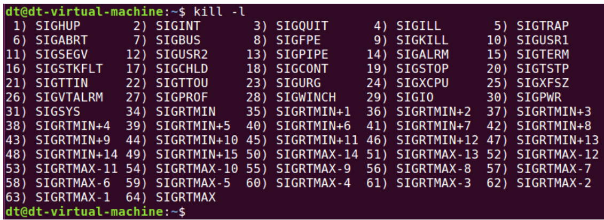

## 1、ulimit 命令来查看进程可打开的最大文件数

```
ulimit -n
```


（1）每一个被打开的文件在同一个进程中都有一个唯一的文件描述符，不会重复，如果文件被关闭后，它对应的文件描述符将会被释放，那么这个文件描述符将可以再次分配给其它打开的文件、与对应的文件绑定起来。

（2）调用 open 函数打开文件的时候，分配的文件描述符一般都是从 3 开始，0、1、2 这三个文件描述符已经默认被系统占用了，分别分配给了系统标准输入（0）、标准输出（1）以及标准错误（2）。

## man 命令

```
man 2 open #查看 open 函数的帮助信息
```

- 1：用户命令
- 2：系统调用
- 3：C库函数
- 4：设备和特殊文件
- 5：文件格式和约定
- 6：游戏和演示
- 7：杂项
- 8：系统管理命令


## 查看文件的 inode 编号

通过"ls -i"命令查看文件的 inode 编号。


（2）stat 命令查看


## 退出函数_exit()和 _Exit() ,exit()

调用_exit()函数会清除其使用的内存空间，并销毁其在内核中的各种数据结构，关闭进程的所有文件描述符，并结束进程、将控制权交给操作系统。

（1）_exit()和  _Exit()两者等价，用法作用是一样的，这 2 个函数都是系统调用。

（2）exit()函数 _exit()函数都是用来终止进程的，exit()是一个标准 C 库函数，而 _exit()和 _Exit()是系统调用。执行 exit()会执行一些清理工作，最后调用 _exit()函数。

## 文件大小的查看

（1）ls查看的是文件的逻辑大小，包含空洞部分大小和真实数据部分大小。

（2）du命令查看到的大小是文件实际占用存储块的大小。


## open与fopen()的区别

1、缓冲文件系统与非缓冲系统的区别

缓冲文件系统(fopen) ：在内存为每个文件开辟一个缓存区，当执行读操作，从磁盘文件将数据读入内存缓冲区，装满后从内存缓冲区依次读取数据。写操作同理。
内存缓冲区的大小影响着实际操作外存的次数，缓冲区越大，操作外存的次数越少，执行速度快，效率高。缓冲区大小由机器而定。
借助文件结构体指针对文件管理，可读写字符串、格式化数据、二进制数据。
非缓冲文件系统(open)：依赖操作系统功能对文件读写，不设文件结构体指针，只能读写二进制文件。

2、open属于低级IO，fopen属于高级IO

3、open返回文件描述符，属于用户态，读写需进行用户态与内核态切换。
   fopen返回文件指针

4、open是系统函数，不可移植
   fopen是标准C函数，可移植

5、一般用fopen打开普通文件，open打开设备文件

6、 如果顺序访问文件，fopen比open快
   如果随机访问文件，open比fopen快

## 文件类型

可以通过 stat 命令或者 ls 命令来查看文件类型。

⚫ ' - '：普通文件

⚫ ' d '：目录文件

⚫ ' c '：字符设备文件

⚫ ' b '：块设备文件

⚫ ' l '：符号链接文件

⚫ ' s '：套接字文件

⚫ ' p '：管道文件


## 结构体/嵌套结构体

```
#include<iostream>
using namespace std;
#include<string>
 
// 定义学生
struct student
{
	string name; // 学生姓名
	int age; // 学生年龄
	int score; // 学生分数
};
 
// 定义老师结构体
struct teacher
{
	int id; // 教师编号
	string name; //教师姓名
	int age; // 年龄
	struct student stu; //辅导的学生
};
 
 
int main()
{
	// 结构体嵌套结构体
	// 创建老师
	teacher t;
	t.id = 10000;
	t.name = "老王";
	t.age = 50;
	t.stu.name = "小王";
	t.stu.age = 20;
	t.stu.score = 60;
 
 
	cout << "老师姓名：" << t.name << "老师编号：" << t.id << "老师年龄：" << t.age
		<< "老师辅导的学生姓名：" << t.stu.name << "学生年龄：" << t.stu.age
		<< "学生考试分数为：" << t.stu.score;
 
	system("pause");
 
	return 0;
 
}
```

参考：[c++ - 结构体笔记（结构体嵌套、自引用，结构体指针） - 个人文章 - SegmentFault 思否](https://segmentfault.com/a/1190000042907586)

## puts()，putchar()，fputc，fputs()区别

（1）puts()函数用来向标准输出设备（屏幕、显示器）输出字符串并自行换行，将' \0 '转换为换行符' \n '。

（2）putchar()函数可以把参数 c 指定的字符（一个无符号字符）输出到标准输出设备。

（3）fputc()与 putchar()类似，也用于输出参数 c 指定的字符（一个无符号字符），与 putchar()区别在于，putchar()只能输出到标准输出设备，而 fputc()可把字符输出到指定的文件中，既可以是标准输出、标准错误设备，也可以是一个普通文件。

（4）同理，fputs()与 puts()类似，也用于输出一条字符串，与 puts()区别在于，puts()只能输出到标准输出设备，而 fputs()可把字符串输出到指定的文件中，既可以是标准输出、标准错误设备，也可以是一个普通文件。

## gets()、getchar()、fgetc()、fgets()区别

（1）gets()函数用于从标准输入设备（譬如键盘）中获取用户输入的字符串。

（2）getchar()函数用于从标准输入设备中读取一个字符（一个无符号字符）。

（3）fgets()与 gets()一样用于获取输入的字符串，fgets()既可以从标准输入设备获取字符串、也可以从一个普通文件中获取输入字符串。

（4）fgetc()与 getchar()一样，用于读取一个输入字符。


## 字符与数字转换

### atoi、atol、atoll 函数

atoi()、atol()、atoll()三个函数可用于将字符串分别转换为 int、long int 以及 long long 类型的数据。

### strtod、strtof、strtold 函数

strtof()、strtod()以及 strtold()三个库函数可分别将字符串转换为 float 类型数据、double 类型数据、long double 类型数据。

### sprintf()

将数字转换为字符串并存储在缓冲区中。

## 信号处理

### 信号查看

```
kill -l
```



### signal()函数

本节描述系统调用 signal()，signal()函数是 Linux 系统下设置信号处理方式最简单的接口，可将信号的处理方式设置为捕获信号、忽略信号以及系统默认操作。


## 进程

两种进程的比较

```
int main(void)
{
     pid_t pid;
     int fd;
     int i;
      fd = open("./test.txt", O_RDWR | O_TRUNC);
     if (0 > fd) {
         perror("open error");
         exit(-1);
     }
     pid = fork();
     switch (pid) {
         case -1:
             perror("fork error");
             close(fd);
             exit(-1);
         case 0:
             /* 子进程 */
             for (i = 0; i < 4; i++) //循环写入 4 次
             write(fd, "1122", 4);
             close(fd);
             _exit(0);
         default:
             /* 父进程 */
             for (i = 0; i < 4; i++) //循环写入 4 次
             write(fd, "AABB", 4);
             close(fd);
             exit(0);
     }
}
```


此种情况下，父、子进程分别对同一个文件进行写入操作，结果是接续写，不管是父进程，还是子进程，在每次写入时都是从文件的末尾写入。子进程继承了父进程的文件描述符，两个文件描述符都指向了一个相同的文件表，意味着它们的文件偏移量是同一个、绑定在了一起，相互影响，子进程改变了文件的位置偏移量就会作用到父进程，同理，父进程改变了文件的位置偏移量就会作用到子进程。

```
int main(void)
{
     pid_t pid;
     int fd;
     int i;
     pid = fork();
     switch (pid) {
         case -1:
             perror("fork error");
             exit(-1);
         case 0:
             /* 子进程 */
             fd = open("./test.txt", O_WRONLY);
             if (0 > fd) {
                 perror("open error");
                 _exit(-1);
             }
             for (i = 0; i < 4; i++) //循环写入 4 次
             	write(fd, "1122", 4);
             close(fd);
             _exit(0);
         default:
             /* 父进程 */
             fd = open("./test.txt", O_WRONLY);
             if (0 > fd) {
                 perror("open error");
                 exit(-1);
              }
             for (i = 0; i < 4; i++) //循环写入 4 次
             	write(fd, "AABB", 4);
             close(fd);
             exit(0);
     }
}
```


这种文件共享方式实现的是一种两个进程分别各自对文件进行写入操作，因为父、子进程的这两个文件描述符分别指向的是不同的文件表，意味着它们有各自的文件偏移量，一个进程修改了文件偏移量并不会影响另一个进程的文件偏移量，所以写入的数据会出现覆盖的情况。


## 软件下载方式

（1）yum

（2）apt

（3）rpm


## shell指令

1. ls 命令用来打印出当前目录下的所有文件和文件夹
2. ls -l  此命令会列出所有文件和文件夹的详细信息，比如文件大小、拥有者、创建日期等等 。
3. pwd 当前路径显示命令
4. clear  清屏命令
5. sudo 切换用户执行身份命令
6. adduser 添加用户命令

```
adduser [参数] [用户名] 
```

常用的参数如下： 
 -system  添加一个系统用户 
 -home DIR  DIR 表示用户的主目录路径 
 -uid ID  ID 表示用户的 uid。 
 -ingroup GRP 表示用户所属的组名。

7. deluser 

   ```
   deluser  [参数] [用户名] 
   ```

   主要参数有： 
    -system   当用户是一个系统用户的时候才能删除。 
    -remove-home 删除用户的主目录 
    -remove-all-files 删除与用户有关的所有文件。

   -backup   备份用户信息

8. su 切换用户命令

   ```
   su可以直接将当前用户切换为 root 用户。
   ```

9. cat 显示文件内容命令

10. ifconfig

11. 显示和配置网络属性命令

    ```
    ifconfig interface options | address 
    ```

    主要参数如下： 
     interface  网络接口名称，比如 eth0 等。 
     up   开启网络设备。 
     down  关闭网络设备。 
     add   IP 地址，设置网络 IP 地址。

12. man 系统帮助命令

13. reboot 系统重启命令

14. poweroff  系统关闭命令

15. 查看进程

15. 

16. 

17. 


## apt指令

1. 更新本地数据库 

   ```
   sudo apt-get update 
   ```

2. 检查依赖关系 

   ```
   sudo apt-get check 
   ```

3. 软件安装

   ```
   sudo apt-get install package-name 
   ```

4. 软件更新

   ```
   sudo apt-get upgrade package-name 
   ```

5. 卸载软件

```
sudo apt-get remove package-name 
```

## vim指令

VIM 编辑器有 3 种工作模式：**输入模式**、**指令模式**和**底行模式**

i 在当前光标所在字符的前面，转为输入模式。 
I 在当前光标所在行的行首转换为输入模式。 
a 在当前光标所在字符的后面，转为输入模式。 
A 在光标所在行的行尾，转换为输入模式。 
o 在当前光标所在行的下方，新建一行，并转为输入模式。 
O 在当前光标所在行的上方，新建一行，并转为输入模式。 
s 删除光标所在字符。 
r 替换光标处字符。

Ctrl+f   屏幕向下翻一页，相当于下一页。 
 Ctrl+b   屏幕向上翻一页，相当于上一页。 

复制、删除和粘贴指令  
 cc    删除整行，并且修改整行内容。 
 dd    删除该行，不提供修改功能。 
 ndd    删除当前行向下 n 行。 
 x    删除光标所在的字符。 
 X    删除光标前面的一个字符。 
 nyy    复制当前行及其下面 n 行。 
 p    粘贴最近复制的内容。

x 保存当前文档并且退出。 

q 退出。 
 w 保存文档。 
 q! 退出 VI/VIM，不保存文档。 

## 系统文件及指令

```
cd  /  //进入到根目录“/ 
```

> /bin  存储一些二进制可执行命令文件，/usr/bin 也存放了一些基于用户的命令文件。 
>  /sbin 存储了很多系统命令，/usr/sbin 也存储了许多系统命令。 
>  /root 超级用户 root 的根目录文件。 
>  /home 普通用户默认目录，在该目录下，每个用户都有一个以本用户名命名的文件夹。 
>  /boot 存放 Ubuntu 系统内核和系统启动文件。 
>  /mnt  通常包括系统引导后被挂载的文件系统的挂载点。 
>  /dev  存放设备文件，我们后面学习 Linux 驱动主要是跟这个文件夹打交道的。 
>  /etc  保存系统管理所需的配置文件和目录。 
>  /lib  保存系统程序运行所需的库文件，/usr/lib 下存放了一些用于普通用户的库文件。 
>  /lost+found  一般为空，当系统非正常关机以后，此文件夹会保存一些零散文件。 
>  /var  存储一些不断变化的文件，比如日志文件 
>  /usr  包括与系统用户直接有关的文件和目录，比如应用程序和所需的库文件。 
>  /media 存放 Ubuntu 系统自动挂载的设备文件。 
>  /proc 虚拟目录，不实际存储在磁盘上，通常用来保存系统信息和进程信息。 
>  /tmp 存储系统和用户的临时文件，该文件夹对所有的用户都提供读写权限。 
>  /opt  可选文件和程序的存放目录。 
>  /sys  系统设备和文件层次结构，并向用户程序提供详细的内核数据信息。

**文件及目录删除命令—rm** 

rm  [参数] [目的文件或文件夹目录名] 

- -d 直接把要删除的目录的硬连接数据删成 0，删除该目录。 
-  -f 强制删除文件和文件夹(目录)。 
-  -i 删除文件或者文件夹(目录)之前先询问用户。 
-  -r 递归删除，指定文件夹(目录)下的所有文件和子文件夹全部删除掉。 
-  -v 显示删除过程。 

**文件夹(目录)删除命令—rmdir** 

-p 删除指定的文件夹(目录)以后，若上层文件夹(目录)为空文件夹(目录)的话就将其一起删除。 

**文件复制命令—cp** 

```
cp  [参数] [源地址]  [目的地址] 
```

- -a 此参数和同时指定“-dpR”参数相同 
-  -d 在复制有符号连接的文件时，保留原始的连接。 
-  -f 强行复制文件，不管要复制的文件是否已经存在于目标目录。 
-  -I 覆盖现有文件之前询问用户。 
-  -p 保留源文件或者目录的属性。 
- ​    -r 或-R 递归处理，将指定目录下的文件及子目录一并处理

**文件移动命令—mv** 

```
mv [参数] [源地址]  [目的地址] 
```

- -b 如果要覆盖文件的话覆盖前先进行备份。 
-  -f 若目标文件或目录与现在的文件重复，直接覆盖目的文件或目录。 
-  -I 在覆盖之前询问用户。 

## 文件压缩和解压缩 

linux压缩格式：


### 命令 zip

```
zip  [参数]  [压缩文件名.zip]  [被压缩的文件] 
```

主要参数函数如下： 

- -b<工作目录>  指定暂时存放文件的目录。 
- -d 从 zip 文件中删除一个文件。 
- -F 尝试修复已经损毁的压缩文件。 
- -g  将文件压缩入现有的压缩文件中，不需要新建压缩文件。 
- -h  帮助。 
- -j 只保存文件的名，不保存目录。 
- -m  压缩完成以后删除源文件。 
- -n<字尾符号>  不压缩特定扩展名的文件。 
- -q  不显示压缩命令执行过程。 
- -r  递归压缩，将指定目录下的所有文件和子目录一起压缩。 
- -v  显示指令执行过程。 
-  -num 压缩率，为 1~9 的数值。 

- -b<工作目录>  指定暂时存放文件的目录。 
- -d 从 zip 文件中删除一个文件。 
- -F 尝试修复已经损毁的压缩文件。 
- -g  将文件压缩入现有的压缩文件中，不需要新建压缩文件。 
- -h  帮助。 
- -j 只保存文件的名，不保存目录。 
- -m  压缩完成以后删除源文件。 
- -n<字尾符号>  不压缩特定扩展名的文件。 
- -q  不显示压缩命令执行过程。 
- -r  递归压缩，将指定目录下的所有文件和子目录一起压缩。 
- -v  显示指令执行过程。 
-  -num 压缩率，为 1~9 的数值。 

例子：

（1）使用 zip 命令进行 test2 文件夹的压缩

```
zip  -rv  test2.zip  test2 
```

（2）对.zip 格式的压缩包进行解压

```
unzip [参数] [压缩文件名.zip] 
```

主要参数如下： 

1. -l 显示压缩文件内所包含的文件。 
2. -t  检查压缩文件是否损坏，但不解压。 
3. -v  显示命令显示的执行过程。 
4. -Z  只显示压缩文件的注解。 
5. -C 压缩文件中的文件名称区分大小写。

- -l 显示压缩文件内所包含的文件。 
- -t  检查压缩文件是否损坏，但不解压。 
- -v  显示命令显示的执行过程。 
- -Z  只显示压缩文件的注解。 
- -C 压缩文件中的文件名称区分大小写。

- -j 不处理压缩文件中的原有目录路径。 
- -L 将压缩文件中的全部文件名改为小写。 
- -n 解压缩时不要覆盖原有文件。 
- -P<密码> 解压密码。 
-  -q 静默执行，不显示任何信息。 
- -x<文件列表> 指定不要处理.zip 中的哪些文件。 
- -d<目录> 把压缩文件解到指定目录下。


### 命令 tar

```
tar [参数] [压缩文件名]  [被压缩文件名] 
```

常用参数如下： 

-  -c 创建新的压缩文件。 
-  -C<目的目录> 切换到指定的目录。 
-  -f<备份文件>  指定压缩文件。 
-  -j 用 tar 生成压缩文件，然后用 bzip2 进行压缩。 
-  -k 解开备份文件时，不覆盖已有的文件。  
-  -m 还原文件时，不变更文件的更改时间。 
-  -r 新增文件到已存在的备份文件的结尾部分。 
-  -t 列出备份文件内容。 
-  -v 显示指令执行过程。 
-  -w 遭遇问题时先询问用户。 
-  -x 从备份文件中释放文件，也就是解压缩文件。 
-  -z 用 tar 生成压缩文件，用 gzip 压缩。 
-  -Z 用 tar 生成压缩文件，用 compress 压缩。 

- -c 创建新的压缩文件。 
-  -C<目的目录> 切换到指定的目录。 
-  -f<备份文件>  指定压缩文件。 
-  -j 用 tar 生成压缩文件，然后用 bzip2 进行压缩。 
-  -k 解开备份文件时，不覆盖已有的文件。  
-  -m 还原文件时，不变更文件的更改时间。 
-  -r 新增文件到已存在的备份文件的结尾部分。 
-  -t 列出备份文件内容。 
-  -v 显示指令执行过程。 
-  -w 遭遇问题时先询问用户。 
-  -x 从备份文件中释放文件，也就是解压缩文件。 
-  -z 用 tar 生成压缩文件，用 gzip 压缩。 
-  -Z 用 tar 生成压缩文件，用 compress 压缩。


```
tar  -vcjf  test1.tar.bz2  test1 
tar  -vczf  test1.tar.gz  test1 
```

-vcjf 表示创建 bz2 格式的压缩文件，-vczf 表示创建.gz 格式的压缩文件。

**解压缩：**

```
tar  -vxjf  test1.tar.bz2 
tar  -vxzf  test2.tar.gz
```

## 文件查询和搜索

### **命令 find**

```
find  [路径] [参数] [关键字] 
```

- -name<filename> 按照文件名称查找，查找与 filename 匹配的文件，可使用通配符。 
-  -depth   从指定目录下的最深层的子目录开始查找。 
-  -gid<群组识别码> 查找符合指定的群组识别码的文件或目录。 
-  -group<群组名称> 查找符合指定的群组名称的文件或目录。 
-  -size<文件大小> 查找符合指定文件大小的文件。 
-  -type<文件类型> 查找符合指定文件类型的文件。 
-  -user<拥有者名称> 查找符合指定的拥有者名称的文件或目录。


### **命令 grep** 

find 命令用于在目录中搜索文件，我们有时候需要在文件中搜索一串关键字，grep 就是完成这个功能的，grep 命令用于查找包含指定关键字的文件，如果发现某个文件的内容包含所指定的关键字，grep 命令就会把包含指定关键字的这一行标记出来，grep 命令格式如下：

```
grep [参数] 关键字 文件列表
```

grep 命令一次只能查一个关键字，主要参数如下：

- -b 在显示符合关键字的那一列前，标记处该列第 1 个字符的位编号。 
-  -c 计算符合关键字的列数。 
-  -d<进行动作> 当指定要查找的是目录而非文件时，必须使用此参数！否则 grep 指令将回报信息并停止搜索。 
-  -i  忽略字符大小写。

1. -b 在显示符合关键字的那一列前，标记处该列第 1 个字符的位编号。 
2. -c 计算符合关键字的列数。 
3. -d<进行动作> 当指定要查找的是目录而非文件时，必须使用此参数！否则 grep 指令将回报信息并停止搜索。 
4. -i  忽略字符大小写。 

- -v 反转查找，只显示不匹配的行。 
- -r 在指定目录中递归查找。


### **文件权限**


### chmod 权限修改命令

```
chmod [参数] [文件名/目录名] 
```

主要参数如下： 

- -c 效果类似“-v”参数，但仅回显更改的部分。 
-  -f 不显示错误信息。 
-  -R 递归处理，指定目录下的所有文件及其子文件目录一起处理。 
-  -v 显示指令的执行过程。 

-  -c 效果类似“-v”参数，但仅回显更改的部分。 
-  -f 不显示错误信息。 
-  -R 递归处理，指定目录下的所有文件及其子文件目录一起处理。 
-  -v 显示指令的执行过程。


### chown 文件归属者修改命令

命令 chown 用来修改某个文件或者目录的归属者用户或者用户组。

```
chown [参数] [用户名.<组名>] [文件名/目录]
```

其中[用户名.<组名>]表示要将文件或者目录改为哪一个用户或者用户组，用户名和组名用“.”隔开，其中用户名和组名中的任何一个都可以省略，命令主要参数如下：

- -c 效果同-v 类似，但仅显示更改的部分。 
-  -f 不显示错误信息。 
-  -h 只对符号连接的文件做修改，不改动其它任何相关的文件。 
-  -R  递归处理，将指定的目录下的所有文件和子目录一起处理。 
-  -v 显示处理过程。 


## gcc命令

```
gcc [选项] [文件名字] 
```

- -c：只编译不链接为可执行文件，编译器将输入的.c 文件编译为.o 的目标文件。 
-  -o：<输出文件名> 用来指定编译结束以后的输出文件名，如果不使用这个选项的话 GCC 默
- 认编译出来的可执行文件名字为 a.out。 
-  -g：添加调试信息，如果要使用调试工具(如 GDB)的话就必须加入此选项，此选项指示编
- 译的时候生成调试所需的符号信息。 
-  -O：对程序进行优化编译，如果使用此选项的话整个源代码在编译、链接的的时候都会进
- 行优化，这样产生的可执行文件执行效率就高。 
-  -O2：比-O 更幅度更大的优化，生成的可执行效率更高，但是整个编译过程会很慢。

GCC 编译器的编译流程是：预处理、编译、汇编和链接。

（1）预处理就是展开所有的头文件、替换程序中的宏、解析条件编译并添加到文件中。

（2）编译是将经过预编译处理的代码编译成汇编代码，也就是我们常说的程序编译。

（3）汇编就是将汇编语言文件编译成二进制目标文件。

（4）链接就是将汇编出来的多个二进制目标文件链接在一起，形成最终的可执行文件，链接的时候还会涉及到静态库和动态库等问题。 


## makefile

Makefile 里面是由一系列的规则组成的，这些规则格式如下：

```
目标…... :  依赖文件集合…… 
 命令 1 
 命令 2 
 …… 
```


```
  main: main.o input.o calcu.o 
      gcc -o main  main.o input.o calcu.o 
  main.o: main.c 
      gcc -c main.c 
  input.o: input.c 
      gcc -c input.c 
  calcu.o: calcu.c 
      gcc -c calcu.c 
   
 clean: 
     rm *.o 
     rm main 
```

**上述代码中所有行首需要空出来的地方一定要使用“TAB”键！不要使用空格键！**

简洁版：

```
  objects = main.o input.o calcu.o
  main: $(objects)  
      gcc -o main $(objects) 
  
  .PHONY : clean 
  
  %.o : %.c 
      gcc -c $<  
   
  clean: 
	rm *.o 
    rm main 
```


## shell指令

### 查看进程

可以通过 `ps` 命令查看进程相关属性和状态，这些信息包括进程所属用户，进程对应的程序，进程对 `cpu` 和内存的使用情况等信息。


## Cortes-A7架构

ARM 架构提供了 16 个 32 位的通用寄存器(R0~R15)供软件使用，前 15 个(R0~R14)可以用作通用的数据存储，R15 是程序计数器 PC，用来保存将要执行的指令。ARM 还提供了一个当前程序状态寄存器 CPSR 和一个备份程序状态寄存器 SPSR，SPSR 寄存器就是 CPSR 寄存器的备份。


# Linux驱动

## BSP 工程管理

包含bsp、imx6ul、obj 和 project 这 4 个文件夹。

（1）其中 bsp 用来存放驱动文件；

（2）imx6ul 用来存放跟芯片有关的文件，比如 NXP 官方的 SDK
库文件。

（3）obj 用来存放编译生成的.o 文件。

（4）project 存放 start.S 和 main.c 文件，也就是应用文件。

