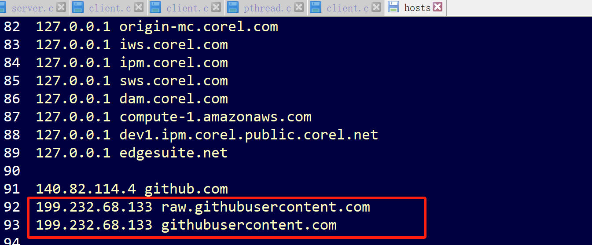

# 一、准备工作

## 1、git软件下载安装


## 2、github或者gitee账户创建

### 2.1 github仓库创建


### 2.2 gitee仓库创建


# 二、将本地程序上传至远程仓库

将本地仓库上传至远程仓库有两种方式，一种为https，另一种为ssh方式。

## 1、https方式上传至远程仓库


…or create a new repository on the command line

```
echo "# My2024" >> README.md
git init
git add README.md
git commit -m "first commit"
git branch -M main
git remote add origin https://github.com/design1111/My2024.git
git push -u origin main
```


…or push an existing repository from the command line

```
git remote add origin https://github.com/design1111/My2024.git
git branch -M main
git push -u origin main
```


## 2、ssh方式上传至远程仓库


## 3、将本地仓库同时上传至github和gitee远程仓库


# 三、基本指令

```
git remote rm origin 删除关联的origin的远程库
```


# 四、额外补充

## 4.1 图片加载不出来

这是因为DNS污染了。

在C:\Windows\System32\drivers\etc目录下找到hosts文件，添加下面内容。

```
199.232.68.133 raw.githubusercontent.com
199.232.68.133 githubusercontent.com
```


