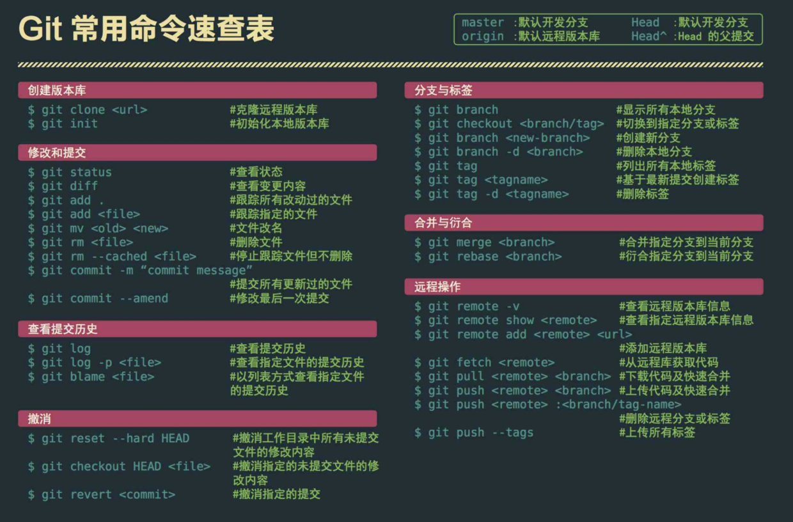
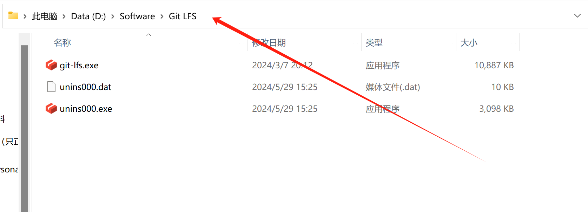
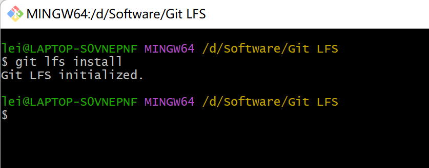
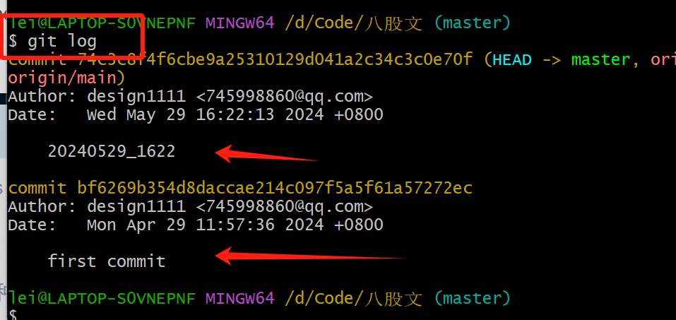

# 一、准备工作

## 1、git软件下载安装


## 2、github或者gitee账户创建

### 2.1 github仓库创建


### 2.2 gitee仓库创建


# 二、首次将本地程序上传至远程仓库

将本地仓库上传至远程仓库有两种方式，一种为https，另一种为ssh方式。

## 1、https方式上传至远程仓库


…or create a new repository on the command line

```
echo "# My2024" >> README.md
git init
git add README.md
git commit -m "first commit"
git branch -M main
git remote add origin https://github.com/design1111/My2024.git
git push -u origin main
```


…or push an existing repository from the command line

```
git remote add origin https://github.com/design1111/My2024.git
git branch -M main
git push -u origin main
```


## 2、ssh方式上传至远程仓库


## 3、将本地仓库同时上传至github和gitee远程仓库


# 第二次上传

```
git add README.md
git commit -m "标注自己写"
git branch -M main  //这一步看是否需要更换分支，正常有main/master其中一种，要自己在网站上看是哪一种分支。
git push -u origin main
```


# 三、基本指令



```
git remote rm origin 删除关联的origin的远程库
```


# 四、额外补充

## 4.1 图片加载不出来

这是因为DNS污染了。

在C:\Windows\System32\drivers\etc目录下找到hosts文件，添加下面内容。

```
199.232.68.133 raw.githubusercontent.com
199.232.68.133 githubusercontent.com
```


## git解决大文件上传（还不完整）

需要安装

下载地址：https://git-lfs.com/


安装完成后，进入安装后的目录，打开 GitBash，执行 

```
git lfs install
```





到仓库目录，打开 GitBash，追踪需要上传的大文件

```
 git lfs track 具体文件名
```


添加要上传的文件属性，(**要先添加文件属性，不然有可能会失败**)


## 删除commit操作

首先查看git commit日志

```
git log  查看提交日志
```



这里提交了两次。

（1）使用 Git reset 命令来取消上一次提交，这会把 HEAD 指针移回上一个提交（HEAD~1），并清除最后一次提交的内容。

```
git reset HEAD~1
```

（2）撤回两次或者n次。

```
git reset HEAD~2
```

