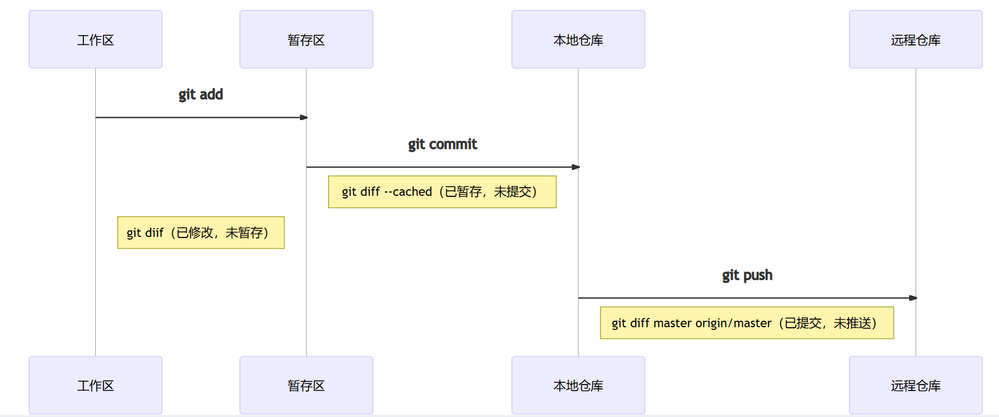

# 一、准备工作

## 1、git软件下载安装


## 2、github或者gitee账户创建

### 2.1 github仓库创建


### 2.2 gitee仓库创建


# 二、首次将本地程序上传至远程仓库

将本地仓库上传至远程仓库有两种方式，一种为https，另一种为ssh方式。

## 1、https方式上传至远程仓库


…or create a new repository on the command line

```
echo "# My2024" >> README.md
git init
git add README.md
git commit -m "first commit"
git branch -M main
git remote add origin https://github.com/design1111/My2024.git
git push -u origin main
```


…or push an existing repository from the command line

```
git remote add origin https://github.com/design1111/My2024.git
git branch -M main
git push -u origin main
```


## 2、ssh方式上传至远程仓库


## 3、将本地仓库同时上传至github和gitee远程仓库


# 第二次上传

```
git add README.md
git commit -m "标注自己写"
git branch -M main  //这一步看是否需要更换分支，正常有main/master其中一种，要自己在网站上看是哪一种分支。
git push -u origin main
```


# 三、基本指令


```
git remote rm origin 删除关联的origin的远程库
```


# 四、额外补充

## 4.1 图片加载不出来

这是因为DNS污染了。

在C:\Windows\System32\drivers\etc目录下找到hosts文件，添加下面内容。

```
199.232.68.133 raw.githubusercontent.com
199.232.68.133 githubusercontent.com
```


## git解决大文件上传（还不完整）

需要安装

下载地址：https://git-lfs.com/


安装完成后，进入安装后的目录，打开 GitBash，执行 

```
git lfs install
```


到仓库目录，打开 GitBash，追踪需要上传的大文件

```
 git lfs track 具体文件名
```


添加要上传的文件属性，(**要先添加文件属性，不然有可能会失败**)


## 删除commit操作

首先查看git commit日志

```
git log  查看提交日志
```


这里提交了两次。

（1）使用 Git reset 命令来取消上一次提交，这会把 HEAD 指针移回上一个提交（HEAD~1），并清除最后一次提交的内容。

```
git reset HEAD~1
```

（2）撤回两次或者n次。

```
git reset HEAD~2
```


# 公司git配置

查看指令

```css
查看当前User和Email配置
git config --local --list 
git config --list 
```


1、添加全局用户名、邮箱

```css
git config --global user.name "username"

git config --global user.email  useremail@qq.com
```

查看是否成功

```CSS
git config user.name
git config user.email
```

2、其余指令

```
1、切换到本地存储路径，如cd D:/AT_IDE/CODE
2、git init
3、 git clone 地址（以后不用执行git init和git clone，直接git pull即可）
4、创建分支
	git checkout develop
	develop为分支名
	git fetch origin leizhe
	git checkout leizhe
	git pull
5、切换分支
	git checkout -b leizhe
4、修改代码
5、git add .
6、git commit -m "注释说明"
7、git push origin local	
```


# 公司git配置

查看指令

```css
查看当前User和Email配置
git config --local --list 
git config --list 
```


1、添加全局用户名、邮箱

```css
git config --global user.name "username"

git config --global user.email  useremail@qq.com
```

查看是否成功

```CSS
git config user.name
git config user.email
```


## 正式拉取公司代码

```css
git init
git clone 地址（http）
```

2、进入仓库路径下，创建新分支，之后关联在leizhe分支或其他分支

```css
（1）创建分支
git checkout -b leizhe
(2) 关联分支
git branch --set-upstream-to=origin/develop leizhe
(3)拉取
git pull
```

3、修改代码提交

```CSS
修改完代码
(1)添加代码
git add .
或者
git add 待提交的文件名
(2)备注
git commit -m "本次提交备注"
(3)提交
git push origin liezhe  //将本地leizhe的分支版本上传到远程合并

```

4、云上合并代码

在浏览器上：

devops-xa.hollysys.net

进入EquipmenPlatfrom/AT-IDE/选择文件

随后在  repos->文件  中就可以看到源码了

当git push之后，在拉去请求中【新建拉去请求】，填写拉取内容，将 ==leizhe  加入 develop ，随后批准，同意==    


5、云上编译

暂时不知


# 撤销

## Git Reset 模式
git reset 命令有三种主要模式用于撤销提交：--soft、--mixed 和 --hard。

- --soft：撤销提交，但保留暂存区的状态，适用于需要保留代码改动的情况。
- --mixed（默认）：撤销提交并清除暂存区的状态，但保留工作目录中的代码改动。
- --hard：删除提交并删除工作目录中的代码改动。


**--soft 模式**

- 不删除工作目录中的代码改动。
- 只撤销提交，保留暂存区的状态。

使用命令：

```css
git reset --soft HEAD^
```

**--mixed 模式（默认）**

- 不删除工作目录中的代码改动。
- 撤销提交和暂存区的状态。

使用命令：

```css
git reset HEAD^
或
git reset --mixed HEAD^
```

**--hard 模式**
删除工作目录中的代码改动。
撤销提交和暂存区状态。
使用命令：

```css
git reset --hard HEAD^
```

**撤销指定的提交版本**
可以通过以下方式指定要撤销的版本：

使用 HEAD^ 表示上一个提交版本：

```css
git reset --soft HEAD^    # 撤销最近一次提交
git reset --soft HEAD~2   # 撤销最近两次提交
```

**2.使用提交的 commit ID：** 

```html
git reset --soft <commit-id>  # 回退到指定的提交版本
```

**修改提交信息**
如果只需要修改最后一次提交的注释信息，可以使用以下命令：

```css
git commit --amend
```

注意事项

1. git reset 只能回滚最新的提交，无法单独回滚某个历史提交。
2. 如果代码已推送到远程仓库，需要在本地执行 **reset** 后，再强制推送：

```css
git push origin <branch-name> --force
```

建议使用 --soft 模式，以避免丢失代码改动。


## git commit后撤销

修改了本地的代码，然后使用：

```
git add file
git commit -m '修改原因'
12
```

执行[commit](https://so.csdn.net/so/search?q=commit&spm=1001.2101.3001.7020)后，还没执行push时，想要撤销这次的commit，该怎么办？

解决方案：
使用命令：

```
git reset --soft HEAD^
1
```

这样就成功撤销了commit，如果想要连着add也撤销的话，–soft改为–hard（删除工作空间的改动代码）。

命令详解：

HEAD^ 表示上一个版本，即上一次的commit，也可以写成HEAD~1
如果进行两次的commit，想要都撤回，可以使用HEAD~2

–soft
不删除工作空间的改动代码 ，撤销commit，不撤销git add file

–hard
删除工作空间的改动代码，撤销commit且撤销add

另外一点，如果commit注释写错了，先要改一下注释，有其他方法也能实现，如：

```
git commit --amend
这时候会进入vim编辑器，修改完成你要的注释后保存即可。
```


## git push后撤回

**方法一：使用 git revert（推荐）**
git revert 是最安全的方式，因为它不会删除提交历史：

```css
# 1. 查看提交历史
git log

# 2. 撤销指定的 commit
git revert <commit-id>

# 3. 推送到远程仓库
git push origin <branch-name>
```

这种方法会通过创建一个新的提交来撤销之前的更改。


**方法二：使用 git reset**
这种方式会修改提交历史，需谨慎使用：

```css
# 1. 使用 reset 回退版本
git reset --soft HEAD^  # 撤销最近一次 commit，保留代码改动
# 或
git reset --hard HEAD^  # 撤销 commit 并删除代码改动

# 2. 强制推送到远程
git push -f origin <branch-name>
```

reset 有三种模式：

- --soft：只撤销 commit，保留代码修改。
- --mixed：撤销 commit 和 add，保留代码修改。
- --hard：完全撤销修改，删除代码改动。

注意事项

1. 使用 git revert 更安全，因为它不会删除提交历史。
2. 使用 git reset --force 时要谨慎，因为它会重写历史，可能影响其他开发者。
3. 如果其他人已经拉取了要撤销的代码，建议使用 git revert 而不是 reset。
4. 在执行这些操作之前，建议先备份代码或创建一个新分支。 


## 遇到的问题

如果

```
git push origin leizhe
```

出现以下错误，则是


# 代码回退


**1.介绍**
git是我们代码管理必不可少的工具，平常我们使用时可能用遇到下面的问题，有时候我们提交代码后，发现提交错了，比如本地修改了不想提交的文件提交了上去，或者误提交了不完整的代码，这时候怎么把提交的回退呢？
一种不那么上高大上的办法是把代码文件再进行修改，再提交一次，有没有很low（手动笑哭）
今天就来和大家分享下在git下如何快速高大上进行版本的回退，不管你的代码是已提交到了本地，还是提交到了远程，都可以进行完美的回退，且别人看不到提交记录。

**2.git的4个区**
在介绍如何进行git版本回退前，我们需要先了解下git中的4个区：

- 工作区（Working Area）


就相当于我们的工作空间的目录，我们代码本地存放的地方。

- 暂存区（Stage）


也称作Index，用来跟踪已暂存的文件，一般是存在.git下的index文件，所以有时也称暂存区为索引。

- 本地仓库（Local Repository）

- 远程仓库（Remote Repository）


3.git文件的5种状态
我们还需要了解下git文件的5种状态

- 未修改（Origin）
- 已修改（Modified）
- 已暂存（Staged）
- 已提交（Committed）
- 已推送（Pushed）

他们之间的关系如下图：





- 工作区中的文件初始的状态是未修改，当我们修改文件后，其状态改变为已修改，git diff可以查看已经修改但未暂存的文件。(git diff后输入q可以退出)
- 通过git add命令可以把已修改的文件添加到暂存区，git diff --cached可以查看已暂存，但未提交的文件。
- 通过git commit进行代码提交到本地仓库，git diff {本地分支} {远程分支}可以查看已提交本地，但未推送到远程的分支。
- 通过git push命令将本地分支推送到远程分支。

PS：在我们的IDEA

**4.回退命令**

通过前面对git的4个区5种状态的介绍，我们已经准备的差不多了,其实git的版本回退就是在这4区5状态之间进行的操作。下面开始划重点了(_)
首先我们来介绍用到的命令

**git reset命令**

`git reset `这个就是进行回退的具体命令，这里先介绍他的几个参数

--soft 、--mixed以及--hard是三个恢复等级。

- 使用--soft就仅仅将头指针恢复，已经add的暂存区以及工作空间的所有东西都不变。
- 如果使用--mixed，就将头恢复掉，已经add的暂存区也会丢失掉，工作空间的代码什么的是不变的。
- 如果使用--hard，那么一切就全都恢复了，头变，aad的暂存区消失，代码什么的也恢复到以前状态。

**git log命令**
`git log` 用来查看git的提交记录，但不能查看已经删除的记录。

**git reflog命令**
`git reflog`命令可以查看看所有分支的所有操作记录（包括（包括commit和reset的操作），包括已经被删除的commit记录。

**进行回退操作**
下面我们开始进行具体的回退操作命令：

- `git reset --hard` ：进行已修改或者暂存，但未提交文件的回退
- `git reset --hard origin/master` 进行已提交，但未推送的版本回退
- 1: `git reset --hard HEAD^ `2:`git push -f `这两条命令是进行已提交且推送的回退，`git reset --hard HEAD^`为先回退到上一个版本，`git push -f`是进行强制推送，覆盖远程分支。

上面的`--hard`可以替换成其它的恢复等级，一般用`--soft`，这样一些修改的内容不会丢失。

各种版本回退举例

```css
git reset --hard head #当前版本
git reset --hard HEAD^ #回退到上一个版本
git reset --hard HEAD^^ #回退到上上一个版本
git reset --hard HEAD~3 #回退到往上3个版本
git reset --hard HEAD~10 #回退到往上10个版本

```

我们还可以用`git log`或者`git reflog `查看版本的记录，用版本号来恢复到指定的版本。如
`git reset --hard 710ae83 `其中`710ae83`是版本号；
回退后，可以再用log和relog查看下版本的记录，对比下他们的区别。

git远程覆盖本地
当然，我们也可以直接用远程仓库的代码直接覆盖本地的仓库，这里我就不多哆嗦了，直接给大家奉上命令：

```css
git fetch —all
git reset —hard orgin/master  #(master可以修改成其它要覆盖的分支)
git pull

```

`git fetch` 只是下载远程库的内容，不做任务的合并
`git reset` 把HEAD指向刚刚下载的最新版本
