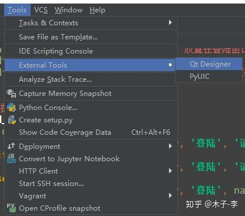

## 1、pyqt创建

配置Qt Designer和PyUIC


- Name：输入最后工具在菜单中的想呈现名称，比如我这里命名为 QtDesigner
- Program：designer.exe 程序的位置，就在上面安装的`C:\Users\feng\PycharmProjects\pythonProject\venv\Lib\site-packages\qt5_applications\Qt\bin\designer.exe`
- Working directory：designer.exe 工作路径，设置为  *$FileDir$*


类似地添加 PyUIC，

- name：PyUIC

- Program：PyUIC 位于当前解析器的Scripts\pyuic5.exe，我这里是C:\Users\lei\AppData\Local\Programs\Python\Python39\python.exe

- Arguments：-m PyQt6.uic.pyuic $FileName$ -o $FileNameWithoutExtension$.py

- Working dirctory：*$FileDir$*

  


## 2、pyqt加载ui界面

### 使用Qt Designer开发

点击 Tools -> External Tools -> 选择 QtDesigner，则会打开 QtDesinger 的图像界面，在其上面进行编辑。



进入 Qt Designer 界面，选择 Main Window，点击 Create。


按 Ctrl+R 预览窗口，看是否是想要的界面。测试 OK，保存文件到 GUI 项目下。


回到 PyCharm，在 GUI 项目下面有一个 MainWindow.ui，就是刚在使用 Qt Designer 保存的文件，现在需要将这个文件转换成 .py 文件，在该文件上点击右键，选择 PyUIC。


等程序运行完毕后，会多一个 MainWindow.py 的文件。


```

import sys

from PyQt6.QtWidgets import QApplication
from PyQt6 import uic

if __name__ == '__main__':
    app = QApplication(sys.argv)
    ui = uic.loadUi("./ui文件.ui")
    ui.show()

    sys.exit(app.exec())
```

