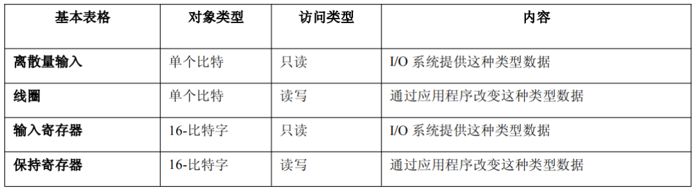
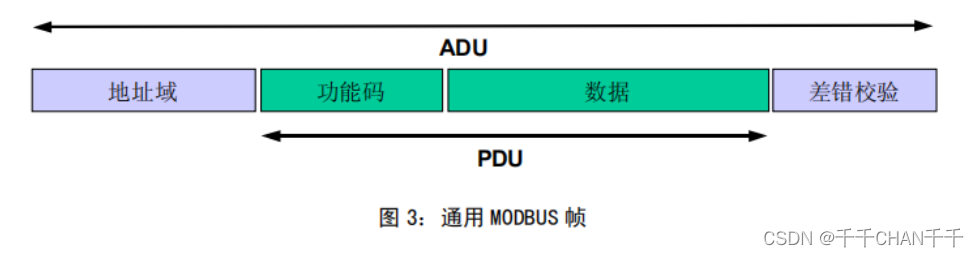

## ModBus特点

1、免费无版权

2、Modbus是**主从方式通信**，也就是说，不能同步进行通信，总线上每次只有一个数据进行传输，即主机发送，从机应答，主机不发送，总线上就没有数据通信。(所以说，这也算是一个缺点了)

3、**串行通信、以太网通信**、串行与以太网互转混合通信、无线网通信等，其实我们只需要记住串行通信和以太网通信这两种就够了，因为这是协议本身支持最直接的两种方式，其他几种方式是通过转换器转换之后的。

### 串行通信

**协议种类：** MODBUS RTU 

**描述：**这是最原始的MODBUS通信模式，使用串行接口（如RS-232或RS-485）进行问答式半双工通信。RTU模式使用二进制编码。

**特点：**问答式半双工通信，适用于需要高速数据传输的场合。

**协议种类：**MODBUS ASCII

**描述：**这是一种较老旧的MODBUS通信方式，使用ASCII编码，适用于早期的串行通信设备。由于其较低的效率，现在较少使用。

**特点：**ASCII编码，效率低。

### 以太网通信

**协议种类：**MODBUS TCP

**描述：**MODBUS协议的一种扩展，使用TCP/IP协议栈在以太网上进行通信。MODBUS TCP将传统的MODBUS报文封装在TCP数据包中，使得MODBUS能够在更广泛的网络环境中使用（包括局域网和互联网）。

**特点：**MODBUS TCP具有更高的通信速度和更大的数据吞吐量。

**协议种类：**Modbus UDP/IP

**描述：**Modbus UDP/IP是基于UDP/IP协议的一种通讯方式。与Modbus TCP/IP不同，Modbus UDP/IP采用无连接的通讯方式，不保证数据的可靠性和顺序

**特点：**相比于Modbus TCP/IP，Modbus UDP/IP的通讯开销较小，可以减少网络负载。

## ModBus协议数据类型

数据种类只有四种

**离散输入（Discrete Inputs）：** 

这是1位的布尔型数据，通常用于表示设备的状态，比如传感器的开关状态、报警的信号等。

**线圈（Coils）：**

同样是1位的布尔型数据，通常用于控制继电器或其他输出设备，比如电机的启动或停止、阀门的开启或关闭等。

**输入寄存器（Input Registers）：**

16位无符号整数或16位带符号整数，占两个字节，用于表示模拟量输入、计数器或温度等测量值。

**保持寄存器（Holding Registers）：**

也是16位的整数，可以读写，用来存储数据量、累计值或任何需要远程读取或修改的参数（时间年月日等）。

Modbus功能码有21种，但是常用的只有下面8种：

- 0x01: 读线圈寄存器   		   读取远程设备中1到2000个**连续的**线圈的状态
- 0x02: 读离散输入寄存器      读取远程设备中1到2000个**连续的**离散输入的状态
- 0x03: 读保持寄存器              读取远程设备中1到125个**连续的**保持寄存器的内容
- 0x04: 读输入寄存器              读取远程设备中1到125个**连续的**输入寄存器的内容
- 0x05: 写单个线圈寄存器      在远程设备中把单个线圈状态改变为打开或关闭的状态
- 0x06: 写单个保持寄存器      在远程设备中写入单个保持寄存器
- 0x0f: 写多个线圈寄存器      强制远程设备中线圈序列中的每个线圈接通或断开
- 0x10: 写多个保持寄存器     在远程设备中写入连续寄存器块

## ModBus数据帧格式

无论哪种ModBus协议版本的帧格式都是一样的。

- 地址域：主机要访问的从机的地址

- 功能码：主机对从机实现的操作，功能码有很多，不同的功能码也对应操作不同类型的寄存器。比如：0x01读线圈、0x03读保持寄存器、0x06写单个寄存器、0x10写多个寄存器等。（更多功能码见下方Modbus功能码列表）
- 数据：根据功能的不同，以及传输的数据为请求数据还是响应数据的不同，会有不同的内容。
- 差错校验：为保障传输数据的准确性，modbus会进行差错校验，如Modbus CRC16校验等。详情请自行了解。

## ModBus-RTU协议

**设备必须要有RTU协议！这是Modbus协议上规定的，且默认模式必须是RTU，ASCII作为选项**。（也就是说，一般的设备只有RTU这个协议，ASCII一般很少）所以说，一般学习Modbus协议，只需要了解RTU的协议，ASCII作为学习的了解就足够了。

### 1、帧结构

**帧结构 = 地址 + 功能码+ 数据 + 校验**

- **地址**: 占用一个字节，范围0-255，其中有效范围是1-247，其他有特殊用途，比如255是广播地址(广播地址就是应答所有地址，正常的需要两个设备的地址一样才能进行查询和回复)。
- **功能码**：占用一个字节，功能码的意义就是，知道这个指令是干啥的，比如你可以查询从机的数据，也可以修改数据，所以不同功能码对应不同功能。
- **数据**：根据功能码不同，有不同结构，在下面的实例中有说明。
- **校验**：为了保证数据不错误，增加这个，然后再把前面的数据进行计算看数据是否一致，如果一致，就说明这帧数据是正确的，我再回复；如果不一样，说明你这个数据在传输的时候出了问题，数据不对的，所以就抛弃了。

### 2、RTU归纳

Modbus-RTU协议只需要看懂功能码`0x03`、`0x06`、`0x10`这三个基本的就已经足够了，分别回想下其数据域部分：

0x03—主机需要`发送起始地址`+`寄存器数量`，从机回复`总字节数`+`数据`；

0x06—主机发送`起始地址`+`数据内容`（因为你只需要修改一个，所以起始地址就是所要修改的地址），从机返回`起始地址`+`数据内容`（发现居然一样！）

0x10—主机发送`起始地址`+`寄存器个数`+`总字节数`+`数据`，从机返回`起始地址`+`寄存器数量`

## ModBus-ACSII协议

## Profibus协议

