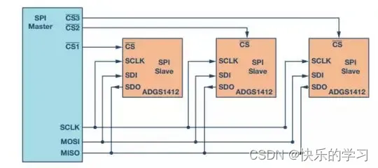
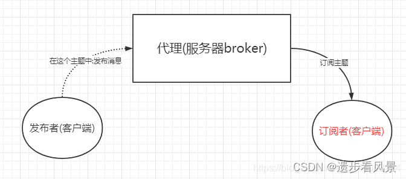

## 1、中断

中断的响应执行流程是什么？

cpu接受中断->保存中断上下文跳转到中断处理历程->执行中断上半部->执行中断下半 部->恢复中断上下文。

### 1.1 **硬中断 / 软中断是什么？有什么区别？**

1、硬中断是由硬件产生的，软中断是执行中断指令产生的。

2、硬中断可以直接中断CPU，软中断并不会直接中断CPU。也只有当前正在运行的代码（或进程）才会产生软中断。

3、硬中断可屏蔽、软中断不可屏蔽

4、硬中断又称上半部，要快速完成任务

### 1.2 **中断为什么要区分上半部和下半部？**

1、调用过程：外部中断产生->发送中断信号到中断控制器->通知处理器产生中断的中断号

2、为了能被新的中断打断。将中断处理一分为二，上半部登记新的中断，处理快速简单的任务，复杂耗时的任务给下半段处理，所以下半段可以被打断。

3、中断下半部一般使用tasklet或工作队列实现

### 1.3 **linux中断的响应执行流程？**

cpu接受中断->保存中断上下文跳转到中断处理历程->执行中断上半部->执行中断下半部->恢复中断上下文。

## 2、CPU,MPU,MCU,SOC,SOPC联系与差别？
> 1. CPU：是一台计算机的运算核心和控制核心
> 2. MPU: 微处理器稍强的CPU
>
> 3. MCU：将计算机的CPU、RAM、ROM、定时计数器和多种I/O接口集成在一片芯片上。
>
> 4. SOC： 系统级芯片不单单是放简单的代码，可以放系统级的代码，也就是说可以运行操作系统

## 3、交叉编译

 在一种计算机环境中运行的编译程序，能编译出在另外一种环境下运行的代码，我们就称这种编译器支持交叉编译。这个编译过程就叫交叉编译。

## 4、描述一下嵌入式基于ROM的运行方式和基于RAM的运行方式有什么区别？

**基于RAM**：

1、将硬盘或者其介质的代码加载到ram中。

2、速度快但是可用RAM少，因为自身的空间要存一部分代码

**基于ROM**:

1、将部分代码搬到RAM中去，所以可用RAM资源比基于RAM的多。

## 5、**CPU中cache的作用？cache的基本组织结构？**

1. 高速缓冲存储器Cache是位于CPU与内存之间的临时存储器，它的容量比内存小但交换速度快。

   在Cache中的数据是内存中的一小部分，但这一小部分是短时间内CPU即将访问的，当CPU调用大量数据时，就可避开内存直接从Cache中调用，从而加快读取速度。由此可见，在CPU中加入Cache是一种高效的解决方案，这样整个内存储器（Cache+内存）就变成了既有Cache的高速度，又有内存的大容量的存储系统了。

2. 全相连映射，直接映射，组相连映射。

# 二、通讯协议

## 1、异步传输与同步传输？

异步传输：是一种典型的基于字节的输入输出，数据按每次一个字节进行传输，其传输速度低。
同步传输：需要外界的时钟信号进行通信，是把数据字节组合起来一起发送，这种组合称之为帧，其传输速度比异步传输快。

## 2、IIC协议

1、IIC协议是由**数据线SDA**和**时钟SCL**构成的串行总线，可发送和接收数据,是一个多主机的半双工通信方式

**通信方式**

​	I2C是一种双向、半双工的通讯协议，意味着主机和从机都可以发送和接收数据，但不能同时进行。

​	主机负责发起通信和生成时钟信号，从机负责响应主机的请求。

2、**空闲状态**

SDA与SCL都处于高电平，就是空闲状态。

2、**起始信号**

时钟线为高，数据线由高到低就是启动信号，**只能由主机发起**空闲状态下才能启动该信号

3、**停止信号**

时钟为高，数据线由低到高就是停止信号

4、**传输数据格式**

SCL为高就会获取SDA数据值，SDA在这期间必须稳定

SCL为低便是SDA电平变化状态，在此期间SDA可以自由变化

可以主动拉低SCL让IIC进入等待状态知道处理结束再释放SCL数据传输会继续

5、**ACK应答信号**

发送方在第9个时钟脉冲奇迹爱你释放SDA数据，当接收方接收成功时，会输出一个应答信号，低电平有效。

6、**写操作**

start信号–设备地址–方向（读、写）。回应（确定这个设备是否存在）–发送数据–回应–发送完之后主芯片发送一个停止信号。

## 3、SPI协议
SPI：高速全双工串行总线。

接口：输出线、输入线、时钟线（SCLK）、片选信号线（CS）

1、片选信号线由高到低是SPI的起始信号 ，从机检测到自己的NSS线起始信号之后就知道自己被选中了，然后由低到高是停止信号。

2、SPI 使用 MOSI 及 MISO 信号线来传输数据，使用 SCK 信号线进行数据同步。 在时钟线上升沿触发输出，在下降沿被采样。

1）：支持全双工通信

2）：通信简单

3）：数据传输速率快

**1.3 缺点**
没有指定的流控制，没有应答机制确认是否接收到数据，所以跟IIC总线协议比较在数据
可靠性上有一定的缺陷。

在常规模式下，主机需要为每个从机提供单独的片选信号。一旦主机使能(拉低)片选信号，MOSI/MISO线上的时钟和数据便可用于所选的从机。如果使能多个片选信号，则MISO线上的数据会被破坏，因为主机无法识别哪个从机正在传输数据。

## 4、Modbus

Modbus是**主从方式通信**，也就是说，不能同步进行通信，总线上每次只有一个数据进行传输，即主机发送，从机应答，主机不发送，总线上就没有数据通信。(所以说，这也算是一个缺点了)

## 5、异步传输与同步传输？

异步传输：是一种典型的基于字节的输入输出，数据按每次一个字节进行传输，其传输速度低。

同步传输：需要外界的时钟信号进行通信，是把数据字节组合起来一起发送，这种组合称之为帧，其传输速度比异步传输快。

## 6、RS232和RS485区别？

1. 传输方式不同。 RS232采取不平衡传输方式，即所谓单端通讯。 而RS485则采用平衡传输，即差分传输方式。
2. 传输距离不同。RS232适合本地设备之间的通信，传输距离一般不超过20m。而RS485的传输距离为几十米到上千米。
3. 设备数量。RS232 只允许一对一通信，而RS485 接口在总线上是允许连接多达128个收发器。
4. 连接方式。RS232，规定用电平表示数据，因此线路就是单线路的，用两根线才能达到全双工的目的；而RS485， 使用差分电平表示数据，因此，必须用两根线才能达到传输数据的基本要求，要实现全双工，必需用4根线。

## 7、MQTT协议

MQTT(Message Queuing Telemetry Transport, [消息队列](https://so.csdn.net/so/search?q=消息队列&spm=1001.2101.3001.7020)遥测传输协议)，是一种基于发布/订阅(publish/subscribe)模式的"轻量级"通讯协议，该协议构建于TCP/IP协议上，由IBM在1999年发布。MQTT最大优点在于，可以以极少的代码和有限的带宽，为远程连接设备提过实时可靠的消息服务，作为一种低开销、低带宽占用的即时通讯协议，使其在物联网、小型设备、移动应用等方面有较广泛的应用
MQTT是一个基于客户端-服务器的消息发布/订阅传输协议。

实现MQTT协议需要客户端和服务器端通讯完成， 在通讯过程中, MQTT协议中有三种身份: 发布者(Publish)、代理(Broker)(服务器)、订阅者(Subscribe)。 其中，消息的发布者和订阅者都是客户端，消息代理是服务器，消息发布者可以同时是订阅者。

# 三、系统

## 1、芯片选型考虑哪些因素？

1. 性能：确保芯片具有足够的处理能力来满足项目需求。
2. 内存：选择具有足够RAM和ROM（或Flash）容量的芯片。
3. 能耗：根据项目要求，权衡功耗和性能。
4. 外设和接口：选择支持所需通信协议和设备连接的芯片。
5. 封装和尺寸：考虑空间限制和生产要求，选择合适的封装类型。
6. 开发工具和支持：选用具有良好文档和支持的芯片，降低开发难度。
7. 供应和成本：确保稳定供应并选择性价比合适的芯片。
8. 软件和生态系统：选择具有成熟软件支持和丰富生态系统的芯片。
9. 安全性：根据项目要求，选择具有相应安全功能的芯片。
10. 可扩展性：选择具有一定可扩展性和升级能力的芯片，以适应项目需求变化。

## 2、STM32F4和F1的区别，为什么选用F4？

内核不同：F1是Cortex-M3内核，F4是Cortex-M4内核；

主频不同：F1主频72MHz，F4主频168MHz；

浮点运算：F1无浮点运算单位没有硬件FPU处理浮点数运算，F4有；

（没有浮点加速硬件FPU只影响浮点计算的速度，并不是不能计算浮点数，因此只能通过内核的软件进行计算。先要把这个浮点数运算转换成定点数存储，再把这个定点数转换成指数的方式进行运算，不仅中间要进行数据转换，并且要进行多次移位，而整数型就不需要这么复杂的操作，直接运算就可以，所以F1浮点数运算不仅运算量大并且会加大MCU的负载，要慢很多）

功能性能：F4外设比F1丰富且功能更强大，比如GPIO翻转速率、上下拉电阻配置、ADC精度等；

内存大小：F1内部SRAM最大64K，F4有192K(112+64+16)。

F4的RAM和ROM：ram192K，rom大小2048K

考虑到需要浮点运算和使用RTOS系统，最后选择F4；

## 3、STM32启动过程：

1. 处理器复位：当STM32芯片上电或者外部复位信号触发时，处理器的复位引脚将会被拉低，导致处理器执行复位操作。在复位期间，处理器会将各个寄存器的值初始化为默认值，并开始执行复位向量表中的第一条指令。
2. 复位向量表：在STM32微控制器中，复位向量表是一个存储器区域，其中包含了处理器在复位时跳转执行的第一条指令的地址。通常，复位向量表位于存储器的起始地址，由芯片制造商预先定义。复位向量表的内容包括复位中断处理函数、中断向量表和其他初始化函数。
3. 系统初始化：复位向量表中的第一条指令通常是一条跳转指令，将控制权转移到系统初始化函数的地址上。系统初始化函数主要用于设置处理器和系统的一些基本配置，例如时钟源和时钟频率的配置，初始化堆栈指针、全局变量等。
4. C库初始化：在系统初始化完成后，通常会调用C库的初始化函数。C库的初始化函数主要是对C语言运行环境的初始化，包括清零BSS段（未初始化的全局变量）、复制数据段（初始化的全局变量）等。
5. 主函数入口：C库初始化完成后，处理器将跳转到主函数的入口地址开始执行用户程序。主函数是程序的入口点，其中包含应用程序的具体逻辑。

需要注意的是，上述步骤是一般情况下的启动流程，具体的启动过程可能会因不同的芯片型号、启动模式和编译器设置而有所差异。此外，还可以通过修改复位向量表的内容来实现特定的启动操作，例如自定义复位中断处理函数或添加其他初始化函数。

## 4、stm32的定时器

提问定时器相关的，具体根据你个人开发使用情况解答。

1. 定时器时钟使能：首先，需要使能所需的定时器时钟。这可以通过RCC（Reset and Clock Control）寄存器来配置。例如，如果要使用TIM2定时器，需要使能TIM2的时钟。
2. 定时器配置：配置定时器的基本参数，例如计数器的工作模式、时钟分频系数、计数器的自动重载值等。这些配置可以通过定时器的相关寄存器进行设置。
3. 定时器中断设置（可选）：如果需要使用定时器中断，可以配置中断源和中断优先级，并使能定时器中断。
4. 启动定时器：配置完成后，启动定时器开始计数。定时器可以通过软件触发或外部触发来启动计数。
5. 定时器中断处理（可选）：如果配置了定时器中断，当计数器达到设定的值时，会触发中断。在中断服务程序中可以执行相应的操作，例如更新计数器的值、处理中断标志等。

## 5、stm32的AD采样

提问AD采样相关的，具体根据你个人开发使用情况解答。

1. ADC配置：首先，需要配置ADC模块的相关寄存器，包括时钟使能、采样时间、采样通道等。这些配置可以通过寄存器操作或者使用STM32提供的库函数进行设置。
2. GPIO配置：为了使用ADC，需要将相应的GPIO引脚配置为模拟输入模式，并使能相应的ADC通道。这可以通过配置GPIO寄存器来完成。
3. 触发方式设置：可以选择触发ADC转换的方式，例如软件触发或外部触发。如果选择外部触发，还需要配置相关的触发源和极性。
4. ADC转换：在进行ADC转换之前，可以设置ADC分辨率、对齐方式、连续转换模式等。然后，可以通过启动转换命令或触发源来开始ADC转换。
5. 中断或轮询获取结果：可以选择使用中断或轮询的方式获取ADC转换结果。如果使用中断方式，可以在转换完成后触发中断，并在中断服务程序中读取转换结果。如果使用轮询方式，则需要在转换完成后主动查询并读取转换结果。
6. 结果处理：获取到ADC转换结果后，可以根据需要进行相应的处理，例如数据转换、单位换算等。

## 6、Linux嵌入式和单片机嵌入式区别：

复杂性：Linux嵌入式系统是基于Linux内核构建的，具有完整的操作系统功能，包括多任务处理、文件系统、网络协议等。相比之下，单片机嵌入式系统通常使用裸机编程或者实时操作系统（RTOS），具有更简单的系统结构和功能。

处理能力：Linux嵌入式系统通常在较强大的处理器上运行，例如ARM、x86等，具备较高的处理能力和存储容量。而单片机嵌入式系统使用单片机芯片，其处理能力和存储容量较低。

开发环境：Linux嵌入式系统使用标准的开发工具链和开发环境，可以使用高级编程语言（如C/C++）进行开发，并且具备广泛的软件支持和开发社区。单片机嵌入式系统的开发通常需要使用特定的单片机编程工具和汇编语言，开发资源相对较少。

系统定制性：Linux嵌入式系统具有很高的可定制性，可以根据应用需求选择所需的软件组件和功能，并且支持模块化的软件开发和更新。单片机嵌入式系统的定制性相对较低，往往需要在设计阶段确定所需功能和硬件配置。

成本和功耗：Linux嵌入式系统由于使用较高性能的处理器和较大容量的存储器，相对而言成本较高，并且功耗较高。单片机嵌入式系统由于采用低成本、低功耗的单片机芯片，成本较低且功耗较低。

总的来说，Linux嵌入式系统适用于需要复杂功能、较高性能和较大存储容量的应用，如智能手机、平板电脑、网络设备等。而单片机嵌入式系统适用于资源有限、功耗要求低、对实时性要求较高的应用，如传感器、家电、汽车电子等。

## 7、FreeRTOS、μC/OS的区别

开源性质：FreeRTOS是一个开源的RTOS，可以免费获取并在商业和非商业项目中使用。它具有广泛的用户社区和支持。而μC/OS是一种商业RTOS，需要购买许可证才能使用。

架构和内核：FreeRTOS采用基于优先级的抢占式内核架构，支持多任务处理、时间片轮转调度和中断服务机制。它提供了一套轻量级的内核函数和任务管理机制。μC/OS也是基于优先级的抢占式内核，但它提供了更多的功能，如事件标志、信号量、消息邮箱等，以满足更复杂的应用需求。

资源占用：FreeRTOS的内核非常小巧，具有低的存储器占用和快速的上下文切换速度，适用于资源有限的嵌入式系统。μC/OS相对而言具有更大的内核代码大小和更高的存储器占用，但它提供了更丰富的功能和可选组件。

硬件平台支持：FreeRTOS在多种处理器架构上都有支持，包括ARM、MIPS、x86等，因此它适用于广泛的硬件平台。μC/OS也支持多种处理器架构，但支持的硬件平台较少，且主要集中在微控制器和嵌入式系统上。

社区支持和生态系统：由于FreeRTOS的开源性质，它具有庞大的用户社区和广泛的生态系统，提供了丰富的示例代码、开发工具和支持资源。μC/OS作为商业RTOS，其用户社区和生态系统相对较小，但有专门的技术支持和服务。

## 8、在RTOS中，二值信号量和互斥量的区别？

二值信号量是一种计数器，只有两种状态：0和1。当一个任务试图获取一个已经被获取的二值信号量时，该任务会被挂起，直到该信号量被释放为止。二值信号量通常用于同步任务的开始或者结束，或者是保护共享资源的读写等。由于二值信号量不具有优先级继承功能，当高优先级任务等待低优先级任务释放二值信号量时，低优先级任务可能会优先执行，导致任务调度出现问题。

互斥量也是一种计数器，但它具有更多的状态。当一个任务获取一个已经被获取的互斥量时，该任务会被挂起，并且该互斥量的计数器会减一。只有当计数器归零时，该互斥量才会被释放。互斥量通常用于保护共享资源的读写等，它具有优先级继承功能，可以避免高优先级任务因为等待低优先级任务释放互斥量而被阻塞的问题。

## 9、在RTOS中，任务通知的运行机制是怎么样的？

1. 发送任务向接收任务发送通知，通知包括通知值和接收任务的句柄。
2. 接收任务准备好接收通知，并在等待通知列表中等待通知的到来。
3. 发送任务调用发送通知的API函数，RTOS将通知保存到接收任务的等待通知列表中。
4. 如果接收任务已经准备好接收通知，那么RTOS会将该任务从等待通知列表中移除，并唤醒该任务继续执行。
5. 如果接收任务没有准备好接收通知，那么该任务会继续等待，直到接收任务准备好接收通知。

## 10、UCOS任务调度

一个任务，也称作一个线程。

UCOS有一个任务调度机制，根据任务的优先级进行调度。

一个是硬件中断， 那么系统会将当前任务有关变量入栈，然后执行中断服务程序，执行完成后出栈返回.

另一个是任务之间的切换，使用的方法就是任务调度，每一个任务有自己的栈，顺度也是一样的入栈，然后执行另一个程序，然后出线返回。

 

并非是每一任务按优先级顺序轮流执行的，而是高优先级的任务独占运行，除非其主动放弃执行，否则低优先级任务不能抢占，同时高优先级可以把放出去给低优先级任务使用的CPU占用权抢回来。所以UCOS的任务间要注意插入等待延时，以便UCOS切出去让低优先级任务执行。

## 11、UCOS中任务间的通信

在UCOS中，是使用信号量、邮箱（消息邮箱）和消息队列这些被称作事件的中间环节来实现任务间的通信的，还有全局变量。

信号量用于：

1.控制共享资源的使用权（满足互斥条件）

2.标志某时间的发生

3.使2个任务的行为同步

消息队列：

概念：

（1）消息队列实际上就是邮箱阵列。

（2）任务和中断都可以将一则消息放入队列中，任务可以从消息队列中获取消息。

（3）先进入队列的消息先传给任务(FIFO)。

（4）每个消息队列有一张等待消息任务的等待列表，如果消息列中没有消息，则等待消息的任务就被挂起，直到消息到来。

# 四、Linux驱动

## 1、Linux移植ARM的基本步骤和完成的任务

1）首先是准备工作，包括下载源码、建立交叉编译环境等；

2）然后是配置和编译内核，必要时还要对源码做一定的修改；

3）第三步就是需要制作文件系统（如RAM disk）来挂接根文件系统；

4）最后是下载、调试内核并在fs中添加自己的应用程序。

## 2、**ARM-linux启动分几部分，简述流程：**

ARM-linux启动分为四个部分：引导加载程序（bootloader），Linux内核，文件系统，应用程序。

bootloader是系统启动和复位后执行的第一段代码，它主要用来初始化处理器及外设，然后调用Linux内核。Linux内核在完成系统的初始化之后需要挂载某个文件系统作为根文件系统（root filesystem）。根文件系统是Linux系统的核心组成部分，它可以作为Linux系统中文件和数据的存储区域，通常它还包括配置文件运行应用程序所需要的库。应用程序实现该嵌入式产品所要实现的目标。

## 3、驱动分类

> linux驱动分为三类
>
> 1、字符设备驱动，例如IIC、SPI
>
> 字符设备驱动是以不定长度的字元来传送资料，字符设备是一个顺序的数据流设备，对这种设备的读写是按字符进行的，而且这些字符是连续地形成一个数据流； 
>
> 2、块设备驱动
>
> 块设备驱动是以固定大小长度来传送和转移资料的，块设备能够随机，不需要按照顺序地访问固定大小的数据片。例如flash，SD卡。
>
> 3、网络设备
>
> 网络设备驱动：蓝牙，wifi，网卡等

## 4、Linux操作系统

Linux分为**内核空间**（内核态）和**用户空间**（用户态）。

Linux操作系统内核和驱动程序运行在内核空间，应用程序运行在用户空间。

应用程序访问内核资源三种方法：系统调用、异常（中断）和陷入。

