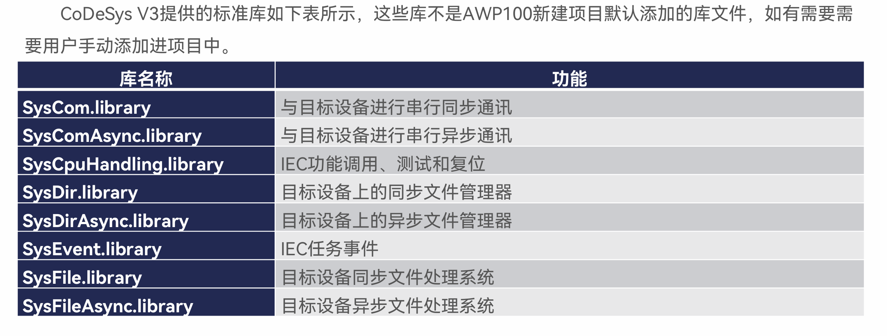
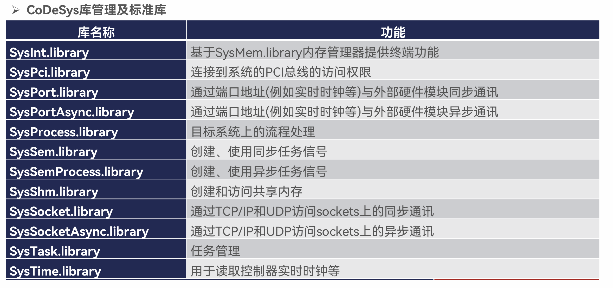
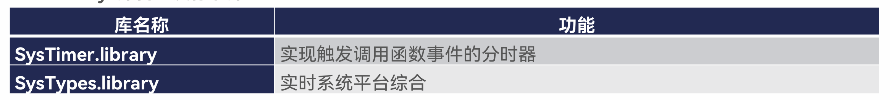

## CODESYS

直观的讲codesys是一个已经写好了运动控制和通讯的软件PLC。

### 概念

CODESYS是一款工业自动化领域的一款开发编程系统，应用领域涉及工厂自动化、汽车自动化、嵌入式自动化、过程自动化和楼宇自动化等等。CODESYS软件可以分为两个部分，一部分是运行在各类硬件中的RTE（Runtime Environment），另一部分是运行在PC机上的IDE。因此CODESYS的用户既包括生产PLC、运动控制器的硬件厂商，也包括最终使用PLC、运动控制器的用户。

目前全球有近400家的控制系统生产制造商是CODESYS的用户：如ABB、施耐德电气SchneiderElectric、伊顿电气EATON、博世力士乐Rexroth、倍福BECKHOFF、科控KEBA、日立HITACHI、三菱自动化MITSUBISHI、欧姆龙OMRON、研华科技、凌华科技ADLINK、新汉电脑、和利时集团、SUPCON 中控集团、步科自动化KINCO、深圳雷赛、汇川技术、深圳合信、深圳英威腾、华中数控、固高科技等等。

### 优势

**1.全部功能都集成在一个单一的用户界面**

包含全部IEC 61131-3的语言：SFC（顺序功能图）、LD（梯形图）、FBD（功能块）、ST（结构化文本）、IL（指令表)，支持从经典PLC编程到面向都对象编程。

全面的功能，方便工程和自动化应用的调试。

为系统化应用程序开发提供可选的附加模块。

可以对绝大多数工业现场总线系统或制造商特定的I / O系统进行组态和调试。

可选的附加组件可以无缝集成到工程中。

安装、维护和培训只需要一个用户界面。

**2.为今后的自动化任务提供开放的选择**

来自著名制造商的数百台自动化设备可通过CODESYS开发系统进行编程。

提供SoftPLC系统的标准平台。

在现有开发环境和过程中轻松连接。

**3.强大的实施复杂自动化项目的能力**

快速运行的机器代码，用于不同复杂的设备和应用程序。

用于计算3D CNC /机器人，以及3D可视化的强大工具。

丰富的可扩展功能

可重用程序代码的库的概念

**4.该系统已在工业领域被可靠和广泛的使用**

CODESYS同类产品

CODESYS是全球为数不多进行软件PLC开发的，类似的公司还有KW（已更名为菲尼克斯软件），infoteam等等。

### 具体内容

## ini文件

*.ini文件是Initialization file的缩写，即为初始化文件，是Windows系统配置文件所采用的存储格式，统管Windows的各项配置，一般用户就用Windows提供的各项图形化管理界面就可以实现相同的配置了。但在某些情况，还是要直接编辑ini才方便，一般只有很熟悉Windows才能去直接编辑。

*.ini开始时使用于WIN3X下面，WIN95用注册表代替。

除了windows2003很多其他操作系统下面的应用软件也有*.ini文件，用来配置应用软件以实现不同用户的要求。一般不用直接编辑这些ini文件，应用程序的图形界面即可操作以实现相同的功能。它可以用来存放软件信息、注册表信息等。

