## 生产者-消费者问题

参考：[【操作系统】生产者消费者问题-CSDN博客](https://blog.csdn.net/liushall/article/details/81569609)


## 哲学家进餐问题

参考：[经典的进程同步问题-----哲学家进餐问题详解-CSDN博客](https://blog.csdn.net/qq_34666857/article/details/103232060)

参考：[哲学家进餐问题---操作系统经典进程同步互斥问题---详细讲解_哲学家问题操作系统-CSDN博客](https://blog.csdn.net/2301_82018821/article/details/135367753)


## 读者-写者问题

参考：[linux线程同步方式5——读写锁（rwlock）_pthread rwlock tryrdlock-CSDN博客](https://blog.csdn.net/JMW1407/article/details/106815005)


有一群写者和一群读者，写者在写同一本书，读者也在读这本书，多个读者可以同时读这本书，但是，只能有一个写者在写书。特征：

（1）任意多的读进程可以同时读这个文件；
（2）一次只允许一个写进程往文件中写；
（3）如果一个写进程正在往文件中写，禁止任何读进程或写进程访问文件；
（4）写进程执行写操作前，应让已有的写者或读者全部退出。这说明当有读者在读文件时不允许写者写文件。
	有时候，在多线程中，有一些公共数据修改的机会比较少，而读的机会却是非常多的，此公共数据的操作基本都是读，如果每次操作都给此段代码加锁，太浪费时间了而且也很浪费资源，降低程序的效率，因为读操作不会修改数据，只是做一些查询，所以在读的时候不用给此段代码加锁，可以共享的访问，只有涉及到写的时候，互斥的访问就好了

2. 定义
读写锁是一种特殊的自旋锁，它把对共享资源对访问者划分成了读者和写者，读者只对共享资源进行访问，写者则是对共享资源进行写操作。读写锁一个读写锁同时只能存在一个写锁但是可以存在多个读锁，但不能同时存在写锁和读锁。

3. 读写锁三种状态
如果读写锁当前没有读者，也没有写者，那么写者可以立刻获的读写锁，否则必须自旋，直到没有任何的写锁或者读锁存在。如果读写锁没有写锁，那么读锁可以立马获取，否则必须等待写锁释放。

所以读写锁具备三种状态：
1. 读模式下加锁状态 (读锁)
2. 写模式下加锁状态 (写锁)
3. 不加锁状态
4. 读写锁特性
读写锁是"写模式加锁"时， 解锁前，所有对该锁加锁的线程都会被阻塞；
读写锁是"读模式加锁"时， 如果线程以读模式对其加锁会成功；如果线程以写模式加锁会阻塞；
读写锁是"读模式加锁"时， 既有试图以写模式加锁的线程，也有试图以读模式加锁的线程。那么读写锁会阻塞随后的读模式锁请求。优先满足写模式锁。读锁、写锁并行阻塞，写锁优先级高。
写独占，读共享；写锁优先级高

2、初始化
int pthread_rwlock_init(pthread_rwlock_t *restrict rwlock,const pthread_rwlockattr_t *restrict attr);
1
成功返回0， 失败直接返回错误号

pthread_rwlock_t：定义读写锁的结构体
PTHREAD_RWLOCK_INITIALIZER静态初始化读写锁
pthread_rwlock_init 函数动态初始化锁
attr：通常使用默认属性，NULL
pthread_rwlock_t rwlock;
pthread_rwlock_init(&rwlock, NULL);
1
2
3、请求读锁(阻塞)
int pthread_rwlock_rdlock(pthread_rwlock_t *rwlock);
1
成功，返回 0。否则，将返回用于指明错误的错误号

如果写入器未持有读锁，并且没有任何写入器基于该锁阻塞，则调用线程会获取读锁。
如果写入器未持有读锁，但有多个写入器正在等待该锁时，调用线程是否能获取该锁是不确定的。
如果一个线程写锁定了 读写锁后，又调用了pthread_rwlock_rdlock来读锁定同一个读写锁，结果无法预测。
如果某个写入器持有读锁，则调用线程无法获取该锁。
调用线程必须获取该锁之后，才能从 pthread_rwlock_rdlock() 返回。
为避免写入器资源匮乏，允许在多个实现中使写入器的优先级高于读取器。
pthread_rwlock_rdlock() n 次。该线程必须调用pthread_rwlock_unlock() n 次才能执行匹配的解除锁定操作。
线程信号处理程序可以处理传送给等待读写锁的线程的信号。从信号处理程序返回后，线程将继续等待读写锁以执行读取，就好像线程未中断一样。
4、请求读锁(非阻塞)
读取非阻塞读写锁中的锁

int pthread_rwlock_tryrdlock(pthread_rwlock_t *rwlock);//尝试加读锁,没锁上就立即返回
1
无论加锁是否成功，上面的函数都会立即返回，成功返回 0，失败返回 EBUSY。

如果任何线程持有 rwlock 中的写锁或者写入器基于 rwlock 阻塞，则 pthread_rwlock_tryrdlock()
函数会失败。
5、请求写锁（阻塞）
int pthread_rwlock_wrlock(pthread_rwlock_t *rwlock);
1
成功返回0， 失败直接返回错误号

如果没有其他读取器线程或写入器线程持有读写锁 rwlock，则调用线程将获取写锁，否则，调用线程将阻塞。
调用线程必须获取该锁之后，才能从 pthread_rwlock_wrlock() 调用返回。
如果在进行调用时，调用线程持有读写锁（读锁或写锁），则结果是不确定的。
为避免写入器资源匮乏，写入器的优先级高于读取器。 如果针对未初始化的读写锁调用 pthread_rwlock_wrlock()，则结果是不确定的。
线程信号处理程序可以处理传送给等待读写锁以执行写入的线程的信号。从信号处理程序返回后，线程将继续等待读写锁以执行写入，就好像线程未中断一样。
6、请求写锁（非阻塞）
int pthread_rwlock_trywrlock(pthread_rwlock_t  *rwlock);//尝试（没锁上就立即返回）加锁
1
成功返回0， 失败直接返回错误号

如果任何线程当前持有用于读取和写入的 rwlock，则pthread_rwlock_trywrlock() 函数会失败。
如果针对未初始化的读写锁调用 pthread_rwlock_trywrlock()，则结果是不确定的
7、解锁
释放在 rwlock 引用的读写锁对象中持有的锁。

int pthread_rwlock_unlock (pthread_rwlock_t  *rwlock);
1
成功返回 0，否则返回用于指明错误的错误号

如果调用线程未持有读写锁 rwlock，则结果是不确定的。
如果通过调用 pthread_rwlock_unlock()来释放读写锁对象中的读锁，并且其他读锁当前由该锁对象持有，则该对象会保持读取锁定状态。
如果 pthread_rwlock_unlock()释放了调用线程在该读写锁对象中的最后一个读锁，则调用线程不再是该对象的属主。
如果 pthread_rwlock_unlock()释放了该读写锁对象的最后一个读锁，则该读写锁对象将处于无属主、解除锁定状态。
如果通过调用 pthread_rwlock_unlock() 释放了该读写锁对象的最后一个写锁，则该读写锁对象将处于无属主、解除锁定状态。
如果 pthread_rwlock_unlock()解除锁定该读写锁对象，并且多个线程正在等待获取该对象以执行写入，则通过调度策略可确定获取该对象以执行写入的线程。
如果多个线程正在等待获取读写锁对象以执行读取，则通过调度策略可确定等待线程获取该对象以执行写入的顺序。
如果多个线程基于rwlock 中的读锁和写锁阻塞，则无法确定读取器和写入器谁先获得该锁。
如果针对未初始化的读写锁调用 pthread_rwlock_unlock()，则结果是不确定的。
8、销毁
销毁 rwlock 引用的读写锁对象并释放该锁使用的任何资源

int pthread_rwlock_destroy(pthread_rwlock_t *rwlock);
1
成功，返回 0。否则，返回用于指明错误的错误号

尝试销毁未初始化的读写锁会产生不确定的行为。
已销毁的读写锁对象可以使用 pthread_rwlock_init() 来重新初始化。
销毁读写锁对象之后，如果以其他方式引用该对象，则结果是不确定的。

### 互斥锁、读写锁、自旋锁区别

互斥锁：
用于保证在任何时刻，都只能有一个线程访问该对象。当获取锁操作失败时，线程会进入睡眠，等待锁释放时被唤醒

读写锁：
分为读锁和写锁。处于读操作时，可以允许多个线程同时获得读操作。但是同一时刻只能有一个线程可以获得写锁。其它获取写锁失败的线程都会进入睡眠状态，直到写锁释放时被唤醒。 注意：写锁会阻塞其它读写锁。当有一个线程获得写锁在写时，读锁也不能被其它线程获取；写者优先于读者（一旦有写者，则后续读者必须等待，唤醒时优先考虑写者）。适用于读取数据的频率远远大于写数据的频率的场合。

自旋锁：
在任何时刻同样只能有一个线程访问对象。但是当获取锁操作失败时，不会进入睡眠，而是会在原地自旋，直到锁被释放。这样节省了线程从睡眠状态到被唤醒期间的消耗，在加锁时间短暂的环境下会极大的提高效率。但如果加锁时间过长，则会非常浪费CPU资源。


## 共享内存和内存映射的区别

共享内存

       首先，我们要明确共享内存（shm）的应用场景是什么？也就是在什么场合使用共享内存。一般来说，多进程共享同一内存区域或者跨进程访问某个区域时才需要共享内存。也就是同一片内存，被多个进程共享。
       共享内存，顾名思义，就是预留出的内存区域，它允许一组进程对其访问。 共享内存是system v IPC中三种通信机制最快的一种，也是最简单的一种。对于进程来说， 获得共享内存后，他对内存的使用和其他的内存是一样的。由一个进程对共享内存所进行的 操作对其他进程来说都是立即可见的，因为每个进程只需要通过一个指向共享内存空间的指针就可以来读取 共享内存中的内容（说白了就好比申请了一块内存，每个需要的进程都有一个指针指向这个内存） 就可以轻松获得结果。
  内存映射：

```
 内存映射，一般指的是为了加快文件操作，将文件系统上某个文件的一段内容映射到内存中，用户可以在核外地址空间直接读写内核地址空间的地址对应的内容，这样进程在读写文件时，少了一次拷贝开销。这个一般是用在一个进程内的。
```


        由此看来，共享内存用于多个进程共享同一块地址空间，实现多个人访问同一个区域，目的是共享。mmap内存映射的目的是加快访问速度。这两个并不冲突，所以可以组合到一起使用。
​	

## 抖动

发生抖动的根本原因是：同时在系统中运行的进程太多，由此分配给每一个进程的物理块太少，不能满足进程正常运行的基本要求，致使每个进程在运行时，频繁出现缺页，必须请求系统将所缺之页调入内存。

这会使得在系统中排队等待页面调进/调出的进程数目增加。显然，对磁盘的有效访问时间也随之急剧增加，造成每个进程的大部分时间都用于页面的换进/换出，而几乎不能再去做任何有效的工作，从而导致发生处理机的利用率急剧下降并趋于0的情况。我们称此时的进程是处于“抖动”状态。

## 原语

是一种特殊的程序，具有原子性。这段程序必须一气呵成，不能被中断。例如：设备驱动、cpu切换等。


## mmap和shm区别

linux中的两种共享内存。一种是我们的IPC通信System V版本的共享内存（shm），另外的一种就是内存映射I/O（mmap函数）

1、mmap()通过映射一个普通文件实现共享内存，shmget()：内核里存在着一个特殊的文件系统（shm），这个文件系统的存储介质不是别的，正是 RAM。

- 所以，mmap可以看到文件的实体，而 shmget 对应的文件在交换分区上的 shm 文件系统内，无法直接 cat 查看
- 速度比较：shm保存在RAM，这样读写的速度要比磁盘要快，但是存储量不是特别大。mmap是在磁盘上建立一个文件
- 安全比较： mmap把文件保存在磁盘上，这个文件还保存了操作系统同步的映像，所以mmap不会丢失，但是shmget就会丢失。


2、mmap是在磁盘上建立一个文件，每个进程地址空间中都会开辟出一块空间进行文件-内存的映射。

而对于shm而言，shm每个进程最终会映射到同一块物理内存。

- mmap 方式下各进程映射文件的相同部分可以共享内存， shmget 时各个进程共享同一片物理内存区。


## 共享内存

参考：[什么是共享内存？在内存中的具体位置？共享内存相关API，mmap 的具体使用原理、以及C++应用案例？_shared memory model mmap-CSDN博客](https://blog.csdn.net/JMW1407/article/details/107703142)


 简单来说，共享内存就是允许两个或多个进程共享一定的存储区。

共享内存的优缺点

1、优点：我们可以看到使用共享内存进行进程间的通信真的是非常方便，而且函数的接口也简单，数据的共享还使进程间的数据不用传送，而是直接访问内存，也加快了程序的效率。同时，它也不像匿名管道那样要求通信的进程有一定的父子关系。

2、缺点：共享内存没有提供同步的机制，这使得我们在使用共享内存进行进程间通信时，往往要借助其他的手段来进行进程间的同步工作。

### mmap和shm的区别

linux中的两种共享内存。一种是我们的IPC通信System V版本的共享内存==（shm）==，另外的一种就是==内存映射I/O（mmap函数）==

1、mmap()通过映射一个普通文件实现共享内存，shmget()：内核里存在着一个特殊的文件系统（shm），这个文件系统的存储介质不是别的，正是 RAM。

- 所以，mmap可以看到文件的实体，而 shmget 对应的文件在交换分区上的 shm 文件系统内，无法直接 cat 查看
- 速度比较：shm保存在RAM，这样读写的速度要比磁盘要快，但是存储量不是特别大。mmap是在磁盘上建立一个文件
- 安全比较： mmap把文件保存在磁盘上，这个文件还保存了操作系统同步的映像，所以mmap不会丢失，但是shmget就会丢失。

2、mmap是在磁盘上建立一个文件，每个进程地址空间中都会开辟出一块空间进行文件-内存的映射。
而对于shm而言，shm每个进程最终会映射到同一块物理内存。

- mmap 方式下各进程映射文件的相同部分可以共享内存， shmget 时各个进程共享同一片物理内存区

## 内存映射

**内存映射即在进程的虚拟地址空间中创建一个映射，分为两种：**

- **文件映射：**文件支持的内存映射，把文件的一个区间映射到进程的虚拟地址空间，数据源是存储设备上的文件。
- **匿名映射：**没有文件支持的内存映射，把物理内存映射到进程的虚拟地址空间，没有数据源。

<font color=red>创建内存映射时，在进程的用户虚拟地址空间中分配一个虚拟内存区域。内核采用延迟分配物理内存的策略，在进程第一次访问虚拟页的时候，产生缺页异常</font>。

如果是[==文件映射==](https://zhida.zhihu.com/search?content_id=187208457&content_type=Article&match_order=2&q=文件映射&zhida_source=entity)，那么分配物理页，把文件指定区间的数据读到物理页中，然后在页表中把虚拟页映射到物理页。

如果是==匿名映射==，就分配物理页，然后在页表中把虚拟页映射到物理页。

内核必须提供数据结构，以建立虚拟地址空间的区域和相关数据所在位置之间的关联。例如，在映射文本文件时，映射的虚拟内存区必须关联到文件系统在硬盘上存储文件内容的区域。

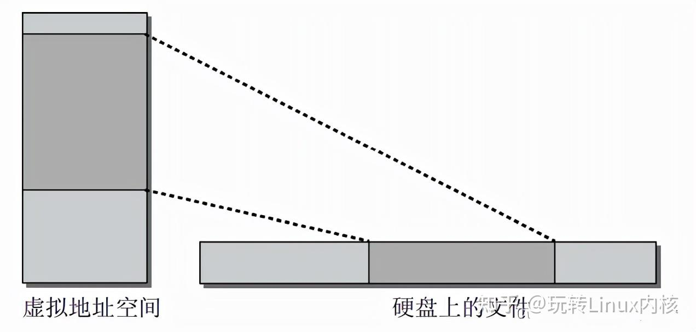

当然，给出的图示是简化的，因为文件数据在硬盘上的存储通常并不是连续的，而是分布到若干小的区域。内核利用address_space数据结构，提供一组方法从后备存储器读取数据。例如，从文件系统读取。因此address_space形成了一个辅助层，将映射的数据表示为连续的线性区域，提供给内存管理子系统。按需分配和填充页称之为按需调页法（ demand paging）。它基于处理器和内核之间的交互，使用的各种数据结构如图。

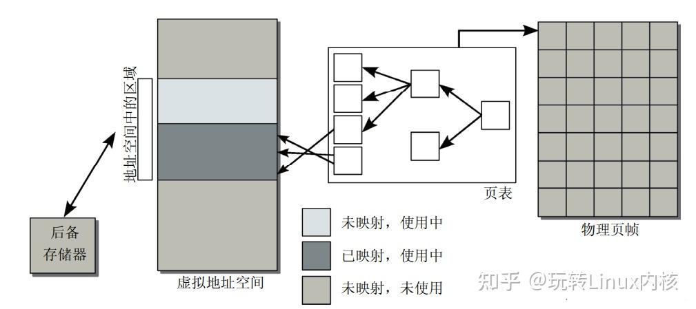

- 进程试图访问用户地址空间中的一个内存地址，但使用页表无法确定物理地址（物理内存中没有关联页）。
- 处理器接下来触发一个[缺页异常](https://zhida.zhihu.com/search?content_id=187208457&content_type=Article&match_order=2&q=缺页异常&zhida_source=entity)，发送到内核。
- 内核会检查负责缺页区域的进程地址空间数据结构，找到适当的后备存储器，或者确认该访问实际上是不正确的。
- 分配物理内存页，并从后备存储器读取所需数据填充。
- 借助于页表将物理内存页并入到用户进程的地址空间，应用程序恢复执行。

这些操作对用户进程是透明的。换句话说，进程不会注意到页是实际在物理内存中，还是需要通过按需调页加载。


## 匿名映射

**匿名映射区是指创建的映射区域不与任何文件关联，而是由操作系统分配的匿名内存。**

mmap 内存映射里所谓的内存其实指的是==虚拟内存==，

在调用 mmap 进行==匿名映射==的时候（比如进行堆内存的分配），是将进程虚拟内存空间中的某一段虚拟内存区域与物理内存中的匿名内存页进行映射;

当调用 mmap 进行==文件映射==的时候，是将进程虚拟内存空间中的某一段虚拟内存区域与磁盘中某个文件中的某段区域进行映射。


匿名内存是用户空间的概念，不涉及内核态内存。匿名内存的概念是指一段[虚拟内存](https://so.csdn.net/so/search?q=虚拟内存&spm=1001.2101.3001.7020)映射是否与之相关联的对象，如果没有关联对象就称为匿名的。本章就主要学习缺页异常的匿名映射，其中涉及到以下内容

1. 匿名映射的概念
2. 匿名映射的流程

由于应用程序申请内存后，内核分配了虚拟内存，当访问所需要的的内存时候，才会分配实际的物理内存，才能节省实际内存的使用。我们来看看匿名映射和文件映射的区别

- 匿名页面，是指那些没有关联到文件页，如进程堆、栈、数据段和任务已修改的共享库等，不是以文件形式存在，因此无法和磁盘文件交换
- 文件页面，也就是映射文件的页，对于文件映射背景的页面，程序可以通过read/write/mmap去读，当通过任何一种方式从磁盘读取文件时，内存都会给你申请一个pace cache来缓存硬盘内容。例如通过mmap映射文件到虚拟内存然后读文件，进程的代码段等，这些页都是由缓存。


## 缺页异常

在实际需要某个虚拟内存区域的数据之前，虚拟和物理内存之间的关联不会建立。如果进程访问的虚拟地址空间尚未与页帧关联，处理器自动地发一个缺页异常，内核必须处理此异常。这是内存管理中最重要、最复杂的方面之一，因为必须要考虑无数的细节

- 缺页异常时由于访问用户地址空间中的有效地址而引起的，还是应用程序试图访问内核的受保护区域？
- 目标地址对应于某个现存的映射吗？
- 获取该区域的地址，需要使用何种机制？

缺页异常处理的实现因处理器的不同而有所不同，本文针对ARM32的处理流程进行学习，学习处理流程。

### 1. 缺页异常基本原理

进程A通过CPU访问虚拟地址VA，通过MMU找到对应的物理地址，当内存页在物理内存中没有对应的页帧或者存在但无对应的访问权限，在这种情况下，CPU就会报告一个缺页的错误。

![[外链图片转存失败,源站可能有防盗链机制,建议将图片保存下来直接上传(img-a01SKGLm-1608438089039)(D:\学习总结\内存管理单元\image-20201213220303114.png)]](操作系统整理版.assets/22f459e6a53252984a1d232933a2c3bb.png)

缺页错误的分类：

- 硬件缺页(Hard Page Fault): 此时物理内存中没有对应的页帧，需要CPU打开磁盘设备读取到物理内存中，再让MMU建立VA和PA的映射

- 软缺页(Soft Page Fault): 此时物理内存中存在对应的页帧，只不过可能是其他进程调入，发生缺页异常的进程不知道，此时MMU只需要重新建立映射即可，无需从磁盘写入内存，一般出现在多进程共享内存区域
- 无效缺页(Invalid Page Falut): 比如进程访问的内存地址越界访问，空指针引用就会报段错误等


##  文件映射

文件支持的内存映射，把文件的一个区间映射到进程的虚拟地址空间，数据源是存储设备上的文件。

mmap 内存映射里所谓的内存其实指的是==虚拟内存==，

在调用 mmap 进行==匿名映射==的时候（比如进行堆内存的分配），是将进程虚拟内存空间中的某一段虚拟内存区域与物理内存中的匿名内存页进行映射;

当调用 mmap 进行==文件映射==的时候，是将进程虚拟内存空间中的某一段虚拟内存区域与磁盘中某个文件中的某段区域进行映射。


## 文件描述符

### **1、背景（何为文件？）**
在Linux操作系统中，可以将一切都看作是文件，包括普通文件，目录文件，字符设备文件（如键盘，鼠标…），块设备文件（如硬盘，光驱…），套接字等等，所有一切均抽象成文件，提供了统一的接口，方便应用程序调用

既然在Linux操作系统中，你将一切都抽象为了文件，那么对于一个打开的文件，我应用程序怎么对应上呢？

### 2、定义
文件描述符：简称fd，为了高效管理已被打开的文件所创建的==索引==。其fd本质上就是一个==非负整数==（通常是小整数）。

- 当应用程序请求内核打开/新建一个文件时，内核会返回一个文件描述符用于对应这个打开/新建的文件，读写文件也是需要使用这个文件描述符来指定待读写的文件的。
- 在linux系统中，所有的文件操作，都是通过fd来定位资源和状态的。

###  3、具体应用

操作系统是如何创建进程的呢？**对于操作系统，进程就是一个数据结构**，我们直接来看 Linux 的源码：

```c
struct task_struct {
    // 进程状态
    long              state;
    // 虚拟内存结构体
    struct mm_struct  *mm;
    // 进程号
    pid_t             pid;
    // 指向父进程的指针
    struct task_struct __rcu  *parent;
    // 子进程列表
    struct list_head        children;
    // 存放文件系统信息的指针
    struct fs_struct        *fs;
    // 一个数组，包含该进程打开的文件指针
    struct files_struct     *files;
};
```

先说==files==，它是一个`文件指针数组`。一般来说，一个进程会从`files[0]读取`输入，将输出`写入files[1]`，将`错误信息写入files[2]`。


举个例子，以我们的角度 C语言的`printf函数`是向命令行打印字符，但是从进程的角度来看，就是向`files[1]写入数据`；同理，`scanf函数`就是进程试图从`files[0]`这个文件中读取数据。


每个进程被创建时，==files的前三位==被填入默认值，分别指向==标准输入流==、==标准输出流==、==标准错误流==。

- 如果此时去打开一个新的文件，它的文件描述符会是3。POSIX标准要求每次打开文件时（含socket）必须使用当前进程中最小可用的文件描述符号码。

我们常说的【文件描述符】就是指这个==文件指针数组的索引==，所以程序的文件描述符默认情况下` 0 是输入`，`1 是输出`，`2 是错误`。

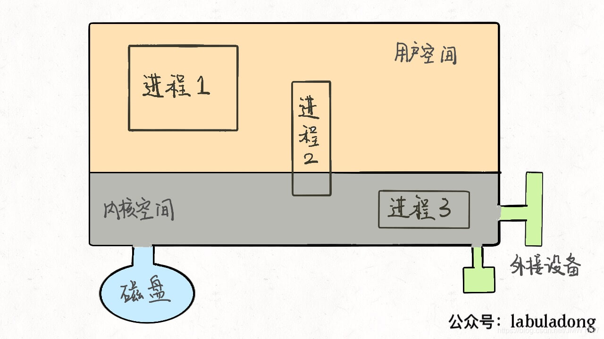

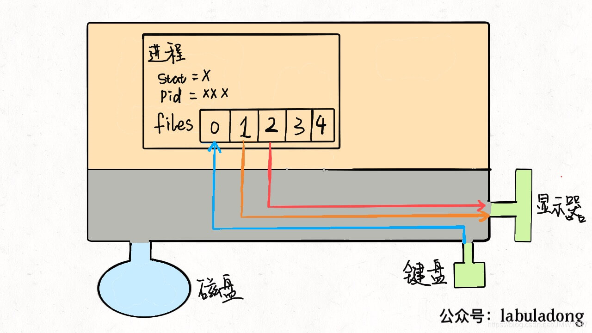


对于一般的计算机，`输入流是键盘`，`输出流是显示器`，`错误流也是显示器`，所以现在这个进程和内核连了三根线。因为==硬件都是由内核管理的==，我们的进程需要通过「==系统调用==」让==内核进程==访问硬件资源。

如果我们写的程序需要其他资源，比如打开一个文件进行读写，这也很简单，进行系统调用，让内核把文件打开，这个文件就会被放到files的第 4 个位置：

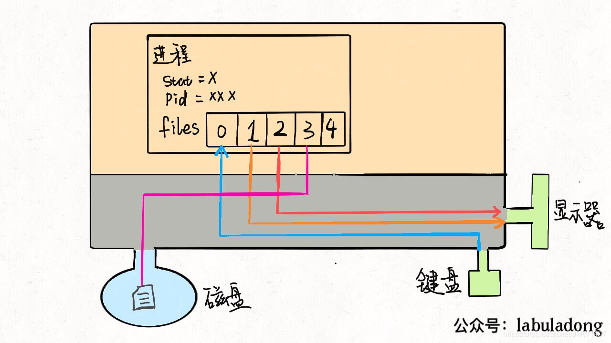


明白了这个原理，`输入重定向`就很好理解了，程序想读取数据的时候就会去`files[0]读取`，所以我们只要把`files[0]指向一个文件`，那么程序就会从这个文件中读取数据，而不是从键盘：

```css
$ command < file.txt
```

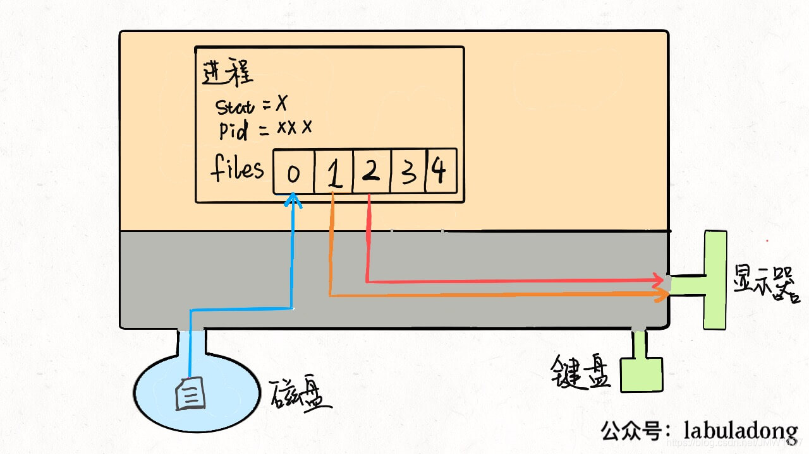

同理，==输出重定向==就是把`files[1]指向一个文件`，那么程序的输出就不会写入到显示器，而是写入到这个文件中：

```css
$ command > file.txt
```

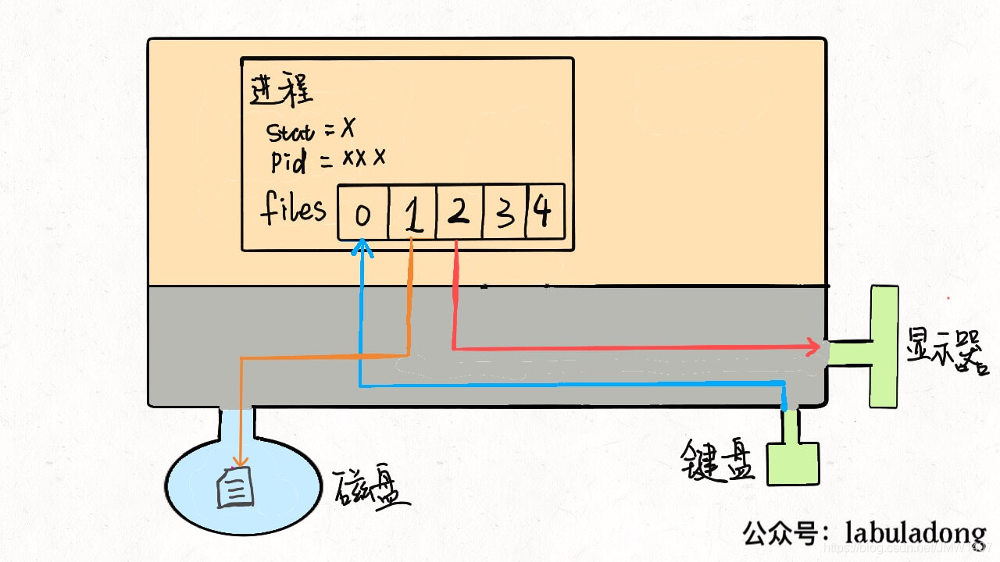


==管道符==其实也是异曲同工，把`一个进程的输出流`和`另一个进程的输入流`接起一条「管道」，数据就在其中传递，不得不说这种设计思想真的很优美：

```css
$ cmd1 | cmd2 | cmd3
```

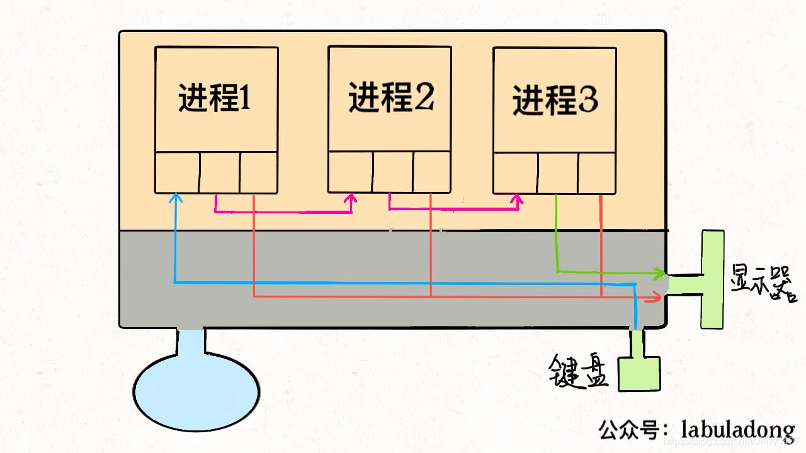


### 4、与fd相关的内核维护的3个数据结构

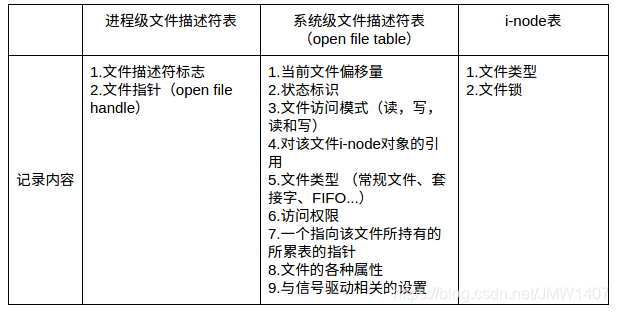


- **进程级文件描述符表(file descriptor table)**

​      系统为每个进程维护一份文件描述符表，该表的每一个条目都记录了单个文件描述符的相关信息，包括：

1. 控制标志(flags)，目前内核仅定义了一个，即close-on-exec
2. 打开文件描述体指针

- **系统级打开文件表(open file table)**

内核对所有打开的文件维护一个系统级别的打开文件描述表(open file description table)。表中的条目称为打开文件描述体(open file description)，存储了与一个打开的文件相关的全部信息，包括：

1. 文件偏移量(current file offset)，调用read()和write()更新，调用lseek()直接修改
2. 访问模式（file status flags），由open()调用设置，例如：只读、只写或读写等
3. i-node对象指针（v-node ptr），指向一个inode元素，从而关联物理文件

- **文件系统i-node表(i-node table)**

就像进程用pid来描述和定位一样，在linux系统中，文件使用inode号来描述，inode存储了文件的很多元信息。
每个文件系统会为存储于其上的所有文件(包括目录)维护一个i-node表，单个i-node包含以下信息：

- 文件类型(file type)，可以是常规文件、目录、套接字或FIFO
- 文件的字节数
- 文件拥有者的User ID 文件的Group ID
- 文件的读、写、执行权限
- 文件的时间戳，共有三个：ctime指inode上一次变动的时间，mtime指文件内容上一次变动的时间，atime指文件上一次打开的时间。
- 链接数，即有多少文件名指向这个inode
- 文件数据block的位置


**3个数据结构对应关系**

1. 应用程序进程拿到的文件描述符ID ，等于拿到 进程文件描述符表的索引；
2. 通过索引拿到文件指针，指向系统级文件描述符表的文件偏移量；
3. 再通过文件偏移量找到inode指针，最终对应到真实的文件

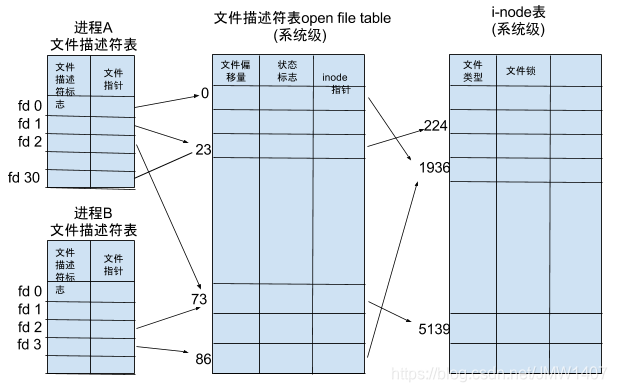


以上图为例进行简单实例说明：
1、在进程A中，文件描述符1和30都指向了同一个打开的文件句柄（标号23）。这可能是通过调用dup()、dup2()、fcntl()或者对同一个文件多次调用了open()函数而形成的。
2、进程A的文件描述符2和进程B的文件描述符2都指向了同一个打开的文件句柄（标号73）。这种情形可能是：
在调用fork()后出现的（即，进程A、B是父子进程关系），
或者当某进程通过UNIX域套接字将一个打开的文件描述符传递给另一个进程时，也会发生。
再者是不同的进程独自去调用open函数打开了同一个文件，此时文件描述符相同。
3、进程A的描述符0和进程B的描述符3分别指向不同的打开文件句柄，但这些句柄均指向i-node表的相同条目（1976），换言之，指向同一个文件。发生这种情况是因为每个进程各自对同一个文件发起了open()调用。同一个进程两次打开同一个文件，也会发生类似情况。


### 5、socket 和 文件描述符之间的关系

套接字也是文件。具体数据传输流程如下：

1. 当server端监听到有连接时，应用程序会请求内核创建Socket；

2. Socket创建好后会返回一个文件描述符给应用程序；

3. 当有数据包过来网卡时，内核会通过数据包的==源端口，源ip，目的端口==等在内核维护的一个==ipcb双向链表==中找到对应的Socket，并将数据包赋值到该==Socket的缓冲区==；

4. 应用程序请求读取Socket中的数据时，内核就会将数据拷贝到应用程序的内存空间，从而完成读取Socket数据


注意：
操作系统针对不同的传输方式（TCP，UDP）会在内核中各自维护一个Socket双向链表，当数据包到达网卡时，会根据数据包的源端口，源ip，目的端口从对应的链表中找到其对应的Socket，并会将数据拷贝到Socket的缓冲区，等待应用程序读取。

## 信号

[什么是信号（signal）？信号的处理机制？利用信号进行简单的进程通信过程设计（c++）?_c++收到一个signal做下一步处理-CSDN博客](https://blog.csdn.net/JMW1407/article/details/107737137)


## 虚拟内存

参考：[一步一图带你深入理解 Linux 虚拟内存管理](https://mp.weixin.qq.com/s?__biz=Mzg2MzU3Mjc3Ng==&mid=2247486732&idx=1&sn=435d5e834e9751036c96384f6965b328&chksm=ce77cb4bf900425d33d2adfa632a4684cf7a63beece166c1ffedc4fdacb807c9413e8c73f298&scene=178&cur_album_id=2559805446807928833#rd)


**数据段**：那些在代码中被我们指定了初始值的全局变量和静态变量在虚拟内存空间中的存储区域我们叫做数据段。

**BSS段**：那些没有指定初始值的全局变量和静态变量在虚拟内存空间中的存储区域我们叫做 BSS 段。这些未初始化的全局变量被加载进内存之后会被初始化为 0 值。

**堆**：上面介绍的这些全局变量和静态变量都是在编译期间就确定的，但是我们程序在运行期间往往需要动态的申请内存，所以在虚拟内存空间中也需要一块区域来存放这些动态申请的内存，这块区域就叫做堆。注意这里的堆指的是 OS 堆并不是 JVM 中的堆。

**文件映射与匿名映射区**：我们的程序在运行过程中还需要依赖动态链接库，这些动态链接库以 .so 文件的形式存放在磁盘中，比如 C 程序中的 glibc，里边对系统调用进行了封装。glibc 库里提供的用于动态申请堆内存的 malloc 函数就是对系统调用 sbrk 和 mmap 的封装。这些动态链接库也有自己的对应的代码段，数据段，BSS 段，也需要一起被加载进内存中。

还有用于内存文件映射的系统调用 mmap，会将文件与内存进行映射，那么映射的这块内存（虚拟内存）也需要在虚拟地址空间中有一块区域存储。

这些动态链接库中的代码段，数据段，BSS 段，以及通过 mmap 系统调用映射的共享内存区，在虚拟内存空间的存储区域叫做文件映射与匿名映射区。

栈：们在程序运行的时候总该要调用各种函数吧，那么调用函数过程中使用到的局部变量和函数参数也需要一块内存区域来保存。这一块区域在虚拟内存空间中叫做栈。


## 存储方式

### 分页存储管理方式

在该方式中，将用户程序的地址空间分为若干个固定大小的区域，称为”页“或”页面“。典型的页面大小为1KB。相应的，也将内存空间分为若干个物理块或页框（frame），页和块的大小相同。这样可将用户程序的任一页放入任一物理块中，实现了离散分配。

### 分段存储管理方式

这是为了满足用户要求而形成的一种存储管理方式。它把用户程序的地址空间分为若干个大小不同的段，每段可定义一组相对完整的信息。在存储器分配时，以段为单位，这些段在内存中可以不相邻接，所以也同样实现了离散分配。

### 段页式存储管理方式

这是分页和分段两种存储管理方式相结合的产物。它同时具有两者的优点，是目前应用较为广泛的一种存储管理方式。


## 调度

在传统OS中，调度包括作业调度和进程调度两步。

### 作业调度


### 进程调度


## 微内核和大内核


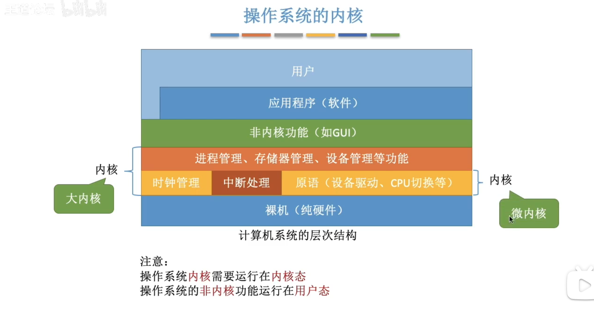

只保留【时钟管理】、【中断处理】、和【原语（设备驱动、cpu切换等）】称为==微内核==。

微内核+【进程管理、存储器管理、设备管理等】称为==大内核==。

