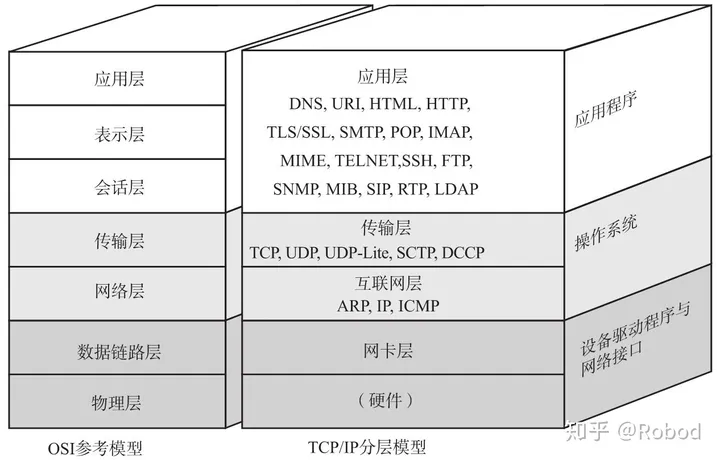
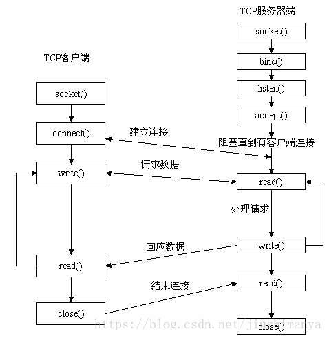

## 网络通信

### TCP通信协议

**传输控制协议（TCP，Transmission Control Protocol）是一种面向连接的、可靠的、基于字节流的传输层通信协议**

### UDP通信协议

## tcp中socket连接方式

### bind()函数
正如上面所说bind()函数把一个地址族中的特定地址赋给socket。例如对应AF_INET、AF_INET6就是把一个ipv4或ipv6地址和端口号组合赋给socket。

**基于TCP的socket**

**服务器端程序**

（1）、创建一个socket，用函数socket()

（2）、绑定IP地址、端口等信息到socket上，用函数bind()

（3）、设置允许的最大连接数，用函数listen()

（4）、接收客户端上来的连接，用函数accept()

（5）、收发数据，用函数send()和recv()，或者read()和write()

（6）、关闭网络连接

**客户端程序：**

（1）、创建一个socket，用函数socket()

（2）、设置要连接的对方的IP地址和端口等属性

（3）、连接服务器，用函数connect()

（4）、收发数据，用函数send()和recv()，或read()和write()

（5）、关闭网络连接

