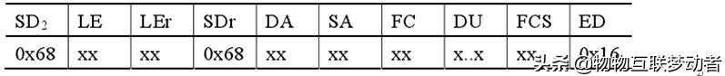

## wireshark使用


首先说几个最常用的关键字，“eq” 和 “==”等同，可以使用 “and” 表示并且，“or”表示或者。“!" 和 "not” 都表示取反。


　　一、针对wireshark最常用的自然是针对IP地址的过滤。其中有几种情况：

　　（1）对源地址为192.168.0.1的包的过滤，即抓取源地址满足要求的包。

　　     表达式为：ip.src == 192.168.0.1

　　（2）对目的地址为192.168.0.1的包的过滤，即抓取目的地址满足要求的包。

　　     表达式为：ip.dst == 192.168.0.1

　　（3）对源或者目的地址为192.168.0.1的包的过滤，即抓取满足源或者目的地址的ip地址是192.168.0.1的包。

　　     表达式为：ip.addr == 192.168.0.1,或者 ip.src == 192.168.0.1 or ip.dst == 192.168.0.1

　　（4）要排除以上的数据包，我们只需要将其用括号囊括，然后使用 "!" 即可。

　　     表达式为：!(表达式)

 

　　二、针对协议的过滤

　　（1）仅仅需要捕获某种协议的数据包，表达式很简单仅仅需要把协议的名字输入即可。

​         表达式为：http

　　（2）需要捕获多种协议的数据包，也只需对协议进行逻辑组合即可。

　　     表达式为：http or telnet （多种协议加上逻辑符号的组合即可）

　　（3）排除某种协议的数据包

　　     表达式为：not arp    !tcp

 

　　三、针对端口的过滤（视协议而定）

　　（1）捕获某一端口的数据包

　　     表达式为：tcp.port == 80

　　（2）捕获多端口的数据包，可以使用and来连接，下面是捕获高端口的表达式

　　     表达式为：udp.port >= 2048

 

　　四、针对长度和内容的过滤

　　（1）针对长度的过虑（这里的长度指定的是数据段的长度）

　　     表达式为：udp.length < 30  http.content_length <=20

　　（2）针对数据包内容的过滤

　　　　  表达式为：http.request.uri matches "vipscu"  （匹配http请求中含有vipscu字段的请求信息）


## 网络通信


### TCP通信协议

**传输控制协议（TCP，Transmission Control Protocol）是一种面向连接的、可靠的、基于字节流的传输层通信协议**

### UDP通信协议


## TCP


```c
//客户端程序  启动方式 ./client ip地址
#include<stdio.h>
#include <sys/types.h>          /* See NOTES */
#include <sys/socket.h>
#include<string.h>
#include <netinet/in.h>
#include <arpa/inet.h>
#include <unistd.h>

/* socket
*  connect
*  send/recv
*/
#define SERVER_PORT 8888

int main(int argc, char** argv)
{
	int iSocketClient;
	struct sockaddr_in tSocketSeverAddr;
	int iRet;
	unsigned char ucSendBuf[1000];
	int iSendLen;
	
	if(argc != 2)
	{
		printf("Usage:\n");
		printf("%s <server_ip>\n", argv[0]);
		return -1;
	}
	
	iSocketClient = socket(AF_INET, SOCK_STREAM, 0); // AF_INET表示Tcp连接，SOCK_STREAM表示稳定的连接
	if(iSocketClient == -1)
	{
		printf("socket is error!\n");
		return -1;
	}
	
	tSocketSeverAddr.sin_family = AF_INET;
	tSocketSeverAddr.sin_port 	 = htons(SERVER_PORT); //htons to net
	if(0 == inet_aton(argv[1], &tSocketSeverAddr.sin_addr))
	{
		printf("invalid IP\n");
		return -1;
	}
	//tSocketSeverAddr.sin_addr.s_addr = INADDR_ANY;
	memset(tSocketSeverAddr.sin_zero, 0, 8);
	iRet = connect(iSocketClient, (const struct sockaddr *)&tSocketSeverAddr,sizeof(struct sockaddr));
	if(-1 == iRet)
	{
		printf("connect error!\n");
		return -1;
	}
	
	while(1)
	{
		if(fgets(ucSendBuf,999,stdin))
		{
			iSendLen = send(iSocketClient, ucSendBuf, strlen(ucSendBuf), 0);
			if(iSendLen <= 0)
			{
				close(iSocketClient);
				printf("send is error!\n");
				return -1;
			}
		}
		
	}
	return 0;
}
```


```C
//服务器程序
#include<stdio.h>
#include <sys/types.h>          /* See NOTES */
#include <sys/socket.h>
#include<string.h>
#include <netinet/in.h>
#include <arpa/inet.h>
#include <unistd.h>
#include <signal.h>


/* socket
* bind
* listen
* accept
* send/recv
*/
#define SERVER_PORT 8888
#define BACKLOG		10   //最大监听数
int main(int argc, char** argv)
{
	int iSocketServer;
	int iRet;
	int iSocketClient;
	int iAddrLen;
	struct sockaddr_in tSocketServerAddr;
	struct sockaddr_in tSocketClientAddr;
	
	unsigned char ucRecvBuf[1000];
	int iRecvLen;
	int iClientNum = -1;
	int sockaddrLen;
	
	signal(SIGCHLD, SIG_IGN); //防止关闭进程之后出现僵尸进程
	
	iSocketServer = socket(AF_INET, SOCK_STREAM, 0); // AF_INET表示Tcp连接，SOCK_STREAM表示稳定的连接
	if(iSocketServer == -1)
	{
		printf("socket is error!\n");
		return -1;
	}
	
	tSocketServerAddr.sin_family = AF_INET;
	tSocketServerAddr.sin_port 	 = htons(SERVER_PORT); //htons to net
	tSocketServerAddr.sin_addr.s_addr = INADDR_ANY;
	printf("%x\n",tSocketServerAddr.sin_port);
	printf("%d\n",tSocketServerAddr.sin_port);
	memset(tSocketServerAddr.sin_zero, 0, 8);
	iRet = bind(iSocketServer, (const struct sockaddr *)&tSocketServerAddr, sizeof(struct sockaddr));
	if(-1 == iRet)
	{
		printf("bind error!\n");
		return -1;
	}		
	
	iRet = listen(iSocketServer, BACKLOG);
	if(-1 == iRet)
	{
		printf("listen error!\n");
		return -1;
	}	
	
	while(1)
	{
		sockaddrLen = sizeof(struct sockaddr);
		iSocketClient = accept(iSocketServer, (struct sockaddr *)&tSocketClientAddr, &sockaddrLen);
		if(-1 != iSocketClient)
		{
			iClientNum++;
			printf("Get connect from %s\n", inet_ntoa(tSocketClientAddr.sin_addr));
			//inet_ntoa()将网络端口转换为assic码
			if(!fork())
			{
				/*子进程*/
				while(1)
				{
					/*接收客户端发来的数据并显示出来*/
					iRecvLen = recv(iSocketClient, ucRecvBuf, 999, 0);
					if(iRecvLen <= 0)
					{
						close(iSocketClient);
						return -1;
					}
					else
					{
						ucRecvBuf[iRecvLen] = '\0';
						printf("Get Msg From Client %d: %s\n", iClientNum,ucRecvBuf);
					}
				}
			}
		}
	}
	close(iSocketServer);
	return 0;
}

```


## UDP


```C
//客户端程序
#include<stdio.h>
#include <sys/types.h>          /* See NOTES */
#include <sys/socket.h>
#include<string.h>
#include <netinet/in.h>
#include <arpa/inet.h>
#include <unistd.h>

/* socket
*  connect
*  send/recv
*/
#define SERVER_PORT 8888

int main(int argc, char** argv)
{
	int iSocketClient;
	struct sockaddr_in tSocketSeverAddr;
	int iRet;
	unsigned char ucSendBuf[1000];
	int iSendLen;
	int iAddrLen;
	
	if(argc != 2)
	{
		printf("Usage:\n");
		printf("%s <server_ip>\n", argv[0]);
		return -1;
	}
	
	iSocketClient = socket(AF_INET, SOCK_DGRAM, 0); // AF_INET表示Tcp连接，SOCK_STREAM表示稳定的连接
	if(iSocketClient == -1)
	{
		printf("socket is error!\n");
		return -1;
	}
	
	tSocketSeverAddr.sin_family = AF_INET;
	tSocketSeverAddr.sin_port 	 = htons(SERVER_PORT); //htons to net
	if(0 == inet_aton(argv[1], &tSocketSeverAddr.sin_addr))
	{
		printf("invalid IP\n");
		return -1;
	}
	//tSocketSeverAddr.sin_addr.s_addr = INADDR_ANY;
	memset(tSocketSeverAddr.sin_zero, 0, 8);
	

	while(1)
	{
		if(fgets(ucSendBuf,999,stdin))
		{

			iAddrLen = sizeof(struct sockaddr);
			iSendLen = sendto(iSocketClient, ucSendBuf, strlen(ucSendBuf), 0,
                      (const struct sockaddr *)&tSocketSeverAddr, iAddrLen);

			if(iSendLen <= 0)
			{
				close(iSocketClient);
				printf("send is error!\n");
				return -1;
			}
		}
		
	}
	return 0;
}
```


```C
//服务器程序
#include<stdio.h>
#include <sys/types.h>          /* See NOTES */
#include <sys/socket.h>
#include<string.h>
#include <netinet/in.h>
#include <arpa/inet.h>
#include <unistd.h>
#include <signal.h>


/* socket
* bind
* sendto/recvfrom
*/
#define SERVER_PORT 8888

int main(int argc, char** argv)
{
	int iSocketServer;
	int iRet;
	int iSocketClient;
	int iAddrLen;
	struct sockaddr_in tSocketServerAddr;
	struct sockaddr_in tSocketClientAddr;
	
	unsigned char ucRecvBuf[1000];
	int iRecvLen;
	int iClientNum = -1;
	int sockaddrLen;
	
	signal(SIGCHLD, SIG_IGN); //防止关闭进程之后出现僵尸进程
	
	iSocketServer = socket(AF_INET, SOCK_DGRAM, 0); // AF_INET表示Tcp连接，SOCK_STREAM表示稳定的连接
	if(iSocketServer == -1)
	{
		printf("socket is error!\n");
		return -1;
	}
	
	tSocketServerAddr.sin_family = AF_INET;
	tSocketServerAddr.sin_port 	 = htons(SERVER_PORT); //htons to net
	tSocketServerAddr.sin_addr.s_addr = INADDR_ANY;
	memset(tSocketServerAddr.sin_zero, 0, 8);
	iRet = bind(iSocketServer, (const struct sockaddr *)&tSocketServerAddr, sizeof(struct sockaddr));
	if(-1 == iRet)
	{
		printf("bind error!\n");
		return -1;
	}		
	
	while(1)
	{
		iAddrLen = sizeof(struct sockaddr);
		iRecvLen = recvfrom(iSocketServer, ucRecvBuf, 999, 0,
                        (struct sockaddr *)&tSocketClientAddr, &iAddrLen);
		if(iRecvLen >=0 )
		{
			ucRecvBuf[iRecvLen] = '\0';
			printf("Get Msg From %s : %s\n", inet_ntoa(tSocketClientAddr.sin_addr), ucRecvBuf);
		}

	}
	close(iSocketServer);
	return 0;
}

```

## 虚拟网卡


## tcp中socket连接方式


### bind()函数
正如上面所说bind()函数把一个地址族中的特定地址赋给socket。例如对应AF_INET、AF_INET6就是把一个ipv4或ipv6地址和端口号组合赋给socket。

**基于TCP的socket**

**服务器端程序**

（1）、创建一个socket，用函数socket()

（2）、绑定IP地址、端口等信息到socket上，用函数bind()

（3）、设置允许的最大连接数，用函数listen()

（4）、接收客户端上来的连接，用函数accept()

（5）、收发数据，用函数send()和recv()，或者read()和write()

（6）、关闭网络连接

**客户端程序：**

（1）、创建一个socket，用函数socket()

（2）、设置要连接的对方的IP地址和端口等属性

（3）、连接服务器，用函数connect()

（4）、收发数据，用函数send()和recv()，或read()和write()

（5）、关闭网络连接


## NAT


## IP地址

（1）P地址由[网络地址](https://baike.baidu.com/item/网络地址/9765459?fromModule=lemma_inlink)和[主机地址](https://baike.baidu.com/item/主机地址/9765500?fromModule=lemma_inlink)两部分组成。

（2）[子网掩码](https://baike.baidu.com/item/子网掩码/100207?fromModule=lemma_inlink)与IP地址一样都是32位的，并且这两者是[一一对应](https://baike.baidu.com/item/一一对应/18877366?fromModule=lemma_inlink)的，子网掩码中“1”对应IP地址中的网络地址，“0”对应的是主机地址，网络地址和主机地址就构成了一个完整的IP地址。

（3）计算机之间的通信只能在具有相同网络地址的IP地址之间进行，如果想要与其他网段的计算机进行通信，则必须经过路由器转发出去。

（4）不同网络地址的IP地址是不能直接通信的，即便它们距离非常近，也不能进行通信。路由器的多个端口可以连接多个[网段](https://baike.baidu.com/item/网段/11026985?fromModule=lemma_inlink)，每个端口的IP地址的网络地址都必须与所连接的网段的网络地址一致。不同的端口它的网络地址是不同的，所对应的网段也是不同的，这样才能使各个网段中的主机通过自己网段的IP地址把[数据发送](https://baike.baidu.com/item/数据发送/22124759?fromModule=lemma_inlink)到路由器上。

## MAC地址

MAC（Media Access Control，介质访问控制）地址，也叫硬件地址，长度是48比特（6字节），由16进制的数字组成，分为前24位和后24位：
**前24位叫做组织唯一标志符**（Organizationally Unique Identifier，即OUI），是由IEEE的注册管理机构给不同厂家分配的代码，区分了不同的厂家。 

**后24位**是由厂家自己分配的，称为**扩展标识符**。同一个厂家生产的网卡中MAC地址后24位是不同的。
MAC地址对应于OSI参考模型的第二层数据链路层，工作在数据链路层的交换机维护着计算机MAC地址和自身端口的数据库，交换机根据收到的数据帧中的“目的MAC地址”字段来转发数据帧。

[链路层](https://zhida.zhihu.com/search?content_id=228616441&content_type=Article&match_order=1&q=链路层&zhida_source=entity)，又称 MAC 层。MAC 的全称为 Medium Access Control，即[媒体访问控制](https://zhida.zhihu.com/search?content_id=228616441&content_type=Article&match_order=1&q=媒体访问控制&zhida_source=entity)，主要有两个功能，**寻址和控制**。

1. **寻址，即如何找到数据包接收方**
2. **控制，即谁先发、谁后发，发送出现问题如何处理**

### **解决“控制”问题**

在以太网中，两个节点间传输的数据最终都会转换成电信号，在物理传输介质上发送出去。物理传输介质肯定是共享的，在发送数据时需要考虑谁先发、谁后发、同时发送时怎么避免冲突、出现问题怎么处理等。**这就是[多路访问](https://zhida.zhihu.com/search?content_id=228616441&content_type=Article&match_order=1&q=多路访问&zhida_source=entity)问题，即如何协调多个发送和接收节点对单一共享[广播信道](https://zhida.zhihu.com/search?content_id=228616441&content_type=Article&match_order=1&q=广播信道&zhida_source=entity)的访问。**计算机网络使用[多路访问协议](https://zhida.zhihu.com/search?content_id=228616441&content_type=Article&match_order=1&q=多路访问协议&zhida_source=entity)来规范它们在共享的广播信道上的传输行为。

**多路访问协议**

我们可以先来思考一下，理想情况下在共享信道上期望怎么传输数据。

1. 如果只有一个节点需要发送数据，那么我们期望它可以以整个信道的速率 R 发送数据
2. 如果有 M 个节点需要同时发送数据，那么我们期望它可以以（信道的传输速率 R / M）来发送数据

**规划车道 ➡️ 信道划分协议 Channel Partitioning Protocol**

采用[多路复用技术](https://zhida.zhihu.com/search?content_id=228616441&content_type=Article&match_order=1&q=多路复用技术&zhida_source=entity)，将链路、网络资源（如带宽）划分为“资源片”，将“资源片”分配给各路通信，每路通信**独占**其分配到的资源片进行通信。这样的划分方式，可以满足理想情况 2。

**依次排队** ➡️ **轮转协议 Taking-turns Protocol**

多个节点轮流发送数据。当只有一个结点活跃时，以信道的全部发送速率 R 发送；当有M个结点活跃时，每个活跃结点的吞吐量接近 R/M。完全满足理想情况 1，几乎满足理想情况 2。

**随机应变** ➡️ **[随机访问协议](https://zhida.zhihu.com/search?content_id=228616441&content_type=Article&match_order=1&q=随机访问协议&zhida_source=entity) Random Access Protocol**

节点总是以信道的全部速率发送数据，传输时可能且允许出现冲突。当检测到冲突时通过延时重传等方式恢复，**这也是以太网使用的方式。**完全满足理想情况 1，几乎满足理想情况 2。

在轮转协议和随机访问协议中，好像都可以满足理想情况。那为什么以太网使用的说随机访问协议而不是轮转协议呢？主要有以下三个原因

1. **网络架构更简单**，所有设备都可以同时发送和[接收数据](https://zhida.zhihu.com/search?content_id=228616441&content_type=Article&match_order=1&q=接收数据&zhida_source=entity)，不需要等待其他设备的轮转时机
2. **更加灵活和高效**，随机访问协议允许多个设备同时发送数据，不需要进行时间调度或协调
3. **[可扩展性](https://zhida.zhihu.com/search?content_id=228616441&content_type=Article&match_order=1&q=可扩展性&zhida_source=entity)高**，新设备可以随时连接到网络，并立即开始发送和接收数据，不需要调度或配置

### 解决“寻址”问题

MAC 地址是指[网络设备](https://zhida.zhihu.com/search?content_id=228616441&content_type=Article&match_order=1&q=网络设备&zhida_source=entity)的硬件地址，是由网络设备的制造商烧录在设备的网卡中的一个全球唯一的地址，如果一台设备有多个网卡，则每个网卡都需要并会有一个唯一的 MAC 地址。MAC 地址共 48 位（6个字节），以[十六进制](https://zhida.zhihu.com/search?content_id=228616441&content_type=Article&match_order=1&q=十六进制&zhida_source=entity)表示。

当数据传输时，源设备会根据目标设备的 MAC 地址 “寻址” ，确保数据能够被正确地传送到目标设备。当设备接收到数据后，如果发现目的地址与本地 MAC 地址不一致，则会丢弃，只有真正的目标设备才会接收并处理收到的数据。

MAC 地址是一个局域网（LAN）范围内的地址，它只在局域网中起作用，不能直接进行跨[网络通信](https://zhida.zhihu.com/search?content_id=228616441&content_type=Article&match_order=1&q=网络通信&zhida_source=entity)。在局域网中，可以通过交换机（Switch）来完成数据的传输。交换机通过学习和记录连接到它的设备的 MAC 地址，根据 MAC 地址来决定数据的转发。而在互联网中，数据通常是通过路由器（Router）等设备进行转发，而不是根据 MAC 地址进行直接传输。

IP地址工作在TCP/IP参考模型的第三层网络层。

 `IP地址 ` 专注于网络层，将数据包从一个网络转发到另外一个网络；

而` MAC地址 `专注于`数据链路层`，将一个数据帧从一个节点传送到相同链路的另一个节点。

定位网络中的计算机的位置，最常用的有**域名地址**、**Ip地址**、**MAC地址**三种方式，它们分别对应于OSI模型中的**应用层**、**网络层**、**数据链接层**。通常IP地址是不断变化的，而MAC地址是计算机的物理网卡唯一对应的地址，好比每个人都有唯一对应的身份证号码一样具有唯一性。


## MAC地址与IP地址的区别

1. **层次不同**：MAC地址用于数据链路层，IP地址用于网络层。
2. **作用不同**：MAC地址标识**网络接口**，IP地址标识**网络位置**。
3. **范围不同**：MAC地址**在局域网中唯一**，IP地址**在整个互联网中唯一**。


## 网关 路由器 交换机

**传输层(网关)
网络层(路由器)
数据链路层(网桥，交换机)
物理层(中继器，集线器)**


## 路由器

路由器的作用

路由器是连接多个网络的设备，主要功能是数据包的转发和路由选择。路由器根据目标IP地址，将数据包从一个网络转发到另一个网络。它在家庭、企业和ISP中广泛使用，确保不同网络之间的通信。

路由表和路由协议

路由器使用路由表和路由协议来确定数据包的最佳传输路径。

1. **路由表**：存储网络的路径信息，包括目标网络、下一跳地址和度量值。路由器根据路由表选择数据包的转发路径。
2. **路由协议**：用于动态更新路由表，确保网络路径信息的及时性和准确性。常见的路由协议包括：

- **RIP（Routing Information Protocol）**：一种基于距离矢量的路由协议，使用跳数作为度量值，适用于小型网络。
- **OSPF（Open Shortest Path First）**：一种链路状态路由协议，使用Dijkstra算法计算最短路径，适用于大型网络。
- **BGP（Border Gateway Protocol）**：用于自治系统（AS）之间的路由选择，是互联网的核心路由协议。


位于第三层（网络层），提供**路由**与**转发**两种重要机制。

**路由：**路由器控制层面的工作，决定数据包从来源端到目的端所经过的路由路径（host到host至今的最佳传输路径）

**转发：**路由器数据层面的工作，将路由器输入端的数据包移送至适当的路由器输出端（在路由器内部进行）


​										路由器结构

路由器内部整体分为两部分：路由选择部分、分组转发部分
路由选择部分：软件、控制层面、核心是路由选择处理机
分组转发部分：硬件、数据层面、核心是处理芯片和交换结构


## 交换机

**交换机的作用**

交换机是一种用于局域网中的网络设备，主要功能是数据帧的转发和交换。交换机根据MAC地址表，将数据帧从源设备转发到目标设备，提高网络的效率和性能。

**交换机的工作原理**

交换机工作在数据链路层，通过以下步骤处理数据帧：

1. 接收数据帧并读取源MAC地址和目标MAC地址。

2. 根据源MAC地址更新MAC地址表。

3. 查找目标MAC地址对应的端口，如果存在，则将数据帧转发到该端口；如果不存在，则进行广播。

## VLAN（虚拟局域网）

VLAN是一种将物理网络划分为多个逻辑网络的技术，每个VLAN具有独立的广播域。通过VLAN，网络管理员可以提高网络的安全性和管理效率。VLAN可以基于端口、MAC地址或协议进行划分。

## 端口

a. 端口的作用就是给运行的应用程序提供传输数据的通道。

b. 端口号的作用是用来区分和管理不同端口的，通过端口号能找到唯一个的一个端口。

c. 端口号可以分为两类： 知名端口号 和 动态端口号

> 知名端口号的范围是0到1023
> 动态端口号的范围是1024到65535


**按照协议类型分类**：按协议类型划分可分为TCP端口、UDP端口、IP端口、ICMP。

1. **TCP端口**：即传输控制协议端口，需要在客户端和服务器之间建立连接，这样可以提供可靠的数据传输。常见的包括FTP的21端口，Telnet的23端口，SMTP的25端口，HTTP的80端口。
2. **UDP端口**：即用户数据报协议端口，无需在客户端和服务器端建立连接，安全性得不到保障。常见的DNS的53端口，SNMP（简单网络管理协议）的161端口，QQ使用的8000和4000端口。
3. **保留端口**：UNIX有保留端口号的概念，只有超级用户特权的进程才允许给它自己分配一个保留端口号。这些端口号介于1~1023之间，一些应用程序将它作为客户与服务器认证的一部分。

**端口使用的注意事项**

1. 不要使用端口号小于1024的端口。
2. 端口号一般习惯为4位整数，在同一台计算机上端口号不能重复，否则，会产生端口号冲突。 
3. 客户端端口号因存在时间很短暂又称临时端口号，大多数TCP/IP实现给临时端口号分配1024---5000之间的端口号。大于5000的端口号是为其他服务器预留的 。


常见端口

| 端口 | 服务                                          | 说明                                                         |
| ---- | --------------------------------------------- | ------------------------------------------------------------ |
| 0    | Reserved                                      |                                                              |
| 21   | FTP                                           |                                                              |
| 22   | ssh                                           |                                                              |
| 23   | Telnet                                        | 远程登录                                                     |
| 25   | SMTP                                          | MTP服务器所开放的端口，用于发送邮件。                        |
| 53   | Domain Name Server（DNS）                     | DNS服务器所开放的端口                                        |
| 80   | HTTP                                          | 用于网页浏览                                                 |
| 88   | UDP -Kerberos 协议                            | Kerberos 协议是一种基于密钥分发模型的网络身份验证方法。该协议使在网络上进行通信的实体能够证明彼此的身份，同时该协议可以阻止窃听或重放攻击。 |
| 102  | Message transfer agent(MTA)-X.400 over TCP/IP | 消息传输代理。                                               |
| 109  | Post Office Protocol -Version3                | POP3服务器开放此端口，用于接收邮件，客户端访问服务器端的邮件服务。 |
| 443  | Https                                         | 网页浏览端口，能提供加密和通过安全端口传输的另一种HTTP。     |
|      |                                               |                                                              |
|      |                                               |                                                              |
|      |                                               |                                                              |
|      |                                               |                                                              |
|      |                                               |                                                              |
|      |                                               |                                                              |
|      |                                               |                                                              |
|      |                                               |                                                              |

**源端口号** 和 **目的端口号**

## 防火墙

**防火墙的定义和作用**

防火墙是一种网络安全设备，用于监控和控制进出网络的数据流量。防火墙通过设置规则，允许或拒绝数据包，保护网络免受未经授权的访问和网络攻击。

**防火墙类型**

1. 包过滤防火墙：根据数据包的源IP地址、目标IP地址、端口号和协议类型，决定是否允许数据包通过。

2. 代理防火墙：充当客户端和服务器之间的中介，检查和过滤应用层数据。

3. 状态检测防火墙：跟踪连接状态，基于连接状态和规则，允许或拒绝数据包。

## 现代网络设备

**负载均衡器**

负载均衡器是一种分布网络流量的设备，确保多个服务器之间的负载均匀分配，提高服务的可靠性和性能。

**网关**

网关是连接不同网络的设备，负责协议转换和数据包转发。网关通常用于连接企业网络和互联网。

**VPN设备**

VPN设备用于建立虚拟专用网络，提供安全的远程访问和数据传输。VPN设备包括VPN路由器和VPN客户端软件。


## ModBus

**简介**

Modbus协议是一项应用层报文传输协议，包括Modbus协议是一项应用层报文传输协议，包括**ASCII**、**RTU**、**TCP**三种报文类型。

标准的Modbus协议物理层接口有RS232、RS422、RS485和**以太网**接口，采用**master/slave**方式通信。

### ModBusTCP数据帧

具体参考：[ModbusTCP协议报文详细分析 - 常哥说编程 - 博客园 (cnblogs.com)](https://www.cnblogs.com/xiketang/p/15039286.html)

#### 读取指令

**发送**：

| 事务处理标识 | 协议标识 | 长度  | 单元标识符 | 功能码 | 起始地址高字节 | 起始地址低字节 | 寄存器数量高字节 | 寄存器数量低字节 |
| ------------ | -------- | ----- | ---------- | ------ | -------------- | -------------- | ---------------- | ---------------- |
| 00  00       | 00 00    | 00 06 | 01         | 01     | 00             | 00             | 00               | 0A               |

以控制器作为从站，modbusTCP助手作为主站进行通讯：

ModbusTCP发送：00 00 00 00 00 06 01 02 00 00 00 0A

控制器返回：		  00 00 00 00 00 05 01 01 02 00 00

**应答：**

| 事务处理标识 | 协议标识 | 长度  | 单元标识符 | 功能码 | 字节数 | 寄存器数据高字节 | 寄存器数据低字节 |
| ------------ | -------- | ----- | ---------- | ------ | ------ | ---------------- | ---------------- |
| 00  00       | 00 00    | 00 05 | 01         | 01     | 02     | 00               | 00               |

#### 写指令

##### 单线圈


| 事务处理标识 | 协议标识 | 长度  | 单元标识符 | 功能码 | 线圈高 | 线圈低 | 断通标志 | 断通标志 |
| ------------ | -------- | ----- | ---------- | ------ | ------ | ------ | -------- | -------- |
| 00  00       | 00 00    | 00 06 | 01         | 05     | 00     | AC     | FF       | 00       |


#### 


##### 单寄存器


##### 多线圈


##### 多寄存器


#### 结构

ModbusTCP的数据帧可分为两部分：**MBAP**+**PDU**。

##### ==报文头MBAP==

MBAP为报文头，长度为7字节，组成如下：

| 事务处理标识 | 协议标识 | 长度  | 单元标识符 |
| ------------ | -------- | ----- | ---------- |
| 2字节        | 2字节    | 2字节 | 1字节      |

 

| 内容             | 解释                                                         |
| ---------------- | ------------------------------------------------------------ |
| **事务处理标识** | 可以理解为报文的序列号，一般每次通信之后就要加1以区别不同的通信数据报文。 |
| **协议标识符**   | 00 00表示ModbusTCP协议。                                     |
| **长度**         | 表示接下来的数据长度，单位为字节。                           |
| **单元标识符**   | 可以理解为设备地址。                                         |

##### ==帧结构PDU==

PDU由**功能码+数据**组成。功能码为1字节，数据长度不定，由具体功能决定。

**功能码**

Modbus的操作对象有四种：线圈、离散输入、保持寄存器、输入寄存器。

| 对象       | 含义                                                    |
| ---------- | ------------------------------------------------------- |
| 线圈       | PLC的输出位，开关量，在Modbus中**可读可写**             |
| 离散量     | PLC的输入位，开关量，在Modbus中**只读**                 |
| 输入寄存器 | PLC中只能从模拟量输入端改变的寄存器，在Modbus中**只读** |
| 保持寄存器 | PLC中用于输出模拟量信号的寄存器，在Modbus中**可读可写** |

根据对象的不同，Modbus的功能码有：

| 功能码   | 含义                 |
| -------- | -------------------- |
| **0x01** | **读线圈**           |
| 0x05     | 写单个线圈           |
| **0x0F** | **写多个线圈**       |
| 0x02     | 读离散量输入         |
| 0x04     | 读输入寄存器         |
| **0x03** | **读保持寄存器**     |
| 0x06     | 写单个保持寄存器     |
| **0x10** | **写多个保持寄存器** |

说明更详细的表

| 代码   | 中文名称             | 英文名                  | 位操作/字操作 | 操作数量   |
| ------ | -------------------- | ----------------------- | ------------- | ---------- |
| **01** | **读线圈状态**       | READ COIL STATUS        | 位操作        | 单个或多个 |
| 02     | 读离散输入状态       | READ INPUT STATUS       | 位操作        | 单个或多个 |
| **03** | **读保持寄存器**     | READ HOLDING REGISTER   | 字操作        | 单个或多个 |
| 04     | 读输入寄存器         | READ INPUT REGISTER     | 字操作        | 单个或多个 |
| 05     | 写线圈状态           | WRITE SINGLE COIL       | 位操作        | 单个       |
| 06     | 写单个保持寄存器     | WRITE SINGLE REGISTER   | 字操作        | 单个       |
| **15** | **写多个线圈**       | WRITE MULTIPLE COIL     | 位操作        | 多个       |
| **16** | **写多个保持寄存器** | WRITE MULTIPLE REGISTER | 字操作        | 多个       |

##### ==PDU详细结构==

**0x01：读线圈**

在从站中读1~2000个连续线圈状态，ON=1,OFF=0

- 请求：MBAP 功能码 起始地址H 起始地址L 数量H 数量L（共12字节）
- 响应：MBAP 功能码 数据长度 数据（一个地址的数据为1位）
- 如：在从站0x01中，读取开始地址为0x0002的线圈数据，读0x0008位
  00 01 00 00 00 06 01 01 00 02 00 08
- 回：数据长度为0x01个字节，数据为0x01，第一个线圈为ON，其余为OFF
  00 01 00 00 00 04 01 01 01 01

**0x05：写单个线圈**

将从站中的一个输出写成ON或OFF，0xFF00请求输出为ON,0x000请求输出为OFF

- 请求：MBAP 功能码 输出地址H 输出地址L 输出值H 输出值L（共12字节）
- 响应：MBAP 功能码 输出地址H 输出地址L 输出值H 输出值L（共12字节）
- 如：将地址为0x0003的线圈设为ON
  00 01 00 00 00 06 01 05 00 03 FF 00
- 回：写入成功
  00 01 00 00 00 06 01 05 00 03 FF 00

**0x0F：写多个线圈**

将一个从站中的一个线圈序列的每个线圈都强制为ON或OFF，数据域中置1的位请求相应输出位ON，置0的位请求响应输出为OFF

- 请求：MBAP 功能码 起始地址H 起始地址L 输出数量H 输出数量L 字节长度 输出值H 输出值L
- 响应：MBAP 功能码 起始地址H 起始地址L 输出数量H 输出数量L

**0x02：读离散量输入**

从一个从站中读1~2000个连续的离散量输入状态

- 请求：MBAP 功能码 起始地址H 起始地址L 数量H 数量L（共12字节）
- 响应：MBAP 功能码 数据长度 数据（长度：9+ceil（数量/8））
- 如：从地址0x0000开始读0x0012个离散量输入
  00 01 00 00 00 06 01 02 00 00 00 12
- 回：数据长度为0x03个字节，数据为0x01 04 00，表示第一个离散量输入和第11个离散量输入为ON，其余为OFF
  00 01 00 00 00 06 01 02 03 01 04 00

**0x04：读输入寄存器**

从一个远程设备中读1~2000个连续输入寄存器

- 请求：MBAP 功能码 起始地址H 起始地址L 寄存器数量H 寄存器数量L（共12字节）
- 响应：MBAP 功能码 数据长度 寄存器数据(长度：9+寄存器数量×2)
- 如：读起始地址为0x0002，数量为0x0005的寄存器数据
  00 01 00 00 00 06 01 04 00 02 00 05
- 回：数据长度为0x0A，第一个寄存器的数据为0x0c，其余为0x00
  00 01 00 00 00 0D 01 04 0A 00 0C 00 00 00 00 00 00 00 00

**0x03：读保持寄存器**

从远程设备中读保持寄存器连续块的内容

- 请求：MBAP 功能码 起始地址H 起始地址L 寄存器数量H 寄存器数量L（共12字节）
- 响应：MBAP 功能码 数据长度 寄存器数据(长度：9+寄存器数量×2)
- 如：起始地址是0x0000，寄存器数量是 0x0003
  00 01 00 00 00 06 01 03 00 00 00 03
- 回：数据长度为0x06，第一个寄存器的数据为0x21，其余为0x00
  00 01 00 00 00 09 01 03 06 00 21 00 00 00 00

**0x06：写单个保持寄存器**

在一个远程设备中写一个保持寄存器

- 请求：MBAP 功能码 寄存器地址H 寄存器地址L 寄存器值H 寄存器值L（共12字节）
- 响应：MBAP 功能码 寄存器地址H 寄存器地址L 寄存器值H 寄存器值L（共12字节）
- 如：向地址是0x0000的寄存器写入数据0x000A
  00 01 00 00 00 06 01 06 00 00 00 0A
- 回：写入成功
  00 01 00 00 00 06 01 06 00 00 00 0A

**0x10：写多个保持寄存器**

在一个远程设备中写连续寄存器块（1~123个寄存器）

- 请求：MBAP 功能码 起始地址H 起始地址L 寄存器数量H 寄存器数量L 字节长度 寄存器值（13+寄存器数量×2）
- 响应：MBAP 功能码 起始地址H 起始地址L 寄存器数量H 寄存器数量L（共12字节）
- 如：向起始地址为0x0000，数量为0x0001的寄存器写入数据，数据长度为0x02，数据为0x000F
  00 01 00 00 00 09 01 10 00 00 00 01 02 00 0F
- 回：写入成功
  00 01 00 00 00 06 01 10 00 00 00 01


### ModbusRTU协议


modbusRTU协议例子：

#### **读取寄存器的指令如下：**

（16进制表示）

**发送：**

| 地址码 | 功能码 | 起始地址高字节 | 起始地址低字节 | 寄存器数量高字节 | 寄存器数量低字节 | CRC校验低字节 | CRC校验高字节 |
| ------ | ------ | -------------- | -------------- | ---------------- | ---------------- | ------------- | ------------- |
| 30     | 03     | 00             | 08             | 00               | 01               | 01            | E9            |

寄存器数量表示该指令需要读取的寄存器数量。

**接收：**

| 地址码 | 功能码 | 字节数 | 寄存器数据高字节 | 寄存器数据低字节 | CRC校验低字节 | CRC校验高字节 |
| ------ | ------ | ------ | ---------------- | ---------------- | ------------- | ------------- |
| 30     | 03     | 02     | 27               | AC               | DE            | 0D            |

例如：

发送指令：30 03 00 08 00 01 ==01 E9==

接收		：30 03 02 27 AC DE 0D

**请求：**

| 地址码     | 1字节 | 30    |
| ---------- | ----- | ----- |
| 功能码     | 1字节 | 03    |
| 起始地址   | 2字节 | 00 08 |
| 寄存器数量 | 2字节 | 00 01 |
| CRC校验    | 2字节 | 01 E9 |

**应答：**

| 地址码   | 1字节   | 30    |
| -------- | ------- | ----- |
| 功能码   | 1字节   | 03    |
| 字节数   | 1字节   | 02    |
| 寄存器值 | N*2字节 | 27 AC |
| CRC校验  | 2字节   | DE 0D |
|          |         |       |

CRC校验可通过该网站计算：[CRC（循环冗余校验）在线计算_ip33.com](http://www.ip33.com/crc.html)


#### **写入寄存器的指令如下：**

（16进制表示）

**发送：**

| 地址码 | 功能码 | 起始地址高字节 | 起始地址低字节 | 寄存器数量高字节 | 寄存器数量低字节 | 字节数 | 寄存器数据高字节 | 寄存器数据低字节 | CRC校验低字节 | CRC校验高字节 |
| ------ | ------ | -------------- | -------------- | ---------------- | ---------------- | ------ | ---------------- | ---------------- | ------------- | ------------- |
| 30     | 10     | 00             | 15             | 00               | 01               | 02     | 25               | 80               | E6            | 34            |

修改波特率（9600）（16进制）：301000150001022580E634

**返回：**

| 地址码 | 功能码 | 起始地址高字节 | 起始地址低字节 | 寄存器数量高字节 | 寄存器数量低字节 | CRC校验低字节 | CRC校验高字节 |
| ------ | ------ | -------------- | -------------- | ---------------- | ---------------- | ------------- | ------------- |
| 30     | 10     | 00             | 15             | 00               | 01               | 14            | 2C            |

**请求**

| 地址码     | 1字节   | 30    |
| ---------- | ------- | ----- |
| 功能码     | 1字节   | 10    |
| 起始地址   | 2字节   | 00 15 |
| 寄存器数量 | 2字节   | 00 01 |
| 字节数     | 1字节   | 02    |
| 寄存器值   | N*2字节 | 25 80 |
| CRC校验    | 2字节   | E6 34 |

N-设置的寄存器个数，这里N=1。

**应答**

| 地址码     | 1字节 | 30    |
| ---------- | ----- | ----- |
| 功能码     | 1字节 | 10    |
| 起始地址   | 2字节 | 00 15 |
| 寄存器数量 | 2字节 | 00 01 |
| CRC校验    | 2字节 | 14 2C |


### ModbusTCP助手

 	Slave ID：可以配置从机地址

​    Function：可以配置寄存器/线圈类型

​    Address：可以配置读/写的寄存器/线圈起始地址

​    Quantity：可以配置读/写的寄存器/线圈个数

#### Poll（主站）

功能：

```
01 Read Coils(0x)
02 Read Discrete Inputs(1x)
03 Read Holding Registers(4x)
04 Read Input Registers(3x)
05 Write Single Coil
06 Write Single Register
15 Write Multiple Coils
16 Write Multiple Registers
```


#### Slave（从站）

 功能：

```
01 Coil Status(0x)
02 Input Status(1x)
03 Holding Register(4x)
04 Input Registers(3x)
```


### ModbusTCP和ModbusRTU区别

在**工业现场一般都是采用Modbus RTU协议**，一般而言，大家说的基于串口通信的Modbus通信协议都是指Modbus RTU通信协议。与Modbus RTU协议相比较，

Modbus TCP协议则是在RTU协议上加一个**MBAP报文头**，并且由于TCP是基于可靠连接的服务，RTU协议中的CRC校验码就不再需要，所以**在Modbus TCP协议中是没有CRC校验码的**，所以就常用一句比较通俗的话来说：Modbus TCP协议就是Modbus RTU协议在前面加上五个0以及一个6，然后去掉两个CRC校验码。

#### 1、读指令对比

**发送：**

|            | MBAP报文头           | 地址码           | 功能码 | 寄存器地址 | 寄存器数量 | CRC校验 |
| ---------- | -------------------- | ---------------- | ------ | ---------- | ---------- | ------- |
| Modbus RTU | 无                   | 30               | 03     | 00 08      | 00 01      | 01 E9   |
| Modbus TCP | 00 00 00 00 00 06 01 | 无（前一个字节） | 01     | 00 00      | 00 0A      | 无      |

**返回：**

|            | MBAP报文头           | 地址码           | 功能码 | 字节数 | 寄存器数据 | CRC校验 |
| ---------- | -------------------- | ---------------- | ------ | ------ | ---------- | ------- |
| Modbus RTU | 无                   | 30               | 03     | 02     | 27 AC      | DE 0D   |
| Modbus TCP | 00 00 00 00 00 05 01 | 无（前一个字节） | 01     | 02     | 00 00      | 无      |

#### 2、写指令对比

**发送：**

|            | MBAP报文头 | 地址码           | 功能码 | 寄存器地址 | 寄存器数量 | 数据长度 | 正文  | CRC校验 |
| ---------- | ---------- | ---------------- | ------ | ---------- | ---------- | -------- | ----- | ------- |
| Modbus RTU | 无         | 30               | 10     | 00 15      | 00 01      | 02       | 25 80 | E6 34   |
| Modbus TCP |            | 无（前一个字节） |        |            |            |          |       | 无      |

**返回：**

|            | MBAP报文头 | 地址码           | 功能码 | 寄存器地址 | 寄存器数量 | CRC校验 |
| ---------- | ---------- | ---------------- | ------ | ---------- | ---------- | ------- |
| Modbus RTU | 无         | 30               | 10     | 00  15     | 00  01     | 14 2C   |
| Modbus TCP |            | 无（前一个字节） |        |            |            | 无      |

 ## EtherCAT（以太网控制自动化技术）

EtherCAT（**以太网控制自动化技术**）是一个开放架构，以以太网为基础的现场总线系统，其名称的CAT为**控制自动化技术**（**Control Automation Technology**）字首的缩写。EtherCAT是确定性的工业以太网，最早是由德国的Beckhoff公司研发。

 `EtherCAT`的设计目标是实现高性能的[实时通信](https://so.csdn.net/so/search?q=实时通信&spm=1001.2101.3001.7020)，同时保持低成本和简单的网络结构。它通过在数据帧中实时传输和处理数据，从而实现低延迟和高带宽。这使得EtherCAT适用于需要快速响应和高精度控制的应用，如工业自动化、机器人控制和测试测量。

 `EtherCAT`采用主从式结构，其中一个主站（`Master`）负责控制和同步网络中的从站（`Slave`）。主站发送控制命令和数据，从站接收并执行这些命令。EtherCAT网络可以支持多达1000个从站，每个从站都有自己的网络地址和唯一的标识符。


### soe

事件顺序记录soe（Sequence of Event）:SOE 卡多在电厂使用，当发生事故跳闸，引起一系列开关动作时，SOE卡以相对时间（相对于第一个发生跳变的点）为计量单位，将这些动作亦即事件按发生的先后顺序记录下来，一利于事故后的分析。记录的内容包括事件发生的时间、状态、类型和位置等。


## Profibus（过程现场总线）

PROFIBUS传送速度可在9.6kbaud~12Mbaud范围内选择且当总线系统启动时，所有连接到总线上的装置应该被设成相同的速度。PROFIBUS由三个兼容部分组成，即PROFIBUS－DP(Decentralized Periphery)．PROFIBUS－PA(ProcessAutomation )．PROFIBUS-FMS(Fieldbus Message Specification )。主要使用主-从方式，通常周期性地与传动装置进行数据交换。

1. PROFIBUS–**DP**: 是一种高速低成本通信，用于设备级控制系统与分散式I／O的通信。使用PROFIBUS－DP可取代办24VDC或4－20mA信号传输

2. PORFIBUS－**PA**：专为过程自动化设计，可使传感器和执行机构联在一根总线上，并有本征安全规范。
3. PROFIBUS－**FMS**：用于车间级监控网络，是一个令牌结构．实时多主网络。

<font color=red>Profibus-DP用于现场层的高速数据传送。主要特点就是高速，速率可达12Mbps,在这一级，中央处理器(如PLC，DCS)通过高速串行线同分散的现场设备(i/0，驱动器、阀门等)进行通讯。</font>

Profibus-PA 适用于Profibus过程自动化。主要特点就是本征安全，通信速率为32.15Kbps，PA 将自动化系统和过程控制系统与压力、温度和液位变送器等现场设备连接起来，并可用来替代4-20mA的模拟技术。

Profibus-FMS的设计旨在解决车间监控级通信任务，提供大量的通信服务。可编程序控制器（如PLC，PC机等）之间需要比现场层更大量的数据传送，用以完成中等传输速度进行的循环与非循环的通信服务，但通信的实时性要求低于现场层。但是现在用的非常少。


Profibus是程序总线网络（**PRO**cess **FI**eld **BUS**）的简称。是一个用在**自动化技术的现场总线标准**，在1987年由德国西门子公司等十四家公司及五个研究机构所推动，

Profibus可分为二种，分别是大多数人使用的Profibus DP和用在**过程控制的Profibus PA**：

### Profibus DP（）

DP代表Decentralized Peripherals(**分布式 外围设备**)；用在工厂自动化的应用中，可以由中央控制器控制许多的传感器及执行器，也可以利用标准或选用的诊断机能得知各模块的状态。Profibus DP主要是用在Profibus 主站和其远程从站之间的确定性通信，但仍允许主站及主站之间的通信。

### Profibus PA（过程自动化）

（**过程自动化**，Process Automation）应用在过程自动化系统中，由过程控制系统监控量测设备控制，是本质安全的通信协议，可适用于防爆区域（工业防爆危险区分类中的Ex-zone 0及Ex-zone 1）。

因为使用网络供电，一个Profibus PA网络所能连接的设备数量也就受到限制。

Profibus PA使用的通信协议和Profibus DP相同，只要有转换设备就可以和Profibus DP网络连接，由速率较快的Profibus DP作为网络主干，将信号传递给控制器。

### Profibus DP通讯协议

Profibus DP通讯协议是一种单一的、一致性通讯协议，用于所有的工厂自动化和过程自动化。Profibus支持多主站系统，每个主站按时间分配其总线控制权，使用令牌(令牌帧协议)在主站之间传递信息，如果主站获得上一个主站传递来的令牌，则立即有对总线的控制权，当其令牌时间到达，则使用此电文将令牌传递给下一个主站。

1、通信端口参数

Profibus-DP的物理层是采用异步串口通信，传输数据格式是UART(串口)格式进行传输的，每个字符有11位长，包括一位起始位、一位数据位、一位偶校验位和一位停止位，其中起始位为0，停止位为1，如下所示。


2、支持的波特率


3、Profibus-DP报文格式

任何通信双方要确保正常地数据通信，必须预先设定报文格式，Profibus-DP协议中传输报文的格式主要有以下五种类型：

1)SD1：无数据域，用于查询总线上激活的站点。


该报文格式用于主站与从站间的站点查询。建立好通讯网络后，主站便会向从站发送总线上在线站点的查询，在线的从站收到查询本从站的请求帧，便会回应相应的应答帧。在通信时，主站会时不时地发送查询帧，确保能于总线上的所有站点进行通信。

2)SD2：可变数据域，参数最多，是Profibus中使用最多的一种帧结构。



3)SD3：固定8字节数字域


4)SD4：令牌帧，用于主站间的令牌传递。


5)SC：用于对主站请求帧的短回应帧，是由从站发出。

上述五种类型帧中的各个参数域的意义如下：


参数域的意义


表2-3 FC功能码说明

其中FC功能码中的第四位(FCB)与第五位(FCV)标志的含义为：


FC功能码中的第四位的含义


第五位(FCV)标志的含义


表2-4 DSAP和SSAP的服务定义表

4、Profibus-DP中几种常见的报文格式

根据Profibus-DP的通信机制，主站与从站建立通信时，预先发送总线查询帧得知哪些从站处于总线激活状态，一旦确定总线上的激活站点后，便开始对激活站点进行参数化、组态并诊断，只有当所有配置正确后才进入数据交换阶段。

1)诊断报文

诊断请求报文：基本请求报文(主站-从站)


诊断响应报文：基本相应报文(从站-主站)


2)参数化报文

参数设置请求：基本请求报文(主站-从站)


基本响应报文(从站-主站)


3)组态报文

检查组态请求：基本请求报文(主站-从站)


基本响应报文(从站-主站)


4)数据交换报文

数据报文(主站-从站)


基本响应报文(从站-主站)


5)、详细报文含义


## 路由器 光猫  交换机 连接顺序

参考：[分不清路由器、交换机、光猫的概念，一文带你迅速搞懂！！！_交换机和路由器-CSDN博客](https://blog.csdn.net/2401_83655840/article/details/139262523?ops_request_misc=&request_id=&biz_id=102&utm_term=路由器&utm_medium=distribute.pc_search_result.none-task-blog-2~all~sobaiduweb~default-2-139262523.142^v100^pc_search_result_base2&spm=1018.2226.3001.4187)

连接交换机、路由器和光猫的顺序是网络布线中的关键步骤，它直接影响网络的性能和功能。


#### 光猫

光猫是连接到光纤网络的终端设备，它起到光信号转换为电信号的作用。光猫通常由网络服务提供商提供，其连接顺序是网络中的第一个步骤。

光猫的主要功能是接收光信号，并将其转换为网络设备可以理解的电信号。它负责连接用户家庭或办公室到光纤网络。光猫通常安装在用户家中或办公室的网络入口处，即网络提供商提供的光纤接入点。

#### 路由器

路由器是连接到光猫的第二个网络设备，它负责管理网络中的数据流量，并控制数据包从一个网络传输到另一个网络。路由器也是连接到互联网的关键设备。

路由器具有多种功能，包括网络地址转换(NAT)、数据包过滤、安全防护等。它将内部网络和外部网络分隔开来，保护内部网络免受外部攻击。路由器通常安装在光猫之后，作为连接用户设备和互联网的关键桥梁。它可以连接到光猫的以太网端口或光纤端口。

#### 交换机

交换机是连接到路由器后面的设备，它用于在局域网内部交换数据包，使连接到它的多个设备能够相互通信和共享资源。

交换机主要用于局域网内部的数据交换和流量控制。它可以提供高速的数据传输和多个设备之间的快速通信。交换机通常安装在路由器之后，连接到路由器的以太网端口。它可以连接多台计算机、打印机、服务器等局域网设备。

> 💡记忆小技巧：
>
> 1. **光猫**：连接到光纤网络的终端设备，负责光信号转换为电信号。
> 2. **路由器**：连接到光猫的第二个网络设备，负责管理网络流量和连接内部网络到外部网络。
> 3. **交换机**：连接到路由器后面的设备，用于局域网内部的数据交换和通信。

### 路由器 vs 交换机 vs 光猫

#### 1. 功能：

- **路由器**：主要负责在不同网络之间进行数据包转发和路由管理，实现网络互联和安全功能，例如NAT、防火墙等。
- **交换机**：用于局域网内部的数据交换，将数据帧从一个端口转发到另一个端口，提供局域网内设备之间的快速通信，支持数据帧过滤和VLAN等功能。
- **光猫**：光猫主要用于光纤网络中，将光信号转换为电信号，连接用户终端设备到光纤网络，提供上网和电话服务。

#### 2. 应用场景：

- **路由器**：常见于家庭、企业和互联网核心节点，用于连接不同网络和提供网络安全功能。
- **交换机**：主要用于局域网内部，如办公室、数据中心等，连接多台计算机和网络设备，实现内部通信和数据交换。
- **光猫**：通常安装在用户家中或办公室，用于连接用户终端设备到光纤网络，提供上网和电话服务。

#### 3. 连接方式：

- **路由器**：可以连接不同类型的网络，如局域网、广域网等，具有多个网络接口。
- **交换机**：连接局域网内部的多台计算机或网络设备，具有多个以太网端口。
- **光猫**：连接光纤网络和用户终端设备，通常具有以太网端口或Wi-Fi功能。

#### 4. 管理和配置：

- **路由器**：通常需要进行较复杂的配置和管理，包括路由设置、安全设置等，可通过Web界面或命令行进行管理。
- **交换机**：管理和配置相对简单，主要包括VLAN设置、端口镜像等，可通过Web界面或命令行进行管理。
- **光猫**：一般由网络服务提供商预先配置，用户通常无需进行任何配置，只需连接到终端设备即可使用。


## 网络划分

### 广域网WAN

广域网（Wide Area Network）广域网的作用范围通常为几十到几千公里，因而有时也被称为**远程网**（long haul network）。广域网是互联网的核心部分，其任务是通过长距离（例如，跨越不同国家）运送主机所发送的数据。连接广域网各节点交换机的链路一般都是高速链路，具有较大的通信容量。

### 城域网MAN

城域网（Metropolitan Area Network）：城域网的作用范围一般是一个城市，可跨越几个街区甚至整个城市，其作用距离约为5~50 km。城域网可以为一个或几个单位所拥有，但也可以是一种公用设施，用来将多个局域网进行互连。目前很多城域网采用的是以太网技术，因此有时也常并入局域网的范围进行讨论。

### 局域网LAN

局域网 LAN（Local Area Network）：局域网一般用微型计算机或工作站通过高速通信线路相连(速率通常在 10 Mbits 以上)，但地理上则局限在较小的范围(如1km 左右)。在局域网发展的初期，一个学校或工厂往往只拥有一个局域网，但现在局域网已非常广泛地使用，学校或企业大都拥有许多个互连的局域网(这样的网络常称为校园网或企业网)。

### 个人区域网PAN

个人区域网 PAN（Personal Area Network）：个人区域网就是在个人工作的地方把属于个人使用的电子设备(如便携式电脑等)用无线技术连接起来的网络，因此也常称为无线个人区域网 WPAN (Wireless PAN)，其范围很小，大约在 10 m左右。

## 计算机网络性能

### （1）速率


### （2）带宽


### （3）吞吐量

### （4）时延

### （5）时延带宽积

### （6）往返时间RTT

### （7）利用率


# 计算机网络基础知识总结

参考：

[计算机网络基础知识总结 | 菜鸟教程 (runoob.com)](https://www.runoob.com/w3cnote/summary-of-network.html)


## 网络层次划分


## OSI七层网络模型


## ip地址

**IP地址=网络地址+主机地址**


- 网络地址:
  如果是192的C段地址，那么，网络地址就是：192.168.1.0，地址掩码是：255.255.255.0。
  如果地址掩码是：255.255.0.0，那么网络地址就是：192.168.0.0。
  网络地址很大一部分是由地址掩码决定的。
- 主机地址：
  如IP地址是202.112.14.137，掩码是255.255.255.224 ，
  网络地址是202.112.14.128，子网号是128。
  主机地址是202.112.14.137 。

**已知 IP：195.169.20.50 子网掩码：255.255.255.224 求网络号 子网号 主机号。**
答：

- IP为C类，一知道子网掩码值是224 所以网络被划分为8个子网
- **网络号**是用将你的IP转为二进制11000011.10101001.00010100.00110010和原子网掩码255.255.255.0的二进制11111111.11111111.11111111.00000000进行逻辑与运算得到11000011.10101001.00010100.00000000转换为十进制为195.169.20.0
- **子网号**则是用IP和新的子网掩码255.255.255.224进行逻辑与也是转为二进制在与得到195.169.20.32
- **主机号**的计算是把新子网掩码255.255.255.224转为二进制后取反，就是把0变1 ，1变0，然后再和IP的二进制进行逻辑与运算得到主机号为0.0.0.18 。就是195.169.20.32网段的第18号 。


1、网络地址

IP地址由网络号（包括子网号）和主机号组成，网络地址的主机号为全0，网络地址代表着整个网络。

2、广播地址

广播地址通常称为直接广播地址，是为了区分受限广播地址。

广播地址与网络地址的主机号正好相反，广播地址中，主机号为全1。当向某个网络的广播地址发送消息时，该网络内的所有主机都能收到该广播消息。

3、组播地址

D类地址就是组播地址。

先回忆下A，B，C，D类地址吧：

A类地址以0开头，第一个字节作为网络号，地址范围为：0.0.0.0~127.255.255.255；(**modified @2016.05.31**)

B类地址以10开头，前两个字节作为网络号，地址范围是：128.0.0.0~191.255.255.255;

C类地址以110开头，前三个字节作为网络号，地址范围是：192.0.0.0~223.255.255.255。

D类地址以1110开头，地址范围是224.0.0.0~239.255.255.255，D类地址作为组播地址（一对多的通信）；

E类地址以1111开头，地址范围是240.0.0.0~255.255.255.255，E类地址为保留地址，供以后使用。

注：只有A,B,C有网络号和主机号之分，D类地址和E类地址没有划分网络号和主机号。

4、255.255.255.255

该IP地址指的是受限的广播地址。受限广播地址与一般广播地址（直接广播地址）的区别在于，受限广播地址只能用于本地网络，路由器不会转发以受限广播地址为目的地址的分组；一般广播地址既可在本地广播，也可跨网段广播。例如：主机192.168.1.1/30上的直接广播数据包后，另外一个网段192.168.1.5/30也能收到该数据报；若发送受限广播数据报，则不能收到。

注：一般的广播地址（直接广播地址）能够通过某些路由器（当然不是所有的路由器），而受限的广播地址不能通过路由器。

5、0.0.0.0

常用于寻找自己的IP地址，例如在我们的RARP，BOOTP和DHCP协议中，若某个未知IP地址的无盘机想要知道自己的IP地址，它就以255.255.255.255为目的地址，向本地范围（具体而言是被各个路由器屏蔽的范围内）的服务器发送IP请求分组。

6、回环地址

127.0.0.0/8被用作回环地址，回环地址表示本机的地址，常用于对本机的测试，用的最多的是127.0.0.1。

7、A、B、C类私有地址

私有地址(private address)也叫专用地址，它们不会在全球使用，只具有本地意义。

A类私有地址：10.0.0.0/8，范围是：10.0.0.0~10.255.255.255

B类私有地址：172.16.0.0/12，范围是：172.16.0.0~172.31.255.255

C类私有地址：192.168.0.0/16，范围是：192.168.0.0~192.168.255.255


## 子网掩码及网络划分

子网掩码是标志两个IP地址是否同属于一个子网的，也是32位二进制地址，其每一个为1代表该位是网络位，为0代表主机位。它和IP地址一样也是使用点式十进制来表示的。如果两个IP地址在子网掩码的按位与的计算下所得结果相同，即表明它们共属于同一子网中。

**在计算子网掩码时，我们要注意IP地址中的保留地址，即" 0"地址和广播地址，它们是指主机地址或网络地址全为" 0"或" 1"时的IP地址，它们代表着本网络地址和广播地址，一般是不能被计算在内的。**

**子网掩码的计算：**

对于无须再划分成子网的IP地址来说，其子网掩码非常简单，即按照其定义即可写出：如某B类IP地址为 10.12.3.0，无须再分割子网，则该IP地址的子网掩码255.255.0.0。如果它是一个C类地址，则其子网掩码为 255.255.255.0。其它类推，不再详述。下面我们关键要介绍的是一个IP地址，还需要将其高位主机位再作为划分出的子网网络号，剩下的是每个子网的主机号，这时该如何进行每个子网的掩码计算。

下面总结一下有关子网掩码和网络划分常见的面试考题：

　　**1）利用子网数来计算**

在求子网掩码之前必须先搞清楚要划分的子网数目，以及每个子网内的所需主机数目。

(1) 将子网数目转化为二进制来表示;

如欲将B类IP地址168.195.0.0划分成27个子网：27=11011；

(2) 取得该二进制的位数，为N；

该二进制为五位数，N = 5

(3) 取得该IP地址的类子网掩码，将其主机地址部分的的前N位置1即得出该IP地址划分子网的子网掩码。

将B类地址的子网掩码255.255.0.0的主机地址前5位置 1，得到 255.255.248.0

**2）利用主机数来计算**

如欲将B类IP地址168.195.0.0划分成若干子网，每个子网内有主机700台：

(1) 将主机数目转化为二进制来表示；

```
700=1010111100
```

(2) 如果主机数小于或等于254（注意去掉保留的两个IP地址），则取得该主机的二进制位数，为N，这里肯定 N<8。如果大于254，则 N>8，这就是说主机地址将占据不止8位；

该二进制为十位数，N=10；

(3) 使用255.255.255.255来将该类IP地址的主机地址位数全部置1，然后从后向前的将N位全部置为 0，即为子网掩码值。

将该B类地址的子网掩码255.255.0.0的主机地址全部置1，得到255.255.255.255，然后再从后向前将后 10位置0,即为：11111111.11111111.11111100.00000000，即255.255.252.0。这就是该欲划分成主机为700台的B类IP地址 168.195.0.0的子网掩码。

**3）还有一种题型，要你根据每个网络的主机数量进行子网地址的规划和****计算子网掩码。这也可按上述原则进行计算。**

比如一个子网有10台主机，那么对于这个子网需要的IP地址是：

```
10＋1＋1＋1＝13
```

**注意：加的第一个1是指这个网络连接时所需的网关地址，接着的两个1分别是指网****络地址和广播地址。**

因为13小于16（16等于2的4次方），所以主机位为4位。而256－16＝240，所以该子网掩码为255.255.255.240。

如果一个子网有14台主机，不少人常犯的错误是：依然分配具有16个地址空间的子网，而忘记了给网关分配地址。这样就错误了，因为14＋1＋1＋1＝17，17大于16，所以我们只能分配具有32个地址（32等于2的5次方）空间的子网。这时子网掩码为：255.255.255.224。


## ARP/RARP协议

ARP（地址解析协议）用于将IP地址解析为MAC地址。在局域网中，设备通过ARP请求广播目标IP地址，目标设备回应其MAC地址，完成解析过程。

**地址解析协议，即ARP（Address Resolution Protocol），是根据IP地址获取物理地址的一个TCP/IP协议。**主机发送信息时将包含目标IP地址的ARP请求广播到网络上的所有主机，并接收返回消息，以此确定目标的物理地址；收到返回消息后将该IP地址和物理地址存入本机ARP缓存中并保留一定时间，下次请求时直接查询ARP缓存以节约资源。地址解析协议是建立在网络中各个主机互相信任的基础上的，网络上的主机可以自主发送ARP应答消息，其他主机收到应答报文时不会检测该报文的真实性就会将其记入本机ARP缓存；由此攻击者就可以向某一主机发送伪ARP应答报文，使其发送的信息无法到达预期的主机或到达错误的主机，这就构成了一个ARP欺骗。**ARP命令可用于查询本机ARP缓存中IP地址和MAC地址的对应关系、添加或删除静态对应关系等。**

ARP工作流程举例：

主机A的IP地址为192.168.1.1，MAC地址为0A-11-22-33-44-01；

主机B的IP地址为192.168.1.2，MAC地址为0A-11-22-33-44-02；

当主机A要与主机B通信时，地址解析协议可以将主机B的IP地址（192.168.1.2）解析成主机B的MAC地址，以下为工作流程：

- （1）根据主机A上的路由表内容，IP确定用于访问主机B的转发IP地址是192.168.1.2。然后A主机在自己的本地ARP缓存中检查主机B的匹配MAC地址。
- （2）如果主机A在ARP缓存中没有找到映射，它将询问192.168.1.2的硬件地址，从而将ARP请求帧广播到本地网络上的所有主机。源主机A的IP地址和MAC地址都包括在ARP请求中。本地网络上的每台主机都接收到ARP请求并且检查是否与自己的IP地址匹配。如果主机发现请求的IP地址与自己的IP地址不匹配，它将丢弃ARP请求。
- （3）主机B确定ARP请求中的IP地址与自己的IP地址匹配，则将主机A的IP地址和MAC地址映射添加到本地ARP缓存中。
- （4）主机B将包含其MAC地址的ARP回复消息直接发送回主机A。
- （5）当主机A收到从主机B发来的ARP回复消息时，会用主机B的IP和MAC地址映射更新ARP缓存。本机缓存是有生存期的，生存期结束后，将再次重复上面的过程。主机B的MAC地址一旦确定，主机A就能向主机B发送IP通信了。

**逆地址解析协议，即RARP，功能和ARP协议相对，其将局域网中某个主机的物理地址转换为IP地址**

，比如局域网中有一台主机只知道物理地址而不知道IP地址，那么可以通过RARP协议发出征求自身IP地址的广播请求，然后由RARP服务器负责回答。

RARP协议工作流程：

- （1）给主机发送一个本地的RARP广播，在此广播包中，声明自己的MAC地址并且请求任何收到此请求的RARP服务器分配一个IP地址；
- （2）本地网段上的RARP服务器收到此请求后，检查其RARP列表，查找该MAC地址对应的IP地址；
- （3）如果存在，RARP服务器就给源主机发送一个响应数据包并将此IP地址提供给对方主机使用；
- （4）如果不存在，RARP服务器对此不做任何的响应；


## 路由选择协议

常见的路由选择协议有：RIP协议、OSPF协议。

**RIP协议** ：底层是贝尔曼福特算法，它选择路由的度量标准（metric)是跳数，最大跳数是15跳，如果大于15跳，它就会丢弃数据包。

**OSPF协议** ：Open Shortest Path First开放式最短路径优先，底层是迪杰斯特拉算法，是链路状态路由选择协议，它选择路由的度量标准是带宽，延迟。

## TCP/IP协议

**TCP/IP协议是Internet最基本的协议、Internet国际互联网络的基础，由网络层的IP协议和传输层的TCP协议组成。通俗而言：TCP负责发现传输的问题，一有问题就发出信号，要求重新传输，直到所有数据安全正确地传输到目的地。而IP是给因特网的每一台联网设备规定一个地址。**

IP层接收由更低层（网络接口层例如以太网设备驱动程序）发来的数据包，并把该数据包发送到更高层---TCP或UDP层；相反，IP层也把从TCP或UDP层接收来的数据包传送到更低层。IP数据包是不可靠的，因为IP并没有做任何事情来确认数据包是否按顺序发送的或者有没有被破坏，IP数据包中含有发送它的主机的地址（源地址）和接收它的主机的地址（目的地址）。

TCP是面向连接的通信协议，通过三次握手建立连接，通讯完成时要拆除连接，由于TCP是面向连接的所以只能用于端到端的通讯。TCP提供的是一种可靠的数据流服务，采用"带重传的肯定确认"技术来实现传输的可靠性。TCP还采用一种称为"滑动窗口"的方式进行流量控制，所谓窗口实际表示接收能力，用以限制发送方的发送速度。


**注：seq**:"sequance"序列号；**ack**:"acknowledge"确认号；**SYN**:"synchronize"请求同步标志；**；ACK**:"acknowledge"确认标志"**；****FIN**："Finally"结束标志。

**TCP连接建立过程：**首先Client端发送连接请求报文，Server段接受连接后回复ACK报文，并为这次连接分配资源。Client端接收到ACK报文后也向Server段发生ACK报文，并分配资源，这样TCP连接就建立了。

**TCP连接断开过程：**假设Client端发起中断连接请求，也就是发送FIN报文。Server端接到FIN报文后，意思是说"我Client端没有数据要发给你了"，但是如果你还有数据没有发送完成，则不必急着关闭Socket，可以继续发送数据。所以你先发送ACK，"告诉Client端，你的请求我收到了，但是我还没准备好，请继续你等我的消息"。这个时候Client端就进入FIN_WAIT状态，继续等待Server端的FIN报文。当Server端确定数据已发送完成，则向Client端发送FIN报文，"告诉Client端，好了，我这边数据发完了，准备好关闭连接了"。Client端收到FIN报文后，"就知道可以关闭连接了，但是他还是不相信网络，怕Server端不知道要关闭，所以发送ACK后进入TIME_WAIT状态，如果Server端没有收到ACK则可以重传。"，Server端收到ACK后，"就知道可以断开连接了"。Client端等待了2MSL后依然没有收到回复，则证明Server端已正常关闭，那好，我Client端也可以关闭连接了。Ok，TCP连接就这样关闭了！

**为什么要三次握手？**

在只有两次"握手"的情形下，假设Client想跟Server建立连接，但是却因为中途连接请求的数据报丢失了，故Client端不得不重新发送一遍；这个时候Server端仅收到一个连接请求，因此可以正常的建立连接。但是，有时候Client端重新发送请求不是因为数据报丢失了，而是有可能数据传输过程因为网络并发量很大在某结点被阻塞了，这种情形下Server端将先后收到2次请求，并持续等待两个Client请求向他发送数据...问题就在这里，Cient端实际上只有一次请求，而Server端却有2个响应，极端的情况可能由于Client端多次重新发送请求数据而导致Server端最后建立了N多个响应在等待，因而造成极大的资源浪费！所以，"三次握手"很有必要！

**为什么要四次挥手？**

试想一下，假如现在你是客户端你想断开跟Server的所有连接该怎么做？第一步，你自己先停止向Server端发送数据，并等待Server的回复。但事情还没有完，虽然你自身不往Server发送数据了，但是因为你们之前已经建立好平等的连接了，所以此时他也有主动权向你发送数据；故Server端还得终止主动向你发送数据，并等待你的确认。其实，说白了就是保证双方的一个合约的完整执行！

使用TCP的协议：FTP（文件传输协议）、Telnet（远程登录协议）、SMTP（简单邮件传输协议）、POP3（和SMTP相对，用于接收邮件）、HTTP协议等。


## UDP协议

**UDP用户数据报协议，是面向无连接的通讯协议，UDP数据包括目的端口号和源端口号信息，由于通讯不需要连接，所以可以实现广播发送。**

UDP通讯时不需要接收方确认，属于不可靠的传输，可能会出现丢包现象，实际应用中要求程序员编程验证。

UDP与TCP位于同一层，但它不管数据包的顺序、错误或重发。因此，UDP不被应用于那些使用虚电路的面向连接的服务，UDP主要用于那些面向查询---应答的服务，例如NFS。相对于FTP或Telnet，这些服务需要交换的信息量较小。

每个UDP报文分UDP报头和UDP数据区两部分。报头由四个16位长（2字节）字段组成，分别说明该报文的源端口、目的端口、报文长度以及校验值。UDP报头由4个域组成，其中每个域各占用2个字节，具体如下：

- （1）源端口号；
- （2）目标端口号；
- （3）数据报长度；
- （4）校验值。

使用UDP协议包括：TFTP（简单文件传输协议）、SNMP（简单网络管理协议）、DNS（域名解析协议）、NFS、BOOTP。

**TCP** **与** **UDP** **的区别：**TCP是面向连接的，可靠的字节流服务；UDP是面向无连接的，不可靠的数据报服务。

## DNS协议

DNS（域名系统）是将域名转换为IP地址的系统，使用户可以使用易记的域名访问网站而不需要记住IP地址。DNS服务器通过层次结构存储域名和IP地址的映射关系。

DNS是域名系统(DomainNameSystem)的缩写，该系统用于命名组织到域层次结构中的计算机和网络服务，**可以简单地理解为将URL转换为IP地址**。域名是由圆点分开一串单词或缩写组成的，每一个域名都对应一个惟一的IP地址，在Internet上域名与IP地址之间是一一对应的，DNS就是进行域名解析的服务器。DNS命名用于Internet等TCP/IP网络中，通过用户友好的名称查找计算机和服务。

**DNS解析过程**

1. 用户在浏览器中输入域名。

2. 浏览器向本地DNS服务器查询域名。

3. 本地DNS服务器如果没有缓存记录，则向根DNS服务器查询。

4. 根DNS服务器返回顶级域（如.com）的DNS服务器地址。

5. 本地DNS服务器向顶级域DNS服务器查询，获取权威DNS服务器地址。

6. 本地DNS服务器向权威DNS服务器查询，获得目标IP地址。

7. 浏览器使用IP地址访问目标网站。
   


## NAT协议

NAT网络地址转换(Network Address Translation)属接入广域网(WAN)技术，是一种将私有（保留）地址转化为合法IP地址的转换技术，它被广泛应用于各种类型Internet接入方式和各种类型的网络中。原因很简单，NAT不仅完美地解决了lP地址不足的问题，而且还能够有效地避免来自网络外部的攻击，隐藏并保护网络内部的计算机。

NAT（网络地址转换）用于将内部网络的私有IP地址转换为公共IP地址，提高网络安全性和地址利用率。NAT分为静态NAT、动态NAT和端口地址转换（PAT）。

1. 静态NAT：一对一映射，固定内部和外部IP地址。

2. 动态NAT：一对多映射，动态分配外部IP地址。

3. PAT：多对一映射，多个内部IP地址共享一个外部IP地址，通过端口号区分。
   


## DHCP协议

DHCP动态主机设置协议（Dynamic Host Configuration Protocol）是一个局域网的网络协议，使用UDP协议工作，主要有两个用途：给内部网络或网络服务供应商自动分配IP地址，给用户或者内部网络管理员作为对所有计算机作中央管理的手段。

## HTTP协议

超文本传输协议（HTTP，HyperText Transfer Protocol)是互联网上应用最为广泛的一种网络协议。所有的WWW文件都必须遵守这个标准。　　**HTTP** **协议包括哪些请求？**

GET：请求读取由URL所标志的信息。

POST：给服务器添加信息（如注释）。

PUT：在给定的URL下存储一个文档。

DELETE：删除给定的URL所标志的资源。

　　**HTTP** **中，** **POST** **与** **GET** **的区别**

- 1）Get是从服务器上获取数据，Post是向服务器传送数据。
- 2）Get是把参数数据队列加到提交表单的Action属性所指向的URL中，值和表单内各个字段一一对应，在URL中可以看到。
- 3）Get传送的数据量小，不能大于2KB；Post传送的数据量较大，一般被默认为不受限制。
- 4）根据HTTP规范，GET用于信息获取，而且应该是安全的和幂等的。

- I. 所谓 **安全的** 意味着该操作用于获取信息而非修改信息。换句话说，GET请求一般不应产生副作用。就是说，它仅仅是获取资源信息，就像数据库查询一样，不会修改，增加数据，不会影响资源的状态。
- II. **幂等** 的意味着对同一URL的多个请求应该返回同样的结果。

